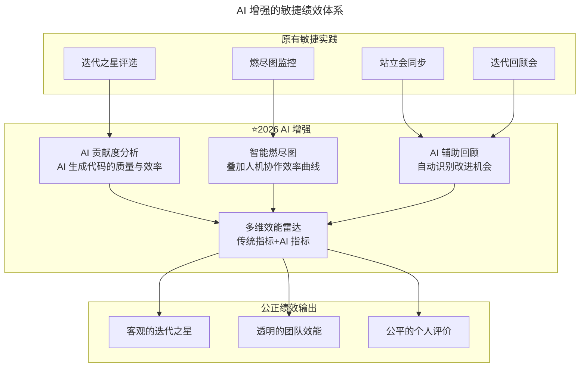

# 第169讲 | 高琦：如何给研发打绩效不头疼而又公正？

> **适用范围**：CTO、技术 VP、研发团队负责人、敏捷 Coach，以及希望用敏捷透明度提升绩效公正性的管理者。
>
> **更新摘要（v2 · 2026-08 更新）**：
> - 结构化升级为 6 节骨架（导言 / 核心方法论 / 关键流程 / 工具与实战 / 常见误区 / 进阶延展）
> - 合并原文（上）"敏捷带来的透明度"与（下）"四种绩效方式实践"两篇内容
> - 保留"迭代之星评选""燃尽图""唯数据论博弈""360 度环评""对 OKR 的误解""靠技术领导者个人感觉"等核心内容
> - 将"AI 时代升级注解（2026）"统一融入进阶延展，补充 AI 增强的敏捷绩效体系与六象限雷达图升级
> - 补充 Mermaid 图标题与图后解读

## 1. 导言

每次到了绩效考核的那段时间，我都非常纠结，即使最终做完了决定，还是常常感到无法满意，偶尔收到一些新信息后又会对之前的决定感到懊悔，觉得自己没有考虑周全，做到足够公正。后来和很多技术领导者沟通后，发现大家都对此有相同的感受，越希望追求客观公平的人越纠结。

后来团队的一个变化，突然使得打绩效的问题变得非常简单，意外的收获让我大为惊喜。这个变化就是团队引入了敏捷开发流程。敏捷不是让打绩效突然变得简单且公正，而是让团队从开始就进行改变，最终使打绩效的过程变成一件自然而然、水到渠成的事情。

## 2. 核心方法论

### 2.1 透明是敏捷给打绩效带来的正面影响

给研发打绩效难，究其原因，研发本质上是一种有创造性的工作，程序员和艺术家有非常多相似的地方，既然是创造和创新，那么衡量就是一件很难的事情。

敏捷实践，敏捷的核心在于**透明、透明、透明**，重要的事情说三次。敏捷作为一种项目管理方式，其特点还有迭代、拆分子任务、站立会等等，能带来诸多好处。但是这里我们强调敏捷中的透明对打绩效的影响。

另外，需要强调的是，敏捷是一种项目管理方式，而不是一种工具。使用什么样的敏捷工具并不重要，比如我们团队反而更青睐白板、便签、笔和 excel。

### 2.2 唯数据论的博弈困局

有这样一种绩效流派是唯数据论，希望把一切工作量化，用数据来评判一切，这样就可以套用 KPI 的方式来进行考核。曾经有个兄弟团队的 Leader 突发奇想，用代码量和 bug 数来进行绩效考核，最后变成了程序员和考核者斗智斗勇，激发出了各种奇思妙想。要代码量就加注释，考核加入了去掉注释的功能，程序员就引入大量废代码，考核又加入自动分析有用代码覆盖率的功能，程序员就把各种一行可以解决的问题，写成多行。

可笑的是最终这个想法被放弃并不是因为考核者觉得斗不过程序员了，而是由于产品经理崩溃了。因为另一个指标是 bug 数，而程序员为了 bug 少，那就得保守，少做需求，原来一个需求 3 天可以完成，现在打死 5 天也完成不了了，项目进度突然变得异常缓慢。

虽然这种尝试失败了，但我认为数据在研发绩效考核中是可以发挥作用的，只是各种数据应该仅作为辅助参考，而不可以作为核心考核指标。一旦数据成为核心指标，必然会导致其中的参与者动作变形。

### 2.3 360 度环评的优劣

360 度环评在外企使用得比较多，初衷是想创造出一种相对公开透明的企业文化。优点是可以减小绩效只由直属领导主观评定导致的严重偏差。360 度考察的信息来源包括：来自上级监督者的自上而下的反馈（上级），来自下属的自下而上的反馈（下属），来自平级同事的反馈（同事），来自企业内部支持部门和供应部门的反馈（支持者），来自公司内部和外部客户的反馈（服务对象），以及来自本人的反馈。

虽然看起来 360 度环评是一种非常好的绩效实践手段，但在执行的过程中，这种绩效考核方式最大的问题还是在于主观因素过多，且上级、下级、同部门、相关部门共同打分之后各自的权重不好界定。但无论如何这种方式是利大于弊的，更需要反思的是为什么 360 度环评没有被国内的公司大量采用。我个人认为最大的困难在于各 leader 希望可以对自己的小团队有更好的控制，所以实施的关键在于顶层决策。

### 2.4 对 OKR 的误解与靠个人感觉的局限

很多公司都对 OKR 存在误解，他们推进 OKR，希望 OKR 能同时解决很多问题，包括绩效考核。从目标分解的角度看 OKR 和 KPI 是两种不同的方式，但从绩效考核的角度看，KPI 能和 360 度环评等概念并列，而 OKR 并不在其中，它并不解决绩效问题。例如谷歌就是使用 OKR 作为目标管理框架，360 度环评作为绩效考核工具。

**靠技术领导者的个人感觉**这种绩效考核方式是大部分团队所采用的，有一定的合理性，在没有更优的办法出来之前，这种办法通常是较为合理的，**宁肯用主观评价，也千万不要引入错误的量化指标**。但是弊端也非常明显：深入了解每个人非常耗费时间；每个人都有很大的认知偏差，这是人性的弱点，没人能完全克服。

## 3. 关键流程

### 3.1 敏捷过程中对绩效考核影响的关键点

透明主要由两个方面来体现，分别是评选迭代之星和燃尽图。

**1. 评选迭代之星**：每次迭代小组在完成一个迭代之后，都会开迭代总结会，在这个会议里有一个最终的评选，那就是每人一票，选出自己认可的对这个迭代贡献最大的人作为迭代之星，不能选自己。由于这个过程完全是由参与其中的人，根据本次迭代中每个人选择的需求难度、完成度、质量、代码 review 时代码的漏洞、帮助团队其他人的情况等等综合考虑的结果，而且因为一次迭代之星没有什么跟金钱相关的实际意义，就是团队共同的肯定，这里大家没有什么顾虑，被选为迭代之星的人就较为客观。

依据我们实践的经验，优秀的人很容易在这个过程中浮现出来，并且得到大家的一致认可。而到年终进行绩效考核的时候，荣获迭代之星次数最多的员工得到最高的评价，对于团队里面的每个人来说都是完全可以接受的，而且这个过程是一种良性的竞争。

**2. 燃尽图**：在小组之间进行对比和评判的时候，燃尽图是非常重要的参考。燃尽图是描述团队随着时间的推移而剩余的工作数量，可用于表示开发速度。好的迭代小组，由于其拆分任务颗粒度合适，对任务难度评估准确，团队成员相互熟悉代码，燃尽图会趋近于一条直线。从燃尽图中我们可以看出各团队出现的问题：

- 先鼓起后落下：程序员对自己极度自信或者在做计划时漏掉了一些事情，造成初期进度缓慢，成员到最后通过疯狂加班使整个曲线快速落下，但这会导致最终项目质量低下。
- 一开始一切正常，然后突然停止燃烧：任务划分太粗糙，导致团队对工作量估计错误。
- 先缓慢燃烧，然后到快燃尽的时候还剩下一堆没完成的任务：只能被推迟到下个迭代周期。

### 3.2 为什么敏捷一直都是雷声大雨点小

很重要的一个原因是，大部分团队在不了解敏捷核心的情况下，总是自以为是的进行简化，把非常关键的步骤精简掉了，导致最终敏捷流于形式。其次，敏捷教练也带来了一定的负面作用。另外，部分团队成员会抵制敏捷，因为敏捷会使得所有工作变得透明，能力不足的成员会瞬间受到很大的压力。最后，在实施敏捷的初期，相比于过去的管理方式，通常都是更费时间，而不是节省时间的。

## 4. 工具与实战

### 4.1 六象限雷达图：数据辅助参考

我曾经使用代码量、bug 数、bug reopen 数、接需求量、优化性能需求占比和加班时长这六个维度绘制雷达图来统计研发数据。以两个差别较大的程序员为例：其中一位与另一位相比，在代码量和 bug 数上都没有优势，在加班时长上明显要更少，但他实际完成需求量更多，bug 被 reopen 数也少很多，说明他的代码质量更好，勇于承担优化性能且较难的任务。

这张图其实是我在大家都不知情的情况下，偷偷用系统数据跑出来的，而且我也并没有用这样的数据进行绩效考核，但是这个数据仍然让我较为客观的发现了问题员工。由于不会将数据作为绩效考核的标准，员工进行人为干预的动力就不足，最终得出的结论也就更能接近实际情况。

### 4.2 不用敏捷也能借鉴的两个关键点

或许作为技术管理者你并不希望使用敏捷的方式，甚至不认为敏捷能极大的提升团队战斗力，但仍然可以尝试以下两个关键点：

1. 使团队成员相互了解其他人的工作，而不是仅让一个人负责一个独立模块，每个人能够对其他人的工作提出意见；
2. 在一定的迭代周期内，团队内部民主的选出大家认可的贡献最大的团队成员。

这两点是敏捷实践带给绩效考核最大的变化，这个变化是透明带来的，是团队认可的，是多维度的，也可以让技术领导者更加客观的看待自己团队中的每一位成员。

### 4.3 推荐的综合方式

总结之前提到过的诸多绩效考核实践和方法，比较好的一种方式是：**让敏捷团队自己评价成员，技术领导者主要参考这个评价指标，再以各种数据进行辅助，识别出最优成员和表现不佳成员，同时要多深入团队防止自己的主观误判**，最终让绩效结果更加公正透明，让人信服。

## 5. 常见误区

1. **唯数据论**：用代码量、bug 数等单一指标考核，必然导致参与者动作变形（加注释、写废代码、一行拆多行、少做需求）。
2. **把敏捷当作工具而非管理方式**：使用 TAPD 等平台但没深入理解敏捷本质，最终只起到一部分敏捷的效果。
3. **简化敏捷关键步骤**：把非常关键的步骤精简掉，导致最终敏捷流于形式，还浪费了时间。
4. **把 OKR 当绩效考核工具**：OKR 并不解决绩效问题，它并不在 KPI、360 度环评等绩效考核工具的行列。
5. **靠个人感觉但忽视认知偏差**：每个人都有很大的认知偏差，给人贴标签后下属会谨小慎微、包装自己，聪明的会包装自己的人得到更多机会，但整个团队实际受损。
6. **用数据衡量一般表现员工的差别**：数据只适用于发现极端情况（最出色和最不理想），衡量一般表现员工差别非常容易出现误差。
7. **将六象限雷达图作为绩效考核标准**：一旦数据成为核心指标就会导致动作变形，应仅作为辅助参考。

## 6. 进阶延展

### 6.1 AI 增强的敏捷绩效体系

2026 年，敏捷开发的透明度理念与 AI 数据采集能力完美结合。"迭代之星"评选可以融入 AI 协作维度，燃尽图可以叠加 AI 效率指标，让研发绩效考核更加立体。原文提到的"唯数据论"困境、"360 度环评主观性"、"领导者个人感觉偏差"三大难题，都可以通过 AI 技术得到显著缓解。关键是：**AI 消除的是"无意识偏差"，而非取代人的判断**。



上图展示了敏捷实践与 AI 增强层的结合：迭代之星评选叠加 AI 贡献度分析，燃尽图叠加人机协作效率曲线，站立会与回顾会叠加 AI 辅助回顾，最终汇聚到多维效能雷达，输出更客观的绩效评价。

### 6.2 "迭代之星"评选的 AI 时代升级

| 新增维度 | 评估方法 | 权重建议 |
|----------|----------|----------|
| **AI 工具善用度** | AI 代码生成占比、接受率、修改率 | 15% |
| **AI 输出质量** | AI 生成代码的 CR 通过率、Bug 率 | 15% |
| **AI 知识分享** | 分享 AI 使用技巧、帮助他人提升 AI 效率 | 10% |
| **人机协作创新** | 设计 AI 工作流、提出 AI 提效方案 | 10% |

### 6.3 智能燃尽图：2026 版本

传统燃尽图展示"剩余工作量随时间变化"。2026 年的智能燃尽图增加了第二曲线——AI 效率指数：

```
📈 双轴燃尽图示意：

剩余工作量 │╮
           │ ╰──╮
           │    ╰─────
           │
AI 效率指数 │      ╭╮
           │    ╭╯╰╮
           │  ╭╯   ╰──
           │╭╯
           └────────────→ 时间

- 主曲线：剩余 Story Points（传统）
- 副曲线：AI 辅助效率指数（新增）
  = (AI 完成任务数 / 总完成数) × (AI 代码质量分)

理想状态：两条曲线同步下降，表示 AI 高效助力交付
警示信号：工作量下降慢但 AI 效率高 → 可能过度依赖 AI，缺乏深度思考
```

### 6.4 原文四大问题的 AI 时代解答

| 原文问题 | AI 时代解法 |
|---------|------------|
| **唯数据论的博弈困局** | AI 多模态数据融合：单一指标可博弈，多维融合指标难以同时博弈 |
| **360 度环评的主观性** | AI 行为数据佐证：上级 30% + 同事 20% + 自评 10% + AI 行为数据 40% |
| **领导者个人感觉偏差** | AI 偏差预警：对比"评分"与"行为数据"一致性，偏差超阈值时预警 |
| **深入了解成本高** | AI 全景员工画像：5 分钟阅读即可了解员工全貌 |

### 6.5 六象限雷达图的 2026 升级版

| 原版象限 | ⭐2026 升级象限 | 数据来源 |
|----------|---------------|----------|
| 代码量 | **价值交付量** | Story Points 完成 + 业务影响力 |
| Bug 数 | **质量综合分** | Bug 数 + 代码复杂度 + 安全漏洞 |
| Reopen 数 | **一次通过率** | PR Review 通过率 + 测试通过率 |
| 接需求量 | **需求吞吐效率** | 需求完成量 / 投入工时 |
| 性能需求占比 | **技术债务控制** | 重构投入 + 技术债偿还率 |
| 加班时长 | **可持续性指数** | 加班强度 + 离职风险预警 |
| （新增） | **AI 增效系数** | AI 辅助完成的任务占比和质量 |

### 6.6 2026 年可执行建议

1. **快速启动方案（无需大改造）**：在现有迭代之星评选表格中增加 1-2 个 AI 相关选项；用 Copilot/Cursor 的企业版后台数据填充；无需改变现有流程，只需增加数据维度。
2. **透明度的 AI 加持**：原文强调"透明、透明、透明"，AI 可以让透明更进一步——所有数据实时可见，不仅是管理者看到。建议设置团队 Dashboard，每人可查看自己和团队的 AI 效能数据。
3. **避免新的博弈**：正如原文警告"不要用代码量考核"一样，也不要用"AI 使用率"作为硬性 KPI，否则会出现为了提高 AI 使用率而故意用 AI 写简单代码。**AI 数据只作参考，用于发现极端值，不作核心考核**。
4. **核心原则不变**：宁可用主观评价，也不要引入错误的量化指标；AI 数据是"增强"而非"替代"人的判断；透明是最好的防腐剂；深入团队，防止主观误判（AI 让你更容易做到）。

### 6.7 作者简介

高琦，搜狐社交产品中心总经理，TGO 鲲鹏会会员，2014 年加入搜狐，负责搜狐集团移动广告业务，负责搜狐移动端广告系统架构和性能优化，有效提升了业务指标，2017 年起，从零开始构建了搜狐资讯团队，产品在一年内日活突破百万。2018 年负责搜狐社交业务。

> *AI 不会让绩效变得"全自动公平"，但它能让偏差"可见"、让数据"可信"、让判断"有据"。*
