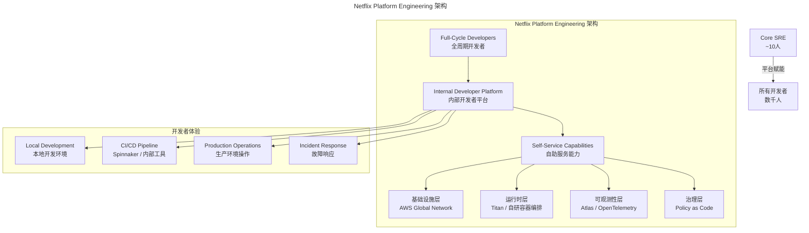
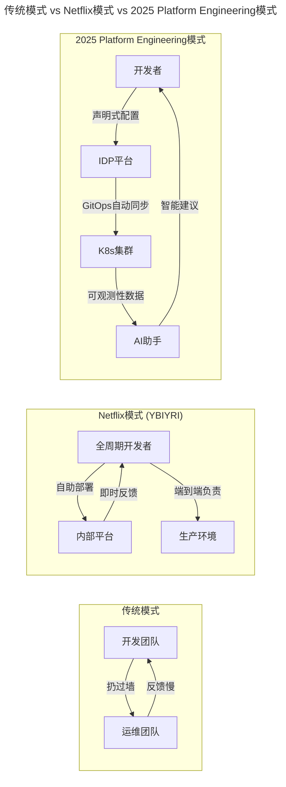
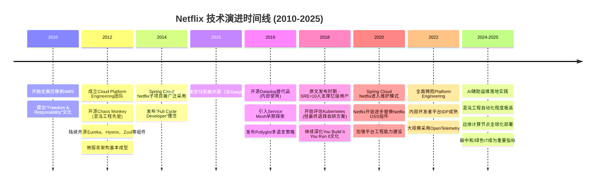
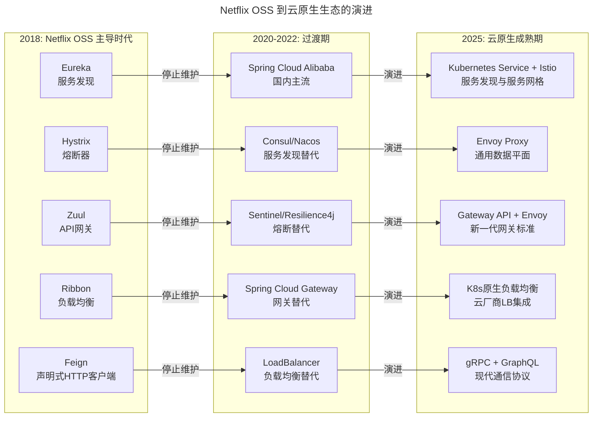
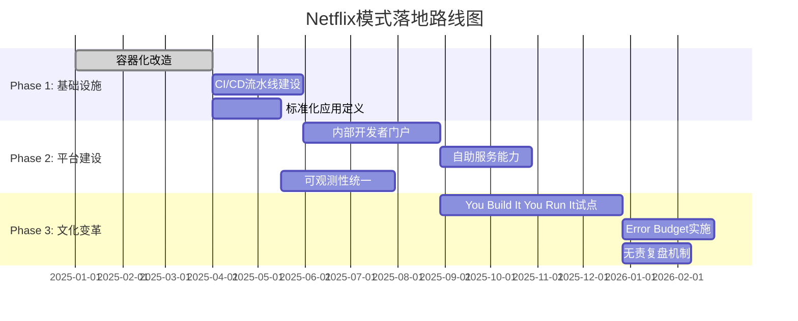
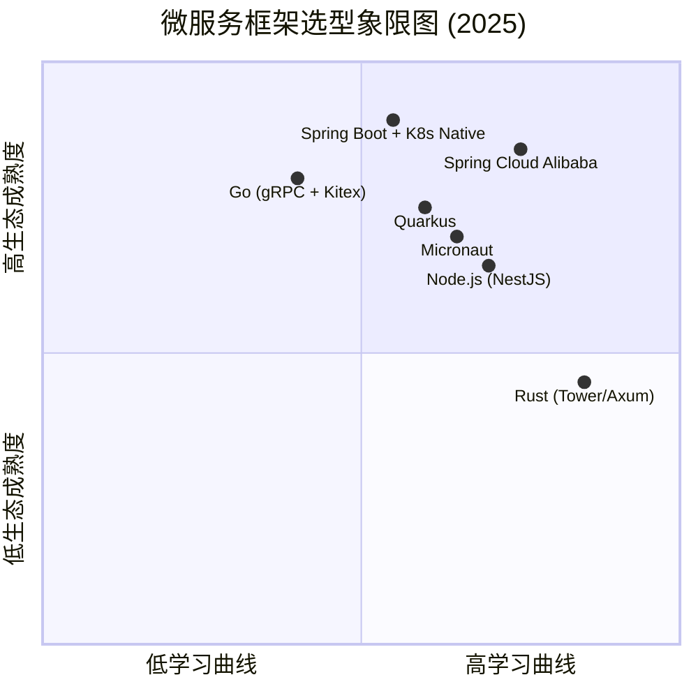

# 01 | 为什么Netflix没有运维岗位？

> **适用范围**：技术管理者、SRE/运维负责人、平台工程师、架构师；适用于微服务架构演进、平台工程体系规划、DevOps 文化落地等场景。
>
> **更新摘要（v2 · 2026-08 更新）**：
> - 结构化升级为 6 节骨架（导言 / 核心方法论 / 关键流程 / 工具与实战 / 常见误区 / 进阶延展）
> - 整合 Platform Engineering 视角与 Netflix 模式对照
> - 工具链对比统一收敛至「工具与实战」一节
> - 将原「延伸阅读」与「落地建议」并入「进阶延展」

---

## 1. 导言

> 📅 **原文发布**：2018-2019 | **本次更新**：2025-06 | **更新等级**：🔴全面重写增强

从行业实践来看，Netflix是业界微服务架构的最佳实践者，其基于公有云上的微服务架构设计、持续交付、监控、稳定性保障，均为业界提供了大量可遵从的原则和实践经验。

Netflix超前提出某些理念并付诸实践，以至于在国内众多互联网公司的技术架构上也可以看到似曾相识的影子。当然殊途同归也好，经验借鉴也罢，这都不影响Netflix业界最佳实践者的地位。

与此同时，在运维这个细分领域，Netflix仍然是最佳实践的典范。故这些内容开篇，将分析世界顶级的互联网公司如何定义运维以及如何开展运维工作。

---

## 2. 核心方法论

### 2.1 Netflix运维现状

准确而言，Netflix并无传统运维岗位，与运维对应的实为业界熟知的SRE（Site Reliability Engineer）。需明确SRE≠运维，**SRE理念的核心是：用软件工程的方法重新设计和定义运维工作**。

即改变此前依赖人工的运维方式，转而通过工具体系、团队协作、组织机制和文化氛围等方式进行变革，同时将此前处于研发体系末端的运维，提升至与开发同等重要的位置。

然而Netflix的核心优势在于，即便Google高度重视并大力发展的SRE岗位，在Netflix却仅有寥寥数人。据Netflix技术主管Katharina Probst于2018年9月更新的博客所述，在1亿用户、每日1.2亿播放时长、万级微服务实例的业务体量下，SRE人数不超过10个，此类角色被称为Core SRE。具体描述如下：

> 100+ Million members. 125+ Million hours watched per day. Hundreds of
>
> microservices. Hundreds of thousands of instances. Less than 10 Core
>
> SREs.

📌 **2025年更新数据**：
- Netflix 2024年全球订阅用户已超过 **2.8亿**
- 每日观看时长超过 **5亿小时**（截至2024年：公开观看报告显示半年观看总量约940亿小时）
- 微服务数量超过 **2000+**
- 实例数超过 **百万级**
- Core SRE人数依然保持在 **个位数**（约8-12人）

事实上，Netflix拥有强大的技术实力和全球最优秀的工程师团队。按照SRE的理念，完全可打造出一系列工具产品以取代传统运维和SRE工作。然能做到如此极致，确实值得深入研究：Netflix究竟如何实现？

### 2.2 为什么Netflix会做得如此极致？

此问题颇具研究价值。经大量阅读Netflix技术文章和公开演讲内容后，笔者认为可从Netflix的技术架构、组织架构、企业文化等维度进行分析。

#### 2.2.1 海量业务规模下的技术架构和挑战

如前所述，Netflix在业务高速发展及超大规模业务体量的驱动下，引入了更为灵活的微服务架构，且已成为业界最佳实践典范。

引入微服务架构后，软件架构的细化拆分和灵活多变显著提升了开发效率，继而提升了业务需求的响应和迭代速度，此亦为微服务思想在业界被广泛接受和采用的根本原因。

然微服务架构的引入亦非毫无代价，随之而来的是架构复杂度的大幅增加，且该复杂度已远超人力认知能力范围，即已无法依靠人工进行有效掌控，这为后续交付和线上运维带来了极大的难度与挑战。


此时，微服务架构下的运维必须依靠软件工程思路打造工具支撑体系，即要求微服务架构既能够支持业务功能，又能够提供和暴露更多在后期交付和线上运维阶段所需的基础维护能力。

试举数例：服务上下线、路由策略调整、并发数动态调整、功能开关、访问ACL控制、异常熔断和旁路、调用关系和服务质量日志输出等，均需在此能力基础上建设运维工具和服务平台。

基于上述分析可见，微服务架构模式下，运维已成为整体技术架构体系中不可或缺的组成部分，且与微服务架构体系紧密相连、不可拆分。

业界众多SRE相关文章对SRE产生原因的解释，多为缓解开发和运维之间的矛盾、树立共同目标、促进双方协作配合。此种理解虽无大碍，但笔者认为不够充分——上述内容仅为结果，而非根本原因。

笔者理解的根本原因为：微服务架构复杂度已达一定程度，远超单纯开发或单纯运维的职责范畴，亦超出单纯人力的认知掌控范围，故必须寻求在此架构之上更为有效和统一的技术解决方案以解决复杂度认知问题。**进而，在该统一技术解决方案基础上，开发和运维产生了新的职责分工与协作方式**。

目前业界火热的DevOps理念及衍生出的一系列话题，究其本质，亦基于同样的背景和逻辑。DevOps旨在解决开发和运维之间日益严重的矛盾，而根本原因仍在于微服务架构带来的技术复杂度持续提升。

> **Netflix启示一**：微服务架构模式下，必须转换思路重新定义和思考运维，运维须与微服务架构本身紧密结合。

#### 2.2.2 2025年补充：Platform Engineering视角下的Netflix模式



上图展示的 Netflix Platform Engineering 架构，其本质可归纳为「平台赋能 + 开发者自助」。Core SRE 仅约 10 人，但他们构建的 IDP（Internal Developer Platform）支撑着数千名 Full-Cycle Developers 端到端负责自己服务的全生命周期。

**关键洞察**：

Netflix的模式本质上就是 **Platform Engineering 的终极形态**：

1. **Full-Cycle Developers（全周期开发者）**：每个开发者对自己构建的服务端到端负责，从设计、开发、测试、部署到运维
2. **高度抽象的平台层**：屏蔽底层复杂性，开发者只需关注业务逻辑
3. **极简的核心SRE团队**：专注于平台产品本身，而不是业务应用的运维
4. **强大的自服务体系**：90%以上的日常操作由开发者自助完成

这与2022年后兴起的 **Internal Developer Platform (IDP)** 理念完全一致：

- Netflix早在2014年就提出了类似的概念
- 他们将其称为 **"Paved Road"（铺好的路）**：为开发者提供标准化的、经过验证的技术路径
- 避免每个团队重复造轮子，同时又不限制创新空间

#### 2.2.3 更加合理的组织架构和先进的工具体系及理念

如前所述，在微服务架构模式下，运维已成为整体技术架构和体系中不可分割的一部分，两者脱节将引发后续一系列严重问题。

从这一点来看，值得关注的是Netflix的前瞻性和技术架构能力。早在2012年甚至更早之前，Netflix即已意识到该问题。在组织架构上，将中间件、SRE、DBA、交付和自动化工具、基础架构等团队统一纳入云平台工程（Cloud and Platform Engineering）团队，在产品层面进行统一规划和建设，从而最大程度地发挥组织能力，避免开发和运维的脱节。

该团队不仅未令业界失望，反而带来了诸多惊喜。业界大名鼎鼎的NetflixOSS开源产品体系中，绝大部分产品均由该团队贡献。

> **Netflix带给我们的启示二**：合理的组织架构是保障技术架构落地的必要条件，用技术手段来解决运维过程中遇到的效率和稳定问题才是根本解决方案。

#### 2.2.4 自由与责任并存的企业文化

基于上述分析，似乎即为SRE常见的理念和实践，仅Netflix在开源和分享上更为开放和透明，使业界有机会了解更多细节。然Netflix何以做到如此极致？此前的分析似未完全回答该问题，故此处必须探讨Netflix的企业文化。

Netflix的企业文化为 **Freedom & Responsibility**（自由与责任并存），即在高度自由的同时，要求员工具备更强的责任心和Owner意识。

体现在技术团队中即为：You Build It, You Run It。工程师可随时向生产环境提交代码或发布新服务，但同时作为Owner，须对所发布代码和线上服务的稳定运行负责。

在此种文化驱动下，技术团队自然会考虑从开发设计阶段到交付和线上运维阶段的端到端整体解决方案，而非开发仅负责需求开发、后期交付和维护交由运维角色负责。在Netflix的文化体系下，绝对不允许此种情况存在——作为开发，即为Owner，须端到端负责。

故短短两个英文单词——Freedom & Responsibility，从源头上即决定了团队和员工的工作方式。

#### 2.2.5 You Build It, You Run It 的现代化诠释



上图揭示了运维职责归属的三种范式：从「扔过墙」式协作，到 YBIYRI 端到端负责，再到 2025 年以 IDP + GitOps + AI 助手为特征的 Platform Engineering 模式，开发者与平台的关系逐步由「人工提单」演化为「声明式协作」。

**文化落地的关键要素（2025版）**：

1. **Error Budget（错误预算）**：
   - Google SRE提出的概念，Netflix深度实践
   - 在可靠性和迭代速度之间取得平衡
   - 示例：如果月度SLO是99.9%，允许43分钟宕机时间
   - 如果错误预算未耗尽，开发团队可以快速发布新功能
   - 如果接近耗尽，则必须专注于稳定性改进

2. **Blameless Postmortem（无责复盘）**：
   - 故障复盘聚焦于流程和系统改进，而非个人追责
   - 鼓励透明分享失败经验
   - 建立"心理安全"环境

3. **减少审批层级**：
   - 通过自动化测试和部署流水线减少人工审批
   - 使用特性开关（Feature Flags）控制发布风险
   - 渐进式发布（Canary/蓝绿部署）降低回滚成本

4. **数据驱动的决策**：
   - 所有决策基于度量指标（DORA metrics, SPACE framework）
   - 定期进行开发者体验调查
   - 持续优化平台产品和工具链

> **Netflix启示三**：Owner意识至关重要，正确的工作方式需要引导，此即优秀与极致的差距。

---

## 3. 关键流程

### 3.1 Netflix技术栈演进时间线



时间线揭示了 Netflix 的关键节奏：从 2010 年全面上云，到 2014 年提出 Full Cycle Developer，再到 2022 年全面拥抱 Platform Engineering，技术演进与文化变革始终相伴相生。

### 3.2 从Netflix OSS到现代云原生生态的变迁



上图刻画了 Netflix OSS 五大组件从「主导时代 → 过渡期 → 云原生成熟期」的演进路径，社区与 Netflix 自身均已转向 Kubernetes 原生与 Service Mesh 体系。

### 3.3 Spring Cloud Netflix 子项目现状（2025年必读）

⚠️ **Spring Cloud Netflix 子项目现状**：

| 组件 | 最后发布版本 | 维护状态 | 推荐替代方案 |
|------|------------|---------|-------------|
| Spring Cloud Netflix Eureka | 2020.0.0 (March 2020) | ⚠️ 仅安全补丁 | Kubernetes Native Service Discovery, Consul, Nacos |
| Spring Cloud Netflix Hystrix | 2.2.6.RELEASE (Nov 2020) | ❌ 停止维护 | Resilience4j, Sentinel, Spring Circuit Breaker |
| Spring Cloud Netflix Zuul | 2.2.8.RELEASE (May 2021) | ❌ 停止维护 | Spring Cloud Gateway, Kong, APISIX |
| Spring Cloud Netflix Ribbon | 2.2.9.RELEASE (Aug 2021) | ❌ 停止维护 | Spring Cloud LoadBalancer (Blocking), Reactor Netty |
| Spring Cloud Netflix Feign | 11.x (part of OpenFeign) | ✅ 迁移至独立项目 | OpenFeign (继续维护), gRPC, GraphQL |
| Spring Cloud Netflix Archaius | 2020.0.0 | ⚠️ 维护模式 | Spring Cloud Config, HashiCorp Vault, AWS Parameter Store |
| Spring Cloud Netflix RxJava | 2020.0.0 | ❌ 停止维护 | Project Reactor, RxJava 3 (独立维护) |

**为什么会发生这种变化？**

1. **Pivotal 公司被收购**：
   - 2019年：VMware 收购 Pivotal
   - 2023年：Broadcom 收购 VMware
   - 这导致Spring Cloud Netflix项目的投入大幅减少

2. **技术债务累积**：
   - 这些项目基于早期的RxJava 1.x，与现代Reactive编程模型不兼容
   - 与Spring Boot/Spring Cloud新版本的集成越来越困难

3. **社区转向更优方案**：
   - Kubernetes原生服务发现逐渐成熟
   - Service Mesh（Istio, Linkerd, Cilium）提供更好的流量管理
   - 云原生生态提供了更灵活的选择

4. **Netflix自身也在转型**：
   - Netflix不再大规模使用这些开源组件
   - 转向更加定制化的内部解决方案
   - 更深度地整合AWS原生服务

### 3.4 在你的组织中借鉴 Netflix 模式（落地路线图）



落地 Netflix 模式不是一次性大动作，而是分三阶段渐进推进：基础设施先行 3 个月，平台建设紧随其后 6-12 个月，文化变革则需持续进行。

**具体行动项**：

1. **容器化和Kubernetes迁移**
   - 目标：所有新应用必须容器化部署
   - 工具：使用云厂商托管K8s服务（EKS/GKE/AKS）
   - 标准：制定Pod Security Standards，强制资源限制

2. **建立CI/CD流水线**
   - 推荐：GitHub Actions + ArgoCD（GitOps模式）
   - 要求：
     - 自动化单元测试覆盖率 >80%
     - 集成测试环境自动部署
     - 生产环境需要Approval Gate

3. **定义标准化的应用模型**
   ```yaml
   # 示例：Application CRD 定义
   apiVersion: core/v1
   kind: Application
   metadata:
     name: user-service
     owner: platform-team
     tier: tier-2  # 核心等级
   spec:
     description: "用户中心微服务"
     language: Java 17
     framework: Spring Boot 3.2
     resources:
       requests:
         cpu: "500m"
         memory: "1Gi"
       limits:
         cpu: "2"
         memory: "4Gi"
     scaling:
       minReplicas: 3
       maxReplicas: 20
       targetCPUUtilization: 70
     observability:
       tracing: enabled
       metrics: enabled
       logging: json
   ```

### 3.5 阶段二：平台工程能力建设（6-12个月）

1. **搭建Internal Developer Portal**
   - 工具选择：Backstage（开源）或自建
   - 核心功能：
     - 软件目录（Software Catalog）：所有服务的统一视图
     - 模板库（Template Library）：一键创建新服务
     - 文档中心：自动生成API文档、架构文档
     - 插件市场：集成Jira、PagerDuty、Grafana等

2. **实现Self-Service能力矩阵**

| 能力域 | 自助服务内容 | 目标自助率 |
|--------|------------|----------|
| **环境创建** | 创建dev/staging/prod环境 | >95% |
| **数据库申请** | 申请MySQL/Redis实例 | >90% |
| **域名/DNS** | 配置域名解析 | 100% |
| **证书管理** | 申请SSL/TLS证书 | >95% |
| **监控告警** | 配置SLO/SLI和告警规则 | >80% |
| **权限管理** | RBAC配置 | >90% |
| **发布部署** | 触发发布和回滚 | >90% |
| **容量规划** | 查看和申请资源扩容 | >70% |

3. **建设可观测性平台**
   - 数据采集：OpenTelemetry Collector
   - 存储：
     - Metrics: Prometheus / VictoriaMetrics
     - Traces: Tempo / Jaeger
     - Logs: Loki / Elasticsearch
   - 可视化：Grafana
   - 告警：Alertmanager + PagerDuty

### 3.6 阶段三：文化和组织变革（持续进行）

1. **推行You Build It, You Run It文化**
   - 选择1-2个先锋团队试点
   - 为开发者提供充分的培训和支持
   - 建立导师制度（Buddy System）

2. **实施Error Budget机制**
   - 定义清晰的SLO（参考Google SRE实践手册）
   - 建立SLO Dashboard实时展示
   - 将Error Budget消耗纳入发布决策流程

3. **建立Blameless Postmortem流程**
   - 故障发生后24小时内召开初步复盘
   - 一周内产出正式Postmortem文档
   - 重点：What happened? Why? How to prevent? Action Items

---

## 4. 工具与实战

### 4.1 关键技术组件状态更新（2025版）

| 原文提到的技术 | 2019年状态 | 2025年状态 | 替代方案/当前最佳实践 |
|---------------|-----------|-----------|---------------------|
| **Spring Cloud Netflix** | 主流方案 | ❌ 全部进入维护模式或停止维护 | Spring Cloud Alibaba, Micronaut, Quarkus |
| **Spinnaker** | CD工具代表 | ✅ 仍在活跃开发，但市场份额下降 | ArgoCD (GitOps), Flux, Jenkins X |
| **Eureka** | 服务发现标配 | ❌ 停止维护 | Kubernetes Service, Consul, Nacos, Istio |
| **Hystrix** | 熔断器首选 | ❌ 停止维护（限制并发） | Resilience4j, Sentinel, Envoy (service mesh) |
| **Zuul 1.x** | API网关 | ❌ 停止维护 | Spring Cloud Gateway, Kong, APISIX, Envoy |
| **Ribbon** | 客户端负载均衡 | ❌ 停止维护 | Spring Cloud LoadBalancer, Istio sidecar |
| **Chaos Monkey** | 混沌工程鼻祖 | ✅ 仍在使用，但已进化为Chaos Engineering套件 | Chaos Toolkit, Litmus, Gremlin |
| **Docker** | 容器化唯一选择 | ✅ 仍主流，但生态多元化 | containerd (默认runtime), Podman, nerdctl |

### 4.2 工具链对比（2019 vs 2025）

| 维度 | 原文推荐(2019) | 当前推荐(2025) | 变更原因 |
|------|---------------|----------------|---------|
| **CD工具** | Spinnaker | ArgoCD / Flux | GitOps更简单、声明式、审计友好 |
| **服务发现** | Eureka | Kubernetes Service + DNS | K8s原生能力足够强大 |
| **熔断器** | Hystrix | Resilience4j / Sentinel | Hystrix停止维护，性能更好 |
| **API网关** | Zuul | Spring Cloud Gateway / Kong | 性能更好，插件生态丰富 |
| **配置中心** | Archaius / Spring Cloud Config | GitOps + External Secrets Operator | 声明式、版本化管理 |
| **负载均衡** | Ribbon | Kubernetes Service / Istio | 服务网格提供更细粒度控制 |
| **混沌工程** | Chaos Monkey | Chaos Toolkit / Litmus | 支持更多场景，K8s原生 |
| **监控** | Atlas (内部) | Prometheus + Grafana + OTel | 开源标准，生态繁荣 |
| **日志** | 内部ELK变体 | Loki / Elastic | 成本更低，查询更快 |
| **追踪** | Zipkin | Jaeger / Tempo | 与OTel无缝集成 |
| **容器编排** | Titan (自研) / EC2 | Kubernetes v1.32+ | 行业事实标准 |
| **服务网格** | 早期探索 | Istio / Cilium | 生产级可用，性能优化 |
| **开发者门户** | 内部工具 | Backstage | 开源、可扩展、社区活跃 |

### 4.3 推荐的新技术选型组合（2025）



选型象限图显示，2025 年「Spring Boot + K8s Native」与「Spring Cloud Alibaba」仍是生态成熟度与学习曲线综合最优的两个选项；新兴语言如 Rust 在生态成熟度上仍处爬坡期。

**对国内企业的影响和建议**：

✅ **如果你还在用Spring Cloud Netflix**：
- 不要恐慌，现有系统可以继续运行
- 新项目避免使用这些组件
- 制定迁移路线图，优先迁移高风险组件（如Hystrix）

---

## 5. 常见误区

> 💡 **基于Netflix实践和社区经验的提醒**：

### 5.1 ✅ 可以借鉴的做法

1. **从小范围试点开始**
   - 不要试图一次性复制Netflix的全部做法
   - 选择1-2个有意愿、有能力的团队作为先锋
   - 积累经验后再逐步推广

2. **投资平台产品，而不是人肉运维**
   - 将运维团队的职责从"执行操作"转变为"构建平台"
   - 度量指标：自助服务率、平均等待时间、平台NPS

3. **重视开发者体验（DevEx）**
   - 定期做开发者调研（季度 Survey）
   - 关注本地开发环境搭建时间、文档查找效率
   - 减少认知负荷：统一术语、简化流程

4. **建立清晰的应用生命周期管理**
   - 从创建到销毁的全流程自动化
   - 应用与资源的关联关系必须在CMDB中明确记录
   - 定期清理僵尸资源和无主应用

### 5.2 ⚠️ 常见陷阱和误区

1. **❌ 误以为"没有运维岗位"=不需要运维能力**
   - Netflix不是没有运维，而是运维能力**内化到了每个开发者**和**平台产品**中
   - 核心SRE团队虽然只有~10人，但他们构建的平台支撑着数千名开发者
   - **教训**：不要简单地取消运维岗位，而应该重新定义运维职责

2. **❌ 忽视组织的准备度**
   - Netflix的文化（Freedom & Responsibility）花了多年时间建立
   - 如果组织缺乏信任基础，强行推行YBIYRI会导致混乱
   - **建议**：先从Error Budget和Blameless Postmortem开始建立信任

3. **❌ 技术选型盲目追随Netflix**
   - Netflix很多工具是针对其特定场景定制的（如Titan而非K8s）
   - 对于大多数公司，Kubernetes + CNCF生态是更务实的选择
   - **原则**：学习思想，而不是照搬工具

4. **❌ 低估平台工程的投入成本**
   - 构建一个真正好用的IDP需要大量投入（通常需要6-18个月）
   - 需要跨职能团队：平台工程师、产品经理、UX设计师
   - **建议**：从Backstage等开源方案起步，快速验证价值

5. **❌ 忽视安全和合规要求**
   - Netflix主要面向C端用户，合规压力相对较小
   - 金融、医疗等行业需要额外关注：SOC2、GDPR、等保等
   - **提醒**：自助服务不等于无管控，需要在便利性和安全性间平衡

---

## 6. 进阶延展

### 6.1 2025年的核心建议

不要纠结于"要不要取消运维岗位"这个问题，而是要思考：

1. **如何将运维能力产品化、平台化？**
2. **如何让开发者能够自助完成80%以上的运维操作？**
3. **如何建立以应用为核心的标准化体系和生命周期管理？**
4. **如何在保障稳定性的同时，提升迭代速度？（Error Budget）**
5. **如何培养具有Owner意识的全周期开发者？**

### 6.2 总结

基于上述分析可见，Netflix在其技术架构、组织架构和企业文化等方面的独到之处，造就了其优秀的技术理念和最佳实践。从运维角度而言，无论是SRE还是DevOps，均被Netflix发挥至极致。

当然，Netflix能做到这一点，需要非常强大的技术实力和人才储备。当前虽无法直接套用，但这并不妨碍业界在某些经验和思路上的借鉴与学习。

例如，当前众多公司在采用微服务架构后，未充分考虑到后续基于微服务架构的运维问题。且在运维团队设置上，仍脱离整个技术团队，更未将其与中间件和架构设计等团队整合拉通进行建设，自然也就谈不上在产品层面的合理规划和建设。

由此导致的问题为：运维效率低下、完全依赖人工、线上故障频发且处理效率极低，开发和运维均处于非常痛苦的状态之中，运维团队和成员亦会遭遇转型和成长的障碍。

以上问题均亟待解决。通过本文分析，读者可了解Netflix的技术团队运作模式和思路。

### 6.3 Netflix官方资源

- [Netflix TechBlog](https://netflixtechblog.com/) - Netflix技术博客（持续更新）
- [Netflix GitHub](https://github.com/Netflix) - Netflix开源项目集合
- [The Netflix Culture Deck](https://jobs.netflix.com/culture) - Netflix文化手册（必读！）
- [Full Cycle Developers at Netflix](https://netflixtechblog.com/full-cycle-developers-at-netflix-a58c6936ee84) - 全周期开发者理念详解

### 6.4 平台工程相关

- [platformengineering.org](https://platformengineering.org/) - 平台工程官方社区
- [Team Topologies Book](https://teamtopologies.com/key-concepts) - 团队拓扑学（理解平台团队定位）
- [Humanitec's Platform Maturity Model](https://humanitec.com/blog/platform-engineering-maturity-model) - 平台成熟度模型

### 6.5 SRE & DevOps经典

- [Google SRE Books](https://sre.google/books/) - Google SRE系列书籍（免费下载）
- [The Site Reliability Workbook](https://sre.google/workbook/table-of-contents/) - SRE工作手册
- [Implementing Service Level Objectives](https://sre.google/sre-book/table-of-contents/#ch_monitoring-distributed-systems) - SLO实战指南

### 6.6 工具官方文档

- [ArgoCD Documentation](https://argo-cd.readthedocs.io/en/stable/) - GitOps CD工具
- [Backstage Documentation](https://backstage.io/docs/) - 开发者门户框架
- [OpenTelemetry Docs](https://opentelemetry.io/docs/) - 可观测性统一标准
- [Chaos Engineering Prerequisites](https://principlesofchaos.org/) - 混沌工程原则

