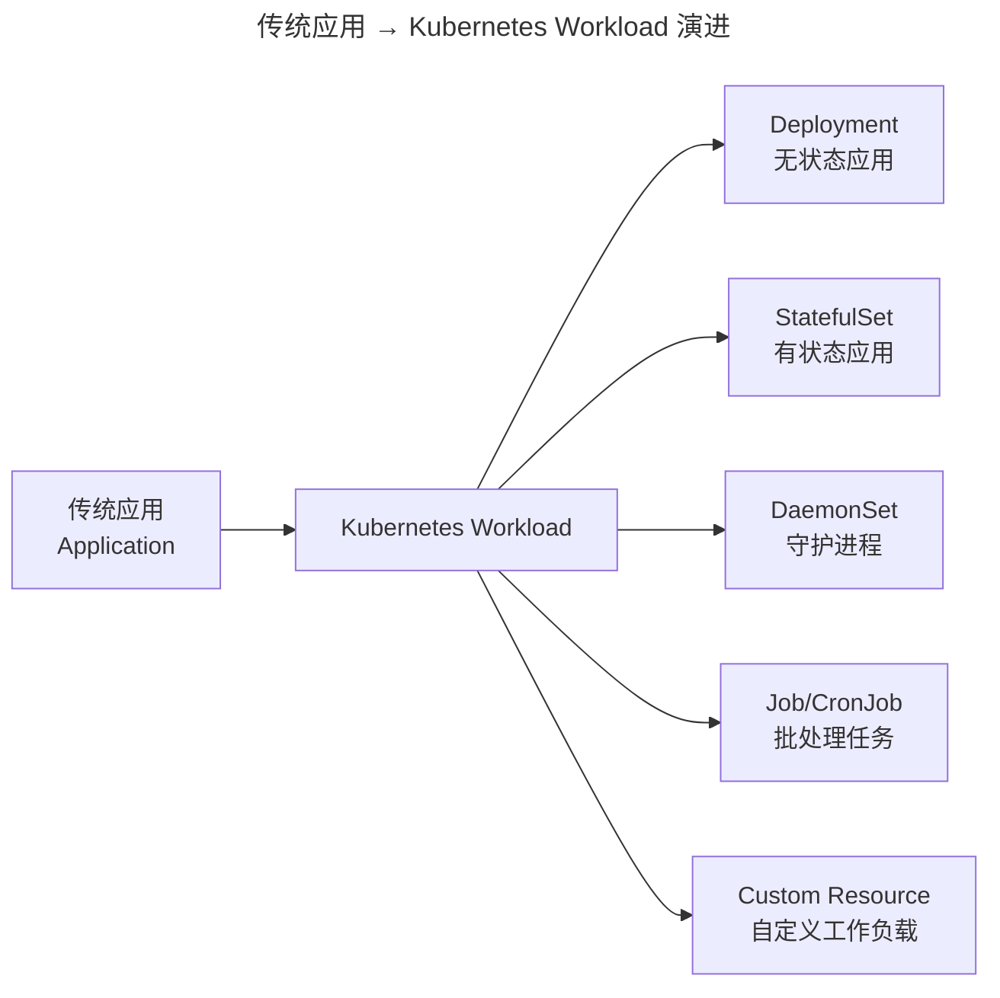
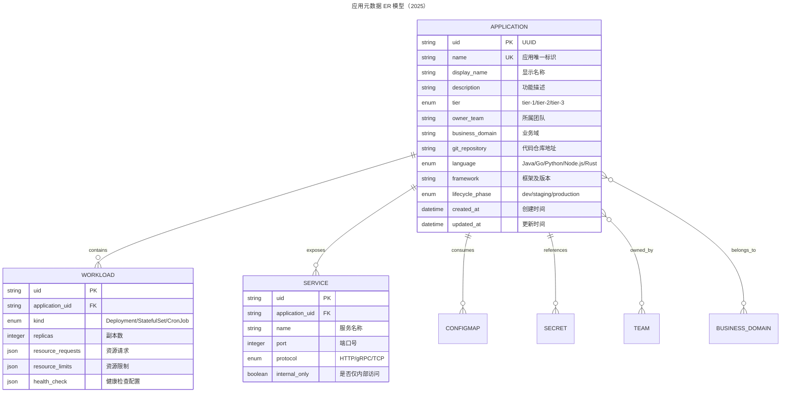
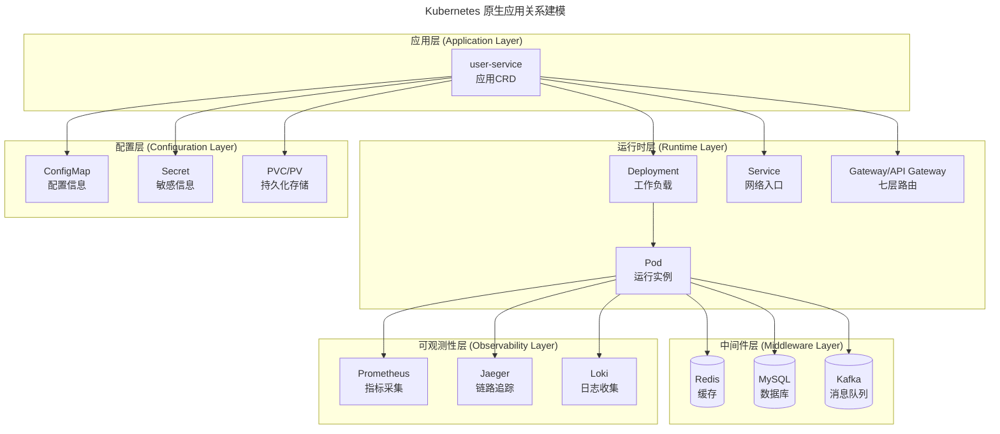
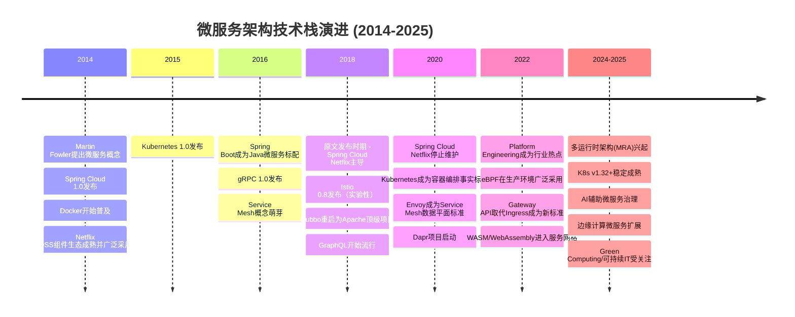
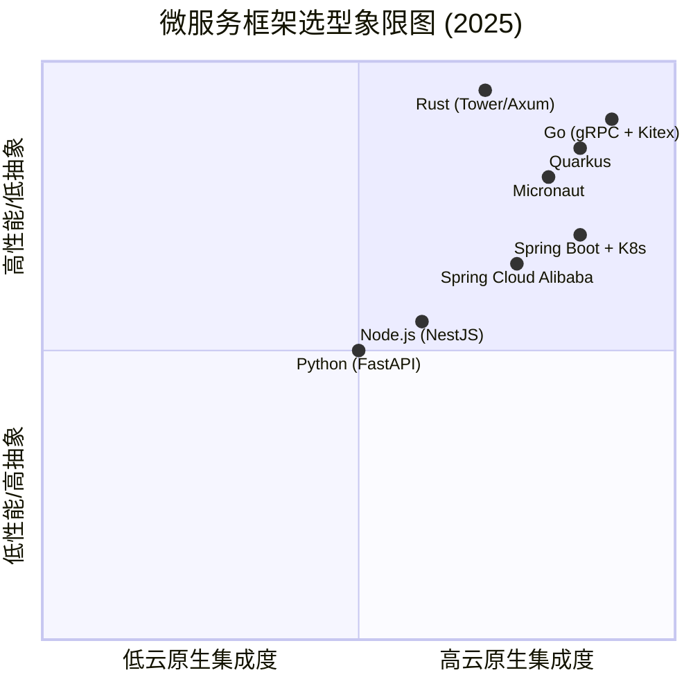
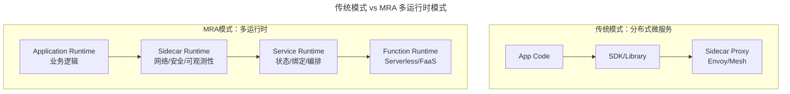
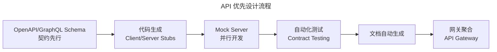
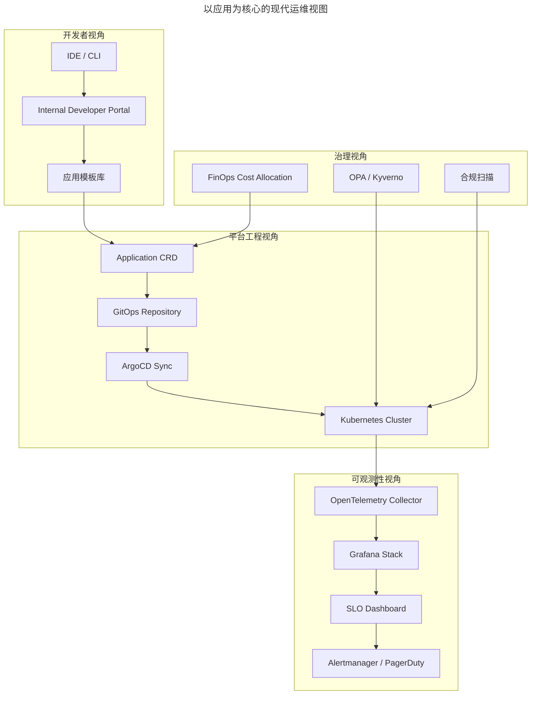
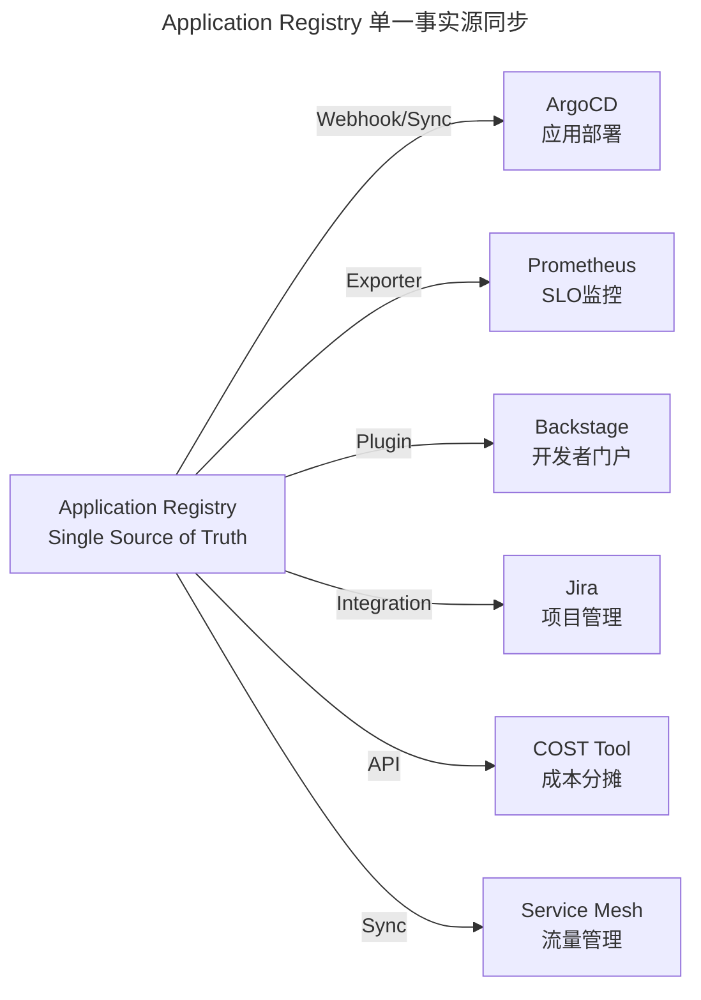
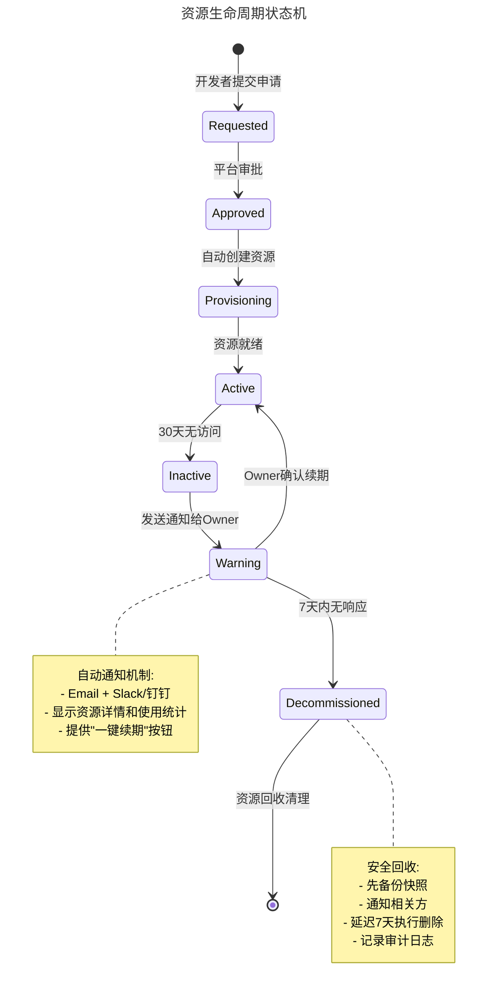

# 02 | 微服务架构时代，运维体系建设为什么要以"应用"为核心？

> **适用范围**：技术架构师、平台工程师、SRE、应用运维负责人；适用于微服务拆分、应用建模、CMDB/IDP 体系建设、平台工程落地等场景。
>
> **更新摘要（v2 · 2026-08 更新）**：
> - 结构化升级为 6 节骨架（导言 / 核心方法论 / 关键流程 / 工具与实战 / 常见误区 / 进阶延展）
> - 修正原文 mermaid 图语法笔误（mermind → mermaid）
> - 将「真实场景」「延伸阅读」「总结」统一并入进阶延展
> - 关键流程补充 Application Registry 单一事实源实施方案

---

## 1. 导言

> 📅 **原文发布**：2018-2019 | **本次更新**：2025-06 | **更新等级**：🔴全面重写增强

本文将阐述微服务架构模式下的一个核心概念：**应用**。

笔者将从以下方面展开：应用的起源、应用模型和应用关系模型建模以及实施路径。最终期望：**在微服务架构模式下，运维视角须转换至应用这一核心概念，一切应从应用维度分析与看待问题**。

---

## 2. 核心方法论

### 2.1 应用的起源

众所周知，微服务架构一般均从单体架构或分层架构演进而来。软件架构服务化的过程，即根据业务模型进行细化、切分出具备不同职责的业务逻辑模块的过程，每个微服务模块均提供相应的业务逻辑服务化接口。

概括而言，即一个字：**拆**！从单体工程拆分出N个独立模块。


上述模块可独立部署和运行，并提供相应的业务能力。拆分后的模块数量与业务体量和复杂度相关，少则几个、十几个，多则几十、几百个。为统一概念，通常将这些模块称为**应用**。

为确保每个应用的唯一性，为每个应用定义一个**唯一的标识符**（如APP-1、APP-2等），该唯一标识符称为应用名。

接下来，该"应用"定义将成为后续一系列微服务架构管理的核心概念。

### 2.2 从"应用"到"Workload"的演进（2025）

在Kubernetes和云原生生态中，"应用"的概念进一步演进为更通用的 **"Workload（工作负载）"**：



上图展示了「应用」概念在 K8s 时代的扩展：一个 Application 可对应多种 Workload 类型，运维视角从「部署包」升级为「声明式运行时模型」。

**关键区别**：
- **传统应用**：以代码仓库或部署包为单位
- **Kubernetes Workload**：以声明式配置（YAML）定义运行时行为
- **2025最佳实践**：使用Application CRD（Custom Resource Definition）将业务语义与基础设施解耦

示例：
```yaml
# 使用 Crossplane 或 KubeApps 的 Application CRD
apiVersion: apps/v1
kind: Application
metadata:
  name: user-service
  labels:
    app.kubernetes.io/name: user-service
    app.kubernetes.io/component: backend
    app.kubernetes.io/part-of: ecommerce
    app.kubernetes.io/managed-by: platform-team
spec:
  description: "用户中心微服务"
  owner: team-platform
  workloads:
    - apiVersion: apps/v1
      kind: Deployment
      name: user-service-deploy
  services:
    - name: user-service-api
      port: 8080
      type: ClusterIP
```

### 2.3 应用模型及关系模型的建立

上述定义的各个应用，均从业务角度进行拆分细化而成的业务逻辑单元。虽可独立部署和运行，但每个应用仅具备相对单一的业务职能。若要完成整体业务流程和目标，需与周边其他服务化应用交互。同时，该过程还需依赖各类与业务无直接关系、相对独立的基础设施和组件（如机器资源、域名、DB、缓存、消息队列等）。

故除应用实体外，还存在其他各类基础组件实体。同时，在应用运行过程中，需不断与这些组件产生并建立各种复杂的关联关系，这亦为后续运维带来诸多困难。

接下来须完成的，即应用模型及各种关系模型的梳理和建立——只有模型和关系梳理清楚，才能为后续一系列运维自动化、持续交付及稳定性保障打下良好基础。

#### 2.3.1 应用业务模型

应用业务模型，即每个应用对外提供的业务服务能力，并以API方式暴露给外部（以商品的应用业务模型为例）：


该业务模型通常由业务架构师在进行业务需求分析和拆解时设计，更多聚焦于业务逻辑，故从运维角度一般不会过多关注。

#### 2.3.2 应用管理模型

应用管理模型，即应用自身的各种属性（如应用名、应用功能信息、责任人、Git地址、部署结构（代码路径、日志路径及各类配置文件路径等）、启停方式、健康检测方式等）。其中，应用名为应用的唯一标识，以AppName表示。

此处可将应用类比为一个人：一个人通常具备身份证号码、姓名、性别、家庭住址、联系方式等属性，身份证号码即为该人的唯一标识。

#### 2.3.3 现代化应用元数据模型（2025）



ER 模型刻画了应用与 Workload、Service、ConfigMap、Secret、Team、BusinessDomain 之间的标准关联，是 Application CRD 设计的元数据蓝本。

**必填字段说明**：

| 字段 | 说明 | 来源 |
|------|------|------|
| `name` | 唯一标识符，建议格式：`{domain}-{service}` | 架构设计阶段确定 |
| `tier` | 服务等级，决定SLO目标和告警策略 | 业务架构评估 |
| `owner_team` | 责任团队，用于故障响应和容量规划 | 组织架构映射 |
| `git_repository` | 代码仓库地址，用于CI/CD流水线触发 | 开发阶段确定 |
| `lifecycle_phase` | 当前所处生命周期阶段 | 自动化流转 |

#### 2.3.4 应用运行时所依赖的基础设施和组件

- **资源层面**：应用运行所必需的资源载体有物理机、虚拟机或容器等，如果对外提供HTTP服务，就需要虚IP和DNS域名服务；
- **基础组件**：此部分即通常所说的中间件体系。例如应用运行过程中必然要存储和访问数据，这就需要有数据库和数据库中间件；想要更快地访问数据，同时减轻DB的访问压力，就需要缓存；应用之间如果需要数据交互或同步，就需要消息队列；如果进行文件存储和访问，就需要存储系统等。

从此处可挖掘出一条规律：**这些基础设施和组件均为上层一个个业务应用服务**。亦正是因业务和应用上的需求，才开启了它们各自的生命周期。若脱离了这些业务应用，它们并无单纯存在的意义。故**从始至终基础设施和组件均与应用这一概念保持紧密联系**。

理清该思路后，再梳理它们之间的关系将顺畅许多，分为两步：

**第一步，建立各个基础设施和组件的数据模型，同时识别出它们的唯一标识**。该思路与应用管理模型的梳理类似，以典型的缓存为例：每当申请一个缓存空间时，通常以NameSpace标识唯一命名，同时该缓存空间会有空间容量和Partition分区等信息。

**第二步，亦是最关键的一步，即识别出基础设施及组件可与应用名AppName建立关联关系的属性，或在基础组件的数据模型中增加所属应用等字段**。

仍以上述缓存为例：既然是应用申请的缓存空间，且为一对一的关联关系，既可直接将NameSpace字段取值设置为AppName，亦可增加一个所属应用字段，通过外键关联模式建立应用与缓存空间的关联关系。

相应地，对于消息队列、DB、存储空间等，均可参考上述思路进行。

通过上述梳理，即可建立出以应用为核心的应用模型和关联关系模型。基于该统一的应用概念，系统中原本分散杂乱的信息最终均被串联起来，应用亦将成为整个运维信息管理及流转的纽带。


#### 2.3.5 Kubernetes 原生的关系建模（2025）

在Kubernetes生态中，应用关系的表达方式已经标准化：



上图将应用、运行时、配置、中间件、可观测性五层关系通过 K8s CRD 与 Label 体系串联，是「以应用为核心」在云原生时代的具体表达。

**关键实践**：

1. **使用Label统一标识**
   ```yaml
   labels:
     app.kubernetes.io/name: user-service
     app.kubernetes.io/component: backend
     app.kubernetes.io/part-of: ecommerce
     app.kubernetes.io/managed-by: helm
     app.kubernetes.io/version: "1.2.3"
   ```

2. **Owner Reference机制**
   ```yaml
   # ConfigMap引用Application Owner
   metadata:
     ownerReferences:
     - apiVersion: apps/v1
       kind: Application
       name: user-service
       uid: <application-uid>
       controller: true
       blockOwnerDeletion: true
   ```

3. **ServiceEntry / ServiceImport（多集群）**
   ```yaml
   # 用于跨集群服务发现
   apiVersion: multicluster.x-k8s.io/v1alpha1
   kind: ServiceImport
   metadata:
     name: user-service-import
   spec:
     type: ClusterSetIP
     ports:
     - port: 8080
       protocol: TCP
   ```

---

## 3. 关键流程

### 3.1 微服务架构演进时间线



时间线呈现了微服务技术栈的代际更替：2014 年萌芽、2018 年 Netflix OSS 主导、2020 年云原生转折、2025 年进入多运行时与 AI 辅助治理阶段。

### 3.2 微服务框架生态变迁



象限图显示：Go（gRPC + Kitex）与 Rust（Tower/Axum）在性能与云原生集成度上均处于高位，但学习曲线也较陡；Spring Boot + K8s 仍是综合性价比之选。

### 3.3 2020-2025 年重要新概念

#### 3.3.1 多运行时架构（Multi-Runtime Architecture, MRA）

由Bilgin Ibryam提出的新范式：



MRA 模式将网络、可观测性、状态管理等非功能性关注点从应用代码中剥离，由专门的 Runtime 承载，是 Dapr、Knative 等项目的理论基础。

**核心思想**：
- 将微服务的非功能性关注点（网络、可观测性、状态管理等）从应用代码中剥离
- 每个关注点由专门的Runtime负责
- 应用开发者只需聚焦业务逻辑
- 代表实现：Dapr, Connectors (Knative)

**优势**：
- 语言无关：任何语言都可以使用统一的sidecar能力
- 可移植性：应用可以在不同环境间无缝迁移
- 标准化：通过API标准化常见分布式原语

#### 3.3.2 API优先设计（API-First Design）



API 优先通过契约先行、自动生成 Stub、契约测试，将上下游解耦，是微服务团队并行开发的关键流程。

**工具链**：
- **OpenAPI Specification (OAS 3.1)**：RESTful API标准
- **GraphQL**：Facebook开源的查询语言
- **gRPC + Protobuf**：高性能RPC框架
- **AsyncAPI**：事件驱动API规范
- **Postman / Insomnia**：API测试和文档工具

#### 3.3.3 渐进式交付（Progressive Delivery）

超越传统的蓝绿部署和金丝雀发布：

| 策略 | 描述 | 适用场景 |
|------|------|---------|
| **Blue-Green** | 两套完整环境切换 | 风险可控，资源成本高 |
| **Canary** | 小流量逐步放量 | 快速验证，需要精细控制 |
| **Feature Flags** | 功能开关控制发布 | A/B测试，快速回滚 |
| **Dark Launching** | 影子流量验证 | 数据库迁移等高风险场景 |

**推荐工具**：
- Argo Rollouts：Kubernetes原生渐进式交付
- Flagger：基于Istio/Gateway API的高级发布策略
- LaunchDarkly：企业级功能开关平台

### 3.4 以应用为核心的现代运维视图



上图从开发者、平台工程、可观测性、治理四个视角，描绘了「应用」作为统一标识如何贯穿端到端流程。

### 3.5 实施路线图：从混乱到有序

#### Phase 1: 统一应用注册中心（1-2个月）

**目标**：所有应用必须在CMDB/IDP中注册，获得唯一标识

**实施步骤**：

1. **定义应用命名规范**
   ```
   格式：{business-domain}-{service-name}
   示例：
   - ecommerce-user-service（电商-用户服务）
   - payment-order-processor（支付-订单处理）
   - search-product-indexer（搜索-商品索引）
   
   规则：
   - 全小写，单词间用连字符分隔
   - 长度不超过63字符（兼容DNS/K8s限制）
   - 不包含版本号、环境信息
   ```

2. **搭建应用注册门户**
   - 工具选择：Backstage Software Catalog 或自建
   - 必填字段：name, owner, description, lifecycle phase
   - 自动填充：git repository（从GitLab/GitHub API获取）

3. **强制注册门禁**
   - CI流水线检查：未注册的应用不允许部署到staging/prod
   - Git Hook：PR标题必须包含应用标识
   - 定期审计：扫描集群中的孤儿Workload

#### Phase 2: 关系图谱建设（2-3个月）

**目标**：建立应用间的调用关系和依赖关系

**数据来源**：

| 关系类型 | 数据源 | 采集方法 |
|---------|--------|---------|
| **HTTP调用** | Access Log / Service Mesh | 正则解析 / Envoy Access Log |
| **RPC调用** | gRPC / Dubbo拦截器 | Tracing Span |
| **消息队列** | Kafka / RocketMQ | Consumer Group订阅关系 |
| **数据库访问** | Slow Query Log / Proxy | SQL解析 |
| **缓存访问** | Redis Monitor / SDK Hook | Key Pattern分析 |

**可视化工具**：
- **Grafana Network Topology Plugin**：实时拓扑展示
- **ServiceMap (OpenTelemetry)**：自动生成依赖图
- **Backstage TechDocs**：静态架构文档

#### Phase 3: 自助服务平台（3-6个月）

**目标**：开发者可以通过应用标识自助完成80%以上的运维操作

**自助服务矩阵**：

| 操作类别 | 自助操作 | 实现方式 | 目标完成率 |
|---------|---------|---------|----------|
| **环境管理** | 创建/dev/staging/prod环境 | Terraform / Crossplane | >95% |
| **部署发布** | 触发部署、查看进度、回滚 | ArgoCD UI / CLI | >90% |
| **配置管理** | 修改ConfigMap/Secret | GitOps PR | >85% |
| **扩缩容** | 调整副本数、资源配额 | HPA / VPA | >90% |
| **监控查询** | 查看Grafana Dashboard | SSO集成 | 100% |
| **日志检索** | 搜索Loki/Elasticsearch | Explore UI | >95% |
| **链路追踪** | 查看Jaeger/Tempo Trace | Deep Link | >90% |
| **故障响应** | 查看On-call、触发PagerDuty | 集成插件 | >80% |
| **权限申请** | 申请RBAC权限 | Approval Workflow | >70% |
| **成本查看** | 查看应用成本分账 | OpenCost / Kubecost | >80% |

### 3.6 统一应用标识符（Single Source of Truth）方案

**核心原则**：

> **There should be ONE canonical source of truth for the application identity, and all systems must derive from it.**

**实施方案**：

1. **建立Application Registry（应用注册中心）**

```yaml
# 示例：Application Registry CRD
apiVersion: registry/v1
kind: ApplicationRegistry
metadata:
  name: user-service
spec:
  displayName: "用户服务中心"
  description: "负责用户认证、Profile管理、权限控制"
  owner:
    team: platform-team
    email: platform-team@company.com
    slack: "#platform-team"
  repositories:
    main: https://github.com/company/user-service
    docs: https://github.com/company/user-service/docs
  lifecycle:
    phase: production  # dev -> staging -> production -> deprecated -> retired
    createdAt: "2020-01-15"
    deprecatedAt: null
  classification:
    tier: tier-1  # 核心应用
    dataClassification: confidential  # 数据分级
    compliance: ["SOC2", "GDPR"]  # 合规要求
  techStack:
    language: Java 17
    framework: Spring Boot 3.2
    database: PostgreSQL 15
    cache: Redis 7
    messageQueue: Apache Pulsar
  slos:
    availability: 99.9%
    latency_p99: "200ms"
    error_rate: "0.1%"
```

2. **所有下游系统消费Registry数据**



Application Registry 通过 Webhook/Exporter/Plugin 三类通道，将应用身份同步给 ArgoCD、Prometheus、Backstage、Jira、成本工具、Service Mesh 等下游系统，确保全链路「同名同义」。

3. **强制命名一致性检查**

```python
# 示例：CI Pipeline中的命名检查脚本
import re
import requests

def validate_app_name(name: str) -> bool:
    """验证应用名是否符合规范"""
    pattern = r'^[a-z0-9]([a-z0-9-]*[a-z0-9])?$'
    return bool(re.match(pattern, name)) and len(name) <= 63

def check_registry_exists(app_name: str) -> bool:
    """检查应用是否已在Registry中注册"""
    response = requests.get(f"https://registry.internal/api/apps/{app_name}")
    return response.status_code == 200

# 在Pipeline中使用
if not validate_app_name(APP_NAME):
    raise ValueError(f"Invalid app name format: {APP_NAME}")

if not check_registry_exists(APP_NAME):
    raise ValueError(f"App {APP_NAME} not registered in Application Registry")
```

---

## 4. 工具与实战

### 4.1 真实场景一：缓存与消息队列无主化

从笔者实际观察和经历的场景来看，开发使用时即进行申请，初期尚能记住自己使用了哪些，然时间一长或申请过多便记不住。久而久之，线上存在一堆无用的NameSpace和Topic，但集群维护者不敢随意清理——因早已搞不清楚是谁使用的，甚至申请人已离职、今后是否再使用亦无人讲得清楚，越往后越难维护。

根本原因即为前文所述：过于片面地对待基础组件，未与应用的访问建立关联关系，亦无任何生命周期管理措施。

#### 2025 解决方案：资源生命周期自动化



状态机将「申请→审批→就绪→闲置→告警→回收」全流程自动化，并强制绑定 application label，从根源上消除无主资源。

**实施要点**：

1. **资源申请必须绑定应用标识**
   ```yaml
   # Redis Namespace 申请单
   apiVersion: cache/v1
   kind: RedisInstance
   metadata:
     name: user-service-cache
     labels:
       application: user-service
       owner: platform-team
       environment: production
   spec:
     capacity: 4Gi
     instance-type: redis-cluster
     ttl: 90d  # 90天自动过期提醒
   ```

2. **定期扫描僵尸资源**
   ```bash
   # 示例：查找30天无访问的Redis Namespace
   redis-cli --scan --pattern "*:user-service:*" | \
   while read key; do
     last_access=$(redis-cli object idletime "$key")
     if [ $last_access -gt 2592000 ]; then  # 30天 = 2592000秒
       echo "WARNING: Zombie key found: $key (idle: $((last_access/86400)) days)"
     fi
   done
   ```

3. **自动化回收流程**
   - 使用Terraform Operator / Crossplane管理资源声明周期
   - 集成Approval Workflow（Argo Workflows / Tekton）
   - 回收前自动通知Owner和相关Team

### 4.2 真实场景二：应用名不统一导致孤岛

按照前文所述，应用名应在架构拆分出一个个独立应用时即明确下来，并贯穿整个应用生命周期。

然大多数情况下，业务架构师或开发在早期仅考虑应用开发，未过多考虑整个应用生命周期问题，会下意识地默认后续事项由运维负责。故开发期间，只要将应用开发完成并将服务注册到服务配置中心上即认为完成。

而到了运维阶段，亦仅从软件维护角度出发，为便于资源和应用配置的管理，独立定义一套应用名体系以方便自身管理。

此时不统一的问题即出现：若持续交付和监控系统等运维平台亦独立开发，脱节问题将更严重。

一个个孤岛无法成为体系。当这些系统需要对接时，会发现需做大量应用名转化适配工作，带来诸多无谓的工作量，所谓的效率提升即成一句空话。


> 解决方案见 §3.6 统一应用标识符（Application Registry）。

### 4.3 工具链对比（2019 vs 2025）

| 维度 | 原文隐含方案(2019) | 当前推荐(2025) | 变更原因 |
|------|-------------------|----------------|---------|
| **应用注册** | Excel/自建CMDB | Backstage Catalog / Custom CRD | 标准化、可扩展、社区支持 |
| **关系发现** | 手动维护/Agent上报 | OpenTelemetry + Service Map | 自动化、实时、零侵入 |
| **配置管理** | 配置中心（Apollo/Nacos） | GitOps + External Secrets Operator | 声明式、版本化、审计友好 |
| **服务发现** | Eureka/Consul/ZooKeeper | Kubernetes DNS + CoreDNS | 云原生标准，无需额外组件 |
| **负载均衡** | Ribbon客户端LB | Kubernetes Service / Istio | 服务网格提供细粒度控制 |
| **API网关** | Zuul / Nginx | Kong / APISIX / Envoy Gateway | 性能更好，插件生态丰富 |
| **全链路追踪** | Zipkin / SkyWalking | Jaeger / Tempo + OTel | 统一标准，存储成本低 |
| **日志收集** | ELK Stack | Loki + Promtail / Fluent Bit | 成本更低，与Grafana生态集成 |
| **监控告警** | Zabbix / Nagios | Prometheus + AlertManager + Grafana | 云原生事实标准 |
| **混沌工程** | Chaos Monkey | Chaos Toolkit / Litmus / Gremlin | 支持更多场景，K8s原生 |
| **成本管理** | 无/Excel | OpenCost / Kubecost | 实时成本分摊，优化建议 |

---

## 5. 常见误区

> 💡 **基于多年实战经验的提醒**：

### 5.1 ✅ 推荐做法

1. **从Day 1建立应用标识符规范**
   - 在微服务拆分的第一天就定义命名规范
   - 将应用标识纳入Code Review checklist
   - 未注册的应用禁止合并到main分支

2. **投资应用关系图的自动化发现**
   - 不要试图手动维护调用关系（会过时）
   - 使用OpenTelemetry的Span自动构建依赖图
   - 结合Service Mesh的Traffic Config作为补充数据源

3. **将应用概念贯穿整个开发生命周期**
   - IDE插件：编码时就能看到应用上下文
   - CI/CD：所有操作基于应用标识
   - 监控/日志：自动打上应用标签
   - 成本核算：按应用维度分摊

4. **定期清理和维护**
   - 季度审计：识别僵尸应用和无主资源
   - 自动化：设置TTL和回收流程
   - 文档化：保持架构图和实际一致

### 5.2 ⚠️ 常见陷阱

1. **❌ 应用粒度不合理**
   - 太粗：单体巨石，失去微服务优势
   - 太细：爆炸式增长，管理复杂度失控
   - **原则**：围绕业务能力（Business Capability）边界拆分，参考DDD的限界上下文

2. **❌ 忽视应用的生命周期管理**
   - 只关注创建，忘记销毁
   - 导致大量僵尸资源占用
   - **建议**：建立完整的Lifecycle Policy，包括deprecation和retirement流程

3. **❌ 应用名与环境/版本耦合**
   - ❌ `user-service-prod-v2`
   - ✅ `user-service` （环境通过Namespace区分，版本通过Image Tag区分）
   - **好处**：简化配置，避免重复定义

4. **❌ 各系统各自为政**
   - 开发用的名字 ≠ 运维用的名字 ≠ 监控用的名字
   - **后果**：大量适配工作，数据孤岛
   - **解决**：建立Application Registry作为Single Source of Truth

5. **❌ 过度依赖人工协调**
   - 新增应用需要发邮件、走工单、等人审批
   - **目标**：自助服务率 >80%，平均等待时间 <5分钟

---

## 6. 进阶延展

### 6.1 总结

本文开篇即已提及，**微服务架构模式下的运维思路必须转变，须将视角转换至应用这一维度，从一开始即统一规划、将架构、开发和运维的工作拉通来看——此点与传统运维的思路完全不同**。

当然，此中亦有经验因素。虽微服务在国内被大量应用，但绝大多数技术团队的经验仍集中在开发设计层面。微服务架构下的运维经验，确实还需一个总结积累的过程。笔者亦是痛苦地经历了上述反模式，才总结积累下这些经验教训。

这也是笔者分享该思路的原因：**需转换视角，规划以应用为核心的运维管理体系**。

### 6.2 2025 年的核心观点升级

在云原生和Platform Engineering时代，"以应用为核心"的理念不仅不过时，反而更加重要：

1. **Kubernetes强化了这个理念**：一切皆Workload，Workload属于Application
2. **Platform Engineering落地的基础**：IDP的核心就是Application Catalog
3. **DevEx改善的前提**：只有应用概念清晰，开发者体验才能真正提升
4. **成本优化的依据**：FinOps需要精确的应用级别成本分摊
5. **安全合规的抓手**：基于应用的数据分类和权限控制更加合理

### 6.3 官方文档与权威资源

- [CNCF App Definition Working Group](https://tag-app-definition.cncf.io/) - CNCF应用定义工作组
- [OLM (Operator Lifecycle Manager)](https://olm.operatorframework.io/) - Kubernetes应用生命周期管理
- [Backstage Software Catalog](https://backstage.io/docs/features/software-catalog/) - 软件目录最佳实践
- [OpenTelemetry Semantic Conventions](https://opentelemetry.io/docs/specs/semconv/) - OTel语义约定（含应用属性标准）

### 6.4 推荐阅读

- **《Building Evolutionary Architectures》** by Neal Ford et al. - 进化式架构，指导如何设计适应变化的系统
- **《Data-Oriented Architecture》** - 数据导向架构，强调以数据流为中心的设计思维
- **《Domain-Driven Design》** by Eric Evans - 领域驱动设计，微服务拆分的理论基础
- **《Pattern: Microservice Architecture》** by Chris Richardson - 微服务架构模式大全（microservices.io）

### 6.5 开源项目参考

- [KubeApps](https://kubeapps.com/) - 应用商店和部署UI
- [Helm](https://helm.sh/) - Kubernetes包管理器
- [Kustomize](https://kustomize.io/) - 原生Kubernetes配置管理
- [Crossplane](https://crossplane.io/) - 控制平面，管理任意基础设施

