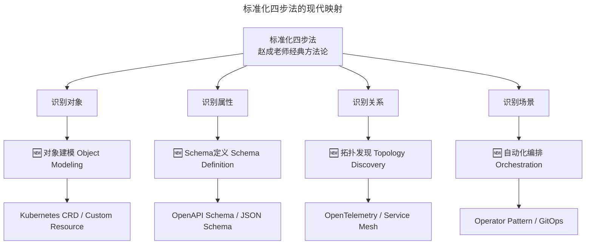
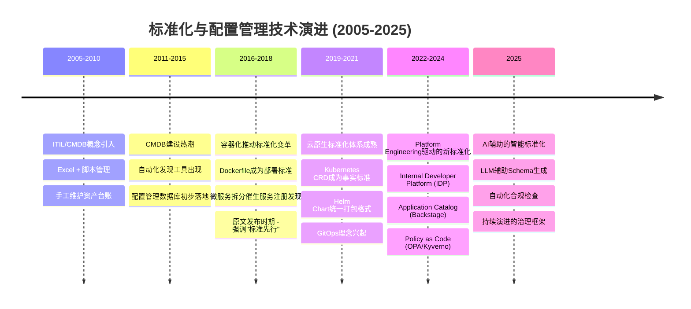
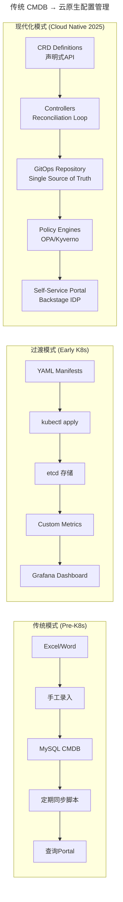
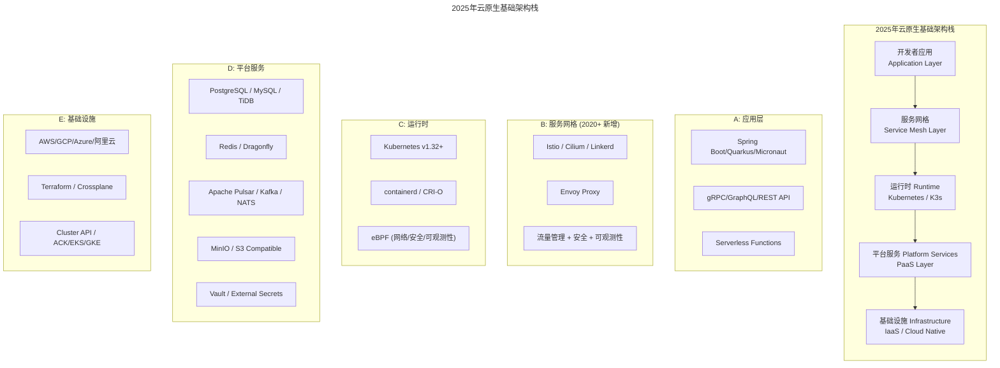
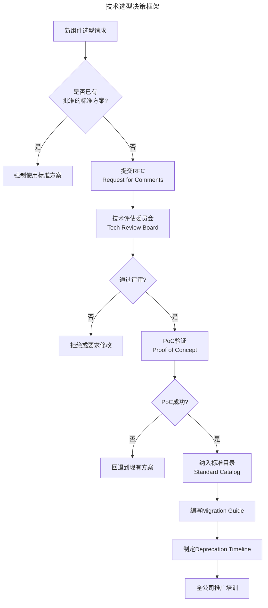
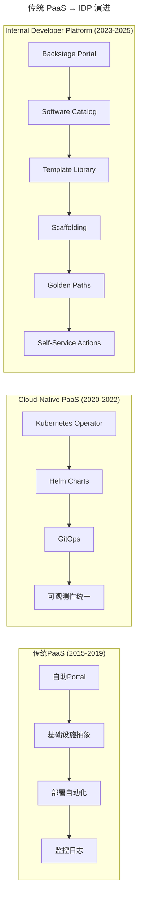
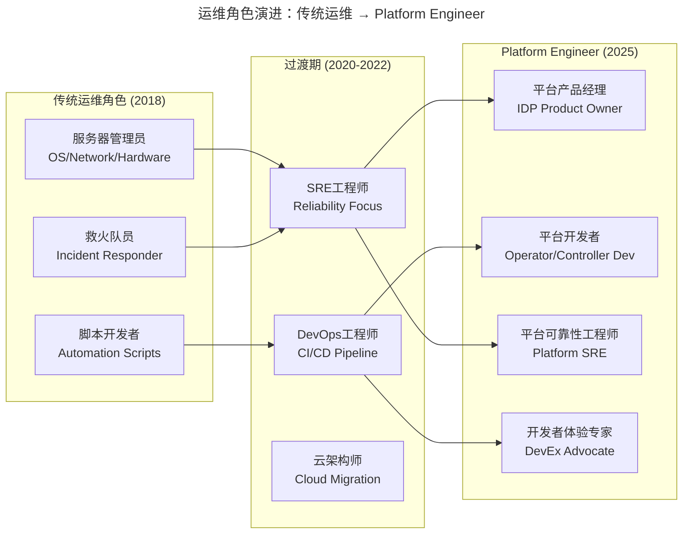
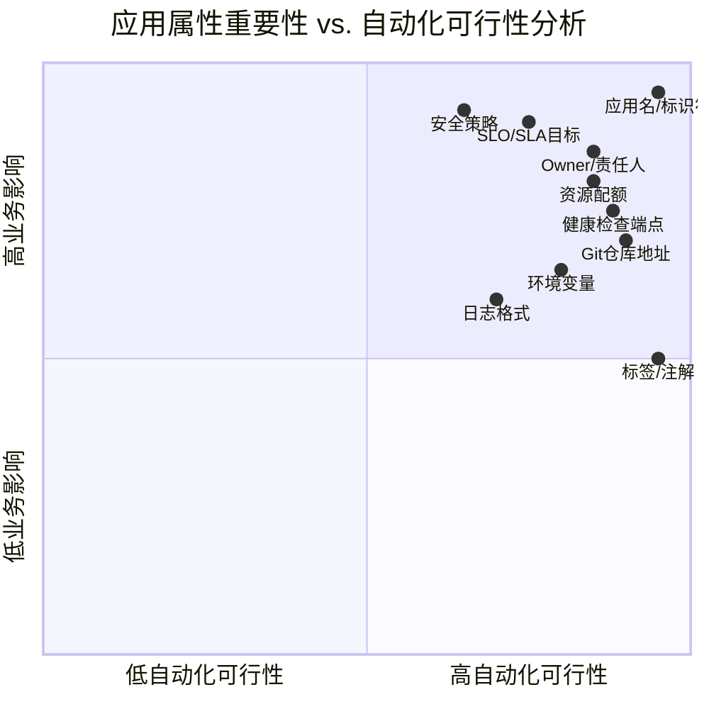
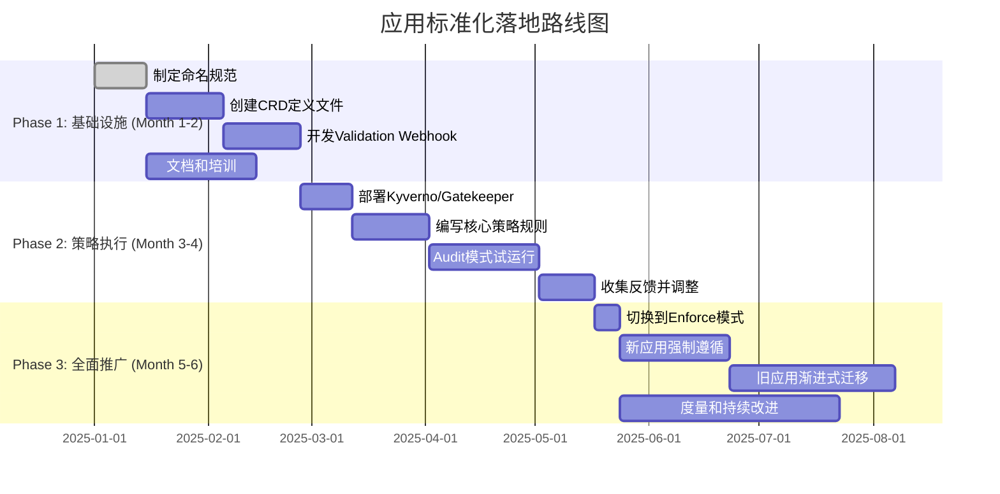

# 03 | 标准化体系建设（上）：如何建立应用标准化体系和模型？

> **适用范围**：技术架构师、平台工程师、运维负责人、SRE；适用于运维体系建设初期、CMDB/IDP 落地、基础架构标准化、技术选型治理等场景。
>
> **更新摘要（v2 · 2026-08 更新）**：
> - 结构化升级为 6 节骨架（导言 / 核心方法论 / 关键流程 / 工具与实战 / 常见误区 / 进阶延展）
> - 将原文上下两篇（应用标准化 + 基础架构标准化）整合为统一骨架
> - 所有 Mermaid 图补充 frontmatter（--- title: ... ---）
> - 「延伸阅读」与「思考问题」统一并入进阶延展

---

## 1. 导言

> 📅 **原文发布**：2018-2019 | **本次更新**：2025-06 | **更新等级**：🔴全面重写增强

本文将专门阐述标准化工作。此为运维过程中最基础、最重要，却亦是最易被忽视的环节。

笔者在多次公开演讲中，每当讲到此环节，通常会单独使用一页PPT，仅放四个字——字号加大加粗、重复三遍。这四个字即为"**标准先行**"。演讲过程中会大声强调"**标准先行，标准先行，标准先行**"，重要事项重复三遍，目的即反复强调该事项的重要程度，切勿忽视。


**运维工作的开展常不知从何下手，或上来即冲着工具和自动化而去，却始终不得章法——工具做了一堆，效率却并未提升。绝大多数情况下，问题和原因即为标准化这一基础工作未做扎实。**

本文分上下两篇：上篇讲应用标准化体系与模型，下篇讲基础架构标准化与服务化。两篇共同构成「标准先行」的完整方法论。

---

## 2. 核心方法论

### 2.1 为什么要做标准化？

**标准化的过程实质即对运维对象的识别和建模过程**。形成统一的对象模型后，各方在统一的认识下展开有效协作，然后针对不同的运维对象，再抽取出它们所对应的运维场景，接下来才是运维场景的自动化实现。

此类似于面向对象编程的思想——需遵循该思路，面对的即为一个个实体和逻辑运维对象。

在标准化过程中，先识别出各个运维对象，然后日常所做的所有运维工作均应针对这些对象的运维。若运维操作脱离了对象，则无任何意义。同样，未理清对象，运维自然不得章法。

例如扩容，则须先确定此处究竟是服务器的扩容、应用的扩容、还是其它对象的扩容。可见，对象不同，扩容场景所实施的动作完全不同。

若将服务器的扩容套用到应用的扩容上，必然导致流程错乱。同时对于对象理解上的不一致，亦会徒增无谓的沟通成本，造成效率低下。此种情况下的运维自动化不但不能提升效率，反而越自动越混乱。

此即为笔者每次连续强调三遍"标准先行"的原因。虽此事较为枯燥繁琐，但**于纷繁复杂中抽象出标准规范的内容，是后续一系列自动化和稳定性保障的基础**。万丈高楼平地起，故请勿忽略此项工作。

概括而言，标准化的套路如下：

- 第一步，**识别对象**；
- 第二步，**识别对象属性**；
- 第三步，**识别对象关系**；
- 第四步，**识别对象场景**。

接下来按照上述思路，分析基础设施层面和应用层面应识别出的运维对象。

### 2.2 标准化的现代诠释（2025）



标准化四步法在云原生时代映射为 Object Modeling → Schema Definition → Topology Discovery → Orchestration，每一步都有对应的 K8s 原生工具承载。

**2025年的关键变化**：

| 维度 | 2018-2019 | 2025 |
|------|----------|------|
| **建模工具** | ER图 / Excel | Kubernetes CRD + OpenAPI Schema |
| **数据存储** | 关系型数据库 (MySQL) | etcd / PostgreSQL + CRD Controller |
| **关系发现** | 手动维护 / Agent上报 | OpenTelemetry + Service Mesh自动发现 |
| **场景实现** | 脚本 / 自研平台 | Operator Pattern / Helm Charts / Terraform |
| **验证机制** | 人工Review | OPA / Kyverno 策略引擎自动校验 |
| **版本管理** | 无 / SQL迁移脚本 | GitOps + 声明式配置 |

### 2.3 基础设施层面的标准化

基础设施层面的运维对象应不难识别，因均为一个个物理存在的实体，可进行如下分析。

- 第一步，识别实体对象，主要有服务器、网络、IDC、机柜、存储、配件等。
- 第二步，识别对象的属性，例如服务器即有SN序列号、IP地址、厂商、硬件配置（如CPU、内存、硬盘、网卡、PCIE、BIOS）、维保信息等；网络设备如交换机亦有厂商、型号、带宽等信息。
- 第三步，识别对象之间的关联关系，例如服务器所在机柜，虚拟机所在的宿主机、机柜所在IDC等简单关系；复杂一点则有核心交换机、汇聚交换机、接入交换机以及机柜和服务器之间的级联关系等——这些相对复杂一些，即为常说的**网络拓扑关系**。

将以上信息梳理清楚，通过ER建模工具进行数据建模，再将上述信息固化到DB中，一个资源层面的信息管理平台即基本成型。

以服务器为例简单展示一下。


然信息固化非目的，亦无价值，只有信息动态流转起来才有价值。接下来需做的事情，即识别出针对运维对象所实施的日常运维操作有哪些，也就是**识别出运维场景是什么**。

- 第四步，仍以服务器为例，针对服务器的日常操作有采购、入库、安装、配置、上线、下线、维修等。此外，可能还会有可视化和查询的场景，如拓扑关系的可视化和动态展示、交换机与服务器之间的级联关系、状态（正常或故障）的展示等，可直观地关注到资源节点的状态。

完成上述工作后，才进入对上述运维场景的自动化开发阶段。可见，在真正执行工具和自动化平台开发之前，实需先做好大量基础准备工作。笔者再次强调此点，切勿忽视。

### 2.4 应用层面的标准化

接下来分析一个逻辑上的对象，即前文经常提到的运维核心：**应用**。对该逻辑对象的建模相对复杂一些，但仍可按照上述套路进行。

- 第一步，识别对象。

如前文所述，此识别过程在微服务架构设计或拆分时即确定下来。故严格而言，其不应是运维阶段才被识别出的，而是在之前设计阶段即被识别和确认，然后延伸至运维阶段。

- 第二步，识别对象属性。

一个应用为业务的抽象逻辑，故有业务和运维两个维度的属性。业务属性在业务架构时确定（主要需由业务架构师识别），但其运维属性应由运维来识别。

以下分析一个应用应具备哪些基本的运维属性。

\* **应用的元数据属性**，即简单直接地描述一个应用的信息（如应用名、应用Owner、所属业务、是否核心链路应用以及应用功能说明等），此处关键为应用名；

\* **应用代码属性**，主要为编程语言及版本（决定后续的构建方式）、GitLab地址；

\* **应用部署模式**，涉及基础软件包（如语言包Java、C++、Go等）、容器（如Tomcat、JBoss等）；

\* **应用目录信息**（如运维脚本目录、日志目录、应用包目录、临时目录等）；

\* **应用运行脚本**（如启停脚本、健康监测脚本）；

\* **应用运行时的参数配置**（如运行端口、Java的JVM参数GC方式、新生代、老生代、永生代的堆内存大小配置等）。

从应用属性的视角来看（简单示例，不完整）：


- 第三步，识别对象关系。

即应用与外部的关系，概括起来有三大类：

**第一类为应用与基础设施的关系**，包括应用与资源、应用与VIP、应用与DNS等关系；

**第二类为平行层面的应用与应用之间的关系**，再细分下去即为应用服务或API与其他应用服务和API的依赖关系。若有相关经验，应会联想到全链路此类工具平台——没错，此类平台即用于处理应用间关系管理。

**第三类为应用与各类基础组件之间的关系**（如应用与缓存、应用与消息、应用与DB等之间的关系）。

- 第四步，识别应用的运维场景。

此部分内容较多，例如应用创建、持续集成、持续发布、扩容、缩容、监控等；更复杂者如容量评估、压测、限流降级等。

此处先聚焦于标准化层面。通过基础设施和应用层面标准化的示例，读者应可掌握基本的建模思路——该思路可应用于其他运维对象。

同时，通过上述内容，应可较清晰地看到：每一个运维操作均针对某个运维对象——此点在规划运维体系时非常重要。

**而在这些对象中，应用又是重中之重，是微服务架构下的核心运维对象**。

从应用标准化的过程中亦可看到：针对应用的识别和建模明显复杂很多。故后续笔者还将从理论和实践角度继续强化和分析此概念。

### 2.5 常见的分布式基础架构组件

先列举一下微服务分布式架构下涉及的主要基础架构组件有哪些。

- **分布式服务化框架**（业界开源产品如Dubbo、Spring Cloud等框架）；
- **分布式缓存及框架**（业界如Redis、Memcached，框架如Codis和Redis Cluster）；
- **数据库及分布式数据库框架**（两者密不可分：数据库如MySQL、MariaDB等，中间件如淘宝TDDL（现称DRDS）、Sharding-JDBC等。当前火热的TiDB直接实现了分布式数据库功能，无需额外选择中间件框架）；
- **分布式的消息中间件**（业界如Kafka、RabbitMQ、ActiveMQ以及RocketMQ等）；
- **前端接入层部分**（如四层负载LVS、七层负载Nginx或Apache、硬件负载F5等）。

上述为几类主要的基础架构组件，为便于理解以开源产品举例。然在实际场景中，众多公司为满足业务个性化需求会自研一些基础组件（如服务化框架、消息中间件等），此情况在有一定技术实力的公司中较常见。不过大部分情况下，会基于这些开源产品做一些封装或局部改造以适应业务需求。

### 2.6 基础架构组件的选型问题

关于基础架构组件，业界可供选择的解决方案和产品非常多，然选择多了易挑花眼，反而不知从何入手。通常都会遇到同样的问题：**是自研还是选择开源产品？有这么多开源产品到底该选哪一个？**

按正常思路，应先组织选型调研，然后进行方案验证和对比，最后确认统一的解决方案。

然因开源产品的便利性及开发人员对技术探索的好奇心，实际情况往往是：整个技术团队中不同的开发团队甚至不同开发人员会根据开发需要或个人喜好选择不同的开源产品，在没有严格限制的情况下甚至会尝试自研。

据笔者观察，此问题特别容易出现在微服务架构引入初期。在此阶段，团队组织架构按业务领域进行切分，产生一个个与业务架构匹配的小规模技术团队。

每个小团队所负责的业务相对独立、自主权变大，若此时整个团队中无强有力的架构师角色做端到端约束，极易出现上述问题并一直扩散蔓延。

相比之下，成规模的大公司在这一点上做得相对严格——当然也可能因之前尝过苦头而变得越来越规范。此点亦是每个技术团队在引入微服务架构时需提前关注的。

以分布式服务化框架为例：笔者此前遇到的一个实际情况为，整个大技术团队选型时以Java技术栈为主（毕竟该领域有很多业界经验和产品可借鉴参考）。然有的团队对PHP特别精通即想用PHP做微服务，有的团队对Go感兴趣就想尝试Go的微服务。

从单纯的技术选型来看，选择何种语言并无严格标准。且在技术团队中应鼓励技术多样性和尝试新技术。不过此处需有个度（暂时不细说该度在哪里），先看看假设没有统一标准的约束会带来什么问题。

技术的应用一般都会随着应用场景的逐步深入和业务体量的增长逐步暴露出各种各样的问题，分两个层面来看：

**1. 开发层面**

业务开发人员将大量精力投入到基础组件和开源产品的研究、研发及规模化后的运维上，再加上产品形态的不统一导致需要在技术层面的协作上做大量适配工作且经验无法互通。

好不容易在一个产品上摸索很长时间、踩了很多坑、积累了宝贵经验，结果发现另外一个产品也要经历同样的过程，积累的经验依然不能互通和传递。

**2. 运维层面**

当考虑建设一个统一的效率和稳定体系时发现基础组件不统一，此时就需要做大量针对不同组件的适配工作。

例如要在发布系统中做服务上下线处理就要针对多个微服务化框架做适配。再举稳定性上全链路跟踪的例子：为在分布式复杂调用场景下的链路跟踪和问题定位，会在服务化框架中统一做打点功能（这样才不需要侵入业务逻辑）。

就这一项工作若服务化框架不统一就需要到每个框架里都开发一遍。现实中遇到的实际情况是整个链路会有各种情况而串联不起来。

若有类似经历定深有感受。其实各种奇葩问题远不止这些，继续演化下去即为所说的**架构失控**。

当把业务开发资源消耗在与业务开发无关的事情上时，业务开发很难聚焦于业务架构并能够更快、更多、更好地完成业务需求——这与公司对业务开发的诉求背道而驰。

同时还会出现维护投入不足，必然导致故障频发等一系列问题，团队内部亦会因问题定位不清楚而形成扯皮推诿的不良氛围。

故此时需要做的即为**对基础架构有统一的规划和建设**。原则上每种基础组件只允许一种选型，至少能满足90%甚至更多的应用场景。

例如数据库只允许使用MySQL然后版本统一，配套中间件也必须统一，其它关系型数据库无特殊情况坚决不允许使用（遇特殊情况具体分析）。

此处举一个特殊小例：

为更好地满足业务个性化需求，消息中间件在早期选择了自研，业务上要求各个应用使用统一的服务。但对于大数据业务来说很多开源产品如Spark均原生与Kafka配套且很多新特性基于Kafka开发，此种情况下不能生硬地要求大数据业务必须按照标准来——仍需遵守大数据生态本身的标准方可。

**故选型问题还是要看具体的业务和应用场景**，此处仅介绍大致原则。至于具体如何标准化，可参考前文所述标准化套路尝试梳理，先看看梳理出来的标准化体系是什么样。后续笔者亦将针对案例进行分享。

### 2.7 基础架构的服务化

对基础架构组件做了统一标准之后下一步要做的即为服务化。因这些组件仅提供简单的维护功能且很多为命令行层面的维护，此时需做的是将这些组件提供的维护API进行封装以提供更便捷的运维能力。

以Redis缓存为例：

- 创建和容量申请；
- 容量的扩容和缩容、新增分片的服务发现及访问路由配置；
- 运行指标监控（如QPS、TPS、存储数据数量等）；
- 主备切换能力等。

以上这些若均依赖Redis提供的原生能力来做基本不可维护。故必须**基于这些原生能力进行封装结合运维场景将能力服务化——这样大大提升使用方的便利性**。

同时可见该服务化的过程实即为PaaS化的过程。换言之**若能将基础架构组件服务化完成PaaS平台亦基本成型了**。

### 2.8 运维的职责是什么？

总结上述过程，要做的事情可归纳为两步：**第一步是基础架构标准化，第二步是基础架构服务化**。

故此时运维必须有意识去做两件事：

1. **参与制定基础架构标准并强势约束**。在此处运维作为线上稳定的Owner发挥约束作用有可能比业务架构师等角色更为有效。另外因历史原因或其他因素造成的已有架构标准不统一的问题需开发和运维共同合作改造。其中如何保持良好协作、制定统一的路线图亦非常重要。故此处强制约束是一方面同时也要提供工具化的手段来支持开发的改造——即下面这个动作。

2. **基础架构的服务化平台开发目标是平台自助化，让开发依赖平台的能力自助完成对基础组件的需求，而非依赖运维人员**。此事是驱动运维转型和改进的动力，亦是运维能够深入了解架构组件细节的有效途径。同时需注意，若不朝着服务化方向发展，运维将始终被拖累在这些基础组件的运维操作上。

---

## 3. 关键流程

### 3.1 运维标准化技术演进时间线



时间线展示了标准化从「Excel + 脚本」到「Policy as Code + LLM 辅助」的代际演进，每一代都把强制力从「人工 review」推向「代码即策略」。

### 3.2 从传统CMDB到云原生配置管理的范式转变



范式转变的关键在于：从「人工录入 + 定时同步」走向「声明式 API + Reconciliation Loop + Policy 引擎」的实时一致模型。

### 3.3 2025年基础架构组件全景图



全景图分五层：Application → Service Mesh → Runtime → Platform Services → Infrastructure，每层均有标准化的开源组合可选。

### 3.4 基础架构标准化的现代实践

#### 3.4.1 技术选型决策框架



决策框架核心思想：任何新组件必须经过 RFC → 评审 → PoC → Standard Catalog 四道关卡，避免「私下选型」。

**RFC模板要素**：

```markdown
# RFC: [组件名称] 选型提案

## 背景
- 当前痛点描述
- 业务驱动因素
- 影响范围评估

## 方案对比
| 维度 | 方案A | 方案B | 现状 |
|------|-------|-------|------|
| 性能 | ... | ... | ... |
| 社区活跃度 | ... | ... | ... |
| 运维复杂度 | ... | ... | ... |
| 学习成本 | ... | ... | ... |
| 云原生集成 | ... | ... | ... |

## 推荐方案及理由
- 选择依据
- 风险评估
- 回滚策略

## 实施计划
- PoC时间表
- 迁移路线图
- 培训计划
```

#### 3.4.2 2025年推荐的基础架构标准组合

**场景一：通用互联网业务（中小规模）**

| 组件类别 | 标准选型 | 备选方案 | 版本要求 |
|---------|---------|---------|---------|
| **容器编排** | Kubernetes (云托管) | - | v1.28+ |
| **服务网格** | 不需要或Istio Ambient | Cilium | Istio 1.22+ |
| **服务发现** | Kubernetes CoreDNS | - | 内置 |
| **配置管理** | GitOps + ConfigMaps | HashiCorp Vault | - |
| **API网关** | Kong / APISIX | Envoy Gateway | Kong 3.x |
| **消息队列** | Apache Kafka | Redis Streams / NATS | Kafka 3.6+ |
| **缓存** | Redis Cluster | Dragonfly | Redis 7.x |
| **数据库** | PostgreSQL / MySQL | TiDB / CockroachDB | PG 16 / MySQL 8.0 |
| **对象存储** | MinIO (兼容S3) | 云厂商S3 | MinIO RELEASE.2024+ |
| **可观测性** | Grafana Stack (M/L/T) | Datadog / New Relic | Grafana 11+ |
| **CI/CD** | GitHub Actions + ArgoCD | GitLab CI + Flux | - |
| **密钥管理** | External Secrets Operator | Vault | ESO 0.9+ |

**场景二：金融/支付/合规要求高**

| 组件类别 | 标准选型 | 特殊要求 |
|---------|---------|---------|
| **服务网格** | Istio (Strict mTLS) | 强制双向TLS认证 |
| **API网关** | APISIX / Kong Enterprise | WAF插件, Rate Limiting |
| **消息队列** | Apache Pulsar | 多租户隔离, 消息持久化保证 |
| **数据库** | TiDB / OceanBase | 分布式事务支持, HTAP能力 |
| **密钥管理** | HashiCorp Vault Enterprise | HSM集成, 审计日志 |
| **可观测性** | 商业方案 (Datadog/Splunk) | 合规报告, 数据驻留 |
| **备份恢复** | Velero + 云厂商备份 | 跨区域复制, 加密备份 |

#### 3.4.3 组件选型的"70%原则"

> **原则**：任何一种标准化的基础组件，应该能够满足至少70%的使用场景。剩余30%的特殊场景可以通过Exception Process申请使用非标方案，但必须：
> 1. 提交RFC并获得架构委员会批准
> 2. 承诺自行维护（或付费给供应商）
> 3. 提供完整的文档和Runbook
> 4. 定期Review是否可以迁移回标准方案

### 3.5 从PaaS到Internal Developer Platform (IDP) 的演进



IDP 相比 PaaS 的核心跃迁是：服务对象由「运维」转向「开发者」，价值锚点由「自动化部署」转向「DevEx 与 Golden Paths」。

**关键差异**：

| 维度 | 传统PaaS | IDP (2025) |
|------|---------|-----------|
| **目标用户** | 运维工程师 | 开发者（Developer） |
| **核心价值** | 自动化部署 | 提升开发者体验（DevEx） |
| **交互方式** | Web UI / CLI命令 | 自助门户 + API + IDE插件 |
| **抽象层级** | 基础设施层 | 应用层（Application-centric） |
| **治理模式** | 流程审批 | Policy as Code |
| **度量指标** | 资源利用率 | 时间节省率、满意度、自服务率 |
| **生态集成** | 有限 | 丰富（Jira, PagerDuty, Grafana等） |

### 3.6 Platform Engineering时代运维角色的转变



角色演进图说明：传统运维岗位并非消失，而是分化为「平台产品经理 / 平台开发者 / Platform SRE / DevEx 专家」四类新角色。

**核心职责变化**：

| 维度 | 传统运维 | Platform Engineer |
|------|---------|------------------|
| **主要工作** | 手工操作、脚本编写、故障处理 | 平台产品设计、Operator开发、开发者赋能 |
| **服务对象** | 服务器、网络、应用 | 开发者（Developer as Customer） |
| **技能要求** | Linux、Shell、Python、网络 | Go/Kubernetes、产品设计、UX思维、沟通协作 |
| **成功指标** | 故障数↓、可用性↑ | 自助服务率↑、开发者满意度↑、时间节省↑ |
| **职业发展** | 运维主管 → 运维总监 | PE → 平台负责人 → CTO/VP Engineering |

**转型路径建议**：

1. **Phase 1: 掌握云原生基础（3-6个月）**
   - Kubernetes Administrator (CKA) 认证
   - 学习Go语言和Operator开发模式
   - 熟悉Helm Chart和Kustomize

2. **Phase 2: 实践平台工程（6-12个月）**
   - 参与内部IDP项目（Backstage定制）
   - 开发自定义CRD和Controller
   - 实施GitOps流程（ArgoCD）

3. **Phase 3: 产品化思维（持续）**
   - 学习产品设计基础（User Research, MVP）
   - 关注开发者体验度量（SPACE framework）
   - 建立社区参与和技术分享习惯

---

## 4. 工具与实战

### 4.1 基础设施即代码（IaC）的标准化实践

```yaml
# 示例：使用 Crossplane 定义服务器资源的标准化模板
apiVersion: compute.aws.crossplane.io/v1beta1
kind: EC2Instance
metadata:
  name: production-web-server-01
  labels:
    app.kubernetes.io/name: web-frontend
    environment: production
    tier: tier-2
spec:
  forProvider:
    region: us-east-1
    instanceType: m5.large
    imageId: ami-0c55b159cbfafe1f0  # 标准化AMI
    subnetIdRef:
      name: production-subnet-private-a
    securityGroupRefs:
      - name: web-sg-standard  # 标准化安全组
    tags:
      Name: prod-web-01
      Owner: platform-team
      CostCenter: engineering-12345
  writeConnectionSecretToRef:
    namespace: crossplane-system
    name: aws-creds
```

**关键标准化要素**：

1. **AMI/Image标准化**
   - 使用Packer构建标准化镜像
   - 包含必需的Agent（监控、日志、安全）
   - 定期更新基线镜像（月度）

2. **Security Group标准化**
   ```yaml
   # 预定义的安全组模板
   apiVersion: v1
   kind: ConfigMap
   metadata:
     name: sg-template-web
   data:
     inbound-rules: |
       - port: 443
         protocol: tcp
         source: 0.0.0.0/0
         description: "HTTPS from internet"
       - port: 8080
         protocol: tcp
         source: 10.0.0.0/8
         description: "Internal health check"
     outbound-rules: |
       - port: 0
         protocol: "-1"
         destination: 0.0.0.0/0
         description: "Allow all outbound"
   ```

3. **Tagging策略标准化**
   ```
   必填标签：
   - Name: 资源名称
   - Environment: dev/staging/production
   - Owner: 负责团队邮箱
   - Application: 所属应用标识
   - CostCenter: 成本中心代码
   - Compliance: 合规分类（如SOC2, GDPR）
   - DataClassification: 数据分级（public/internal/confidential/restricted）
   ```

### 4.2 Kubernetes原生的应用标准化模型

#### 4.2.1 Application CRD（自定义资源定义）

```yaml
# 推荐使用的Application CRD规范（参考CNCF App Def WG）
apiVersion: core/v1
kind: Application
metadata:
  name: user-service
  annotations:
    catalog.backstage.io/techdocs-ref: dir:.
  labels:
    app.kubernetes.io/name: user-service
    app.kubernetes.io/component: backend
    app.kubernetes.io/part-of: ecommerce-platform
    app.kubernetes.io/managed-by: helm
spec:
  # === 元数据属性 ===
  displayName: "用户服务中心"
  description: "负责用户认证、Profile管理、权限控制"
  owner:
    team: platform-team
    email: platform-team@company.com
    slack: "#platform-team"
    oncall: pagerduty/platform-team

  # === 业务属性 ===
  businessDomain: user-management
  criticality: tier-1  # tier-1/tier-2/tier-3
  sla:
    availabilityTarget: "99.9%"
    recoveryTimeObjective: "15m"
    responseTimeObjective_p99: "200ms"

  # === 代码属性 ===
  repository:
    url: https://github.com/company/user-service
    branch: main
    language: Java
    languageVersion: "17"
    framework:
      name: Spring Boot
      version: "3.2.0"
    buildTool: Maven
    packageFormat: container-image

  # === 部署属性 ===
  deployment:
    replicas:
      min: 3
      max: 20
      targetCPUUtilizationPercent: 70
    resources:
      requests:
        cpu: "500m"
        memory: "1Gi"
      limits:
        cpu: "2"
        memory: "4Gi"
    strategy:
      type: RollingUpdate
      rollingUpdate:
        maxSurge: 25%
        maxUnavailable: 0
    affinity:
      podAntiAffinity: preferredDuringSchedulingIgnoredDuringExecution
      topologyKey: kubernetes.io/hostname
    tolerations:
      - key: dedicated
        operator: Equal
        value: application
        effect: NoSchedule

  # === 运行时配置 ===
  runtime:
    ports:
      - name: http
        containerPort: 8080
        protocol: TCP
      - name: management
        containerPort: 8081
        protocol: TCP
      - name: grpc
        containerPort: 9090
        protocol: TCP
    env:
      - name: JAVA_OPTS
        value: "-Xms1g -Xmx2g -XX:+UseG1GC -XX:MaxGCPauseMillis=200"
      - name: SPRING_PROFILES_ACTIVE
        value: production
    livenessProbe:
      httpGet:
        path: /actuator/health/liveness
        port: management
      initialDelaySeconds: 30
      periodSeconds: 10
    readinessProbe:
      httpGet:
        path: /actuator/health/readiness
        port: management
      initialDelaySeconds: 10
      periodSeconds: 5
    startupProbe:
      httpGet:
        path: /actuator/health
        port: management
      failureThreshold: 30
      periodSeconds: 10

  # === 可观测性配置 ===
  observability:
    tracing:
      enabled: true
      sampler: 1.0  # 100%采样用于tier-1服务
      propagation: w3c
    metrics:
      enabled: true
      scrapePath: /actuator/prometheus
      scrapeInterval: 30s
    logging:
      format: json
      level: INFO
      output: stdout  # 推荐stdout，由sidecar收集

  # === 安全与合规 ===
  security:
    networkPolicy:
      enabled: true
      ingressRules:
        - from:
            - namespaceSelector:
                matchLabels:
                  name: ingress-11-Nginx基础概述
          ports:
            - port: 8080
      egressRules:
        - to:
            - namespaceSelector:
                matchLabels:
                  name: database
          ports:
            - port: 3306
    rbac:
      serviceAccountName: user-service-sa
      irsaEnabled: true  # AWS IAM Roles for Service Accounts
    podSecurityStandard: restricted  # baseline/restricted/privileged

  # === 依赖关系 ===
  dependencies:
    databases:
      - name: user-db
        type: MySQL
        version: "8.0"
        connectionPoolSize: 20
    caches:
      - name: user-cache
        type: Redis
        clusterMode: true
    messageQueues:
      - name: user-events
        type: Kafka
        topics:
          - user-created
          - user-updated
          - user-deleted
    externalServices:
      - name: identity-provider
        type: OIDC
        endpoint: https://auth.company.com
```

#### 4.2.2 属性分类与必填项矩阵



象限图揭示了属性优先级：应用名、Owner、SLO 三者既高业务影响又高自动化可行性，应作为必填项的最小集。

**推荐的最小必填集（MVP）**：

| 类别 | 必填字段 | 验证规则 | 来源 |
|------|---------|---------|------|
| **标识** | `name` | 正则：`^[a-z0-9]([a-z0-9-]*[a-z0-9])?$`，长度≤63 | 架构设计阶段 |
| **责任** | `owner.team` | 必须存在于Team Registry中 | 组织架构 |
| **仓库** | `repository.url` | 必须可访问，main分支存在 | CI/CD验证 |
| **环境** | `environment` | 枚举值：dev/staging/prod | 部署流水线 |
| **资源** | `resources.requests.*` | 必须设置，不能为空 | 准入控制器检查 |
| **可观测性** | `observability.tracing.enabled` | tier-1必须开启 | 策略引擎强制 |

#### 4.2.3 关系模型的标准化表达

```yaml
# 应用间调用关系（基于Service Mesh或OpenTelemetry）
apiVersion: networking.istio.io/v1alpha3
kind: ServiceEntry
metadata:
  name: user-service-external-deps
spec:
  hosts:
  - auth.company.com
  - payment.company.com
  location: MESH_EXTERNAL
  ports:
  - number: 443
    name: https
    protocol: TLS
    resolution: DNS
---
# 应用与中间件的绑定关系
apiVersion: bind/v1
kind: ResourceBinding
metadata:
  name: user-service-db-binding
spec:
  application: user-service
  resource:
    kind: DatabaseCluster
    name: user-mysql-cluster
    apiVersion: mysql.operator/v1
    accessPattern: read-write
    credentialsSecretRef:
      name: user-service-db-credentials
---
# 应用与缓存的绑定
apiVersion: bind/v1
kind: ResourceBinding
metadata:
  name: user-service-cache-binding
spec:
  application: user-service
  resource:
    kind: RedisCluster
    name: user-redis-cluster
    apiVersion: redis.operator/v1
    accessPattern: cache-aside
    config:
      keyPrefix: "user:"
      ttl: 3600
```

### 4.3 自动化标准校验的实施方案

#### 方案一：使用Kyverno进行策略即代码（Policy as Code）

```yaml
# Kyverno ClusterPolicy: 强制应用标准化属性
apiVersion: kyverno.io/v1
kind: ClusterPolicy
metadata:
  name: enforce-application-standards
  annotations:
    policies.kyverno.io/title: "Enforce Application Standards"
    policies.kyverno.io/category: "Standardization"
    policies.kyverno.io/description: >-
      Ensures all Applications comply with the organization's
      standardization requirements including required labels,
      resource limits, and observability configuration.
spec:
  validationFailureAction: Enforce  # 或 Audit（仅记录不阻止）
  background: true
  rules:
    # 规则1: 必须包含标准标签
    - name: require-standard-labels
      match:
        any:
        - resources:
            kinds:
            - Application
      validate:
        message: "Applications must have required labels: app.kubernetes.io/name, owner"
        pattern:
          metadata:
            labels:
              app.kubernetes.io/name: "?*"
              owner: "?*"

    # 规则2: Tier-1应用必须启用全链路追踪
    - name: require-tracing-for-tier1
      match:
        any:
        - resources:
            kinds:
            - Application
      preconditions:
        all:
        - key: "{{ request.object.spec.criticality || '' }}"
          operator: Equals
          value: "tier-1"
      validate:
        message: "Tier-1 applications must have tracing enabled with 100% sampling"
        pattern:
          spec:
            observability:
              tracing:
                enabled: true
                sampler: 1.0

    # 规则3: 必须设置资源限制
    - name: require-resource-limits
      match:
        any:
        - resources:
            kinds:
            - Application
      validate:
        message: "Applications must define both requests and limits for CPU and memory"
        pattern:
          spec:
            deployment:
              resources:
                requests:
                  cpu: "?*"
                  memory: "?*"
                limits:
                  cpu: "?*"
                  memory: "?*"

    # 规则4: 必须配置健康检查
    - name: require-health-checks
      match:
        any:
        - resources:
            kinds:
            - Application
      validate:
        message: "Applications must define liveness and readiness probes"
        pattern:
          spec:
            runtime:
              livenessProbe:
                httpGet:
                  path: "?*"
                  port: "?*"
              readinessProbe:
                httpGet:
                  path: "?*"
                  port: "?*"
```

#### 方案二：使用OPA/Gatekeeper进行更灵活的策略控制

```rego
# OPA Rego策略示例：应用标准化校验
package application.standards

# 导入Kubernetes库
import data.kubernetes.namespaces

# 默认拒绝所有不符合规范的请求
default allow = false

# 允许符合以下条件的Application创建/更新
allow {
    input.kind == "Application"
    has_required_labels
    has_valid_name_format
    has_resource_limits
    has_observability_config
}

# 检查是否包含必要标签
has_required_labels {
    object := input.object
    object.metadata.labels["app.kubernetes.io/name"]
    object.metadata.labels["owner"]
}

# 验证应用名格式（小写字母、数字、连字符）
has_valid_name_format {
    regex.match(`^[a-z0-9]([a-z0-9-]*[a-z0-9])?$`, input.object.metadata.name)
    count(input.object.metadata.name) <= 63
}

# 检查资源限制是否设置完整
has_resource_limits {
    input.object.spec.deployment.resources.requests.cpu
    input.object.spec.deployment.resources.requests.memory
    input.object.spec.deployment.resources.limits.cpu
    input.object.spec.deployment.resources.limits.memory
}

# Tier-1应用必须启用可观测性
has_observability_config {
    not input.object.spec.criticality == "tier-1"
}
has_observability_config {
    input.object.spec.criticality == "tier-1"
    input.object.spec.observability.tracing.enabled == true
    input.object.spec.observability.metrics.enabled == true
}

# 违规消息生成
violation[msg] {
    not allow
    msg := sprintf("Application %v violates standards: missing required fields or invalid values", [input.object.metadata.name])
}
```

### 4.4 标准化落地的分阶段路线图



路线图采用 Audit → Enforce 的两段式推进，先观察现状再强制执行，避免业务团队因突袭式合规要求而中断交付。

**度量指标（KPIs）**：

| 指标 | 目标值 | 测量方法 |
|------|--------|---------|
| **标准化合规率** | >95% | 符合CRD规范的应用数 / 总应用数 |
| **策略违规率** | <5% | 被拦截的创建请求 / 总创建请求 |
| **平均审核时间** | <24h | 从提交到审批通过的时间 |
| **开发者满意度** | >4.0/5.0 | 季度Survey |
| **自助服务完成率** | >80% | 通过Portal完成的操作 / 总操作数 |

### 4.5 Redis服务化的Operator实现示例

```yaml
# Redis Cluster CRD定义示例
apiVersion: redis.operator/v1alpha1
kind: RedisCluster
metadata:
  name: user-cache-prod
  labels:
    application: user-service
    environment: production
    owner: platform-team
spec:
  # === 集群配置 ===
  image: redis:7.2-alpine
  clusterSize: 6  # 3主3从
  replication:
    enabled: true
    replicasPerMaster: 1

  # === 资源配额 ===
  resources:
    requests:
      cpu: "500m"
      memory: "2Gi"
    limits:
      cpu: "2"
      memory: "8Gi"

  # === 持久化配置 ===
  persistence:
    enabled: true
    storageClassName: fast-ssd
    size: 50Gi

  # === 访问控制 ===
  auth:
    enabled: true
    passwordSecretRef:
      name: redis-user-cache-password
      key: password

  # === 网络策略 ===
  networkPolicy:
    enabled: true
    allowFrom:
      - namespaceSelector:
          matchLabels:
            name: user-service-ns
      - podSelector:
          matchLabels:
            app: user-service

  # === 监控配置 ===
  monitoring:
    exporter:
      enabled: true
      image: redis-exporter:v1.50.0
    serviceMonitor:
      enabled: true
      interval: 15s
      scrapeTimeout: 10s

  # === SLO目标 ===
  slo:
    availabilityTarget: "99.95%"
    latencyP99: "5ms"
---
# 对应的Redis Service资源（供应用绑定）
apiVersion: bind/v1
kind: ResourceBinding
metadata:
  name: user-service-redis-binding
spec:
  application: user-service
  resource:
    kind: RedisCluster
    name: user-cache-prod
    apiVersion: redis.operator/v1alpha1
    accessPattern: cache-aside
  config:
    keyPrefix: "user:"
    defaultTTL: 3600
    connectionPoolSize: 20
    circuitBreaker:
      enabled: true
      failureThreshold: 5
      resetTimeout: 30s
```

**服务化带来的收益**：

1. **开发者视角**：
   ```bash
   # 一键申请Redis缓存（通过Backstage或CLI）
   kubectl apply -f redis-request.yaml
   
   # 自动获得连接信息（注入到应用环境变量）
   export REDIS_HOST=user-cache-prod.redis.svc.cluster.local
   export REDIS_PORT=6379
   export REDIS_PASSWORD=$(kubectl get secret redis-user-cache-password -o jsonpath='{.data.password}' | base64 -d)
   ```

2. **运维视角**：
   - 所有Redis集群统一管理，可视化Dashboard
   - 自动扩缩容（基于内存使用率HPA）
   - 主备自动切换（Operator内置）
   - 统一备份恢复策略（Velero集成）
   - 成本按应用分摊（OpenCost集成）

3. **平台视角**：
   - 标准化的CRD定义，易于扩展
   - 与GitOps无缝集成（声明式配置）
   - 策略执行（Kyverno确保合规）
   - 可观测性开箱即用（Prometheus Exporter）

### 4.6 工具链对比（2019 vs 2025）

| 维度 | 原文隐含方案(2019) | 当前推荐(2025) | 变更原因 |
|------|-------------------|----------------|---------|
| **对象建模** | ER图 + MySQL表 | Kubernetes CRD + OpenAPI Schema | 声明式、版本化、可扩展 |
| **关系存储** | 外键关联表 | OwnerReferences + Label Selector | K8s原生，无需额外存储 |
| **数据同步** | 定时脚本/Cron | Controller Reconciliation Loop | 实时一致，事件驱动 |
| **校验机制** | 人工Review | Admission Controllers (Validating/Mutating) | 自动化、不可绕过 |
| **策略执行** | 流程审批 | OPA/Kyverno Policy Engine | 声明式策略，审计友好 |
| **可视化展示** | 自建Web Portal | Backstage + Grafana | 开源生态，插件丰富 |
| **版本管理** | 无/Git | GitOps Repository | 变更历史清晰，可回滚 |
| **多环境管理** | 复制多套配置 | Kustomize / Helmfile Overlay | DRY原则，减少重复 |
| **文档生成** | Word/Confluence | TechDocs (Backstage) | 与代码同步，Markdown原生 |
| **生命周期管理** | 工单系统 | Application Lifecycle Operator | 自动化状态流转 |

### 4.7 基础架构服务化工具链对比

| 维度 | 原文隐含方案(2019) | 当前推荐(2025) | 变更原因 |
|------|-------------------|----------------|---------|
| **服务化方式** | 封装API / 自研平台 | Kubernetes Operator Pattern | 声明式、自动化、生态成熟 |
| **服务发现** | Eureka / Consul / ZK | Kubernetes Service + CoreDNS | 云原生标准，无需额外组件 |
| **配置中心** | Apollo / Nacos / Archaius | GitOps + ConfigMap/Secret + ESO | 声明式、版本化、审计友好 |
| **负载均衡** | Ribbon / Nginx / F5 | Kubernetes Service / Istio / Gateway API | 服务网格提供细粒度控制 |
| **消息队列管理** | 命令行 / 简单UI | Strimzi (Kafka Operator) / Pulsar Operator | 全生命周期管理 |
| **数据库运维** | 脚本 / 自研工具 | CrunchyData (PG) / Presslabs (MySQL) / TiDB Operator | 专业Operator，生产级可靠 |
| **缓存管理** | Redis-cli / Codis | Redis Operator (OT-CONTAINERS) / Spotahome | 自动扩缩容、故障转移 |
| **对象存储** | 手工维护MinIO | MinIO Operator / Rook-Ceph | 声明式存储类 |
| **证书管理** | Let's Encrypt脚本 | cert-manager | 自动证书签发和轮换 |
| **密钥注入** | 环境变量 / 配置文件 | External Secrets Operator / Vault Injector | 安全、自动同步 |
| **备份恢复** | 定时脚本 | Velero / Kasten K10 | 支持跨集群迁移 |
| **成本管理** | 无/Excel | OpenCost / Kubecost | 实时成本分摊，优化建议 |
| **开发者门户** | Wiki / Confluence | Backstage (Spotify开源) | 软件目录、技术文档、插件生态 |

---

## 5. 常见误区

> 💡 **赵成老师的金句重申**：
> **"标准先行，标准先行，标准先行！"**

> 💡 **基于2020-2025年社区经验的补充提醒**：

### 5.1 应用标准化层面

#### ✅ 推荐做法

1. **从小处着手，快速迭代**
   - 不要试图一次性定义完美的标准
   - 先确定最小必填集（MVP），逐步丰富
   - 每2-3个月review一次标准，根据反馈调整

2. **让标准"可执行"，而非仅"可阅读"**
   - 将标准转化为机器可读的策略（Policy as Code）
   - 使用Admission Controller强制执行
   - 避免"建议性标准"变成"纸面文章"

3. **建立标准的治理流程**
   - 标准变更需要RFC（Request for Comments）
   - 设立Standard Committee（跨职能团队）
   - 定期发布Standard Changelog

4. **投资开发者体验（DevEx）**
   - 提供IDE插件/CLI工具辅助填写标准字段
   - 自动生成标准化的模板（Scaffolding）
   - 在CI中提供即时反馈（哪里不合规，怎么修改）

#### ⚠️ 常见陷阱

1. **❌ 过度标准化（Over-Engineering）**
   - 定义了100+个必填字段，导致开发者抵触
   - **原则**：必填字段控制在10-15个以内，其余作为可选或推荐
   - **分层策略**：
     - Tier-1（核心）：严格标准
     - Tier-2（重要）：适度标准
     - Tier-3（一般）：宽松标准

2. **❌ 标准与实际脱节**
   - 标准写在文档里，但没人遵守
   - **原因**：缺乏强制执行机制，或者标准本身不合理
   - **解决**：
     - 使用Audit模式先观察现状
     - 设置合理的宽限期（Grace Period）
     - 提供Migration Guide帮助旧应用适配

3. **❌ 忽视标准的演进**
   - 标准制定后就不更新，逐渐过时
   - **建议**：
     - 每季度Review一次标准
     - 建立Deprecation Timeline（废弃时间线）
     - 保持向后兼容，避免Breaking Change频繁

4. **❌ 标准成为创新的障碍**
   - 过于僵化的标准限制了新技术采用
   - **平衡方法**：
     - 设置"实验区"（Sandbox Namespace），允许临时偏离标准
     - 实验成功后，将新做法纳入标准
     - 记录Exception Case及其原因

5. **❌ 缺乏度量和反馈循环**
   - 不知道标准执行得怎么样
   - **必须建立的Dashboard**：
     - 合规率趋势图
     - Top Violators（最常违规的应用/团队）
     - 策略执行效果（拦截了多少风险）
     - 开发者等待时间分布

### 5.2 基础架构标准化层面

#### ✅ 推荐做法

1. **建立Architecture Decision Records (ADR) 制度**
   - 每个重要技术选型都要有正式的ADR文档
   - 包含：背景、选项、决策理由、后果
   - 存储在Git仓库中，版本化管理
   - 参考：adr.github.io

2. **制定Technology Radar（技术雷达）**
   ```mermaid
   ---
   title: 技术采用阶段分布示例
   ---
   pie title 技术采用阶段分布示例
     "ADOPT (推荐采用)" : 40
     "TRIAL (试验评估)" : 25
     "ASSESS (谨慎评估)" : 20
     "HOLD (暂缓使用)" : 15
   ```
   - 定期（季度）review和更新
   - 清晰标注每个技术的状态和建议
   - 公开发布给全体技术人员

3. **投资Operator生态系统**
   - 优先选择有成熟Operator的组件
   - 避免自己从零开始造轮子
   - 参考资源：
     - [OperatorHub.io](https://operatorhub.io/) - Operator市场
     - [Artifact Hub](https://artifacthub.io/) - Helm Chart/OPA Policy市场

4. **实施渐进式迁移策略**
   - 不要期望一夜之间全部统一
   - 使用Feature Flags控制新旧切换
   - 提供详细的Migration Guide和Tooling
   - 设置合理的Deprecation Timeline（通常6-12个月）

#### ⚠️ 常见陷阱

1. **❌ "一刀切"式的强制标准化**
   - 不区分Tier等级，所有团队必须用同一套技术
   - **后果**：创新受阻，优秀人才流失
   - **改进**：设置"实验区"（Sandbox），允许经过审批的创新尝试

2. **❌ 只管"立规矩"，不管"给工具"**
   - 发布了标准文档，但不提供符合标准的模板和脚手架
   - **后果**：开发者不知道怎么遵守标准，违规率高
   - **改进**：提供Scaffolding工具（Cookiecutter / Helm Template / Backstage Scaffolder）

3. **❌ 忽视遗留系统的迁移成本**
   - 新标准只适用于新应用，老应用无人问津
   - **后果**：技术债累积，维护成本双倍（新旧两套）
   - **改进**：制定明确的Sunset Plan，投入专项资源协助迁移

4. **❌ 标准制定缺乏民主机制**
   - 由少数架构师闭门造车，不听取一线反馈
   - **后果**：标准脱离实际，执行困难
   - **改进**：建立Tech Review Board，包含各团队代表，定期公开讨论

5. **❌ 过度追求"最新最潮"**
   - 每半年换一套技术栈，追求技术时髦
   - **后果**：团队疲惫，系统不稳定，知识积累中断
   - **改进**：坚持"稳定优先"原则，新技术必须在PoC验证后才纳入标准

---

## 6. 进阶延展

### 6.1 总结

本文讨论的话题，笔者亦与众多同行、专家交流过，发现大家均有相同的痛点，然业界架构资料和图书中很少涉及此部分内容。笔者认为根本上还是经验意识上的缺失，故结合自身经验专门整理出来，亦期待听到读者的经验和想法。

**核心方法论回顾**：
1. 标准先行，标准先行，标准先行
2. 标准化的套路：识别对象 → 识别属性 → 识别关系 → 识别场景
3. 应用是微服务架构下的核心运维对象
4. 基础架构的标准化 → 服务化 → 平台化（IDP）是连续路径
5. 标准必须可执行（Policy as Code），而非仅可阅读

### 6.2 思考问题

1. 标准化部分提到，在规划和设计一个运维技术方案时，一定要找到对象主体。请思考以下问题：现经常听到一些术语，如水平扩展、弹性伸缩和自动化扩缩容等，能否阐述这些技术手段的主体是谁（即是谁的水平扩展？弹性伸缩的是什么？），同时这些名词之间又有何关系？

   📝 **2025提示**：在Kubernetes语境下，答案很明确——**Workload（Deployment/StatefulSet）的水平扩展**，通过**HPA/VPA**实现弹性伸缩。但更深层的主体是**Application**，因业务需求的变化驱动了应用负载的变化。

2. 在对象属性识别过程中，进行了一些关键项的举例。然若换一个对象，是否有好的方法论来指导进行准确和全面的识别而不至于遗漏？从今日内容中，是否发现一些规律？

   📝 **2025提示**：规律即为**生命周期驱动的属性识别**。参考第05篇文章的内容，沿着对象的生命周期阶段（创建→研发→部署→运行→销毁），每个阶段均会产生不同的属性需求。此外，还可借鉴**DDD（领域驱动设计）**的思想，区分**实体（Entity）、值对象（Value Object）、聚合根（Aggregate Root）**等不同类型的属性。

### 6.3 官方文档与权威资源

- [CNCF App Definition Working Group](https://tag-app-definition.cncf.io/) - CNCF应用定义工作组（最新标准讨论）
- [Kubernetes Custom Resource Definitions](https://kubernetes.io/docs/concepts/extend-kubernetes/api-extension/custom-resources/) - CRD官方文档
- [Kyverno Documentation](https://kyverno.io/docs/) - Kubernetes原生策略引擎
- [Open Policy Agent (OPA)](https://www.openpolicyagent.org/) - 通用策略引擎
- [Backstage Software Catalog](https://backstage.io/docs/features/software-catalog/software-catalog-overview/) - 软件目录最佳实践
- [GitOps Principles](https://www.gitops.tech/) - GitOps原则宣言
- [CNCF Cloud Native Landscape](https://landscape.cncf.io/) - 云原生技术全景图（实时更新）
- [Kubernetes Operators](https://kubernetes.io/docs/concepts/extend-kubernetes/operator/) - Operator模式官方介绍
- [OperatorHub.io](https://operatorhub.io/) - Kubernetes Operator市场
- [Artifact Hub](https://artifacthub.io/) - 云原生包市场（Helm/Kustomize/OPA/OLM）

### 6.4 推荐阅读

- **《Infrastructure as Code》** by O'Reilly - IaC最佳实践
- **《Kubernetes Patterns》** by Bilgin Ibryam - K8s设计模式
- **《Designing Distributed Systems》** by Brendan Burns - 分布式系统设计模式
- **《The Policy as Code Handbook》** - 策略即代码实战指南
- **《Designing Data-Intensive Applications》** by Martin Kleppmann - 数据密集型应用设计（必读经典）
- **《Platform Engineering》** by Eberhard Wolff (O'Reilly, 2023) - 平台工程最新专著
- **《Team Topologies》** by Matthew Skelton & Manuel Pais - 团队拓扑学（理解平台团队定位）
- **《Building Evolutionary Architectures》** by Neal Ford et al. - 进化式架构

### 6.5 技术选型参考

- [ThoughtWorks Technology Radar](https://www.thoughtworks.com/radar) - ThoughtWorks技术雷达（权威参考）
- [InfoQ Trends Report](https://www.infoq.com/research-archives/) - InfoQ趋势报告
- [CNCF Case Studies](https://www.cncf.io/case-studies/) - CNCF用户案例研究

### 6.6 开源项目参考

- [Crossplane](https://crossplane.io/) - 控制平面，管理任意云资源（RDS/S3/DNS等）
- [Terraform Provider for Kubernetes](https://registry.terraform.io/providers/hashicorp/kubernetes/latest) - Terraform管理K8s资源
- [Jsonnet](https://jsonnet.org/) - 数据模板语言（替代YAML的冗余）
- [CUE](https://cuelang.org/) - Google的数据约束语言（新兴选择）
- [Cluster API](https://cluster-api.sigs.k8s.io/) - 声明式管理K8s集群本身
- [KubeVela](https://kubevela.io/) - 应用交付引擎（OAM标准实现）

### 6.7 标准化模板库

- [Awesome Kubernetes Examples](https://github.com/ramitsurana/awesome-kubernetes) - 大量K8s示例YAML
- [Artifact Hub](https://artifacthub.io/) - Helm Chart / OPA Policy / Krew Plugin市场
- [Kubernetes Common Patterns](https://github.com/matiash/k8s-common-patterns) - 常见K8s模式集合

