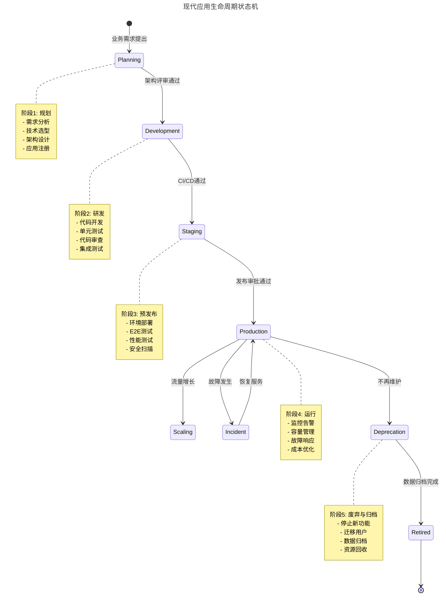
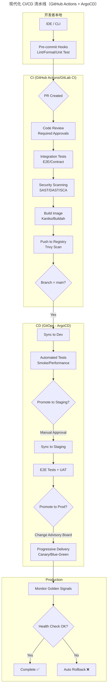
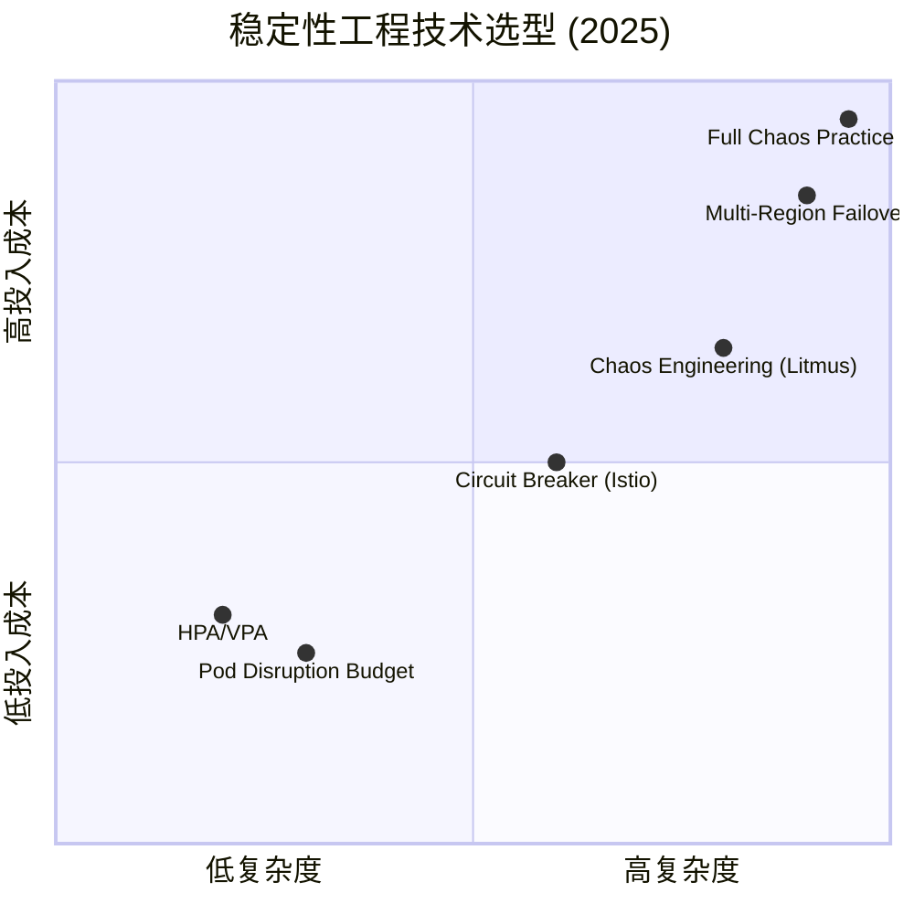

# 05 | 如何从生命周期的视角看待应用运维体系建设？

> **适用范围**：运维架构师、平台工程师、SRE、应用 Owner；适用于运维体系顶层设计、应用生命周期管理（ALM）、Operator/自动化平台建设等场景。
>
> **更新摘要（v2 · 2026-08 更新）**：
> - 结构化升级为 6 节骨架（导言 / 核心方法论 / 关键流程 / 工具与实战 / 常见误区 / 进阶延展）
> - 修正原文 mermaid 图缺失 frontmatter 的统一性问题
> - 将 Application Lifecycle Operator 代码示例与度量指标归入「工具与实战」
> - 总结与 2025 升级观点并入「进阶延展」

---

## 1. 导言

> 📅 **原文发布**：2018-2019 | **本次更新**：2025-06 | **更新等级**：🔴全面重写增强

还记得在标准化体系建设（上）最后留的两个小问题吗？其中一个是这样的：

在对象属性识别过程中进行了一些关键项的举例。然若换一个对象，是否有好的方法论来指导进行准确和全面的识别而不至于遗漏？从今日内容中，是否发现一些规律？

该问题的答案即为今日要讨论的内容——从"**应用生命周期管理**"的角度分阶段梳理。

概括而言，即对于一个对象，既有生命周期，便会有不同的生命周期阶段，而该对象在不同阶段可能具备不同的属性、关系和场景。只要将一个对象的生命周期阶段理清楚，顺着这条主线分阶段进行分解，即可分析得更加清晰、明确和具体。

---

## 2. 核心方法论

### 2.1 怎样理解生命周期

谈到生命，首先会联想到人，故此处以人为简单类比。人类从出生到死亡，即为一个生命周期，在该周期的每一个阶段，均会有不同的属性、关系和所要面对的场景。

例如从人的学生时代开始，作为学生，即会具备学生的属性（如所属学校、所属年级、所属班级、所属学号等）。此时周边的关系更多为同学关系和师生关系，所面临的场景可能即为读书、做作业和考试。当然学生时代细分下去，还会有小学生、中学生、大学生以及研究生等阶段，每个阶段里面又会有不同的细分属性以及所要面临的场景，例如大学生毕业就面对求职的场景等。

当一个学生毕业走入职场之后，即开启了生命周期里的另一阶段——职场生涯。此时身上的属性又发生变化，具备所属公司、职位、层级等。此时关系亦更为复杂（如同事关系、上下级关系以及各种社会关系），所面临的场景也变得复杂，要完成工作、晋升考核、领取薪酬以及离职跳槽、再次面试等。

再往后到一定年纪成为老年人，又会有老年人的属性、关系和场景，此处不详细列举。

围绕着人类的生命周期，国家和社会提供的解决方案必须有一系列对应的教育体系、职业体系、医疗体系、养老体系等。目的即针对人生的不同阶段，提供不同形式的保障和支持，让每个人在社会体系下都能正常生存并发挥出自己的价值。

从上述分析可见，人这一对象在不同的生命周期阶段中，会有不同的角色属性和外部关系，同时要面对的社会和生存场景亦不一样。故当谈论人这一对象时，一定是把该对象放到具体的某个生命周期阶段中才有意义。

### 2.2 应用的生命周期分析

回到运维对象的生命周期上来，所面对的这些对象相对规范、标准很多。

当一个场景下有多个对象时，一定要找到那个核心的运维对象，该核心对象的生命周期就会涵盖其它附属运维对象的子生命周期。结合前文所述，微服务架构下一切要以应用为核心，因此即找到了整个运维体系或者说软件运行阶段的核心对象——应用。

应用类似于社会中的人，凡事以人为本，此处即为以应用为本。接下来按照上述对一个人生命周期的阶段分解，亦可**对应用的生命周期阶段进行分解，大致分为五个部分：应用的创建阶段、研发阶段、上线阶段、运行阶段和销毁阶段**。依次分析如下。

### 2.3 现代应用生命周期的完整视图（2025）



状态机将应用生命周期显式建模为 6 个阶段与 2 条副流程（Scaling、Incident），是 Application CRD 设计与 Operator 自动化的语义基础。

### 2.4 五阶段核心要点

**1. 应用的创建阶段**

**这个阶段，最重要的工作，是确认应用的基础信息和与基础服务的关系，要同时固化下来，从应用创建之初，就将应用与各类基础服务的生命周期进行挂钩**。

应用的基础信息，可以参考之前我们讲标准化的部分，基本上已经涵盖了比较全的信息，你可以按照生命周期的思路，再理解一下并做梳理。

对于同一类的应用，只需要做一次标准化即可，后续完全可以形成模板固化到工具平台上。

同时，**另外一个很重要的工作，就是要开启与应用相关的各类基础服务的生命周期**。比如这个应用需要用到缓存、消息队列和DB等，也可能需要域名DNS服务、VIP配置等，这些就要从应用创建这个动作延伸出去，启动这些关联基础服务的创建，比如需要缓存就去申请容量空间，需要消息队列要申请创建新的Topic等等。

当然一个应用使用到哪些基础服务，应该是在架构设计和编码阶段就确定下来的，这里做的事情，就是把这些信息通过应用关联起来，与应用的生命周期挂钩。

**2. 应用的研发阶段**

应用的研发阶段主要是业务逻辑实现和验证的阶段。针对业务逻辑层面的场景就是开发代码和质量保证，但是这个过程中就会涉及到代码的提交合并、编译打包以及在不同环境下的发布部署过程。同时，开发和测试在不同的环境下进行各种类型的测试，比如单元测试、集成测试以及系统测试等等，这整个过程就是我们常说的持续集成。

所以，这个阶段，我们要做的最重要的一个事情，就是为研发团队打造完善的持续集成体系和工具链支持，在后面我们会有专门一个部分讲解这个过程。

**3. 应用的上线阶段**

这是个过渡阶段，从应用创建过渡到线上运行。创建阶段，应用的基础信息和基础服务都已经到位，接下来就是申请到应用运行的服务器资源，然后将应用软件包发布上线运行，这个动作在下面的运行阶段也会持续迭代，我们直接看下面这个阶段。

**4. 应用的运行阶段**

**这是应用生命周期中最重要、最核心的阶段**。

**从运维角度来看**，应用在线上运行起来之后就已经变成一个线上运行的进程，那这个进程形态的应用应该有什么样的属性呢？你可能已经联想到，这个时候需要应用线上运行的各种指标的输出。所以这个阶段，应用最重要的属性就是应用本身以及相关联的基础服务的各项运行指标。

这里，我们就需要制定每个运维对象的SLI、SLO和SLA，同时要建设能够对这些指标进行监控和报警的监控体系。

**从业务角度看**，应用是线上业务逻辑的执行载体，但是我们的业务需求是在不断变化和迭代的，所以就需要不断地去迭代更新我们的线上应用，这里仍然会依赖到上述应用研发阶段的持续集成过程，并最终与线上发布形成持续交付这样一个闭环体系。

**从运行阶段应用的关系看**，除了它跟基础服务之间相对固化的关系外，应用跟应用、以及应用包含的服务之间的调用关系也非常重要，而且这个关系可能随时都在变化，这个时候，我们应用之间依赖管理和链路跟踪的场景就出现了。

**同时，应用线上运行还会面临外部业务量的各种异常变化，以及应用自身所依赖的基础设施、基础服务以及应用服务的各种异常状况**。比如"双11"大促，外部流量激增；微博上热点事件带来的访问量剧增；或者服务器故障、IDC故障，DB故障；再或者服务层面API的报错等等。这时就出现了线上稳定性保障的场景，比如流量激增时的限流降级、大促前的容量规划、异常时的容灾、服务层面的熔断等等。

通过上面的这个分析过程，我们可以看到，**日常接触到的各种技术解决方案，都是在解决应用生命周期不同阶段中应用自身或者应用与周边关系的问题，或者是所面对的场景问题**。

**5. 应用的销毁阶段**

这一部分就不难理解了。如果应用的业务职责不存在了，应用就可以下线销毁了。但是这里不仅仅是应用自身要销毁，我们说应用是整个运维体系的核心，所以围绕着某个应用所产生出来的基础设施、基础服务以及关联关系都要一并清理，否则将会给系统中造成许多无源（源头）的资源浪费。

我们在日常工作中，经常见到的缓存系统中，很多NameSpace不知道是谁的，消息系统中有很多Topic不知道是谁的，但是又不敢随意乱动，就只能让它无端占用着系统资源。

**执行应用的销毁这一步动作，其实是取决于最前面应用与基础服务的关系模型分析和建设是否做得足够到位**。

---

## 3. 关键流程

### 3.1 现代化CI/CD流水线（2025）



CI/CD 流水线将研发阶段（CI）与上线/运行阶段（CD）串接：CI 完成构建与扫描，CD 通过 GitOps 实现多环境渐进式交付并具备自动回滚能力。

**关键最佳实践**：

1. **Trunk-Based Development**
   - 主分支始终保持可部署状态
   - 使用Feature Flags控制功能开关
   - 减少长寿命分支的合并冲突

2. **Shift Left Testing**
   - 在PR阶段就运行完整的测试套件
   - Contract Testing确保服务间兼容性
   - 安全扫描左移到开发阶段

3. **Immutable Infrastructure**
   - 每次构建生成新的镜像Tag（不重复使用）
   - 使用Content-addressable Image ID
   - 通过GitOps实现声明式部署

### 3.2 SLO实施框架（运行阶段核心）

```yaml
# SLO Definition CRD示例
apiVersion: reliability/v1
kind: ServiceLevelObjective
metadata:
  name: user-service-slo
  labels:
    application: user-service
    environment: production
spec:
  target: 99.9%  # 月度可用性目标
  backend:
    prometheus:
      service: user-service
      namespace: production
  
  # SLI定义
  indicators:
    availability:
      name: "Service Availability"
      description: "Percentage of successful HTTP requests"
      query: |
        sum(rate(http_requests_total{service="user-service", code!~"5.."}[5m]))
        /
        sum(rate(http_requests_total{service="user-service"}[5m]))
    
    latency:
      name: "Request Latency (p99)"
      description: "99th percentile response time in milliseconds"
      query: |
        histogram_quantile(0.99,
          sum(rate(http_request_duration_seconds_bucket{service="user-service"}[5m]))
          by (le)
        ) * 1000
    
    errorRate:
      name: "Error Rate"
      description: "Percentage of requests returning 5xx errors"
      query: |
        sum(rate(http_requests_total{service="user-service", code=~"5.."}[5m]))
        /
        sum(rate(http_requests_total{service="user-service"}[5m]))

  # Error Budget计算
  errorBudget:
    calculationMethod: rolling  # rolling 或 calendar-based
    window: 30d  # 30天滚动窗口
    
  # 告警规则
  alerting:
    rules:
      - name: BurnRateAlert
        severity: critical
        condition: "error_budget_remaining < 25%"
        action: "Stop all non-essential deployments"
        
      - name: SlowBurnAlert
        severity: warning
        condition: "burn_rate > 2x for 24h"
        action: "Notify on-call, investigate root cause"

  # Dashboard链接
  dashboards:
    overview: https://grafana.company.com/d/user-service-overview
    slo: https://grafana.company.com/d/user-service-slo
    incidents: https://pagerduty.company.com/services/user-service
```

### 3.3 稳定性工程能力矩阵



象限图按「复杂度 vs 投入成本」对常见稳定性工程能力进行分级，HPA/VPA 与 PDB 是低成本入门组合，Multi-Region Failover 与全量混沌演练则需要专门团队投入。

### 3.4 自动化应用创建流程

```yaml
# Application Creation Request CRD
apiVersion: app.lifecycle/v1
kind: ApplicationCreationRequest
metadata:
  name: new-service-req-001
spec:
  # === 应用基本信息 ===
  application:
    name: recommendation-service
    displayName: "推荐服务"
    description: "基于ML的商品个性化推荐引擎"
    owner:
      team: ml-platform
      email: ml-team@company.com

  # === 关联的基础服务请求 ===
  dependencies:
    databases:
      - name: rec-db
        type: PostgreSQL
        version: "16"
        size: "100Gi"
        tier: gp3
    caches:
      - name: rec-cache
        type: Redis Cluster
        memory: "16Gi"
        nodeCount: 6
    messageQueues:
      - name: user-events
        type: Kafka
        partitions: 12
        replicationFactor: 3
        retentionDays: 7
    objectStorage:
      - name: model-artifacts
        type: S3 Compatible
        size: "500Gi"
        lifecyclePolicy: "Transition to IA after 30 days"

  # === 资源配额申请 ===
  resources:
    namespace: recommendation-service-ns
    quota:
      requests.cpu: "10"
      requests.memory: "20Gi"
      limits.cpu: "40"
      limits.memory: "80Gi"
      pods: "20"
      services: "10"
      secrets: "20"
      configmaps: "20"

  # === 可观测性配置 ===
  observability:
    slo:
      availabilityTarget: "99.9%"
      latencyP99: "500ms"
    tracing:
      enabled: true
      samplingRate: 0.1  # ML服务采样率可适当降低
    logging:
      format: json
      retentionDays: 30

  # === 安全配置 ===
  security:
    networkPolicy: strict
    podSecurityStandard: restricted
    rbac:
      serviceAccountName: recommendation-svc-sa
---
# 自动化审批流程（Argo Workflows示例）
apiVersion: argoproj.io/v1alpha1
kind: Workflow
metadata:
  name: app-creation-workflow
spec:
  entrypoint: application-lifecycle
  templates:
  - name: application-lifecycle
    steps:
    - - name: validate-request
        template: validate
    - - name: create-namespace
        template: create-ns
    - - name: provision-database
        template: provision-db
    - - name: provision-cache
        template: provision-redis
    - - name: provision-kafka
        template: provision-kafka
    - - name: setup-monitoring
        template: setup-prometheus
    - - name: register-in-catalog
        template: backstage-register
    - - name: notify-owner
        template: send-notification

  - name: validate
    container:
      image: validator:v1.0
      command: [validate-app-request]
      args: ["{{workflow.parameters.requestFile}}"]

  # ... 其他template定义省略
```

### 3.5 自动化资源清理机制（销毁阶段）

```yaml
# Application Retirement Workflow
apiVersion: argoproj.io/v1alpha1
kind: Workflow
metadata:
  generateName: app-retirement-
spec:
  entrypoint: retire-application
  arguments:
    parameters:
    - name: appName
    - name: gracePeriodDays
      value: "30"

  templates:
  - name: retire-application
    steps:
    - - name: mark-deprecated
        template: update-lifecycle-phase
        arguments:
          parameters:
          - name: phase
            value: deprecated
            
    - - name: notify-stakeholders
        template: send-deprecation-notice
        
    - - name: wait-grace-period
        template: grace-period-wait
        arguments:
          parameters:
          - name: days
            value: "{{workflow.parameters.gracePeriodDays}}"
            
    - - name: scale-to-zero
        template: scale-deployment
        arguments:
          parameters:
          - name: replicas
            value: "0"
            
    - - name: backup-data
        template: final-backup
        
    - - name: cleanup-dependencies
        template: cleanup-resources
        arguments:
          parameters:
          - name: resources
            value: "database,cache,messages,storage,dns,certs,monitoring"
            
    - - name: delete-namespace
        template: delete-ns
        
    - - name: archive-documentation
        template: move-docs-to-archive
        
    - - name: update-catalog
        template: mark-retired
        arguments:
          parameters:
          - name: phase
            value: retired
            
    - - name: send-completion-notice
        template: final-notification

  # ... 各个template的具体实现略
```

---

## 4. 工具与实战

### 4.1 基于 Application Lifecycle Operator 的自动化实现

```go
// 示例：Application Lifecycle Controller (Go伪代码)
package v1

import (
    appsv1 "k8s.io/api/apps/v1"
    corev1 "k8s.io/api/core/v1"
    metav1 "k8s.io/apimachinery/pkg/apis/meta/v1"
)

// ApplicationLifecyclePhase 定义应用生命周期阶段
type ApplicationLifecyclePhase string

const (
    PhasePlanning     ApplicationLifecyclePhase = "Planning"
    PhaseDevelopment  ApplicationLifecyclePhase = "Development"
    PhaseStaging      ApplicationLifecyclePhase = "Staging"
    PhaseProduction   ApplicationLifecyclePhase = "Production"
    PhaseDeprecation  ApplicationLifecyclePhase = "Deprecation"
    PhaseRetired      ApplicationLifecyclePhase = "Retired"
)

// ApplicationLifecycleSpec 定义应用生命周期规格
type ApplicationLifecycleSpec struct {
    // 当前阶段
    CurrentPhase ApplicationLifecyclePhase `json:"currentPhase"`
    
    // 目标阶段（用于阶段转换）
    TargetPhase ApplicationLifecyclePhase `json:"targetPhase,omitempty"`
    
    // 各阶段的配置
    PhaseConfigs map[ApplicationLifecyclePhase]PhaseConfig `json:"phaseConfigs,omitempty"`
}

// PhaseConfig 定义各阶段的配置
type PhaseConfig struct {
    // 资源配额
    ResourceQuota *corev1.ResourceQuotaSpec `json:"resourceQuota,omitempty"`
    
    // SLO目标
    SLO *SLOConfig `json:"slo,omitempty"`
    
    // 备份策略
    BackupPolicy *BackupPolicy `json:"backupPolicy,omitempty"`
    
    // 网络策略
    NetworkPolicy *NetworkPolicyConfig `json:"networkPolicy,omitempty"`
    
    // 自动扩缩容配置
    Autoscaling *AutoscalingConfig `json:"autoscaling,omitempty"`
}

// Reconcile 是Controller的主调协循环
func (r *ApplicationLifecycleReconciler) Reconcile(ctx context.Context, req ctrl.Request) (ctrl.Result, error) {
    // 1. 获取Application实例
    app := &Application{}
    if err := r.Get(ctx, req.NamespacedName, app); err != nil {
        return ctrl.Result{}, client.IgnoreNotFound(err)
    }

    // 2. 检查是否需要阶段转换
    if app.Spec.TargetPhase != "" && app.Spec.TargetPhase != app.Spec.CurrentPhase {
        return r.transitionPhase(ctx, app)
    }

    // 3. 根据当前阶段执行对应的Reconcile逻辑
    switch app.Spec.CurrentPhase {
    case PhasePlanning:
        return r.reconcilePlanning(ctx, app)
    case PhaseDevelopment:
        return r.reconcileDevelopment(ctx, app)
    case PhaseStaging:
        return r.reconcileStaging(ctx, app)
    case PhaseProduction:
        return r.reconcileProduction(ctx, app)
    case PhaseDeprecation:
        return r.reconcileDeprecation(ctx, app)
    case PhaseRetired:
        return r.reconcileRetired(ctx, app)
    default:
        return ctrl.Result{}, fmt.Errorf("unknown phase: %s", app.Spec.CurrentPhase)
    }
}
```

Operator 通过 Reconcile 循环将生命周期阶段转换为具体的 K8s 资源操作，是「声明式生命周期」得以自动化的核心机制。

### 4.2 生命周期管理的度量指标

| 指标名称 | 描述 | 目标值 | 测量方法 |
|---------|------|--------|---------|
| **平均创建时间** | 从需求提出到Dev环境可用 | <3天 | 工单系统时间戳 |
| **平均上线时间** | 从Dev到Prod首次部署 | <2周 | ArgoCD Deployment历史 |
| **平均退役时间** | 从Deprecation到完全清理 | <45天 | Workflow执行日志 |
| **阶段合规率** | 符合生命周期阶段要求的应用比例 | >95% | 定期Audit |
| **僵尸资源率** | 无主应用关联的资源占比 | <5% | CMDB查询 |
| **SLO达标率** | 生产环境应用满足SLO的比例 | >99% | Prometheus SLO Dashboard |

---

## 5. 常见误区

### 5.1 ❌ 只关注创建，忽视销毁

- 应用上线时轰轰烈烈，下线时无人问津
- 导致大量僵尸资源占用，CMDB 数据失真
- **建议**：建立完整的 Lifecycle Policy，并将 Deprecation 阶段纳入强制流程

### 5.2 ❌ 阶段之间缺乏自动化流转

- 阶段切换需走多重工单、人工审批
- 阶段属性没有用 CRD 固化，容易漂移
- **建议**：用 Application CRD + Operator 承载状态机，将流转自动化

### 5.3 ❌ 把生命周期当作「运维内部概念」

- 开发者无感知，导致应用注册信息长期缺失
- 业务架构师不参与 Planning 阶段，技术选型与业务脱节
- **建议**：通过 Backstage IDP 将生命周期可视化，让 Dev、QA、SRE 共享同一视图

### 5.4 ❌ 套用别人的解决方案而忽略基础

- 一上来就追 Spinnaker、ArgoCD 等工具，却未先做应用建模与关系梳理
- **建议**：先按「划分阶段 → 提炼属性 → 理清关系 → 固化基础信息 → 实现场景」的套路打好基础

### 5.5 ❌ SLO/SLI 只在运行阶段定义

- SLO 被认为是运维的事，规划阶段不参与
- 导致后续监控告警与业务目标错位
- **建议**：在 Planning 阶段就将 SLO 写入 Application CRD

---

## 6. 进阶延展

### 6.1 总结

今天我们分析了应用的生命周期，再结合之前讲的标准化内容，我们就找到了**做运维架构的切入点**，套路也就有了，总结一下就是：

**从生命周期入手，划分阶段，提炼属性，理清关系，固化基础信息，实现运维场景**。

同理，这个思路还可以运用到基础设施和基础服务对象的生命周期管理中，虽然它们只是子生命周期，但是具体到每个基础服务上面，同样需要这个管理手段和过程。

我已经介绍了很多和应用相关的内容，很大一部分的原因是希望能够帮助你梳理好思路，在思考问题和设计解决方案的时候，一定要从实际出发、从问题出发、从基础出发，理清自己的需求和痛点，然后再去寻求解决方案。

借鉴业界思路，千万不要一上来就去套用别人的解决方案。因为别人的思路和解决方案往往是建立在一个非常稳固的基础之上的，而这些基础，往往又因为太基础、太枯燥、太不够酷炫，所以常常是一带而过，甚至是略去不讲的。一旦忽略了这一点，再优秀的解决方案也是无源之水，无本之木，是实现不了的。

独立思考非常重要，共勉！

### 6.2 2025 年核心观点升级

在云原生和Platform Engineering时代，**应用生命周期管理**不仅是方法论，更是可以通过**Operator Pattern**和**GitOps**实现自动化的工程实践：

1. **声明式生命周期**：用CRD定义应用的状态机，Controller负责状态协调
2. **自动化流转**：阶段转换触发预定义的操作（创建资源、配置监控、设置备份等）
3. **审计友好**：所有变更都有Git commit记录，符合合规要求
4. **自服务体验**：开发者通过Portal或CLI发起生命周期操作，无需运维

**记住赵成老师的经典方法论**：
> **"从生命周期入手，划分阶段，提炼属性，理清关系，固化基础信息，实现运维场景。"**

这套方法论在2025年依然有效，而且有了更强大的工具链来实现它！

### 6.3 推荐阅读与官方资源

- [Google SRE - Implementing SLOs](https://sre.google/workbook/implementing-slos/) - SLO 实施手册
- [Kubernetes Operator Pattern](https://kubernetes.io/docs/concepts/extend-kubernetes/operator/) - Operator 模式官方介绍
- [OpenTelemetry Semantic Conventions](https://opentelemetry.io/docs/specs/semconv/) - 含应用生命周期语义约定
- [Backstage Software Template](https://backstage.io/docs/features/software-templates/) - 应用创建模板化方案
- [Argo Workflows](https://argoproj.github.io/argo-workflows/) - 生命周期工作流引擎
- [Keptn](https://keptn.sh/) - 云原生生命周期编排工具
