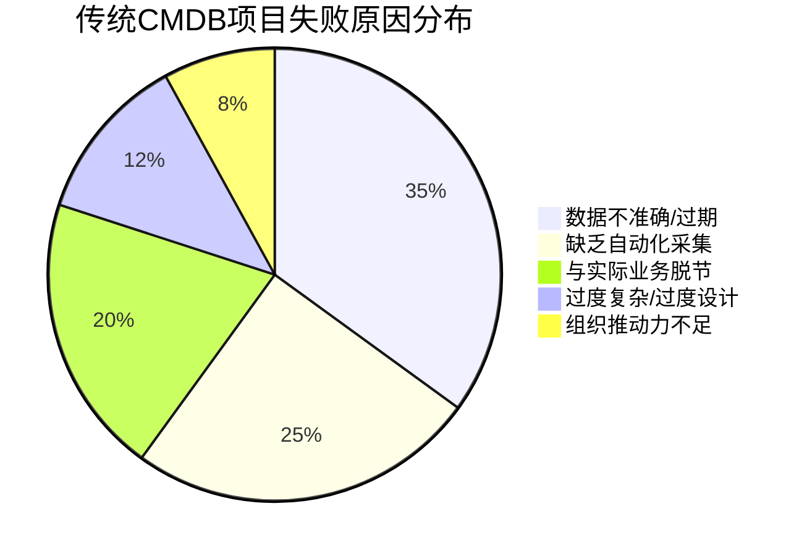
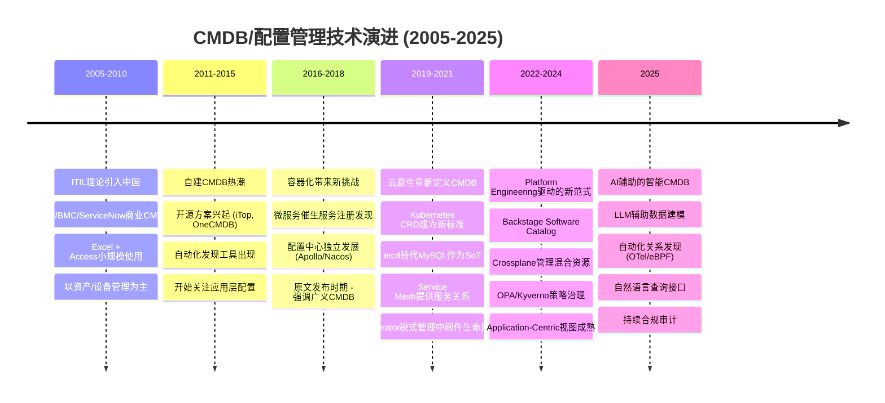
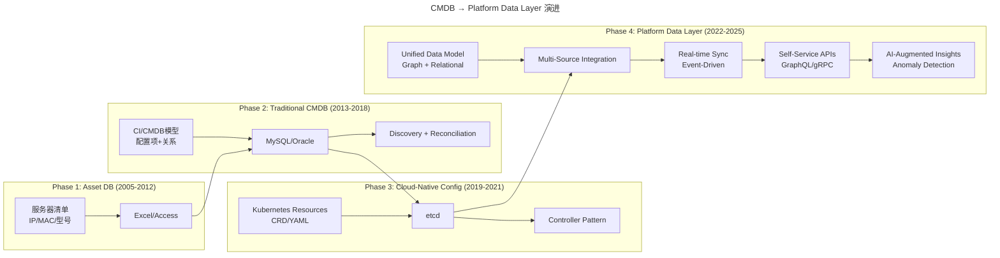
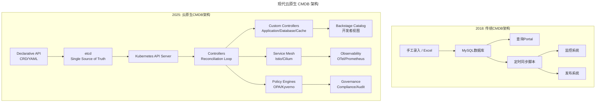
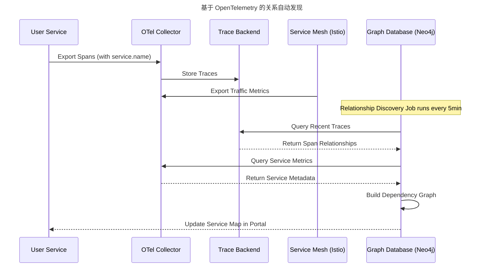
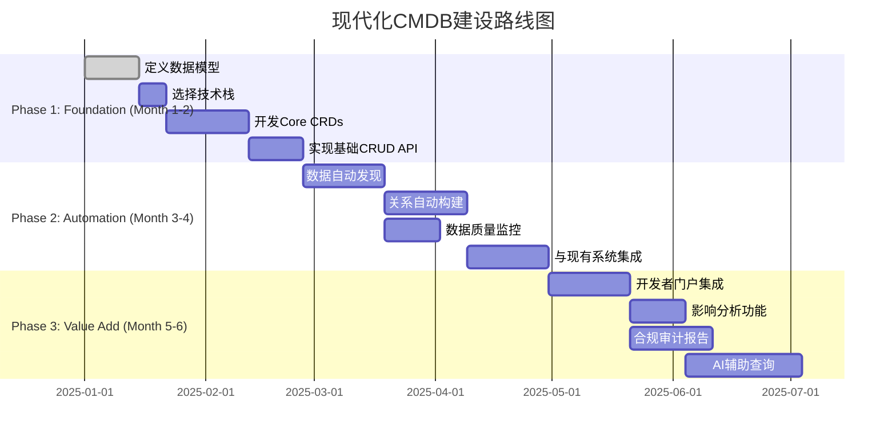

# 06 | 聊聊CMDB的前世今生

> **适用范围**：运维平台工程师、CMDB/IDP 建设负责人、SRE、平台架构师；适用于配置管理平台建设、云原生 CMDB 演进、Backstage Software Catalog 落地等场景。
>
> **更新摘要（v2 · 2026-08 更新）**：
> - 结构化升级为 6 节骨架（导言 / 核心方法论 / 关键流程 / 工具与实战 / 常见误区 / 进阶延展）
> - 所有 Mermaid 图补充 frontmatter（--- title: ... ---）
> - 原文「延伸阅读」「商业产品评估」统一并入进阶延展
> - 补充 Kubernetes as CMDB、Backstage Catalog、OTel 关系发现等 2025 关键实践

---

## 1. 导言

> 📅 **原文发布**：2018-2019 | **本次更新**：2025-06 | **更新等级**：🔴全面重写增强

我们前面在讲标准化的时候，对关键的运维对象做了识别，主要分为两个部分：

- **基础设施层面**：IDC机房、机柜、机架、网络设备、服务器等；
- **应用层面**：应用元信息、代码信息、部署信息、脚本信息、日志信息等。


  这两部分是整个运维架构的基础部分，运维团队是维护的Owner，需要投入较大的精力去好好规划建设。

当我们识别出运维对象和对象间的关系，并形成了统一的标准之后，接下来要做的事情就是将这些标准固化，固化到某个信息管理平台中，也就是我们常说的 **配置管理**，专业一点就叫作 **CMDB**（Configuration Management DataBase）。

其实，如果我们找准了需求和问题在哪里，你会发现技术手段和平台叫什么就真的不重要了，只要是内部能够达成一个统一共识的叫法就好。

关于如何打造CMDB和应用配置管理，我之前有一篇公开的文章《有了CMDB，为什么还需要应用配置管理》，写得已经比较细致了，会在下一期发布出来，但不占用我们专栏的篇幅。

今天我主要来聊一聊CMDB的前世今生，帮助你更加深刻地理解这个运维核心部件，对我们后面开展CMDB的建设大有裨益。

---

## 2. 核心方法论

### 2.1 CMDB源起

CMDB并不是一个新概念，它源于ITIL（Information Technology Infrastructure Library，信息技术基础架构库）。而ITIL这套理论体系在80年代末就已经成型，并在当时和后来的企业IT建设中作为服务管理的指导理论得到广泛推广和实施。但是为什么这个概念近几年才被我们熟知？为什么我们现在才有意识把它作为一个运维的核心部件去建设呢？

我想主要有两个因素，一个起了限制作用，一个起了助推作用。

- CMDB这个概念本身的定义问题，限制了CMDB的实施；
- 互联网技术的发展驱动了运维技术的发展和演进，进而重新定义了CMDB。

### 2.2 传统运维思路下的CMDB

我们先来看下第一个原因，按照ITIL的定义：

> CMDB，Configuration Management DataBase，配置管理数据库，是与IT系统所有组件相关的信息库，它包含IT基础架构配置项的详细信息。

看完上面这个描述，我们能感觉到，这是一个很宽泛的概念描述，实际上并不具备可落地的指导意义。事实上也确实是这样，稍后我们会讲到。

同时，CMDB是与每个企业具体的IT软硬件环境、组织架构和流程强相关的，这就决定了CMDB一定是高度定制化的体系。虽然我们都知道它不仅仅是一个存储信息的数据库那么简单，但是它的具体形态是什么样子的，并没有统一的标准。

**从传统IT运维的角度来看，运维的核心对象是资源层面**，所谓的基础架构也就是网络设备和硬件设备这个层面；各种关联和拓扑关系，基本也是从服务器的视角去看。所以更多地，我们是把CMDB建设成为一个以设备为中心的信息管理平台。

这也是当前绝大多数公司在建设运维平台时最优先的切入点，因为这些运维对象都是实体存在的，是最容易被识别的和管理的；像应用和分布式中间件这种抽象的逻辑对象反而是不容易被识别的。

这种形态，如果是在软件架构变化不大的情况下，比如单体或分层架构，以服务器为中心去建设是没有问题的。因为无论设备数量也好，还是申请回收这些变更也好，都是很有限的，也就是整个IT基础设施的形态变化不大。

我没有专门调研过国外的实施情况，但就国内的情形，谈下我的经历。

早期，大约是在2009~2013年，我接触了一个省级运营商的全国性项目。2012年的时候日PV就到了5亿左右，日订单创建接近2000万。分层的软件架构，不到千台服务器，对于资源的管理，仍然是用Excel表格来记录的。

运维基于这样一个表格去管理和分配各种资源，问题也不算太大。究其根本，就是基础设施层面的架构形态相对稳定，有稳定的软件模块数量和架构。但是发展到后来，这样的软件架构无法满足业务的快速迭代，还是做了架构上的拆分，这就是后话了。

这里我想表达的是，在那个时期，即使是在IT架构相对先进的运营商体系下面，我也没有太多地听说过CMDB这个概念，包括运营商自身，以及为运营商提供整体技术解决方案的厂商，还有来自方方面面的资深架构师和咨询师等，在做系统架构和运维架构设计时，没有人提及过CMDB，也没有人提出把它作为核心部件去建设，更多的都是从ITIL管理服务的流程体系去给出咨询建议；在落地实施的时候，我们最终见到的大多是一条条的流程规范和约束，后来增加的也多是流程和审批，甚至是纸质的签字审批。

这也从一个侧面说明，CMDB在那个时期更多的还是停留在概念阶段，甚至是无概念状态，也没有什么最佳实践经验的传承，CMDB这个概念本身并不具备实践意义，管理的方式方法也就停留在原始的Excel表格中。

**高大上的ITIL体系更多的是被当做流程规范来落地的，真正体现在技术方案和技术产品上的落地并不多。我想这是实施过程中对ITIL理解和运用的一大误区**

### 2.3 传统CMDB失败的常见原因分析（2025）



饼图揭示：60% 的失败可归因于「数据不准」与「缺乏自动化采集」，这两点是 CMDB 演进必须解决的根本问题。

**根本原因总结**：

1. **"Garbage In, Garbage Out"（垃圾进，垃圾出）**
   - 手工录入数据，准确性无法保证
   - 缺乏自动化的数据发现和同步机制
   - 数据很快过期，成为"死数据"

2. **以设备为中心，而非以应用为中心**
   - 只记录服务器、网络设备等物理资产
   - 忽视了应用、服务、配置等逻辑资产
   - 运维人员真正关心的"应用视角"缺失

3. **重流程轻技术**
   - 把CMDB当成审批流系统
   - 忽略了数据模型和API设计
   - 无法与其他工具链集成

4. **试图一步到位**
   - 想要一次性建成"完美"的CMDB
   - 范围过大，周期过长，最终烂尾
   - 缺乏MVP思维和渐进式交付

### 2.4 互联网运维体系下的CMDB

值得庆幸的是，进入到互联时代，**随着互联网运维力量的崛起，CMDB这个概念也真正地得到了落地实践，从理论概念的方法论阶段过渡到了具备具体技术方案的可实施阶段，而且得到了业界的持续分享和传播**。我们现在能够看到的CMDB经验分享，基本上都是中大型互联网公司的运维最佳实践。

不过，值得注意的是，"此CMDB"已经非"彼CMDB"。我们前面提到，传统运维阶段，我们更多是以设备为核心进行管理，但是到了互联网技术阶段，这个核心就变了，变成了应用这个核心对象。

至于原因，我们前面已经讲过，主要还是互联网技术的快速发展，大大推进了微服务技术架构的落地和实践，这种场景下，应用各维度的管理复杂度、应用的复杂度就逐渐体现出来了，所以我们的很多运维场景就开始围绕着应用来开展。

与此同时，云计算技术也在蓬勃发展，逐步屏蔽了IDC、网络设备以及硬件服务器这样的底层基础设施的复杂度，有公有云或私有云厂商来专注聚焦这些问题，让我们的运维不必再花过多的精力在这些基础设施上面；同时，单纯以硬件为核心的CMDB形态也被逐步弱化。

所以，此时的CMDB，仍然可以叫做配置管理数据库，但是这个配置管理的外延已经发生了很大的变化。之前所指的简单的硬件资源配置管理，只能算是狭义的理解；从广义上讲，当前的应用以及以应用为核心的分布式服务化框架、缓存、消息、DB、接入层等基础组件，都应该纳入这个配置管理的范畴。

所以在这个时期，我们提到的运维自动化，远不是自动化的服务器安装部署交付或网络自动化配置这种单一场景，而是出现了持续交付、DevOps、SRE等更适合这个时代的对运维职责的定义和新的方法论。

到了这个阶段，**传统运维思路下的CMDB，因为管理范围有限，可以定义为狭义上的CMDB；而互联网运维思路下的CMDB外延更广，我们称它为广义的CMDB**。新的时期，对于CMDB的理解也要与时俱进，这个时候，**思路上的转变，远比技术上的实现更重要**。

### 2.5 CMDB进行时

如果我们仔细观察，会发现一个很有意思的现象。CMDB源于80年代末的ITIL，源于传统IT运维阶段，但真正让它发扬光大的，确是新兴的互联网运维行业，而且现在的传统行业也在向互联网学习运维技术。

与此同时，在中大型的互联网公司中，比如阿里和腾讯，也越来越重视流程规范的管控，开始更多地将严格的流程控制与灵活的互联网运维技术结合起来，以避免在过于灵活多变的环境下导致不可控的事件发生。

所以，从这里我们可以看到，**并不是说ITIL的重流程体系就一定是过时老旧的，也不是说互联网运维技术就一定代表着最先进的技术趋势，而是在这个过程中，不同体系相互借鉴、相互学习、共同进步和发展，在碰撞的过程中，催生出更适合这个时代的技术体系**。

这确实是一个充满了机遇和挑战、但又不乏乐趣的新时代。

---

## 3. 关键流程

### 3.1 CMDB技术栈演进时间线



时间线呈现 CMDB 的代际演进：Excel → 关系型 CMDB → K8s CRD → Backstage Catalog → AI 辅助，每一代都把「数据准确性」和「自动化采集」向前推一步。

### 3.2 从CMDB到Platform Data Layer的演进



四阶段演进路线：从静态资产清单，到带 Discovery 的关系型 CMDB，再到 K8s 声明式配置，最后汇聚为以图模型 + 事件驱动 + AI 增强的 Platform Data Layer。

### 3.3 现代CMDB的形态——Kubernetes as the Source of Truth



云原生 CMDB 将「数据存储」从 MySQL 升级为 etcd，将「同步脚本」升级为 Controller Reconcile Loop，将「审批流程」升级为 Policy Engine，整体形成强一致性 + 声明式 + 自动协调的体系。

**核心转变**：

| 维度 | 传统CMDB (2018) | 现代CMDB (2025) |
|------|----------------|----------------|
| **数据源** | 手工录入 + Agent采集 | Declarative API + Controller Reconcile |
| **存储** | 关系型数据库 (MySQL) | etcd (分布式KV存储) |
| **一致性保证** | 最终一致性（定时同步） | 强一致性（Watch机制） |
| **数据模型** | ER图 / 自定义Schema | Kubernetes CRD + OpenAPI Schema |
| **查询方式** | SQL查询 / REST API | kubectl / Client-go / Controller Pattern |
| **扩展方式** | 修改表结构 / 新增字段 | 定义新的CRD / Operator |
| **集成方式** | ETL脚本 / API调用 | Informer / Watcher / Finalizer |
| **版本控制** | 无 / 数据库Migration | GitOps Repository |
| **审计追踪** | 操作日志 | Git Commit History |

### 3.4 OpenTelemetry 自动关系发现流程



时序图刻画了「OTel → Tempo → Graph DB → Portal」的关系自动发现闭环，将传统 CMDB 中的「人工维护依赖关系」彻底替换为「基于真实流量的实时发现」。

**优势**：
- 零侵入：无需修改应用代码（Sidecar自动采集）
- 实时性：分钟级更新，非天级/周级
- 准确性：基于真实流量，非静态配置
- 成本低：无需维护复杂的Agent集群

### 3.5 CMDB建设的分阶段路线图



路线图分三阶段：Foundation 阶段定义数据模型，Automation 阶段实现自动发现与关系构建，Value Add 阶段对接开发者门户与 AI 辅助查询。

**关键里程碑检查点**：

| 阶段 | 完成标准 | 度量指标 |
|------|---------|---------|
| **Phase 1 End** | Core CRDs可正常创建/查询/删除 | API响应时间 <100ms |
| **Phase 2 End** | 90%数据自动采集，准确率 >95% | 数据新鲜度 <5分钟 |
| **Phase 3 End** | 开发者自助查询率 >80% | 用户满意度 >4.0/5.0 |

---

## 4. 工具与实战

### 4.1 Kubernetes as a Universal CMDB

**核心理念**：
- Kubernetes本身就是一个声明式的、实时的、强一致性的配置管理数据库
- 通过CRD（Custom Resource Definition）可以扩展管理任意类型的资源
- Controller Pattern提供了自动化的状态协调能力

**优势**：
- ✅ 声明式API：用YAML描述期望状态，而非命令式操作
- ✅ 实时同步：基于Watch机制，变更秒级可见
- ✅ 可扩展性：通过CRD无限扩展资源类型
- ✅ 版本控制友好：所有配置都可以纳入GitOps
- ✅ 社区生态：大量现成的Operator可用

**实践案例**：

```yaml
# 使用Crossplane将RDS实例纳入Kubernetes管理
apiVersion: database.aws.crossplane.io/v1beta1
kind: RDSInstance
metadata:
  name: production-db
  labels:
    application: user-service
    environment: production
spec:
  forProvider:
    region: us-east-1
    dbInstanceClass: db.r6g.xlarge
    engine: postgres
    engineVersion: "15.4"
    allocatedStorage: 100
    masterUsername: adminuser
    # 密码通过SecretRef引用，不硬编码
    masterUserPasswordSecretRef:
      namespace: crossplane-system
      name: db-password
      key: password
    vpcSecurityGroupIds:
    - sg-12345678
    publiclyAccessible: false
    skipFinalSnapshotBeforeDeletion: true
  writeConnectionSecretToRef:
    namespace: production
    name: db-connection
---
# 应用可以直接引用这个数据库
apiVersion: apps/v1
kind: Deployment
metadata:
  name: user-service
spec:
  template:
    spec:
      containers:
      - name: app
        env:
        - name: DATABASE_URL
          valueFrom:
            secretKeyRef:
              name: db-connection  # Crossplane自动创建的Secret
              key: endpoint
        - name: DATABASE_PASSWORD
          valueFrom:
            secretKeyRef:
              name: db-connection
              key: password
```

### 4.2 Backstage Software Catalog

**背景**：Spotify开源的开发者门户框架，其中的Software Catalog功能本质上就是一个现代化的、面向开发者的CMDB。

**核心特性**：

```yaml
# 示例：Backstage catalog-info.yaml
apiVersion: backstage.io/v1alpha1
kind: Component
metadata:
  name: user-service
  description: 用户服务中心
  annotations:
    github.com/project-slug: company/user-service
    backstage.io/techdocs-ref: dir:.
    prometheus.io/scrape: "true"
    grafana/dashboard-url: https://grafana.company.com/d/user-service
    pagerduty.com/integration-key: XXXXXXX
    sentry.io/project-slug: user-service
  tags:
    - java
    - spring-boot
    - microservice
    - tier-1
spec:
  type: service
  lifecycle: production
  owner: platform-team
  system: ecommerce-platform
  providesApis:
    - user-api
  consumesApis:
    - identity-provider-api
    - notification-api
  dependsOn:
    - resource:default/user-mysql-cluster
    - resource:default/user-redis-cluster
---
apiVersion: backstage.io/v1alpha1
kind: System
metadata:
  name: ecommerce-platform
spec:
  owner: architecture-team
  domain: ecommerce
---
apiVersion: backstage.io/v1alpha1
kind: Resource
metadata:
  name: user-mysql-cluster
spec:
  type: database
  owner: database-team
  dependencyOf:
    - component:default/user-service
```

**价值**：
- 为开发者提供统一的"应用视图"
- 自动聚合Git、CI/CD、监控、文档等信息
- 支持插件生态（Jira, PagerDuty, Grafana, Sentry等）
- 降低认知负荷，提升开发者体验

### 4.3 Policy as Code for Governance

**问题**：传统CMDB只管"存数据"，不管"合不合规"。现代方案引入Policy Engine在数据写入时实时校验。

```rego
# Kyverno或OPA策略示例：确保CMDB数据质量
package cmdb.quality

# 规则1：所有应用必须有Owner
deny[msg] {
    not input.review.object.metadata.labels["owner"]
    msg := sprintf("Application %s must have an 'owner' label", [input.review.object.metadata.name])
}

# 规则2：Tier-1应用必须启用全链路追踪
deny[msg] {
    input.review.object.metadata.labels["tier"] == "tier-1"
    not input.review.object.spec.observability.tracing.enabled
    msg := sprintf("Tier-1 application %s must enable tracing", [input.review.object.metadata.name])
}

# 规则3：生产环境不能使用latest标签
deny[msg] {
    input.review.object.metadata.namespace == "production"
    image := input.review.object.spec.containers[_].image
    endswith(image, ":latest")
    msg := sprintf("Production deployment %s cannot use ':latest' tag", [input.review.object.metadata.name])
}
```

### 4.4 构建现代化CMDB的技术选型建议

#### 方案A：纯Kubernetes原生（推荐给云原生团队）

| 组件 | 推荐工具 | 用途 |
|------|---------|------|
| **数据存储** | etcd (内置) | 所有K8s资源的持久化 |
| **自定义资源** | CRD + Controller | 扩展应用/数据库/缓存等模型 |
| **关系表达** | OwnerReferences / Labels / Annotations | 资源间关联关系 |
| **可视化** | Headlamp / Lens | K8s资源浏览器 |
| **开发者门户** | Backstage (Software Catalog) | 面向开发者的统一视图 |
| **跨集群管理** | Cluster API / Rancher / OCM | 多集群资源聚合 |
| **混合资源** | Crossplane | 管理RDS/S3/DNS等云资源 |
| **策略执行** | Kyverno / OPA Gatekeeper | 数据质量和合规校验 |

**适用场景**：
- 团队已深度使用Kubernetes
- 主要工作负载运行在K8s上
- 有Go语言开发能力（编写Operator）
- 追求声明式、GitOps的工作流

#### 方案B：图数据库 + GraphQL（推荐给需要复杂关系查询的场景）

| 组件 | 推荐工具 | 用途 |
|------|---------|------|
| **图数据库** | Neo4j / Amazon Neptune / JanusGraph | 存储复杂的关系网络 |
| **API层** | GraphQL (Hasura / Apollo Federation) | 灵活的数据查询接口 |
| **数据采集** | Custom Collectors / OTel / eBPF | 多源数据汇聚 |
| **可视化** | Neo4j Bloom / KeyLines / D3.js | 交互式关系图谱 |
| **搜索引擎** | Elasticsearch / OpenSearch | 全文检索和日志关联 |
| **缓存层** | Redis Cluster | 高频查询加速 |

**适用场景**：
- 需要支持复杂的多跳关系查询（如"影响分析"）
- 混合环境（物理机 + VM + Container + Serverless）
- 对查询性能有极高要求
- 有图数据库和前端开发经验

#### 方案C：商业SaaS方案（推荐给中小企业）

| 产品 | 特点 | 价格参考 |
|------|------|---------|
| **ServiceNow CMDB** | ITIL原生，流程集成强大 | 企业级定价 |
| **Freshservice** | 易用性好，适合ITSM | 中小企业友好 |
| **Jira Service Management** | 与Atlassian生态集成 | 按Agent计费 |
| **Device42** | 自动发现能力强 | 中端市场定位 |

**适用场景**：
- 不想自研，快速上线
- 已在使用对应的ITSM/项目管理工具
- 团队规模 < 100人
- 预算充足但人力有限

### 4.5 工具链对比（2019 vs 2025）

| 维度 | 原文隐含方案(2019) | 当前推荐(2025) | 变更原因 |
|------|-------------------|----------------|---------|
| **数据模型** | ER图 / 关系型表 | Kubernetes CRD / 图数据库 | 更灵活，支持层次化和网状关系 |
| **数据存储** | MySQL / Oracle | etcd / Neo4j / PostgreSQL | 分布式、高可用、强一致 |
| **数据采集** | Agent / 脚本 / 手工录入 | OTel Collector / eBPF / Controller | 零侵入、实时、全面 |
| **关系发现** | 配置文件解析 / Agent上报 | Service Mesh Traffic / OTel Traces | 基于真实流量，自动发现 |
| **API风格** | RESTful (CRUD) | Declarative API (Apply/Delete) | 符合Kubernetes范式，易于集成 |
| **查询能力** | SQL / 简单REST | kubectl / GraphQL / Cypher | 更灵活，支持复杂关系查询 |
| **可视化** | 自建Web Portal (jQuery) | Backstage / Grafana / Neo4j Bloom | 现代UI，插件生态丰富 |
| **版本控制** | 无 / 数据库Migration | GitOps Repository | 变更历史清晰，可回滚可审计 |
| **策略执行** | 流程审批 / 事后审计 | Admission Controller (Kyverno/OPA) | 实时拦截，不可绕过 |
| **多租户** | 字段区分 / View隔离 | Kubernetes Namespace / Organization CRD | 原生支持，安全隔离 |
| **扩展方式** | 修改表结构 / 新增API | 定义新CRD / 编写Operator | 无需改核心代码，插件式扩展 |

---

## 5. 常见误区

> 💡 **赵成老师原话强调**：
> **"思路上的转变，远比技术上的实现更重要。"**

> 💡 **基于2020-2025年实践的补充提醒**：

### 5.1 ✅ 推荐做法

1. **从小处着手，快速验证价值**
   - 不要试图一次性建成"大而全"的CMDB
   - 从最痛的点开始（如：应用与服务器的对应关系）
   - 2-3个月出MVP，收集反馈后迭代

2. **投资数据质量，而非数据量**
   - 10条高质量数据 > 10000条垃圾数据
   - 建立"数据新鲜度"指标（Data Freshness）
   - 定期Audit，清理僵尸数据和孤儿记录

3. **拥抱"Source of Truth"理念**
   - 明确每种数据的权威来源（System of Record）
   - 避免多源头写入同一份数据
   - 使用Event-Driven Architecture保持同步

4. **优先考虑消费者体验（Developer-First）**
   - CMDB不仅是给运维用的，更是给开发者用的
   - 提供友好的查询界面（Portal / CLI / IDE Plugin）
   - 文档化API，降低集成门槛

### 5.2 ⚠️ 常见陷阱

1. **❌ 陷入"完美数据"的陷阱**
   - 等待所有数据都准确后再开放使用
   - **后果**：项目周期无限延长，永远无法上线
   - **改进**：接受"渐进式完善"，先上线再优化

2. **❌ 重建设轻运营**
   - 投入大量精力搭建CMDB平台，建成后无人维护
   - **后果**：数据迅速过时，变成又一个"死系统"
   - **改进**：组建专职团队（或明确兼职职责），建立SLA

3. **❌ 与业务需求脱节**
   - CMDB成了"为了建而建"的技术展示品
   - **后果**：没人用，没有业务价值，最终被废弃
   - **改进**：从Day 1就绑定具体的业务场景（如：故障影响分析、成本分摊）

4. **❌ 忽视安全和权限**
   - 所有数据对所有角色可见
   - **后果**：敏感信息泄露，合规风险
   - **改进**：实施RBAC + Attribute-Based Access Control (ABAC)

5. **❌ 低估集成复杂度**
   - 认为CMDB只是"存数据"，集成应该很简单
   - **后果**：与监控/发布/工单系统的集成耗费数月
   - **改进**：提前规划API设计，预留Integration Points

---

## 6. 进阶延展

### 6.1 官方文档与权威资源

- [Kubernetes Custom Resources](https://kubernetes.io/docs/concepts/extend-kubernetes/api-extension/custom-resources/) - CRD官方文档
- [Backstage Software Catalog](https://backstage.io/docs/features/software-catalog/software-catalog-overview/) - 软件目录最佳实践
- [Crossplane Documentation](https://crossplane.io/docs/) - 控制平面管理任意基础设施
- [OpenTelemetry Concepts](https://opentelemetry.io/docs/concepts/) - 可观测性统一标准
- [Kyverno Policies](https://kyverno.io/policies/) - Kubernetes策略示例库
- [CNCF App Definition WG](https://tag-app-definition.cncf.io/) - CNCF应用定义工作组

### 6.2 推荐阅读

- **《Designing Data-Intensive Applications》** Chapter 5: Replication - 理解数据一致性模型
- **《Building Microservices》** by Sam Newman - 微服务架构中的配置管理
- **《Team Topologies》** - 理解平台团队在组织中的定位
- **《The Phoenix Project》** - 理解IT运维的三种工作类型

### 6.3 开源项目参考

- [JanusGraph](https://janusgraph.org/) - 分布式图数据库
- [Hasura](https://hasura.io/) - 即时GraphQL API
- [Headlamp](https://headlamp.dev/) - Kubernetes Web UI
- [Lens](https://k8slens.dev/) - Kubernetes IDE
- [Pluto](https://fairwinds.com/pluto) - K8s API版本兼容性检查工具

### 6.4 商业产品评估

- [Gartner Magic Quadrant for IT Service Management Tools](https://www.gartner.com/) - Gartner ITSM魔力象限
- [Forrester Wave: Enterprise CMDB](https://www.forrester.com/) - Forrester CMDB评测
- [Capterra CMDB Software](https://www.capterra.com/cmdb-software/) - CMDB软件比较平台
