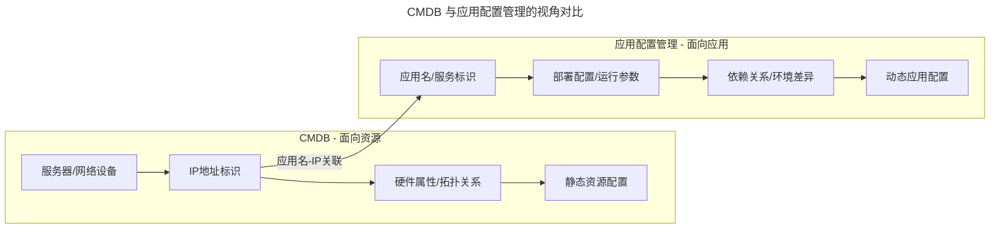
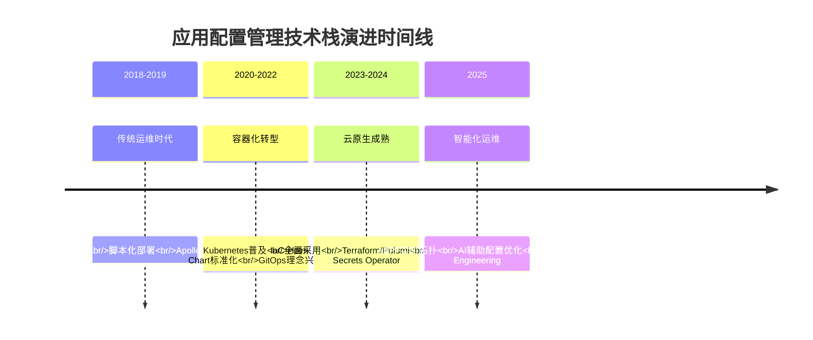
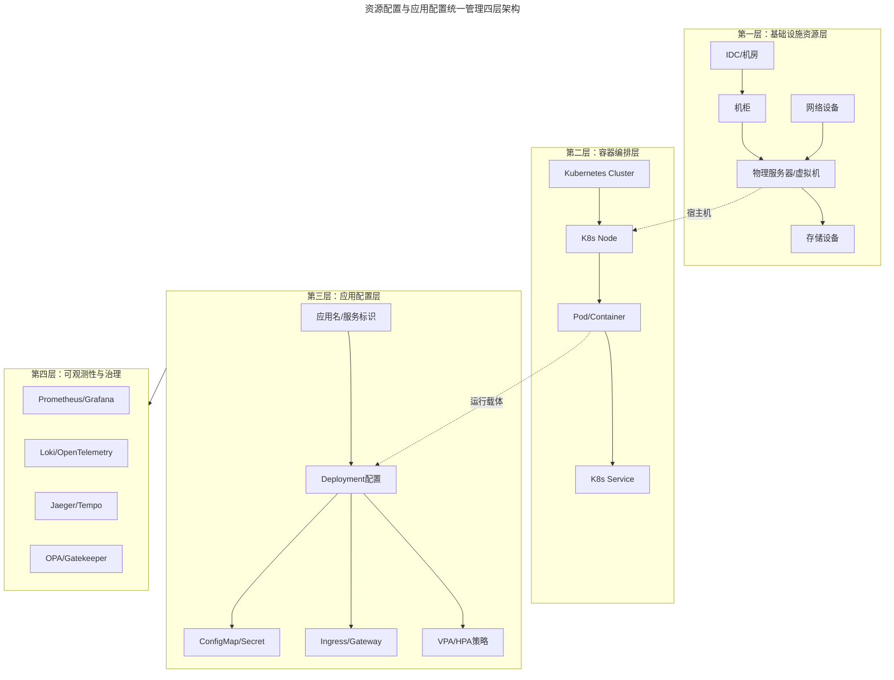

# 07 | 有了CMDB，为什么还需要应用配置管理？

> **适用范围**：运维平台工程师、配置管理平台建设者、SRE、应用运维负责人；适用于梳理 CMDB 与应用配置管理的边界、GitOps 配置体系落地、Kubernetes 原生配置管理建设等场景。
>
> **更新摘要（v2 · 2026-08 更新）**：
> - 结构化升级为 6 节骨架（导言 / 核心方法论 / 关键流程 / 工具与实战 / 常见误区 / 进阶延展）
> - 所有 Mermaid 图补充 frontmatter（--- title: ... ---）
> - 原文图片引用保留但补充文字化描述，便于无图环境阅读
> - 补充 External Secrets Operator、GitOps、Kustomize 等 2025 配置管理关键实践

---

## 1. 导言

> 📅 **原文发布**：2018-2019 | **本次更新**：2025-06 | **更新等级**：🔴全面重写增强

📌 **2025年更新要点**：
- CMDB演进：从静态资源库到动态拓扑图谱 + eBPF实时发现
- 应用配置管理：GitOps化、IaC（Infrastructure as Code，基础设施即代码）、Kubernetes CRD/Operator模式
- 配置中心演进：Apollo/Nacos → GitOps + External Secrets Operator

本文要回答一个运维体系建设中常见的疑问：既然已经有了 CMDB，为什么还需要单独搞一套应用配置管理？核心观点是：**CMDB是面向资源的管理，应用配置是面向应用的管理**。需要注意的是：面向"资源"而非面向"资产"，资源 ≠ 资产。

---

## 2. 核心方法论

### 2.1 资源视角 vs 应用视角

CMDB是以IP为标识的资源管理维度，引入应用名之后，则转变为以应用为视角的管理维度。这两个视角并非互斥，而是相辅相成：



上图揭示了两者的核心差异：CMDB 以 IP/设备为锚点管理静态资源属性，而应用配置管理以应用名为锚点管理动态部署与运行参数，二者通过"应用名-IP"的关联关系建立联系。

### 2.2 为什么不能只用CMDB

仅基于CMDB的资源信息进行自动化建设，最多能够实现自动化硬件资源采集、自动化装机、网络-硬件拓扑关系生成等资源层面的工具能力。这些工具仅在运维层面产生价值，距离业务较远，难以直接为业务创造价值。

而基于应用层面进行建设，则可以开展持续集成与发布、持续交付、弹性扩缩容、稳定性保障、成本控制等工作，这些能力所带来的价值显著不同。

**核心结论：CMDB是面向资源的管理，应用配置是面向应用的管理。两者相辅相成，共同构成现代运维体系的完整基石。**

---

## 3. 关键流程

### 3.1 传统CMDB建设路径

在建设运维基础管理平台时，通常需要完成以下步骤：

- **第1步**，确定服务器、网络、IDC、机柜、存储、配件等核心维度；
- **第2步**，定义硬件属性信息，例如服务器包含SN序列号、IP地址、厂商、硬件配置（CPU、内存、硬盘、网卡、PCIE、BIOS）、维保信息等；网络设备包含厂商、型号、带宽等；
- **第3步**，梳理信息之间的关联关系或拓扑关系，包括服务器所在机柜、虚拟机所在宿主机、机柜所在IDC等简单关系；以及核心交换机、汇聚交换机、接入交换机和服务器之间的级联关系等复杂关系；
- **第3.5步**，在梳理过程中同步进行规划，如IP地址段规划（DB网段、大数据网段、业务应用网段等）、机柜用途规划（虚拟化宿主机机柜、数据库专用机柜等）。

上述信息通过ER建模工具进行数据建模并固化到数据库中，形成资源层面的信息管理平台。

### 3.2 2025年CMDB技术演进

传统CMDB面临的核心挑战在于**静态数据与动态环境的矛盾**。2025年的CMDB已从静态资源库演进为具备实时感知能力的动态拓扑系统：

#### 从静态到动态：Service Graph与实时发现

| 维度 | 传统CMDB (2018) | 现代CMDB (2025) |
|------|----------------|----------------|
| 数据采集方式 | 人工录入 + 定时脚本 | eBPF自动发现 + Service Mesh |
| 拓扑更新频率 | 小时级/天级 | 秒级实时 |
| 服务依赖关系 | 手动维护 | 自动生成Service Graph |
| 容器支持 | 无/弱支持 | 原生支持Kubernetes |
| 典型工具 | 自研CMDB平台 | Cilium + 蓝鲸CMDB（bk-cmdb）+ kube-state-metrics |

**关键技术组件：**

- **eBPF实时发现**：利用内核级可编程能力，无需修改应用代码即可捕获服务间调用关系，实现零侵扰的服务依赖图谱构建
- **cAdvisor / Node Exporter / kube-state-metrics**：Kubernetes生态下的标准资源监控指标采集工具，为CMDB提供容器级别的实时资源状态
- **Service Mesh（Istio/Envoy）**：通过Sidecar代理自动记录服务间流量，生成精确的服务调用拓扑
- **蓝鲸CMDB（bk-cmdb）**：腾讯开源的现代化CMDB解决方案，支持自定义模型、多源自动发现和API驱动

#### IaC驱动的CMDB数据自动化

CI/CD流水线已成为CMDB数据的重要来源：



- **Terraform / Ansible / Pulumi**：基础设施即代码（IaC）工具在执行资源创建时，自动将元数据回写到CMDB，确保CMDB数据的时效性和准确性
- **GitOps工作流**：所有基础设施变更通过Git仓库管理，变更自动触发CMDB更新，实现配置漂移检测和审计追踪

### 3.3 信息流转的价值

信息固化不是目的，也没有价值，只有信息动态流转起来才有价值（如同货币流通）。基于CMDB资源信息可以进一步建设：

- **第4步**，流程规范建设，如服务器上线、下线、维修、装机等流程，同时管理流程中的状态变更；
- **第5步**，拓扑关系的可视化和动态展示，如交换机与服务器的级联关系、节点状态（正常/故障）展示等，实现对资源节点状态的直观关注。

### 3.4 应用配置涉及的信息域

上述CMDB基础信息对于传统的SA（System Administrator）运维模式已经足够，但从应用运维的角度来看，这些信息远远不够。此时需要引入一个关键句柄：**应用名**（或称应用标识）。至此，应用运维中最重要的关联关系产生：**"应用名-IP"的关联关系**。

应用涉及的主要信息包括：

- **应用基础信息**：应用责任人、Git仓库地址、代码分支策略等；
- **应用部署基础软件包**：语言运行时（Java、Go、Python等）、Web容器（Tomcat、JBoss等）、Web服务器（Apache、Nginx等）、基础组件（日志Agent、监控Agent、系统维护工具等）；
- **应用部署目录结构**：运维脚本目录、日志目录、应用包目录、临时目录等；
- **应用运行脚本和命令**：启停脚本、健康检查脚本、优雅关闭脚本等；
- **应用运行时参数配置**：JVM参数（GC方式、新生代、老年代、永生代堆内存大小）、进程数限制、文件描述符限制等；
- **应用端口配置**：服务监听端口、管理端口、健康检查端口等；
- **应用日志输出规范**：日志格式、日志级别、日志轮转策略等；
- **其他配置**：环境变量、特性开关（Feature Flag）、限流熔断参数等。

### 3.5 2025年应用配置管理的变革

上述梳理过程本质上是标准化的过程。经过梳理可以发现，这些信息与CMDB中的资源信息属于完全不同的维度。因此从信息管理角度出发，将资源配置与应用配置分离会更加清晰，解耦后也更易于管理。

#### 应用定义方式的演进

| 配置项 | 传统方式 (2018) | 现代方式 (2025) |
|--------|----------------|----------------|
| 应用定义 | 脚本清单/文档 | Kubernetes Deployment/StatefulSet |
| 打包发布 | WAR/JAR包手动部署 | Helm Chart + OCI镜像仓库 |
| 配置管理 | 配置文件分散存储 | ConfigMap/Secret + GitOps |
| 环境差异 | 多套配置文件复制 | Kustomize overlays / Helm values files |
| 运行时调优 | 手动JVM参数调整 | Container Resource Limits/Requests + VPA |

#### 配置中心的架构演进

传统配置中心（Apollo/Nacos）在云原生环境下面临新的挑战，2025年的配置管理呈现以下趋势：

- **GitOps优先**：非敏感配置存储于Git仓库，通过PR/MR流程进行变更评审，ArgoCD/FluxCD负责集群同步
- **密钥管理专业化**：
  - **SOPS**（Mozilla Secret Operations）：加密后的密钥文件可直接提交至Git仓库
  - **External Secrets Operator**：从Vault/AWS Secrets Manager/GCP Secret Manager等外部密钥管理系统同步Secret至Kubernetes
  - **HashiCorp Vault**：企业级密钥管理方案，支持动态密钥、加密即服务
- **配置注入标准化**：通过环境变量、Volume挂载、Init Container等方式实现配置注入，避免硬编码

#### 运行时参数管理的现代化

- **JVM调优 → Container Resource Management**：传统JVM堆内存配置演变为Kubernetes的Resource Requests/Limits，结合Vertical Pod Autoscaler（VPA）实现动态资源调整
- **日志规范 → 结构化日志 + 可观测性**：
  - 自定义日志格式 → 结构化JSON日志
  - 日志收集Agent → OpenTelemetry Collector统一采集
  - ELK Stack → Loki + Grafana / ClickHouse + Grafana轻量化方案
  - 分布式追踪集成：OpenTelemetry SDK自动埋点，Jaeger/Tempo可视化

### 3.6 信息建模与固化

完成上述信息梳理后，需要进行信息的建模和数据固化，由此形成**应用配置管理**体系。基于应用配置管理进一步建设流程规范和工具平台，涵盖持续集成与发布、持续交付、监控告警、稳定性保障、成本管理等核心领域能力。

---

## 4. 工具与实战

### 4.1 资源配置与应用配置的统一管理

资源配置信息与应用配置信息通过统一的视图进行管理，形成四层架构：



四层架构由下至上：基础设施资源层提供物理载体，容器编排层提供运行时环境，应用配置层定义应用语义，可观测性与治理层提供运维闭环能力。至此，CMDB与应用配置管理的分层分解已完成。应用名关联着应用配置信息，IP关联着资源信息，二者通过"应用名-IP"的对应关系建立联系。

### 4.2 核心技术实践

- **Kubernetes CRD/Operator模式**：通过自定义资源和控制器实现应用的全生命周期管理，将应用部署、扩缩容、升级回滚等操作声明式化
- **Helm Chart标准化**：将应用及其依赖打包为可版本化的Chart模板，支持多环境差异化配置
- **GitOps工作流（ArgoCD/FluxCD）**：应用配置存储于Git仓库，CI/CD流水线自动同步至集群，实现配置变更的可追溯、可回滚

### 4.3 External Secrets Operator 实践示例

使用 External Secrets Operator 从 Vault 等外部密钥管理系统同步 Secret 至 Kubernetes，实现密钥与配置分离管理：

```yaml
# 示例: 使用External Secrets Operator从Vault同步密钥
apiVersion: external-secrets.io/v1beta1
kind: ExternalSecret
metadata:
  name: db-credentials
spec:
  secretStoreRef:
    name: vault-backend
    kind: SecretStore
  target:
    name: db-credentials
  data:
  - secretKey: password
    remoteRef:
      key: database/user-service
      property: password
```

### 4.4 工具链对比（2019 vs 2025）

| 维度 | 原文隐含方案(2019) | 当前推荐(2025) | 变更原因 |
|------|-------------------|----------------|---------|
| **应用定义** | 脚本清单/文档 | Kubernetes CRD + Operator | 声明式、可版本化 |
| **配置存储** | 配置文件分散存储 | GitOps + ConfigMap/Secret | 可追溯、可回滚 |
| **密钥管理** | 配置中心硬编码 | External Secrets Operator + Vault | 安全合规、动态轮转 |
| **环境差异** | 多套配置文件复制 | Kustomize overlays / Helm values | DRY原则、减少重复 |
| **资源调优** | 手动JVM参数 | Resource Requests/Limits + VPA | 声明式、自动化 |
| **日志方案** | ELK Stack | Loki + Grafana / ClickHouse | 轻量化、成本可控 |
| **追踪方案** | 自研埋点 | OpenTelemetry + Jaeger/Tempo | 标准化、多语言支持 |

---

## 5. 常见误区

### 5.1 ✅ 推荐做法

1. **资源配置与应用配置分离管理**
   - 资源信息（IP、硬件属性）归CMDB管理
   - 应用信息（部署配置、运行参数）归应用配置管理
   - 通过"应用名-IP"关联关系建立联系，解耦后更易维护

2. **GitOps优先的配置管理**
   - 非敏感配置存储于Git仓库，通过PR流程评审
   - 敏感信息使用External Secrets Operator从Vault同步
   - 所有配置变更可追溯、可回滚

3. **拥抱声明式配置**
   - 用Kubernetes CRD/YAML描述期望状态
   - 通过Controller Reconcile Loop自动协调状态
   - 避免命令式操作带来的配置漂移

4. **结构化日志与统一可观测性**
   - 采用JSON结构化日志格式
   - 使用OpenTelemetry Collector统一采集Metric/Log/Trace
   - 选择Loki + Grafana轻量化方案替代重量级ELK

### 5.2 ⚠️ 常见陷阱

1. **❌ 混淆资源与应用的配置边界**
   - 把应用部署配置塞进CMDB，导致CMDB臃肿且难以维护
   - **改进**：明确CMDB管资源、应用配置管应用，各司其职

2. **❌ 密钥硬编码或散落在配置文件中**
   - 将数据库密码、API Key直接写在ConfigMap或代码仓库中
   - **后果**：安全风险，密钥泄露后难以轮转
   - **改进**：使用External Secrets Operator + Vault/SOPS统一管理

3. **❌ 忽视环境差异管理**
   - 为每个环境复制一份完整配置文件，修改时容易遗漏
   - **改进**：使用Kustomize overlays或Helm values分层管理差异

4. **❌ 应用销毁时遗留关联资源**
   - 应用下线时未同步清理缓存Namespace、消息Topic、DB等关联资源
   - **后果**：系统中产生大量无主资源，浪费成本且难以排查
   - **改进**：建立应用生命周期Operator，销毁时自动清理所有关联资源

---

## 6. 进阶延展

### 6.1 官方文档与权威资源

- [Kubernetes ConfigMap](https://kubernetes.io/docs/concepts/configuration/configmap/) - ConfigMap 官方文档
- [Kubernetes Secret](https://kubernetes.io/docs/concepts/configuration/secret/) - Secret 官方文档
- [External Secrets Operator](https://external-secrets.io/) - 外部密钥同步方案
- [ArgoCD Documentation](https://argo-cd.readthedocs.io/) - GitOps 持续交付
- [FluxCD Documentation](https://fluxcd.io/docs/) - GitOps Toolkit
- [Helm Docs](https://helm.sh/docs/) - Kubernetes 包管理
- [Kustomize](https://kustomize.io/) - 原生配置管理
- [OpenTelemetry](https://opentelemetry.io/docs/) - 可观测性统一标准

### 6.2 推荐阅读

- **《Infrastructure as Code》** by Kief Morris - 理解 IaC 的核心理念与实践
- **《GitOps: Continuous Delivery for Kubernetes》** - GitOps 模式的系统讲解
- **《Designing Data-Intensive Applications》** Chapter 5: Replication - 理解数据一致性模型
- **《SRE: Google运维解密》** - 理解 SRE 视角下的配置管理

### 6.3 开源项目参考

- [External Secrets Operator](https://github.com/external-secrets/external-secrets) - 多云密钥管理同步
- [SOPS](https://github.com/getsops/sops) - Mozilla 密钥加密工具
- [HashiCorp Vault](https://www.vaultproject.io/) - 企业级密钥管理
- [Kustomize](https://github.com/kubernetes-sigs/kustomize) - 无模板的配置定制
- [Loki](https://github.com/grafana/loki) - 轻量级日志聚合
- [OpenTelemetry Collector](https://github.com/open-telemetry/opentelemetry-collector) - 统一可观测性数据采集

### 6.4 关键总结

**CMDB是运维的基石，但要发挥更大价值，仅有基础是不够的，需要将更多精力投入到上层的应用和价值服务层面，因此应用才是运维的核心。** 而基于应用层面进行建设，则可以开展持续集成与发布、持续交付、弹性扩缩容、稳定性保障、成本控制等工作，这些能力所带来的价值显著不同。
