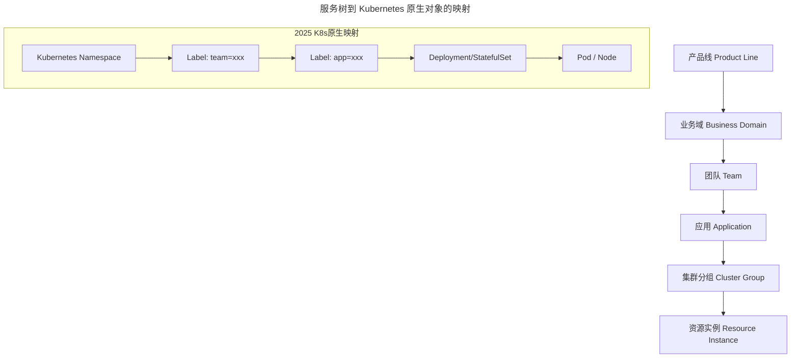
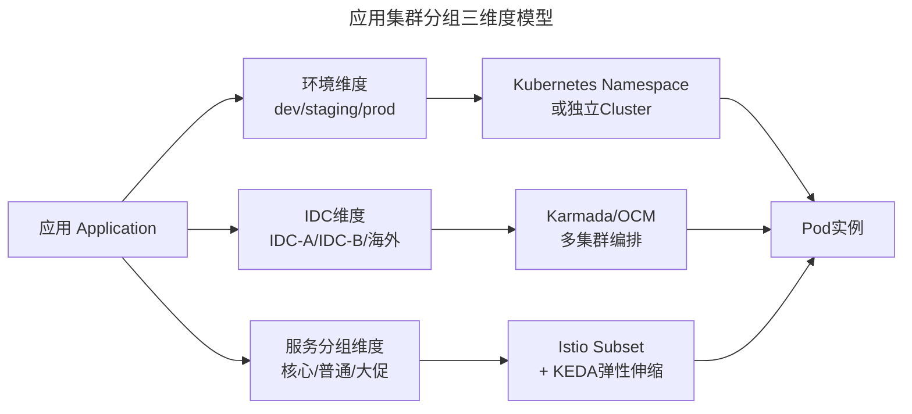
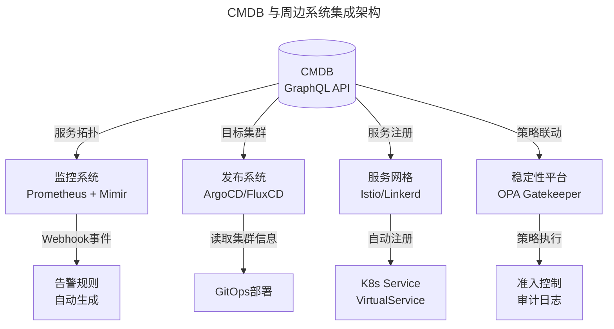

# 08 | 如何在CMDB中落地应用的概念？

> **适用范围**：运维平台架构师、CMDB 建设负责人、SRE、平台工程团队；适用于服务树建设、应用集群分组管理、多环境/多IDC/多服务分组编排、CMDB 与周边系统联动等场景。
>
> **更新摘要（v2 · 2026-08 更新）**：
> - 结构化升级为 6 节骨架（导言 / 核心方法论 / 关键流程 / 工具与实战 / 常见误区 / 进阶延展）
> - 所有 Mermaid 图补充 frontmatter（--- title: ... ---）
> - 原文图片引用保留但补充文字化描述，便于无图环境阅读
> - 补充 Kubernetes Namespace/Label 自动化服务树、Istio DestinationRule、KEDA 弹性伸缩等 2025 关键实践

---

## 1. 导言

> 📅 **原文发布**：2018-2019 | **本次更新**：2025-06 | **更新等级**：🔴全面重写增强

📌 **2025年更新要点**：
- 服务树演进：从手动维护到基于Kubernetes Namespace/Label自动生成
- 集群分组：多环境→多集群(Federation)、多IDC→Kubernetes Cluster API
- CMDB核心位置：从人工查询API → GraphQL统一查询层 + Webhook事件驱动

应用是整个微服务架构体系下运维的核心，而CMDB又是整个运维平台的基石。本文阐述在CMDB中如何落地应用这一核心概念，以及如何建立应用集群分组的思路。

---

## 2. 核心方法论

### 2.1 如何有效组织和管理应用

微服务架构下会产生大量应用，少则十几、几十个，多则上百甚至上千个。面临的第一个问题是如何有效地组织和管理这些应用，避免命名方式和层次结构不统一导致的散乱状态。

#### 服务树概念与演进

"服务树"概念最早由百度运维体系提出，经小米在早期互联网运维实践中传播开来。阿里和腾讯体系中对应称为"应用"，业界通用叫法也为应用。无论称谓如何，关键在于掌握其管理方式。

服务树的核心思想是将应用组织成树形的层次结构。这种管理模式在BAT及其他互联网公司基本一致，虽叫法不同但思路相通。

### 2.2 基于业务维度的应用拆分

**基于业务维度的拆分，对应产生了应用拆分原则**。以电商公司为例：
- **一级维度**：电商、支付、广告、流量、搜索等业务领域
- **二级维度**：电商领域内的用户、会员、商品、交易、商家、店铺、物流等
- **三级维度**：商品领域的详情、SKU、SPU、库存、评价、标签等

技术团队的组织架构基本对应着整个业务技术架构的拆分：**业务架构决定技术架构，技术架构决定研发团队的组织架构**，不同团队单元分别承担对应业务的需求开发和实现职责。

基于上述逻辑，**应用管理思路**明晰为：**产品线-业务团队-应用**。

示例：电商技术-商品团队-商品中心-商品详情

各公司对组织架构定义方式不同（如一、二级部门），但具体团队的分工和职责必然来源于业务架构决定的技术架构。只有如此，各业务团队才会职责清晰，配合协作顺畅。

### 2.3 架构拆分与运维效率的关联

**软件运维阶段的工作效率，很大程度上在前面的业务架构拆分阶段就已确定**。业务架构拆分的合理性、职责的清晰度，决定了后续团队组织架构的合理性和团队职责的清晰性。若此环节未做好，运维阶段必然混乱。

运维能力的体现一定是整体技术架构能力的体现，割裂两者单独看待均无意义。对于当前仍然将运维割裂建设的研发团队，需要重新审视组织架构建设的合理性。

---

## 3. 关键流程

### 3.1 2025年：服务树的自动化构建

**传统模式痛点**：手动维护服务树，应用上下线、组织架构调整时需人工同步，易出现数据不一致。

**2025年演进方向**：

| 维度 | 传统模式 | 2025年自动化方案 |
|------|---------|------------------|
| 数据来源 | 人工录入/Excel导入 | Kubernetes原生对象自动生成 |
| 层次映射 | 手动配置父子关系 | Namespace → Team → Application |
| 开源实现 | 自研脚本 | Backstage (Spotify)、Port、InnerSource Catalog |
| 命名规范 | 内部约定 | DNS subdomain format（符合RFC 1123） |



#### 应用命名规范（含Kubernetes扩展）

基础规范：
- 应用名必须以大小写英文字母以及下划线组合
- 应用名长度不超过40个字符，尽量简单易懂
- 不允许出现机房代号和主机名称等信息

**2025年扩展 - Kubernetes资源命名规范**：
- 符合DNS subdomain format（RFC 1123）
- 仅包含小写字母、数字、`-` 和 `.`
- 以字母或数字开头和结尾
- 最大长度253字符

示例：商品中心命名为 `itemcenter`，商品详情命名为 `itemcenter-detail`

### 3.2 应用的集群服务分组建设

应用的组织管理相对清晰，但再往下的集群服务分组建设则更为复杂。集群服务分组源于以下三个典型需求场景。

#### 场景一：多环境问题

常见环境包括开发联调环境、集成测试环境、预发环境、线上环境等。持续交付实践中所需环境会更多。

**2025年演进**：
- 传统方式：独立物理/虚拟环境，手动配置差异
- 现代方案：**Kubernetes多Cluster或多Namespace隔离**
  - 开发/测试环境：独立的Namespace，资源配额限制
  - 预发/生产环境：独立Cluster或严格隔离的Namespace
  - GitOps工具链：FluxCD / ArgoCD 统一管理多环境配置
  - 配置差异化：Kustomize / Helm Values 分层管理

#### 场景二：多IDC问题

大型互联网业务的单元化部署或海外拓展需求，会在多个IDC机房部署相同代码的应用，但配置可能不同。

**2025年演进**：
- 传统方式：手动维护多IDC拓扑，配置中心按IDC分发
- 现代方案：**Kubernetes多集群编排**
  - Karmada / OCM (Open Cluster Management)
  - Cluster API 统一管理多云/混合云集群生命周期
  - Service Mesh跨集群流量调度（Istio Multi-cluster）
  - 全球负载均衡：Global DNS + Regional Endpoint

#### 场景三：多服务分组问题

此场景与具体业务场景相关。以商品中心IC（Item Center）为例，对外依赖包括商品详情、交易下单、订单、购物车、评价、广告、秒杀活动、会场活动、商家、店铺等一系列应用，但这些依赖应用的优先级不同。

**核心应用与非核心应用分级**：
- **核心应用**：交易支付链路上的应用属于核心应用，任何时候必须优先保障
- **非核心应用**：评价、商家、店铺等应用优先级相对较低
- 判定标准：应用故障是否影响业务收入

因此IC应用下会产生IC交易分组、IC广告分组、IC电商分组等，**这些分组相对固定和静态**。

**2025年演进**：
- 传统方式：LVS/Nginx配置分组路由
- 现代方案：**Istio DestinationRule（Subset 流量分组）/ VirtualService**

#### 场景因素决定的动态分组

以电商大促秒杀场景为例：参加秒杀活动的商品瞬时访问量极大，不参加活动的商品访问量正常。为隔离较大流量，需要多个不同的秒杀IC分组进行资源层面隔离；上层秒杀活动应用在配置中心配置依赖时，需配置到对应的秒杀IC集群分组上，即使秒杀IC出现问题也不影响正常的商品IC访问。

根据场景，不同阶段会有IC的大促秒杀分组，**这种类型的分组需根据实际业务场景动态调整，需要开发和运维共同讨论验证**。

**2025年演进**：
- 传统方式：提前扩容，手动调整分组配置
- 现代方案：**KEDA (Kubernetes Event-driven Autoscaling)**
  - 基于Prometheus指标（QPS、延迟）自动触发扩缩容
  - 支持多种事件源：Kafka、RabbitMQ、Redis Stream、自定义指标
  - 与HPA/VPA协同工作，实现精细化弹性伸缩

### 3.3 集群分组三维度汇总

一般情况下，集群服务分组由以上三个维度中的一个或多个来决定。以商品中心IC为例：



**至此，"应用-集群服务分组-资源"的对应关系建立完成**。此信息被称为"应用树"或"服务树"，是CMDB中最为关键和核心的信息。

| 维度 | 分组依据 | 特征 | 2025年技术方案 | 调整频率 |
|------|---------|------|---------------|---------|
| 多环境 | 部署阶段 | 相对固定 | K8s Namespace + FluxCD/ArgoCD GitOps | 低（变更时调整） |
| 多IDC | 物理位置 | 固定 | Karmada/OCM + Cluster API | 极低 |
| 多服务分组 | 业务优先级/场景 | 混合（固定+动态） | Istio DestinationRule + KEDA Autoscaling | 中高（随业务需求变化） |

### 3.4 CMDB在基础服务体系中的核心位置

CMDB以应用为核心保存"应用-分组-资源"的对应关系，该关系对于周边系统至关重要。

#### 1. 监控系统

传统需求：监控每个应用、每个集群及每台机器上的关键信息。

**2025年演进**：
- **Prometheus + Thanos/Grafana Mimir**：分布式监控方案
- **基于CMDB service graph自动生成告警规则**：
  - 应用上线时，根据CMDB中的应用元信息自动创建ServiceMonitor/PodMonitor
  - 告警规则模板化，结合SLA等级自动匹配阈值
  - 告警通知路由基于CMDB中的团队归属信息（on-call轮值）
- **OpenTelemetry集成**：Trace/Metric/Log统一采集，CMDB提供服务拓扑上下文

#### 2. 发布系统

传统需求：将每个应用对应的代码编译打包，发布到对应集群的主机。

**2025年演进**：
- **ArgoCD / FluxCD**：声明式GitOps持续交付
- **从CMDB读取目标集群信息**：
  - ApplicationSet模板引用CMDB中的集群列表
  - 自动识别应用所属的环境、IDC、分组
  - 发布策略（Canary/RollingUpdate/BlueGreen）基于CMDB中的分组属性
- **镜像仓库联动**：Harbor + CI/CD流水线，CMDB记录应用版本与镜像SHA映射

#### 3. 服务化框架与服务网格

传统需求：依赖应用名和集群分组名，通过配置管理中心注册应用名实现服务和API管理，需与CMDB统一。LVS/Nginx四七层负载、ZK分布式配置管理等涉及服务注册、发现及上下线的基础服务均采用类似思路。

**2025年演进**：
- **Istio / Linkerd / Consul Connect**：Service Mesh取代传统RPC框架的服务发现
- **K8s Service + VirtualService自动注册**：
  - 应用部署时，Operator根据CMDB信息自动创建VirtualService
  - 流量管理规则（熔断、超时、重试）基于CMDB中的SLA配置
- **mTLS零信任安全**：证书管理（cert-manager）与应用身份绑定

#### 4. 基础设施服务

传统需求：分布式DB、缓存和消息队列等需要应用名，以及应用与资源IP或集群分组与IP的对应关系。
- **应用名**：建立应用与分布式服务实例的关系（如应用与缓存Namespace、消息Topic的对应关系），便于生命周期管理和自动化开发
- **应用与资源的对应关系**：核心资源ACL访问控制（用户、交易、支付等敏感数据的数据库白名单）

**2025年演进**：
- **Cloud Native数据库**：TiDB / CockroachDB / Vitess
- **动态ACL**：基于SPIFFE/SPIRE的身份认证，替代静态IP白名单
- **Operator模式**：MySQL Operator / Redis Operator 自动化管理
- **CMDB作为Source of Truth**：统一存储应用与基础设施服务的拓扑关系

#### 5. 稳定性保障平台（服务治理平台）

传统需求：针对系统稳定性的降级限流和开关预案策略直接关联应用；不同集群分组策略可能不同，最终下发到具体服务器上的应用实例，需要应用、集群分组及对应的资源关系。

**2025年演进**：
- **Open Policy Agent (OPA) Gatekeeper**：Kubernetes策略引擎
  - 准入控制（Admission Control）：基于CMDB定义的策略自动拦截违规操作
  - 审计日志：所有变更可追溯至具体应用和操作人
- **Chaos Engineering平台**：Litmus Chaos / Chaos Mesh
  - 故障注入实验基于CMDB中的服务依赖图
  - 爆炸半径评估基于集群分组信息
- **SLI/SLO管理**：基于CMDB中的应用分级（P0/P1/P2）自动设定SLO目标

#### CMDB与周边系统集成总览



---

## 4. 工具与实战

### 4.1 Istio DestinationRule 实践示例

使用 Istio DestinationRule 实现核心应用与非核心应用的流量分组管理：

```yaml
# Istio DestinationRule 示例
apiVersion: networking.istio.io/v1beta1
kind: DestinationRule
metadata:
  name: itemcenter
spec:
  host: itemcenter.default.svc.cluster.local
  trafficPolicy:
    connectionPool:
      tcp:
        maxConnections: 100
    outlierDetection:
      consecutive5xxErrors: 5
      interval: 30s
      baseEjectionTime: 30s
  subsets:
    - name: core-transaction
      labels:
        tier: core
        group: transaction
    - name: normal-ecommerce
      labels:
        tier: normal
        group: ecommerce
```

### 4.2 KEDA 事件驱动自动伸缩

基于 Prometheus 指标（QPS、延迟）自动触发扩缩容，支持多种事件源：

```yaml
# KEDA ScaledObject 示例
apiVersion: keda.sh/v1alpha1
kind: ScaledObject
metadata:
  name: itemcenter-seckill-scaler
spec:
  scaleTargetRef:
    name: itemcenter-seckill
  minReplicaCount: 3
  maxReplicaCount: 50
  pollingInterval: 30
  triggers:
  - type: prometheus
    metadata:
      serverAddress: http://prometheus:9090
      metricName: http_requests_per_second
      threshold: "1000"
      query: sum(rate(http_requests_total{service="itemcenter",group="seckill"}[2m]))
```

### 4.3 数据同步机制演进

监控、发布、基础服务以及稳定性平台均依赖CMDB中"应用-集群服务分组-资源"的对应关系信息。当CMDB中的这些关系发生变化（如新增/下线IP），信息传递机制经历了以下演进：

| 时期 | 同步机制 | 特点 |
|-----|---------|------|
| 2018-2019 | 定时轮询API / 消息队列推送 | 延迟较高，一致性难保证 |
| 2020-2022 | Webhook事件驱动 + 最终一致性 | 实时性好，需处理幂等性 |
| 2023-2025 | **GraphQL统一查询层 + CRD事件广播** | 声明式、可观测、支持订阅 |

**2025推荐架构**：
- **查询层**：GraphQL API，支持周边系统按需精确查询
- **事件层**：CMDB变更通过Webhook/EventBridge推送到各消费方
- **缓存层**：边缘缓存 + TTL，降低CMDB主库压力
- **观测层**：全链路追踪，数据流向可观测

### 4.4 工具链对比（2019 vs 2025）

| 维度 | 原文隐含方案(2019) | 当前推荐(2025) | 变更原因 |
|------|-------------------|----------------|---------|
| **服务树数据源** | 人工录入/Excel | Kubernetes Namespace + Label | 自动化、实时同步 |
| **多环境隔离** | 独立物理/虚拟环境 | K8s Namespace + GitOps | 资源利用率高、配置统一 |
| **多IDC管理** | 手动维护拓扑 | Karmada/OCM + Cluster API | 多集群编排、声明式 |
| **流量分组** | LVS/Nginx配置 | Istio DestinationRule | 细粒度、动态、可观测 |
| **弹性伸缩** | 提前扩容 | KEDA事件驱动 | 按需伸缩、成本优化 |
| **数据同步** | 定时轮询API | GraphQL + Webhook事件驱动 | 实时、按需、可订阅 |

---

## 5. 常见误区

### 5.1 ✅ 推荐做法

1. **基于Kubernetes原生对象自动生成服务树**
   - Namespace对应团队/业务域，Label标记应用归属
   - 应用上下线时服务树自动更新，避免人工同步
   - 使用Backstage/Port等IDP工具提供开发者友好的视图

2. **集群分组按维度正交分解**
   - 环境维度、IDC维度、服务分组维度相互独立
   - 每个维度选择最适合的技术方案（Namespace/Karmada/Istio）
   - 避免维度混淆导致的配置爆炸

3. **CMDB作为单一事实来源（Source of Truth）**
   - 所有周边系统从CMDB读取"应用-分组-资源"关系
   - 变更通过Webhook事件驱动同步，避免多源头写入
   - 提供GraphQL统一查询层，支持按需精确查询

### 5.2 ⚠️ 常见陷阱

1. **❌ 手动维护服务树**
   - 应用上下线、组织架构调整时需人工同步
   - **后果**：数据不一致，周边系统依赖错误信息
   - **改进**：基于Kubernetes原生对象自动生成

2. **❌ 动态分组配置后忘记回收**
   - 大促秒杀分组活动结束后未及时清理
   - **后果**：资源浪费，配置混乱
   - **改进**：使用KEDA基于指标自动伸缩，设置TTL自动回收

3. **❌ 忽视命名规范**
   - 应用名包含机房代号、主机名等信息
   - **后果**：跨环境迁移困难，不符合Kubernetes命名约束
   - **改进**：遵循RFC 1123 DNS subdomain format

4. **❌ CMDB数据同步依赖定时轮询**
   - 周边系统定时轮询CMDB API获取最新关系
   - **后果**：延迟较高，IP变更后告警发到错误团队
   - **改进**：采用Webhook事件驱动 + GraphQL按需查询

---

## 6. 进阶延展

### 6.1 官方文档与权威资源

- [Kubernetes Namespace](https://kubernetes.io/docs/concepts/overview/working-with-objects/namespaces/) - 命名空间隔离
- [Kubernetes Labels and Selectors](https://kubernetes.io/docs/concepts/overview/working-with-objects/labels/) - 标签选择器
- [Istio DestinationRule](https://istio.io/latest/docs/reference/config/networking/destination-rule/) - 流量管理
- [KEDA Documentation](https://keda.sh/docs/) - 事件驱动自动伸缩
- [Karmada](https://karmada.io/docs/) - 多集群编排
- [Backstage Software Catalog](https://backstage.io/docs/features/software-catalog/) - 软件目录

### 6.2 推荐阅读

- **《Team Topologies》** by Matthew Skelton - 理解团队拓扑与组织架构
- **《Building Microservices》** by Sam Newman - 微服务架构下的应用组织
- **《SRE: Google运维解密》** - 理解服务树与SLO的关系
- **《Infrastructure as Code》** by Kief Morris - 声明式配置管理

### 6.3 开源项目参考

- [Backstage](https://github.com/backstage/backstage) - 开发者门户框架
- [Port](https://github.com/port-labs/port) - 内部开发者平台
- [Karmada](https://github.com/karmada-io/karmada) - Kubernetes 多集群管理
- [OCM (Open Cluster Management)](https://github.com/open-cluster-management-io) - 开放集群管理
- [KEDA](https://github.com/kedacore/keda) - Kubernetes 事件驱动自动伸缩
- [ArgoCD ApplicationSet](https://argo-cd.readthedocs.io/en/stable/operator-manual/applicationset/) - 多集群 GitOps 部署

### 6.4 关键总结

**基于以应用为核心的CMDB，衍生出"应用-集群服务分组-资源"这一运维体系中的核心关系**。CMDB不是简单的资产台账，而是连接业务架构与技术架构的枢纽。2025年的CMDB应具备自动化数据采集（Kubernetes原生对象）、声明式API（GraphQL）、事件驱动同步三大能力，真正成为云原生时代的"单一事实来源"（Single Source of Truth）。
