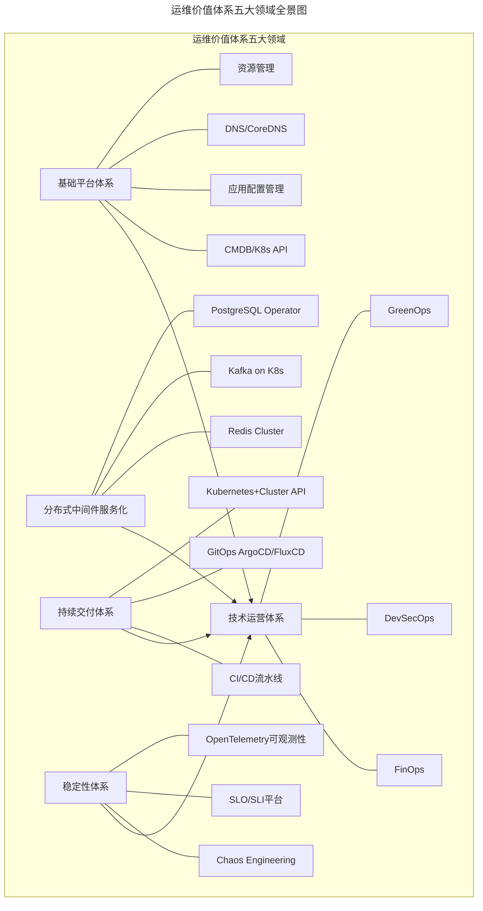
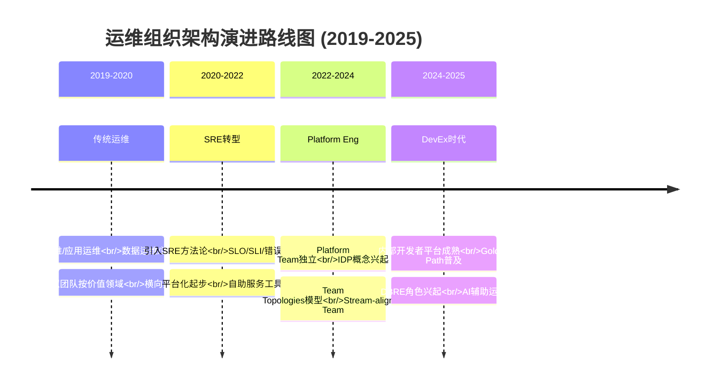
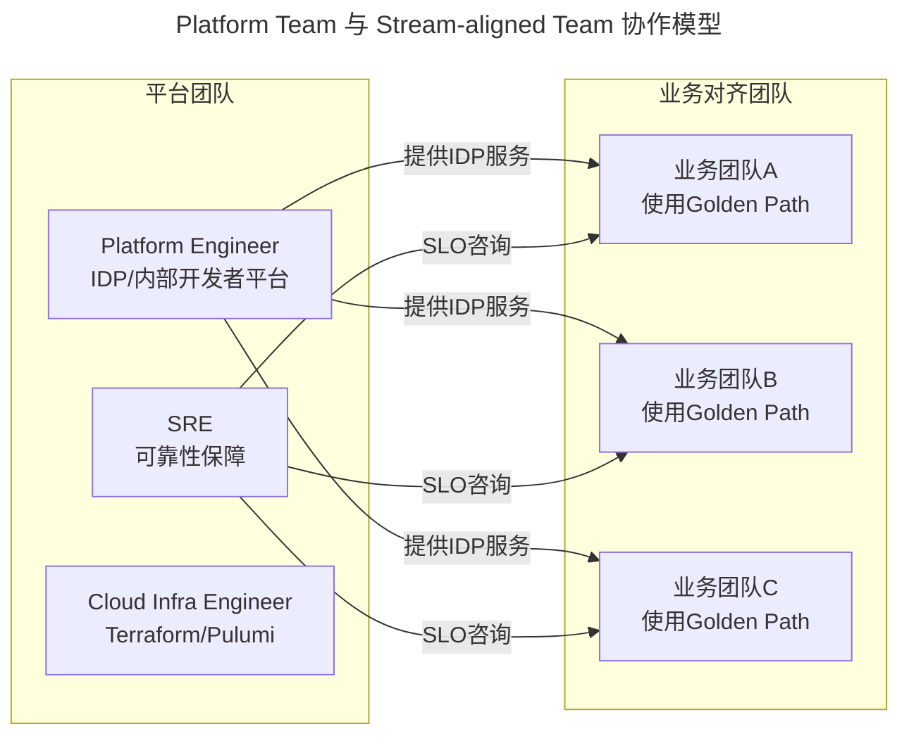

# 09 | 如何打造运维组织架构？

> **适用范围**：技术管理者、运维团队负责人、SRE Team Lead、平台工程负责人；适用于运维组织架构设计、Team Topologies 落地、Platform Engineering 转型、运维技能模型升级等场景。
>
> **更新摘要（v2 · 2026-08 更新）**：
> - 结构化升级为 6 节骨架（导言 / 核心方法论 / 关键流程 / 工具与实战 / 常见误区 / 进阶延展）
> - 所有 Mermaid 图补充 frontmatter（--- title: ... ---）
> - 原文「延伸阅读」「推荐书目」统一并入进阶延展
> - 补充 Team Topologies、Platform Engineering、DBRE、DevEx 等 2025 组织演进关键实践

---

## 1. 导言

> 📅 **原文发布**：2018-2019 | **本次更新**：2025-06 | **更新等级**：🔴全面重写增强

📌 **2025年更新要点**：
- 运维岗位演变：传统Ops → SRE → Platform Engineering → DevEx（Developer Experience，开发者体验）
- 组织模式：虚拟团队 → Platform Team + Stream-aligned Team (Team Topologies)
- 运维价值体系五大领域全面云原生化

专栏的第一篇介绍了Netflix的云平台组织架构，Netflix提供了一个重要的思路和方向：**在提供基础服务能力的同时，提供对应的自助化运维能力**。开发人员可以在这样一个平台上完成所需的运维操作，而不再依赖运维人员。

### Netflix启示 2025版

随着云原生技术的成熟，Netflix的模式在2025年有了新的演进：

- **Internal Developer Platform (IDP)** 取代单纯的自助平台概念：IDP不仅是工具集合，更是为开发者提供自服务的完整平台，包含预配置的环境、模板化的工作流、可复用的组件库
- **Platform Engineering 作为独立职能崛起**：平台工程成为连接基础设施与应用开发的桥梁，专门负责构建和维护内部开发者平台
- **Golden Path（黄金路径）**：预封装的最佳实践开发路径，开发者沿着黄金路径可以快速构建符合组织标准的应用，避免重复造轮子和技术债务积累

**核心原则**：做好运维和整个技术架构体系的融合，避免割裂两者。不仅要促进组织架构层面的融合，更重要的是促进职能协作上的融合。

---

## 2. 核心方法论

### 2.1 从价值呈现的角度看运维

运维能力的体现是整体技术架构能力的体现。**要想做好运维就一定要跳出运维这个框框**，从全局的角度来看运维，**要考虑如何打造和体现出整个技术架构的运维能力，而不是运维的运维能力**。如果仍然片面地从运维的角度看运维，片面地从运维的角度规划运维，是无法走出运维低价值的困局的。

从效率、稳定和成本这三个研发团队最重要的目标出发，从运维角度能够与这三个点契合的工作，总结为以下五个领域。

### 2.2 运维价值体系五大领域全景图

五大领域以技术运营体系为汇聚点：基础平台、中间件服务化、持续交付、稳定性体系为四大支柱，技术运营体系贯穿其中，确保标准、指标、规则、流程有效落地。

---

## 3. 关键流程

### 3.1 运维基础平台体系建设

主要包括标准化体系以及CMDB、应用配置管理、DNS域名管理、资源管理等偏向运维自身体系的建设。这一部分是运维的基础和核心，标准化以及应用体系建设都属于这个范畴。

| 传统方案 | 云原生替代方案 | 说明 |
|---------|--------------|------|
| CMDB | Kubernetes API Server + Custom Resource Definitions | 声明式API管理所有资源 |
| DNS管理 | CoreDNS + ExternalDNS | 自动化DNS记录管理 |
| 资源管理 | Terraform/Pulumi + Cloud Provider APIs | 基础设施即代码 |
| 配置管理 | ConfigMap/Secret + External Secrets Operator | 敏感信息外部化管理 |

### 3.2 分布式中间件的服务化建设

在整个技术架构体系中，分布式中间件基础服务起到支撑作用。基于开源产品的二次开发或自研的中间件产品，需要有对应的标准化和服务化建设。这是容易割裂运维与技术架构行为的典型部分。

| 中间件类型 | 传统模式 | 云原生模式 |
|-----------|---------|-----------|
| 缓存 | 自建Redis集群 | Redis Cluster on K8s / Redis Operator |
| 消息队列 | 自建Kafka集群 | Kafka on K8s (Strimzi Operator) / Pulsar |
| 数据库 | 物理机/虚拟机部署 | PostgreSQL Operator / MySQL Operator / Cloud SQL |
| 搜索引擎 | ES集群手动维护 | Elasticsearch on K8s / OpenSearch Managed Service |

**DBRE (Database Reliability Engineer，数据库可靠性工程师) 角色兴起**：专注于数据库可靠性工程，结合SRE方法论与数据库专业知识。

### 3.3 持续交付体系建设

持续交付体系是拉通运维和业务开发的关键纽带，是提升整个研发团队效率的关键部分。包括从应用创建、研发阶段的持续集成，上线阶段的持续部署发布，再到线上运行阶段的各类资源服务扩容缩容等。

| 阶段 | 传统方案 | 现代方案 |
|-----|---------|---------|
| CI流水线 | Jenkins | GitHub Actions / GitLab CI / Tekton |
| CD部署 | 脚本化部署 | ArgoCD / FluxCD (GitOps) |
| 容器编排 | Docker Swarm / KVM | Kubernetes + Cluster API |
| 环境管理 | 手动创建 | Environment as Code (Crossplane) |
| 发布策略 | 蓝绿部署 | Canary Release (Argo Rollouts) / Progressive Delivery |

### 3.4 稳定性体系建设

软件系统线上的稳定性保障，包括快速发现线上问题、快速定位问题、快速从故障中恢复业务、有效评估系统容量等。还包括故障应急响应机制、故障管理、故障复盘、日常演练等运作机制建设。

| 能力域 | 传统实践 | 现代实践 |
|-------|---------|---------|
| 故障预防 | 手工预案 | Chaos Engineering (Litmus / Chaos Mesh) |
| 可靠性指标 | SLA/SLO文档 | SLO平台 (Pyrra / Sloth) + 错误预算 |
| 可观测性 | 分散监控工具 | OpenTelemetry统一可观测性栈 |
| 故障响应 | 人工On-call | 自动化告警抑制/升级 + Runbook Automation |
| 容量规划 | 经验估算 | 基于历史数据的预测性容量规划 |

### 3.5 技术运营体系建设

技术运营体系偏运作机制方面的建设，最主要的是确保制定的标准、指标、规则和流程能够有效落地。有些可以通过技术平台来实现，有些就需要管理流程，有些还需要执行人的沟通协作这些软技能。

| 领域 | 传统方式 | 现代方式 |
|-----|---------|---------|
| 成本优化 | 月度人工审查 | FinOps Platform (Kubecost / OpenCost) |
| 安全合规 | 定期审计扫描 | DevSecOps Policy-as-Code (OPA / Kyverno) |
| 绿色计算 | 无 | GreenOps (碳足迹追踪 + 资源优化) |
| 标准落地 | 文档+培训 | IDP Golden Paths 强制引导 |

通过上述规划，团队以虚拟形式重新规划不同职责，分别负责基础平台体系、分布式中间件服务化体系、持续交付体系和稳定性体系。对于技术运营体系，作为共性要求提出，要求团队成员具备技术运营意识：制定输出标准的意识和能力、规范流程制定的能力、将标准和流程固化到工具平台中的能力、确保承载了标准和规范的平台落地的能力。

### 3.6 运维协作模式的改变

上述工作并非由运维团队内部封闭完成。要站在如何能够打造和发挥出整个技术架构体系运维能力的视角，而不仅仅是发挥运维团队的运维能力。这些工作由运维团队发起，与周边技术团队协作配合来完成，都需要跨团队协作。一方面运维团队主动推进；另一方面必须得到上级主管甚至是更高层技术领导的支持，要求技术管理者具备促进组织协作方式变革的意识。

**各领域的具体协作模式**：

1. **运维基础平台建设**：大多数工作由Cloud Infrastructure Engineer完成，这是运维的基础，也属于整个技术架构比较关键的基础平台之一。使用Terraform/Pulumi实现Infrastructure as Code，通过Kubernetes CRDs管理所有资源。

2. **分布式中间件服务化建设**：与分布式中间件团队配合制定各种使用标准、规范和流程；中间件团队负责提供运维服务能力的接口；Platform Engineer根据用户场景进行场景化需求分析，并最终实现场景，同时负责标准和自助化工具平台的推广和落地。DBRE角色在此领域发挥关键作用。

3. **持续交付体系建设**：涉及多个团队的协作。容器化方案下，涉及镜像制作、网络配置以及对象存储等底层技术与虚拟化/云原生团队配合。同时与中间件团队协作，因为在应用发布和扩容缩容过程中会涉及服务上下线，与服务化框架配合。采用GitOps模式，通过ArgoCD/FluxCD实现声明式持续交付。

4. **稳定性体系建设**：涉及链路埋点、限流降级、开关预案等技术方案需求。通常有专门的SRE或稳定性工具团队，对外输出稳定性保障能力，如通用SDK的开发、后台日志采集分析及数据计算等。Chaos Engineering实践（使用Litmus/Chaos Mesh）用于主动发现系统脆弱性。OpenTelemetry统一可观测性数据采集，Pyrra/Sloth管理SLO。

**运维在这个过程中要发挥的最关键作用就是通过用户使用场景的分析，将各项基础服务封装并友好地提供出来，并确保最终的落地**。方式上，或者是通过**工具平台的技术方式**，比如分布式中间件基础服务和IDP；或者是通过**技术运营能力**，比如稳定性能力在业务层面的落地和SLO的推广执行。

**运维在这个过程中，就好像串起一串珍珠的绳子，将整个平台技术的不同部门，甚至是开发团队给串联起来，朝着发挥出整体技术架构运维能力的方向演进**。

---

## 4. 工具与实战

### 4.1 运维组织架构演进路线图

路线图揭示四个阶段：传统运维按价值领域横向拉通 → 引入SRE方法论 → Platform Team独立 → DevEx时代全面成熟。

### 4.2 协作模式 2025: Platform Team vs Stream-aligned Team

基于Team Topologies模型的现代运维协作模式：

**关键特征**：
- **Platform Team**：负责构建和维护Internal Developer Platform (IDP)，如Backstage/Port自助服务门户，减少Stream-aligned Team的认知负载
- **Stream-aligned Team**：专注于业务价值交付，通过IDP获得自助服务能力，无需深入了解底层基础设施细节
- **协作原则**：Platform Team将复杂的基础设施抽象为易于使用的服务，Stream-aligned Team消费这些服务而非直接操作基础设施

### 4.3 实体组织架构 2025 演进

从实际的人员管理以及技能维度来划分，传统实体组织架构基本分为以下几个岗位：

- **基础运维**：包括IDC运维、硬件运维、系统运维以及网络运维
- **应用运维**：主要是业务和基础服务层面的稳定性保障和容量规划等工作
- **数据运维**：包括数据库、缓存以及大数据的运维
- **运维开发**：主要是提供效率和稳定性层面的工具开发

| 传统岗位 | 2025演进角色 | 核心职责 | 关键技能 |
|---------|-------------|---------|---------|
| 基础运维 | Cloud Infrastructure Engineer | IaC编写、云资源管理、成本优化 | Terraform/Pulumi, AWS/GCP/Azure, Kubernetes |
| 应用运维 | Site Reliability Engineer (SRE) | SLO/SLI定义、错误预算管理、故障响应 | SLO框架、Chaos Engineering、On-call流程 |
| 数据运维 | Data Platform Engineer / DBRE | 数据库可靠性、数据平台运维、性能调优 | PostgreSQL/MySQL Operator, Redis Cluster, Kafka |
| 运维开发 | Platform Engineer | IDP构建、Golden Path设计、开发者体验优化 | Backstage/Port, Kubernetes Operators, API设计 |

实体的组织架构相当于从技能层面的垂直划分。而前面所说的从价值呈现层面进行的虚拟团队划分，则是将上述几个实体团队技能上的横向拉通，让他们重新组织，形成技能上的互补，从而发挥出更大的团队能力。

实体组织架构相当于一个人的骨骼框架，但是价值呈现层面的虚拟组织就更像是一个人的灵魂，体现着这个人的精神面貌和独特价值。这个过程必然会对**运维的技能模型**有更新、更高的要求。

### 4.4 运维技能模型 2025

| 技能维度 | 传统要求 | 2025要求 | 重要程度 |
|---------|---------|---------|---------|
| **基础设施** | Linux管理、网络基础 | IaC (Terraform/Pulumi)、多云管理、Kubernetes深度 | ⭐⭐⭐⭐⭐ |
| **编码能力** | Shell/Python脚本 | Go/Rust (Operator开发)、TypeScript (前端)、API设计 | ⭐⭐⭐⭐⭐ |
| **可靠性工程** | 监控告警、故障处理 | SLO/SLI设计、错误预算、Chaos Engineering、Post-mortem文化 | ⭐⭐⭐⭐⭐ |
| **平台工程** | 工具开发 | IDP设计、Golden Path构建、开发者体验优化、Backstage插件开发 | ⭐⭐⭐⭐☆ |
| **可观测性** | Zabbix/Nagios | OpenTelemetry、Prometheus/Grafana、分布式追踪、日志分析 | ⭐⭐⭐⭐☆ |
| **安全合规** | 基础安全意识 | DevSecOps、Policy-as-Code (OPA/Kyverno)、密钥管理 | ⭐⭐⭐⭐☆ |
| **成本优化** | 资源统计 | FinOps实践、资源利用率分析、Spot实例策略 | ⭐⭐⭐☆☆ |
| **软技能** | 沟通协调 | 技术影响力、跨团队协作、文档写作、技术演讲 | ⭐⭐⭐⭐☆ |

---

## 5. 常见误区

### 5.1 ✅ 推荐做法

1. **以价值呈现为导向组织虚拟团队**
   - 打破实体团队边界，按五大价值领域横向拉通
   - 虚拟团队跨实体组织协作，形成技能互补
   - 实体组织是骨骼，虚拟组织是灵魂

2. **投资Platform Engineering，构建IDP**
   - 将复杂的基础设施抽象为易于使用的自助服务
   - 设计Golden Path引导开发者遵循最佳实践
   - 降低业务团队的认知负载，提升交付效率

3. **运维跳出运维框框，从全局看运维**
   - 运维能力是整体技术架构能力的体现
   - 与周边技术团队协作配合，而非封闭完成
   - 运维像串起珍珠的绳子，串联整个平台技术部门

4. **持续升级运维技能模型**
   - 从脚本运维转向IaC + Operator开发
   - 从被动告警转向SLO + Chaos Engineering
   - 从工具开发转向IDP设计 + 开发者体验优化

### 5.2 ⚠️ 常见陷阱

1. **❌ 割裂运维与技术架构**
   - 将运维视为独立职能，与技术架构脱节
   - **后果**：运维低价值困局，无法发挥整体技术架构能力
   - **改进**：运维能力是整体技术架构能力的体现，二者不可割裂

2. **❌ 实体组织固化，缺乏横向拉通**
   - 严格按基础运维/应用运维/数据运维/运维开发垂直划分
   - **后果**：团队各自为政，缺乏协作，价值难以呈现
   - **改进**：建立按价值领域的虚拟团队，横向拉通实体组织

3. **❌ 忽视Platform Engineering投入**
   - 认为IDP/Golden Path是"锦上添花"，优先级低
   - **后果**：业务团队认知负载高，重复造轮子，技术债务积累
   - **改进**：将Platform Engineering作为独立职能投入建设

4. **❌ 组织架构一成不变**
   - 期望找到"一劳永逸"的组织架构
   - **后果**：组织与业务/技术发展脱节
   - **改进**：组织架构需不断与团队和业务特点匹配契合，持续调整

---

## 6. 进阶延展

### 6.1 官方文档与权威资源

- [Team Topologies](https://teamtopologies.com/) - 团队拓扑模型官方
- [Backstage](https://backstage.io/) - 内部开发者平台框架
- [CNCF Platform Engineering WG](https://tag-app-delivery.cncf.io/) - CNCF 平台工程工作组
- [SRE Book (Google)](https://sre.google/sre-book/table-of-contents/) - SRE 方法论权威
- [OpenTelemetry](https://opentelemetry.io/) - 可观测性统一标准
- [FinOps Foundation](https://www.finops.org/) - 云财务运营实践

### 6.2 推荐阅读

- **《Team Topologies》** by Matthew Skelton & Manuel Pais - 理解平台团队与业务对齐团队的协作模型
- **《SRE: Google运维解密》** - SRE 方法论与组织架构的行业共识
- **《The Phoenix Project》** by Gene Kim - 理解 IT 运维的三种工作类型
- **《Accelerate》** by Nicole Forsgren - 研发效能与组织架构的关系
- **《Platform Engineering: A guide for technical leaders》** - 平台工程实践指南

### 6.3 开源项目参考

- [Backstage](https://github.com/backstage/backstage) - 开发者门户框架
- [Port](https://github.com/port-labs/port) - 内部开发者平台
- [ArgoCD](https://github.com/argoproj/argo-cd) - GitOps 持续交付
- [Pyrra](https://github.com/pyrra-dev/pyrra) - SLO 管理工具
- [Sloth](https://github.com/slok/sloth) - Prometheus SLO 生成器
- [Kubecost](https://github.com/kubecost/cost-model) - Kubernetes 成本监控
- [Kyverno](https://github.com/kyverno/kyverno) - Kubernetes 策略引擎

### 6.4 关键总结

本文介绍的运维组织架构模式与《SRE：Google运维解密》中的章节目录高度对应，这印证了该组织模式的行业共识性。**业界没有一劳永逸的组织架构，也没有放之四海而皆准的组织架构标准，更没有万能的可以解决任何问题的组织架构设计**。关键在于如何能够发挥出团队整体的能力和价值，这一点需要不断地与自己所在团队和业务特点去匹配和契合，这是一个不断变化的过程，也是需要持续调整的过程。

这对技术管理者提出了更高要求：如何不断地去匹配和契合最佳价值点，同时统筹调度好团队中不同类型的技术资源并形成合力。在2025年的背景下，这意味着要拥抱Platform Engineering理念，投资于Internal Developer Platform的建设，培养具有SRE思维和平台工程能力的复合型人才。
