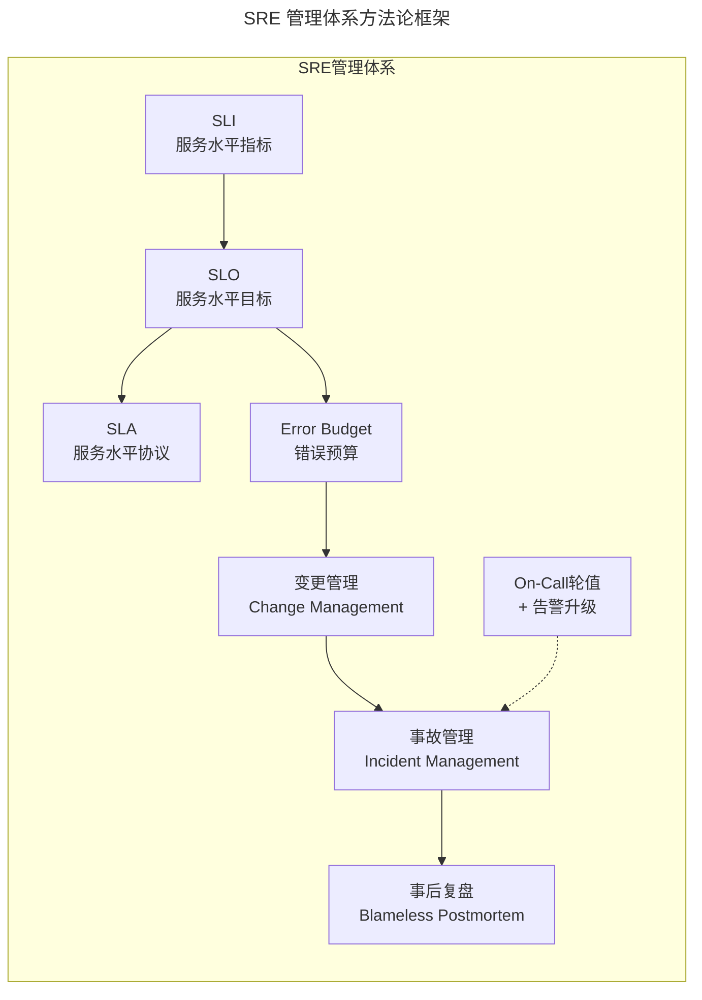
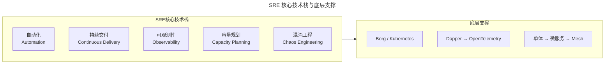
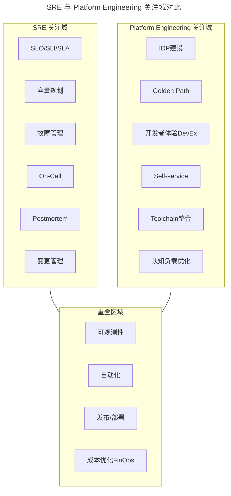
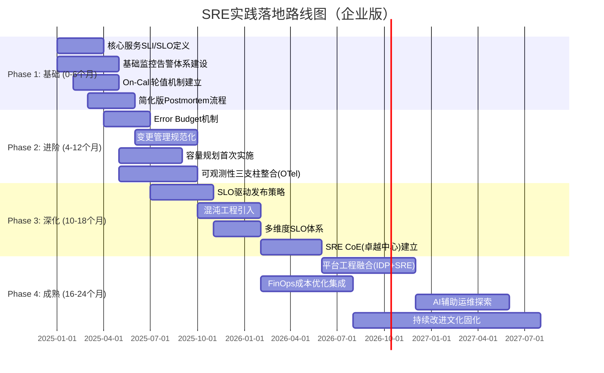
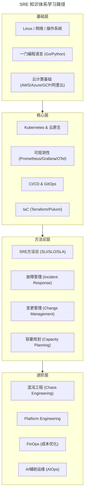

# 10 | 谷歌SRE运维模式解读

> **适用范围**：SRE、运维团队负责人、技术管理者、平台工程师；适用于 SRE 方法论落地、SLI/SLO/SLA 体系建设、On-Call 轮值设计、Toil 消除、Platform Engineering 转型等场景。
>
> **更新摘要（v2 · 2026-08 更新）**：
> - 结构化升级为 6 节骨架（导言 / 核心方法论 / 关键流程 / 工具与实战 / 常见误区 / 进阶延展）
> - 所有 Mermaid 图补充 frontmatter（--- title: ... ---）
> - 原文「推荐阅读」「学习路径」统一并入进阶延展
> - 补充 SRE vs Platform Engineering、DORA Metrics、AI-augmented SRE 等 2025 关键实践

---

## 1. 导言

> 📅 **原文发布**：2018-2019 | **本次更新**：2025-06 | **更新等级**：🔴全面重写增强（重点文章）

前面我和你分享了一些关于运维组织架构和协作模式转型的内容，为了便于我们更加全面地了解先进的运维模式，今天我们再来谈一下谷歌的SRE（Site Reliability Engineer，站点可靠性工程师）。同时，也期望你能在我们介绍的这些运维模式中找到一些共通点，只有找到这些共通点，才能更深刻地理解，并借鉴到真正对我们有用的东西。

专栏的第一篇文章我们介绍了Netflix的NoOps模式。这个模式并不意味着不存在任何运维工作，只是Netflix将这些事情更紧密地融入到了日常的开发工作中，又做得非常极致，所以并没有很明显地体现出来。

但是，谷歌的SRE却是一个真实具体的岗位，也有明晰的岗位职责。从借鉴意义上来讲，SRE可以给我们提供更好的学习思路和样板。

> **📚 SRE知识体系演进（2016-2025）**：
>
> | 年份 | 出版物/事件 | 意义 |
> |------|------------|------|
> | 2016 | 《SRE：Google运维解密》中文版发布 | SRE概念在国内引爆 |
> | 2018 | **《Site Reliability Workbook》** 发布 | 从"是什么"到"怎么做"的操作指南 |
> | 2020 | **《Building Secure & Reliable Systems》** | 安全+可靠性一体化工程实践 |
> | 2021 | Google Cloud推出 **Professional SRE认证** | SRE职业化、标准化 |
> | 2022 | CNCF发布 **SRE Principles白皮书** | 云原生时代的SRE原则 |
> | 2023 | **《Practical Observability》**(Charity Majors) | 可观测性作为SRE核心能力的深化 |
> | 2023 | **《Production Readiness》(Google)** | 生产就绪评审体系完整公开 |
> | 2024 | OpenSLO规范成熟 + 多家SLO平台商业化 | SLO实践工具化、标准化 |
> | 2025 | **AI-augmented SRE** 探索 | LLM辅助故障排查、Runbook自动生成 |

---

## 2. 核心方法论

### 2.1 SRE岗位的定位

首先，SRE关注的目标不是Operation（运维），而是Engineering（工程），是一个"**通过软件工程的方式开发自动化系统来替代重复和手工操作**"的岗位。我们从SRE这本书的前面几个章节，可以看到谷歌不断强调SRE的工程能力：

> Common to all SREs is the belief in and aptitude for developing software systems to solve complex problems.
>
> 所有的SRE团队成员都必须非常愿意，也非常相信用软件工程方法可以解决复杂的运维问题。
>
> By design, it is crucial that SRE teams are focused on engineering.
>
> SRE模型成功的关键在于对工程的关注。
>
> SRE is what happens when you ask a software engineer to design an operations team.
>
> SRE就是让软件工程师来设计一个新型运维团队的结果。

与之相对应的，还有一个很有意思的地方，整本书中提到Operation的地方并不多，而且大多以这样的词汇出现：Operation load，Operation overload，Traditional/Manual/Toil/Repetitive Operation Works。

我们可以看到，从一开始，谷歌就没把SRE定义为纯操作类运维的岗位，也正是**谷歌换了一个思路，从另外一个维度来解决运维问题，才把运维做到了另一个境界**。

### 2.2 Toil（苦役工作）—— SRE的核心敌人

Google对 **Toil** 的定义是：**"与手动、重复性、自动化程度低、且价值随规模线性增长的工作"**。SRE的黄金法则是：

> **SRE团队至少应该将50%的时间花在工程活动上，Toil活动不应超过50%。**

**Toil的典型例子**：
- 手动创建/修改监控告警规则
- 手动执行数据库备份和恢复
- 手动处理工单式的资源申请
- 手动编写和发送故障报告
- 手动执行上线前的环境检查清单

**非Toil的工程活动**：
- 开发新的自动化工具或平台
- 优化现有系统的性能和可靠性
- 参与架构设计和评审
- 编写文档和Runbook
- 进行Postmortem复盘和改进

> **💡 2025年视角**：随着 **Platform Engineering** 和 **AI-augmented Operations** 的发展，Toil的消除有了新的路径：
> - **IDP（内部开发者平台）** 将大量原本需要SRE介入的操作转化为自助服务
> - **LLM驱动的ChatOps** 可以自动处理常规查询和简单操作
> - **Agentic Workflows** 让AI Agent自主完成标准化的运维任务
> - 但要注意：**AI不是银弹**，复杂的故障诊断、架构决策仍需人类SRE的专业判断

### 2.3 SRE岗位的职责

书中对SRE的职责定义比较明确，**负责可用性、时延、性能、效率、变更管理、监控、应急响应和容量管理等相关的工作**。如果站在价值呈现的角度，我觉得可以用两个词来总结，就是"**效率**"和"**稳定**"。

SRE，直译过来是网站稳定性工程师。表面看是做稳定的，但是我觉得更好的一种理解方式是，**以稳定性为目标，围绕着稳定这个核心，负责可用性、时延、性能、效率、变更管理、监控、应急响应和容量管理等相关的工作**。

分解一下，这里主要有"管理"和"技术"两方面的事情要做。

---

## 3. 关键流程

### 3.1 管理体系：SRE的方法论框架

#### 1. SLI / SLO / SLA — 可靠性的度量体系

这是SRE方法论中最具革命性的贡献之一。传统运维往往使用"99.9%可用性"这样模糊的目标，而SRE引入了精确的、可测量的、可执行的可靠性目标体系。

| 概念 | 定义 | 示例 |
|------|------|------|
| **SLI (Service Level Indicator)** | 衡量服务某方面性能的量化指标 | API请求延迟P99 < 200ms；错误率 < 0.1% |
| **SLO (Service Level Objective)** | 基于SLI设定的目标值 | API可用性 SLO = 99.9%（每月允许43.2分钟宕机）|
| **SLA (Service Level Agreement)** | 与客户/业务方承诺的服务水平协议，通常比SLO更严格 | 承诺给客户的可用性 = 99.95%，包含赔偿条款 |
| **Error Budget** | 1 - SLO = 允许的错误预算 | 如果SLO=99.9%，则月度Error Budget = 43.2分钟 |

> **⚡ Error Budget的革命性意义**：
>
> 传统思维："100%可用性才是好的" → 导致不敢发布新功能
>
> SRE思维："我们预定了1%的错误预算" → 在预算内大胆创新，快速迭代
>
> **当Error Budget即将耗尽时** → 自动触发发布暂停机制
>
> **当Error Budget充裕时** → 鼓励更大胆的变更和创新

> **🔄 2025年SLO实践现状**：
> - **OpenSLO** 成为跨厂商的SLO定义标准（类似OpenTelemetry之于可观测性）
> - **SLO Platform** 商业化与开源产品成熟：Nobl9、Sloth、Pyrra
> - **多层SLO**：从基础设施层→服务层→用户体验层的SLO层级体系
> - **前置SLO(Pre-SLO)**：在服务设计阶段就纳入可靠性目标（Google Production Readiness Review的核心）

#### 2. 变更管理（Change Management）

Google SRE的一个核心理念是：**70%以上的生产事故都是由变更引起的**。因此，变更管理是SRE工作的重中之重。

**Google的变更管理最佳实践**：
- **渐进式发布（Gradual Rollout）**：1% → 5% → 25% → 100%
- **变更窗口期**：限制高风险变更的时间窗口
- **变更回滚策略**：每个变更必须具备一键回滚能力
- **变更审查委员会（CAB）**：关键变更需要多人审批

> **🔄 2025年现代变更管理**：
> - **Progressive Delivery工具**：Argo Rollouts、Flagger实现自动化的金丝雀/蓝绿部署
> - **Trunk-Based Development** + **Feature Flags**：减少分支合并风险
> - **Keptn / Reliably** 等SLO-driven的发布编排工具
> - **Policy-as-Code**：使用OPA/Gatekeeper强制变更策略
> - **AI辅助变更风险评估**：基于历史数据预测变更失败概率

#### 3. 事故管理与事后复盘（Incident & Postmortem）

**Blameless Postmortem（无责复盘）** 是SRE文化中最具人文关怀的部分：

**五大原则**：
1. **不追责个人（Blameless）**：系统是人设计的，人犯错是因为系统允许人犯错
2. **关注改进而非指责**：目标是防止同类问题再次发生
3. **及时性**：事故发生后一周内完成
4. **可操作性**：每条Action Item必须有负责人和截止日期
5. **公开透明**：Postmortem文档对全公司开放

#### 4. On-Call（值班）机制

SRE实行 **7x24小时On-Call轮值制度**，但Google有一套精心设计的机制来保护SRE的健康和工作生活平衡：

**核心原则**：
- **每次On-Call不超过一周**
- **每周最多处理2次严重告警(P1/P0)**
- **如果频繁被唤醒，说明系统有问题需要修复，而不是人的问题**
- **Toil超过50%时，暂停所有新功能开发，全力减负**

> **🔄 2025年On-Call现代化**：
> - **智能告警聚合**：利用ML/LLM减少告警风暴（BigPanda、PagerDuty AI Ops）
> - **Grafana OnCall / Opsgenie**：集成Slack/Teams/钉钉的企业级On-Call管理
> - **Runbook Automation**：LLM根据告警类型自动推荐处置步骤
> - **Cognitive Load意识**：避免On-Call期间安排需要深度思考的工作

### 3.2 技术体系：支撑SRE方法论的工程能力

可以看到技术上的平台和系统是用来支撑管理手段的。谷歌的运维其实并没有单独去提自动化、发布、监控等内容，而是通过稳定性这个核心目标，把这些事情全部串联在一起，同时又得到了效率上的提升。

#### 1. 自动化（Automation）

是为了减少人为的、频繁的、重复的线上操作，以大大减少因人为失误造成的故障，同时提升效率。比如谷歌内部大名鼎鼎的Borg系统，可以随时随地实现无感知的服务迁移。现在，它的开源版本，已然成为业界容器编排体系标准的Kubernetes。

> **📖 Borg到Kubernetes的演进**：
>
> | 时间 | 里程碑 | 意义 |
> |------|--------|------|
> | 2003-2007 | Google内部开发Borg | 全球最大集群管理系统诞生 |
> | 2014 | Kubernetes开源发布 | Borg/Omega理念的工业级实现 |
> | 2015 | Google发表Borg论文；K8s v1.0 GA并捐赠CNCF | 业界首次了解Borg；容器编排标准化起步 |
> | 2017 | Kubernetes成为容器编排事实标准 | 主流云厂商与Docker生态全面支持 |
> | 2020-2022 | K8s成为云操作系统 | EKS/GKE/AKS全面成熟 |
> | 2024-2025 | K8s v1.31+，GWAPI/Gateway稳定 | 服务网格进入下一代 |

#### 2. 持续交付（Continuous Delivery）

谷歌非常重视持续交付。由于它的需求迭代速度非常快，再加上是全球最复杂的分布式系统，所以就更加需要完善的发布系统。

> **🔄 2025年CD最佳实践演进**：
>
> **DORA Metrics（DevOps研究与评估组织的关键指标）** 已成为行业标准：
>
> | 指标 | 精英表现 | 高绩效 | 中等 | 低绩效 |
> |------|---------|--------|------|--------|
> | **部署频率** | 按需/每天 | 每周-每月 | 每月-每半年 | >每半年 |
> | **变更前置时间** | <1小时 | 1天-1周 | 1周-6个月 | >6个月 |
> | **服务恢复时间(MTTR)** | <1小时 | <1天 | 1天-1周 | >1周 |
> | **变更失败率** | 0-15% | 16-30% | 31-45% | >46% |

#### 3. 问题定位（Observability & Tracing）

这块跟监控相关但又有不同。关于问题定位，谷歌的Dapper大名鼎鼎，功能很强大，国内外很多跟踪系统和思路都参考了Dapper的理论。

> **🔄 2025年可观测性革命**：
>
> **从"三大支柱"到"统一可观测性"**：
>
> | 层级 | 推荐方案 | 备注 |
> |------|---------|------|
> | **采集** | **OpenTelemetry Collector** | 统一采集Metrics/Logs/Traces |
> | **Metrics存储** | VictoriaMetrics / Thanos / Cortex | 高基数标签友好 |
> | **日志存储** | Loki / ClickHouse / Elastic | 成本敏感选Loki |
> | **链路存储** | Grafana Tempo / Jaeger | Tempo与Grafana深度集成 |
> | **可视化** | **Grafana** (v11+) | 统一仪表盘 + Alerting + OnCall |
> | **Profiling** | Pyroscope / Parca | Continuous Profiling（持续性能剖析）|
> | **eBPF** | Pixie / Parca-agent | 内核级可观测性，零侵入 |

#### 4. 各类分布式系统

如分布式锁、分布式文件、分布式数据库，我们熟知的谷歌三大分布式论文，就是这些分布式系统的优秀代表，也正是这三大论文，开启了业界分布式架构理念的落地。

> **📖 Google三大论文及其后续发展**：
>
> | 论文 | 年份 | 核心思想 | 开源/商业实现 |
> |------|------|---------|--------------|
> | **GFS** (Google File System) | 2003 | 分布式文件系统 | HDFS (Hadoop) |
> | **MapReduce** | 2004 | 分布式计算框架 | Hadoop MapReduce → Spark/Flink |
> | **Bigtable** | 2006 | 分布式列式数据库 | HBase / Cassandra / ScyllaDB |
> | *补充* **Spanner** | 2012 | 全球分布式数据库 | CockroachDB / TiDB / YugabyteDB |
> | *补充* **Borg** | 2015(论文) | 容器编排 | **Kubernetes** |
> | *补充* **Dapper** | 2010 | 分布式追踪 | **OpenTelemetry** (Jaeger/Zipkin) |

所以，SRE的理念通过稳定性这个核心点，将整个运维体系要做的事情非常系统紧密地整合起来，而不是一个个孤立的运维系统。所以，**SRE是一个岗位，但更是一种运维理念和方法论**。

---

## 4. 工具与实战

### 4.1 SRE vs Platform Engineering：2025年的新议题

这是一个自2022年以来业界讨论最多的话题之一。让我给出一个清晰的定位：

| 维度 | SRE | Platform Engineering |
|------|-----|---------------------|
| **核心使命** | **可靠性(Reliability)** | **开发者体验(Developer Experience)** |
| **关注对象** | 服务的稳定性指标(SLO) | 开发者的工作流程和体验 |
| **主要产出物** | SLO报告、Postmortem、容量计划 | IDP、Golden Path、Self-service Portal |
| **用户** | 全公司（特别是业务方）| 产品/业务开发团队(Stream-Aligned Teams) |
| **思维方式** | "如何保证服务不挂？" | "如何让开发者不需要找我就能完成任务？" |
| **关键技能** | 可观测性、故障诊断、容量建模 | 产品思维、UX设计、平台架构 |
| **成功度量** | SLO达成率、MTTR、Error Budget消耗 | Time-to-First-Deployment、Platform Adoption Rate |

理想的状态是：
- **SRE团队**：专注于 **可靠性目标的设定、测量和治理**，以及复杂故障的处理
- **Platform Engineering团队**：专注于 **构建和维护IDP**，让日常操作变得自助化
- **两者协作**：SRE定义"什么是可靠的"，PE构建"如何可靠地交付"

### 4.2 分阶段落地路线图

### 4.3 最小可行SRE实践（Minimum Viable SRE）

如果你不知道从哪里开始，以下是最小化的启动包：

**Week 1-2：选择一个核心服务**
- 选择一个对业务影响大、技术复杂度适中的服务作为试点
- 不要试图一开始就覆盖所有服务

**Week 3-4：定义3-5个关键SLI**
- 可用性（Availability）：请求成功率
- 延迟（Latency）：P95/P99响应时间
- 吞吐量（Throughput）：QPS/RPS
- （可选）freshness（数据新鲜度）、correctness（正确性）

**Month 2：设定初始SLO**
- 参考行业基准（参考Google SRE Book附录中的推荐值）
- 建议：从99.5%或99.9%开始，不要一上来就追求99.99%
- 计算对应的Error Budget

**Month 2-3：建立基础On-Call**
- 使用现有工具（钉钉/企微机器人 + Grafana Alerting）
- 定义P0-P3优先级
- 制定简单的升级策略

**Month 3-4：第一次Postmortem**
- 选择最近一次真实故障（不要等"完美时机"）
- 严格遵循Blameless原则
- 至少产出3条可操作的Action Items

**Month 4-6：回顾与扩展**
- 回顾SLO是否合理（太松或太紧）
- 将经验推广到下一个服务
- 开始考虑自动化和工具投入

### 4.4 现代化CD工具链

**DORA Metrics 已成为行业标准**，现代化CD工具链全景：

| 层级 | 推荐方案 | 备注 |
|------|---------|------|
| **CI层** | GitHub Actions（市场占有率第一）、GitLab CI、Tekton | 云原生CI |
| **CD层** | ArgoCD（GitOps领导者）、FluxCD、Spinnaker | 多云部署 |
| **制品层** | Harbor（OCI兼容Registry）、GitHub Container Registry、AWS ECR | 镜像仓库 |
| **交付策略层** | Argo Rollouts（金丝雀/蓝绿）、Flagger（渐进式交付） | Progressive Delivery |
| **环境管理层** | Crossplane（控制面抽象）、Humanitec（环境即代码） | Environment as Code |

---

## 5. 常见误区

### 5.1 ✅ 推荐做法

1. **先建立SLI/SLO思维，再选工具适配**
   - 工具先行、方法论滞后是常见陷阱
   - 先定义"什么是可靠的"，再选择度量工具

2. **从宽松SLO开始，逐步收紧**
   - 不要一上来就追求99.99%
   - 参考Error Budget倒推合理目标
   - 与业务方共同商定SLO

3. **强制Blameless文化**
   - 管理者以身作则，在公开场合承认错误
   - Postmortem关注"我们可以学到什么"而非"谁搞砸了"

4. **设定Toil上限，保护工程时间**
   - Toil超过50%时，暂停新功能开发，全力减负
   - 使用IDP和AI消除重复性操作

### 5.2 ⚠️ 国内落地踩坑提醒

| # | 陷阱 | 典型表现 | 解决方案 |
|---|------|---------|---------|
| 1 | **SLO设得过高** | 一上来就定99.99%，导致频繁误报 | 从宽松开始，逐步收紧；参考Error Budget倒推 |
| 2 | **On-Call形同虚设** | 出事了找不到人，或者只有一个人扛 | 明确轮值表；设置自动升级；保护On-Call人员 |
| 3 | **Postmortem变成批斗会** | "这是谁的bug？" "谁批准的这个变更？" | 强制Blameless文化；管理者以身作则 |
| 4 | **SRE变成高级运维工** | 天天救火，没时间做工程 | 设定Toil上限（50%）；Toil超标则暂停新需求 |
| 5 | **忽视业务方沟通** | SLO是技术团队自己定的，业务方不知道 | SLO必须与业务方共同商定；定期Review |
| 6 | **工具先行，方法论滞后** | 买了全套监控工具，但没有SLO | 先建立SLI/SLO思维，再选工具适配 |
| 7 | **照搬Google，水土不服** | 直接套用Google的组织结构和流程 | 取其精髓（SLO/Error Budget/Blameless），适配本地文化 |

### 5.3 SRE与Platform Engineering的组织陷阱

> **⚠️ 常见的组织陷阱**：
> 1. **让SRE同时承担Platform Engineer的职责** → SRE陷入Toil泥潭，无法专注于可靠性
> 2. **让Platform Engineer完全取代SRE** → 缺乏专业的可靠性治理能力
> 3. **两个团队各自为政** → IDP缺乏可靠性约束，SRE无法影响交付质量
>
> **推荐做法**：在Team Topologies框架下，SRE属于 **Complicated-Subsystem Team** 或 **Enabling Team**，而Platform Engineering属于 **Platform Team**。两者通过明确的接口契约协作。

---

## 6. 进阶延展

### 6.1 SRE知识体系与学习路径

### 6.2 官方文档与权威资源

- [Google SRE](https://sre.google/) - Google SRE官方博客
- [CNCF SRE Principles白皮书](https://tag-sre.cncf.io/principles/) - 云原生时代的SRE原则
- [OpenSLO Specification](https://github.com/OpenSLO/OpenSLO) - 跨厂商SLO定义标准
- [DORA Research](https://dora.dev/) - DevOps研究与评估组织
- [OpenTelemetry](https://opentelemetry.io/) - 可观测性统一标准

### 6.3 推荐阅读

**📖 必读书籍（按阅读顺序）**：
1. **《SRE：Google运维解密》**（入门必读）
2. **《Site Reliability Workbook》**（实操指南）
3. **《The Phoenix Project》**（理解DevOps文化）
4. **《Team Topologies》**（理解组织设计）
5. **《Building Evolutionary Architectures》**（架构演进）
6. **《Practical Observability》**（可观测性实战）
7. **《Platform Engineering》**（平台工程）
8. **《Accelerate》**（Nicole Forsgren等，科学度量DevOps）

### 6.4 认证与社区

**🎓 认证**：
- **Google Cloud Professional Cloud DevOps Engineer**
- **Google Cloud Professional Cloud Network Engineer**
- **Certified Kubernetes Administrator (CKA)**
- **HashiCorp Terraform Associate**

**🌐 社区与资源**：
- **SREcon大会演讲视频**
- **Google Cloud Tech YouTube频道的SRE系列视频**

### 6.5 关键总结

> ❌ **传统思维**：运维 = 救火 + 操作服务器 + 写脚本
>
> ✅ **SRE思维**：运维 = 用工程手段解决可靠性问题 + 数据驱动决策 + 持续消除Toil + 文化先行
>
> ✅✅ **Platform Engineering思维**：不仅是解决自己的问题，更要**构建平台让别人能自助解决问题** —— 这是从"SRE个体英雄主义"到"Platform Engineering规模化赋能"的跃迁。

**要想做好运维，就得跳出运维的局限，要站在全局的角度，站在价值呈现的角度，站在如何能够发挥出整体技术架构运维能力的角度，来重新理解和定义运维才可以。**
