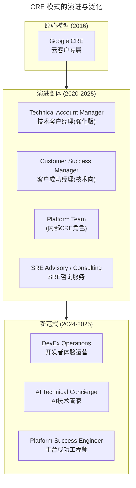
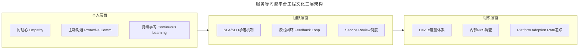

# 11 | 从谷歌CRE谈起，运维如何培养服务意识？

> **适用范围**：运维团队负责人、平台工程团队、SRE、技术支持团队、Technical Account Manager；适用于服务意识培养、DevEx 建设、内部开发者平台体验优化、客户成功体系建设等场景。
>
> **更新摘要（v2 · 2026-08 更新）**：
> - 结构化升级为 6 节骨架（导言 / 核心方法论 / 关键流程 / 工具与实战 / 常见误区 / 进阶延展）
> - 所有 Mermaid 图补充 frontmatter（--- title: ... ---）
> - 原文「延伸阅读」统一并入进阶延展
> - 补充 DevEx（Developer Experience）、JTBD、Growth Mindset 等 2025 服务意识关键实践

---

## 1. 导言

> 📅 **原文发布**：2018-2019 | **本次更新**：2025-06 | **更新等级**：🔴全面重写增强

2016年10月，谷歌云平台博客（Google Cloud Platform Blog）上更新了一篇文章，谷歌宣布了一个新的专业岗位，CRE（Customer Reliability Engineering，客户可靠性工程师）。我看了介绍后，发现还是一个挺有意思的岗位设置。

### CRE产生的背景

这个岗位出现的主要背景，还是越来越多的用户选择在云上开展自己的业务，很多企业和用户将业务从原来传统的自运维IDC机房迁移到云上。这样做其实就是选择相信公有云平台，但同时也就放弃了对底层基础设施的把控，甚至把企业最为核心的数据也放到了云上。说简单点，就是一个公司的身家性命都交给公有云了。

虽然绝大多数的公有云都宣称自己的稳定性多么高多么好，但是我们知道实际情况并非如此，我们可以看下Netflix，虽然业务在相对稳定的AWS上，但是自从在AWS上遇到过几次严重故障后，就开始自己做稳定性保障的功能，我们熟知的Chaos Monkey这只猴子就是这么来的，进而发展到后来的Chaos Engineering这样一整套体系。

可以看到，Netflix秉承Design For Failure，从一开始就选择在变化多端且自己不可控的环境里，加强自己系统的健壮性和容错能力，而不是依赖任何云厂商的承诺。

> **🔄 2025年视角：云焦虑的新形态**：
>
> 2018年时，"上云"是主要趋势；到了2025年，企业面临的挑战已经演变为：
>
> - **多云/混合云复杂性**：企业同时使用AWS+阿里云+Azure，故障定位更困难
> - **云厂商锁定担忧**：迁移成本高、数据主权问题
> - **云账单冲击**：FinOps成为刚需，成本优化压力巨大
> - **AI/ML工作负载上云**：GPU资源昂贵且稀缺，可靠性要求更高
> - **安全合规复杂化**：GDPR、数据出境、等保2.0/3.0等多重合规要求
> - **Serverless/FaaS的黑盒问题**：出问题时更难排查根因
>
> 在这种背景下，CRE的角色不仅没有过时，反而变得更加重要——**客户需要的不仅是技术支持，更是可信赖的技术伙伴关系**。

---

## 2. 核心方法论

### 2.1 CRE岗位的职责

**CRE出现的根本目的，就是消除客户焦虑，真正地站在客户的角度去解决问题，同时对客户进行安抚、陪伴和关怀**。

通常的售后支持，都是你问什么问题，我就回答什么问题，能马上解决的就马上解决，不能解决的就转到后端处理，然后让客户等着，承诺多长时间内给出答复。这种流程标准，严格执行SLA规范，对于一般问题还好，但要是真的出现大问题就不行了。

所以，CRE这个角色一定是站在客户角度解决问题。加入客户的"作战室"（War Room），和客户一起排查，问题不解决，自己不撤退；还会随时通报进展，必要的时候会将故障升级到更高的级别，寻求更专业的资源投入以共同解决；同时根据客户的不同反应进行不同方式的安抚。

所以，**CRE这个角色，既具备良好的专业技术能力，又有非常强的问题解决能力，同时还要具有优秀的客户沟通和关怀能力**。

### 2.2 CRE vs 传统技术支持的对比

| 维度 | 传统技术支持 (Tier 1/2) | CRE (Customer Reliability Eng) |
|------|------------------------|-------------------------------|
| **定位** | 被动响应 | 主动服务 + 技术伙伴 |
| **工作模式** | 工单驱动 → 排查 → 回复 | 嵌入客户团队 → 共同作战 |
| **故障处理** | 转工单、升级、等待 | 加入War Room、不解决不撤 |
| **知识传递** | KB文档（被动查阅）| 主动培训、SRE实践导入 |
| **关系深度** | 交易型（出了问题才联系）| 伙伴型（长期共建） |
| **价值主张** | 解决当前问题 | 帮助客户建立自服务能力 |
| **技能要求** | 产品知识 + 基础排障 | SRE全栈能力 + 咨询能力 + 沟通力 |

### 2.3 从CRE到服务意识

CRE更多的是一个服务性质的岗位，最终是要对客户的满意度负责。我们可能一下子达不到CRE这么高大上的水平，但是日常工作中我们要不断提升自己的服务意识还是很有必要的。

**是不是有服务心态，表现在我们的做事方式上，就是我们是否能够站在对方的角度考虑问题、解决问题**。

---

## 3. 关键流程

### 3.1 2025年：CRE模式的演进与泛化

Google CRE的模式在2020年后产生了深远影响，其核心理念被广泛借鉴和演化：



#### 1. 内部CRE：Platform Team作为内部客户的"CRE"

在采用 **Team Topologies** 的组织中，Platform Team本质上就在扮演"内部CRE"的角色：

| Google CRE（外部） | Platform Team（内部） |
|-------------------|---------------------|
| 服务云上客户 | 服务产品/业务开发团队 |
| 消除客户对云的焦虑 | 消除开发者的平台使用焦虑 |
| 导入SRE实践 | 定义Golden Path和Guardrails |
| War Room共同作战 | 协助排查部署和运行问题 |
| 稳定性评审(PRR) | Production Readiness Review |

> **💡 核心洞察**：Platform Team的成功与否，很大程度上取决于是否具备 **CRE式服务意识** —— 不是"我建好了你来用"，而是"我怎么帮你更好地用"。

#### 2. AI增强的技术服务

2023年后，LLM技术为CRE式服务带来了新的可能：

- **AI Concierge（AI技术管家）**：7x24小时在线，自然语言交互，自动检索知识库
- **智能故障诊断**：基于RAG（检索增强生成）技术，结合历史工单和Postmortem
- **自动化Runbook推荐**：根据告警类型自动推荐处置步骤
- **多语言支持**：打破语言障碍，服务全球客户

但要注意：**AI可以处理80%的常规问题，但20%的复杂场景仍需要人类CRE的专业判断和情感关怀**。

### 3.2 从"服务意识"到"DevEx思维"

CRE的服务意识在今天的Platform Engineering时代有了新的名称 —— **DevEx（Developer Experience，开发者体验）**。

DevEx的核心度量维度来自《DEVEX: What Actually Drives Productivity》的研究：

| 维度 | 含义 | 运维/平台团队的发力点 |
|------|------|---------------------|
| **Feedback Loops（反馈循环）** | 从代码提交到获得反馈的速度 | 加速CI/CD流水线、快速环境获取 |
| **Cognitive Load（认知负载）** | 学习和使用工具所需的心智负担 | 简化IDP界面、提供Golden Path |
| **Toolchain Flow（工具链流畅度）** | 工具之间的集成和切换顺畅度 | 统一门户(Backstage)、SSO集成 |

> **当你的IDP让开发者说"哇，这也太好用了吧！"而不是"这又是什么鬼系统？"的时候，你就具备了真正的DevEx思维 —— 这就是新时代的服务意识。**

### 3.3 服务意识的三个实践建议

#### 1. 多使用业务术语，少使用技术术语

与合作部门沟通协作，特别是对于非技术类的业务部门，尽量多使用业务语言来表达。对于绝大多数的公司来说，业务一定是最重要的，技术是实现业务功能的一种手段和方式，所以一定是从业务角度出发考虑技术解决方案，而不是从技术角度出发让业务来适配技术。

> **🔄 2025年延伸：翻译角色的专业化**：
>
> - **Platform UX Writer**：专门负责撰写面向开发者的文档和指南
> - **Developer Advocate（开发者布道师）**：在技术和业务之间架桥
> - **Technical PM for IDP**：从用户体验角度设计平台功能
>
> **实用技巧**：
> - 说"用户下单成功率下降了5%"而不是"订单服务的P99延迟超过了阈值"
> - 说"每次大促期间系统都会变慢"而不是"CPU utilization持续超过80%"
> - 说"我们帮您节省了30%的云资源费用"而不是"Terraform plan显示减少了200个EC2实例"

#### 2. 学会挖掘问题背后的真正诉求

外部提出的一个问题，可能并不一定是真正的问题，而是问题的一个解决方案。

遇到类似问题，可以不着急动手做，先多问自己和对方几个问题，比如：
- 为什么要这样做？
- 谁要求做这件事情的？
- 这样做的目的是什么？
- 这样做是为了解决什么问题？

> **🔄 2025年框架化：Jobs to Be Done (JTBD)**
>
> **JTBD访谈模板**：
> ```
> 当[情境]时，我想[动机]，以便[期望结果]。
>
> 示例：
> "当需要部署应用到生产环境时，
>  我想要一键完成而不是填10个表单，
>  以便能在下午5点前上线赶上营销活动。"
> ```
>
> **5 Whys + JTBD 组合拳**：
> 1. 表面需求："我要装翻墙软件"
> 2. Why 1："因为要访问海外网站"
> 3. Why 2："因为要爬取社交媒体数据"
> 4. Why 3："因为需要时尚达人信息做分析"
> 5. **JTBD重述**："当需要采集海外社交媒体数据时，我希望有合规的数据获取渠道，以便按时完成市场分析报告"
> 6. **最终方案**：海外节点部署 + 合规数据采集方案

#### 3. 解决问题的时候关注目标，而不是聚焦困难

两种不同的思考问题的方式，带给人的感受也是完全不一样的。

> **💡 2025年补充：成长型思维（Growth Mindset）vs 固定型思维**
>
> | 固定型思维 (Fixed Mindset) | 成长型思维 (Growth Mindset) |
> |--------------------------|---------------------------|
> | "这不可能做到" | "我们怎么才能做到？" |
> | "我们没有这个能力" | "我们需要学习什么才能做到？" |
> | "这是别人的问题" | "我们能如何帮助解决这个问题？" |
> | 关注 **限制** | 关注 **可能性** |
> | 害怕失败 | 从失败中学习 |
>
> 在SRE文化中，**Blameless Postmortem** 就是成长型思维的制度化体现。

---

## 4. 工具与实战

### 4.1 构建服务导向型的平台工程文化



### 4.2 个人层面：每日践行

| 实践 | 具体行动 | 预期效果 |
|------|---------|---------|
| **主动巡检** | 每天花15分钟查看各服务的健康状态，不等告警 | 从被动救火转为主动预防 |
| **响应时效承诺** | 对Slack/钉钉消息设定"15分钟内首次响应"的内部SLA | 建立信任感 |
| **每周 digest** | 向主要stakeholder发送简短的周报（本周变更、已知风险、下周计划）| 信息透明，减少焦虑 |
| **文档先行** | 解决问题后第一时间更新Runbook/KB，而非"下次再说"| 知识沉淀，减少重复劳动 |
| **Say No的艺术** | 不能做的事情，说明原因并给出替代方案 | 管理预期，避免过度承诺 |

### 4.3 团队层面：制度化建设

**1. 建立 Service Review 机制**

类似Google的 **Production Readiness Review (PRR)**，但聚焦于服务体验：

```markdown
## Service Review 模板

### 服务概况
- 服务名称、负责人、用户群体
- 核心业务价值（一句话描述）

### 用户旅程
- 开发者如何首次接入？
- 日常操作流程（部署/扩容/排查）
- 故障时的求助路径

### 痛点收集
- 近期收到的Top 5投诉/反馈
- 用户满意度评分(NPS)

### 改进计划
- 本季度重点优化项
- 需要跨团队协调的事项
```

**2. 设立内部NPS（Net Promoter Score）**

每季度向内部客户（开发团队、产品团队）发放问卷：
> "您有多大可能向同事推荐使用我们的平台/服务？"（0-10分）

- **9-10分**：Promoters（推荐者）— 他们是谁？为什么满意？
- **7-8分**：Passives（中立者）— 如何把他们转化为推荐者？
- **0-6分**：Detractors（贬损者）— **最重要的！立即跟进，了解原因**

### 4.4 组织层面：文化建设

**1. 将DevEx纳入团队OKR**

示例：
> **Objective**: 打造业界领先的内部开发者体验
>
> - **KR1**: Time-to-First-Deployment < 30分钟（目前120分钟）
> - **KR2**: 内部NPS > 50（目前25）
> - **KR3**: 平台自助服务率 > 80%（目前40%）
> - **KR4**: 月度工单量减少50%

**2. 识别和奖励"服务之星"**

不是奖励"修复最难bug的人"，而是奖励：
- "收到最多感谢信的人"
- "Runbook贡献最多的人"
- "主动发现并预防潜在问题的人"
- "帮助其他团队最多的人"

### 4.5 工具赋能：技术服务体验的提升

| 场景 | 2019年方案 | 2025年推荐方案 | 体验提升 |
|------|-----------|---------------|---------|
| **工单系统** | Jira / 自建 | **ServiceNow / Freshservice / Linear** + SLA自动化 | 自动升级、智能路由 |
| **即时通讯** | 微信群 / 钉钉群 | **Slack Connect / 钉钉机器人 + Grafana OnCall集成** | 告警→IM→工单→升级 全链路 |
| **知识库** | Confluence / Wiki | **Notion / GitBook / Backstage Software Catalog** | 搜索友好、结构化、与代码关联 |
| **状态页** | 无或静态页面 | **Statuspage / Instatus / UptimeRobot** | 实时状态、订阅通知、历史事件 |
| **开发者门户** | 无 | **Backstage (Spotify)** 一站式入口 | 统一体验、Self-service |
| **反馈收集** | 口头 / 邮件 | **Hotjar / Typeform / Internal NPS工具** | 数据驱动的体验改进 |
| **AI助手** | 无 | **ChatGPT / Claude / 自建RAG Bot** | 24/7响应、自然语言交互 |

---

## 5. 常见误区

### 5.1 ✅ 推荐做法

1. **站在对方角度考虑问题、解决问题**
   - 多使用业务术语，少使用技术术语
   - 挖掘问题背后的真正诉求（5 Whys + JTBD）
   - 关注目标，而不是聚焦困难

2. **主动服务，而非被动响应**
   - 主动巡检，不等告警
   - 向stakeholder发送周报，信息透明
   - 解决问题后第一时间更新Runbook

3. **将DevEx纳入团队OKR**
   - 设定可度量的体验指标（NPS、自助服务率、工单量）
   - 识别和奖励"服务之星"
   - 管理者以身作则，定期参与On-Call

### 5.2 ⚠️ 常见陷阱

1. **❌ 技术术语轰炸**
   - 与业务方沟通时满口API、P99、QPS
   - **后果**：业务方听不懂，沟通无法进行
   - **改进**：用业务语言表达技术观点

2. **❌ 不假思索照做需求**
   - 不挖掘真实诉求，直接执行表面方案
   - **后果**：做了很多事却无法得到认可
   - **改进**：先问"为什么要这样做"，再动手

3. **❌ 聚焦困难而非目标**
   - "这不可能做到"、"我们没有这个能力"
   - **后果**：固定型思维，团队士气低落
   - **改进**：成长型思维，关注"如何才能做到"

4. **❌ 平台建好就不管体验**
   - "我建好了你来用"，缺乏服务意识
   - **后果**：平台采用率低，开发者抱怨
   - **改进**：CRE式服务意识，"我怎么帮你更好地用"

5. **❌ 过度依赖AI替代人类关怀**
   - 认为AI可以处理所有问题，忽视情感关怀
   - **后果**：20%复杂场景客户体验差
   - **改进**：AI处理80%常规问题，人类CRE专注20%复杂场景

---

## 6. 进阶延展

### 6.1 官方文档与权威资源

- [Google CRE官方页面](https://cloud.google.com/customer-success) - 谷歌客户成功
- [DevEx定义与度量](https://devex.qa/) - 开发者体验研究
- [Platform Engineering](https://platformengineering.org/) - 平台工程社区
- [Team Topologies](https://teamtopologies.com/) - 团队拓扑模型

### 6.2 推荐阅读

- **《The Customer Support Handbook》**(2023) — 技术服务最佳实践
- **《Team Topologies》**(2019, 2023更新) — 第四章专门讨论Platform Team的用户导向
- **《DEVEX: What Actually Drives Productivity》** — 开发者体验度量研究
- **《Mindset》** by Carol Dweck — 成长型思维经典
- **《Continuous Discovery Habits》** by Teresa Torres — 持续发现与JTBD

### 6.3 开源项目参考

- [Backstage](https://github.com/backstage/backstage) - 开发者门户框架
- [Port](https://github.com/port-labs/port) - 内部开发者平台
- [Statuspage](https://www.statuspage.io/) - 状态页服务
- [Grafana OnCall](https://github.com/grafana/oncall) - On-Call管理工具

### 6.4 关键总结

> **🔮 2025年的运维人画像**：
>
> 2018年的运维人：**"我会Linux、会写Shell脚本、能扛服务器"**
>
> 2025年的平台工程师：**"我构建的平台让开发者不需要理解Linux就能交付可靠的软件，同时我用数据和同理心持续优化他们的体验"**
>
> 从 **技能导向** 到 **价值导向 + 服务意识**，这是每一位运维人需要完成的蜕变。

对于我们运维来说，这样的发展既是机遇，也是挑战。一方面我们要不断提升自己的技术能力，另一方面也要注意自身服务意识的培养，让自己的能力得以发挥，创造更大的价值，获得更好的回报。
