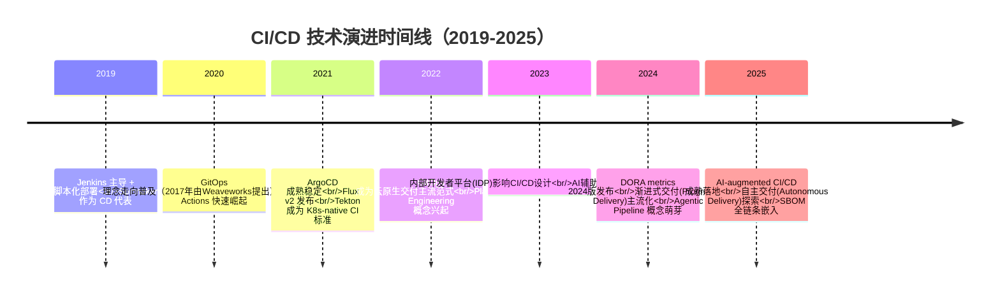
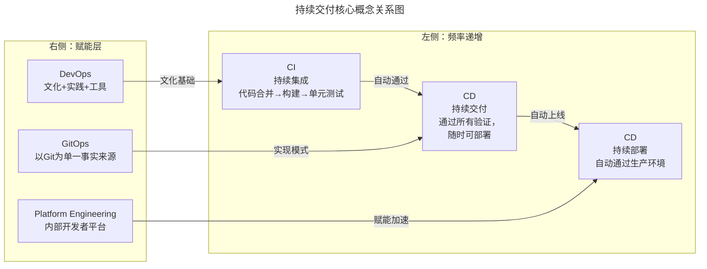
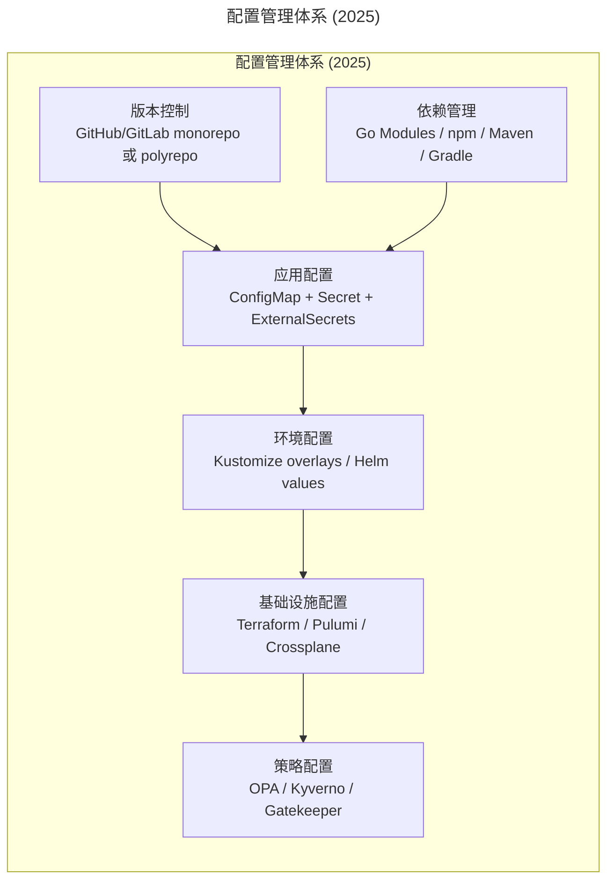
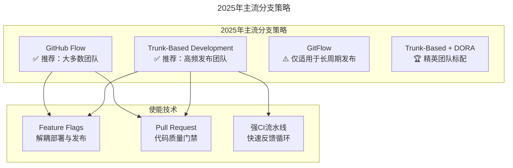
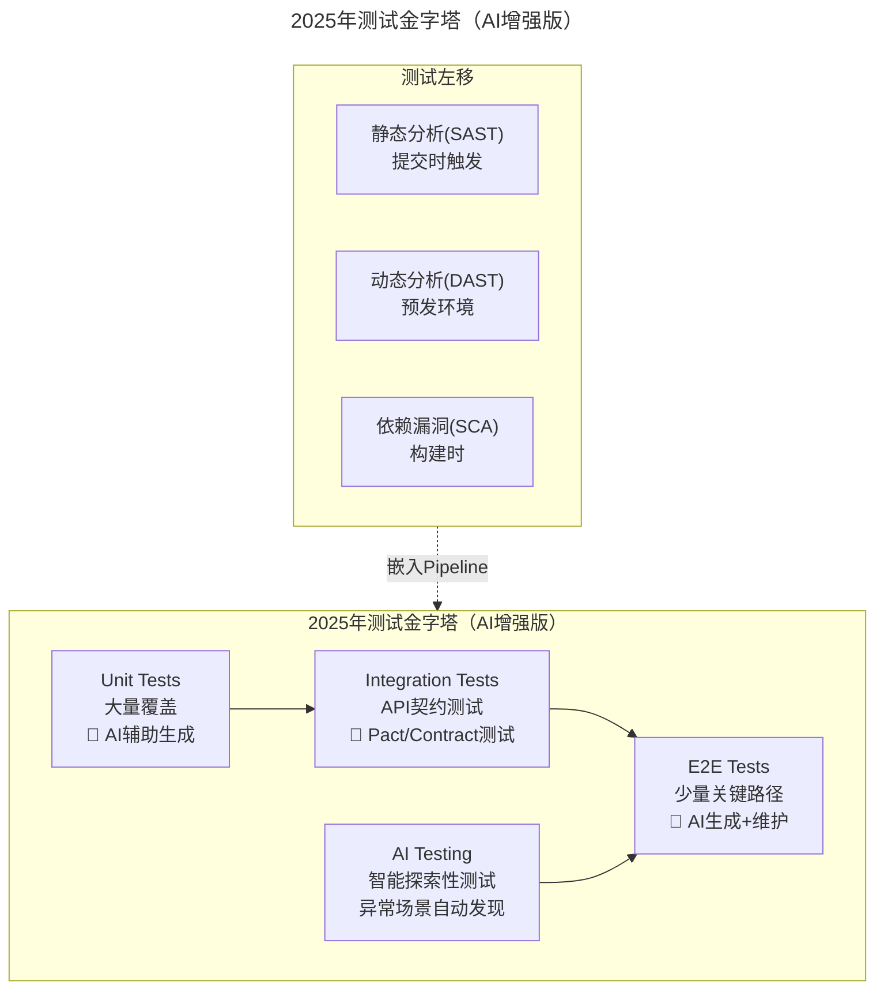
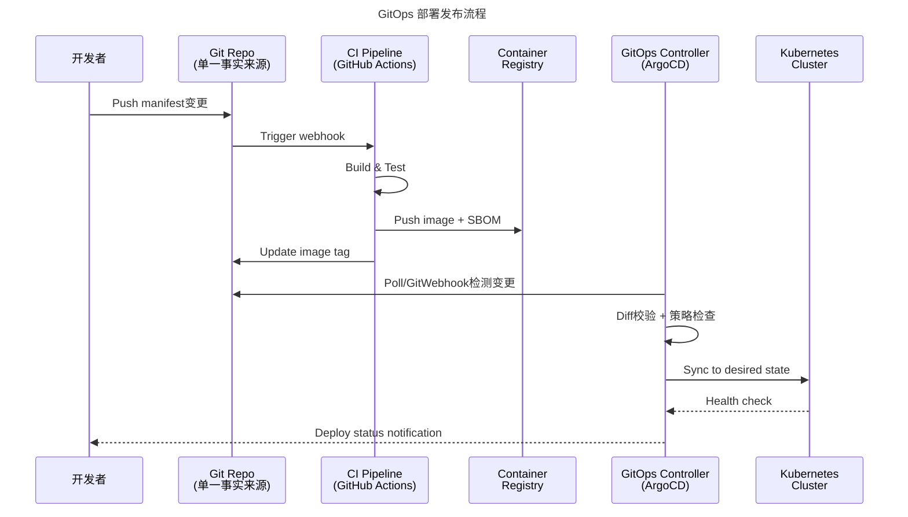
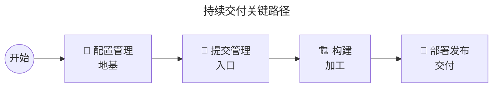
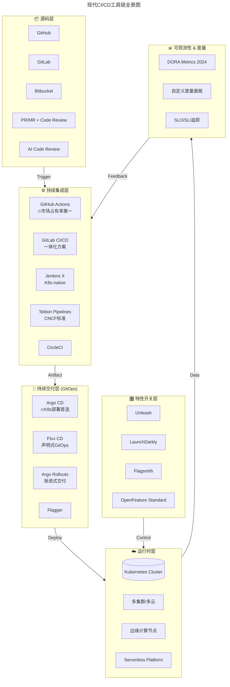
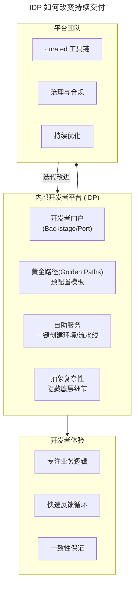

# 12 | 持续交付知易行难，想做成这事你要理解这几个关键点

> **适用范围**：DevOps 工程师、SRE、平台工程团队、研发效能团队；适用于持续交付体系建设、CI/CD 工具链选型、GitOps 落地、DORA 指标度量等场景。
>
> **更新摘要（v2 · 2026-08 更新）**：
> - 结构化升级为 6 节骨架（导言 / 核心方法论 / 关键流程 / 工具与实战 / 常见误区 / 进阶延展）
> - 所有 Mermaid 图补充 frontmatter（--- title: ... ---）
> - 原文「落地 Checklist」「思考题」统一并入进阶延展
> - 补充 DORA Metrics、GitOps、Progressive Delivery、AI-augmented CI/CD 等 2025 关键实践

---

## 1. 导言

> 📅 **原文发布**：2018-2019 | **本次更新**：2025-06 | **更新等级**：🔴全面重写增强

前面几篇文章介绍了非常基础的运维建设环节。若要使这些运维基础建设发挥出更大的作用和价值，就需要针对运维场景进行**场景化设计和自动化**，让效率和稳定性真正提升上来。即，把基础的事情做好之后，就要进入效率提升的**运维场景自动化阶段**了。

在这一阶段，**笔者**的经验和建议是，**首先要把持续交付做好**。

### 做持续交付的价值

为什么要先做持续交付？若完成了一些运维职责范围内的自动化工具，提升的是运维效率的话，那么，**做持续交付就是提升整个研发体系效率的关键**。

持续交付覆盖了应用的整个生命周期，涉及产品、开发、测试、运维以及项目管理等相关方面。**从生命周期出发，自然就会牵出整个自动化的全貌，就会有从全局着眼的规划设计**，这时无论是在开发还是运维过程中存在的问题，都会完完整整地暴露出来。

**核心价值总结：**
1. **全局视角的暴露机制** —— 持续交付像一个"全景扫描仪"，将研发体系中所有环节的问题暴露出来
2. **协同效率的提升引擎** —— 打破开发、测试、运维之间的壁垒，建立统一的协作语言
3. **质量内建的文化载体** —— 将质量保障从"事后检验"转变为"过程内建"
4. **可预测性的交付能力** —— 从"祈祷式发布"到"确定性交付"

> 💡 **2025年补充推荐**：
> - 《Accelerate》（Nicole Forsgren等）—— DORA研究的奠基之作
> - 《Team Topologies》（Matthew Skelton）—— 理解团队交互模式对CI/CD的影响
> - 《GitOps and Continuous Delivery》—— Weaveworks出品，2024版

### 技术格局巨变

**2025年的场景已经发生了质变：**

| 维度 | 2019年 | 2025年 |
|------|--------|--------|
| 应用数量 | 几十~上百个 | 数千~数万个（含Serverless函数） |
| 架构模式 | 微服务为主 | 微服务 + Serverless + Event-Driven + Modular Monolith混合 |
| 部署目标 | 虚拟机/容器 | K8s多集群 + 边缘节点 + 多云/混合云 |
| 发布频率 | 周/双周级 | 日/小时级（头部团队已达分钟级） |
| 团队规模 | 单体团队几十人 | 平台工程 + 上百个自治产品团队 |
| 合规要求 | 基础安全审计 | SBOM + SLSA + 供应链安全 + 数据主权 |

---

## 2. 核心方法论

### 2.1 CI/CD 技术演进时间线



### 2.2 什么是持续交付？（2025版定义）

我们现在经常会接触到这些名词：持续交付（Continuous Delivery）、持续集成（Continuous Integration）、持续部署（Continuous Deployment）、DevOps、GitOps、Platform Engineering等等。这些名词之间的关系在2025年有了更清晰的界定。



> **2025年持续交付的新内涵**：
> - 不仅覆盖代码交付，还包括基础设施即代码（IaC）、策略即代码（PaC）、配置即代码（CaC）
> - 交付对象从"二进制包"扩展为"容器镜像 + Helm Chart + Manifest + SBOM"
> - 质量门禁从"人工审批"演变为"自动化策略引擎 + AI风险预测"
> - 发布策略从"蓝绿/金丝雀"升级为"渐进式交付 + Feature Flag"

---

## 3. 关键流程

### 3.1 配置管理（Configuration Management）

**这是整个持续交付的地基**。在2025年，配置管理的范围大幅扩展：



**关键变化：**
- 配置不再分散在多个地方，而是统一纳入Git仓库管理
- 敏感信息通过External Secrets Operator从HashiCorp Vault/AWS Secrets Manager动态注入
- 多环境配置通过Kustomize overlays或Helm values文件实现声明式管理
- **标准化是一个持续的过程**——先标准，再固化，然后自动化

### 3.2 需求拆解与特性管理

| 2019年做法 | 2025年最佳实践 |
|-----------|---------------|
| Excel/Jira手动拆分 | Jira/Linear + 自动化Story Mapping |
| 需求与应用对应靠人脑 | 需求追踪系统 + 影响范围自动分析 |
| 发布粒度与需求粒度脱节 | Feature Flag驱动的细粒度发布 |

**运维需要做的**：明确需求拆解的粒度和最终发布上线的粒度相匹配。在Feature Flag时代，一个需求可以分多次灰度放量，这给了业界更大的灵活性。

### 3.3 提交管理与分支策略



**选型建议：**
- **新项目/高成熟度团队** → Trunk-Based Development + Feature Flags
- **大多数团队** → GitHub Flow（简化版的GitFlow）
- **避免使用完整GitFlow**——它的复杂度在现代工具链下已不必要

### 3.4 构建打包

| 维度 | 2019年 | 2025年 |
|------|--------|--------|
| 交付物 | war/jar/tar包 | OCI容器镜像 + SBOM |
| 构建环境 | Docker作为编译环境 | 云原生Buildpacks / Tekton / Buildah |
| 缓存策略 | Maven本地缓存 | 远程缓存（BuildKit cache mount） |
| 构建安全性 | 基础镜像漏洞扫描 | SLSA Provenance + Sigstore签名 |
| 并行构建 | 手动配置 | 自动依赖图分析 + 并行执行 |

### 3.5 自动化测试



**对于运维来说，会更注重非功能方面的特性**：性能基准回归、安全合规检查、混沌工程验证。

### 3.6 部署发布（GitOps模式）



**不同环境的发布策略差异：**

| 环境 | 发布方式 | 审批要求 | 回滚策略 |
|------|---------|---------|---------|
| Dev | 自动部署 | 无 | 自动回滚 |
| Staging | 自动部署 | 无 | 手动回滚 |
| Pre-prod | ArgoCD Sync | 半自动 | ArgoCD Rollback |
| Beta/Canary | 渐进式发布(Flagger) | 人工审批 | 自动回滚(指标阈值) |
| Production | Argo Rollouts + FF | 变更委员会(可选) | 一键回滚 |

### 3.7 关键路径识别

从实践经验来看，**以下四个环节是持续交付的重中之重，是关键路径**：



**为什么这四个是关键路径？**
1. **配置管理没做好** → 后面每个环节都会出问题，且难以定位
2. **提交管理混乱** → 代码合入不可追溯，发布内容不可控
3. **构建不稳定** → 重复构建浪费资源，环境一致性无法保证
4. **部署发布卡顿** → 所有前置工作的价值无法兑现

**2025年的启示**：这四个关键路径依然有效，但每个路径的实现方式都发生了巨变。不要被新技术名词迷惑——**问题本质没有变，只是解决方案升级了**。

---

## 4. 工具与实战

### 4.1 现代工具链全景图



### 4.2 工具选型矩阵（2025版）

| 场景 | 推荐方案 | 替代方案 | 不推荐 |
|------|---------|---------|--------|
| 代码托管 | GitHub Enterprise | GitLab.com（SaaS） | 自建GitLab（除非有强合规要求） |
| CI引擎 | GitHub Actions | GitLab CI, Jenkins with CasC | 纯Jenkins UI配置（无IaC） |
| CD/GitOps | Argo CD | Flux CD, Rancher Fleet | Spinnaker（过重），脚本化部署 |
| 容器构建 | Buildpacks / Kaniko | Buildah, img | Docker-in-Docker（安全风险） |
| 配置管理 | Kustomize + Helm | Jsonnet | 多份配置文件手动维护 |
| 密钥管理 | External Secrets Operator | Vault Injector | 明文配置文件 |
| Feature Flag | Unleash (开源) | LaunchDarkly (商业), Flagsmith | 硬编码开关 |
| 渐进式交付 | Argo Rollouts + Flagger | Istio原生（复杂度高） | 手动流量切换 |
| 多集群管理 | Argo CD ApplicationSet | Rancher, ACM | 各集群独立管理 |
| 度量与可观测 | DORA metrics + OpenTelemetry | 自建仪表盘 | 无度量 |

### 4.3 IDP对持续交付的影响

2023年以来，**Platform Engineering 和内部开发者平台（IDP）** 成为影响CI/CD设计的最重要因素之一。



**核心理念转变**：
- 从"教每个团队用Jenkins"变为"提供开箱即用的模板"
- 从"运维帮每个人配环境"变为"自助式环境创建"
- 从"统一强制标准"变为"引导式最佳实践(Golden Paths)"

### 4.4 AI 辅助的 CI/CD

2024-2025年，**AI正在深刻改变CI/CD的每一个环节**：

| 环节 | AI能力 | 工具示例 |
|------|-------|---------|
| 代码审查 | 智能PR Review、漏洞检测 | GitHub Copilot, CodeRabbit |
| 测试生成 | 自动生成单元/集成测试用例 | Amazon Q Developer, Cursor |
| 构建优化 | 缓存策略优化、并行化建议 | Gradle Build Cache AI |
| 部署风险预测 | 基于历史数据的风险评分 | Harness AI, LaunchDarkly AI |
| 故障诊断 | 日志异常检测、根因分析 | Datadog AIOps, PagerDuty AI |
| 文档自动生成 | 变更日志、Runbook生成 | 各种LLM工具 |

> ⚠️ **注意**：AI辅助不等于AI替代。当前阶段，AI最适合作为"副驾驶(Copilot)"而非"自动驾驶(Autopilot)"。

---

## 5. 常见误区

### 5.1 ⚠️ 常见陷阱

```
❌ 陷阱1："工具堆砌综合症"
   症状：引入ArgoCD、Flux、Tekton、Flagger等全套工具栈
   根因：被技术FOMO驱动，而非实际需求驱动
   解法：从最小可行流水线(MVP)开始，按需扩展

❌ 陷阱2："GitOps形式主义"
   症状：Git仓库里有manifest，但实际还是kubectl apply手动改
   根因：只做了形式上的GitOps，没有真正信任控制器
   解法：关闭集群的直接写入权限，强制走GitOps路径

❌ 陷阱3："环境配置漂移"
   症状：线上环境能跑但没人知道为什么
   根因：紧急修复时绕过了GitOps流程
   解法：配置漂移告警 + 定期reconcile

❌ 陷阱4："Feature Flag债务"
   症状：上百个Flag从未清理，代码里到处是if-else
   根因：缺少Flag生命周期管理
   解法：引入Flag过期策略，定期清理

❌ 陷阱5："忽视Platform Engineering"
   症状：每个团队都在自己搞CI/CD，重复造轮子
   根因：缺乏统一的平台层抽象
   解法：建设IDP，提供Golden Paths

❌ 陷阱6："过度追求DORA精英指标"
   症状：为了提高部署频率而牺牲质量
   根因：误解了DORA指标的因果关系
   解法：关注系统健康度，而非单纯追求数字
```

### 5.2 ✅ 推荐做法

1. **从MVP开始，按需扩展**
   - 不要一开始就引入全套工具栈
   - 先解决最痛的环节，收集反馈后迭代

2. **真正信任GitOps控制器**
   - 关闭集群直接写入权限
   - 强制所有变更走Git流程
   - 配置漂移告警 + 定期reconcile

3. **建设IDP，提供Golden Paths**
   - 不要让每个团队自己搞CI/CD
   - 提供开箱即用的模板
   - 引导式最佳实践

---

## 6. 进阶延展

### 6.1 落地 Checklist

> ✅ [ ] **配置管理基础**
>   - [ ] 代码仓库结构是否符合monorepo或polyrepo策略
>   - [ ] 敏感信息是否已从代码中剥离并迁移至Secret Manager
>   - [ ] 多环境配置是否采用Kustomize/Helm overlays管理
>   - [ ] 是否建立了配置漂移检测机制
>
> ✅ [ ] **CI流水线**
>   - [ ] 是否选择了合适的CI引擎（GitHub Actions / GitLab CI）
>   - [ ] 流水线是否已声明式定义（YAML as Code）
>   - [ ] 构建是否使用容器化且支持远程缓存
>   - [ ] 是否生成了SBOM并进行了SCA扫描
>
> ✅ [ ] **CD/GitOps**
>   - [ ] 是否选择了ArgoCD或Flux作为GitOps控制器
>   - [ ] 是否实现了声明式的部署清单管理
>   - [ ] 是否配置了自动同步和健康检查
>   - [ ] 是否有回滚机制和演练记录
>
> ✅ [ ] **质量门禁**
>   - [ ] 单元测试覆盖率是否达标（建议>70%）
>   - [ ] 是否集成了SAST/DAST/SCA安全扫描
>   - [ ] 关键路径是否有E2E测试覆盖
>   - [ ] 是否有性能基线回归检测
>
> ✅ [ ] **发布策略**
>   - [ ] 是否实施了渐进式交付（Canary/Blue-Green）
>   - [ ] 是否使用了Feature Flag管理功能开关
>   - [ ] 是否有明确的发布窗口和审批流程
>   - [ ] 回滚操作是否经过演练并在SLA内完成
>
> ✅ [ ] **度量与改进**
>   - [ ] 是否采集了四大DORA指标（部署频率、变更前置时间、服务恢复时间、变更失败率）
>   - [ ] 是否设定了SLO并有Error Budget管理
>   - [ ] 是否定期进行Pipeline效能复盘
>   - [ ] 是否有持续优化的机制和Owner

### 6.2 官方文档与权威资源

- [DORA Research](https://dora.dev/) - DevOps研究与评估组织
- [ArgoCD Documentation](https://argo-cd.readthedocs.io/) - GitOps持续交付
- [FluxCD](https://fluxcd.io/) - GitOps Toolkit
- [Tekton](https://tekton.dev/) - 云原生CI标准
- [OpenFeature](https://openfeature.dev/) - Feature Flag标准
- [SLSA Framework](https://slsa.dev/) - 供应链安全

### 6.3 推荐阅读

- **《持续交付：发布可靠软件的系统方法》** by Jez Humble & David Farley - 持续交付经典
- **《Accelerate》** by Nicole Forsgren等 - DORA研究奠基之作
- **《Team Topologies》** by Matthew Skelton - 团队交互模式对CI/CD的影响
- **《GitOps and Continuous Delivery》** - Weaveworks出品
- **《Building Evolutionary Architectures》** - 架构演进

### 6.4 思考题

1. 先放下持续交付的概念，**读者**所理解或经历的从开发完代码到发布到线上这个过程中，会有哪些环节？和本文列出的这几部分是否有相同之处？哪些环节在**读者**们的场景中是最痛的？

2. 持续交付是谁的持续交付，它的主体是谁？或者有哪些主体？在Platform Engineering时代，这个问题的答案有什么变化？

3. **读者**的团队目前处于DORA度量的哪个等级？如果要提升一个等级，最大的阻碍是什么？

### 6.5 关键总结

**2025年的核心认知升级：**
1. **从"工具思维"到"平台思维"** —— 不再是选哪个CI工具好，而是如何建设赋能开发者的平台
2. **从"流程驱动"到"声明式驱动"** —— 用YAML描述期望状态，而不是用脚本描述操作步骤
3. **从"人工把关"到"策略引擎"** —— 用OPA/Kyverno等策略引擎替代人工审批
4. **从"一次性发布"到"渐进式交付"** —— 通过Feature Flag和Canary实现平滑过渡

持续交付体系建设不是一蹴而就的，而是在摸索中逐步演进完善的。实现持续交付的过程，也是从原来的只具备持续部署发布功能的平台，逐步演进为具有持续交付能力的平台。
