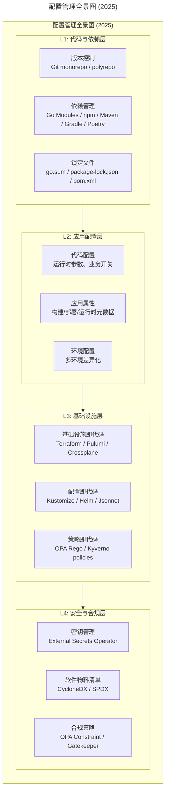
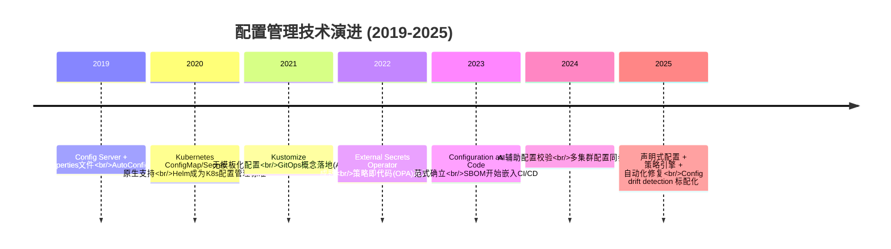
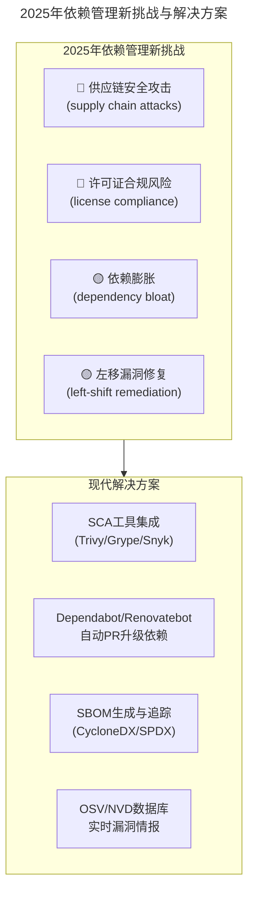
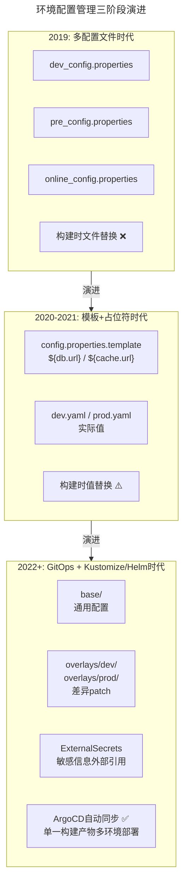
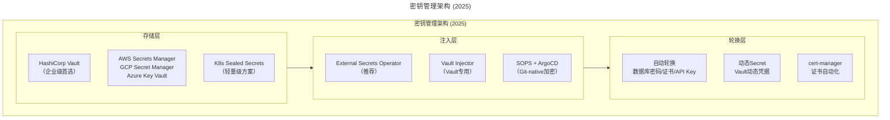
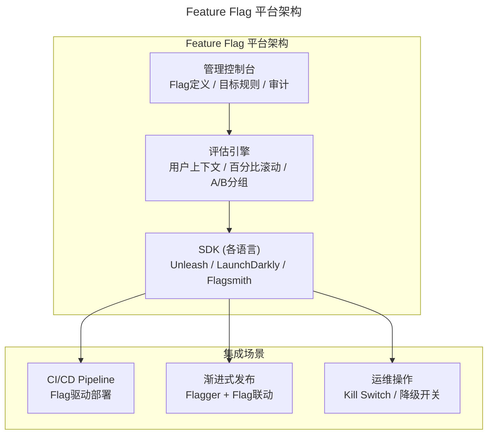

# 13 | 持续交付的第一关键点：配置管理

> **适用范围**：DevOps 工程师、平台工程团队、SRE、研发效能团队；适用于配置管理体系建设、GitOps 落地、密钥管理、Feature Flag 治理、配置漂移防护等场景。
>
> **更新摘要（v2 · 2026-08 更新）**：
> - 结构化升级为 6 节骨架（导言 / 核心方法论 / 关键流程 / 工具与实战 / 常见误区 / 进阶延展）
> - 所有 Mermaid 图补充 frontmatter（--- title: ... ---）
> - 原文「落地 Checklist」统一并入进阶延展
> - 补充 IaC/PaC/CaC、SBOM、External Secrets Operator、Feature Flag 等 2025 配置管理关键实践

---

## 1. 导言

> 📅 **原文发布**：2018-2019 | **本次更新**：2025-06 | **更新等级**：🔴全面重写增强

本文来看持续交付的第一个关键点：**配置管理**。按照持续交付的理念，这里所说的配置管理范围会更广。

讲持续交付，一上来就先讲配置管理，主要还是想强调：**配置管理是基础，是关键**。后续将要讲的每一个持续交付环节，都对配置管理有很强的依赖。这个基础工作做不好，也就谈不上持续交付的成功。

> **勿在浮沙筑高台，做工具平台或系统，一定要重视基础的建设。**

同时，这里还有一个前提，就是**一定要做到代码和配置的分离**。不要让配置写死在代码里，需要依靠严格的规范和约束。同时，对于那些因历史原因遗留在代码中的配置，要多花些时间和精力把配置剥离出来。

---

## 2. 核心方法论

### 2.1 配置管理的四大支柱

配置管理主要包括以下四个部分：
- **版本控制**
- **依赖配置**
- **软件配置**
- **环境配置**

### 2.2 配置管理的范畴扩展（2025版）

在2019年，配置管理主要关注的是应用层面的配置。到了2025年，在云原生和GitOps时代，配置管理的范畴已经大幅扩展：



### 2.3 配置管理技术演进时间线



---

## 3. 关键流程

### 3.1 版本控制

**版本控制的主要作用是保证团队在交付软件的过程中能够高效协作，版本控制提供了一种保障机制**。具体来说，就是团队在协作开发代码的情况下，记录下代码的每一次变更情况。

| 维度 | 2019年 | 2025年 |
|------|--------|--------|
| 工具选择 | GitLab自建为主 | GitHub Enterprise / GitLab SaaS |
| 仓库模式 | 每个应用一个仓库 | Monorepo（大型团队）或 Polyrepo（小型团队） |
| 分支保护 | 基础PR审查 | 强制CI通过 + CODEOWNERS + Required checks |
| Commit规范 | 自由格式 | Conventional Commits + 自动生成Changelog |
| 安全扫描 | 可选 | Secret scanning（默认开启）+ Dependabot |
| 签名验证 | 无 | Sigstore / GPG commit signing |

### 3.2 依赖管理

以Java为例，使用Java进行开发必然会依赖各种第三方的开源软件包，同时内部还会有不同组件的二方包。这些三方包和二方包就是一个应用编译和运行时所依赖的部分。

**2025年依赖管理的新挑战与新方案**：



各语言生态的依赖管理最佳实践：

| 语言 | 推荐工具 | 锁定文件 | 私有仓库方案 |
|------|---------|---------|-------------|
| Java | Gradle 8.x / Maven | gradle.lockfile / pom.xml | Artifactory, Nexus |
| Go | Go Modules | go.sum | Athens, Goproxy |
| Python | Poetry / uv | poetry.lock / uv.lock | devpi, pypi-server |
| Node.js | pnpm / npm | pnpm-lock.yaml | Verdaccio, Artifactory |
| Rust | Cargo | Cargo.lock | crates.io mirror |

> 💡 **关键实践**：无论什么语言，**一定要提交锁定文件到版本控制**。这是保证可重复构建的基础。

### 3.3 软件配置

原版将软件配置细化为两类：**代码配置**和**应用配置**。这个分类思路在今天依然有价值，但需要大幅扩展。

#### 1. 代码配置（Code Configuration）—— 运行时可动态调整

**代码配置是跟代码运行时的业务逻辑相关的**：
- 应用服务接口参数（超时、重试、并发）
- 业务开关（功能开关、优惠活动开关）
- 稳定性保障配置（限流阈值、降级开关、熔断参数）

| 维度 | 2019年做法 | 2025年最佳实践 |
|------|-----------|---------------|
| 管理方式 | Config Server / Apollo / Nacos | **Feature Flag平台** + 配置中心结合 |
| 动态调整 | 需要重启或热加载 | 实时生效，无需重启 |
| 粒度控制 | 应用级别 | 用户/请求/百分比级别 |
| 审计追溯 | 基础日志 | 完整变更审计链 |
| A/B测试 | 不支持 | 原生支持 |

#### 2. 应用配置（Application Configuration）—— 构建时确定

**应用配置就是应用这个对象的属性和关系信息**。按照应用生命周期的不同阶段进行分解：

| 配置类别 | 内容示例 | 2025年管理方式 |
|---------|---------|---------------|
| **构建时配置** | 编程语言、Git地址、构建方式 | CI Pipeline变量 + Repository Rules |
| **部署配置** | 源码目录、日志目录、资源限制 | Helm values / Kustomize patches |
| **运行配置** | 启停命令、健康检查、优雅上下线 | K8s Probe + PreStop hook |
| **组件依赖配置** | DB/缓存/消息队列连接信息 | External Secrets Operator |

**核心区别**：代码配置动一下会改变系统执行状态（运行时的配置），但不依赖周边环境；而应用配置不管怎么动，业务逻辑不会改变，但是它跟环境相关。

### 3.4 环境配置管理

这是整个配置管理中**最为复杂的一部分**，也是2025年变化最大的领域。

环境配置的三个阶段：
1. **软件交付过程中** —— 开发/测试/预发/生产环境，不同环境的DB、缓存等基础组件访问地址不同
2. **软件交付上线后** —— 可能存在多机房/多区域/多可用区部署，每个区域的配置必然不同
3. **私有化/SaaS交付** —— 不同客户的基础环境不同

#### 从"多份配置文件"到"声明式 overlays"的演进



---

## 4. 工具与实战

### 4.1 密钥管理专项

原版提到："密码信息一定不允许放在配置文件中出现，更不允许以明文的方式出现"。这一点在2025年不仅没有过时，反而变得更加重要——供应链攻击、凭证泄露事件频发。



选型建议：

| 场景 | 推荐方案 | 说明 |
|------|---------|------|
| 企业级生产环境 | Vault + ESO | 最完整的解决方案 |
| 云原生优先 | Cloud SM + ESO | 减少运维负担 |
| 小团队/起步 | Sealed Secrets 或 SOPS | 零额外依赖 |
| 证书管理 | cert-manager | K8s证书管理事实标准 |
| 数据库凭证 | Vault Dynamic Secrets | 自动轮换，无需人工干预 |

### 4.2 Feature Flag 平台

**Feature Flag 管理已成为代码配置的核心载体**：



开源Feature Flag方案对比：

| 方案 | 特点 | 适用场景 |
|------|------|---------|
| **Unleash** | 开源、自托管、功能丰富 | 大多数企业，需要完全控制 |
| **Flagsmith** | 开源/托管、简单易用 | 快速起步的中小团队 |
| **OpenFeature** | 标准化API（非实现） | 需要Vendor无关的实现 |
| **LaunchDarkly** | 商业SaaS、功能最全 | 预算充足、追求极致体验 |

### 4.3 工具选型矩阵

| 场景 | 推荐方案 | 替代方案 | 不推荐 |
|------|---------|---------|--------|
| 通用配置管理 | Kustomize + Helm | Jsonnet | 手动维护多份配置文件 |
| 敏感信息 | External Secrets Operator | Vault Injector, SOPS | 明文YAML, K8s原生Secret |
| Feature Flag | Unleash (开源) | LaunchDarkly, Flagsmith | 硬编码if-else |
| 配置中心(动态) | Nacos / Consul / etcd | ZooKeeper (老旧) | properties文件 |
| 配置校验 | kubeconform / kubectl --dry-run | conftest | 无校验直接apply |
| 配置漂移检测 | ArgoCD diff + 自动同步 | Flux drift detection | 定期人工检查 |
| IaC配置 | Terraform / Pulumi | Crossplane | 手动控制台操作 |
| 策略执行 | Kyverno（易用） / OPA Gatekeeper（强大） | 无 | 仅靠人工审查 |

---

## 5. 常见误区

### 5.1 ⚠️ 常见陷阱

```
❌ 陷阱1："配置地狱"（Configuration Hell）
   症状：dev/test/staging/prod各有自己的配置文件，内容几乎相同但总有不一致
   根因：没有采用base + overlay模式
   解法：Kustomize overlays或Helm values文件，DRY原则

❌ 陷阱2："明文密码在Git历史中"
   症状：当前文件已清理，但git history里还有
   根因：只做了删除，没有用BFG/Git-secrets清洗历史
   解法：BFG Repo Cleaner + 轮换所有暴露的凭证 + 启用Secret Scanning

❌ 陷阱3："ConfigMap/Secret过大"
   症状：单个ConfigMap超过1MB，etcd性能受影响
   根因：把整个配置文件塞进ConfigMap
   解法：拆分ConfigMap / 使用Volume挂载 / 考虑配置中心

❌ 陷阱4："环境配置漂移"
   症状：线上跑得好好的，没人敢动，也不知道当前配置是什么
   根因：紧急修复时kubectl edit绕过了GitOps
   解法：ArgoCD配置漂移告警 + 定期reconcile + 禁止直接写入

❌ 陷阱5："Feature Flag债务"
   症状：上百个Flag从未清理，代码里到处是flag判断
   根因：缺少Flag治理流程
   解法：设置Flag过期时间 + 定期审计 + 废弃Flag清理SOP

❌ 陷阱6："过度抽象"
   症状：用了Jsonnet/Helm的复杂模板，没人看得懂
   根因：为了"复用"而过度工程化
   解法：简单场景用Kustomize，只在真正需要时引入Helm
```

### 5.2 ✅ 推荐做法

1. **代码与配置分离**
   - 不允许硬编码在源码中
   - 建立配置变更的code review流程

2. **锁定文件提交到版本控制**
   - 保证可重复构建的基础
   - 使用SCA工具（Trivy/Snyk/Dependabot）持续监控

3. **一次构建，多环境部署**
   - 交付物为不可变的OCI容器镜像
   - 环境差异化配置通过ConfigMap/Secret在运行时注入
   - 敏感信息走External Secrets Operator

---

## 6. 进阶延展

### 6.1 落地 Checklist

> ✅ [ ] **代码与配置分离**
>   - [ ] 是否已完成配置外迁（不允许硬编码在源码中）
>   - [ ] 是否建立了配置变更的code review流程
>
> ✅ [ ] **版本控制规范**
>   - [ ] 是否选择了合适的仓库模式（monorepo/polyrepo）
>   - [ ] 是否强制使用了Conventional Commits规范
>   - [ ] 分支保护规则是否已配置（CI必须通过才能合并）
>   - [ ] 锁定文件是否已提交到版本控制
>
> ✅ [ ] **依赖安全管理**
>   - [ ] 是否集成了SCA工具（Trivy/Snyk/Dependabot）
>   - [ ] 是否启用了自动依赖更新PR（Renovate/Dependabot）
>   - [ ] 是否生成了SBOM（CycloneDX/SPDX格式）
>   - [ ] 高危漏洞是否有阻断发布机制
>
> ✅ [ ] **环境配置管理**
>   - [ ] 是否采用了Kustomize overlays或Helm values管理多环境
>   - [ ] 敏感信息是否已迁移至External Secrets Operator
>   - [ ] 配置文件中是否存在任何明文密码或Token
>   - [ ] 是否能实现"一次构建，多环境部署"
>
> ✅ [ ] **Feature Flag管理**
>   - [ ] 是否引入了Feature Flag平台替代硬编码开关
>   - [ ] 是否建立了Flag生命周期管理（创建→审核→启用→归档→删除）
>   - [ ] 废弃Flag是否有定期清理机制
>
> ✅ [ ] **配置漂移防护**
>   - [ ] 是否有配置漂移检测和告警机制
>   - [ ] 是否禁止了kubectl edit/direct apply绕过GitOps
>   - [ ] 是否配置了策略引擎（Kyverno/OPA）防止违规配置

### 6.2 官方文档与权威资源

- [Kustomize](https://kustomize.io/) - 无模板的配置定制
- [Helm](https://helm.sh/docs/) - Kubernetes 包管理
- [External Secrets Operator](https://external-secrets.io/) - 外部密钥同步
- [HashiCorp Vault](https://www.vaultproject.io/) - 企业级密钥管理
- [OpenFeature](https://openfeature.dev/) - Feature Flag 标准
- [SLSA Framework](https://slsa.dev/) - 供应链安全
- [CycloneDX](https://cyclonedx.org/) - 软件物料清单标准

### 6.3 推荐阅读

- **《持续交付：发布可靠软件的系统方法》** by Jez Humble & David Farley
- **《Infrastructure as Code》** by Kief Morris
- **《GitOps and Continuous Delivery》** - Weaveworks出品

### 6.4 关键总结

**2025年的核心认知升级：**

1. **配置管理的边界大大扩展了** —— 从"应用配置"延伸到"IaC + PaC + CaC + Secrets"
2. **Git成为配置的单一事实来源** —— 但敏感信息除外（走ESO）
3. **Feature Flag取代了大量传统的"开关配置"** —— 更灵活、更安全、更可审计
4. **声明式配置取代命令式脚本** —— 用描述期望状态代替描述操作步骤
5. **配置漂移检测成为标配** —— 不再信任"手动改一下没关系"

环境配置是业界在持续交付过程中要关注的重中之重，也是最为复杂的一部分。下一期就着重探讨**多环境建设**的问题。
