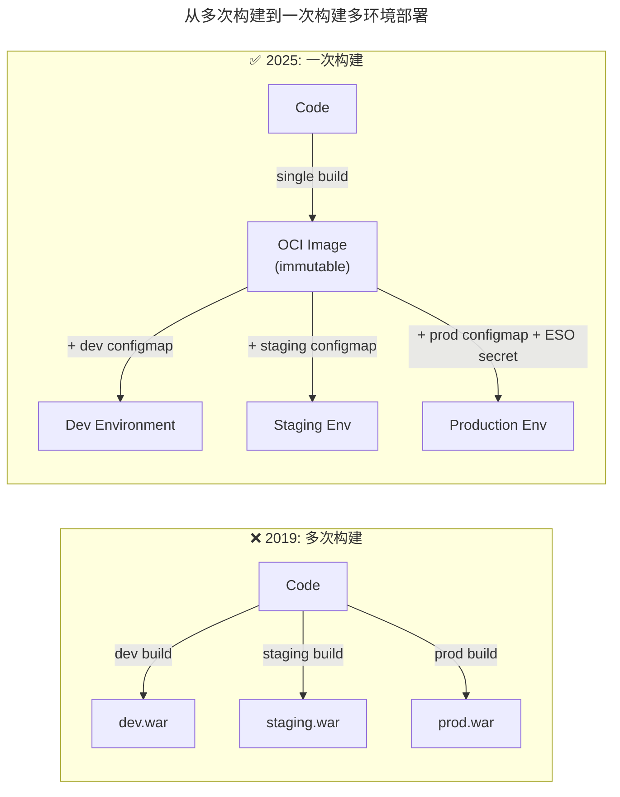
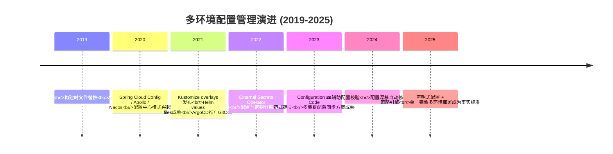
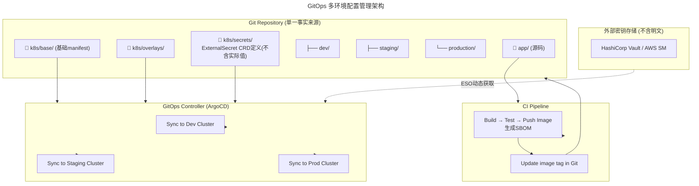
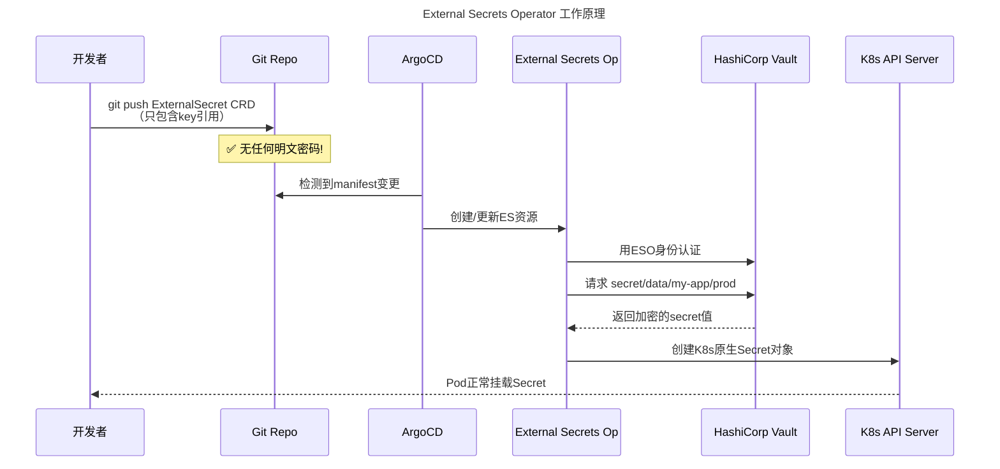
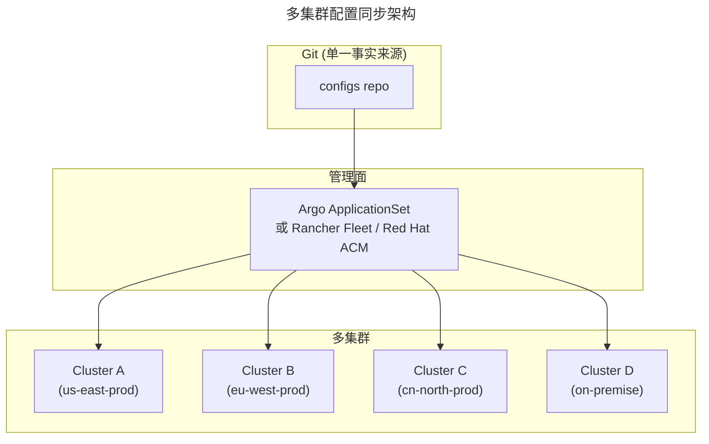

# 14 | 如何做好持续交付中的多环境配置管理？

> **适用范围**：DevOps 工程师、平台工程团队、SRE、环境管理负责人；适用于多环境配置管理建设、Kustomize/Helm 选型、External Secrets Operator 落地、GitOps 多环境同步、配置漂移防护等场景。
>
> **更新摘要（v2 · 2026-08 更新）**：
> - 结构化升级为 6 节骨架（导言 / 核心方法论 / 关键流程 / 工具与实战 / 常见误区 / 进阶延展）
> - 所有 Mermaid 图补充 frontmatter（--- title: ... ---）
> - 原文「落地 Checklist」统一并入进阶延展
> - 补充 一次构建多环境部署、External Secrets Operator、Kustomize vs Helm、多集群配置同步等 2025 关键实践

---

## 1. 导言

> 📅 **原文发布**：2018-2019 | **本次更新**：2025-06 | **更新等级**：🔴全面重写增强

上一篇内容中，笔者讲到软件配置中的代码配置和应用配置，这两种配置之间最大的区别就是看跟环境是否相关。由此，就引出了持续交付过程中最为复杂的环境配置管理这个问题，准确地说，应该是**不同环境下的应用配置管理**。

本文就结合笔者的经验和2025年的最佳实践，与读者探讨多环境配置管理的现代解决方案。

### 从"多次打包"到"一次构建，多环境部署"

原版中提到的核心痛点是：**针对不同环境需要多次打包，这与持续交付"只构建一次"的理念相悖**。2025年，这个痛点已经被彻底解决：



**关键变化**：
- 交付物从 `war/jar` 变为**不可变的 OCI 容器镜像**
- 环境差异化配置通过**ConfigMap / ExternalSecrets 在运行时注入**
- 同一个镜像可以在所有环境中运行，只是挂载的配置不同

---

## 2. 核心方法论

### 2.1 环境生命周期

从生命周期的角度，对环境做个说明：

| 环境 | 目的 | 2025年特点 |
|------|------|-----------|
| **开发环境 (Dev)** | 开发人员单元测试、联调、基本功能验证 | 每开发者一套，GitOps自动部署 |
| **集成环境 (Integration/Staging)** | 测试人员功能验收、业务流程验证 | 最接近生产的测试环境 |
| **预发环境 (Pre-production)** | 真实生产数据环境下验证，不接入线上流量 | 共用生产有状态服务 |
| **Beta/Canary环境** | 小规模真实流量灰度验证 | 渐进式交付的一部分 |
| **生产环境 (Production)** | 正式对外提供服务 | 多集群/多区域部署 |

### 2.2 核心认知

**环境配置管理，更准确地说应该是"不同环境下的应用配置管理"**，核心是**应用配置管理**。因为有多个环境，所以增加了管理的复杂性。

持续交付过程中涉及应用配置管理的关键点：
- **应用属性信息** —— 代码属性、部署属性、脚本信息等
- **应用对基础组件的依赖关系** —— DB、缓存、消息队列、存储等在不同环境的访问地址、端口、凭证不同
- **应用间调用关系** —— 服务注册与发现必须在本环境内闭环完成

> ⚠️ **铁律**：绝对不允许线上应用注册到线下环境，或反之。否则会导致灾难性故障。

### 2.3 配置管理方案演进时间线



---

## 3. 关键流程

### 3.1 原版方案回顾与现代评价

#### 方案一：多个配置文件，构建时替换
- **2025年的评价**：❌ **已过时，强烈不推荐**
- **迁移建议**：先统一配置项命名 → 提取 base 层通用配置 → 为每个环境创建 overlay → 引入 External Secrets Operator 处理敏感信息

#### 方案二：占位符（PlaceHolder）模板模式
- **2025年的评价**：⚠️ **部分思路可借鉴，但实现方式已过时**

#### 方案三：AutoConfig方案
- **2025年的评价**：⚠️ **历史方案，已被K8s生态完全超越**

### 3.2 现代解决方案：GitOps + Kustomize/Helm + External Secrets Operator



### 3.3 Kustomize 方案（推荐用于无模板场景）

目录结构示例：

```
config/
├── base/
│   ├── deployment.yaml
│   ├── configmap.yaml
│   └── kustomization.yaml
├── overlays/
│   ├── dev/
│   │   ├── configmap-patch.yaml
│   │   └── kustomization.yaml
│   ├── staging/
│   │   ├── configmap-patch.yaml
│   │   ├── replica-count-patch.yaml
│   │   └── kustomization.yaml
│   └── production/
│       ├── configmap-patch.yaml
│       ├── resources-patch.yaml
│       └── kustomization.yaml
```

**优势**：无模板语法、原生K8s、overlay patch清晰
**劣势**：复杂场景下patches变得难以维护

### 3.4 Helm 方案（推荐用于复杂应用）

```yaml
# values-dev.yaml
replicaCount: 2
resources:
  limits:
    cpu: 500m
    memory: 256Mi
config:
  database:
    url: "postgres-dev.internal:5432"
  cache:
    url: "redis-dev.internal:6379"

# values-prod.yaml
replicaCount: 10
resources:
  limits:
    cpu: 2000m
    memory: 2Gi
config:
  database:
    url: "postgres-prod.internal:5432"
  cache:
    url: "redis-prod.internal:6379"
```

**优势**：模板能力强、生态丰富（Artifact Hub）、release管理完善
**劣势**：学习曲线、模板调试困难

### 3.5 External Secrets Operator（必选——处理敏感信息）



**这是2025年环境配置管理的底线要求：绝对不允许明文密码出现在Git仓库中！**

### 3.6 多集群/多云配置同步

对于跨多个K8s集群（如多地域、混合云）的场景：



---

## 4. 工具与实战

### 4.1 ArgoCD ApplicationSet：多环境统一管理

当环境数量增多时，使用 ApplicationSet 可以用声明式方式一次性管理所有环境：

```yaml
apiVersion: argoproj.io/v1alpha1
kind: ApplicationSet
metadata:
  name: my-app-multi-env
spec:
  generators:
  - list:
      elements:
      - cluster: dev-cluster
        url: https://kubernetes.default.svc
        overlay: dev
      - cluster: staging-cluster
        url: https://staging.k8s.internal
        overlay: staging
      - cluster: prod-cluster-us
        url: https://prod-us.k8s.internal
        overlay: production
  template:
    metadata:
      name: 'my-app-{{overlay}}'
    spec:
      project: default
      source:
        repoURL: https://github.com/org/my-app.git
        targetRevision: main
        path: k8s/overlays/{{overlay}}
      destination:
        server: '{{url}}'
        namespace: my-app
      syncPolicy:
        automated:
          prune: true
          selfHeal: true
```

### 4.2 Kustomize vs Helm 选型指南

| 维度 | Kustomize | Helm |
|------|----------|------|
| **学习曲线** | 低（无模板语法） | 中高（Go template语法） |
| **适用场景** | 简单到中等复杂度 | 复杂应用、需要复用逻辑 |
| **调试难度** | 低（直接看YAML diff） | 高（模板渲染后才能看结果） |
| **生态支持** | K8s原生 | Artifact Hub（丰富的社区Charts） |
| **版本管理** | 直接YAML git diff友好 | values文件diff友好，但template难追踪 |
| **与ArgoCD集成** | 一等公民 | 一等公民 |
| **推荐场景** | 内部应用、团队自主维护 | 通用组件、需要发布给多方使用 |

> 💡 **实用建议**：大多数团队从Kustomize开始，遇到Kustomize难以表达的场景再引入Helm。两者也可以混合使用。

### 4.3 工具选型矩阵

| 场景 | 推荐方案 | 替代方案 | 不推荐 |
|------|---------|---------|--------|
| 多环境通用配置 | **Kustomize overlays** | Helm values | 多份独立配置文件 |
| 敏感信息管理 | **External Secrets Operator** | Vault Injector, Sealed Secrets, SOPS | K8s原生Secret, 明文YAML |
| Feature Flag | Unleash / LaunchDarkly | Flagsmith | 硬编码开关 |
| 配置中心(动态) | Nacos / Consul | etcd | properties文件 |
| 配置校验 | kubeconform | conftest / kubectl --dry-run | 无校验 |
| 配置漂移检测 | ArgoCD diff + 自动同步 | Flux drift detection | 无检测 |
| 多集群同步 | ArgoCD ApplicationSet | Fleet, Flux MT | 各集群独立操作 |

---

## 5. 常见误区

### 5.1 ⚠️ 常见陷阱

```
❌ 陷阱1："每个环境一份完整配置拷贝"
   症状：dev.yaml, staging.yaml, prod.yaml内容90%相同
   根因：没用base + overlay模式
   后果：改一个地方忘改另一个环境 → 线上事故
   解法：Kustomize base + overlays，DRY原则

❌ 陷阱2："生产密码出现在Git历史中"
   症状：当前文件已清理，但git log还能看到
   根因：只做了删除，没清洗history
   后果：即使撤销commit，历史记录中仍有明文
   解法：BFG Repo Cleaner + 强制轮换所有暴露的凭证 + Secret Scanning

❌ 陷阱3："ConfigMap/Secret过大导致etcd压力"
   症状：单个ConfigMap超过1MB
   根因：把整个配置文件塞进去
   后果：etcd性能下降，apiserver变慢
   解法：拆分ConfigMap / 使用Volume挂载大文件

❌ 陷阱4："紧急修复绕过GitOps"
   症状：kubectl edit configmap解决线上问题
   根因：GitOps流程太慢或太繁琐
   后果：配置漂移，下次sync被覆盖回旧值
   解法：优化GitOps流程速度 + ArgoCD配置漂移告警 + 紧急修复SOP

❌ 陷阱5："环境配置硬编码在应用启动参数中"
   症状：deployment.yaml args里写死IP地址
   根因：图省事
   后果：换环境就要改deployment → 违背"同一镜像多环境"
   解法：所有环境变量化 → ConfigMap/Secret注入

❌ 陷阱6："过度使用Helm模板"
   症状：if/else/template嵌套5层，没人看得懂
   根因：为了"复用"而过度抽象
   后果：维护成本极高，改一处怕影响其他环境
   解法：简单场景用Kustomize，Helm只在真正需要时使用
```

### 5.2 ✅ 推荐做法

1. **一次构建，多环境部署**
   - 交付物为不可变OCI镜像
   - 环境差异仅通过ConfigMap/Secret注入

2. **配置与密钥分离**
   - 非敏感配置存Git仓库
   - 敏感信息走External Secrets Operator + Vault

3. **配置漂移检测**
   - ArgoCD diff告警
   - 禁止kubectl edit直接修改
   - 定期reconcile

---

## 6. 进阶延展

### 6.1 落地 Checklist

> ✅ [ ] **架构设计**
>   - [ ] 是否确定了环境清单（至少dev/staging/prod）
>   - [ ] 是否选择了配置管理方案（Kustomize 或 Helm）
>   - [ ] 是否规划了Git仓库结构
>
> ✅ [ ] **配置分离**
>   - [ ] 通用配置是否提取到base层
>   - [ ] 环境差异配置是否只在overlay/values中
>   - [ ] 敏感信息是否全部走External Secrets Operator
>   - [ ] Git仓库中是否存在任何形式的明文密码
>
> ✅ [ ] **一次构建验证**
>   - [ ] 能否确认同一个镜像可以在所有环境运行
>   - [ ] 环境差异是否仅通过ConfigMap/Secret注入
>   - [ ] 构建产物是否包含SBOM
>
> ✅ [ ] **GitOps流程**
>   - [ ] ArgoCD/Flux是否已部署并正常运行
>   - [ ] 自动同步和自愈(self-heal)是否开启
>   - [ ] 配置变更是否有PR审核流程
>   - [ ] 是否有配置漂移告警
>
> ✅ [ ] **安全管理**
>   - [ ] Vault/SM访问策略是否符合最小权限原则
>   - [ ] Secret是否有TTL和自动轮换策略
>   - [ ] 是否启用了审计日志
>
> ✅ [ ] **多集群（如有）**
>   - [ ] 各集群网络连通性是否就绪
>   - [ ] 跨集群的服务发现如何处理
>   - [ ] 灾备切换流程是否经过演练

### 6.2 官方文档与权威资源

- [Kustomize](https://kustomize.io/) - 无模板的配置定制
- [Helm](https://helm.sh/docs/) - Kubernetes 包管理
- [External Secrets Operator](https://external-secrets.io/) - 外部密钥同步
- [ArgoCD ApplicationSet](https://argo-cd.readthedocs.io/en/stable/operator-manual/applicationset/) - 多集群 GitOps 部署
- [HashiCorp Vault](https://www.vaultproject.io/) - 企业级密钥管理

### 6.3 推荐阅读

- **《持续交付：发布可靠软件的系统方法》** by Jez Humble & David Farley
- **《Infrastructure as Code》** by Kief Morris
- **《GitOps and Continuous Delivery》** - Weaveworks出品

### 6.4 关键总结

**2019年→2025年的核心范式转变**：

| 维度 | 2019年 | 2025年 |
|------|--------|--------|
| 交付物 | war/jar（每环境一个） | OCI镜像（所有环境共用） |
| 配置注入方式 | 构建时打入包内 | 运行时ConfigMap/Secret挂载 |
| 配置管理工具 | AutoConfig / Maven profiles | Kustomize overlays / Helm values |
| 密码管理 | 配置文件（希望你别写明文） | External Secrets Operator + Vault |
| 部署方式 | 脚本化部署 | GitOps（ArgoCD/Flux）自动同步 |
| 环境一致性 | 靠人肉保证 | 靠声明式配置 + 策略引擎保证 |

**最重要的原则没有变**：环境配置是持续交付过程中最复杂的部分，值得投入足够的精力去建设好这个基础设施。"勿在浮沙筑高台"，配置管理做不好，后面的一切都是空中楼阁。
