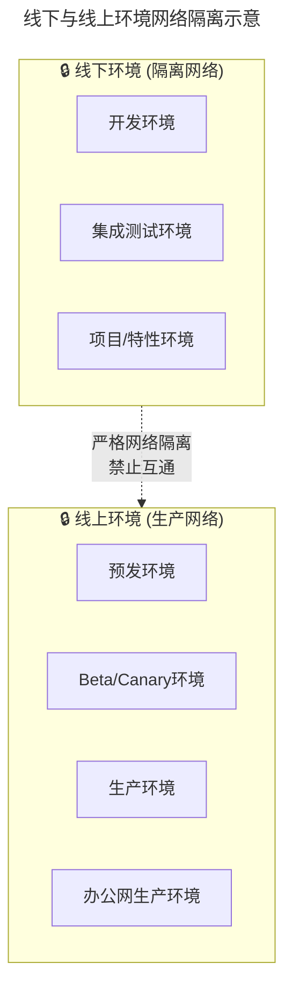
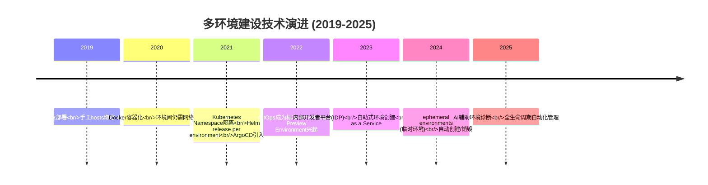
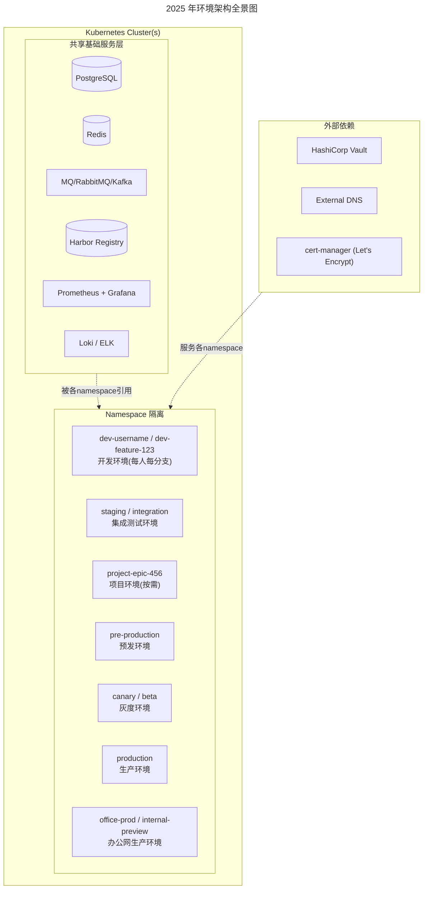
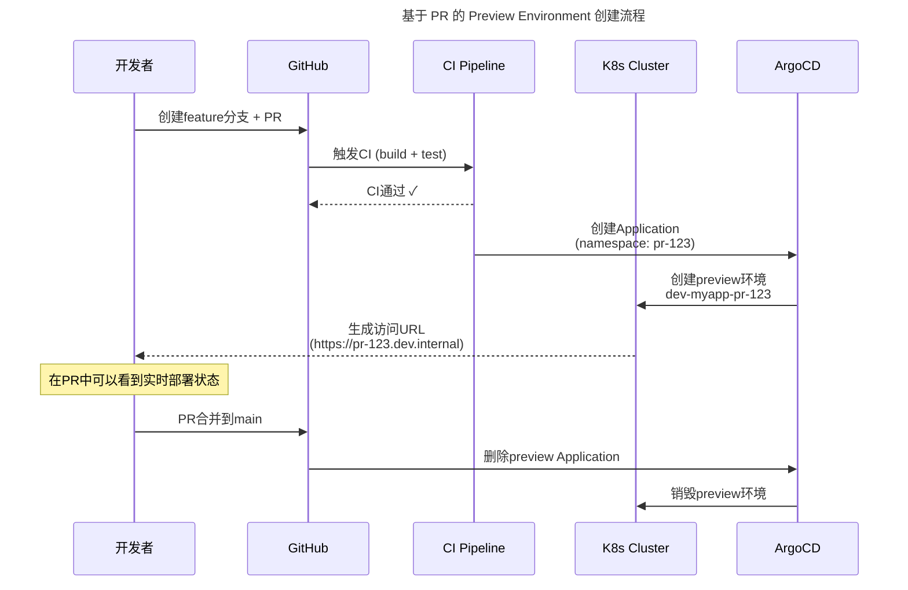
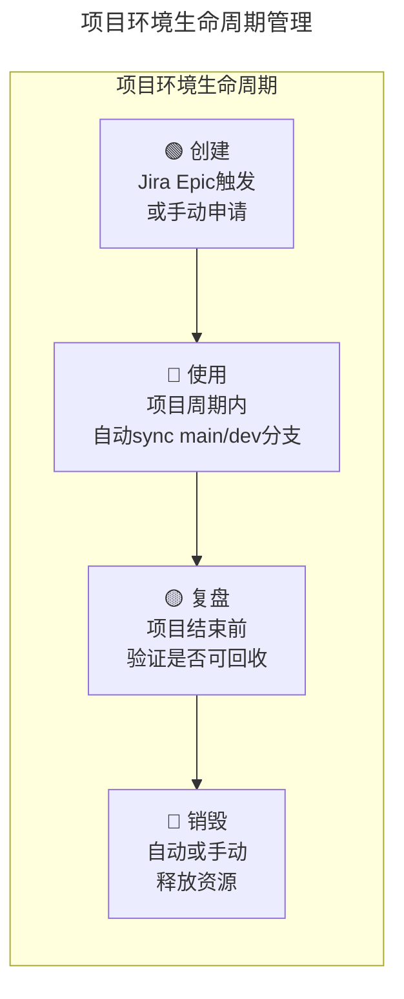
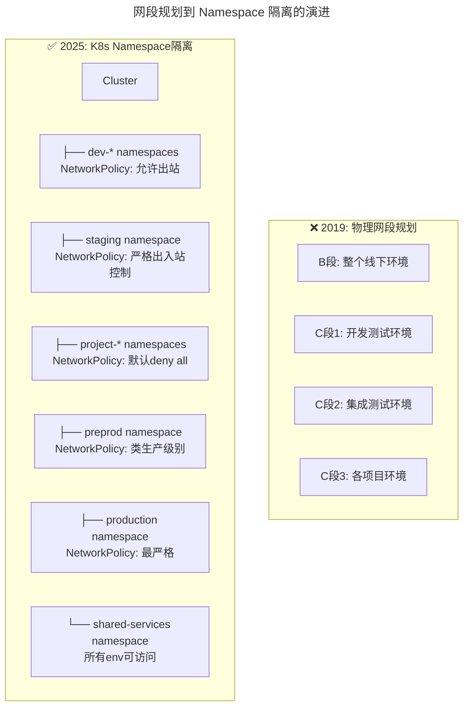
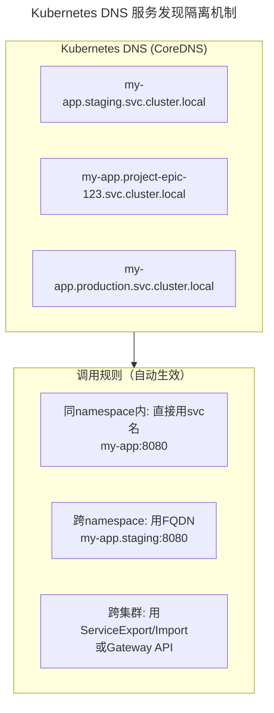
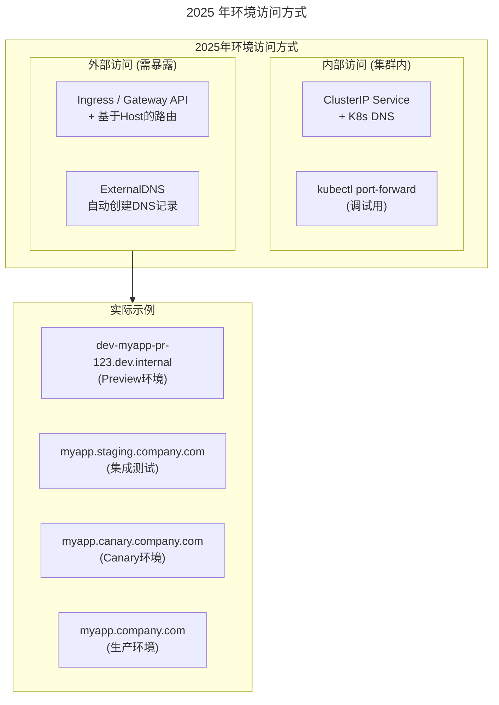
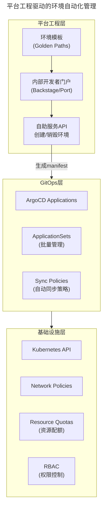
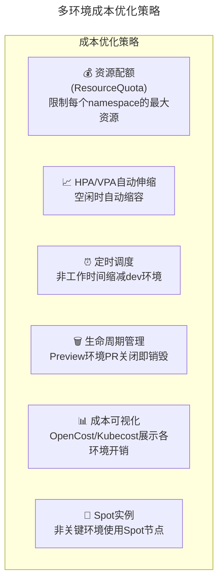

> 📅 **原文发布**：2018-2019 | **本次更新**：2025-06 | **更新等级**：🔴全面重写增强
> 📌 **v2 结构化升级**：2026-08 | **升级范围**：补齐 6 节标准骨架、Mermaid 图加标题、术语英文对照、参考资料融入进阶延展

# 15 | 开发和测试争抢环境？是时候进行多环境建设了

## 一、导言

在上一期文章里，笔者介绍了多环境下的应用配置管理问题，从这期开始，会分两期文章详细探讨多环境建设的问题：到底需要哪些环境？这些环境都有什么作用？环境建设的思路和方式是怎样的？

本文就结合笔者的经验和理解与读者探讨持续交付中的 **线下多环境建设（Offline Multi-Environment Construction）**。

### 问题背景

比较典型的场景就是，测试人员正在验证一个功能，突然发现应用停止运行了——原来开发为了验证和尽快发布新功能，更新了代码。这样就阻塞了测试的正常工作；但不更新代码，开发的工作又会停滞下来。开发与测试在同一套环境下相互争抢，是持续交付体系建设中最早暴露的痛点之一。

### 核心矛盾

环境建设本质上要解决的是 **"环境数量有限" 与 "使用方需求冲突" 之间的矛盾**。在云原生（Cloud Native）时代，这一矛盾的解法已经从"物理/虚拟机独立部署"演化为 "Kubernetes Namespace + GitOps" 的弹性模式。

---

## 二、核心方法论

### 环境分类

通常，主要按照环境所起到的作用，将环境分为两大类：

- **线下环境（Offline Environment）**：测试验收用
- **线上环境（Online Environment）**：为用户提供服务

从建设角度来说，线下环境和线上环境，在网段上是要严格隔离的。这一点在做环境建设时就要确定网络规划，同时在网络设备或者虚拟网络的访问策略上要严格限定两个环境的互通。如果限制不严格，就极易引起线上故障，甚至是信息安全问题。



### 线下环境三层模型（保留价值）

原版将线下环境分为三层，这个分层思路在 2025 年依然有效，但实现方式发生了根本变化：

| 层级 | 定位 | 2019 实现 | 2025 实现 |
|------|------|-----------|-----------|
| 集成测试环境（Integration/Staging） | 最重要，与生产同步 | 独立物理环境 + 手工发布 | ArgoCD Application 自动 sync main 分支 |
| 开发测试环境（Development） | 日常开发联调 | 一套共享开发环境 | 每开发者/每分支独立 Preview Environment |
| 项目环境（Project/Epic） | 大型项目独立联调 | 按需申请 VM 部署 | ApplicationSet + Webhook 自动创建销毁 |

### 核心矛盾依然存在

原版描述的经典场景在今天依然成立，但解法已经根本性改变：从"如何在一套共享环境下协调开发与测试" 转向 "如何让每个开发者都能独立拥有一套环境"。

---

## 三、关键流程

### 技术演进时间线



### 2025 年环境架构全景



### 流程一：集成测试环境建设流程

集成测试环境（Integration/Staging）是整个线下环境中 **最重要** 的一环，定位是供测试使用，最大程度与线上版本保持同步，作为功能、需求、业务流程正式上线前验证的主要环境。

**2025 年实现方式**：

```yaml
# ArgoCD Application for Staging
apiVersion: argoproj.io/v1alpha1
kind: Application
metadata:
  name: my-app-staging
  namespace: argocd
spec:
  project: default
  source:
    repoURL: https://github.com/org/my-app.git
    targetRevision: main          # 追踪main分支
    path: k8s/overlays/staging
  destination:
    server: https://kubernetes.default.svc
    namespace: staging
  syncPolicy:
    automated:
      prune: true                 # 自动清理多余资源
      selfHeal: true              # 自动修复漂移
    syncOptions:
    - CreateNamespace=true
```

**关键要求（2025版）**：
- 与生产环境使用相同的镜像 tag 策略（如固定 digest）
- 共用生产环境的有状态服务（DB、缓存等），数据真实
- 有严格的发布准入规则（CI 全部通过才能 sync）
- 配置完整的可观测性（日志、监控、链路追踪）
- 稳定性保障：不允许随意变更，变更需走 PR 流程

### 流程二：开发测试环境 - 从"一套"到"每人一套"

**原版痛点**：开发和测试争抢集成测试环境 → 建设第二套开发测试环境。

**2025 年的革命性变化**：从"一套共享的开发环境"变为 **"每个开发者/每个分支一个独立的临时环境"**。

#### 方案 A：基于 PR 的 Preview Environment（推荐）



**工具支持**：
- ArgoCD ApplicationSet（Pull Request generator）—— 原生支持 PR-based preview environments
- Knative Serving —— Serverless 模式，按需自动缩容到零
- Tilt / DevSpace —— 本地开发环境快速启动

#### 方案 B：固定开发命名空间（轻量级）

如果 Preview Environment 成本太高，可以采用固定命名空间方案：

```bash
# 每个开发者分配自己的命名空间
kubectl create namespace dev-alice
kubectl create namespace dev-bob
kubectl create namespace dev-charlie

# 通过RBAC限制每个开发者只能操作自己的namespace
```

**关键改进点（对比原版）**：
- 不再需要"最小化原则"省资源 —— K8s 资源配额（Request/Limit）+ HPA 自动解决
- 不再需要手动维护 hosts —— Kubernetes Service + Ingress/Gateway API 自动处理 DNS
- 不再担心环境影响他人 —— Namespace 天然隔离

### 流程三：项目环境生命周期

**原版场景**：大促期间多项目并行，需要独立的项目环境。

**2025 年的做法**：



**自动化实现（ArgoCD ApplicationSet + Webhook）**：

```yaml
# 当Jira Epic创建时，通过webhook触发环境创建
apiVersion: argoproj.io/v1alpha1
kind: ApplicationSet
metadata:
  name: project-environments
spec:
  generators:
  - pullRequest:
      github:
        owner: org
        repo: my-app
        tokenRef:
          secretName: github-token
          key: token
      rebase: false
  template:
    metadata:
      name: 'project-pr-{{number}}'
    spec:
      source:
        repoURL: https://github.com/org/my-app.git
        targetRevision: '{{head_sha}}'
        path: k8s/overlays/project
      destination:
        server: https://kubernetes.default.svc
        namespace: 'project-{{number}}'
      syncPolicy:
        automated: {}           # PR关闭后自动清理
```

**成本控制机制**：
- 设置 ResourceQuota 限制项目环境总资源
- 使用 HPA 让空闲环境自动缩容
- 项目结束后 7 天自动销毁（可延期）
- 只有公司级战略项目才允许创建独立项目环境

---

## 四、工具与实战

### 关键技术点演进（2019 → 2025）

原版提到四个关键技术点：网段规划、服务化框架单元化调用、域名访问策略、自动化管理。在 K8s 时代，这些都有了全新的实现方式。

#### 技术点 1："网段规划" → Namespace + NetworkPolicy



**NetworkPolicy 示例**：

```yaml
# 生产环境 - 默认拒绝所有入站，只允许特定来源
apiVersion: networking.k8s.io/v1
kind: NetworkPolicy
metadata:
  name: production-deny-all-ingress
  namespace: production
spec:
  podSelector: {}
  policyTypes:
  - Ingress
  ingress: []  # 空数组 = deny all

---
# 允许ingress controller访问
apiVersion: networking.k8s.io/v1
kind: NetworkPolicy
metadata:
  name: allow-ingress
  namespace: production
spec:
  podSelector:
    matchLabels:
      app: my-app
  policyTypes:
  - Ingress
  ingress:
  - from:
    - namespaceSelector:
        matchLabels:
          name: ingress-11-Nginx基础概述
    ports:
    - protocol: TCP
      port: 8080
```

#### 技术点 2："服务化框架单元化调用" → K8s Service + DNS

原版的服务化框架单元化调用（基于 ConfigServer 的规则调用），在 K8s 中变得极其简单：



**核心优势**：不需要在 ConfigServer 中维护复杂的调用规则，K8s DNS 天然支持基于 namespace 的服务发现隔离。

#### 技术点 3："域名访问策略" → Ingress / Gateway API + 自动 DNS

原版提到的四种域名方案（多套 DNS、hosts 绑定、路由劫持等），在 2025 年有了优雅的解决方案：



**Gateway API（推荐替代 Ingress 的新一代方案）**：

```yaml
# 为不同环境自动生成不同的访问地址
apiVersion: gateway.networking.k8s.io/v1
kind: HTTPRoute
metadata:
  name: my-app-route
  namespace: staging
spec:
  parentRefs:
  - name: internal-gateway
    namespace: network
  hostnames:
  - "myapp.staging.internal"
  rules:
  - backendRefs:
    - name: my-app-svc
      port: 8080
```

配合 **ExternalDNS**，每次创建新的 HTTPRoute 时自动在 Cloudflare/Route53 中创建对应的 DNS 记录。

#### 技术点 4："自动化管理" → GitOps + IaC + Platform API

原版提到要以应用为核心进行管理。2025 年的实现：



### 环境矩阵总结

| 环境 | 目标用户 | 数据真实性 | 稳定性要求 | 生命周期 | 资源规模 | 自动化程度 |
|------|---------|-----------|-----------|---------|---------|-----------|
| **Dev (per-dev)** | 开发者个人 | Mock/部分真实 | 低 | 跟随分支 | 极小(按需) | 全自动(PR触发) |
| **Integration/Staging** | QA团队 | 接近真实 | 高 | 持续运行 | 中等 | GitOps自动同步 |
| **Project/Epic** | 特定项目组 | 接近真实 | 中 | 项目周期 | 按需分配 | 申请→自动创建→到期销毁 |
| **Pre-production** | Dev+QA+运维 | 真实(共用有状态) | 很高 | 持续运行 | 小规模 | GitOps+人工审批 |
| **Canary/Beta** | 少量真实用户 | 完全真实 | 高 | 发布期间 | 极小(1-2pod) | 渐进式交付自动管理 |
| **Production** | 所有用户 | 完全真实 | 最高 | 持续运行 | 全量 | GitOps+渐进式发布 |
| **Office Production** | 内部员工 | 完全真实 | 高 | 活动期间 | 中小规模 | GitOps |

### 成本优化策略

原版提到"环境并不是越多越好，反而是越精简越好"。在云原生时代，我们可以更精细地控制成本：



**具体实践**：

```yaml
# ResourceQuota示例 - 限制dev namespace的总资源
apiVersion: v1
kind: ResourceQuota
metadata:
  name: dev-quota
  namespace: dev
spec:
  hard:
    requests.cpu: "10"
    requests.memory: 20Gi
    limits.cpu: "20"
    limits.memory: 40Gi
    persistentvolumeclaims: "5"
    pods: "50"
```

```yaml
# HPA - 基于CPU指标自动伸缩（定时缩容可配合KEDA CronTrigger实现）
apiVersion: autoscaling/v2
kind: HorizontalPodAutoscaler
metadata:
  name: my-app-dev-hpa
  namespace: dev
spec:
  scaleTargetRef:
    apiVersion: apps/v1
    kind: Deployment
    name: my-app
  minReplicas: 1
  maxReplicas: 3
  metrics:
  - type: Resource
    resource:
      name: cpu
      target:
        type: Utilization
        averageUtilization: 50
  behavior:
    scaleDown:
      policies:
      - type: Percent
        value: 100
        periodSeconds: 60
      stabilizationWindowSeconds: 300
    scaleUp:
      stabilizationWindowSeconds: 0
```

### 工具选型矩阵

| 场景 | 推荐方案 | 替代方案 | 不推荐 |
|------|---------|---------|--------|
| 环境隔离 | **K8s Namespace + NetworkPolicy** | 单独Cluster（过重） | 无隔离 |
| Preview环境 | **ArgoCD ApplicationSet (PR generator)** | Knative Serving, Tilt | 手动创建namespace |
| 环境同步 | **ArgoCD / FluxCD** | Jenkins X, Rancher | kubectl apply手动 |
| DNS管理 | **ExternalDNS + Gateway API** | Ingress + 手动DNS | hosts文件绑定 |
| 成本监控 | **OpenCost / Kubecost** | 自建Prometheus queries | 无成本可视 |
| 资源配额 | **K8s ResourceQuota + LimitRange** | 无 | 无限制 |
| 自助服务 | **Backstage (Spotify)** | Port, Humanitec | 工单系统 |
| 环境模板 | **Golden Path Templates** | 无 | 每次从头搭建 |

### 落地 Checklist

> **环境规划**
>   - 是否确定了完整的环境清单和每种环境的用途
>   - 每种环境的网络隔离策略是否明确
>   - 是否制定了环境创建/销毁的标准流程
>
> **K8s基础设施**
>   - Namespace 划分方案是否已确定
>   - NetworkPolicy 是否已覆盖所有环境（特别 production）
>   - ResourceQuota 是否已设置（防止资源滥用）
>   - RBAC 权限模型是否符合最小权限原则
>
> **GitOps 配置**
>   - ArgoCD/Flux 是否已部署
>   - 每个环境的 Application/ApplicationSet 是否已定义
>   - 同步策略是否合理（哪些自动同步，哪些需要审批）
>   - 是否配置了健康检查和告警
>
> **访问管理**
>   - 外部访问入口(Ingress/Gateway API)是否已配置
>   - ExternalDNS 是否已集成（自动 DNS 记录）
>   - TLS 证书管理(cert-manager)是否正常工作
>   - 认证鉴权(OAuth/OIDC)是否已配置
>
> **开发体验**
>   - Preview Environment 是否可用（PR 触发自动创建）
>   - 开发者是否能自助创建需要的开发环境
>   - 环境创建到可用的等待时间是否 < 5 分钟
>   - 日志/调试信息是否易于获取
>
> **成本控制**
>   - 是否有各环境的成本可视化面板
>   - 空闲环境是否有自动回收机制
>   - 是否设置了预算上限和超限告警
>   - 定期 review 环境使用率，清理废弃环境

---

## 五、常见误区

```
❌ 陷阱1："Namespace爆炸"
   症状：几百个namespace没人清理
   根因：只有创建没有销毁机制
   后果：etcd压力大，apiserver变慢，资源浪费
   解法：TTL Controller + 定期审计 + 自动清理策略

❌ 陷阱2："测试环境与生产环境差异过大"
   症状：测试通过了但上线就挂
   根因：test环境用了mock数据/简化配置
   后果：测试形同虚设
   解法：Staging环境尽量复用生产基础设施和数据结构

❌ 陷阱3："开发环境互相影响"
   症状：Alice的代码把Bob的环境搞崩了
   根因：共享开发环境没有做资源隔离
   后果：团队协作效率下降
   解法：每人独立namespace + ResourceQuota硬限制

❌ 陷阱4："环境状态不可重现"
   症状："我这边好的啊，你那边怎么不行"
   根因：环境配置靠人肉记忆，没有声明式管理
   后果：Debug时间大量浪费
   解法：GitOps + 一切皆代码 + 配置漂移检测

❌ 陷阱5："忽略预发环境的重要性"
   症状：直接从staging上production
   根因：觉得preprod多余浪费资源
   后果：生产数据相关问题无法提前发现
   解法：Preprod是线上发布的最后一道防线，必须有

❌ 陷阱6："环境越多越好"
   症状：为每种场景都建独立环境
   根因：缺乏ROI评估
   后果：维护成本指数增长
   解法：定期评估每个环境的使用率和价值，精简合并低价值环境
```

---

## 六、进阶延展

### 2019 → 2025 核心变化总结

| 维度 | 2019年 | 2025年 |
|------|--------|--------|
| 隔离方式 | 物理网段/VLAN | K8s Namespace + NetworkPolicy |
| 环境创建 | 人工申请+手工部署 | PR触发自动创建 / 自助Portal申请 |
| DNS/访问 | hosts绑定 / 路由劫持 | Gateway API + ExternalDNS自动DNS |
| 服务调用隔离 | ConfigServer规则 | K8s DNS + Service FQDN天然隔离 |
| 资源管理 | 手工分配VM | ResourceQuota + HPA自动伸缩 |
| 成本控制 | 靠人肉意识 | OpenCost可视化 + 自动回收 |
| 生命周期 | 建了就不拆 | TTL / PR关闭自动销毁 |

### 内部开发者平台（IDP）方向

环境建设的下一阶段是 **平台工程（Platform Engineering）** 与 **内部开发者门户（Internal Developer Portal, IDP）** 的融合：

- **Backstage / Port**：统一的环境目录与黄金路径（Golden Path）模板
- **Environment as a Service**：开发者通过声明式申请单自助获取环境
- **AI 辅助诊断**：环境异常自动定位，给出修复建议
- **FinOps 内嵌**：环境成本与业务价值直接挂钩，形成闭环

### 关键术语对照

| 中文 | 英文 |
|------|------|
| 线下多环境建设 | Offline Multi-Environment Construction |
| 集成测试环境 | Integration / Staging Environment |
| 预发环境 | Pre-production Environment |
| 临时环境 | Ephemeral Environment |
| 平台工程 | Platform Engineering |
| 内部开发者门户 | Internal Developer Portal (IDP) |
| 黄金路径 | Golden Path |
| 资源配额 | Resource Quota |
| 配置漂移 | Configuration Drift |
| 软件物料清单 | Software Bill of Materials (SBOM) |

### 参考资料融入

- 原版《运维体系管理》系列第 14 期：多环境配置管理（前置阅读）
- 原版《运维体系管理》系列第 16 期：线上环境建设（后续阅读）
- ArgoCD 官方文档：ApplicationSet 与 Preview Environment
- Kubernetes SIG Network：Gateway API 与 NetworkPolicy 最佳实践
- CNCF 白皮书：Platform Engineering Maturity Model
- OpenCost / Kubecost：Kubernetes 成本可视化的开源标准

### 读者互动

最后，在实际操作中，仍然会有很多细节问题，这些问题会跟业务场景有关。读者在环境建设过程中遇到过哪些问题？有什么更好的经验或建议？欢迎在团队内复盘时沉淀属于自己组织的多环境建设手册。
