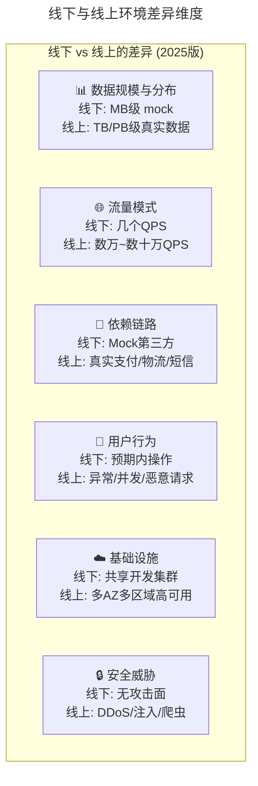
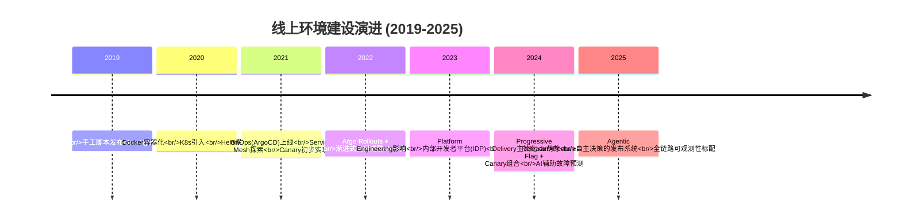
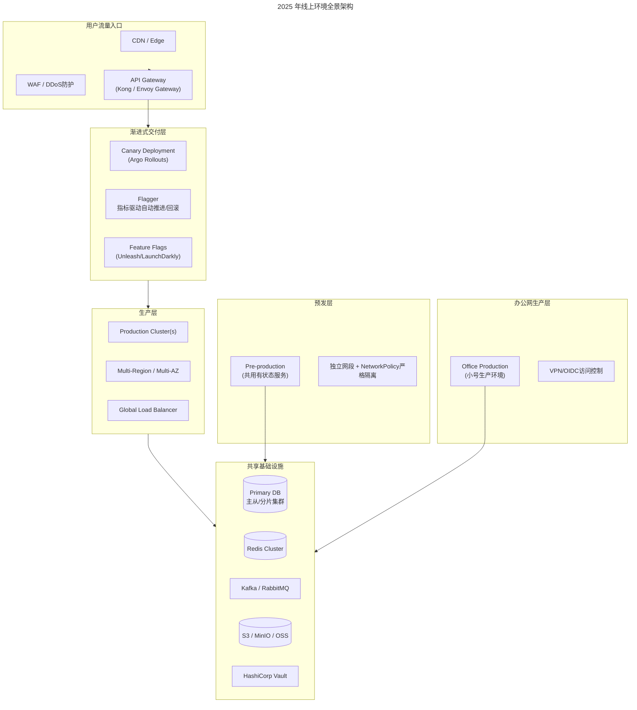
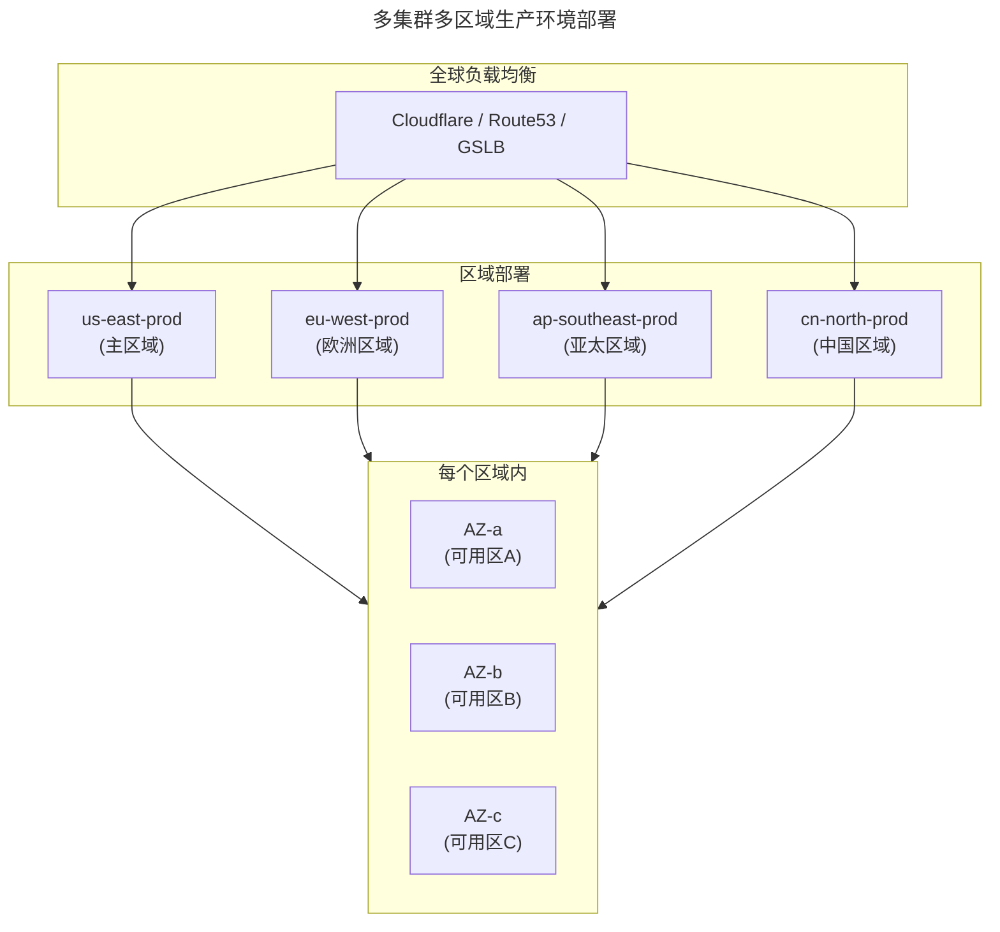
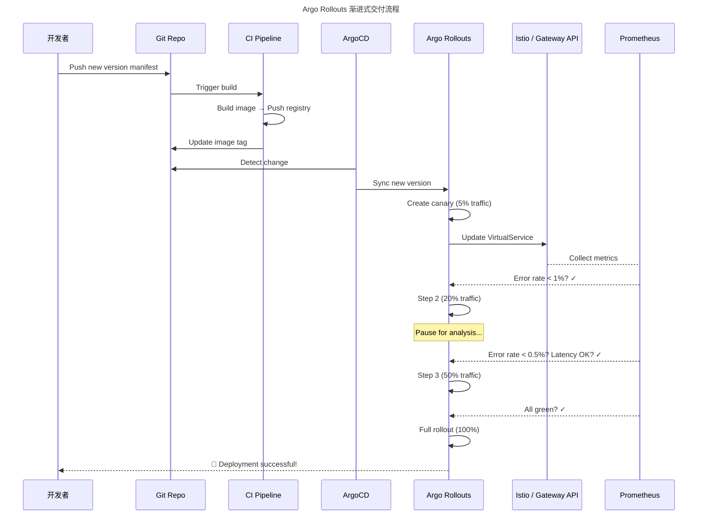
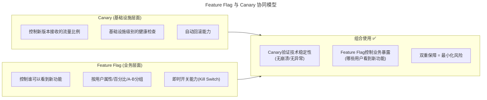
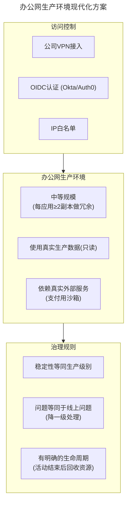
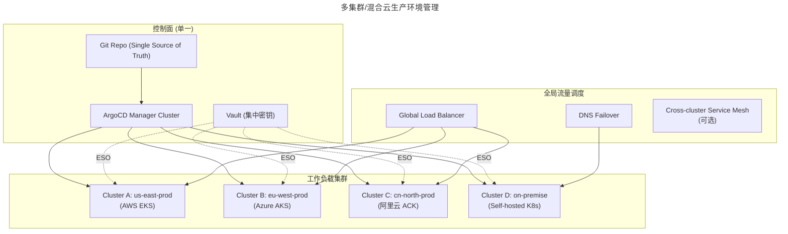
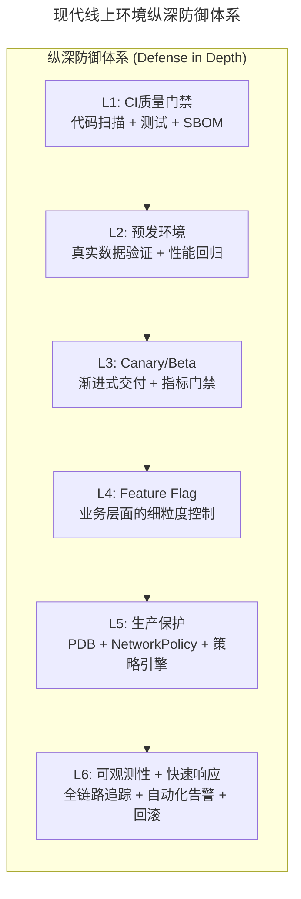

> 📅 **原文发布**：2018-2019 | **本次更新**：2025-06 | **更新等级**：🔴全面重写增强
> 📌 **v2 结构化升级**：2026-08 | **升级范围**：补齐 6 节标准骨架、Mermaid 图加标题、术语英文对照、参考资料融入进阶延展

# 16 | 线上环境建设，要扛得住真刀真枪的考验

## 一、导言

前面几期笔者分享了一些线下环境建设方面的内容。整个线下环境的建设是比较复杂的，那经过线下环境的验证，是不是就可以直接发布到线上生产环境了呢？答案同样是否定的——由线下正式交付到线上之前，仍然会做很多的验证和稳定性保障工作。

本文就看一下 **线上环境是如何建设的（Online Environment Construction）**。

### 为什么不能直接从测试上生产

线下是模拟出来的，线上却是真实的用户场景，这两者之间会存在巨大的差异。有差异，系统的表现状况就会不一样。线下只能尽可能地确保业务功能和业务流程是正常的，但是没法百分之百模拟线上场景，特别是一些异常特殊场景方面。

---

## 二、核心方法论

### 原版的四层线上环境模型（保留框架）

原版将线上环境分为四个层次，这个分层逻辑在 2025 年依然有效且重要：

| 环境 | 定位 | 核心价值 |
|------|------|---------|
| **生产环境（Production）** | 正式对外提供服务 | 直接承载用户流量 |
| **Beta/Canary 环境** | 小规模真实流量灰度验证 | 控制影响范围 |
| **预发环境（Pre-production）** | 真实数据 + 真实基础服务验证 | 最后一道防线 |
| **办公网生产环境（Office Production）** | 内部员工提前体验 | 大促前预热验证 |

### 线下 vs 线上的差异维度（2025 版）



---

## 三、关键流程

### 线上环境架构演进时间线



### 2025 年线上环境全景架构



### 流程一：生产环境多集群多区域建设

原版提到早期"线上环境=生产环境"就够了。但在 2025 年，生产环境本身已经演变为复杂的 **多集群、多可用区（Multi-AZ）、多区域（Multi-Region）** 架构：



### 生产环境关键要求（2025 版）

| 维度 | 要求 | 实现方式 |
|------|------|---------|
| **可用性** | 99.99%+ SLA | 多 AZ 部署 + PodDisruptionBudget（PDB） |
| **容量** | 承载峰值流量的 2-3 倍 | HPA/VPA + KEDA 事件驱动伸缩 |
| **安全** | 零信任网络模型 | NetworkPolicy 默认 deny + mTLS（Service Mesh 可选） |
| **可观测性** | 全链路追踪 + 日志 + 指标 | OpenTelemetry + Prometheus + Loki/Jaeger |
| **灾难恢复** | RTO < 1h, RPO < 5min | 跨区域备份 + 定期故障演练（Chaos Engineering） |
| **合规** | 数据主权、审计日志 | OPA/Gatekeeper 策略 + 审计日志长期保存 |

### 生产环境保护机制

```yaml
# 生产环境的严格保护示例
apiVersion: networking.k8s.io/v1
kind: NetworkPolicy
metadata:
  name: production-default-deny
  namespace: production
spec:
  podSelector: {}
  policyTypes:
  - Ingress
  - Egress
  ingress: []   # 默认拒绝所有入站
  egress:
  # 只允许出站到DNS和特定目标
  - to:
    - namespaceSelector:
        matchLabels:
          kubernetes.io/metadata.name: kube-system
    ports:
    - protocol: UDP
      port: 53
  - to:
    - namespaceSelector:
        matchLabels:
          purpose: shared-services
---
# PodDisruptionBudget - 保证最小可用副本
apiVersion: policy/v1
kind: PodDisruptionBudget
metadata:
  name: my-app-pdb
  namespace: production
spec:
  minAvailable: 2
  selector:
    matchLabels:
      app: my-app
---
# 限制生产环境的破坏性操作
apiVersion: kyverno.io/v1
kind: ClusterPolicy
metadata:
  name: production-protection
spec:
  validationFailureAction: Enforce
  rules:
  - name: deny-delete-production
    match:
      any:
      - resources:
          kinds:
          - Deployment
          operations:
          - DELETE
          namespaces:
          - production
    validate:
      message: "Deleting Deployments in production is not allowed!
               Use rollout instead."
      deny: {}
```

### 流程二：Beta/Canary 环境从手动权重到渐进式交付

#### 原版做法回顾

- 从生产集群中独立出 1-2 台机器作为 Beta 集群
- 通过 RPC/HTTP 负载均衡降低权重引入少量流量
- 静默观察后决定是否全量发布

#### 2025 年：Argo Rollouts + Flagger 渐进式交付



#### Feature Flag 与 Canary 的协同

2025 年的最佳实践是将 **Feature Flag（功能开关） 和 Canary Deployment（金丝雀部署） 结合使用**：



### 流程三：预发环境规则与禁令

#### 原版规则（保留并强化）

预发环境在建设上有以下几个规则要求：
1. **状态基础服务共用** —— DB、KV、文件存储、搜索类数据共用生产的
2. **网络隔离** —— 独立网段/namespace，不承担线上真实流量，业务调用必须本环境内闭环
3. **稳定性保障** —— 版本质量要求高于线下环境，不允许反复频繁变更

#### 2025 年的额外要求

| 新增要求 | 说明 | 实现方式 |
|---------|------|---------|
| **数据只读保护** | 允许读取生产数据但禁止写入变更 | DB 只读账号 + ProxySQL 路由规则 |
| **变更审批流程** | 预发环境变更需要半自动审批 | ArgoCD Sync Options: `Prune=false` 默认 + 人工确认 |
| **完整可观测性** | 与生产同级的监控告警 | 相同 Prometheus rule 配置 + 专用 Grafana dashboard |
| **性能基线对比** | 发布前后必须通过性能回归测试 | k6/Gatling 自动化压测集成到 Pipeline |
| **安全扫描复用** | 使用与生产相同的安全策略 | Kyverno/OPA 相同 policy 集合 |

#### 预发环境绝对禁止做的事（保留并扩展）

> ❌ **绝对不可以通过预发环境做数据订正和变更**
>
> ❌ **绝对不可以阻塞他人工作**

**新增禁令**：
- ❌ 不允许在预发环境执行任何 DDL 变更（表结构修改）
- ❌ 不允许在预发环境执行任何清理或归档操作
- ❌ 不允许绕过 GitOps 直接 kubectl apply/edit
- ❌ 不允许关闭预发环境的监控告警

---

## 四、工具与实战

### 办公网生产环境现代化改造

#### 原版定位

原版中的办公网生产环境（"小蘑菇"）是为了解决大促前员工提前体验的问题。

#### 2025 年实现方案



| 维度 | 2019 年做法 | 2025 年最佳实践 |
|------|-----------|---------------|
| 访问控制 | WiFi 劫持 | VPN + OIDC + IP 白名单 + RBAC |
| 环境创建 | 手工搭建 | GitOps ApplicationSet 声明式创建 |
| 资源分配 | 固定分配 | HPA 根据实际访问量自动伸缩 |
| 问题反馈 | 口头/IM | 集成到 Jira/Linear 的反馈入口 |
| 生命周期 | 建了就不拆 | 活动结束后 7 天自动销毁通知 |

### 多集群/混合云生产环境

对于大型企业，生产环境往往跨越多个集群甚至多个云厂商：



### 工具选型矩阵

| 场景 | 推荐方案 | 替代方案 | 不推荐 |
|------|---------|---------|--------|
| 渐进式交付 | **Argo Rollouts + Flagger** | Istio canary, Spinnaker | 手动调整权重/副本数 |
| Feature Flag | **Unleash (开源)** | LaunchDarkly, Flagsmith | 硬编码 if-else 开关 |
| 多集群管理 | **ArgoCD ApplicationSet** | Rancher Fleet, Flux MT | 各集群独立操作 |
| 流量调度 | **Gateway API / Istio** | Nginx Ingress, Kong Ingress | L4 VIP 手动切换 |
| 生产环境保护 | **Kyverno / OPA Gatekeeper** | 无策略引擎 | 仅靠人工审查 |
| 灾备切换 | **DNS Failover + ArgoCD** | 手动切换, Global Balancer | 无灾备方案 |
| 可观测性 | **OpenTelemetry + Prometheus + Grafana** | Datadog, New Relic | 无全链路观测 |
| 混沌工程 | **Chaos Mesh / Litmus** | Gremlin (商业), 自建脚本 | 不做故障演练 |

### 落地 Checklist

> **生产环境基础**
>   - 多 AZ/多区域部署方案是否确定
>   - PodDisruptionBudget(PDB) 是否已配置
>   - NetworkPolicy 是否采用默认 deny 模式
>   - RBAC 权限是否符合最小权限原则
>   - HPA/VPA 自动伸缩策略是否合理
>
> **Canary/Beta 环境**
>   - 是否已部署 Argo Rollouts 或 Flagger
>   - AnalysisTemplate 是否定义了合理的指标阈值
>   - 回滚策略是否经过演练（目标：< 30 秒完成回滚）
>   - Feature Flag 平台是否已集成
>
> **预发环境**
>   - 是否共用生产的有状态服务(DB/Cache 等)
>   - 网络隔离策略是否生效（禁止跨 env 调用）
>   - 变更审批流程是否建立
>   - 性能基线回归测试是否集成到 Pipeline
>   - 安全策略是否与生产保持一致
>
> **办公网生产环境（如需）**
>   - 访问控制(VPN/OIDC/IP 白名单)是否到位
>   - 规划是否能支撑预期并发
>   - 生命周期管理（自动回收）是否配置
>   - 反馈渠道是否畅通
>
> **多集群（如有）**
>   - 控制面集群是否高可用部署
>   - 各工作集群的网络连通性是否就绪
>   - 跨集群的服务发现如何处理
>   - 灾备切换流程是否经过演练
>   - 全局负载均衡策略是否合理
>
> **整体安全保障**
>   - WAF/DDoS 防护是否就绪
>   - 证书管理(cert-manager)是否正常运作
>   - 审计日志是否长期保存（建议 ≥ 180 天）
>   - 混沌工程演练是否有定期计划

---

## 五、常见误区

```
❌ 陷阱1："跳过Canary直接全量发布"
   症状："这次改动很小，不需要灰度"
   根因：过度自信 / 节省时间
   后果：小改动引发大事故（历史教训无数）
   解法：建立强制Canary策略，核心应用必须走灰度

❌ 陷阱2："预发环境形同虚设"
   症状：预发环境常年没人用，出了问题才发现环境已经坏了
   根因：没有强制流程要求经过预发
   后果：失去最后一道防线
   解法：关键变更必须附预发验证截图/报告

❌ 陷阱3："Canary指标设置不当"
   症状：Canary一直卡住无法推进，或者错误放行了有问题的版本
   根因：阈值太严或太松，指标选择不合理
   后果：要么发布效率极低，要么将问题版本放到生产
   解法：基于历史数据设定合理阈值，定期review

❌ 陷阱4："Feature Flag债务积累"
   症状：上百个Flag从未清理
   根因：缺少Flag生命周期管理
   后果：代码复杂度上升，影响性能和可维护性
   解法：Flag过期策略 + 季度Flag审计 + 废弃清理SOP

❌ 陷阱5："多集群配置不一致"
   症状：A集群正常，B集群出了同样的问题
   根因：各集群独立维护manifest，没有统一source
   后果：同一问题在不同集群重复出现
   解法：ApplicationSet统一管理 + 定期config drift检测

❌ 陷阱6："忽视办公网生产环境的稳定性"
   症状："反正只是内部用，挂了也没事"
   根因：轻视内部用户体验
   后果：大促前无法充分验证，员工信心受损
   解法：办公网生产环境稳定性要求等同正式生产
```

---

## 六、进阶延展

### 纵深防御体系总结

我们构建一张现代线上环境的模型图来总结：



### 2019 → 2025 核心变化总结

| 维度 | 2019 年 | 2025 年 |
|------|--------|--------|
| Beta 实现 | 手动调整 LB 权重，1-2 台机器 | Argo Rollouts + Flagger 自动渐进式交付 |
| 灰度策略 | 固定比例/固定时间 | 指标驱动的自动推进/回滚 |
| 功能开关 | 硬编码配置 | Feature Flag 平台（用户级/百分比级/A-B） |
| 预发隔离 | 物理网段隔离 | Namespace + NetworkPolicy + OPA 策略 |
| 多集群 | 通常单集群 | ApplicationSet 统一管理多集群 |
| 灾备恢复 | 手动切换 | DNS Failover + ArgoCD 自动同步 |
| 环境保护 | 靠意识/规范 | Kyverno/OPA 硬性策略强制执行 |

### 关键术语对照

| 中文 | 英文 |
|------|------|
| 线上环境建设 | Online Environment Construction |
| 生产环境 | Production Environment |
| 预发环境 | Pre-production Environment |
| 渐进式交付 | Progressive Delivery |
| 金丝雀部署 | Canary Deployment |
| 功能开关 | Feature Flag |
| 多可用区 | Multi-AZ |
| 多区域 | Multi-Region |
| 纵深防御 | Defense in Depth |
| 零信任网络 | Zero Trust Network |
| 灾难恢复 | Disaster Recovery (DR) |
| 恢复时间目标 | Recovery Time Objective (RTO) |
| 恢复点目标 | Recovery Point Objective (RPO) |

### 参考资料融入

- 原版《运维体系管理》系列第 15 期：线下多环境建设（前置阅读）
- 原版《运维体系管理》系列第 17 期：流水线模式（后续阅读）
- Argo Rollouts 官方文档：Canary 与 Blue-Green 发布策略
- Flagger 项目：指标驱动的渐进式交付
- CNCF 白皮书：Multi-Cluster Topology 与 Service Mesh
- Google SRE Book：灾难恢复与多区域容灾
- OpenTelemetry 规范：全链路可观测性标准

### 读者思考

最后给读者留几个思考题：
- 笔者分别介绍了线下环境和线上环境的建设，这两个环境在持续交付体系中分别对应哪些理念和指导思想？
- 建设了这么多的环境，都是为了解决不同场景下的问题，那么还有哪些问题是上述这些环境仍然解决不了的？
