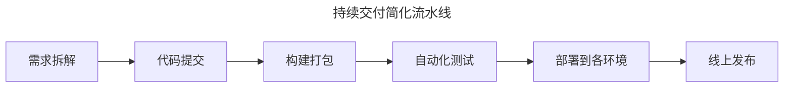
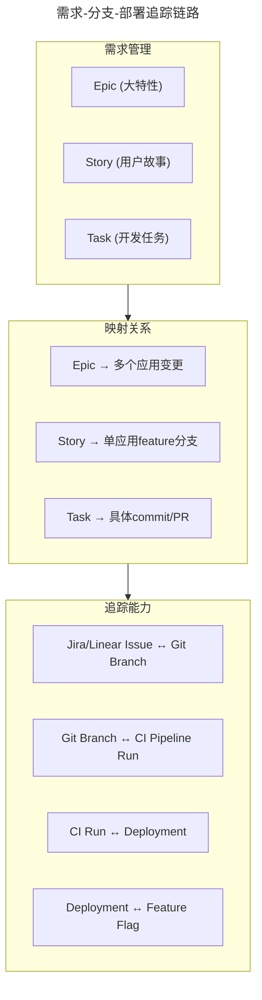
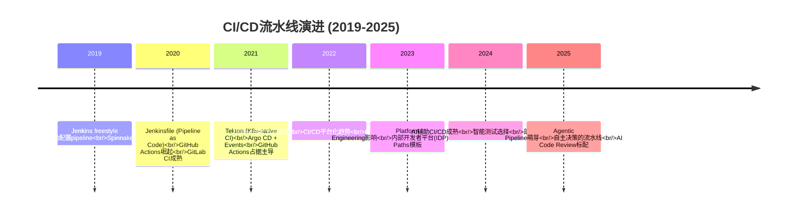
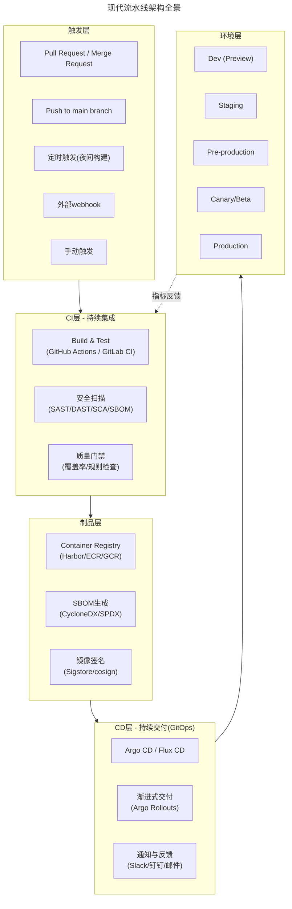
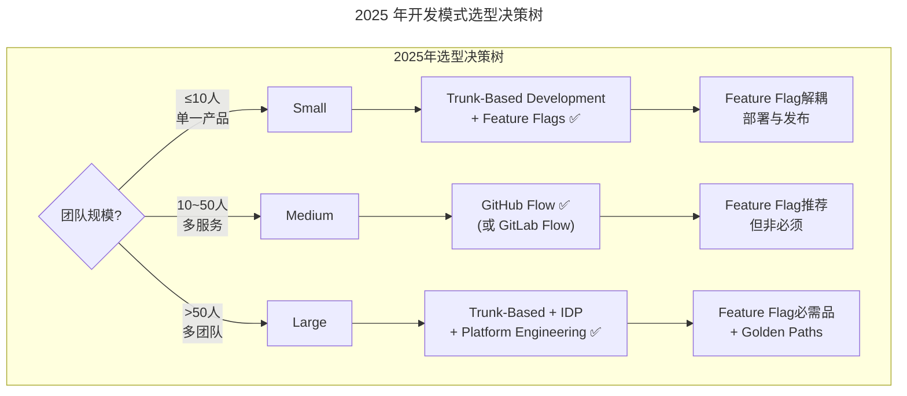
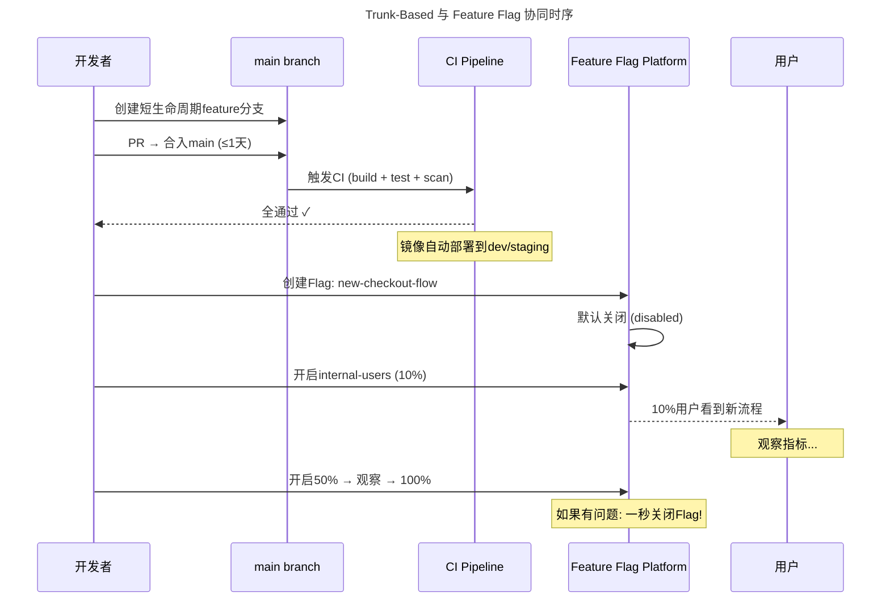
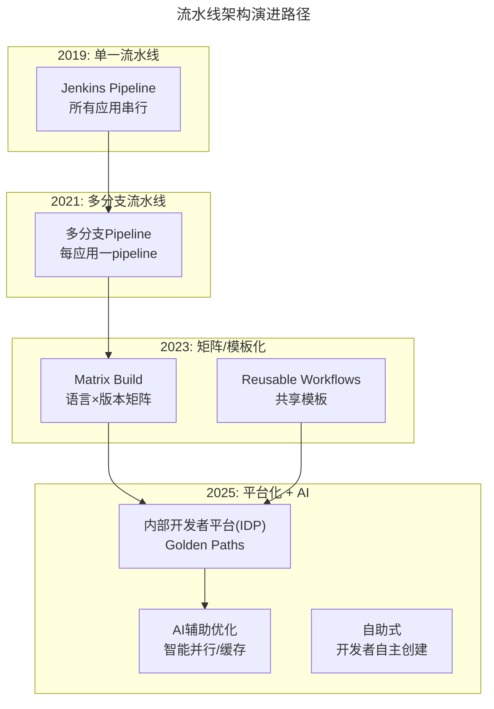
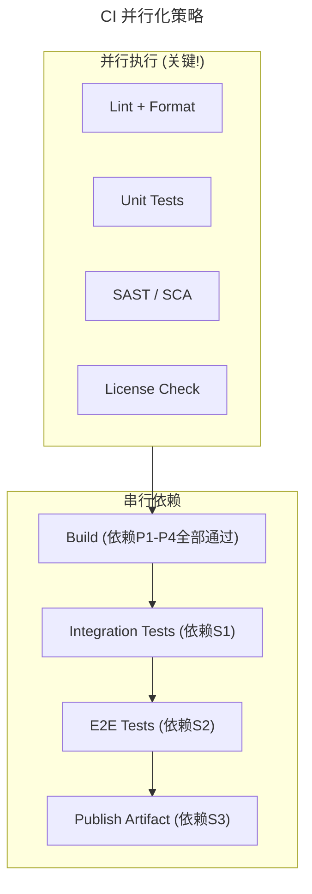

> 📅 **原文发布**：2018-2019 | **本次更新**：2025-06 | **更新等级**：🔴全面重写增强
> 📌 **v2 结构化升级**：2026-08 | **升级范围**：补齐 6 节标准骨架、Mermaid 图加标题、术语英文对照、参考资料融入进阶延展

# 17 | 人多力量大 vs. 两个披萨原则，聊聊持续交付中的流水线模式

## 一、导言

在前面几期文章中，笔者分别详细介绍了持续交付体系基础层面的建设，主要是多环境和配置管理。这些是持续交付自动化体系的基础，是与实际的业务场景和特点强相关的，希望读者一定要重视基础的建设。

本期文章是持续交付系列的第 6 篇文章，从本期开始，进入到 **交付流水线体系（Delivery Pipeline System）** 相关的内容介绍中。

### 流水线简要说明

从一个应用的代码提交开始，到发布线上的主要环节，整个流程串起来就是一个简化的流水线模式。



笔者前面介绍了持续交付的多环境以及配置管理，而流水线模式的整个过程正是在这个基础上执行。功能测试在线下环境完成，非功能验收（性能、安全等）在线上预发或 Beta 环境完成。

---

## 二、核心方法论

### 项目需求分解（增强版）

原版的核心思路：要求业务架构师在做需求分析和功能设计时，**要针对一个需求进行拆分，最终拆分成一个个的功能点，这些功能点最终落实到一个个对应的应用中，对应的逻辑体现就是应用代码的一个 feature 分支**。

这样做的好处：**从一开始的需求管理维度，就确定了最终多个应用联调、测试以及最终发布的计划和协作方式**。

#### 2025 年的增强实践



**现代工具链支持**：
- **Jira + GitHub Integration** —— 自动关联 Issue 和 PR
- **Conventional Commits** —— commit message 自动关联 issue 编号
- **LaunchDarkly/Jira Integration** —— Feature Flag 自动关联需求
- **Linear** —— 更现代的需求管理工具，原生集成 Git

### "两个披萨原则"（保留价值）

原版引用了亚马逊 CEO 杰夫·贝佐斯（Jeff Bezos）提出的 **"两个披萨原则"（Two-Pizza Rule）** —— 团队规模应该保持在两个披萨能喂饱的程度（6-8 人），这样沟通成本低、效率高。

这个原则在 2025 年依然有效，但有了新的诠释：

| 维度 | 2019 年理解 | 2025 年扩展 |
|------|-----------|-----------|
| 团队规模 | 6-8 人/团队 | **产品团队 ≤ 10 人**，通过 IDP 赋能 |
| 流水线归属 | 每团队一条 | **Golden Paths** — 预配置模板 |
| 协作方式 | 同一物理位置 | 分布式 + 异步协作（Git + PR） |
| 自治程度 | 全栈自治 | **端到端拥有权**（build → run → fix） |

---

## 三、关键流程

### CI/CD 流水线技术演进时间线



### 现代流水线架构全景



### 流程一：开发模式选择

#### 原版三种模式回顾

| 模式 | 特点 | 原版评价 |
|------|------|---------|
| **主干开发（Trunk-Based）** | 所有代码直接提交 master，确保随时可发布 | 对质量和 CI 要求极高 |
| **GitFlow** | master + develop 分支，release 分支发布 | 分支管理代价高 |
| **分支开发（简化版）** | feature/release 分支从 master 签出，简洁清晰 | **推荐** |

#### 2025 年开发模式选型（全新视角）



##### Trunk-Based + Feature Flag 的黄金组合



**Trunk-Based 的关键实践**：
1. **极短生命周期分支** —— feature 分支存活 < 1 天
2. **小步提交** —— 每次 PR < 400 行代码变更
3. **强制 CI** —— 所有 check 必须通过才能合并
4. **主保护规则** —— CODEOWNERS + Required status checks
5. **Feature Flag 驱动** —— 解耦"部署"和"发布"

### 流程二：流水线架构演进



### 流程三：并行化策略



---

## 四、工具与实战

### 流水线设计原则（2025 增强版）

#### 原则 1：声明式定义（YAML as Code）

```yaml
# .github/workflows/ci.yml (示例)
name: CI Pipeline
on:
  pull_request:
    branches: [main]
  push:
    branches: [main]

jobs:
  build-and-test:
    runs-on: ubuntu-latest
    steps:
      - uses: actions/checkout@v4
      - name: Set up Go
        uses: actions/setup-go@v5
        with:
          go-version: '1.22'
          cache: true
      - name: Build
        run: go build -o app ./...
      - name: Test
        run: go test -race -coverprofile=coverage.out ./...
      - name: Upload coverage
        uses: codecov/codecov-action@v4
```

#### 原则 2：快速反馈循环（< 5 分钟）

| 阶段 | 目标时间 | 优化手段 |
|------|---------|---------|
| Lint + Format | < 30 秒 | 本地 pre-commit hook |
| Unit Test | < 2 分钟 | 并行执行 + 缓存依赖 |
| Build | < 3 分钟 | 远程 BuildKit cache |
| SAST/SCA | < 2 分钟 | 增量扫描 |
| 总计 | **< 5 分钟** | 并行化是关键 |

### GitHub Flow 模式核心规则

如果团队暂时不具备全面 Trunk-Based 的条件，**GitHub Flow 是最推荐的过渡方案**：

1. `main` 分支始终可部署
2. 新功能从 `main` 创建 feature 分支
3. 通过 PR 合并到 `main`（需要 CI 通过 + Code Review）
4. PR 合并后自动部署到所有环境

### 工具选型矩阵

| 场景 | 推荐方案 | 替代方案 | 不推荐 |
|------|---------|---------|--------|
| CI 引擎 | **GitHub Actions** | GitLab CI, Tekton | Jenkins freestyle (无 IaC) |
| CI 定义格式 | **YAML (Actions/GitLab)** | Jenkinsfile (Declarative) | Jenkins UI 配置 |
| 可复用模板 | **Composite Actions / Reusable Workflows** | Jenkins Shared Libraries | 复制粘贴相同配置 |
| 构建缓存 | **Actions Cache / BuildKit cache** | Nexus Repository Manager | 无缓存(每次全量构建) |
| 制品管理 | **GitHub Packages / Harbor OCI** | JFrog Artifactory, ECR | 本地文件系统 |
| 安全门禁 | **Dependabot + CodeQL + Trivy** | Snyk, SonarQube | 无安全扫描 |

### 落地 Checklist

> **流水线基础**
>   - 是否选择了合适的 CI 引擎（推荐 GitHub Actions）
>   - 流水线定义是否为 YAML as Code（非 UI 配置）
>   - 是否有可复用的模板/共享 workflow
>   - 是否建立了 branch protection rules
>
> **速度与效率**
>   - PR 触发到 CI 结果反馈是否 < 5 分钟
>   - 是否充分利用了并行执行
>   - 构建缓存是否生效（避免重复下载依赖）
>   - 是否有增量构建/增量扫描能力
>
> **质量保障**
>   - 是否集成了自动化 lint/format 检查
>   - 单元测试覆盖率是否达标
>   - 是否有 SAST/SCA 安全扫描
>   - PR 是否有强制 Code Review 机制
>
> **制品管理**
>   - 构建产物是否推送到制品仓库
>   - 是否生成了 SBOM
>   - 镜像是否经过签名(Sigstore/cosign)
>   - 是否有清理策略（避免仓库膨胀）
>
> **开发者体验**
>   - 开发者是否能自助创建需要的流水线
>   - CI 失败信息是否清晰易懂
>   - 是否有本地预检能力(pre-commit hooks)
>   - 流水线状态是否在 PR 中清晰展示

---

## 五、常见误区

```
❌ 陷阱1："单体巨石流水线"
   症状：一个pipeline跑完要30-60分钟
   根因：所有步骤串行，没有并行化
   后果：开发者等待时间长，反馈循环慢
   解法：分析依赖图，最大化并行执行

❌ 陷阱2："流水线即代码但没人维护"
   症状：YAML文件几百行，没人敢改
   根因：缺少抽象和复用
   后果：技术债务积累，越来越难改
   解法：提取Composite Actions / Reusable Workflows

❌ 陷阱3："每次都全量构建"
   症状：即使只改了一行代码也要重新编译所有内容
   根因：没有利用缓存
   后果：浪费大量计算资源和时间
   解法：依赖缓存 + 增量构建 + 远程BuildKit cache

❌ 陷阱4："安全扫描只在最后做"
   症状：跑完所有测试才发现有高危漏洞
   根因：安全左移没做好
   后果：浪费前面所有步骤的计算资源
   解法：SAST/SCA与Unit Test并行，尽早失败

❌ 陷阱5："忽略CI性能监控"
   症状：不知道流水线平均耗时多少
   根因：没有度量意识
   后果：无法识别瓶颈，无法优化
   解法：建立CI Dashboard，追踪P50/P95/P99耗时
```

---

## 六、进阶延展

### 2025 年的核心认知升级

1. **从"单一流水线"到"平台化流水线"** —— 不是选哪个工具好，而是如何建设让开发者自助使用的平台
2. **从"手工配置"到"声明式+模板化"** —— YAML as Code + Golden Paths
3. **从"串行执行"到"智能并行"** —— 依赖图分析 + 最大并行度
4. **从"人工审查"到"AI 辅助+自动化"** —— AI Code Review + 自动质量门禁
5. **"两个披萨原则"依然有效** —— 但通过平台工程可以突破物理限制

### 关键术语对照

| 中文 | 英文 |
|------|------|
| 交付流水线体系 | Delivery Pipeline System |
| 主干开发 | Trunk-Based Development |
| 两个披萨原则 | Two-Pizza Rule |
| 黄金路径 | Golden Path |
| 内部开发者平台 | Internal Developer Platform (IDP) |
| 可复用工作流 | Reusable Workflows |
| 矩阵构建 | Matrix Build |
| 快速反馈循环 | Fast Feedback Loop |
| 分支保护规则 | Branch Protection Rules |
| 代码所有者 | CODEOWNERS |
| 声明式定义 | Declarative Definition |

### 参考资料融入

- 原版《运维体系管理》系列第 16 期：线上环境建设（前置阅读）
- 原版《运维体系管理》系列第 18 期：软件构建关键问题（后续阅读）
- GitHub Flow 官方文档：Understanding GitHub Flow
- Trunk-Based Development：trunkbaseddevelopment.com
- Conventional Commits 规范：commit message 标准化
- Martin Fowler：FeatureFlag 与持续交付结合实践
- CNCF 平台工程白皮书：Golden Paths 与 IDP 设计

### 后续预告

下一期文章将重点介绍 **软件构建** 的相关细节——构建过程中有哪些关键问题和注意事项？

读者所在团队的流水线目前是怎样的？遇到过哪些痛点？
