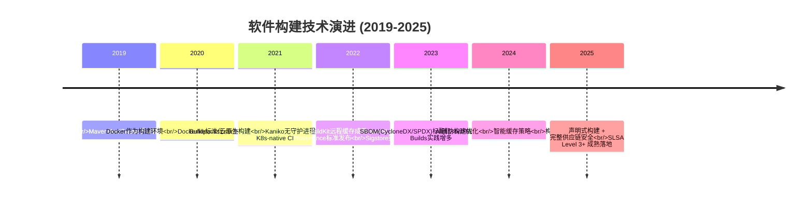
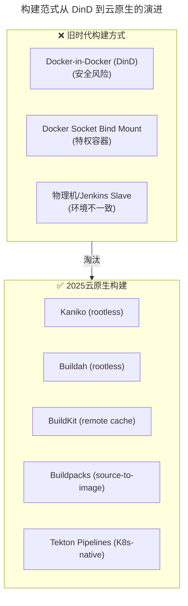
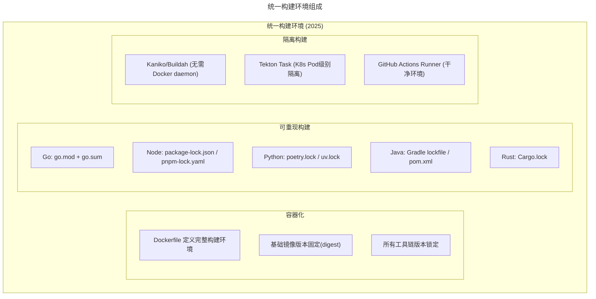
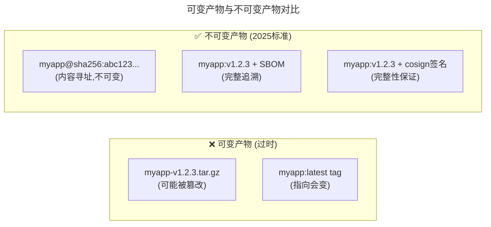
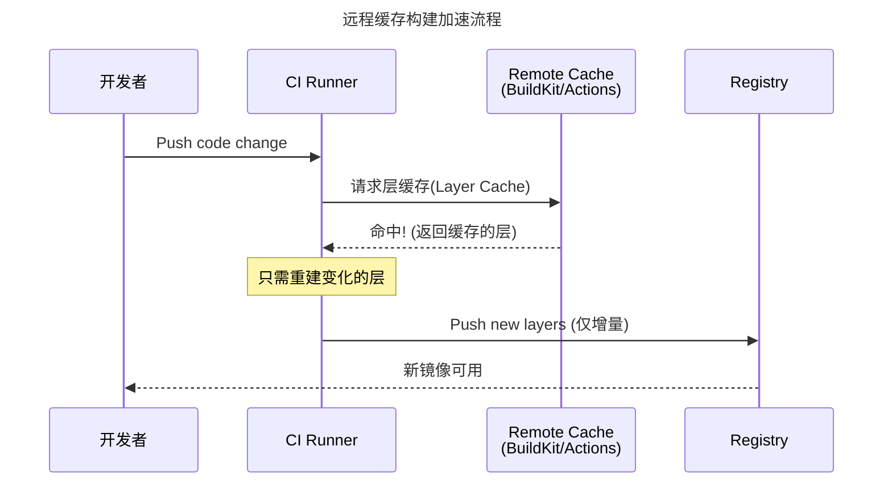
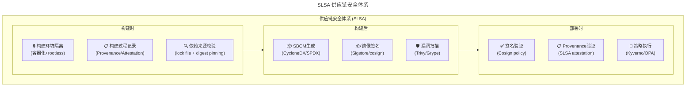

> 📅 **原文发布**：2018-2019 | **本次更新**：2025-06 | **更新等级**：🔴全面重写增强
> 📌 **v2 结构化升级**：2026-08 | **升级范围**：补齐 6 节标准骨架、Mermaid 图加标题、术语英文对照、参考资料融入进阶延展

# 18 | 持续交付流水线软件构建难吗？有哪些关键问题？

## 一、导言

上一篇文章介绍了持续交付流水线的模式和设计原则。本文来看流水线中 **软件构建（Software Build）** 这个环节的相关内容。

### 软件构建的核心目标

原版指出：**软件构建的目标就是将源码编译打包成一个或多个可供发布的软件包**。

在 2025 年，这个目标的内涵大大扩展了：

| 2019 年目标 | 2025 年目标 |
|-----------|-----------|
| 编译源码 → war/jar/tar 包 | 编译源码 → **不可变 OCI 容器镜像** |
| 打包完成即可 | 打包 + **SBOM 生成** + **镜像签名** + **漏洞扫描** |
| 能运行就行 | **可重现构建（Reproducible Builds）** + **供应链安全** |

### 原版的三个关键点（保留框架）

原版提出软件构建环节有三个关键点：
1. **统一构建环境**
2. **统一构建脚本**
3. **统一构建方式**

这三个点在 2025 年不仅仍然重要，而且实现方式发生了根本性变化。

---

## 二、核心方法论

### 构建技术演进时间线



### 从"Docker-in-Docker"到"云原生构建"的范式转变



---

## 三、关键流程

### 流程一：统一构建环境（重大重写）

#### 原版做法回顾

原版提到早期构建面临的问题：
- 不同开发者本地环境不同 → "我这里没问题啊"
- 测试环境和生产环境不同 → "测试通过了但上线就挂"

解决方案：**统一构建环境**，确保无论谁提交代码、在哪里构建，都能得到一致的结果。

#### 2025 年：容器化构建环境 + 版本锁定



##### 推荐方案：使用容器定义构建环境

```dockerfile
# .ci/Dockerfile.build -- 统一构建环境镜像
FROM golang:1.22-bookworm AS base

# 安装基础工具
RUN apt-get update && apt-get install -y \
    make \
    git \
    curl \
    jq \
    && rm -rf /var/lib/apt/lists/*

# 安全工具需通过官方渠道安装（apt仓库中无 trivy/cosign/syft），示例：
# RUN curl -sfL https://raw.githubusercontent.com/aquasecurity/trivy/main/contrib/install.sh | sh -s -- -b /usr/local/bin
# RUN curl -fsSL https://github.com/sigstore/cosign/releases/latest/download/cosign-linux-amd64 \
#     -o /usr/local/bin/cosign && chmod +x /usr/local/bin/cosign
# RUN curl -sSfL https://get.anchore.io/syft | install -s -- -b /usr/local/bin

# 预安装常用Go工具（golangci-lint v2 不再支持 go install，使用官方安装脚本）
RUN go install golang.org/x/tools/cmd/gofumpt@latest \
    && go install github.com/go-delve/delve/cmd/delve@latest \
    && curl -sSfL https://raw.githubusercontent.com/golangci/golangci-lint/master/install.sh \
    | sh -s -- -b $(go env GOPATH)/bin

WORKDIR /workspace
```

```yaml
# .github/workflows/build.yml 中引用
jobs:
  build:
    container:
      image: ghcr.io/org/build-env:latest  # 使用统一构建镜像
    steps:
      - uses: actions/checkout@v4
      - name: Build
        run: |
          go build -ldflags="-s -w -X main.version=${GITHUB_SHA}" -o app ./...
```

### 流程二：统一构建脚本（增强版）

#### 原版思路（保留）

原版提到：**构建脚本应该纳入版本控制管理**。这样做的好处：
1. 任何变更都有记录、有追溯
2. 方便多人协同维护
3. 可以针对不同的分支定制不同的构建逻辑

#### 2025 年最佳实践：Makefile + CI YAML 双驱动

```makefile
# Makefile -- 统一的构建入口
.PHONY: build test lint scan image sbom sign all

# 变量定义
VERSION ?= $(shell git describe --tags --always --dirty)
IMAGE ?= my-app
REGISTRY ?= ghcr.io/org
IMAGE_TAG ?= $(REGISTRY)/$(IMAGE):$(VERSION)

## build: 编译二进制
build:
	@echo "Building binary..."
	CGO_ENABLED=0 go build -ldflags="-s -w -X main.version=$(VERSION)" -o bin/app ./...

## test: 运行测试
test:
	@echo "Running tests..."
	go test -race -coverprofile=coverage.out -v ./...

## lint: 代码规范检查
lint:
	@echo "Running linter..."
	golangci-lint run ./...

## scan: 安全漏洞扫描
scan: build
	@echo "Scanning for vulnerabilities..."
	trivy fs --severity HIGH,CRITICAL --exit-code 1 .

## image: 构建容器镜像
image: build
	@echo "Building container image..."
	docker build -t $(IMAGE_TAG) .
	# 或使用 BuildKit 远程缓存
	# docker buildx build --cache-from type=registry,ref=$(REGISTRY)/$(IMAGE):cache --cache-to type=registry,ref=$(REGISTRY)/$(IMAGE):cache,mode=max -t $(IMAGE_TAG) .

## sbom: 生成软件物料清单
sbom: image
	@echo "Generating SBOM..."
	syft $(IMAGE_TAG) -o spdx-json > sbom-$(VERSION).spdx.json

## sign: 镜像签名
sign: sbom
	@echo "Signing image..."
	cosign sign --key cosign.key $(IMAGE_TAG)

## all: 完整构建流程
all: lint test scan image sbom sign
	@echo "✅ Build complete!"
```

**为什么同时用 Makefile 和 CI YAML？**

| 场景 | 使用 Makefile | 使用 CI YAML |
|------|-------------|------------|
| 本地开发调试 | ✅ `make build/test/lint` | ❌ 无法在本地运行 |
| CI 环境 | ✅ CI 调用 make 命令 | ✅ 定义触发条件、并行、缓存 |
| 跨平台兼容 | ✅ Make 处理差异 | ❌ YAML 语法固定 |
| 复杂编排 | ❌ Make 表达能力有限 | ✅ 条件执行、矩阵构建、reusable workflows |

### 流程三：统一构建方式（重大重写）

#### 挑战 1：构建产物的不可变性（Immutability）



**OCI 镜像 digest 是不可变的**：`sha256:abc123...` 这个值由镜像内容唯一确定，任何内容变化都会产生新的 digest。

#### 挑战 2：构建缓存与加速



#### 挑战 3：供应链安全（Supply Chain Security）



**SLSA（Supply-chain Levels for Software Artifacts）** 是 Google 发起的供应链安全标准框架：

| SLSA Level | 要求 | 对应措施 |
|------------|------|---------|
| **Level 1** | 文档化构建过程 | CI YAML in Git + 构建文档 |
| **Level 2** | 托管构建服务 + 签名 | GitHub Actions + cosign 签名 |
| **Level 3** | 非篡改构建 + hardened 平台 | SLSA Builder + provenance |
| **Level 4** | 双方审查 + hermetic builds | 两个独立构建结果比对 |

---

## 四、工具与实战

### 多语言构建参考

| 语言 | 推荐构建工具 | 锁定文件 | 容器化构建 | 特殊注意事项 |
|------|------------|---------|----------|-------------|
| **Go** | Go build / Mage | go.sum | ko / Docker / Buildpacks | 静态编译: CGO_ENABLED=0 |
| **Java** | Gradle (优先) / Maven | gradle.lockfile / pom.xml | Jib / Cloud Native Buildpacks | 优先Jib/Buildpacks，避免在容器内安装Docker daemon |
| **Node.js** | pnpm (优先) / npm | pnpm-lock.yaml / package-lock.json | pack / Buildpacks | node_modules 不要进镜像 |
| **Python** | Poetry / uv | poetry.lock / uv.lock | Buildpacks / Docker | 用 venv, 不用系统 Python |
| **Rust** | Cargo | Cargo.lock | cross-rs / Buildpacks | 交叉编译用 cross |
| **Ruby** | Bundler | Gemfile.lock | Cloud Native Buildpacks | Buildpacks 对 Ruby 支持很好 |

### 构建缓存配置示例（GitHub Actions）

```yaml
# 使用 GitHub Actions Cache 加速 Go 构建
- uses: actions/setup-go@v5
  with:
    go-version: '1.22'
    cache: true  # 自动缓存 $GOPATH/pkg/mod 和 ~/.cache/go-build

# 使用 actions/cache 缓存其他依赖
- name: Cache dependencies
  uses: actions/cache@v4
  with:
    path: |
      ~/.cache/trivy
      ~/.cosign
    key: tools-${{ runner.os }}-${{ hashFiles('Makefile') }}
```

### 工具选型矩阵

| 场景 | 推荐方案 | 替代方案 | 不推荐 |
|------|---------|---------|--------|
| 容器构建 | **BuildKit (Docker Buildx)** | Kaniko, Buildah, Buildpacks | docker build (legacy, 无缓存) |
| 无 Docker Daemon 构建 | **Kaniko** | Buildah, img | DinD (Docker-in-Docker) |
| 源码到镜像 | **Cloud Native Buildpacks** | Dockerfile (自维护) | 手动构建 |
| 构建缓存 | **BuildKit registry cache** | Actions cache, GCS/S3 cache | 无缓存 |
| SBOM 生成 | **Syft (Anchore)** | Trivy sbom, CycloneDX 工具 | 无 SBOM |
| 镜像签名 | **cosign (Sigstore)** | Notary (复杂) | 无签名 |
| 漏洞扫描 | **Trivy (全栈)** | Grype, Snyk Container | 无扫描 |
| 构建证明 | **SLSA Generator (GitHub)** | in-toto attestation | 无 provenance |
| 多阶段构建 | **Dockerfile multi-stage** | Buildpacks lifecycle | 单阶段构建(镜像过大) |

### 落地 Checklist

> **构建环境一致性**
>   - 是否使用容器(Dockerfile)定义统一的构建环境
>   - 基础镜像是否固定版本（推荐用 digest 而非 tag）
>   - 工具链版本是否锁定并在版本控制中管理
>   - 本地能否复现 CI 中的构建（`make build` 即可）
>
> **构建脚本管理**
>   - 构建脚本是否纳入版本控制（Makefile + CI YAML）
>   - 是否有统一的入口命令（如 `make all`）
>   - 构建参数是否通过变量外部化（非硬编码）
>   - 敏感信息是否不在构建脚本中出现
>
> **构建产物管理**
>   - 产物是否为不可变的（OCI 镜像用 digest 引用）
>   - 是否生成了 SBOM（CycloneDX/SPDX 格式）
>   - 镜像是否经过签名（cosign/Sigstore）
>   - 是否有产物清理策略（避免仓库膨胀）
>
> **构建效率**
>   - 是否配置了构建缓存（依赖缓存 + 层缓存）
>   - PR 构建与 main 构建是否使用相同的缓存策略
>   - 是否利用了并行构建
>   - 平均构建时间是否 < 5 分钟（小型项目）或 < 15 分钟（大型项目）
>
> **供应链安全**
>   - 所有依赖是否有锁定文件
>   - 是否进行了 SCA 扫描（Trivy/Snyk/Grype）
>   - 是否生成了 SLSA provenance
>   - 部署时是否验证签名和 attestation
>
> **可重现性**
>   - 相同源码 + 相同输入 → 是否一定得到相同输出
>   - 是否消除了时间戳、随机数等非确定性因素
>   - 是否有定期验证可重现性的机制

---

## 五、常见误区

```
❌ 陷阱1："本地能跑,CI挂了"
   症状：开发者本地构建成功，CI却失败
   根因：本地环境和CI环境不一致
   后果：浪费时间排查环境差异
   解法：统一容器化构建环境 + 本地可用同样的Dockerfile

❌ 陷阱2："镜像标签用latest"
   症状：docker pull myapp:latest 每次得到不同版本
   根因：latest是浮动标签,不指向固定版本
   后果：无法确定当前运行的到底是哪个版本
   解法：始终使用语义化版本 + digest双重引用

❌ 陷阱3："node_modules打进镜像"
   症状：镜像大小 > 1GB
   根因：Dockerfile直接COPY . . 再npm install
   后果：构建慢、镜像大、攻击面大
   解法：多阶段构建: stage1装依赖 → stage2只复制编译产物

❌ 陷阱4："构建产物无签名"
   症状：任何人都可以推送同名镜像替换你的
   根因：没有镜像签名和验证机制
   后果：供应链攻击风险极高
   解法：cosign签名 + 部署时验证 + 信任映射(cosign policy)

❌ 陷阱5:"忽视SBOM"
   症状：出了log4j漏洞不知道自己有没有受影响
   根因：没有生成和维护软件物料清单
   后果：漏洞响应极其被动
   解法：每次构建自动生成SBOM + 定期SCA扫描

❌ 陷阱6："构建时间越来越长"
   症状：半年前3分钟,现在15分钟
   根因：随着项目增长,没有优化构建策略
   后果：开发者体验下降,反馈循环变慢
   解法：分析构建图,找出瓶颈,增量构建,并行化
```

---

## 六、进阶延展

### 2025 年构建环节的核心认知升级

1. **从"能跑就行"到"供应链安全"** —— SBOM + 签名 + Provenance 成为标配
2. **从"手动构建"到"声明式+可重现"** —— Dockerfile + Makefile + Lock files
3. **从"单机构建"到"分布式缓存构建"** —— BuildKit remote cache 大幅提速
4. **从"信任镜像仓库"到"验证后才信任"** —— Sigstore/cosign 签名验证
5. **三大关键点的本质没变** —— 统一环境、统一脚本、统一方式，只是实现方式升级了

### 关键术语对照

| 中文 | 英文 |
|------|------|
| 软件构建 | Software Build |
| 统一构建环境 | Unified Build Environment |
| 统一构建脚本 | Unified Build Script |
| 统一构建方式 | Unified Build Method |
| 可重现构建 | Reproducible Builds |
| 不可变产物 | Immutable Artifact |
| 软件物料清单 | Software Bill of Materials (SBOM) |
| 供应链安全 | Supply Chain Security |
| 供应链级别 | Supply-chain Levels for Software Artifacts (SLSA) |
| 构建证明 | Build Provenance |
| 镜像签名 | Image Signing |
| 多阶段构建 | Multi-stage Build |
| 内容寻址 | Content Addressable |

### 参考资料融入

- 原版《运维体系管理》系列第 17 期：流水线模式（前置阅读）
- 原版《运维体系管理》系列第 19 期：质量保障（后续阅读）
- SLSA 框架官方文档：slsa.dev
- Sigstore/cosign 项目：镜像签名生态
- CycloneDX 与 SPDX：SBOM 标准对比
- CNCF Buildpacks 项目：源码到镜像的云原生方案
- Reproducible Builds 官方网站：reproducible-builds.org

### 后续预告

下一期文章将继续分享 **质量保障** 相关的内容。

读者在软件构建过程中遇到过什么问题？有什么经验教训？
