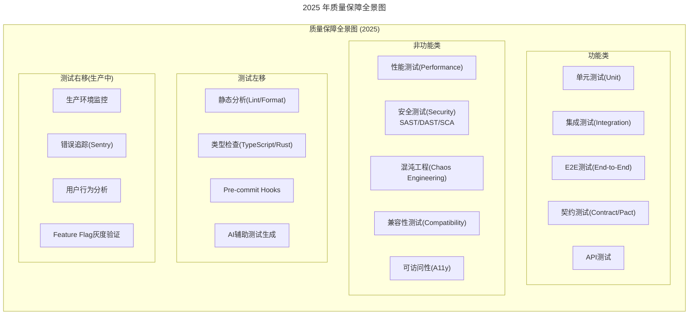
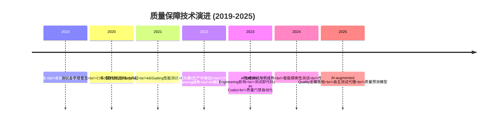
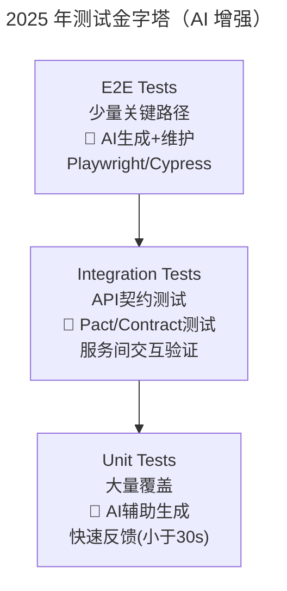
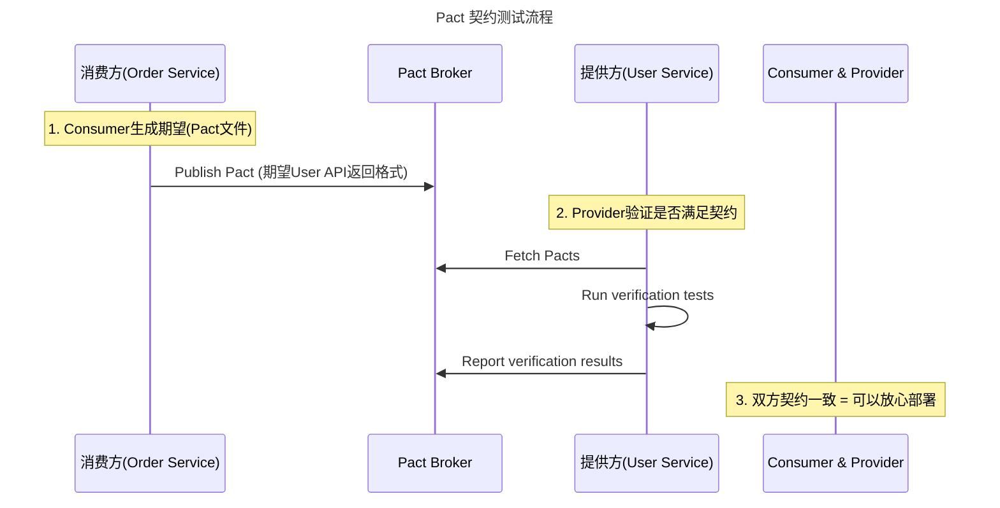
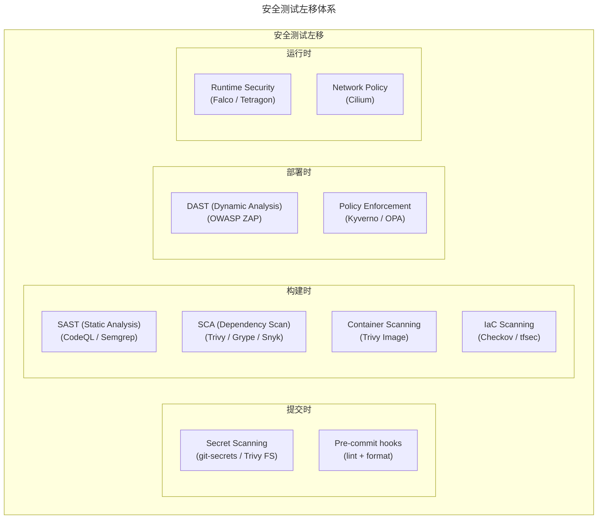
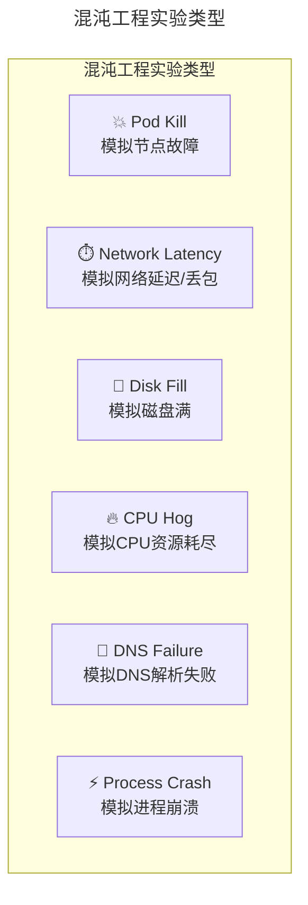
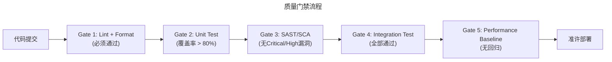

> 📅 **原文发布**：2018-2019 | **本次更新**：2025-06 | **更新等级**：🔴全面重写增强
> 📌 **v2 结构化升级**：2026-08 | **升级范围**：补齐 6 节标准骨架、Mermaid 图加标题、术语英文对照、参考资料融入进阶延展

# 19 | 持续交付中流水线构建完成后就大功告成了吗？别忘了质量保障

## 一、导言

上一篇文章介绍了持续交付流水线中软件构建环节的相关内容。那么，构建完成了是不是就意味着整个流水线的工作就结束了呢？

当然不是！**构建完成后，还有非常重要的一环要做——质量保障（Quality Assurance）**。

本文就来聊一聊持续交付中的 **质量保障** 问题。

### 质量保障的定义（扩展）

原版将质量保障分为两大类：
- **功能测试（Functional Testing）** —— 业务功能逻辑的正确性
- **非功能性测试（Non-Functional Testing）** —— 性能、安全、稳定性等

在 2025 年，质量保障的范围大幅扩展：



### 核心理念不变

原版特别强调：**质量保障不仅仅是 QA 团队的事情，而是整个研发团队共同的责任**。这一点在 2025 年更加重要——"质量内建"（Built-in Quality）已成为现代研发体系的基石。

---

## 二、核心方法论

### 质量保障技术演进时间线



### 测试金字塔（AI 增强版）



### 关键数字指标（2025 行业标准）

| 指标 | 低绩效 | 中等 | 高绩效 | 精英 |
|------|-------|------|--------|------|
| **单元测试覆盖率** | < 40% | 40~60% | 60~80% | **> 80%** |
| **单元测试执行时间** | > 5min | 2~5min | 1~2min | **< 1min** |
| **E2E 测试通过率** | < 70% | 70~85% | 85~95% | **> 95%** |
| **测试反馈周期** | > 30min | 10~30min | 5~10min | **< 5min** |
| **缺陷逃逸率** | > 20% | 10~20% | 5~10% | **< 5%** |

---

## 三、关键流程

### 流程一：功能测试分层执行

原版按测试粒度和范围，将功能测试分为三类：

| 测试类型 | 覆盖范围 | 执行者 | 2025 年执行方式 |
|---------|---------|--------|---------------|
| **单元测试** | 函数/方法/类级别 | 开发者 | CI 自动执行，覆盖率门槛 |
| **集成测试** | 模块/服务间交互 | 开发者+QA | CI 自动执行，容器化环境 |
| **系统/E2E 测试** | 完整业务流程 | QA | CI 定时/PR 触发，Playwright/Cypress |

#### 单元测试（2025 增强）

**各语言推荐框架：**

| 语言 | 推荐框架 | Mock 库 | 覆盖率工具 | AI 辅助 |
|------|---------|--------|-----------|--------|
| Go | testing + testify | mockery / gomock | -coverpkg | Cursor / Copilot |
| Python | pytest | unittest.mock | coverage.py | Copilot / CodiumAI |
| Node.js | Vitest (推荐) / Jest | msw | c8 / istanbul | Codex / Copilot |
| Java | JUnit 5 + AssertJ | Mockito | JaCoCo | Amazon Q Developer |
| Rust | #[test] (内置) | mockall | tarpaulin / cargo-llvm-cov | Rust Copilot |

#### 集成测试与契约测试（新增重点）

**契约测试（Contract Testing）** 在微服务架构中尤为重要：



### 流程二：非功能性测试

#### 性能测试（Performance Testing）

原版提到：**性能基准数据一定要提前明确下来，否则每次测试的数据都没有对比的意义**。

**2025 年性能测试方法论：**

| 类型 | 目标 | 工具 | 执行时机 |
|------|------|------|---------|
| **基准测试（Baseline）** | 建立性能基线 | k6 / Gatling | 每次发布前 |
| **回归测试（Regression）** | 对比前后版本性能变化 | k6 + 对比报告 | CI 自动执行 |
| **负载测试（Load）** | 验证预期负载下的表现 | k6 / Locust | 发布前 + 定期 |
| **压力测试（Stress）** | 找出系统极限和瓶颈 | k6 / Locust | 季度演练 |
| **浸泡测试（Soak）** | 验证长时间运行的稳定性 | k6 | 季度演练 |

#### 安全测试（Security Testing）

**2025 年安全测试必须"左移"到 CI 阶段：**



#### 混沌工程（Chaos Engineering）（新增重点）

原版未涉及此话题，但在 2025 年这已是质量保障的标准组成部分：



### 流程三：质量门禁（Quality Gates）

#### 什么是质量门禁？

**质量门禁是一组预定义的质量标准，只有达到这些标准后，代码才能进入下一个阶段**。



---

## 四、工具与实战

### k6 自动化性能回归测试示例

```javascript
// k6/performance-test.js
import { check } from 'k6';
import http from 'k6/http';

export const options = {
  stages: [
    { duration: '30s', target: 10 },   // 预热
    { duration: '1m', target: 50 },     // 正常负载
    { duration: '20s', target: 100 },   // 高负载
    { duration: '20s', target: 200 },   // 峰值负载
    { duration: '30s', target: 0 },     // 恢复
  ],
  thresholds: {
    http_req_duration: ['p(95)<500', 'p(99)<1000'],  // P95 < 500ms, P99 < 1s
    http_req_failed: ['rate<0.01'],                     // 错误率 < 1%
  },
};

const BASE_URL = __ENV.BASE_URL || 'https://staging.api.internal';

export default function () {
  const res = http.get(`${BASE_URL}/api/products`);
  check(res, {
    'status is 200': (r) => r.status === 200,
    'response time < 500ms': (r) => r.timings.duration < 500,
  });
}
```

### E2E 测试工具推荐（2025）

| 工具 | 特点 | 适用场景 |
|------|------|---------|
| **Playwright** | 微软出品，跨浏览器，支持并行 | Web 应用 E2E 首选 |
| **Cypress** | 开发者友好，实时预览 | 内部管理系统 |
| **k6** | Go 编写，高性能，支持负载测试 | API E2E + 性能结合 |
| **Robot Framework** | 关键字驱动，BDD 风格 | 非技术人员参与 |

### CI 安全扫描配置示例（GitHub Actions）

```yaml
# .github/workflows/security.yml
name: Security Scan
on:
  push:
    branches: [main]
  pull_request:

jobs:
  # SAST - 静态应用安全测试
  sast:
    runs-on: ubuntu-latest
    steps:
      - uses: actions/checkout@v4
      - name: Run CodeQL
        uses: github/codeql-action/init@v3
        with:
          languages: go
      - name: Perform Analysis
        uses: github/codeql-action/analyze@v3

  # SCA - 软件组件分析
  sca:
    runs-on: ubuntu-latest
    steps:
      - uses: actions/checkout@v4
      - name: Run Trivy vulnerability scanner
        uses: aquasecurity/trivy-action@master
        with:
          scan-type: 'fs'
          scan-ref: '.'
          severity: 'CRITICAL,HIGH'
          exit-code: '1'

  # Container Scanning
  container-scan:
    runs-on: ubuntu-latest
    steps:
      - name: Run Trivy image scanner
        uses: aquasecurity/trivy-action@master
        with:
          image-ref: 'ghcr.io/org/my-app:latest'  # 示例：替换为实际待扫描镜像
          severity: 'CRITICAL,HIGH'
          exit-code: '1'
```

### Chaos Mesh 实验示例

```yaml
# chaos-pod-kill.yaml
apiVersion: chaos-mesh.org/v1alpha1
kind: PodChaos
metadata:
  name: pod-kill-experiment
  namespace: production
spec:
  action: pod-kill
  mode: one       # 随机选择一个pod
  selector:
    labelSelectors:
      app: my-app
  scheduler:
    cron: '@every 10m'  # 每10分钟执行一次
```

### GitHub Branch Rules 作为质量门禁

```yaml
# .github/branch-protection-rules.yml (通过CLI设置)
# 或者直接在GitHub Settings > Branches中配置
Required status checks:
  - ci/lint-format     # Lint + Format检查
  - ci/unit-tests      # 单元测试
  - ci/security-scan   # 安全扫描
  - ci/integration     # 集成测试
  - ci/performance     # 性能回归检测

Required signatures:  # 需要CODEOWNER审批
  - CODEOWNERS file defines reviewers

Strict: true  # 必须在最新的commit上通过
```

### 工具选型矩阵

| 场景 | 推荐方案 | 替代方案 | 不推荐 |
|------|---------|---------|--------|
| 单元测试框架 | 语言原生 + testify/pytest/Vitest | 各语言传统框架 | 不写单元测试 |
| E2E 测试 | **Playwright** | Cypress, k6 | Selenium (老旧) |
| 契约测试 | **Pact** | Spring Cloud Contract | 无契约测试 |
| 性能测试 | **k6** | Gatling, Locust | ab/wk (太简单) |
| SAST | **CodeQL / Semgrep** | SonarQube, Fortify | 无静态分析 |
| SCA | **Trivy / Grype** | Snyk, Dependabot | 无依赖扫描 |
| DAST | **OWASP ZAP** | Burp Suite (商业) | 无动态扫描 |
| 混沌工程 | **Chaos Mesh** | Litmus, Gremlin | 不做故障演练 |
| 覆盖率 | **Codecov / Coveralls** | SonarQube | 无覆盖率追踪 |
| 质量门禁 | **GitHub Branch Rules** | Jenkins Groovy | 无门禁, 靠自觉 |

### 落地 Checklist

> **功能测试**
>   - 单元测试覆盖率是否达标（建议 > 70%）
>   - 单元测试执行时间是否合理（< 5 分钟）
>   - 是否有集成测试覆盖关键接口
>   - E2E 测试是否覆盖核心业务路径
>   - 微服务间是否有契约测试(Pact)
>
> **非功能测试**
>   - 是否建立了性能基线
>   - 每次发布前是否执行性能回归测试
>   - 是否有定期的压力/浸泡测试计划
>   - SAST/DAST/SCA 是否集成到 CI
>   - 是否有混沌工程演练计划
>
> **质量门禁**
>   - 是否定义了清晰的质量门禁规则
>   - 门禁是否在 CI 中自动执行（非人工判断）
>   - 门禁未通过时是否阻断合并/部署
>   - 门禁阈值是否基于历史数据设定（非拍脑袋）
>
> **测试数据管理**
>   - 测试数据是否自动生成（不依赖真实数据）
>   - 敏感数据是否有脱敏处理
>   - 测试环境数据是否有隔离（互不影响）
>
> **测试效率**
>   - 测试是否并行执行
>   - 是否利用了测试结果缓存
>   - 失败测试是否有清晰的错误报告
>   - Flaky test（不稳定测试）是否有治理机制
>
> **安全测试**
>   - 提交时是否自动检测 secret 泄露
>   - 构建时是否扫描依赖漏洞
>   - 镜像是否扫描基础镜像和应用层漏洞
>   - 高危漏洞是否能阻断发布

---

## 五、常见误区

```
❌ 陷阱1："测试全是UI自动化E2E"
   症状：所有测试都是E2E，运行一次要几小时
   根因：不理解测试金字塔，过度依赖E2E
   后果：反馈极慢，维护成本高，flaky test多
   解法：遵循测试金字塔，大量单元+少量集成+极少量E2E

❌ 陷阱2:"测试只走Happy Path"
   症状：正常流程都过了,异常场景一上线就挂
   根因：只测试了预期内的操作
   后果：边界条件和异常处理是bug的主要来源
   解法：表格驱动测试 + 属性-based testing + 模糊测试

❌ 陷阱3:"Flaky Test泛滥"
   症状：同样的测试时而通过时而失败
   根因：测试之间有依赖、异步竞态、硬编码等待
   后果：团队不再信任测试结果,最终关闭告警
   解法：隔离测试 + 合理的retry + flaky test自动标记+修复SLA

❌ 陷阱4:"性能测试只在上线前做一次"
   症状：上线后发现性能退化
   根因：没有建立持续的性能基线和回归检测
   后果：性能问题发现太晚,回滚成本高
   解法：每次CI都跑轻量级性能测试 + 定期完整压测

❌ 陷阱5:"安全测试是安全团队的事"
   症状：开发阶段不考虑安全问题
   根因：认为安全是别人的责任
   后果：漏洞在后期发现,修复成本指数级上升
   解法：安全左移,每个工程师都对安全负责

❌ 陷阱6:"混沌工程不敢在生产做"
   症状：混沌工程只在测试环境做
   根因：担心影响生产
   后果：测试环境的混沌结果不能代表生产
   解法：从小规模开始(杀一个Pod),逐步扩大范围,建立信心
```

---

## 六、进阶延展

### 2025 年质量保障的核心认知升级

1. **从"QA 负责测试"到"质量内建（Built-in Quality）"** —— 每个工程师都对质量负责
2. **从"测试金字塔"到"测试菱形+左右移动"** —— 不仅左移还要右移，生产中也在测
3. **从"功能测试"到"功能+非功能+安全一体化"** —— 性能、安全、混沌工程同等重要
4. **从"人工判断质量"到"自动化质量门禁"** —— 达标才能过，不达标就阻断
5. **从"手工测试"到"AI 辅助测试"** —— AI 生成用例、智能探索、自动维护

### 关键术语对照

| 中文 | 英文 |
|------|------|
| 质量保障 | Quality Assurance (QA) |
| 质量内建 | Built-in Quality |
| 功能测试 | Functional Testing |
| 非功能性测试 | Non-Functional Testing |
| 单元测试 | Unit Testing |
| 集成测试 | Integration Testing |
| 端到端测试 | End-to-End (E2E) Testing |
| 契约测试 | Contract Testing |
| 测试左移 | Shift-Left Testing |
| 测试右移 | Shift-Right Testing |
| 性能测试 | Performance Testing |
| 静态应用安全测试 | Static Application Security Testing (SAST) |
| 动态应用安全测试 | Dynamic Application Security Testing (DAST) |
| 软件组件分析 | Software Composition Analysis (SCA) |
| 混沌工程 | Chaos Engineering |
| 质量门禁 | Quality Gates |
| 不稳定测试 | Flaky Test |

### 参考资料融入

- 原版《运维体系管理》系列第 18 期：软件构建关键问题（前置阅读）
- 原版《运维体系管理》系列第 20 期：部署发布与持续交付哲学（后续阅读）
- Google Testing Blog：测试金字塔与现代测试策略
- Pact 官方文档：契约测试实践
- k6 官方文档：性能测试即代码
- CNCF Chaos Mesh 项目：云原生混沌工程
- OWASP DevSecOps Maturity Model：安全左移实践

### 后续预告

下一期文章将是本系列最后一篇，我们将探讨 **软件部署发布** 以及整个持续交付体系的最终收益和核心哲学。
