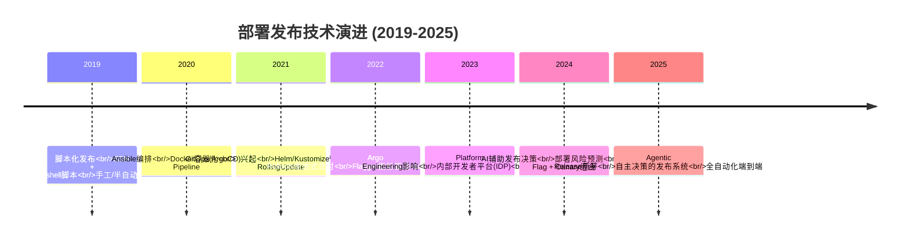
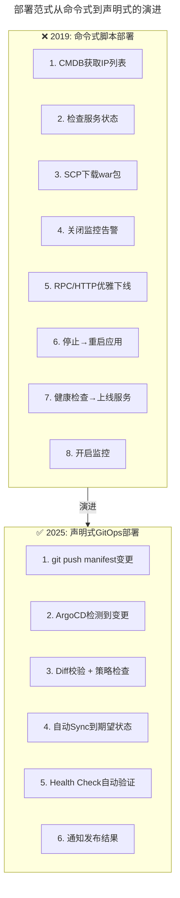
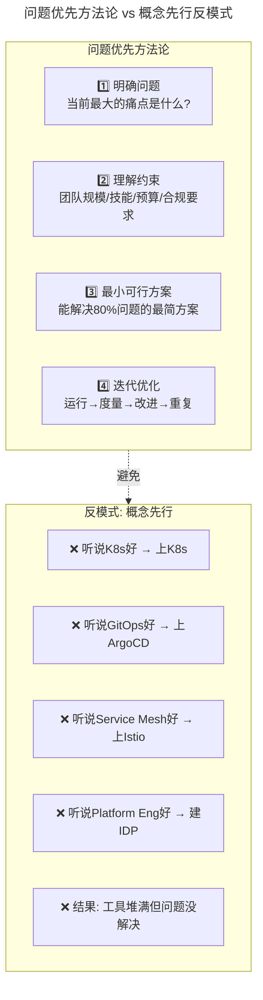
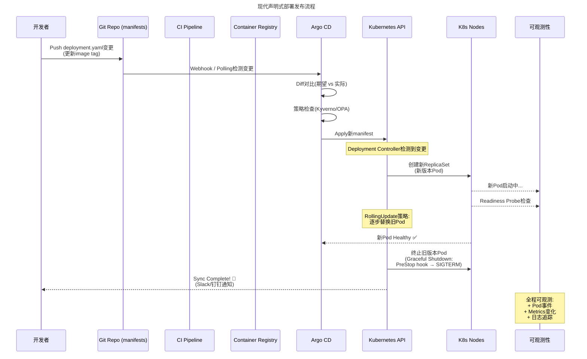
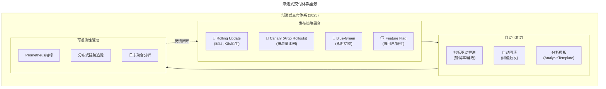
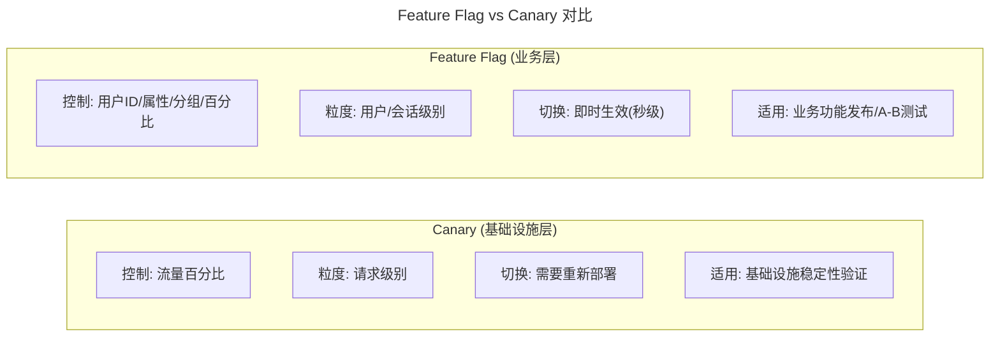
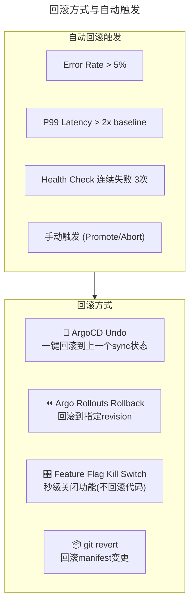
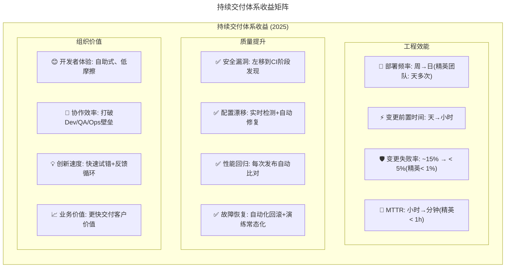

> 📅 **原文发布**：2018-2019 | **本次更新**：2025-06 | **更新等级**：🔴全面重写增强
> 📌 **v2 结构化升级**：2026-08 | **升级范围**：补齐 6 节标准骨架、Mermaid 图加标题、术语英文对照、参考资料融入进阶延展

# 20 | 做持续交付概念重要还是场景重要？看"笨办法"如何找到最佳方案

## 一、导言

上期文章中讲到，在经过严格的依赖规则校验和安全审计之后，构建出的软件包才可以部署发布。在开发环境、项目环境、集成测试环境以及预发环境下，还要进行各类的功能和非功能性测试，最后才能发布到正式的生产环境之上。

本文一起来看看整个流水线 **软件部署发布（Software Deployment & Release）** 的细节，以及持续交付体系的最终收益和核心哲学。

### 核心哲学（完全保留且更加重要）

原版最核心的观点——笔者认为也是整个专栏最有价值的观点之一：

> **如果直接从概念出发，反而容易迷失方向，忘记想要解决的问题，脱离所处的实际场景，把精力都放在了各种所谓的工具和技术上。这一点也恰恰与笔者所一直强调的，要从实际问题和业务场景出发来考虑解决方案相违背。**

> 业界所采取的手段，其实都是些 **笨办法**：即找到问题，分析问题，调研解决方案，讨论碰撞，然后慢慢摸索和实践，找出最合适的方式。

这个"笨办法"哲学在 2025 年不仅没有过时，反而因为技术选项爆炸式增长而变得更加重要。

---

## 二、核心方法论

### 部署发布技术演进



### 从"脚本化部署"到"声明式 GitOps"的范式转变



### "笨办法"哲学的现代化诠释



---

## 三、关键流程

### 流程一：单应用发布过程（2025 版）

原版详细描述了单机发布的 8 个步骤。在 K8s + GitOps 时代，这个过程被大幅简化：



### 关键改进点（对比原版的 8 步）

| 原版步骤 | 2025 年对应 | 变化 |
|---------|-----------|------|
| 1. CMDB 获取 IP 列表 | ❌ 不再需要 | K8s Deployment 自动管理 Pod 调度 |
| 2. 检查每台机器服务状态 | ❌ 不再需要 | K8s Controller 自动处理 |
| 3. 下载 war 包到指定目录 | ❌ 不再需要 | 镜像 Pull 由 Kubelet 自动完成 |
| 4. 关闭监控 | ❌ 大部分不需要 | Pod metadata 标注维护模式 |
| 5. 优雅下线（RPC/HTTP） | ⚠️ 仍需但已内置 | PreStop hook + Service Endpoint 自动摘除 |
| 6. 重启应用 | ⚠️ 概念仍在 | RollingUpdate 自动创建新 Pod |
| 7. 健康监测+上线 | ✅ 标准化了 | Readiness/Liveness Probe |
| 8. 开启监控 | ✅ 自动化 | Pod 创建即纳入监控 |

**核心认知升级**：从"操作步骤"变为"声明期望状态"。你不再告诉系统"怎么做"，而是描述"你要什么状态"，让控制器去实现它。

### 流程二：渐进式交付（Progressive Delivery）完整方案



### 流程三：Feature Flag 与 Canary 协同



**最佳实践：两者结合使用**

```
发布流程示例:

Step 1: Canary (Argo Rollouts)
├── 目的: 验证新版本技术稳定性（无崩溃、无异常）
├── 指标: Error Rate, P99 Latency, CPU/Memory
└── 判定: 通过 → 进入Step 2

Step 2: Feature Flag (Unleash/LaunchDarkly)
├── 目的: 控制业务功能暴露范围
├── 策略: 内部用户(100%) → 白名单用户(10%) → 全量(渐进)
├── 优势: 一键Kill Switch（出问题时秒级关闭）
└── 判定: 观察3-7天 → 确认稳定 → 清理Flag
```

### 流程四：回滚机制



**回滚 SLA 目标**：

| 场景 | 目标时间 | 说明 |
|------|---------|------|
| Feature Flag Kill Switch | **< 5 秒** | 最快，不影响已建立的连接 |
| ArgoCD Undo/Rollback | **< 30 秒** | 需要等待 Pod 重新创建 |
| git revert + sync | **< 2 分钟** | 需要完整 CI/CD 流程 |
| 数据库回滚 | **< 30 分钟** | 需要 DBA 配合，最慢 |

---

## 四、工具与实战

### RollingUpdate 策略配置示例

```yaml
# 默认的RollingUpdate策略 - 适合大多数场景
apiVersion: apps/v1
kind: Deployment
metadata:
  name: my-app
spec:
  replicas: 10
  strategy:
    type: RollingUpdate
    rollingUpdate:
      maxSurge: 25%       # 滚动过程中最多超出25%副本
      maxUnavailable: 25% # 滚动过程中最多不可用25%副本
  template:
    spec:
      containers:
      - name: my-app
        image: ghcr.io/org/myapp@sha256:new-version-digest
        lifecycle:
          preStop:
            exec:
              command: ["/bin/sh", "-c", "sleep 10"]   # 等待连接排空
        readinessProbe:
          httpGet:
            path: /health/ready
            port: 8080
          initialDelaySeconds: 5
          periodSeconds: 5
        livenessProbe:
          httpGet:
            path: /health/live
            port: 8080
          initialDelaySeconds: 15
          periodSeconds: 10
```

### Canary + Argo Rollouts 配置示例

```yaml
apiVersion: argoproj.io/v1alpha1
kind: Rollout
metadata:
  name: my-app
spec:
  replicas: 10
  strategy:
    canary:
      steps:
      # 阶段1: 暂停人工审核 (可选)
      - setWeight: 0
        pause: {}                # 无限期暂停，手动promote才继续

      # 阶段2: 5%流量，自动分析60秒
      - setWeight: 5
        pause: {duration: 60s}

      # 阶段3: 20%流量，自动分析120秒
      - setWeight: 20
        pause: {duration: 120s}

      # 阶段4: 50%流量，自动分析120秒
      - setWeight: 50
        pause: {duration: 120s}

      # 阶段5: 100%
      - setWeight: 100

      # 分析配置 - 自动判断是否健康
      analysis:
        templates:
        - templateName: success-rate
        args:
        - name: service-name
          value: my-app-svc
        startingStep: 1
      trafficRouting:
        istio:
          virtualService:
            name: my-app-vs
            routes:
            - primary
```

### ArgoCD 回滚操作

```bash
# 方式1: ArgoCD CLI undo (最简单)
argocd app rollback my-app-production

# 方式2: Argo Rollouts rollback
kubectl argo rollouts undo my-app -n production

# 方式3: Feature Flag紧急关闭 (最快!)
# 在Unleash/LaunchDarkly控制台一键关闭Flag
# 无需重新部署，立即对所有用户生效

# 方式4: git revert (最安全 - 可追溯)
git revert HEAD
git push origin main
# ArgoCD自动检测变更并执行回滚
```

### 2025 年的"笨办法"实战案例

**案例：一个小型团队（5 人）如何建设 CI/CD**

| 步骤 | "笨办法"做法 | "概念先行"做法（反例） |
|------|-------------|---------------------|
| **第 1 周** | GitHub Actions + 简单 build+push | 调研所有 CI 工具选型（浪费 2 周） |
| **第 2 周** | 手写一个 deployment.yaml，kubectl apply | 先学完 K8s 全部概念再动手 |
| **第 3 周** | 发现配置管理痛点 → 加 ConfigMap | 设计完整的配置管理系统 |
| **第 4 周** | 发现多环境混乱 → 加 Kustomize overlays | 引入 Helm + ChartMuseum + ... |
| **第 5 周** | 发现发布风险 → 加 ArgoCD + basic rollout | 研究 5 种 GitOps 工具对比 |
| **第 6 月** | 发现安全问题 → 加 Trivy 扫描 | 建立完整的安全合规体系 |
| **结果** | 6 周内可用，持续迭代 | 6 个月后还在调研 |

### 持续交付体系的收益（2025 版）



### DORA metrics 2024 版本

| 指标 | 定义 | 低绩效 | 中等 | 高绩效 | 精英 |
|------|------|--------|------|--------|------|
| **部署频率 (DF)** | 多久部署一次 | <每月 1 次 | 每月~每周 | 每周~每天 | **每天多次** |
| **变更前置时间 (LT)** | 代码提交到生产 | >6 个月 | 1 个月~1 周 | 1 周~1 天 | **< 1 天** |
| **变更失败率 (CFR)** | 发布导致故障的比例 | >30% | 16~30% | 1~15% | **0~15%** |
| **平均恢复时间 (MTTR)** | 故障恢复时长 | >1 周 | 1 天~1 周 | 1 小时~1 天 | **< 1 小时** |

> 💡 **Platform DORA（新增 2024）**：除了传统四指标外，还增加了平台工程相关指标——文档质量、平台采用率、开发者自助服务完成率等。

### 工具选型矩阵（最终版）

| 场景 | 推荐方案 | 替代方案 | 不推荐 |
|------|---------|---------|--------|
| **CI 引擎** | **GitHub Actions** | GitLab CI, Jenkins X | Jenkins freestyle |
| **CD/GitOps** | **Argo CD** | Flux CD | kubectl apply 脚本 |
| **渐进式交付** | **Argo Rollouts + Flagger** | Istio canary | 手动权重调整 |
| **Feature Flag** | **Unleash (开源)** | LaunchDarkly | 硬编码开关 |
| **容器构建** | **BuildKit + Buildpacks** | Kaniko, Jib | docker build legacy |
| **制品仓库** | **Harbor** | ECR, GCR | Docker Hub 生产 |
| **配置管理** | **Kustomize + Helm** | Jsonnet | 多份配置文件 |
| **密钥管理** | **External Secrets Operator** | Vault Injector | 明文 YAML |
| **安全扫描** | **Trivy (全栈)** | Snyk, Grype | 无扫描 |
| **性能测试** | **k6** | Gatling, JMeter | ab/wk 手动跑 |
| **混沌工程** | **Chaos Mesh** | Litmus | 不做演练 |
| **可观测性** | **OpenTelemetry + Prometheus + Grafana** | Datadog, New Relic | 无全链路观测 |
| **内部开发者平台** | **Backstage (Spotify)** | Port, Humanitec | 无平台层 |
| **DORA 度量** | **LinearB / Swarmia / 自建 dashboard** | DORA 官方指南 | 无度量 |

### 落地 Checklist（最终版）

> **发布流程**
>   - 是否实现了声明式部署（GitOps）
>   - 是否有渐进式交付策略（至少 RollingUpdate）
>   - 核心应用是否有 Canary 发布能力
>   - 是否使用了 Feature Flag 管理功能开关
>   - 回滚操作是否经过演练（目标：< 30 秒完成）
>
> **自动化程度**
>   - 从代码合并到 Staging 部署是否全自动
>   - 生产发布是否只需一键确认（或全自动）
>   - 回滚是否可以一键完成
>   - 发布结果是否有自动通知
>
> **安全保障**
>   - 发布前是否通过了所有安全门禁
>   - 镜像是否经过签名验证
>   - 是否有 SBOM 并可追溯依赖
>   - 紧急发布是否有简化流程（事后审计）
>
> **可观测性**
>   - 发布过程是否有完整的审计日志
>   - 发布后是否能实时看到关键指标变化
>   - 是否能在发布后 5 分钟内判断是否需要回滚
>   - 是否有发布效能 dashboard
>
> **度量与改进**
>   - 是否采集了 DORA 四大指标
>   - 当前处于哪个绩效等级
>   - 是否有定期的 Pipeline 效能复盘
>   - 改进措施是否有 Owner 和时间表
>
> **人员与文化**
>   - 团队是否理解持续交付的价值（不仅是工具）
>   - 是否建立了"质量内建"的文化
>   - 是否鼓励实验和快速试错
>   - 是否有知识分享和复盘机制

---

## 五、常见误区

```
❌ 陷阱1:"工具崇拜综合征"
   症状：每个新技术出来都要试试
   根因：FOMO (Fear Of Missing Out)
   后果：工具栈臃肿，没人能完全掌握
   解法："笨办法"——从实际问题出发，够用就好

❌ 陷阱2:"GitOps形式主义"
   症状：Git里有manifest，但还是kubectl apply
   根因：只做了形式上的GitOps，没有真正信任控制器
   解法：优化GitOps速度 + 禁止集群直接写入权限

❌ 陷阱3:"跳过灰度直接全量"
   症状："改动很小不用灰度"
   根因：过度自信 / 节省时间
   后果：小改动引发大事故
   解法：建立强制灰度策略，核心应用必须走

❌ 陷阱4:"回滚方案从未演练"
   症状："应该能回滚吧"（不确定）
   根因：平时不练，出事才慌
   后果：真正需要回滚时手忙脚乱
   解法：每季度至少一次回滚演练

❌ 陷阱5:"忽视DORA指标"
   症状：不知道自己的交付效能水平
   根因：没有建立度量体系
   后果：无法证明持续交付的价值
   解法：先采集4个基础指标，再逐步完善

❌ 陷阱6:"为了自动化而自动化"
   症状：自动化了所有步骤但整体没变快
   根因：没有识别真正的瓶颈
   后果：投入产出比低
   解法：先度量找瓶颈，再针对性优化
```

---

## 六、进阶延展

### 持续交付系列完整回顾

从第 12 课到第 20 课，我们完整走过了持续交付体系的每一个环节：
- **配置管理**（13-14 课）：从多份配置文件到 GitOps + External Secrets
- **多环境建设**（15-16 课）：从物理机隔离到 K8s Namespace + Preview Environment
- **流水线设计**（17 课）：从单一流水线到平台化的 Golden Paths
- **软件构建**（18 课）：从手工打包到 SBOM + 签名 + 供应链安全
- **质量保障**（19 课）：从 QA 手工测试到 AI 辅助的质量内建
- **部署发布**（20 课）：从脚本化发布到声明式 GitOps + 渐进式交付

### 核心哲学总结

> **思路上的转变远比技术上的提升更为重要。**

> **不要从概念出发，要从问题和场景出发。**

> **采用"笨办法"：找到问题 → 分析问题 → 调研方案 → 讨论碰撞 → 摸索实践 → 找到最适合的方式。**

> **然后，持续迭代，永不停歇。**

这就是持续交付的本质，也是运维体系建设的本质。

### 关键术语对照

| 中文 | 英文 |
|------|------|
| 软件部署发布 | Software Deployment & Release |
| 声明式部署 | Declarative Deployment |
| 渐进式交付 | Progressive Delivery |
| 滚动发布 | Rolling Update |
| 金丝雀部署 | Canary Deployment |
| 蓝绿部署 | Blue-Green Deployment |
| 功能开关 | Feature Flag |
| 紧急停止开关 | Kill Switch |
| 回滚 | Rollback |
| 部署频率 | Deployment Frequency (DF) |
| 变更前置时间 | Lead Time for Changes (LT) |
| 变更失败率 | Change Failure Rate (CFR) |
| 平均恢复时间 | Mean Time to Recovery (MTTR) |
| DORA 指标 | DORA Metrics |
| 内部开发者平台 | Internal Developer Platform (IDP) |
| 自主发布系统 | Agentic Release |

### 参考资料融入

- 原版《运维体系管理》系列第 19 期：质量保障（前置阅读）
- 原版《运维体系管理》系列第 21 期：稳定性保障（后续阅读）
- ArgoCD 官方文档：GitOps 持续交付
- Argo Rollouts：渐进式交付实践
- DORA Research：dora.dev
- Google SRE Book：发布工程与可靠性
- CNCF 平台工程白皮书：内部开发者平台建设

### 致谢

这是持续交付系列也是整个专栏的最后一篇文章。感谢读者的陪伴！祝你在运维体系建设的道路上，找到属于自己的最佳方案！🚀
