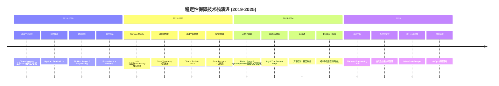
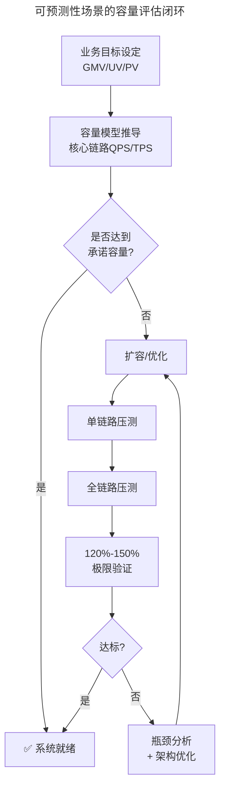
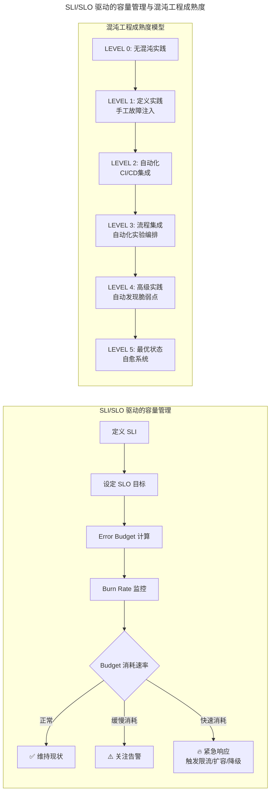
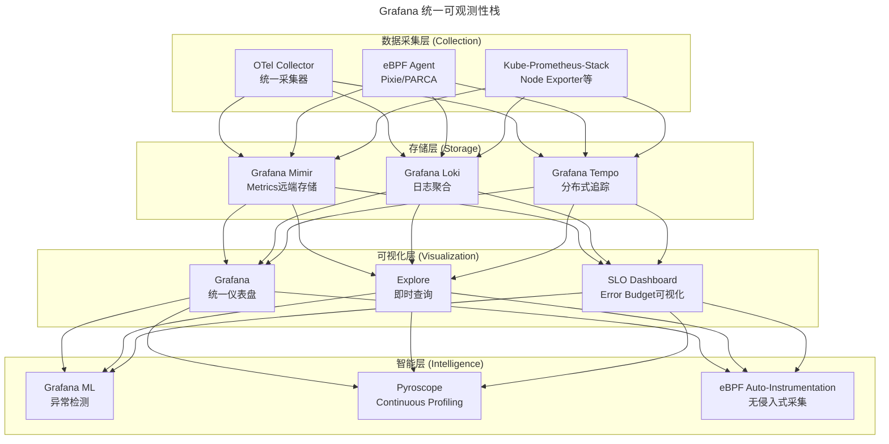
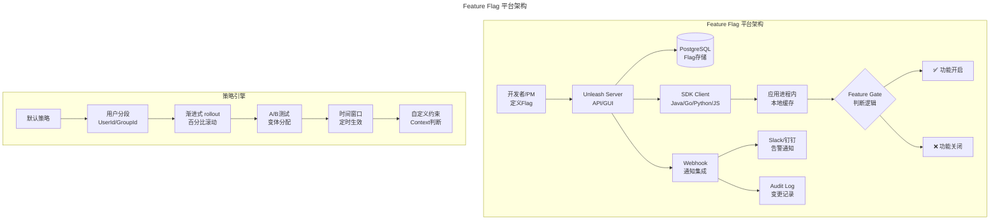

> 📅 **原文发布**：2018-2019 | **本次更新**：2025-06 | **更新等级**：🔴全面重写增强
> 📌 **v2 结构化升级**：2026-08 | **升级范围**：补齐 6 节标准骨架、Mermaid 图加标题、术语英文对照、参考资料融入进阶延展

# 21 | 极端业务场景下，我们应该如何做好稳定性保障？

## 一、导言

从本文开始，笔者分享对微服务、云原生架构以及 AI 时代下的稳定性保障的理解。

稳定性保障（Stability Assurance）需要一定的架构设计能力，又是现代分布式系统比较核心的部分。在 Google SRE Book、Netflix 的 Chaos Engineering 实践、以及各大云厂商的可靠性工程白皮书之后，业界已经形成了一套相对成熟的稳定性保障方法论。在这些内容的增强版中，我会结合 **2025 年的技术栈现状**，从运维和技术运营的角度，深入分享如何在极端业务场景下构建高可用的稳定性保障体系。

### 我们所面对的极端业务场景（2025 视角）

业界当前所面对的极端业务场景，笔者将其大致分为三类（相比 2019 年增加了第三类）：

1. **可预测性场景（周期性峰值）** —— 电商 618、双 11 等大促活动
2. **不可预测性场景（突发热点）** —— 微博热搜、短视频病毒式传播
3. **混合不确定性场景（2025 新增）** —— AI 推理负载波动、边缘计算潮汐

---

## 二、核心方法论

### 稳定性保障技术栈演进



### 核心要点

1. **业务理解是根基**：脱离业务谈稳定性都是空谈
2. **技术栈要统一且现代化**：从 Hystrix 迁移到 Resilience4j/Sentinel 2.x/Service Mesh
3. **SLO/Error Budget 是量化管理的基石**：让稳定性从"感觉良好"变成"数据说话"
4. **混沌工程要从"表演"走向"日常"**：目标是达到 LEVEL 3 以上的成熟度
5. **Platform Engineering 降低稳定性操作的门槛**：让开发者也能参与稳定性保障
6. **成本与稳定性不是对立面**：FinOps + SLO 协同优化才是正道

---

## 三、关键流程

### 流程一：可预测性场景（周期性峰值）

电商每年的大促，如 618、双 11、双 12，以及直播带货的各种专场活动等等。这类业务场景是可预测的，业务峰值和系统压力峰值会出现在某几个固定的时间点。



### 流程二：不可预测性场景（突发热点）

社交类业务具有明显的不可预测性特征。对于不可预测性的场景，由于不知道什么时候会出现突发热点事件，故无法像电商大促一样提前做好准备。社交类业务没法提前准备，就只能 **随时准备着** —— 这正是 **SLO/Error Budget 驱动的弹性伸缩** 和 **混沌工程常态化** 发挥作用的地方。

### 流程三：混合不确定性场景（2025 新增）

| 场景特征 | 典型案例 | 技术挑战 |
|---------|---------|---------|
| AI 推理负载波动 | ChatGPT/Claude 类服务的突发查询 | GPU 资源弹性、冷启动延迟 |
| 边缘计算潮汐 | 智能家居晚间集中上报 | 边缘节点容量规划 |
| 多模态内容处理 | 短视频实时特效渲染 | 计算密集型任务的突发性 |
| 实时协同编辑 | 在线文档多人同时编辑 | 状态同步、冲突解决 |

### 流程四：运维自动化 → Platform Engineering + GitOps

```yaml
# Kubernetes HPA + Karpenter 示例：自动弹性伸缩
apiVersion: autoscaling/v2
kind: HorizontalPodAutoscaler
metadata:
  name: core-api-hpa
spec:
  scaleTargetRef:
    apiVersion: apps/v1
    kind: Deployment
    name: core-api
  minReplicas: 3
  maxReplicas: 100
  metrics:
  - type: Resource
    resource:
      name: cpu
      target:
        type: Utilization
        averageUtilization: 70
  behavior:
    scaleUp:
      stabilizationWindowSeconds: 30
      policies:
      - type: Percent
        value: 100
        periodSeconds: 15
      selectPolicy: Max
    scaleDown:
      stabilizationWindowSeconds: 300
      policies:
      - type: Percent
        value: 10
        periodSeconds: 60
```

### 流程五：SLI/SLO 驱动 + 混沌工程常态化



**关键概念：Error Budget（错误预算）**

```
Error Budget = (1 - SLO%) × 测量周期内的总请求数

示例：
- SLO 目标：99.9% 可用性（月度）
- 月度总请求：10亿次
- Error Budget = (1 - 0.999) × 1,000,000,000 = 1,000,000 次失败请求

Burn Rate Alert 示例：
- 如果 1 小时内消耗了 5% 的 Error Budget → P2 告警
- 如果 1 小时内消耗了 20% 的 Error Budget → P1 告警（立即响应）
```

### 流程六：监控体系 → 统一可观测性栈



---

## 四、工具与实战

### 限流降级方案对比（Hystrix 停维后的完整替代）

| 特性 | Hystrix（已停维） | Resilience4j | Sentinel 2.x | Istio/Envoy |
|------|-------------------|--------------|-------------|-------------|
| **维护状态** | ❌ 2018 年停维 | ✅ 活跃维护 | ✅ 阿里持续迭代 | ✅ CNCF 孵化项目 |
| **编程模型** | 命令式/OOP | 函数式/轻量 | 规则引擎 | 声明式/配置驱动 |
| **限流算法** | 线程池/信号量隔离 | 令牌桶/滑动窗口 | 滑动窗口/漏桶 | 令牌桶/自适应 |
| **Service Mesh** | 不支持 | SDK 层面 | SDK 层面 | ✅ 原生支持 |
| **可观测性** | Hystrix Dashboard | Micrometer 集成 | 控制台+Dashboard | Prometheus 原生 |
| **适用场景** | 遗留系统 | Spring Boot 3.x | Java 微服务 | 云原生/K8s |

### 混沌工程工具对比（2025）

| 工具 | 类型 | 适用场景 | 特点 |
|------|------|----------|------|
| **Chaos Toolkit** | 开源 | 通用混沌工程 | 插件丰富，支持多云 |
| **LitmusChaos** | 开源 | Kubernetes 原生 | CRD 驱动，GitOps 友好 |
| **Gremlin** | 商业 SaaS | 企业级混沌工程 | 安全可控，仪表盘完善 |
| **Steadybit** | 商业 SaaS | 自动稳态假设验证 | 实验编排友好，Agent 架构 |
| **Chaos Mesh** | 开源 | 云原生混沌工程 | PingCAP 出品，中文友好 |

### Feature Flag 平台架构（以 Unleash 为例）



### 成本优化作为稳定性的一部分

```yaml
# Pod Disruption Budget + 优先级类的成本优化示例
apiVersion: policy/v1
kind: PodDisruptionBudget
metadata:
  name: non-critical-pdb
spec:
  minAvailable: 1
  selector:
    matchLabels:
      tier: non-critical
---
# PriorityClass: 定义服务优先级
apiVersion: scheduling.k8s.io/v1
kind: PriorityClass
metadata:
  name: critical-workload
value: 1000000
globalDefault: false
description: "核心交易链路，优先使用on-demand实例"
---
apiVersion: scheduling.k8s.io/v1
kind: PriorityClass
metadata:
  name: non-critical-workload
value: 1000
globalDefault: true
description: "非核心服务，可使用spot实例"
```

---

## 五、常见误区

```
❌ 陷阱1："脱离业务谈稳定性"
   症状：投入大量资源建设技术体系，但业务痛点没解决
   根因：技术团队不了解业务访问模型
   后果：技术自嗨，业务不买账
   解法：技术人员必须理解业务，所有技术措施对齐业务目标

❌ 陷阱2："Hystrix还在用且不迁移"
   症状：系统仍在使用已停维的Hystrix
   根因：迁移成本评估偏高，技术债务拖延
   后果：安全漏洞无人修复，JDK 17+兼容性差
   解法：制定迁移计划，逐步迁移到Resilience4j/Sentinel 2.x

❌ 陷阱3："混沌工程只是表演"
   症状：混沌演练只在做秀，不解决实际问题
   根因：没有真实的稳态假设和改进闭环
   后果：投入产出比低，团队失去信心
   解法：达到LEVEL 3以上，混沌即日常

❌ 陷阱4："SLO只设不查"
   症状：定义了SLO但不追踪Error Budget消耗
   根因：SLO只是文档，没有变成运营工具
   后果：稳定性仍是"感觉良好"，不是"数据说话"
   解法：Burn Rate告警 + Error Budget可视化

❌ 陷阱5："成本与稳定性对立"
   症状：认为高可用就一定昂贵
   根因：缺少FinOps思维，不会分层SLO
   后果：要么过度投入，要么稳定性不足
   解法：FinOps + SLO协同，核心99.99%/非核心99.9%

❌ 陷阱6："AI替代一切运维"
   症状：盲目相信AIOps能解决所有问题
   根因：对AI能力边界认识不清
   后果：过度依赖AI，忽视基础工程能力
   解法：AI是辅助，基础工程能力是根基
```

---

## 六、进阶延展

### 从"救火"到"免疫"的范式转变

| 阶段 | 时间段 | 核心思维 | 典型实践 |
|------|--------|----------|----------|
| **阶段 1：被动救火** | 2019 年前 | 出了问题再修 | 值班、告警、人工介入 |
| **阶段 2：主动预防** | 2019-2022 | 提前发现问题 | 压测、混沌工程、SLO |
| **阶段 3：自愈免疫** | 2023-2025 | 系统自我修复 | 自动化预案、AI 异常检测、自愈系统 |

### Platform SRE / Reliability Engineering 的新角色定义

| 角色 | 2019 年定义 | 2025 年定义 |
|------|-----------|-----------|
| **传统 SRE** | 运维+开发的混合角色，关注 SLA | 平台工程的建设者，关注 Developer Experience |
| **Platform SRE** | 不存在 | 构建和维护 Internal Developer Platform (IDP) |
| **Reliability Engineer** | SRE 的同义词 | 跨职能的可靠性专家，推动组织级 SLO 实践 |
| **Chaos Engineer** | Netflix 专属角色 | 常态化角色，负责混沌工程成熟度提升 |
| **FinOps Engineer** | 不存在 | 成本与稳定性的平衡者，SLO 驱动的资源优化 |

### 关键术语对照

| 中文 | 英文 |
|------|------|
| 稳定性保障 | Stability Assurance |
| 错误预算 | Error Budget |
| 服务等级指标 | Service Level Indicator (SLI) |
| 服务等级目标 | Service Level Objective (SLO) |
| 燃烧速率 | Burn Rate |
| 混沌工程 | Chaos Engineering |
| 弹性伸缩 | Elastic Scaling |
| 平台工程 | Platform Engineering |
| 内部开发者平台 | Internal Developer Platform (IDP) |
| 财务管理运营 | FinOps |
| 可观测性 | Observability |
| 自愈系统 | Self-healing System |
| 渐进式交付 | Progressive Delivery |

### 参考资料融入

- 原版《运维体系管理》系列第 20 期：持续交付最终哲学（前置阅读）
- 原版《运维体系管理》系列第 22 期：容量规划业务场景分析（后续阅读）
- Google SRE Book：https://sre.google/books/
- OpenTelemetry 官方文档：https://opentelemetry.io/
- Chaos Engineering Maturity Model：https://chaosengineering.io/
- Platform Engineering Topologies：https://platformengineering.org/
- Resilience4j 官方文档：Spring Boot 3.x 容错方案
- CNCF Chaos Mesh 项目：云原生混沌工程

### 读者互动

正如 Google SRE Book 所言："Reliability is a feature." 在 2025 年，这句话的含义更加深刻——**可靠性不仅是功能，更是产品竞争力的核心差异化要素**。读者在极端业务场景下遇到过哪些稳定性挑战？有什么好的解决方案或经验分享？

🎉 恭喜完成了「稳定性保障概述」模块的学习！接下来将进入「容量规划」模块，敬请期待！
