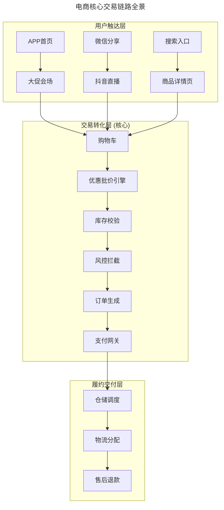
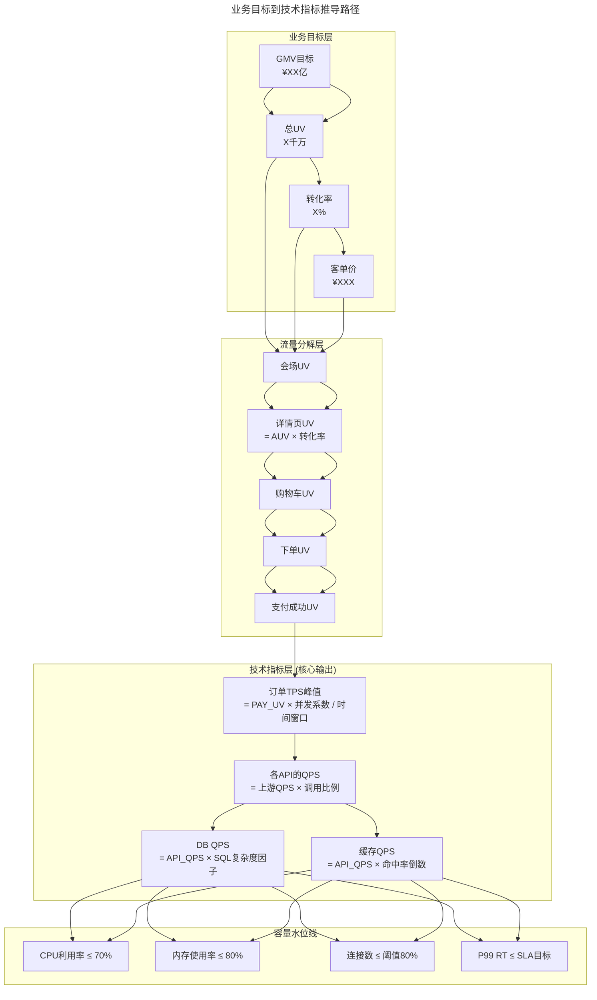
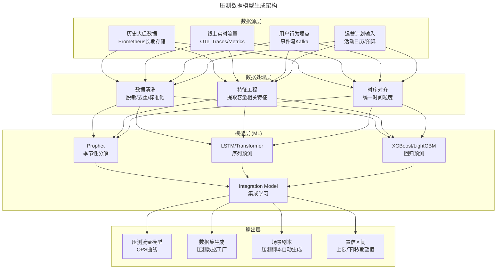
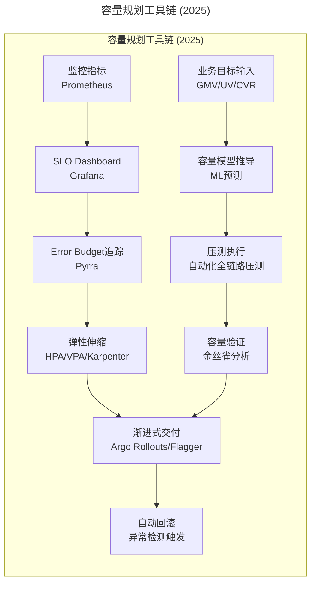

> 📅 **原文发布**：2018-2019 | **本次更新**：2025-06 | **更新等级**：🔴全面重写增强
> 📌 **v2 结构化升级**：2026-08 | **升级范围**：补齐 6 节标准骨架、Mermaid 图加标题、术语英文对照、参考资料融入进阶延展

# 22 | 稳定性实践：容量规划之业务场景分析

## 一、导言

上期文章从整体上介绍了极端业务场景下，如何做好稳定性保障工作。本文结合电商大促这个经典场景，深入探讨 **容量规划（Capacity Planning）** 这项核心工作——在 2025 年的技术栈下，这项工作已经从"手工+经验驱动"演进为"数据驱动+AI 辅助+自动化执行"的现代化体系。

### 容量规划的重新定义

稳定性保障的一个难点是业界要面对一个非常复杂的因素，那就是 **业务模型**，或者叫用户访问模型。由于它的不确定性，会衍生出很多不同的业务场景，而不同的场景，就会导致应对策略有所不同。

故，**容量规划，就是对复杂业务场景的分析，通过一定的技术手段（如压力测试、时序预测、自动化伸缩），来达到对资源合理扩容、有效规划的过程**。

---

## 二、核心方法论

### 2019 vs 2025：容量规划范式的根本转变

| 维度 | 2019 年做法 | 2025 年做法 |
|------|-----------|-----------|
| **驱动力** | 业务目标(GMV)→手工推导 | SLO 目标 + AI 预测 + 实时反馈 |
| **压测方式** | 手工构造流量模型 | 自动化全链路压测 + 生产环境引流 |
| **扩容手段** | 手工申请资源 → 运维审批 → 手动部署 | HPA/VPA/Karpenter 自动弹性伸缩 |
| **数据来源** | 往年大促数据 + BI 系统 | 时序数据库 + ML 模型 + 实时指标 |
| **决策周期** | 大促前 1-2 个月集中准备 | 持续性的日常容量管理 |
| **成本意识** | "能撑住就行"，成本次要 | FinOps+SLO 协同，成本效益最优 |
| **工具链** | 自研压测平台 + 数据工厂 | 云原生工具链 + 商业 SaaS |

### 核心链路识别

对于电商来说，核心链路就是交易链路。在 2025 年，随着直播带货、AI 推荐、多端融合等新业务形态的爆发式增长，这条链路变得更加复杂：



---

## 三、关键流程

### 流程一：从业务目标到技术指标的推导



### 流程二：分场景的容量矩阵

| 场景类型 | 时间窗口 | 流量特征 | 容量策略 | 预留缓冲 |
|---------|---------|----------|----------|----------|
| **预热期** | 大促前 7 天 | 缓慢爬升 | 正常 HPA | 20% |
| **零点峰值** | 00:00-00:10 | 瞬时洪峰 | 预扩容+限流兜底 | 150% |
| **白天平稳** | 08:00-20:00 | 波动较小 | VPA 自动调整 | 30% |
| **晚高峰** | 20:00-22:00 | 第二波峰 | HPA 快速响应 | 50% |
| **直播突发** | 不定时 | 不可预测 | Karpenter 紧急扩容 | 200% |
| **尾款支付** | 定时触发 | 集中涌入 | 预扩容+排队机制 | 120% |

### 流程三：容量因子的精细化建模

```
基础公式：
TPS_peak = (UV_total × CVR × Concurrent_Ratio) / Time_Window

2025增强版（考虑更多变量）：
TPS_peak = f(
    UV_total,                    # 总UV
    CVR_base,                    # 基础转化率
    Live_Stream_Factor,          # 直播带货系数（1.5~3.0）
    AI_Rec_Factor,               # AI推荐转化提升系数（1.1~1.3）
    Multi_Channel_Factor,        # 多端叠加系数（1.2~1.5）
    Flash_Sale_Factor,           # 秒杀瞬时系数（5.0~20.0）
    Geographic_Distribution,     # 地域分布（影响CDN/边缘节点）
    Payment_Method_Mix,          # 支付方式占比
    Coupon_Usage_Rate            # 优惠券使用率（增加计算复杂度）
)
```

---

## 四、工具与实战

### 构造压测的数据模型（2025 全面升级）



### 自动化容量管理（Kubernetes HPA + Karpenter）

```yaml
# 基于自定义指标的HPA（更精细的弹性伸缩）
apiVersion: autoscaling/v2
kind: HorizontalPodAutoscaler
metadata:
  name: order-service-hpa
spec:
  scaleTargetRef:
    apiVersion: apps/v1
    kind: Deployment
    name: order-service
  minReplicas: 5
  maxReplicas: 200
  metrics:
  - type: Resource
    resource:
      name: cpu
      target:
        type: Utilization
        averageUtilization: 65
  - type: Pods
    pods:
      metric:
        name: http_requests_per_second
      target:
        type: AverageValue
        averageValue: "1000"
  behavior:
    scaleUp:
      stabilizationWindowSeconds: 15
      policies:
      - type: Percent
        value: 200
        periodSeconds: 15
      selectPolicy: Max
    scaleDown:
      stabilizationWindowSeconds: 300
      policies:
      - type: Percent
        value: 10
        periodSeconds: 60
      selectPolicy: Min
```

### 渐进式交付中的稳定性保障

```yaml
# Argo Rollouts: 金丝雀发布 + 自动分析
apiVersion: argoproj.io/v1alpha1
kind: Rollout
metadata:
  name: order-service-rollout
spec:
  replicas: 10
  strategy:
    canary:
      steps:
      - setWeight: 10
      - pause: {duration: 5m}
      - setWeight: 30
      - pause: {duration: 5m}
      - setWeight: 50
      - pause: {duration: 5m}
      - setWeight: 100
      analysis:
        templates:
        - templateName: success-rate-analysis
        startingStep: 1
        args:
        - name: service-name
          value: order-service
```

### 工具链总结



---

## 五、常见误区

```
❌ 陷阱1："容量规划是大促前的一次性工作"
   症状：平时不做容量管理，大促前突击
   根因：缺少持续容量治理的思维
   后果：准备仓促，容易出问题
   解法：容量管理是持续性的日常运营

❌ 陷阱2："凭经验估算容量"
   症状：容量评估拍脑袋
   根因：没有数据驱动的方法论
   后果：容量不足或过度投入
   解法：数据驱动 + ML/AI 辅助预测

❌ 陷阱3："所有服务一个 SLO"
   症状：核心与非核心服务同样的可用性要求
   根因：缺少分层 SLO 设计
   后果：成本浪费或核心服务保障不足
   解法：核心 99.99%/非核心 99.9%/内部工具 99%

❌ 陷阱4："压测数据不真实"
   症状：压测结果与线上表现不一致
   根因：数据模型不够接近真实场景
   后果：压测形同虚设
   解法：生产引流 + 合成数据 + 真实场景建模

❌ 陷阱5："扩容只靠人工"
   症状：扩容需要审批和手工操作
   根因：没有建设自动弹性伸缩能力
   后果：响应慢，错过最佳扩容时机
   解法：HPA/VPA/Karpenter 自动弹性

❌ 陷阱6："成本与稳定性对立"
   症状：认为高可用一定昂贵
   根因：缺少 FinOps 思维
   后果：要么过度投入，要么稳定性不足
   解法：FinOps + SLO 协同优化
```

---

## 六、进阶延展

### 核心认知升级

| 旧思维 | 新思维（2025） |
|--------|---------------|
| 容量规划是大促前的一次性工作 | 容量管理是持续性的日常运营 |
| 经验驱动，拍脑袋估算 | 数据驱动，ML/AI 辅助预测 |
| 手工扩容，运维审批 | 自动弹性，开发者自助 |
| "能撑住就行"，不惜成本 | FinOps+SLO 协同，成本效益最优 |
| 单一维度（QPS） | 多维度（SLO/Error Budget/Burn Rate） |

### 组织能力要求

1. **技术与业务的深度融合**：技术人员必须理解业务模型，业务人员也要了解技术约束
2. **数据文化的建立**：所有决策都要有数据支撑，而不是凭感觉
3. **平台工程的支撑**：提供自助式的容量管理工具，降低操作门槛
4. **SLO 实践的落地**：从管理层到执行层都要理解和认同 Error Budget 的理念
5. **混沌工程的常态化**：定期验证容量规划的有效性，发现盲点

### 关键术语对照

| 中文 | 英文 |
|------|------|
| 容量规划 | Capacity Planning |
| 业务访问模型 | Business Access Model |
| 服务等级指标 | Service Level Indicator (SLI) |
| 服务等级目标 | Service Level Objective (SLO) |
| 错误预算 | Error Budget |
| 水平 Pod 自动伸缩 | Horizontal Pod Autoscaler (HPA) |
| 垂直 Pod 自动伸缩 | Vertical Pod Autoscaler (VPA) |
| 智能节点伸缩 | Karpenter |
| 渐进式交付 | Progressive Delivery |
| 金丝雀分析 | Canary Analysis |
| 财务管理运营 | FinOps |
| 数据工厂 | Data Factory |
| 合成数据生成 | Synthetic Data Generation (SDG) |

### 参考资料融入

- 原版《运维体系管理》系列第 21 期：极端业务场景稳定性保障（前置阅读）
- 原版《运维体系管理》系列第 23 期：压测系统建设（后续阅读）
- Google SRE Book：容量规划与 SLO 实践
- Prophet 时序预测：facebook.github.io/prophet/
- Kubernetes Autoscaling 文档：HPA/VPA/Karpenter
- Argo Rollouts：渐进式交付实践
- FinOps Foundation：云成本管理最佳实践

### 读者互动

在 2025 年，没有数据驱动的容量管理和自动化的弹性伸缩能力，任何系统都难以应对极端业务场景的考验。读者是否有过容量规划的经历？遇到过哪些问题？

🎉 恭喜完成了「容量规划-业务场景分析」模块的学习！接下来将进入「压测系统建设」模块，敬请期待！
