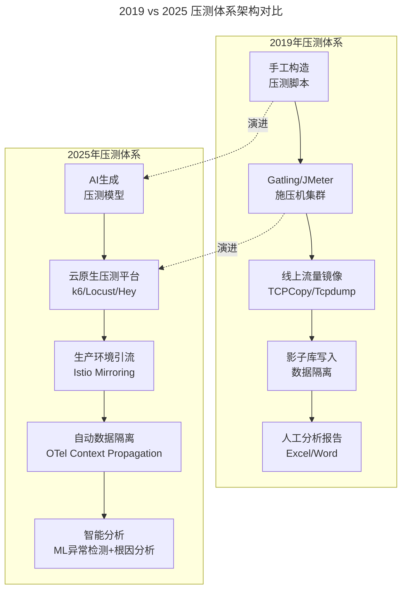
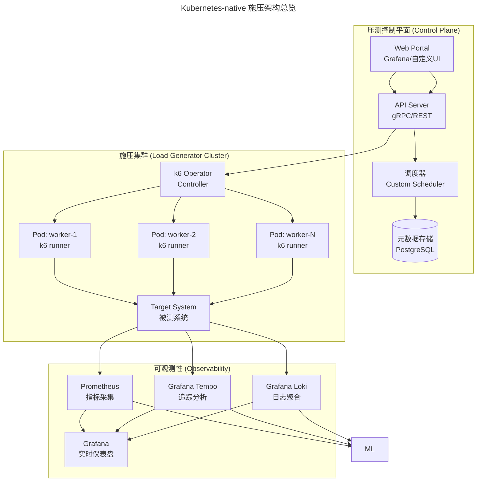
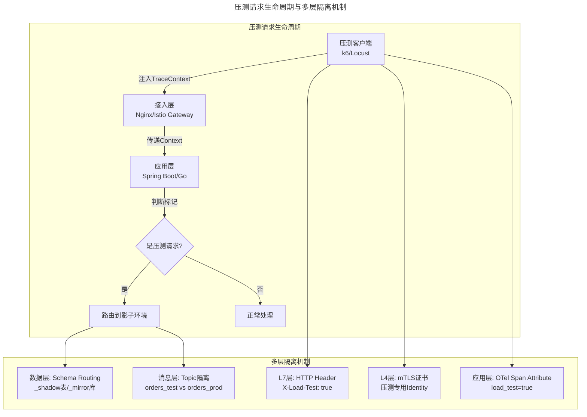
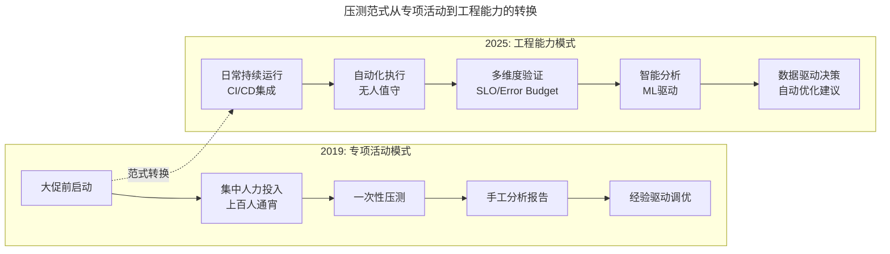

> 📅 **原文发布**：2018-2019 | **本次更新**：2025-06 | **更新等级**：🔴全面重写增强
> 📌 **v2 结构化升级**：2026-08 | **升级范围**：补齐 6 节标准骨架、Mermaid 图加标题、术语英文对照、参考资料融入进阶延展

# 23 | 稳定性实践：容量规划之压测系统建设

## 一、导言

容量规划离不开对业务场景的分析，分析出场景后，就要对这些场景进行模拟，也就是容量的 **压力测试（Load Testing / Stress Testing）**，用来真实地验证系统容量和性能是否可以满足极端业务场景下的要求。同时，在这个过程中还要对容量不断进行扩缩容调整，以及系统的性能优化。

本文分析压力测试系统的建设——在 2025 年，压测已经从"大促前的专项活动"演进为"融入 CI/CD 流水线的常态化实践"，技术栈也发生了翻天覆地的变化：k6（Go）替代 JMeter、Service Mesh 流量镜像替代 TCPCopy、OpenTelemetry Context 传播替代影子库手工维护、ML 异常检测替代人工看图。

---

## 二、核心方法论

### 压测系统架构的演进：2019 vs 2025 压测体系对比



**上图展示了压测体系从手工脚本+物理机集群向 AI 生成+云原生弹性集群的范式转换。** 2019 年的体系依赖人工经验与独立部署，而 2025 年的体系将压测能力内嵌于 CI/CD 与 GitOps 之中，实现"按需弹性、用完即销"的工程化模式。

| 维度 | 2019 年方案 | 2025 年方案 |
|------|-----------|-----------|
| **压测工具** | Gatling（Scala）/ JMeter / 自研 | k6 (Go) / Locust (Python) / Hey / Artillery |
| **脚本生成** | 手工编写/二次开发 | AI 辅助生成 + 录制回放 |
| **流量来源** | 线上镜像 / 数据工厂模拟 | 生产环境引流 + 合成数据 |
| **施压方式** | 物理机集群 | Kubernetes Pod 弹性集群 / Serverless |
| **数据隔离** | 影子库（_mirror 后缀） | OTel TraceContext 标记 + 自动路由 |
| **结果分析** | 人工看报表 | 自动化 SLO 验证 + ML 异常检测 |
| **集成方式** | 独立运行 | CI/CD Pipeline 内嵌 + GitOps |
| **成本模型** | 固定机器成本 | 按需弹性，用完即销 |

---

## 三、关键流程

### 流程一：压测粒度（2025 增强版）

压测粒度上，一般会遵照从小到大的规律来做。但在 2025 年，每个粒度都有了更精细的工具和方法论支撑。

#### 1. 单机单应用压力测试 → 容器级微基准测试（Micro-benchmark）

2025 年升级方案：使用 k6 进行容器级微基准测试，配合 OpenTelemetry 将指标导出到 Prometheus/Grafana。测试配置采用 stages 模型描述预热-加压-高峰-恢复四个阶段，并通过 thresholds 声明 SLO 验证条件（如 `p(95)<500ms`、`errors<1%`）。

```javascript
// k6-test.js
import http from 'k6/http';
import { check, sleep } from 'k6';
import { Trend, Rate, Counter } from 'k6/metrics';

// 自定义指标
const responseTime = new Trend('http_req_duration_custom');
const errorRate = new Rate('errors');
const requestCount = new Counter('requests');

// 测试配置
export const options = {
  stages: [
    { duration: '2m', target: 100 },   // 预热：逐步到100并发
    { duration: '5m', target: 500 },   // 加压：到500并发
    { duration: '10m', target: 1000 }, // 高峰：保持1000并发
    { duration: '3m', target: 100 },   // 恢复：降到100并发
  ],
  thresholds: {
    http_req_duration: ['p(95)<500', 'p(99)<1000'],  // P95<500ms, P99<1s
    errors: ['rate<0.01'],                             // 错误率<1%
    http_reqs: ['count>10000'],                        // 总请求数>1万
  },
};

// 输出集成：k6 指标可通过 --out 导出到 InfluxDB/Prometheus 远程写入，再由 Grafana 展示
export function setup() {
  return { testStartTime: new Date().toISOString() };
}

export default function (data) {
  const payload = JSON.stringify({
    user_id: `user_${__VU}`,
    product_id: `prod_${Math.floor(Math.random() * 1000)}`,
    quantity: Math.floor(Math.random() * 5) + 1,
    timestamp: Date.now(),
  });

  const params = {
    headers: {
      'Content-Type': 'application/json',
      'X-Load-Test': 'true',
      'X-Test-Scenario': 'order-create',
    },
  };

  const res = http.post('http://order-service:8080/api/v1/orders', payload, params);

  check(res, {
    'status is 201': (r) => r.status === 201,
    'response time < 500ms': (r) => r.timings.duration < 500,
    'has order_id': (r) => JSON.parse(r.body).order_id !== undefined,
  }) || errorRate.add(1);

  responseTime.add(res.timings.duration);
  requestCount.add(1);

  sleep(Math.random() * 2);  // 模拟用户思考时间
}
```

#### 2. 单链路压力测试 → 服务网格级别的链路压测

获取到单个应用集群的容量水位之后，就要开始对某些核心链路进行单独的压力测试。在 2025 年，可以利用 **Service Mesh** 的能力实现更精细的链路级压测：

```yaml
# Istio VirtualService: 流量镜像用于压测
apiVersion: networking.istio.io/v1beta1
kind: VirtualService
metadata:
  name: order-service-vs
  namespace: production
spec:
  hosts:
  - order-service
  http:
  - match:
    - headers:
        x-load-test:
          exact: "true"
    route:
    - destination:
        host: order-service-canary
        subset: v2
      weight: 100
  - route:
    - destination:
        host: order-service
        subset: v1
      weight: 90
    - destination:
        host: order-service
        subset: canary
      weight: 10
    mirror:
      host: order-service-canary
      subset: v2
    mirrorPercentage:
      value: 100.0
```

#### 3. 多链路/全链路压力测试 → 混沌工程驱动的全链路验证

当单链路的压测都达标之后，就会组织多链路或全链路压测。2025 年的做法是将其与 **混沌工程（Chaos Engineering）** 结合：

```yaml
# Chaos Toolkit: 全链路压测 + 故障注入组合实验
version: 1.0.0
title: Full-chain Load Test with Fault Injection
steady-state-hypothesis:
  title: System handles load under fault conditions
  probes:
  - name: order-success-rate
    type: probe
    tolerance: 200  # 校验Prometheus查询接口返回HTTP 200；对响应体中的指标值断言需配合自定义provider处理
    provider:
      type: http
      timeout: 5
      url: http://prometheus:9090/api/v1/query?query=sum(rate(http_requests_total{job="order-service",code!~"5.."}[1m]))/sum(rate(http_requests_total{job="order-service"}[1m]))
method:
- type: action
  name: start-load-test
  provider:
    type: process
    path: k6
    arguments:
    - run
    - --out
    - influxdb=http://influxdb:8086/k6data
    - tests/full-chain-test.js
```

### 流程二：压测接口及流量构造方式（2025 全面升级）

| 类型 | 2019 年 | 2025 年新增 |
|------|--------|-----------|
| HTTP/REST API | ✅ 主要类型 | gRPC、GraphQL、WebSocket |
| RPC 接口 | Dubbo/Thrift | gRPC streaming、Connect protocol |
| 消息队列 | Kafka/RabbitMQ | Pulsar、NATS JetStream、Redis Streams |
| 数据库直连 | JDBC/ORM | ORM + 连接池压测 |
| AI 推理接口 | 不存在 | LLM API、Embedding API、Vector Search |

### 流程三：施压方式（2025 云原生化）

上面介绍了容量压测的构造过程，接下来要对真实的线上系统施加压力流量了。在 2025 年，施压方式已经全面转向 Kubernetes-native 架构，实现了弹性伸缩和资源按需分配。



**上图展示了控制平面、施压集群与可观测性三层的解耦设计。** 控制平面负责调度与元数据管理；施压集群由 k6 Operator 管理 N 个弹性 Pod；可观测性层通过 Prometheus/Tempo/Loki 三件套实现指标、追踪、日志的统一采集，并供 ML 模块做智能分析。

### 流程四：数据读写（2025 增强版）

压测过程中，对于读的流量更好构造，因为读请求本身不会对线上数据造成任何变更；但是对于写流量就完全不一样了，如果处理不好，会对线上数据造成污染，对商家和用户造成资损。

2025 年的升级采用 **OTel Context Propagation + 多层隔离**：



**多层隔离机制覆盖 L7/L4/应用层/数据层/消息层五个维度，确保压测流量在任何一环都能被识别与路由，避免污染生产数据。**

---

## 四、工具与实战

### 压测结果分析与智能诊断（2025 新增）

| 维度 | 传统分析 | AI 驱动分析 |
|------|----------|-----------|
| **瓶颈定位** | 人工查看图表，凭经验判断 | 自动化瓶颈检测 + 热力图 |
| **异常发现** | 设置固定阈值告警 | 基于历史基线的异常检测 |
| **根因分析** | 人工排查调用链 | 因果推断图 + 自动归因 |
| **报告生成** | 手工编写 Word/PPT | 自动生成 Markdown/HTML 报告 |
| **优化建议** | 凭经验给出建议 | 基于模式的智能推荐 |

### 工具选型矩阵

| 场景 | 推荐工具 | 说明 |
|------|----------|------|
| 容器级微基准 | k6 + Prometheus | Go 实现，K8s 原生 |
| 分布式压测 | Locust + k6 Operator | Python 脚本，灵活 |
| 生产流量镜像 | Istio VirtualService mirror | 零代码侵入 |
| 数据隔离 | OTel Context + Schema Routing | 自动传播 |
| 全链路+故障注入 | Chaos Toolkit + Litmus | 混沌工程平台 |
| 结果分析 | Grafana + ML 异常检测 | 智能诊断 |

### 从"专项活动"到"工程能力"的范式转换



| 能力维度 | 2019 年 | 2025 年 | 关键技术 |
|---------|--------|--------|----------|
| **脚本生成** | 手工/半自动 | AI 全自动 | LLM + 历史数据分析 |
| **施压资源** | 固定物理机集群 | K8s 弹性 Pod | HPA/Karpenter |
| **流量真实性** | 数据工厂模拟 | 生产引流+合成 | Istio Mirroring + SDG |
| **数据安全** | 影子库手动维护 | OTel 自动传播 | Context Propagation |
| **结果分析** | 人工看图 | 智能诊断 | 异常检测 + 因果推断 |
| **集成方式** | 独立运行 | Pipeline 内嵌 | Argo Workflow + GitOps |

最后，这里再呼应一下笔者最开始提到的基础服务标准化工作。如果这个工作在前面做得扎实，它的优势在这里就会体现出来——**统一的可观测性标准（OpenTelemetry）、统一的中间件协议（gRPC/HTTP2）、统一的配置管理（GitOps），这些基础设施的标准化会让压测系统的建设和维护效率提升数倍**。

---

## 五、常见误区

### 误区一：把压测当成"大促前的临时任务"

将压测视为一次性的备战活动，导致每次都从零搭建脚本、临时协调资源，效率低且无法沉淀。正确做法是将压测能力内嵌到 CI/CD Pipeline，通过 Argo Workflow + GitOps 实现日常化的 SLO 验证。

### 误区二：忽视数据隔离导致污染生产

写流量直接打到生产库，导致订单、库存等业务数据被污染。2025 年必须采用 OTel Context Propagation 实现多层隔离（L7 Header / L4 mTLS / 应用 Span / 数据 Schema / 消息 Topic），任何一层的缺失都可能成为资损的源头。

### 误区三：只压单接口，忽略全链路+故障组合

单接口容量达标不代表系统稳定，真实大促是全链路并发+第三方故障叠加的场景。应使用 Chaos Toolkit 将全链路压测与故障注入组合，验证系统在故障条件下的稳态假设（Steady-State Hypothesis）。

### 误区四：结果分析依赖人工经验

仅凭 P95/P99 图表判断瓶颈，容易漏掉时序异常与根因。2025 年应引入基于历史基线的 ML 异常检测和因果推断图，自动生成 RCA 报告。

### 误区五：施压资源固定化

固定物理机集群导致成本高、弹性差。应采用 k6 Operator + HPA/Karpenter 实现 Pod 级弹性，按需创建、用完即销，配合 FinOps 优化成本。

---

## 六、进阶延展

### 演进趋势

1. **AI 驱动的压测模型生成**：LLM 根据历史 Trace 数据自动生成贴合真实业务的压测脚本与场景剧本
2. **eBPF 无侵入式采集**：Pixie/Parca 在内核层采集压测指标，零代码侵入
3. **合成数据生成（SDG）合规化**：符合 GDPR/PIPL 的合成数据替代脱敏导出
4. **统一可观测性栈**：Mimir/Loki/Tempo 三件套成为压测结果分析的事实标准
5. **AIOps 闭环**：压测结果自动反馈到容量规划与 HPA 阈值调优

### 扩展阅读

- k6 官方文档：https://k6.io/docs/
- Istio 流量镜像：https://istio.io/latest/docs/tasks/traffic-management/mirroring/
- OpenTelemetry Context Propagation：https://opentelemetry.io/docs/concepts/context-propagation/
- Chaos Toolkit：https://chaostoolkit.org/
- Grafana Tempo 文档：https://grafana.com/docs/tempo/

本文介绍了容量压测的技术方案，比较复杂，而且需要对相应场景进行针对性的建设。关于细节部分，读者还有什么问题？

🎉 恭喜完成了整个「稳定性保障」模块的学习！感谢读者的坚持阅读！
