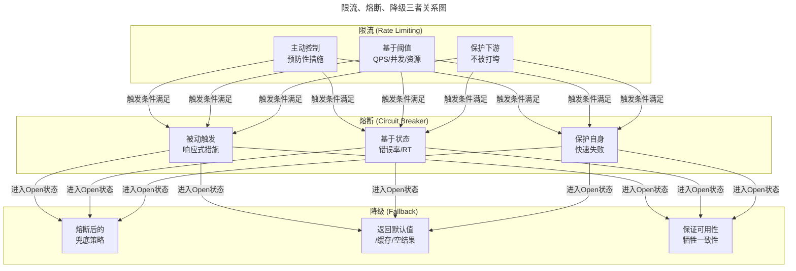
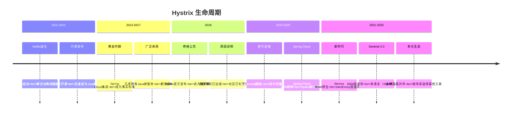
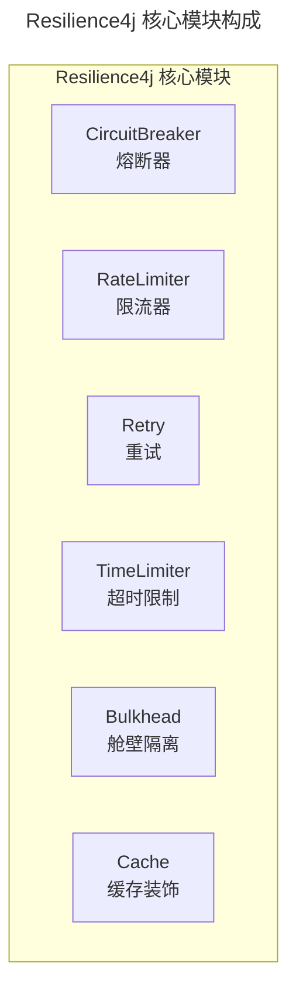
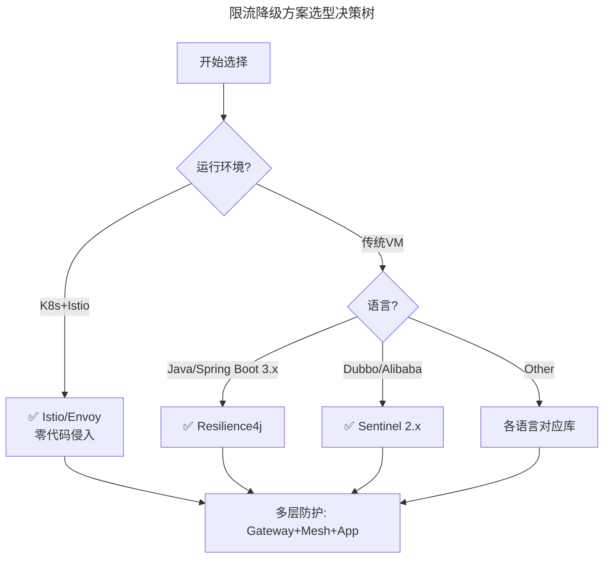

> 📅 **原文发布**：2018-2019 | **本次更新**：2025-06 | **更新等级**：🔴全面重写增强
> 📌 **v2 结构化升级**：2026-08 | **升级范围**：补齐 6 节标准骨架、Mermaid 图加标题、术语英文对照、参考资料融入进阶延展

# 24 | 稳定性实践：限流降级

## 一、导言

本章继续探讨稳定性实践。在现实情况下，当面对极端的业务场景时，瞬时的业务流量会带来大大超出系统真实容量的压力。

为应对上述问题，前文已述及容量规划方面的实践经验。然而，业界不会无限度地通过扩容资源来提升容量，因为无论从技术角度还是成本投入角度，该方案均不具备可行性。

基于此，业界通常采取的策略即 **限流降级（Rate Limiting & Fallback）**，以保障承诺容量下的系统稳定；同时配合业务层面的开关预案执行，峰值时刻仅保障核心业务功能，非核心功能则关闭。

本文将深入阐述限流降级的解决方案——特别聚焦于 2025 年的技术栈现状：Hystrix 已于 2018 年停止维护后，业界涌现出的完整替代方案生态。

---

## 二、核心方法论

### 什么是限流和降级（概念深化）

#### 限流（Rate Limiting）

其作用是根据某个应用或基础部件的某些核心指标（如 QPS 或并发线程数），决定是否将后续请求进行拦截。例如设定 1 秒 QPS 阈值为 200，若某一秒 QPS 为 210，则超出的 10 个请求将被拦截，直接返回约定的错误码或提示页面。

**2025 年扩展理解：**

| 限流维度 | 说明 | 典型场景 |
|---------|------|----------|
| **QPS 限制** | 单位时间内的请求数量 | API 网关层全局限流 |
| **并发数限制** | 同时处理的请求数 | 数据库连接池、线程池 |
| **连接数限制** | TCP/HTTP 并发连接数 | Nginx/Envoy 接入层 |
| **资源利用率限制** | CPU/Memory/网络带宽 | 容器级别资源保护 |
| **用户/租户级别** | 按用户 ID 或租户限流 | SaaS 多租户隔离 |
| **地域/IP 级别** | 按来源地区或 IP 限流 | 防爬虫/DDoS 防护 |
| **API 接口级别** | 细粒度到单个接口 | 核心接口优先保障 |

#### 降级（Degradation / Fallback）

其作用是通过判断某个应用或组件的服务状态是否正常，决定是否继续提供服务。以 RT 为例，一个应用的 RT 在 50ms 以内可正常提供服务，一旦超过 50ms，可能导致周边依赖的报错或超时。

**2025 年扩展理解：**

| 降级类型 | 触发条件 | 处理方式 | 示例 |
|---------|---------|----------|------|
| **自动熔断（Circuit Breaker）** | 错误率/慢调用率超过阈值 | 自动切断，进入半开探测 | Resilience4j CircuitBreaker |
| **手动降级（Feature Flag）** | 运维人员主动触发 | 关闭非核心功能 | Unleash/LaunchDarkly |
| **静态降级** | 系统启动时配置 | 直接返回默认值/缓存数据 | 配置中心预置 |
| **优雅降级** | 部分功能不可用 | 降级到简化版本 | 商品详情页去掉推荐模块 |
| **旁路降级** | 缓存故障等 | 跳过中间层直接访问 DB | Cache-Aside 模式失效时 |

### 限流、熔断、降级三者的关系



**一句话总结：**
- **限流**是"我不让你进来"（主动防御）
- **熔断**是"我暂时不服务了"（自我保护）
- **降级**是"我给你个差不多的结果"（兜底方案）

### Hystrix 停维事件及其影响

在深入替代方案之前，必须先了解这个关键的历史节点：



**Hystrix 被淘汰的核心原因：** 基于线程池的隔离开销大、基于已停维的 RxJava 1 与现代 Reactive 栈（Reactor）不适配、监控依赖 Dashboard 运维复杂、缺乏动态配置、2018 年后无新功能、对 JDK 17+ 支持差。

---

## 三、关键流程

### 流程一：Hystrix 停维后的完整替代方案对比

这是本篇的核心内容。以下从多个维度全面对比当前主流的限流降级解决方案。

| 特性维度 | Hystrix（已停维） | Resilience4j | Sentinel 2.x | Istio/Envoy (Service Mesh) |
|---------|-------------------|--------------|-------------|---------------------------|
| **维护状态** | ❌ 2018 停维 | ✅ 活跃（v2.1+） | ✅ 阿里持续迭代 | ✅ CNCF 毕业项目 |
| **首次发布** | 2012 | 2017 | 2018 | 2016（Envoy）/ 2017（Istio） |
| **编程语言** | Java | Java (JVM) | Java (JVM) | Go（istiod）/ C++（Envoy） |
| **编程范式** | 命令式/OOP | 函数式/轻量 | 规则引擎驱动 | 声明式/YAML 配置 |
| **核心模块** | 熔断+隔离+降级+限流 | 熔断+限流+重试+舱壁 | 流控+熔断+热点+系统 | RBAC+限流+熔断+重试 |
| **隔离机制** | 线程池/信号量 | 信号量（轻量） | 信号量+并发数 | Sidecar 进程隔离 |
| **限流算法** | 无独立限流器（线程池/信号量隔离 + 滑动窗口统计） | 令牌桶/滑动窗口 | 滑动窗口/漏桶/令牌桶 | 令牌桶/自适应 |
| **熔断策略** | 三态（Closed/Open/Half-Open） | 三态+自定义半开逻辑 | 多维规则+自定义 | 外部指标驱动 |
| **Service Mesh 支持** | ❌ 不支持 | SDK 层面 | SDK 层面 | ✅ 原生支持 |
| **可观测性集成** | Hystrix Stream/Dashboard | Micrometer/Prometheus | 控制台+Dashboard | Prometheus/Grafana 原生 |
| **性能开销** | 较重（线程池上下文切换） | 轻量（信号量） | 中等（规则引擎） | 中等（Sidecar 代理） |
| **动态配置** | ❌ 不支持 | ✅ 支持 | ✅ 强大 | ✅ xDS 动态下发 |
| **热更新** | ❌ 需要重启 | ✅ Spring Cloud 配置刷新/ConfigRegistry | ✅ Nacos/Apollo 推送 | ✅ Istio Config Push |
| **控制台** | Hystrix Dashboard | 需自建或第三方 | Sentinel Dashboard | Kiali/Grafana |
| **适用框架** | Spring Boot 1.x | Spring Boot 2.x/3.x | Dubbo/Spring Cloud | Kubernetes/Istio |
| **社区活跃度** | 低（归档） | 高（GitHub 9k+ stars） | 极高（阿里背书） | 极高（CNCF 顶级项目） |
| **学习曲线** | 低（Spring Cloud 集成好） | 中等（函数式编程） | 中低（文档完善） | 中高（K8s/Istio 知识） |
| **典型使用场景** | 遗留系统迁移 | Spring Boot 3.x 新项目 | Java 微服务（国内首选） | 云原生/Kubernetes 环境 |

### 流程二：Resilience4j —— Spring Boot 3.x 的首选

**定位**：轻量级的、函数式编程风格的容错库，专为 Java 8+（注：当前 2.x 主线已要求 Java 17+）和反应式编程设计。



### 流程三：Sentinel 2.x 与 Istio/Envoy 方案

- **Sentinel 2.x**：阿里巴巴开源的流量控制、熔断降级组件，面向分布式服务架构的流量控制卫兵，国内 Java 微服务的首选。
- **Istio/Envoy**：基础设施层面的限流降级，对应用完全透明，无需修改代码，是 Service Mesh 原生方案。

---

## 四、工具与实战

### 第一类：接入层限流（Nginx）

```11-Nginx基础概述
# 11-Nginx基础概述.conf: 2025年限流配置
limit_req_zone $binary_remote_addr zone=addr_limit:100m rate=100r/s;

server {
    listen 80;
    server_name api.example.com;
    limit_req zone=addr_limit burst=20 nodelay;
    limit_req_status 429;

    location /api/v1/orders {
        limit_req zone=addr_limit burst=10 nodelay;
        error_page 429 = @rate_limited;
        proxy_pass http://order_service_upstream;
    }

    location @rate_limited {
        default_type application/json;
        return 429 '{"code": 429, "message": "Too Many Requests"}';
    }
}
```

### 第二类：应用限流（SDK 层面）

此类限流策略与 API 路由网关模式的限流相似，依赖配置中心管理。Resilience4j 与 Sentinel 2.x 均提供 SDK 级别的限流、熔断、舱壁隔离能力。

### 第三类：基础服务限流

针对数据库、缓存、消息队列等基础服务组件的限流。Istio/Envoy 通过 Sidecar 代理可在 Service Mesh 层面统一实施，无需修改应用代码。

### 决策树：如何选择合适的限流降级方案？



### 最佳实践清单

| 编号 | 实践项 | 说明 |
|------|--------|------|
| ✅ 1 | **多层限流** | Gateway → Mesh → App → DB |
| ✅ 2 | **优雅降级** | 返回友好提示而非报错 |
| ✅ 3 | **动态配置** | 配置中心热更新 |
| ✅ 4 | **可观测性** | Metrics/Logs/Traces 全覆盖 |
| ✅ 5 | **定期演练** | 验证策略有效性 |

---

## 五、常见误区

### 误区一：仍在使用 Hystrix

Hystrix 自 2018 年停维后存在安全漏洞无法及时修复、对 JDK 17+ 支持差、与 Spring WebFlux 不兼容等问题。强烈建议制定迁移计划，迁移到 Resilience4j（Spring Boot 3.x）或 Sentinel 2.x（国内 Java 微服务）。

### 误区二：仅做单层限流

只在接入层或只应用层做限流，导致任一层失效即出现雪崩。应建立 Gateway → Mesh → App → DB 的多层防护体系。

### 误区三：限流策略静态化、无法热更新

策略修改需要重启应用，无法应对突发流量变化。应采用配置中心（Nacos/Apollo）或 Istio xDS 实现热更新。

### 误区四：多语言架构缺乏统一限流

Go/Python/Rust 服务各自为政，缺乏统一限流策略。应采用 Service Mesh（Istio/Envoy）统一层、gRPC Interceptor 或 OpenTelemetry 扩展实现跨语言统一。

### 误区五：阈值固定不变

限流阈值一成不变，无法适应业务变化。2025 年可基于机器学习（强化学习）根据实时反馈自动调整限流参数。

### 误区六：Serverless/FaaS 场景被忽视

无服务器架构下的限流缺乏成熟方案。应结合云厂商 API Gateway 限流 + 冷启动延迟评估进行综合设计。

---

## 六、进阶延展

### 演进趋势

1. **AIOps 驱动阈值自调优**：基于强化学习根据实时反馈自动调整限流参数
2. **Service Mesh 原生限流**：Istio/Envoy 成为云原生环境下的统一限流层
3. **eBPF 级别限流**：内核层无侵入式限流，性能开销极低
4. **OpenFeature 标准化**：Feature Flag 与限流降级的统一规范
5. **Serverless 限流模式**：基于事件驱动的弹性限流策略

### 扩展阅读

- Resilience4j 官方文档：https://resilience4j.readme.io/
- Sentinel 项目：https://sentinelguard.io/
- Istio 流量管理：https://istio.io/latest/docs/concepts/traffic-management/
- Envoy 限流过滤器：https://www.envoyproxy.io/docs/envoy/latest/configuration/http/http_filters/rate_limit_filter
- OpenFeature 规范：https://openfeature.dev/

> **重要提醒：** 如果还在使用 Hystrix，强烈建议制定迁移计划。Resilience4j（Spring Boot 3.x）和 Sentinel 2.x（国内 Java 微服务）是最成熟的替代选择，Kubernetes + Istio 环境下 Envoy 原生能力是最优雅的长期方案。
