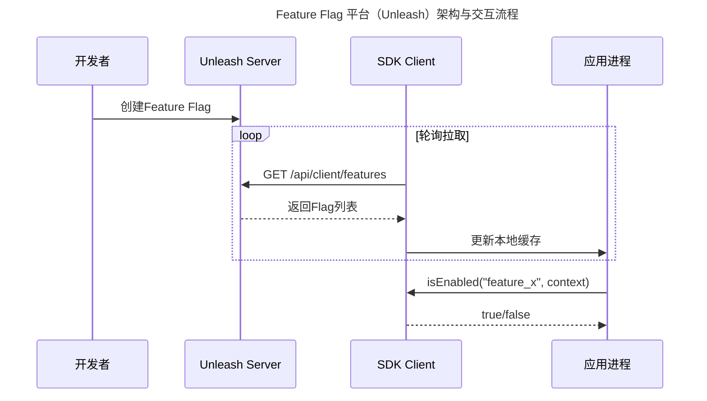

> 📅 **原文发布**：2018-2019 | **本次更新**：2025-06 | **更新等级**：🔴全面重写增强
> 📌 **v2 结构化升级**：2026-08 | **升级范围**：补齐 6 节标准骨架、Mermaid 图加标题、术语英文对照、参考资料融入进阶延展

# 25 | 稳定性实践：开关和预案

## 一、导言

在稳定性保障中，限流降级针对服务接口层面。此外还存在业务维度，本文从业务降级的维度阐述 **开关和预案（Feature Flags & Runbooks）**。

在 2025 年，这个领域已从简单的"Key-Value 配置"演进为成熟的 **Feature Flag 平台 + GitOps 化预案管理体系**。Feature Flag 不再仅是 Boolean 开关，而是包含灰度百分比、多值变量、定向分组、定时生效等多类型能力；预案也从控制台手工执行演进为 SLO 驱动的自动触发与 GitOps 声明式管理。

---

## 二、核心方法论

### 如何理解开关和预案

#### 开关：从 Boolean 到 Feature Flag 的进化

| Flag 类型 | 说明 | 典型场景 |
|---------|------|----------|
| **Boolean Flag** | 简单开/关 | 关闭非核心功能 |
| **Percentage Rollout** | 按百分比灰度 | 新功能逐步放量 |
| **Multivariate Flag** | 多值变量（A/B 测试） | 不同用户不同 UI |
| **Targeted Flag** | 特定用户群组 | VIP 用户体验新功能 |
| **Time-based Flag** | 定时生效 | 大促零点自动关闭评论 |

#### Feature Flag 平台架构（Unleash 示例）



**上图展示了开发者创建 Flag、SDK 轮询拉取、应用本地缓存与判断的完整交互流程。** SDK 通过轮询保持本地缓存与 Unleash Server 的最终一致性，应用调用 `isEnabled` 时直接命中本地缓存，避免每次请求的网络开销。

#### GitOps 化的预案管理

预案以 YAML/代码形式存储在 Git 仓库中，通过 CI/CD 流水线自动同步：

```yaml
# Runbook Definition: 缓存故障应急预案
apiVersion: reliability/v1alpha1
kind: IncidentRunbook
metadata:
  name: cache-failure-incident
  namespace: production
spec:
  trigger:
    type: auto
    conditions:
    - metric: redis_error_rate
      operator: greater_than
      value: 0.05
      duration: 2m
  steps:
  - id: step-1
    name: "通知相关人员"
    type: notification
    action: send_alert
  - id: step-2
    name: "启用缓存旁路"
    type: feature_flag
    action: update_flag
    config:
      flag_name: cache-bypass-enabled
      target_value: true
  - id: step-3
    name: "关闭非核心功能"
    type: feature_flags_batch
    action: batch_update
    config:
      flags:
      - name: product-recommendation
        value: false
  rollback:
    enabled: true
    automatic: true
    steps_reverse_order: true
```

---

## 三、关键流程

### 流程一：开关的全生命周期管理

开关从开发期创建，经历测试、生产灰度、全量生效，最终归档清理。整个生命周期需配合命名规范（`{domain}.{service}.{feature}.{action}`）、RBAC 权限管控、审计日志以及使用率分析，避免开关爆炸。

### 流程二：预案的自动触发与原子执行

预案触发条件由 SLO 指标自动判定（如 `redis_error_rate > 0.05 持续 2m`），触发后按 step-1/2/3 顺序执行：通知 → 启用缓存旁路 → 批量关闭非核心功能。多步骤预案采用 **Saga 模式 + 补偿事务** 保证原子性，rollback 字段声明自动回滚策略。

### 流程三：开关与预案的协同

- **限流降级**：服务接口层面，自动触发
- **开关预案**：业务功能层面，可自动可手动
- **Feature Flag**：作为开关和预案的统一执行载体
- **GitOps**：作为预案与开关配置的单一事实源（Single Source of Truth）

---

## 四、工具与实战

### 开关和预案管理的难点

#### 难点一：开关爆炸与治理

| 治理维度 | 方法 |
|---------|------|
| **生命周期管理** | 开发→测试→生产→归档 |
| **命名规范** | `{domain}.{service}.{feature}.{action}` |
| **权限管控** | RBAC + 审计日志 |
| **使用率分析** | 定期清理未使用开关 |

#### 难点二：预案执行的原子性与一致性

采用 **Saga 模式 + 补偿事务** 保证多步骤预案的原子性。每个 step 均声明对应的补偿动作，rollback 字段声明自动回滚策略与执行顺序（`steps_reverse_order: true`）。

### 工具选型矩阵

| 场景 | 推荐工具 | 说明 |
|------|----------|------|
| Feature Flag 平台 | Unleash / LaunchDarkly / OpenFeature | 多类型 Flag、灰度、定向 |
| 预案 GitOps 管理 | ArgoCD + 自定义 CRD | 声明式 Runbook |
| SLO 自动触发 | Prometheus + Alertmanager + Webhook | 指标驱动自动执行 |
| 多步骤原子执行 | Saga 模式 + 补偿事务 | 保证一致性 |
| 审计与权限 | RBAC + 审计日志 | 合规与可追溯 |

### 范式转换总结

| 维度 | 2019 年 | 2025 年 |
|------|--------|--------|
| **定位** | 应急工具 | 可靠性基础设施 |
| **开关类型** | Boolean KV | 多类型 Feature Flag |
| **管理方式** | 控制台手动 | GitOps 声明式 |
| **触发方式** | 人工执行 | SLO 驱动自动触发 |
| **典型工具** | 自研控制台 | Unleash/LaunchDarkly/OpenFeature |

---

## 五、常见误区

### 误区一：开关爆炸不治理

开关数量无限制增长，无人清理，命名混乱，权限失控。应建立生命周期管理流程，定期通过使用率分析清理废弃开关，并强制执行命名规范。

### 误区二：预案仅人工执行

预案依赖运维人员手工操作，故障发生时慌乱中容易出错。应通过 SLO 指标自动触发预案，配合 Runbook Automation 实现一键执行。

### 误区三：多步骤预案缺乏原子性

多个 Feature Flag 批量更新时，中途失败导致系统处于不一致状态。必须采用 Saga 模式 + 补偿事务，并声明自动回滚策略。

### 误区四：开关与限流降级割裂

开关预案与限流降级分别由不同团队管理，缺乏协同。应将 Feature Flag 作为统一执行载体，GitOps 作为统一配置源。

### 误区五：预案不演练

预案只在故障时执行，从未在平时演练。应遵循"凡是没有演练过的预案均不可靠"原则，定期进行 Game Day 演练，验证预案有效性。

---

## 六、进阶延展

### 演进趋势

1. **OpenFeature 标准化**：Feature Flag 的开放规范，解耦 SDK 与后端实现
2. **AIOps 驱动预案**：基于异常检测自动触发预案，减少人工介入
3. **渐进式交付整合**：Feature Flag 与 Argo Rollouts/Flagger 深度整合，实现金丝雀+开关的渐进式发布
4. **GitOps 化 Runbook**：预案以 CRD 形式存储在 Git，通过 ArgoCD 同步执行
5. **SLO 驱动自愈**：Error Budget 消耗触发预案自动执行，实现系统反脆弱

### 扩展阅读

- Unleash 官方文档：https://docs.getunleash.io/
- LaunchDarkly：https://launchdarkly.com/
- OpenFeature 规范：https://openfeature.dev/
- ArgoCD GitOps：https://argo-cd.readthedocs.io/
- SRE Runbook 自动化：https://sre.google/workbook/incident-response/
