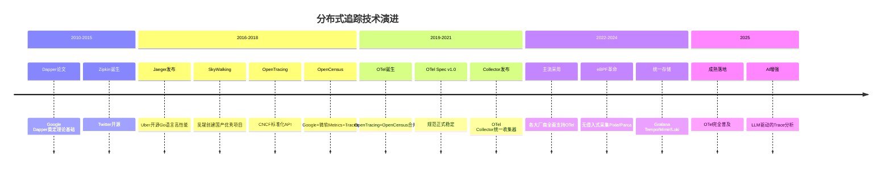
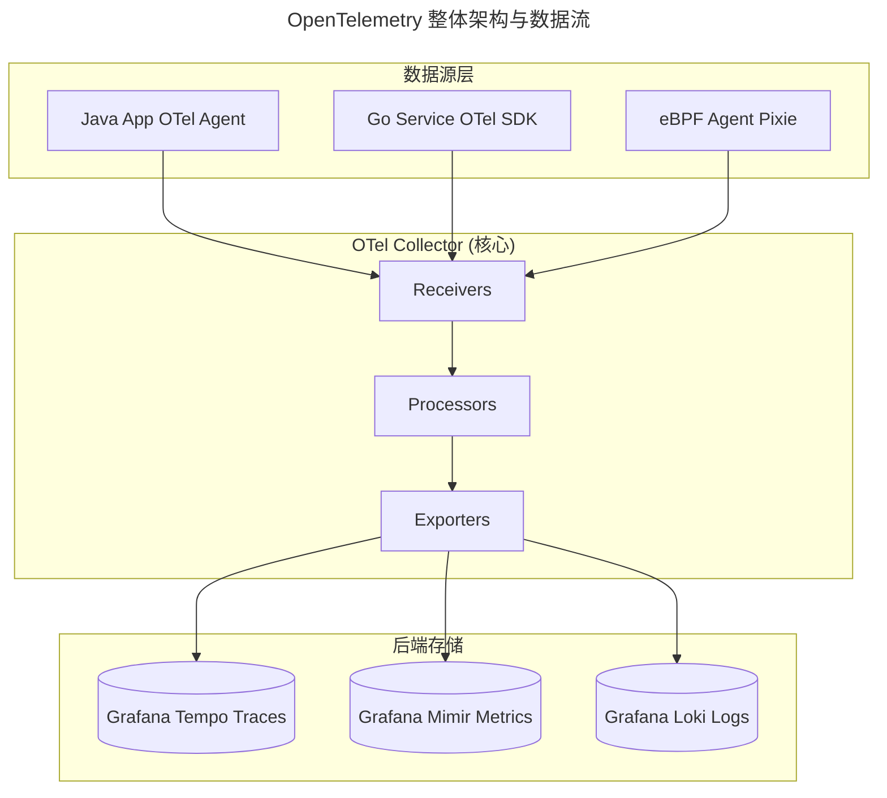

> 📅 **原文发布**：2018-2019 | **本次更新**：2025-06 | **更新等级**：🔴全面重写增强
> 📌 **v2 结构化升级**：2026-08 | **升级范围**：补齐 6 节标准骨架、Mermaid 图加标题、术语英文对照、参考资料融入进阶延展

# 26 | 稳定性实践：全链路跟踪系统，技术运营能力的体现

## 一、导言

本文阐述 **全链路跟踪系统（Distributed Tracing System）** 建设方面的内容。随着微服务和分布式架构的引入，复杂的调用关系显著增加了问题定位、瓶颈分析等稳定性保障工作的难度。

在 2025 年，该领域已发生范式级变革——从"各家自研"走向 **OpenTelemetry (OTel) 统一标准**。OTel 规范合并了 OpenTracing 与 OpenCensus，成为 CNCF 下的可观测性事实标准；同时 eBPF 革命带来了零侵入式采集能力，AI 增强让 Trace 分析变得简单。

---

## 二、核心方法论

### 全链路跟踪系统的技术演进

#### 2019 年的生态格局

| 产品类型 | 代表产品 | 特点 |
|---------|----------|------|
| 国内自研 | 阿里鹰眼（闭源）、大众点评 CAT（开源） | 深度结合业务 |
| 开源 APM | SkyWalking、Zipkin、Jaeger、CAT | 社区活跃，可自建 |
| 商业 APM | 听云、New Relic、Datadog | 产品化完善 |

#### 2025 年的新格局：OpenTelemetry 一统天下



### OpenTelemetry 完整架构与数据模型

#### 整体架构



**上图展示了 OTel 的三层架构：数据源层（SDK/Agent/eBPF）→ Collector（Receivers/Processors/Exporters）→ 后端存储（Tempo/Mimir/Loki）。** Collector 是架构核心，承担协议转换、批处理、限流等职责，实现数据源与后端的解耦。

#### 数据模型：Signal（信号）

OpenTelemetry 定义三种核心信号：**Trace（追踪）**、**Metric（指标）**、**Log（日志）**。

##### Trace 数据模型示例（JSON 格式展示一次电商下单全链路追踪）

```json
{
  "resourceSpans": [{
    "resource": {"attributes": {"service.name": "api-gateway"}},
    "scopeSpans": [{"spans": [{
      "traceId": "a1b2c3d4e5f6...",
      "spanId": "0000000000000001",
      "name": "POST /api/v1/orders",
      "kind": 2,
      "attributes": {"http.method": "POST", "http.route": "/api/v1/orders"},
      "events": [{"name": "auth.complete", "attributes": {"auth.method": "jwt"}}]
    }]}]
  }]
}
```

---

## 三、关键流程

### 流程一：OTel Collector 配置

```yaml
receivers:
  otlp:
    protocols:
      grpc:
        endpoint: 0.0.0.0:4317
      http:
        endpoint: 0.0.0.0:4318
processors:
  batch:
    send_batch_size: 8192
  memory_limiter:
    check_interval: 1s
    limit_percentage: 80
exporters:
  otlp/tempo:
    endpoint: tempo:4317
  prometheusremotewrite/mimir:
    endpoint: "http://mimir:9009/api/v1/write"
  otlphttp/loki:
    endpoint: "http://loki:3100/otlp"
service:
  pipelines:
    traces:
      receivers: [otlp]
      processors: [batch, memory_limiter]
      exporters: [otlp/tempo]
    metrics:
      receivers: [otlp]
      processors: [batch]
      exporters: [prometheusremotewrite/mimir]
    logs:
      receivers: [otlp]
      processors: [batch]
      exporters: [otlphttp/loki]
```

### 流程二：全链路跟踪在技术运营层面的应用

#### 场景一：问题定位和排查（AI 增强版）

**案例：某页面响应延迟**

利用 Grafana Tempo + TraceQL + AI 分析：

```sql
-- TraceQL: 查询超过2秒的订单请求
{
  name = "POST /api/v1/orders" && duration >= 2s
}
```

**AI 驱动的根因分析：** 基于 LLM 的 Trace 智能分析器，输入 Trace ID 或异常特征，输出结构化的根因分析报告。

#### 场景二：服务运行状态分析

1. **服务运行质量（SLI/SLO）**：基于 Trace 数据计算各服务的成功率、P99 延迟、Error Budget 消耗情况
2. **应用和服务依赖（Dependency Graph）**：2025 年增强——动态依赖图谱 + 强弱依赖自动识别

```python
@dataclass
class DependencyAnalysis:
    dependency: str
    call_ratio: float
    failure_impact: float
    is_strong: bool
    confidence: float

# 判定规则：
# 1. 调用比例 > 70% → 倾向强依赖
# 2. 失败时上游错误率上升 > 10% → 强依赖
# 3. 存在Fallback机制 → 弱依赖
```

#### 场景三：业务全息（Business Context Enrichment）

将 TraceID 与业务 ID（订单 ID、用户 ID、商品 ID）关联，实现用户视角的全链路查询。

**业务属性标准化（OTel Span Attributes）：**

```json
{
  "business.order_id": "ORD_20250607_001",
  "business.user_id": "u_12345",
  "business.channel": "ios_app",
  "business.campaign_id": "promo_618",
  "experiment.name": "new_checkout_flow"
}
```

### 流程三：eBPF 在全链路跟踪中的应用（2025 新增）

| 对比维度 | 传统 SDK 方式 | eBPF 方式 |
|---------|------------|----------|
| **代码侵入性** | 需引入 SDK 库 | 零侵入，内核级别 |
| **部署成本** | 每个服务集成 | 只需部署 Agent |
| **性能开销** | 取决于实现 | 极低 |
| **典型工具** | OTel SDK | Pixie（Trace/网络采集）；Parca/Pyroscope（持续 Profiling，与 Trace 互补） |

---

## 四、工具与实战

### 工具选型建议（2025）

| 场景 | 推荐方案 |
|------|----------|
| 新建云原生项目 | OTel + Grafana Stack |
| 已有 Prometheus 体系 | OTel Collector + Tempo |
| Kubernetes 深度洞察 | Pixie (eBPF) + OTel |
| 企业级需求 | OTel + Datadog/New Relic |

### 2025 年核心认知升级

1. **OpenTelemetry 是不可逆的趋势**
2. **Collector 是架构的核心**
3. **业务属性是差异化的关键**
4. **eBPF 是未来的方向**
5. **AI 让 Trace 分析变得简单**
6. **统一可观测性栈是终极目标**

---

## 五、常见误区

### 误区一：仍使用多家自研 APM 方案

各家自研导致协议不兼容、数据孤岛、维护成本高。应统一采用 OpenTelemetry 规范，通过 Collector 统一采集与导出。

### 误区二：忽视 Collector 的核心地位

直接将 SDK 数据写到后端存储，缺乏批处理、限流、协议转换能力。应在数据源与后端之间部署 OTel Collector，实现解耦与治理。

### 误区三：Trace 只用于排错

仅将 Trace 用于故障定位，忽视了服务依赖分析、SLI/SLO 计算、业务全息等场景。应将业务属性注入 Span Attributes，实现技术运营层面的多维洞察。

### 误区四：忽视 eBPF 的零侵入优势

仍坚持每个服务集成 SDK，部署成本高、性能开销大。应在 Kubernetes 环境下采用 Pixie/Parca 等 eBPF 方案实现零侵入采集。

### 误区五：依赖图谱静态维护

依赖关系靠人工梳理，无法反映真实的动态调用。应基于 OTel Trace 数据自动构建动态依赖图谱，并结合调用比例与失败影响自动识别强弱依赖。

### 误区六：Trace 分析依赖人工

仅靠人工查看 Trace 图谱定位问题，效率低下。应引入 LLM 驱动的 Trace 智能分析器，自动输出结构化的根因分析报告。

---

## 六、进阶延展

### 演进趋势

1. **统一可观测性栈**：Grafana Mimir/Loki/Tempo 三件套成为事实标准，实现 Metrics/Logs/Traces 的统一存储与查询
2. **Correlation Engine**：自动关联三支柱，缩短 MTTA 与 MTTI
3. **AI 增强分析**：LLM 驱动的根因分析与智能诊断
4. **eBPF 革命**：Pixie/Parca/Pyroscope 在内核层无侵入采集
5. **业务全息**：TraceID 与业务 ID 关联，实现用户视角的全链路查询

### 扩展阅读

- OpenTelemetry 官方文档：https://opentelemetry.io/docs/
- Grafana Tempo 文档：https://grafana.com/docs/tempo/
- Google Dapper 论文（经典必读）：https://research.google/pubs/pub36356/
- Pixie eBPF：https://docs.px.dev/
- TraceQL 参考：https://grafana.com/docs/tempo/latest/traceql/

本章内容介绍至此。若在该领域遇到相关问题或有相关经验，欢迎交流探讨。
