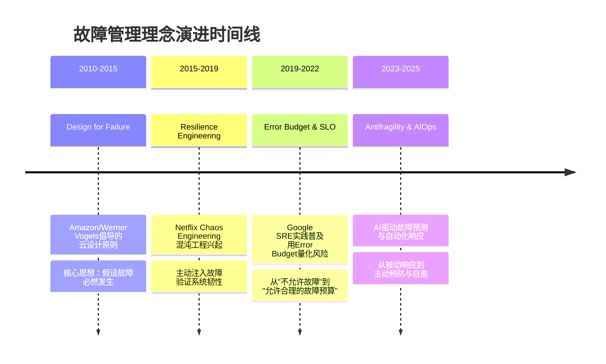
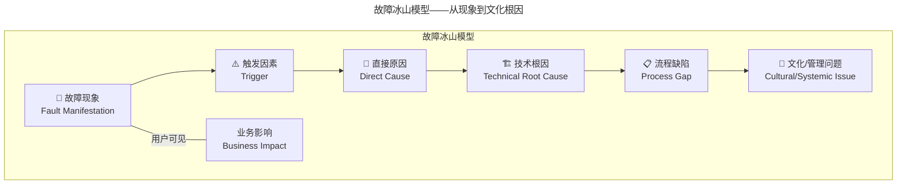

> 📅 **原文发布**：2018-2019 | **本次更新**：2025-06 | **更新等级**：🔴全面重写增强
> 📌 **v2 结构化升级**：2026-08 | **升级范围**：补齐 6 节标准骨架、Mermaid 图加标题、术语英文对照、参考资料融入进阶延展

# 27 | 故障管理：谈谈我对故障的理解

## 一、导言

对于任何一个技术团队而言，最令人痛苦、最不愿面对的问题即 **故障（Incident / Outage）**。

无论是故障发生时的极度焦虑与无助，还是故障处理过程中的煎熬与痛苦，以及故障复盘之后的失落与消沉，均属不愿提及的痛苦感受。在海外，故障复盘的英文术语为 **Postmortem**，该词亦有"验尸"之意，令人深感痛苦，且带有恐怖意味。

撰写故障相关文章亦较为痛苦。一方面，回顾各类故障场景并非令人愉悦的体验；另一方面，故障管理与技术、管理、团队及人员密切相关，属一套复杂体系。

查阅 Google SRE 一书（《SRE：Google 运维解密》），可见绝大部分章节均涉及故障相关内容。从技术实质来看，该书揭示了稳定性与故障管理这项系统工程的复杂度；且从本质上讲，SRE 的岗位职责在很大程度上即应对故障。

然而，时代在变，对故障的理解亦在不断演进。从 2019 年至 2025 年，业界对故障管理的认知已发生深刻变化。Google 于 2023 年修订了 Incident Management 文档，Netflix 将 Chaos Engineering 发展为平台化能力，PagerDuty、Opsgenie 等工具重新定义了 On-Call 模式。这些变化背后，是对故障本质更深刻的理解。

---

## 二、核心方法论

### 系统正常，只是该系统无数异常情况下的一种特例

上述表述源自 Google SRE 一书，笔者认为此观点不仅是一种看法，更是一个事实。因此，正确理解故障，首先要接受这一现实。

#### 故障的必然性：从认知到接受

故障是一种常态，任何软件系统均无法避免。国内领先的 BAT 企业无法避免，国外顶尖的 Google、Amazon、Facebook、Twitter 等亦无法避免。业务体量越大、系统越复杂，问题与故障越多，出现故障具有必然性。

| 公司 | 年份 | 主要故障 | 影响时长 | 业务影响 |
|------|------|----------|----------|----------|
| Facebook/Meta | 2021 | 骨干网路由（BGP）配置错误导致全球宕机 | ~6 小时 | 损失约 1 亿美元（业界估算） |
| AWS | 2023 | us-east-1 区域服务中断（Lambda 内部子系统故障级联） | ~3.5 小时 | 大量依赖 AWS 的服务受影响 |
| Cloudflare | 2025 | 数据库权限变更致边缘代理 panic | ~30 分钟 | 全球大量站点 5xx 错误 |
| 阿里云 | 2023 | 香港地域机房制冷故障 | ~3 小时 | 区域性服务不可用 |

此处有一个非常重要的体现，即 **Design for Failure** 的理念。业界的目标和注意力不应放在消除故障或不允许故障发生上，因为无法杜绝故障。因此，更应考虑的是如何让系统更健壮，在一般问题面前仍能保持稳定，即使出现故障也能让业务更快恢复。

#### 理念演进：从 Design for Failure 到 Antifragility

**2025 年的新认知：系统不仅应该 resilient（有韧性），更应该 antifragile（反脆弱）。**

反脆弱（Antifragility）这个概念由 Nassim Nicholas Taleb 提出，指的是系统不仅能从压力和混乱中恢复，还能从中变得更强：

- **脆弱系统**：故障会导致系统崩溃，恢复后状态不变或更差
- **韧性系统**：故障发生后能快速恢复到原有状态
- **反脆弱系统**：每次故障处理后，系统的整体稳定性和应对能力都得到提升

### 现代 Incident Management 体系概览

#### 工具生态对比：2019 vs 2025

| 维度 | 2019 年工具/方法 | 2025 年工具/方法 | 演进说明 |
|------|-----------------|-----------------|----------|
| **告警通知** | 短信/电话/钉钉群 | PagerDuty, Jira Service Management, Grafana OnCall | 智能升级、轮值管理、Escalation 策略 |
| **On-Call 管理** | Excel 表格排班 | 自动化轮值 + Follow-the-Sun + AI 辅助 | 全球协作、负载均衡、疲劳度监控 |
| **故障指挥** | 口头协调 + 微信群 | Incident Command System (ICS) | 角色分工明确、标准化流程 |
| **故障定位** | 日志搜索 + 监控面板 | OTel 全链路追踪 + Correlation Engine | 自动关联、根因分析加速 |
| **故障恢复** | 手动执行预案 | Runbook Automation + Auto-Remediation | 一键执行、AI 决策支持 |
| **复盘工具** | Word/Confluence 文档 | 专用 Postmortem 平台（如 incident.io, Jeli） | 结构化模板、Action Item 跟踪 |
| **故障预防** | 偶尔的手动测试 | Chaos Engineering 平台（Litmus, Chaos Mesh） | 持续注入、游戏化演练 |
| **知识沉淀** | Wiki 文档 | AI 驱动的 Runbook + 知识图谱 | 智能检索、上下文推荐 |

### 可观测性驱动的故障认知（2025 新增）

传统监控告诉我们"系统出了什么问题"（What happened），而 **可观测性（Observability）** 帮助我们回答"为什么会出现这个问题"（Why it happened）以及"未来如何预防"（How to prevent）。

基于 OpenTelemetry (OTel) 的现代可观测性体系包含三大支柱：

1. **Metrics（指标）**：量化系统的运行状态（如 QPS、延迟 P99、错误率）
2. **Logs（日志）**：离散的事件记录（如应用日志、访问日志）
3. **Traces（链路追踪）**：请求在全链路中的流转路径

**关键演进：Correlations（关联分析）**——通过自动化的 Correlation Engine，将 Metrics、Logs、Traces 三者关联起来，大大缩短 MTTA（Mean Time To Acknowledge）和 MTTI（Mean Time To Identify）。

---

## 三、关键流程

### 故障的冰山模型

**故障永远只是表面现象，其背后技术和管理上的问题才是根因。** 有时过分关注故障本身，容易揪住相关责任人不放，从而给责任人造成较大的负面压力。

### 故障复盘反思清单（2025 增强版）

#### 第一类：故障频发问题

- 我们的 **Error Budget 消耗速度** 是否正常？是否需要调整发布节奏？
- **变更频率 vs 故障频率** 的相关性如何？是否存在变更疲劳？
- **On-Call 轮值** 是否合理？是否有成员处于 Burnout 状态？
- **自动化测试覆盖率** 能否有效拦截回归问题？

#### 第二类：故障放大问题

- **Blast Radius（爆炸半径）** 分析：单点故障的影响范围是否可控？
- **强弱依赖关系** 是否梳理清楚？是否存在隐式依赖？
- **Circuit Breaker（熔断器）** 和 **Bulkhead（舱壁隔离）** 是否到位？
- **混沌工程** 是否常态化？上次注入故障是什么时候？

#### 第三类：故障发现与恢复问题

- **MTTD（Mean Time To Detect）** 和 **MTTR（Mean Time To Recovery）** 的基线是多少？
- **告警质量** 如何？是否存在大量 Noise（噪声）导致 Alert Fatigue？
- **Runbook Automation** 覆盖率如何？常见场景能否一键恢复？
- **AIOps** 能力是否应用？能否实现异常检测和自动响应？

#### 第四类：管理与文化问题

- **Psychological Safety（心理安全）** 水平如何？员工是否敢于报告问题？
- **Just Culture（公正文化）** 是否建立？定责是否公平透明？
- **Postmortem 文化** 是 Blameless 还是 Blameful？学习效果如何？
- **组织学习能力** 如何？知识是否有效沉淀和复用？

### 实际案例：某电商平台 P1 故障深度分析

**背景：** 2024 年双十一大促期间，某电商核心交易链路出现 P1 级故障，持续 23 分钟，GMV 损失估算约 800 万人民币。

| 层级 | 发现的问题 | 改进措施 |
|------|------------|----------|
| **触发因素** | 大促峰值流量超出预期 30% | 引入更精准的容量预测模型 |
| **直接原因** | 支付网关连接池耗尽 | 动态扩容+连接池优化 |
| **技术根因** | 服务间调用未设置合理 Timeout + 无熔断机制 | 全局 Timeout 治理+Circuit Breaker 落地 |
| **流程缺陷** | 压测场景未覆盖支付网关异常场景 | 扩展混沌工程注入场景 |
| **文化问题** | 开发团队对第三方依赖的风险意识不足 | 建立依赖风险评估机制 |

**关键洞察：** 这次故障暴露的不是单一的技术问题，而是整个系统在极端场景下的韧性不足。通过这次复盘，团队建立了完整的"依赖风险地图"，并推动了 Chaos Engineering 的常态化实施。

---

## 四、工具与实战

### 从被动响应到主动预防的转变

1. **左移（Shift Left）**：将稳定性保障动作前移到开发阶段
   - 在 CI/CD 流水线中集成混沌测试
   - 在 Code Review 阶段关注稳定性风险
   - 在架构设计阶段进行 Failure Mode Analysis

2. **持续学习（Continuous Learning）**：
   - 每次故障都是学习机会，而非惩罚理由
   - 建立组织级的知识库和最佳实践库
   - 定期进行 Game Day 演练，保持团队的应急肌肉记忆

3. **数据驱动（Data-Driven Decision Making）**：
   - 用 SLO/SLI/Error Budget 量化风险承受能力
   - 用 MTTD/MTTR 等指标衡量改进效果
   - 用故障模式分布指导预防投入优先级

### 故障管理成熟度评估模型

| 成熟度等级 | 名称 | 特征 | 典型表现 |
|------------|------|------|----------|
| Level 1 | 混沌无序 | 无标准流程，救火式响应 | 故障发生时慌乱，依赖个人英雄主义 |
| Level 2 | 初步规范 | 有基本定级标准，事后复盘 | 有故障分级，但复盘流于形式 |
| Level 3 | 体系化 | ICS 指挥体系，Blameless 文化 | 标准化应急流程，注重学习改进 |
| Level 4 | 数据驱动 | SLO/Error Budget，量化管理 | 用数据指导发布决策，预防投入可衡量 |
| Level 5 | 自适应智能 | AI 辅助预测，自动化响应 | 异常自愈，持续优化，反脆弱 |

**建议：** 团队可先自我评估当前所处级别，然后制定针对性的提升计划。

---

## 五、常见误区

### 误区一：试图杜绝故障

把目标定为"零故障"，导致过度防御、发布冻结，反而压抑创新。应接受故障必然性，将精力放在提升系统韧性与快速恢复能力上。

### 误区二：揪住责任人不放

过分关注"谁犯错"，给责任人造成负面压力，导致员工隐瞒问题。应聚焦系统与流程缺陷，建立 Blameless Postmortem 文化。

### 误区三：改进措施无法落地、无法量化

输出空泛的"加强意识"类措施，无法执行也无法衡量。应输出可执行的技术改进措施（如 Timeout 治理、Circuit Breaker 落地），并用 MTTD/MTTR 衡量效果。

### 误区四：将故障归因于第三方就停止改进

第三方触发因素不等于自身免责理由。即使根因在云厂商或网络，也必须找出自身的改进点（如多区域容灾、Circuit Breaker 兜底）。

### 误区五：仅依赖管理手段而非技术手段

靠宣传、Checklist、Double Check 等人力手段解决稳定性问题，成本高且不可持续。应将人为动作转化到技术平台中（如 Runbook Automation、Auto-Remediation）。

### 误区六：忽视心理安全

低心理安全的团队，员工会掩盖问题直到无法隐藏。应建立 Psychological Safety，让员工敢于在问题刚出现时就报告。

---

## 六、进阶延展

### 管理者的两个核心观点

**第一，出问题，管理者要先自我反省。** 不能一味地揪着员工的错误不放，员工更多的是整个体系中的执行者，做得不到位，一定是体系上还存在不完善的地方或漏洞。

**第二，强调技术解决问题，而不是单纯地靠增加管理流程和检查环节来解决问题。** 技术手段暂时无法满足的，可以靠管理手段来辅助，但一定不能是常态，必须尽快将这些人为动作转化到技术平台中去。

### 演进趋势

1. **反脆弱（Antifragility）**：系统不仅恢复，更要从故障中变得更强
2. **AIOps 自愈**：AI 驱动的异常检测与自动响应
3. **Correlation Engine**：Metrics/Logs/Traces 自动关联，缩短 MTTA/MTTI
4. **Game Day 常态化**：保持团队应急肌肉记忆
5. **组织学习闭环**：知识图谱 + 最佳实践库 + 智能检索

### 扩展阅读

- Google SRE Book：《SRE：Google 运维解密》
- Google Incident Management 文档（2023 修订版）
- Netflix Chaos Engineering：https://netflix.github.io/chaosmonkey/
- Antifragile（Nassim Nicholas Taleb 著）
- PagerDuty Incident Response：https://response.pagerduty.com/

用一句话总结："**理解一个系统应该如何工作并不能使人成为专家，只能靠调查系统为何不能正常工作才行**。"（From SRE，by Brian Redman）
