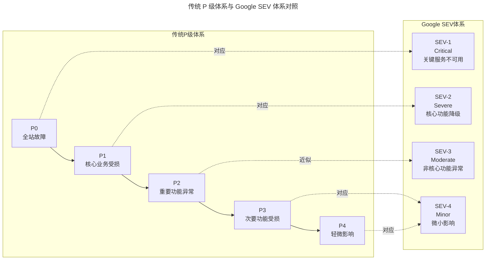
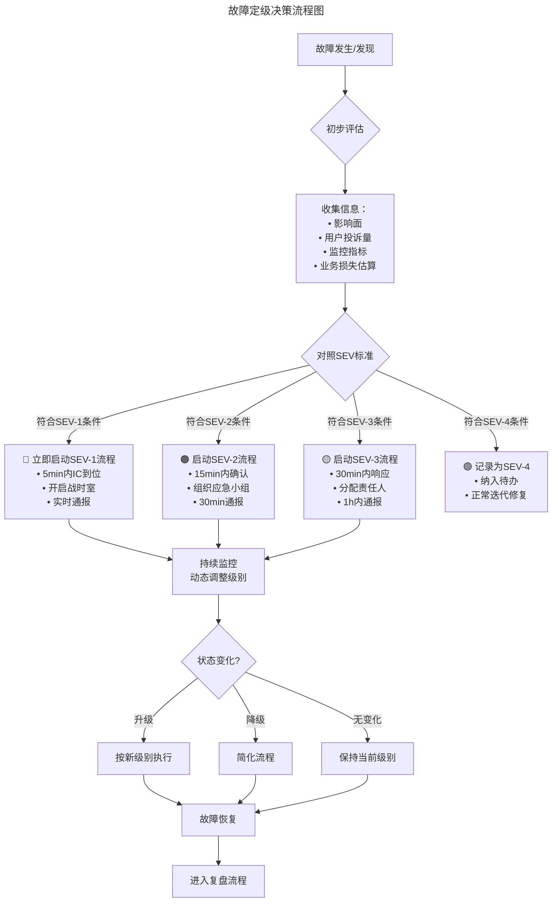

> 📅 **原文发布**：2018-2019 | **本次更新**：2025-06 | **更新等级**：🔴全面重写增强
> 📌 **v2 结构化升级**：2026-08 | **升级范围**：补齐 6 节标准骨架、Mermaid 图加标题、术语英文对照、参考资料融入进阶延展

# 28 | 故障管理：故障定级和定责

## 一、导言

故障管理的第一步是对故障的理解，只有正确地面对故障，才能找到更合理的处理方式。本文将阐述 **故障定级和定责（Incident Severity & Accountability）** 方面的经验。

在 2019 年我们讨论这个话题时，主要聚焦于 P0-P4 的分级体系和基本的定责原则。到了 2025 年，随着 Google SRE 实践的普及、Incident Management 体系的成熟，以及企业对可靠性工程投入的加深，故障定级和定责已经演变成一套更加科学、量化、且与业务目标紧密对齐的方法论——引入 SEV 分级体系、Just Culture 公正文化框架，以及 Error Budget 与定级联动机制。

---

## 二、核心方法论

### 关键角色演进：从技术支持到 IMT

此处存在一个关键角色，称之为 **技术支持（亦有的团队称为 NOC，Network Operation Center）**。该角色主要有两个职责：一是跟踪线上故障处理和组织故障复盘；二是制定故障定级定责标准，同时有权对故障做出定级和定责——类似法院法官的角色。

**2025 年角色演进：** 在现代化的 Incident Management 体系中，这个角色已经演变为 **IMT（Incident Management Team）** 或 **RE（Reliability Engineering）团队**：

| 维度 | 2019 年 - 技术支持/NOC | 2025 年 - IMT/RE 团队 |
|------|------------------------|---------------------|
| **核心职责** | 故障跟踪、定级定责 | 全生命周期管理 + 可靠性建设 |
| **工作模式** | 被动响应 | 主动预防 + 被动响应 |
| **工具支撑** | Excel + IM 工具 | 专业 IM 平台 + AIOps |
| **能力要求** | 流程熟悉 | 技术理解 + 流程专家 + 数据分析 |
| **价值定位** | "法官" | "推动者" + "赋能者" |

### SEV 分级体系：业界最佳实践

将故障等级设置为 P0~P4 共 5 个级别，P0 为最高，P4 为最低。该体系与 Google SRE 使用的 SEV（Severity）体系对比如下：



### 公正文化（Just Culture）框架

公正文化由心理学家 James Reason 提出，核心思想是：**大多数人为错误的根源在于系统缺陷，而非个人失误。** 这个框架帮助区分三种情况：

1. **人为错误（Human Error）**：无意中犯错 → 应该被原谅和学习
2. **冒险行为（At-Risk Behavior）**：在模糊情况下做出选择 → 需要澄清规则和提供更好工具
3. **违规行为（Reckless Behavior）**：明知故犯 → 应该受到纪律处分

---

## 三、关键流程

### 流程一：SEV 详细定义与响应 SLA

#### SEV-1（Critical）— 关键服务完全或部分不可用

| 属性 | 定义 |
|------|------|
| **业务影响** | 核心业务完全不可用或严重降级；用户无法完成关键操作 |
| **影响范围** | >50% 用户受影响 或 核心交易链路中断 |
| **数据影响** | 可能导致数据丢失或一致性破坏 |
| **品牌影响** | 可能引发媒体关注或监管介入 |
| **响应 SLA** | 5 分钟内确认，15 分钟内 IC（指挥官）到位 |
| **升级路径** | 立即升级至 CTO/VP 级别 |
| **通报要求** | 实时同步，每 15 分钟更新一次 |

#### SEV-2（Severe）— 核心功能严重降级

| 属性 | 定义 |
|------|------|
| **业务影响** | 核心功能部分不可用或性能严重下降 |
| **影响范围** | 10%-50% 用户受影响 或 重要功能不可用 |
| **品牌影响** | 可能引发大量用户投诉 |
| **响应 SLA** | 15 分钟内确认，30 分钟内 IC 到位 |
| **通报要求** | 30 分钟内首次通报，每 30 分钟更新 |

#### SEV-3（Moderate）— 非核心功能异常

| 属性 | 定义 |
|------|------|
| **业务影响** | 非核心功能不可用或性能下降 |
| **影响范围** | <10% 用户受影响 或 辅助功能异常 |
| **响应 SLA** | 30 分钟内确认，1 小时内响应 |
| **通报要求** | 1 小时内通报，每小时更新 |

#### SEV-4（Minor）— 微小影响

| 属性 | 定义 |
|------|------|
| **业务影响** | 极小范围的体验问题 |
| **影响范围** | 个别用户或内部系统 |
| **响应 SLA** | 下一个工作日内响应 |
| **通报要求** | 周报中汇总即可 |

### 流程二：定级决策流程



### 流程三：Error Budget 与故障定级的关系

在现代 SRE 实践中，**Error Budget（错误预算）** 是连接故障定级与发布决策的关键桥梁。

```
Error Budget = (100% - SLO目标) × 统计周期

示例：
- SLO目标：99.9%可用性（月度）
- 允许的不可用时间：43.2分钟/月
- Error Budget：43.2分钟
```

| Error Budget 剩余 | 发布策略 | 故障响应策略 |
|------------------|----------|--------------|
| >80% | 正常发布节奏 | 标准响应流程 |
| 50%-80% | 冻结非必要发布 | 加强监控密度 |
| 20%-50% | 仅允许热修发布 | 提升响应级别 |
| <20% | 完全冻结发布 | 进入战备状态 |
| 耗尽 | 强制性稳定性专项 | 全面复盘+整改 |

### 流程四：定责维度详解（2025 增强版）

#### 1. 变更执行（Change Management）

| 场景 | 责任判定 | 2025 年补充说明 |
|------|----------|----------------|
| 变更方未通知受影响方 | 责任在变更方 | 必须通过变更管理系统记录 |
| 通知到位但受影响方未准备 | 责任在受影响方 | 受影响方应有依赖服务的健康检查机制 |
| 变更影响超出预期 | 责任在变更方 | 变更前应进行 Blast Radius Assessment |
| 变更在禁止窗口期执行 | 责任在变更方 | 变更窗口应由系统强制管控 |
| 灰度验证不充分就全量 | 责任在变更方 | 自动化 Canary Analysis 应作为 Gate |

#### 2. 服务依赖（Service Dependency）

| 场景 | 责任判定 | 2025 年补充说明 |
|------|----------|----------------|
| 私自调用/不符合约定 | 责任在调用方 | 服务治理平台应能发现非法调用 |
| 服务方文档不清 | 责任在服务方 | API 文档应自动生成并与代码同步 |
| SLA 未达标但未告警 | 双方责任 | 服务方负责 SLA，调用方负责超时处理 |
| 依赖服务故障导致级联 | 视情况而定 | 需要分析是否有 Circuit Breaker |

#### 3. 第三方责任（Third Party / External）

| 场景 | 责任判定 | 2025 年补充说明 |
|------|----------|----------------|
| IDC 电力/网络故障 | 第三方责任 | 但需评估冗余设计是否充分 |
| 云厂商服务中断 | 第三方责任 | 应有多云或多区域容灾 |
| DNS 服务商故障 | 第三方责任 | 自建 DNS 或使用多 DNS 厂商 |
| **关键原则** | **第三方触发 ≠ 我们的免责理由** | **必须找出自身的改进点** |

---

## 四、工具与实战

### 故障定级快速参考卡

```
┌─────────────────────────────────────────────────────────────┐
│                  故障定级快速参考卡                            │
├──────────┬──────────┬───────────┬──────────┬────────────────┤
│   级别   │  响应时间 │  IC到位   │  通报频率  │    典型特征     │
├──────────┼──────────┼───────────┼──────────┼────────────────┤
│  SEV-1   │   5min   │   15min   │  15min   │ 全站/核心不可用  │
│  🔴严重  │          │           │          │                │
├──────────┼──────────┼───────────┼──────────┼────────────────┤
│  SEV-2   │  15min   │   30min   │  30min   │ 核心功能降级    │
│  🟠高危  │          │           │          │                │
├──────────┼──────────┼───────────┼──────────┼────────────────┤
│  SEV-3   │  30min   │   60min   │   60m   │ 非核心功能异常  │
│  🟡中等  │          │           │          │                │
├──────────┼──────────┼───────────┼──────────┼────────────────┤
│  SEV-4   │ Next Day│   N/A     │   周报   │ 微小影响        │
│  🟢低危  │          │           │          │                │
└──────────┴──────────┴───────────┴──────────┴────────────────┘
```

### 定责决策 Checklist

在故障复盘会议中，建议按照以下顺序进行定责决策：

- [ ] **事实确认**：故障时间线是否已核对无误？
- [ ] **影响评估**：定级是否各方认可？
- [ ] **根因识别**：技术根因是否已明确？
- [ ] **触发分析**：直接触发因素是什么？
- [ ] **系统审视**：系统是否存在可以预防此类问题的机制？
- [ ] **流程审查**：相关流程是否存在漏洞？
- [ ] **责任匹配**：根据定责标准，各方责任比例如何？
- [ ] **改进措施**：各方需要落实什么改进？
- [ ] **跟踪机制**：如何确保改进措施落地？

---

## 五、常见误区

### 误区一：定级标准不清晰，靠主观判断

各方对故障影响理解不同，复盘时频繁出现定级争执。应制定明确的 SEV 分级标准，从业务影响、影响范围、数据影响、品牌影响等维度量化，并由 IMT/RE 团队拥有绝对话语权。

### 误区二：定责变成甩锅

上游将责任推脱至下游，特别是"运维背锅"现象。应作为受影响方端到端定位清楚，只有当定位出的问题确实发生在运维部件时才允许将责任传递。

### 误区三：定责等同于处罚

将定责与薪资、绩效直接强挂钩，导致员工恐惧、隐瞒问题、推卸责任。应区分定责（对事不对人）与处罚（对人），用 Just Culture 框架指导每次定责。

### 误区四：忽视 Error Budget 与定级的联动

定级是孤立判断，与发布决策、可靠性目标脱节。应建立 Error Budget 消耗与发布策略、故障响应的闭环机制。

### 误区五：第三方触发即免责

将根因简单归因于云厂商或 IDC，停止自身改进。必须坚持"第三方触发 ≠ 我们的免责理由"，找出自身的改进点（如多区域容灾、Circuit Breaker 兜底）。

### 误区六：标准一成不变

定级定责标准制定后长期不修订，无法适应业务变化。应每季度或半年对标准进行一次修订和完善。

---

## 六、进阶延展

### 演进趋势

1. **Error Budget 驱动**：定级与发布决策形成闭环，量化风险承受能力
2. **Just Culture 框架**：用公正文化决策树指导每次定责，区分人为错误与违规行为
3. **AIOps 辅助定级**：基于实时指标自动建议 SEV 级别
4. **IMT/RE 角色演进**：从"法官"变为"推动者"+"赋能者"
5. **变更管理自动化**：Change Automation Platform 记录变更，Blast Radius Assessment 评估影响

### 扩展阅读

- Google SRE Book：Incident Management 章节
- James Reason《Managing the Risks of Organizational Accidents》（1997，公正文化概念出处）
- PagerDuty Incident Response：https://response.pagerduty.com/
- Error Budget 实践：https://sre.google/workbook/implementing-slos/
- Blameless Postmortem 文化：https://sre.google/sre-book/postmortem-culture/

本文阐述了故障管理中的定级和定责标准。笔者所在团队（蘑菇街）在该方面的具体管理执行中取得了不错的效果，故分享出来以供参考。
