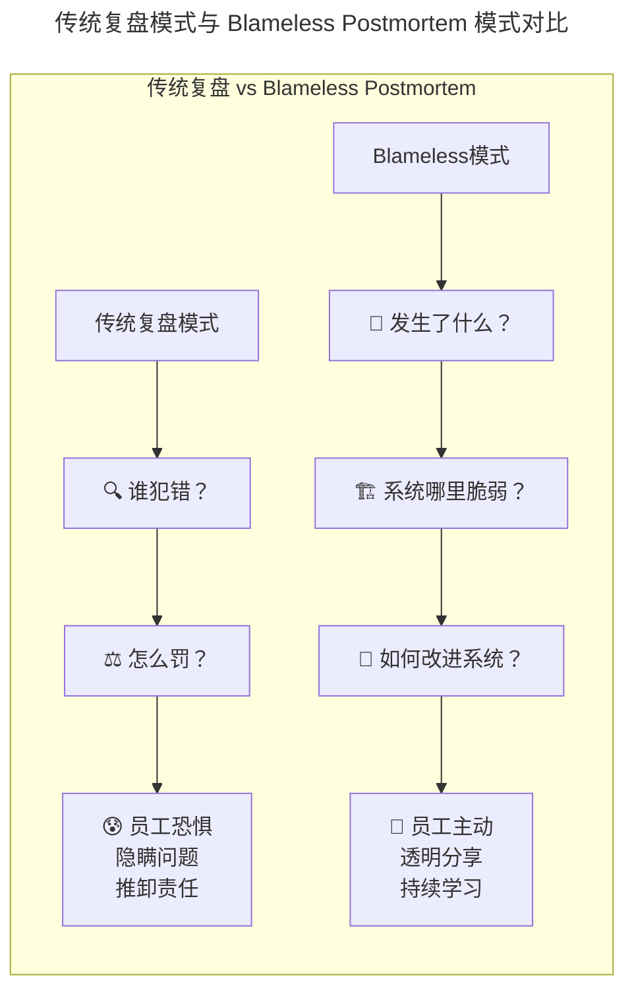

> 📅 **原文发布**：2018-2019 | **本次更新**：2025-06 | **更新等级**：🔴全面重写增强
> 📌 **v2 结构化升级**：2026-08 | **升级范围**：补齐 6 节标准骨架、Mermaid 图加标题、术语英文对照、参考资料融入进阶延展

# 29 | 故障管理：鼓励做事，而不是处罚错误

## 一、导言

故障发生后，必须严肃对待，需对关键责任人或责任方定责；但定责的目的并非处罚，因为一旦故障复盘以处罚为导向，将导致严重的负面效应。

在 2019 年我们讨论这个话题时，核心观点是"定责不等于处罚"、"鼓励做事而非惩罚错误"。这个理念在当时已经相当超前。到了 2025 年，随着 Google Blameless Postmortem 文化的普及、Psychological Safety 研究的深入、以及 Just Culture 框架的应用，我们对这个话题有了更加系统化和可操作的理解。

本文将阐述如何对待定责和处罚，以及为何"鼓励做事而非处罚错误"是高绩效团队的底层密码。

---

## 二、核心方法论

### 关于定责和处罚

定责的过程即找出根因、针对不足找出改进措施并落实责任人。定责的目的是责任到人，使责任人能够真切认识到自身不足之处，并主导改进措施的落地。

然而，在具体执行过程中必须区分定责和处罚。**定责是对事不对人的**，但 **处罚则变成对人不对事**，因为处罚必然与薪资、奖金、绩效、晋升等个人利益直接挂钩。

### 核心概念：Psychological Safety（心理安全）

心理安全由哈佛商学院教授 Amy Edmondson 提出，定义为：

> **团队成员相信在团队中承担人际风险是安全的——比如提出问题、承认错误、表达想法或挑战现状，而不会受到惩罚或 ridicule（嘲笑）。**

**Google Project Aristotle 的研究发现**：在高绩效团队中，心理安全是最重要的预测因素，比技术能力、团队结构、甚至明确的目标都更重要。

应用到故障管理中：
- **高心理安全的团队**：员工会在问题刚出现时就报告，不会等到演变成严重故障
- **低心理安全的团队**：员工会试图掩盖问题，直到无法隐藏

### 公正文化（Just Culture）与处罚边界

关于是否处罚，可遵循以下原则：对于有明确底线、坚决不允许触碰的规则，若因不遵守规则、故意触犯而导致严重故障出现，此种情况应予处罚。

#### Blameless Postmortem：传统复盘 vs 无责复盘

**上图展示两种复盘模式导致截然相反的团队行为：** 传统模式导向员工恐惧、隐瞒与推卸；Blameless 模式导向员工主动、透明与持续学习。

### Blameless Postmortem 的核心原则

| 原则 | 说明 | 违反时的表现 |
|------|------|--------------|
| **对事不对人** | 关注系统和流程缺陷，而非个人过失 | "这是 XX 的操作失误" |
| **假设善意** | 相信当事人已尽力做出最佳判断 | "他为什么不检查一下？" |
| **关注系统性因素** | 寻找促成错误的条件，而非错误本身 | 只追究直接操作者 |
| **保护涉事人员** | 复盘报告中不暴露个人姓名 | 在报告中点名批评 |
| **行动导向** | 重点在于可执行的改进措施 | 止步于原因分析 |
| **知识共享** | 复盘结论应广泛传播 | 仅在小范围内部传阅 |

---

## 三、关键流程

### 流程一：高压线规则清单（2025 增强版）

| # | 高压线规则 | 风险等级 | 典型场景 |
|---|------------|----------|----------|
| 1 | 未经发布系统，私自变更线上代码和配置 | 🔴 致命 | SSH 直接修改配置文件 |
| 2 | 未经授权，私自在业务高峰期进行硬件和网络设备变更 | 🔴 致命 | 白天进行交换机割接 |
| 3 | 未经严格的方案准备和评审，直接进行线上高危设备操作 | 🔴 致命 | 无方案直接操作核心路由器 |
| 4 | 未经授权，私自在生产环境进行调测性质的操作 | 🟠 高危 | 生产环境开启 Debug 模式 |
| 5 | 未经授权，私自变更生产环境数据信息 | 🔴 致命 | 直接 SQL 修改订单状态 |
| 6 | **（2025 新增）** 绕过审批流程，关闭生产环境的告警或监控 | 🔴 致命 | 为"清净"而屏蔽告警 |
| 7 | **（2025 新增）** 在未做备份的情况下执行不可逆的数据操作 | 🔴 致命 | 无备份直接 DROP/DELETE |
| 8 | **（2025 新增）** 故意隐瞒故障或延迟上报 | 🔴 致命 | "先看看能不能自己恢复" |

### 流程二：实际案例——高压线规则的演变

**2016 年的教训：** 2016 年系公司业务高速发展阶段，设备扩容频繁，网络割接操作较多。因缺乏明确严格的规则，导致团队成员为赶工期在白天进行网络设备变更，结果造成严重的 P0 和 P1 故障频发。复盘过程中，很多人的反馈即：**笔者原以为没问题、没影响**。恰恰是这种"想当然"的思维方式导致了严重故障。

**制定高压线的效果：** 在近两年时间内，未出现过任何一例因意识缺失或低级失误导致的 P0 和 P1 故障。因此，制定明确的高压线规则以提升意识，**触碰一次即应产生痛感**。

### 流程三：绩效挂钩的正确姿势（2025 增强版）

笔者所在团队取消了挂钩机制：对于出现的故障有专门的系统记录，然后将该事项放入员工一个季度、半年甚至一年的表现中进行整体判断。

**关键原则：**
1. **故障只是评估的一个维度，且权重较低（建议 5%-10%）**
2. **区分"重复性失误"和"一次性学习机会"**
3. **重点关注"出了问题后的表现"而非"问题本身"**
4. **将"预防未来故障的能力"作为正向评价指标**

---

## 四、工具与实战

### 创新与稳定的平衡艺术

#### 场景一：技术创新带来的风险

员工积极主动地承担了极具挑战性的工作，需要尝试某个新技术或解决方案，结果在落地的过程中踩到了一些坑，导致出现了问题。

**2025 年补充视角——应问的问题：**
- 这个技术创新是否经过了充分的 PoC（概念验证）？
- 是否有 Rollback 计划？
- 是否在低风险环境中进行了充分测试？
- **最重要的是：这是一次"好"的失败？是否带来了新的认知？**

如果答案是肯定的，那么这应该被视为一次有价值的学习经历，而非惩罚的理由。

#### 场景二：高速增长期的系统性风险

业务高速发展时期，业务量成指数级增长时，团队人员技能和经验水平整体上还没法很好地应对，这个时候可能任何一个小变动都是最后一根稻草。这种时候就需要群策群力，而不是简单处罚了事。

### 团队心理安全自评问卷

采用 Likert 1-5 分制：

| # | 问题 | 1(非常不同意) - 5(非常同意) |
|---|------|------------------------------|
| 1 | 如果我在工作中犯了错，团队会支持我而不是惩罚我 | ___ |
| 2 | 我敢于在会议上提出不同意见 | ___ |
| 3 | 我愿意承担有挑战性的任务，即使可能失败 | ___ |
| 4 | 出现问题时，大家首先关注的是"怎么解决"而非"谁的责任" | ___ |
| 5 | 我觉得可以安全地向主管提出棘手的问题 | ___ |
| 6 | 团队成员之间互相尊重，没有人会被嘲笑或贬低 | ___ |
| 7 | 即使我的想法可能不被采纳，我也敢于提出来 | ___ |
| 8 | 当我需要帮助时，我会毫不犹豫地寻求帮助 | ___ |

**评分解读：**
- **32-40 分**：高心理安全团队 ✅
- **24-31 分**：中等水平，有提升空间 ⚠️
- **16-23 分**：需要立即关注和干预 ❌
- **8-15 分**：危机状态，急需文化变革 🚨

---

## 五、常见误区

### 误区一：定责即处罚，处罚即扣绩效

将定责与薪资、绩效直接强挂钩，导致团队陷入恐慌、质疑、相互不信任。应将故障放入更长的时间窗口中整体判断，权重建议 5%-10%。

### 误区二：一刀切处罚

完全不处罚或一律处罚均不可取。应区分"重复性失误"和"一次性学习机会"，用 Just Culture 决策树区分人为错误、冒险行为与违规行为。

### 误区三：忽视心理安全

低心理安全的团队，员工会掩盖问题直到无法隐藏。应建立 Psychological Safety，让员工敢于在问题刚出现时就报告。

### 误区四：处罚打击创新积极性

员工努力做事的积极性一旦被打击，变得畏首畏尾，最终会导致优秀人才流失。应优先传递信任，对技术创新带来的"好的失败"持容忍态度。

### 误区五：管理者不自我反省

员工更多是整个体系中的执行者，做得不到位一定是体系上还存在不完善的地方。管理者应重点反思体系缺陷，而非揪着员工错误不放。

### 误区六：高压线模糊不可执行

规则不清、边界模糊，导致执行时争议不断。应制定明确的高压线规则清单，如同"酒后不开车"一般简单明确。

---

## 六、进阶延展

### 2025 年核心要点回顾

1. **心理安全是基础**：没有心理安全，一切流程和工具都是空谈
2. **公正文化是框架**：用 Just Culture 决策树指导每次定责
3. **Blameless 是方法**：关注系统改进，而非个人追责
4. **高压线是底线**：明确不可触碰的红线，其余空间留给创新
5. **长期视角是智慧**：用时间窗口平滑单次故障的影响

### 演进趋势

1. **Psychological Safety 量化**：通过问卷与行为指标持续监控团队心理安全水平
2. **Just Culture 决策树自动化**：基于规则引擎辅助定责决策，减少主观偏差
3. **Blameless Postmortem 平台化**：专用工具（如 incident.io、Jeli）支持结构化模板与 Action Item 跟踪
4. **AIOps 辅助根因分析**：减少对个人经验的依赖，降低追责压力
5. **组织学习闭环**：知识图谱 + 最佳实践库，让每次故障都成为组织资产

### 扩展阅读

- Google Project Aristotle：https://rework.withgoogle.com/print/guides/5721312654060544/
- Amy Edmondson《The Fearless Organization》
- James Reason《Managing the Risks of Organizational Accidents》（1997，公正文化概念出处）
- Google SRE Book：Postmortem Culture 章节
- Postmortem 平台示例：https://incident.io/

最后，在故障定责和处罚方面有何经历和想法，欢迎交流探讨。
