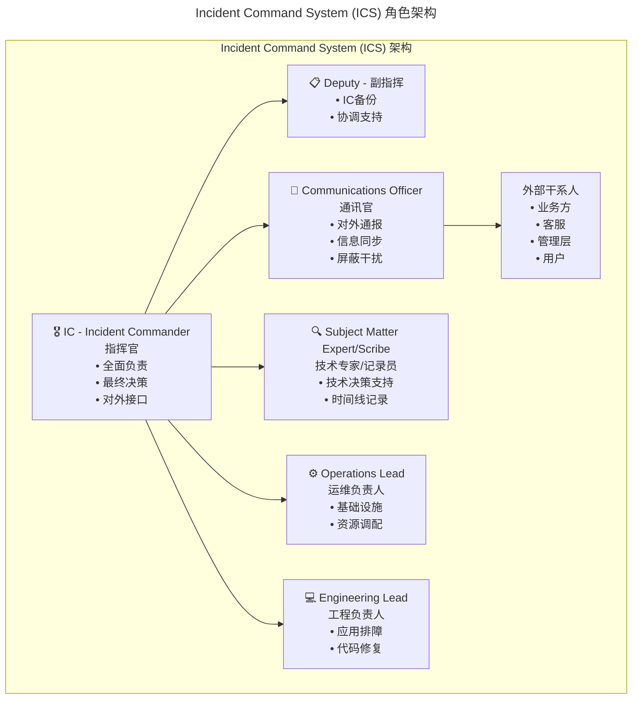
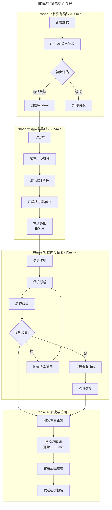
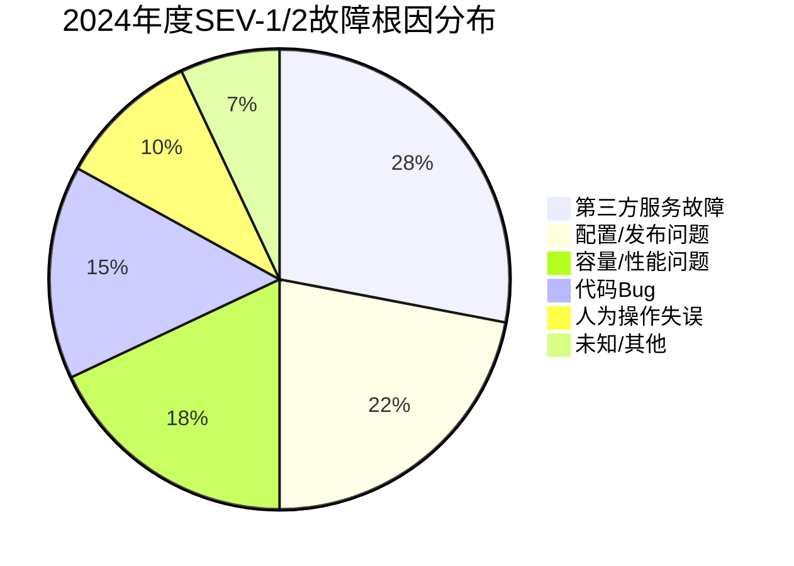

> 📅 **原文发布**：2018-2019 | **本次更新**：2025-06 | **更新等级**：🔴全面重写增强
> 📌 **v2 结构化升级**：2026-08 | **升级范围**：补齐 6 节标准骨架、Mermaid 图加标题、术语英文对照、参考资料融入进阶延展

# 30 | 故障管理：故障应急和故障复盘

## 一、导言

前文已分享了故障管理中应如何对待故障、怎样做好故障定级和定责方面的管理工作。本文将阐述当故障真正发生后，在 **故障通报和故障复盘（Incident Response & Postmortem）** 方面的实践经验。

在 2019 年，我们的应急体系主要依赖于"技术支持"角色的协调能力和团队的经验积累。到了 2025 年，故障应急已经发展为一套高度结构化、工具化、甚至部分自动化的体系——**Incident Command System (ICS)** 结合 **自动化响应（Automated Incident Response）**。同时，故障复盘也从简单的"事后总结"演进为 **Blameless Postmortem + 组织学习机制 + 知识沉淀平台** 的完整闭环。

---

## 二、核心方法论

### 故障应急

当故障真实发生后，带来的影响不仅是技术层面的，更多是业务层面的（如用户和商家的批量投诉、交易量下跌、广告资损等）。这些影响又将产生巨大的外部压力并传递至技术团队；若此时缺乏良好的故障应对机制，技术团队极易陷入慌乱、不知所措。

#### 核心框架：Incident Command System (ICS)

能否有效应对这种突发且高压的状况，有两个方面十分关键：

**第一方面，业务恢复预案。** 这也是故障应急状态下必须坚守的 **第一原则：优先恢复业务而非定位问题**。这就需要事先有充足的预案准备以及故障模拟演练。笔者在团队中经常传递的理念即：**凡是没有演练过的预案均不可靠**。

但在 2025 年，仅有预案是不够的。我们需要一套标准化的指挥体系来确保预案的高效执行——这就是 **Incident Command System (ICS)**。

##### ICS 角色架构



**关键原则：**
1. **IC 是唯一的决策者**，避免多头指挥导致的混乱
2. **通讯官作为防火墙**，保护技术人员免受干扰
3. **角色可根据 SEV 级别动态调整**，SEV-4 可能只需一人兼任多角

---

## 三、关键流程

### 流程一：应急响应全流程（2025 增强版）



### 流程二：自动化故障响应（Automated Incident Response）

**2025 年的重大变化：从手动响应到自动化辅助。** 现代的自动化故障响应通过以下方式解决：
- **MTTA 长**：告警可能被淹没或忽略
- **人为失误**：高压环境下容易出错
- **知识依赖**：严重依赖个别专家的经验
- **效率瓶颈**：串行操作导致恢复缓慢

### 流程三：故障模拟演练（2025 增强版）

| 层级 | 演练内容 | 工具/方法 | 频率建议 |
|------|----------|-----------|----------|
| **基础设施层** | IDC 电力切换、UPS 测试、网络设备切换、单点故障 | 物理演练 + 模拟工具 | 季度 |
| **系统层** | CPU/Memory/Disk/Network 异常模拟 | stress, tc, chaos-mesh | 月度 |
| **应用层** | RT 升高、异常抛出、错误码返回 | 故障注入框架（Spring, Chaos Monkey） | 双周 |
| **业务层** | 核心链路中断、第三方服务不可用 | Service Virtualization | 月度 |
| **组织层** | ICS 激活、跨团队协作、对外沟通 | Game Day / Tabletop Exercise | 季度 |

### 流程四：On-Call 体系的现代化演进

| 维度 | 2019 年方式 | 2025 年方式 |
|------|------------|------------|
| **排班方式** | Excel 表格手动安排 | PagerDuty/Opsgenie 自动轮值 |
| **通知渠道** | 电话+短信+钉钉群 | 多渠道智能升级（IM→电话→短信） |
| **Escalation 策略** | 口头约定 | 配置化的升级路径（L1→L2→L3→Manager） |
| **全球协作** | 单一时区 | Follow-the-Sun 模式 |
| **负载均衡** | 不均匀 | 基于工单量和复杂度动态分配 |
| **健康监控** | 无 | Burnout 预警、响应质量统计 |
| **知识传递** | 口头交接 | 结构化 Handover 文档 |

### 流程五：故障复盘流程的标准化

复盘会议结构化议程：

1. **故障简单回顾**：时间点、影响面、恢复时长、主要处理人
2. **故障处理时间线回顾**：客观真实再现整个故障处理过程
3. **针对时间线进行讨论**：就事论事，找出改进点
4. **确定故障根因**：控制场面，避免演变成批斗会
5. **故障定级定责**：小范围告知，尊重责任人个人感受
6. **发出故障完结报告**：不暴露责任人，保证信息透明

### 流程六：定期总结故障案例

**故障模式分析示例（Pareto 分析）：**



**关键洞察：** 第三方原因的故障从单次复盘时容易归因于第三方；但从全年来看，根因上仍是系统健壮性不够——在限流降级以及日常故障模拟演练上还有很大的提升空间。因此由第三方原因导致的故障后续不再作为故障根因而仅作为触发因素。

---

## 四、工具与实战

### 故障应急 Checklist（2025 增强版）

```
═══════════════════════════════════════════════════════════
           🚨 故障应急响应 Checklist v2.0
═══════════════════════════════════════════════════════════

【Phase 1: 初步响应 (0-5分钟)】
  □ 确认告警真实性，排除误报
  □ 快速评估影响范围和严重程度
  □ 确定SEV级别（参考定级标准）
  □ 创建Incident记录（PagerDuty/Opsgenie/Jira）
  □ 通知第一响应人

【Phase 2: 启动ICS (5-15分钟)】
  □ 任命IC（指挥官）
  □ 根据SEV级别确定所需角色
  □ 开启战时室/专用沟通频道
  □ Communications Officer就位
  □ 发送首次通报（Who/What/When/Where/Why/Impact）

【Phase 3: 信息收集 (15-30分钟)】
  □ 收集监控数据和趋势图
  □ 收集最近变更列表（Change Log）
  □ 收集相关日志和Trace
  □ 记录时间线（每个操作的精确时间）

【Phase 4: 排障与恢复】
  □ 形成根因假设
  □ 验证假设（缩小范围）
  □ 执行恢复预案（优先恢复，而非完美定位）
  □ 验证业务恢复状态
  □ 设置观察期（至少15分钟）

【Phase 5: 关闭】
  □ 确认服务稳定
  □ 宣布Incident结束
  □ 发送初步总结
  □ 安排Postmortem会议时间

═══════════════════════════════════════════════════════════
```

### 故障管理工具选型参考（2025）

| 类别 | 开源方案 | 商业方案 | 选型建议 |
|------|----------|----------|----------|
| **On-Call 管理** | GoAlert, Alertmanager | PagerDuty, Jira Service Management（Opsgenie 已宣布 EOL） | 中大型团队推荐商业方案 |
| **Incident 管理** | Jira Service Management | PagerDuty Incident Workflow, Splunk On-Call | 视现有工具栈选择 |
| **通信协作** | Slack, Mattermost | Slack (商业版), Microsoft Teams | 团队习惯优先 |
| **Postmortem** | GitHub Wiki, Confluence | incident.io, FireHydrant | 小团队用 Wiki，大团队用专业工具 |
| **Chaos 工程** | Chaos Mesh, Litmus | Gremlin, Steadybit | K8s 环境首选 Chaos Mesh |
| **可观测性** | Prometheus+Grafana+Jaeger | Datadog, New Relic, Honeycomb | 预算充足推荐一体化方案 |
| **Runbook 自动化** | Rundeck, StackStorm | PagerDuty Process Automation, xMatters | 复杂场景推荐商业方案 |

### 故障管理的五大支柱

| 支柱 | 核心能力 | 关键指标 |
|------|----------|----------|
| **🛡️ 预防** | Chaos Engineering、SLO/Error Budget、变更管理 | 注入覆盖率、Error Budget 消耗率 |
| **🔍 检测** | 可观测性、智能告警、异常检测 | MTTD、误报率 |
| **⚡ 响应** | ICS、On-Call、自动化 Runbook | MTTA、IC 到位时间 |
| **🔄 恢复** | 预案执行、灰度回滚、Auto-Remediation | MTTR、恢复成功率 |
| **📚 学习** | Blameless Postmortem、知识库、组织学习 | Action 完成率、经验复用次数 |

---

## 五、常见误区

### 误区一：故障发生时优先定位问题而非恢复业务

技术团队习惯于先找出根因再恢复，导致业务影响时间延长。应坚守第一原则：优先恢复业务而非定位问题，通过预案与回滚快速止损。

### 误区二：预案不演练

预案只在故障时执行，从未在平时演练。应遵循"凡是没有演练过的预案均不可靠"原则，定期进行 Game Day 演练。

### 误区三：多头指挥导致混乱

故障发生时多个管理者同时下达指令，技术人员无所适从。应建立 ICS 体系，IC 是唯一的决策者。

### 误区四：复盘变成批斗会

复盘过程演变成相互指责和追责，打击员工积极性。应坚持 Blameless Postmortem，对事不对人，关注系统与流程改进。

### 误区五：复盘改进措施不跟踪

复盘输出 Action Items 但无人跟踪落地，导致同样的问题反复出现。应将 Action Items 录入系统并定期跟踪完成率。

### 误区六：第三方故障归因即停止改进

将根因简单归因于第三方就停止自身改进。应坚持"第三方触发 ≠ 免责理由"，制定自身的韧性改进措施。

### 误区七：忽视 On-Call 人员健康

On-Call 轮值不均衡，部分成员 Burnout。应基于工单量和复杂度动态分配，并建立 Burnout 预警机制。

---

## 六、进阶延展

### 从被动响应到主动预防的转变

**2025 年的终极目标：将故障管理的重心左移。**

1. **短期（0-3 个月）：夯实基础**
   - 完善 ICS 流程和角色定义
   - 建立标准化 Postmortem 模板
   - 实施基本的 Runbook Automation

2. **中期（3-6 个月）：提升效率**
   - 引入 AIOps 能力（异常检测、根因分析辅助）
   - 建设 Chaos Engineering 平台
   - 实施 Error Budget 管理

3. **长期（6-12 个月）：文化变革**
   - 建立心理安全和 Blameless 文化
   - 实现组织学习闭环
   - 达成"反脆弱"的系统目标

### Game Day 演练计划模板

```
═══════════════════════════════════════════════════════════
              🎮 Game Day 演练计划模板
═══════════════════════════════════════════════════════════

基本信息：
  • 演练名称：_____________________
  • 演练日期：_____________________
  • 演练负责人：___________________
  • 参与团队：_____________________

演练目标：
  • 主要目标：_____________________
  • 次要目标：_____________________

演练场景：
  • 场景描述：_____________________
  • 注入方式：_____________________
  • 预期影响：_____________________
  • 回滚计划：_____________________

参与角色：
  • IC（指挥官）：_________________
  • 攻击方（红队）：______________
  • 防御方（蓝队）：______________
  • 观察员：______________________

评估维度：
  □ MTTD（检测时间）
  □ MTTA（确认时间）
  □ MTTR（恢复时间）
  □ 沟通效率
  □ 决策质量
  □ 预案有效性

演练后复盘：
  • 做得好的：_____________________
  • 需要改进的：___________________
  • Action Items：_________________

═══════════════════════════════════════════════════════════
```

### 演进趋势

1. **AIOps 自愈**：AI 驱动的异常检测、根因分析与自动响应
2. **Chaos Engineering 平台化**：Chaos Mesh / Litmus 成为常态化注入工具
3. **Runbook Automation**：预案一键执行，减少人为失误
4. **Blameless Postmortem 平台化**：专用工具支持结构化模板与 Action Item 跟踪
5. **组织学习闭环**：知识图谱 + 最佳实践库 + 智能检索

### 扩展阅读

- Google SRE Book：Incident Response 与 Postmortem 章节
- Incident Command System (ICS)：https://www.fema.gov/emergency-managers/nims/components
- PagerDuty Incident Response：https://response.pagerduty.com/
- Chaos Mesh：https://chaos-mesh.org/
- Blameless Postmortem 文化：https://sre.google/sre-book/postmortem-culture/

至此整个故障管理的内容即介绍完毕。总结：首先要对故障有正确理性的认识；其次需有科学的管理方式并与业务结合制定出对应的故障等级和定级定责制度；最后在故障复盘中总结出不足然后不断改进。
