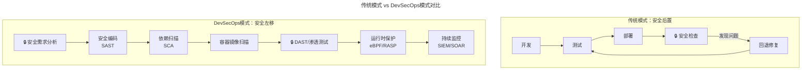
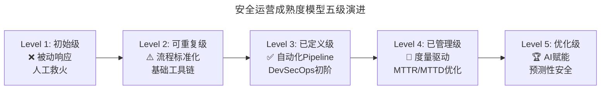

> 📅 **原文发布**：2018-2019 | **本次更新**：2025-06 | **更新等级**：🔴全面重写增强
> 📌 **v2 结构化升级**：2026-08 | **升级范围**：补齐 6 节标准骨架、Mermaid 图加标题、术语英文对照、参考资料融入进阶延展

# 31 | 唇亡齿寒，运维与安全 —— 从被动响应到DevSecOps主动防御体系

## 一、导言

故障管理模块告一段落了，本文将分享运维安全的内容。在日常工作中，运维团队和安全团队的配合确实是非常紧密的，有非常多的交集，本文将以整体视角进行分享，以激发更多的讨论和思考。

在传统的运维模式中，安全往往是事后检查的角色——系统上线前做一次漏洞扫描，出了事故再紧急响应。而在云原生时代，随着容器化、微服务、Serverless架构的普及，攻击面呈指数级扩大。一个容器镜像中的恶意依赖包、一个Kubernetes API Server的未授权访问、一条被篡改的CI/CD Pipeline配置……任何一环的疏忽都可能导致灾难性后果。

**核心立场**：运维不能只是被动响应，而应该主动与安全合作，共建安全体系，与运维体系融合，把防线建设好，从源头控制。这正是 **DevSecOps（Development Security & Operations，开发-安全-运营一体化）** 核心理念的体现——将安全左移（Shift Left），让安全成为开发生命周期每个环节的内建能力，而不是事后的补丁。

---

## 二、核心方法论

### 运维和安全的关系：从"难兄难弟"到命运共同体

运维和安全，双方有一个共同的特点，就是时常要面对非常棘手，甚至是影响公司口碑声誉的问题。对于安全来说，这一点尤甚——2021年LinkedIn数据泄露影响7亿用户、2022年LastPass事件导致加密密码库被盗、2024年Change Healthcare勒索软件攻击影响全美医疗系统……每一次安全事故都是对企业信任的毁灭性打击。

运维和安全的合作，最初都是在这种场景下触发的。另外一层关系，正如本文分享的题目所示——**唇亡齿寒**。安全是整个业务和技术体系的一道防线，当这道防线被突破，最直接的影响和损失就体现在主机、系统和数据上，而这些又正好是运维的范畴。一旦发生了安全事故，造成的影响以及后续的修复工作都将由运维来承担。

### DevSecOps：安全左移的范式转变



同时，安全问题和需求一般都会放置在较高优先级上来响应，并通过固定的问题响应机制实行联动，从而实现最高效的配合响应。在现代安全运营中心（SOC, Security Operations Center）中，这种联动已经通过 **SOAR（Security Orchestration, Automation and Response，安全编排自动化与响应）** 平台实现了自动化编排。

### 现代云原生安全体系全景图

上述提到的很多检测和限制规则，都会通过规则平台沉淀下来。在2025年的云原生环境下，这套体系已经演变为以下架构：

```mermaid
---
title: 现代云原生安全体系全景图
---
graph TB
    subgraph 开发阶段["开发阶段：安全左移"]
        direction LR
        A1[安全需求建模<br/>Threat Modeling] --> A2[SAST静态扫描<br/>Semgrep/CodeQL]
        A2 --> A3[SCA依赖扫描<br/>Snyk/Trivy]
        A3 --> A4[SBOM生成<br/>SPDX/CycloneDX]
        A4 --> A5[签名验证<br/>Sigstore/cosign]
    end

    subgraph 构建阶段["构建阶段：供应链安全"]
        direction LR
        B1[镜像扫描<br/>Trivy/Grype] --> B2[IaC安全扫描<br/>Checkov/Terrascan]
        B2 --> B3[Secrets检测<br/>GitLeaks/Gitleaks]
        B3 --> B4[策略门禁<br/>OPA/Rego]
    end

    subgraph 运行时阶段["运行时阶段：深度防御"]
        direction LR
        C1[CNI网络安全<br/>Cilium/Calico] --> C2[eBPF运行时安全<br/>Falco/Tetragon]
        C2 --> C3[容器逃逸检测<br/>Runtime Security] --> C4[WAAP/API安全<br/>Cloudflare/AWS WAF]
        C4 --> C5[SIEM/SOAR<br/>Splunk/CrowdStrike]
    end

    subgraph 基础设施["基础设施：零信任"]
        direction LR
        D1[ZTNA零信任访问<br/>Tailscale/Cloudflare] --> D2[PAM特权管理<br/>CyberArk/HashiCorp Vault]
        D2 --> D3[身份认证<br/>OIDC/OAuth2/SAML]
        D3 --> D4[密钥管理<br/>KMS/HSM]
    end

    subgraph 合规治理["合规与治理"]
        E1[Policy as Code<br/>OPA/Gatekeeper] --> E2[合规基线<br/>CIS Benchmark]
        E2 --> E3[审计日志<br/>合规报告]
        E3 --> E4[数据分类分级<br/>DLP]
    end
```



---

## 三、关键流程

### 原始安全体系七步法 → 现代云原生安全演进

#### 1. 入网管控（Zero Trust Network Access，零信任网络访问）

这是VPN接入的管控，并与员工的统一登录鉴权结合，做到一键登录。因为VPN接入后，就等于进入了线上的网络环境中，可以访问到很多敏感系统和数据，这里的入网管控就相当于整个环境的第一道防线。

> **2025年演进：** 传统的VPN+堡垒机模式正在向 **ZTNA（Zero Trust Network Access，零信任网络访问）** 演进。现代方案如Cloudflare Access、Zscaler ZPA、Tailscale等，基于"永不信任、始终验证"原则，不再依赖网络边界作为安全防线。每次资源访问都进行动态身份验证和设备健康检查，即使凭证被盗，攻击者也无法横向移动。

#### 2. 堡垒机（PAM - Privileged Access Management，特权访问管理）

当接入VPN之后，对于技术人员就会有进一步的需求，比如访问线下和线上环境，登录主机和网络设备做维护工作，这时就需要有另外一道关卡，就是硬件或虚拟设备的登录管控，这个就由堡垒机来实现。这里堡垒机维护的主机列表、主机用户名、权限配置等信息，就需要与运维系统中的CMDB以及运维标准化的内容保持统一。

> **2025年演进：** 堡垒机已演变为 **PAM（Privileged Access Management，特权访问管理）** 平台。除了传统的操作审计和录像回放外，现代PAM还具备：
> - **凭据保险库（Credential Vaulting）**：动态密码注入，杜绝静态密码存储
> - **会话隔离（Session Isolation）**：浏览器内嵌远程桌面，敏感数据不落地
> - **Just-In-Time（JIT）权限**：按需临时授权，自动过期回收
> - **Kubernetes审计集成**：对kubectl操作、Pod exec等进行细粒度审计

#### 3. 主机安全管控（CWPP + eBPF Runtime Security）

在每台主机上运行一个安全Agent，实时地对可疑进程、可疑端口、可疑账号、可疑日志以及各类操作进行监控，一旦发现异常就会及时告警，确保能够第一时间发现异常。

> **2025年重大演进：eBPF革命**
>
> 这是过去5年云安全领域最重要的技术突破。**eBPF（Extended Berkeley Packet Filter，扩展伯克利数据包过滤器）** 允许在Linux内核空间安全地运行沙盒程序，无需修改内核源码或加载内核模块。
>
> | 能力维度 | 传统Agent方案 | eBPF方案 |
> |---------|-------------|---------|
> | 性能开销 | 高（用户态-内核态切换频繁） | 极低（内核态直接执行） |
> | 可见性 | 受限于Hook点 | 全系统可观测（网络/进程/文件系统） |
> | 部署复杂度 | 每台主机安装Agent | 内核级，无Agent或轻量Agent |
> | 绕过难度 | 可被Rootkit绕过 | 极难绕过（运行在内核层） |
> | 维护成本 | 频繁更新签名库 | 基于行为检测，自适应学习 |
>
> **主流eBPF安全工具生态：**
> - **Falco（CNCF毕业项目）**：运行时安全监控，支持150+默认规则，可检测容器逃逸、异常进程启动、敏感文件访问等
> - **Tetragon（Isovalent/Cilium）**：提供进程级可观测性和策略执行，支持tracepoint级别的安全策略
> - **Cilium**：基于eBPF的网络安全和可观测性平台，替代传统iptables，支持L7策略
> - **Tracee（Aqua Security）**：Linux运行时安全和eBPF追踪工具
>
> 典型的eBPF安全检测场景：
> ```
> # Falco规则示例：检测容器内的反向Shell
> - rule: Reverse Shell in Container
>   condition: >
>     container and spawned_process and
>     (proc.name in (shell_binaries) and
>      proc.pname in (shell_binaries) and
>      fd.type = "pipe" and fd.ip in (localhost_networks))
>   output: >
>     Reverse shell detected (user=%user.name command=%proc.cmdline
> %container.id=%container.id)
>   priority: CRITICAL
> ```

#### 4. 黑盒扫描（DAST + ASM，动态应用安全测试 + 攻击面管理）

这个系统主要针对主机上对外开放的端口和使用的服务进行扫描。比如之前遇到的Redis高危端口漏洞，OpenSSL心脏滴血漏洞等，同时从接入层会过滤出高频的url，通过注入或修改消息来模拟恶意攻击。

> **2025年演进：** 黑盒扫描已演变为 **ASM（Attack Surface Management，攻击面管理）** 平台。与传统DAST不同，ASM不仅扫描已知资产，还能：
> - 自动发现影子IT（Shadow IT）和未知资产
> - 持续监测互联网暴露面
> - 基于攻击者视角评估风险优先级
> - 与威胁情报（Threat Intelligence）联动
> - 代表产品：Mandiant ASM、CrowdStrike Falcon Spotlight、ProjectDiscovery Cloud Platform

#### 5. 白盒扫描（代码审计 → SAST + SCA + SBOM）

这个系统在前面的持续交付流水线中介绍过，会针对代码中明显的漏洞进行审计，比如XSS漏洞，SQL注入等问题，如果在代码中存在类似问题是不允许发布上线的。

> **2025年演进：白盒扫描已分化为三大能力：**
>
> **① SAST（Static Application Security Testing，静态应用安全测试）**
> - 工具：SonarQube（含Security Hotspots）、Semgrep、CodeQL（GitHub）、Checkmarx
> - 在IDE和CI Pipeline阶段即发现代码级漏洞
> - 支持自定义规则集，适配企业编码规范
>
> **② SCA（Software Composition Analysis，软件成分分析）**
> - 扫描依赖包中的已知漏洞（CVE）
> - 工具：Snyk、Dependabot、Trivy、Grype
> - 与Registry集成，阻断带漏洞的镜像推送
>
> **③ SBOM（Software Bill of Materials，软件物料清单）**
> - 这是2021年Log4j事件后迅速崛起的安全实践
> - 格式标准：SPDX、CycloneDX、SWID Tag
> - 核心价值：快速响应供应链漏洞（如Log4j，可在分钟内定位所有受影响组件）
> - 签名验证：Sigstore/cosign实现无密钥签名，确保SBOM完整性
> - 合规框架：SLSA（Supply-chain Levels for Software Artifacts）定义软件供应链安全等级

#### 6. WAF → WAAP + Bot管理 + API安全

WAF（Web Application Firewall，Web应用防火墙）用来对外部的Web服务进行保护。对于恶意爬虫、虚假注册、批量优惠券领取等行为，通过WAF的业务规则配置和识别来阻止恶意访问。

> **2025年演进：WAF已升级为WAAP（Web Application and API Protection，Web应用与API保护）平台：**
>
> | 能力 | 传统WAF | 现代WAAP |
> |-----|--------|---------|
> | Web防护 | 基于规则的SQLi/XSS防护 | AI驱动的Bot检测 + 虚拟补丁 |
> | API安全 | 无 | API Schema验证、OAuth/JWT令牌校验、API滥用检测 |
> | Bot管理 | 基础Rate Limiting | 行为生物识别、设备指纹、高级Bot（模拟浏览器）识别 |
> | DDoS防护 | 需单独采购 | 内置L3/L7 DDoS清洗 |
> | 代表产品 | ModSecurity | Cloudflare WAAP、AWS WAFv2+Shield Advanced、Imperva |
>
> 特别值得注意的是 **API安全** 的崛起——Gartner预测"到2025年，API将成为企业最常被攻击的向量"。

#### 7. 应急响应中心SRC → VDP + Bug Bounty + Threat Hunting

在安全界，有这样一个不成文的说法，叫作 **三分靠技术，七分靠人脉**，也就是安全的信息情报有时比单纯的技术攻防要重要得多。

> **2025年演进：SRC已经发展为成熟的漏洞赏金计划（Bug Bounty）和负责任披露政策（VDP, Vulnerability Disclosure Policy）体系：**
> - 平台：HackerOne、Bugcrowd、YesWeHack（合规聚焦）
> - 企业案例：腾讯安全应急响应中心（TSRC）年度发放奖金超千万；阿里ASRC覆盖集团全部业务线
> - 新增能力：**威胁狩猎（Threat Hunting）** —— 主动搜索IOC（Indicators of Compromise），在攻击发生前发现潜伏的APT组织
> - 威胁情报平台（TIP）：整合多源情报，自动关联告警

---

## 四、工具与实战

### 1. Policy as Code（PaC，策略即代码）：DevSecOps落地的核心基础设施

通过 **OPA（Open Policy Agent，开放策略代理）** 及其Rego策略语言，将安全合规要求转化为可版本控制、可自动化执行的代码：

```rego
# OPA策略示例：禁止以root用户运行容器
package kubernetes.admission

deny[msg] {
    input.request.kind.kind == "Pod"
    container := input.request.object.spec.containers[_]
    not container.securityContext.runAsNonRoot == true
    msg := sprintf("Container '%s' must not run as root", [container.name])
}

# 强制所有Pod都必须包含resource limits
deny[msg] {
    input.request.kind.kind == "Pod"
    container := input.request.object.spec.containers[_]
    not container.resources.limits
    msg := sprintf("Container '%s' must have resource limits", [container.name])
}
```

**主流PaC工具对比：**

| 工具 | 适用场景 | 特点 |
|------|---------|------|
| **OPA + Gatekeeper** | Kubernetes准入控制 | CNCF项目，社区最活跃 |
| **Kyverno** | Kubernetes原生策略 | 声明式YAML，学习成本低 |
| **Sentinel** | Terraform IaC策略 | HashiCorp官方，与TF深度集成 |
| **Checkov** | 多云IaC安全 | Bridgecrew开源，内置策略覆盖 Terraform/CloudFormation/K8s 等 |
| **Conftest** | 通用配置策略 | 基于OPA，支持多种格式 |

### 2. GitOps安全：声明式安全策略交付

结合ArgoCD或Flux，将安全策略像应用程序代码一样通过Git进行版本控制和自动化同步：

```
gitops-security-repo/
├── policies/
│   ├── kubernetes/
│   │   ├── require-labels.rego
│   │   ├── disallow-latest-tag.rego
│   │   └── pod-security-standards.rego
│   ├── terraform/
│   │   ├── enforce-encryption.rego
│   │   └── restrict-regions.rego
│   └── network/
│       ├── allow-egress-only.rego
│       └── deny-private-ip-ingress.rego
├── sbom/                    # SBOM文件存储
└── compliance/              # 合规基线定义
    ├── cis-benchmark.yaml
    └── gdpr-controls.yaml
```

### 3. 数据安全与隐私合规

随着《个人信息保护法》（PIPL）、《数据安全法》、GDPR等法规的实施，数据安全已成为运维安全不可分割的一部分：

| 法规/标准 | 适用范围 | 核心要求 | 违规后果 |
|----------|---------|---------|---------|
| **GDPR** | 欧盟公民数据处理 | 数据最小化、被遗忘权、DPO任命 | 最高全球营收4%或2000万欧元 |
| **PIPL** | 中国境内个人信息处理 | 单独同意、本地化存储、跨境传输评估 | 最高5000万元或营收5% |
| **数据安全法** | 中国境内数据处理活动 | 分类分级保护、重要数据目录、风险评估 | 最高1000万元 |
| **SOC 2 Type II** | 服务组织（国际通用） | 安全性、可用性、完整性、保密性、隐私性 | 失去客户信任、合同违约 |

**技术应对措施：**
- **DLP（Data Loss Prevention，数据丢失防护）**：Symantec DLP、Microsoft Purview、Nightfall AI（AI驱动，支持SaaS）
- **数据脱敏**：动态脱敏中间件（Apache ShardingSphere）、静态脱敏ETL
- **加密技术**：BYOK（Bring Your Own Key）、格式保留加密（FPE）、同态加密（实验阶段）
- **数据分类分级**：自动识别PII/PHI/PCI数据，打标并实施差异化保护策略

### 4. 安全运营成熟度模型

根据Gartner的定义，企业的安全运营能力可以分为五个等级：



**关键度量指标（KRI, Key Risk Indicator）：**
- **MTTD（Mean Time to Detect）**：平均检测时间，目标 < 1小时
- **MTTR（Mean Time to Respond）**：平均响应时间，目标 < 4小时
- **Patch Compliance Rate**：补丁合规率，目标 > 95%（关键漏洞24小时内）
- **Vulnerability SLA**：严重漏洞修复SLA，Critical: 24h / High: 7d / Medium: 30d
- **Security Debt**：安全债务，衡量技术债中的安全部分

### 5. 成本与合规考量

**💰 成本考量**

建立完善的安全体系需要投入，但这个投入应该被视为 **保险而非成本**：

| 安全投入项 | 年度预算参考（中型企业） | ROI体现 |
|-----------|-------------------|--------|
| 安全团队（5-8人） | 200-400万 | 避免数据泄露平均损失（450万美元/次）|
| 安全工具平台 | 100-200万 | 自动化减少人力成本60%+ |
| 渗透测试/Bug Bounty | 30-80万 | 外部视角发现盲区 |
| 安全培训 | 10-30万 | 减少人为失误导致的80%安全事件 |

> **FinOps建议：** 将安全成本纳入云成本统一治理。许多云安全工具（如AWS GuardDuty、Azure Defender）采用按用量计费模式，需设置预算预警避免意外支出。

**⚖️ 合规提醒**

1. **等保2.0（GB/T 22239-2019）**：国内企业必须满足的基本要求，三级以上需年度测评
2. **MLPS（网络安全等级保护）**：关键信息基础设施运营者（CIIO）的特殊义务
3. **跨境数据传输**：通过网信办安全评估或完成标准合同备案（SCC）
4. **行业监管**：金融（JR/T 0197-2020）、医疗（HL7 FHIR）、电信等行业特定标准

---

## 五、常见误区

### 误区1：将安全视为"事后补丁"而非"内生能力"

**错误表现**：等到上线前才做漏洞扫描，发现问题时已临近发布，修复成本极高。

**正确做法**：贯彻"Shift Left"原则，从需求阶段即引入威胁建模（Threat Modeling），在编码、构建、测试、部署、运行各环节内建安全能力。

### 误区2：过度依赖网络边界防护

**错误表现**：认为在内网就安全，忽视身份认证和细粒度授权。

**正确做法**：采用零信任架构（Zero Trust），"永不信任、始终验证"，对所有访问请求进行身份、设备、上下文的动态验证。

### 误区3：忽视软件供应链安全

**错误表现**：盲目引入第三方依赖而不做SCA扫描，导致Log4j式的供应链漏洞无法快速响应。

**正确做法**：建立SBOM（软件物料清单）流程，对每个发布产物进行签名验证（Sigstore/cosign），实现漏洞发生时的分钟级定位。

### 误区4：安全工具堆砌而缺乏策略统一

**错误表现**：购买了各种安全工具，但策略分散、各自为战，告警噪声大。

**正确做法**：通过Policy as Code统一策略语言，结合SIEM/SOAR实现告警聚合与自动化响应，将MTTD/MTTR作为核心度量指标。

### 误区5：重技术轻流程，忽视人的因素

**错误表现**：技术工具齐全，但缺乏安全意识培训，员工仍会点击钓鱼邮件、弱口令、共享凭证。

**正确做法**：将安全培训纳入Onboarding流程，定期进行钓鱼演练，将安全行为纳入绩效考核，建立"Security Champions"机制让安全文化下沉到各业务团队。

---

## 六、进阶延展

### 核心观点回顾

1. **运维和安全是命运共同体**——安全事件最终由运维承担后果，必须主动融合
2. **DevSecOps不是口号**——需要SAST/SCA/DAST/eBPF/PaC等技术栈的系统性建设
3. **eBPF是游戏规则改变者**——内核级可见性和安全性，性能开销极低
4. **供应链安全刻不容缓**——Log4j事件证明，没有SBOM就等于裸奔
5. **合规是底线不是上限**——GDPR/PIPL/等保2.0要求企业建立可审计的安全体系

### 给运维团队的建议行动清单

- [ ] 评估当前安全工具链，识别Gap（推荐使用NIST Cybersecurity Framework）
- [ ] 在CI/CD Pipeline中集成SAST + SCA + 镜像扫描（目标：阻断率100%）
- [ ] 部署eBPF运行时安全工具（Falco/Tetragon），开启核心规则集
- [ ] 建立SBOM生成流程，选择SPDX或CycloneDX格式
- [ ] 引入Policy as Code工具（推荐Kyverno for K8s，Checkov for IaC）
- [ ] 制定安全事件响应 playbook，定期演练（季度至少1次）
- [ ] 建立安全度量仪表盘，追踪MTTD/MTTR/Vulnerability SLA

### 推荐学习资源

#### DevSecOps 核心实践
- 📖 **必读**：《DevSecOps Handbook》- 自动化安全左移的标准参考
- 📖 **进阶**：《Practical Cloud Security》- O'Reilly云安全实战
- 🛠️ **实践**：OWASP DevSecOps Maturity Model (dsomm.owasp.org)

#### eBPF 与云原生安全
- 📖 **书籍**：《Linux Observability with BPF》- eBPF技术权威指南
- 🛠️ **工具**：Falco官方文档、Cilium官方教程
- 🎥 **视频**：KubeCon eBPF Security Track

#### 供应链安全与SBOM
- 📄 **标准**：SPDX规范、CycloneDX规范、SLSA Framework
- 🛠️ **工具**：Syft（SBOM生成）、cosign（签名）、Sigstore
- 📋 **政策**：美国EO 14028行政令关于供应链安全的要求

#### 合规与法规
- 📋 **国内**：《数据安全法》《个人信息保护法》《网络安全法》全文及解读
- 📋 **国际**：GDPR全文、SOC 2 Trust Services Criteria
- 🏛️ **认证**：ISO 27001、ISO 27017（云安全）、ISO 27018（云隐私）

#### 安全运营与SOAR
- 📖 **书籍**：《Security Operations Center》- SOC建设实践
- 🛠️ **平台**：Splunk SOAR（原 Phantom）、Cortex XSOAR、Tines
- 🎓 **认证**：GIAC GCIA、GCFA、GCIH

如果今天的内容对你有帮助，也欢迎你分享给身边的朋友。
