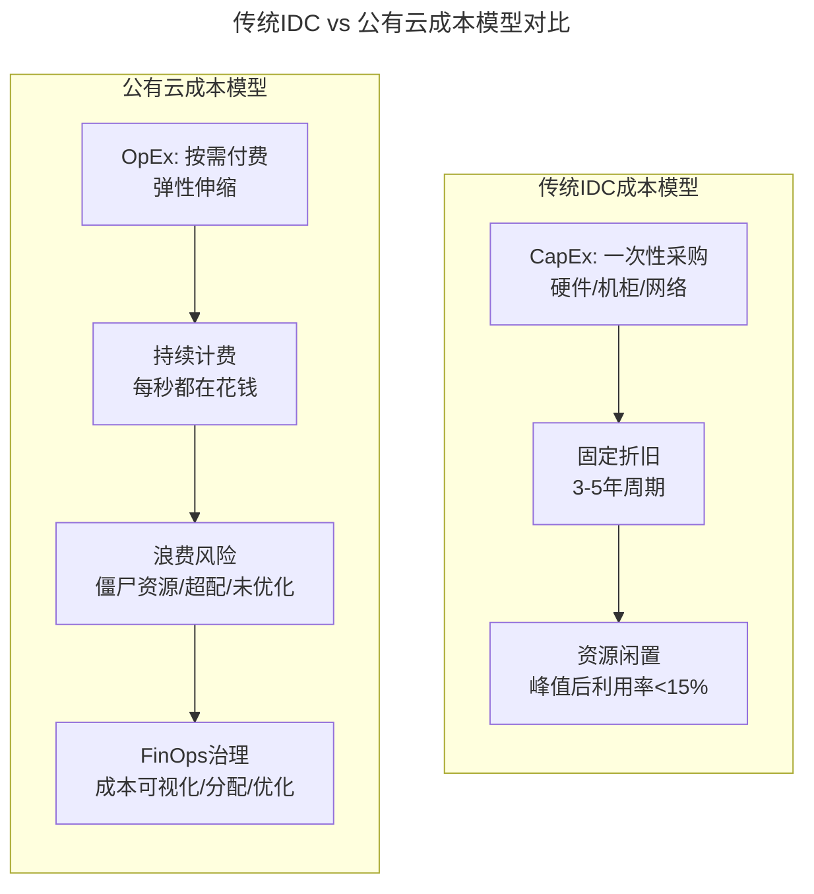
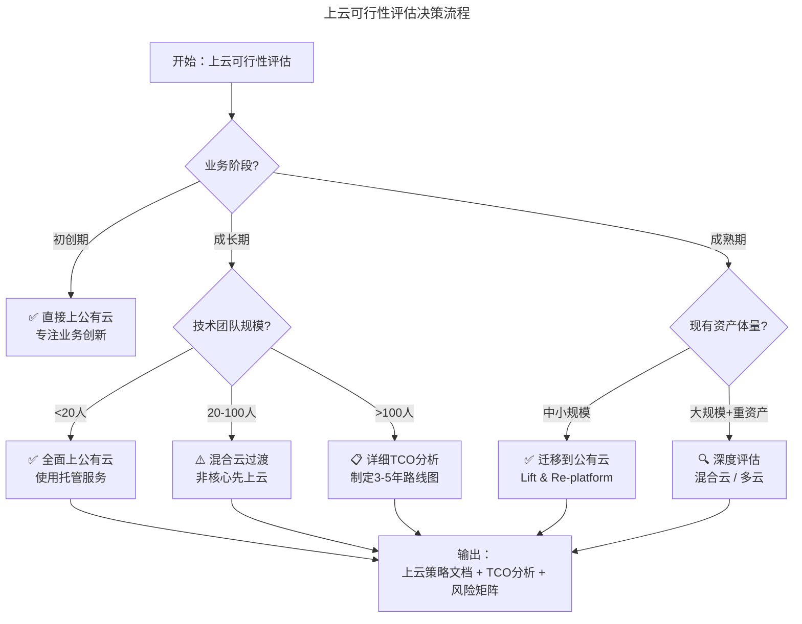
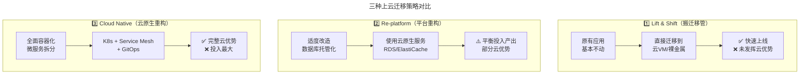
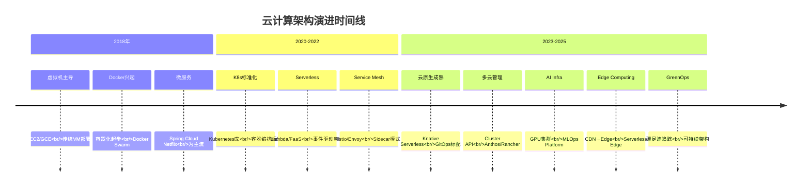
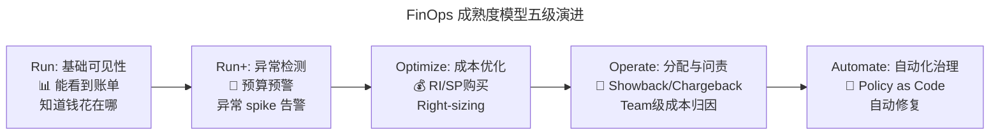

> 📅 **原文发布**：2018-2019 | **本次更新**：2025-06 | **更新等级**：🔴全面重写增强
> 📌 **v2 结构化升级**：2026-08 | **升级范围**：补齐 6 节标准骨架、Mermaid 图加标题、术语英文对照、参考资料融入进阶延展

# 32 | 为什么选择上云？—— 从成本困境到FinOps驱动的云原生战略

## 一、导言

2018年1月22日凌晨，我们美丽联合集团旗下的蘑菇街和美丽说的业务，整体搬迁到腾讯云，完成了从托管IDC模式，到腾讯云上混合云模式的转变。

云计算发展到今天，无论是在技术、服务层面，还是在商业层面都已经相对成熟。当前绝大多数初创公司在基础设施上的策略一定是公有云，已经极少再有自建或托管IDC的情况。

但是对于蘑菇街这样体量的公司，搬迁上云，就必须要考虑得更全面：基础设施的变化、业务的平稳过度、运维模式的转变、成本管控的调整，以及众多的细节问题。

本文将从蘑菇街的视角出发，结合2018年的真实决策过程和2025年的行业实践，聊一聊为什么会做出上云这个选择，以及 **在云成本治理（FinOps）时代，企业应该如何制定上云战略**。

---

## 二、核心方法论

### 1. 我们所面临的问题：2018 vs 2025

#### 1.1 成本闲置问题 → 云成本失控风险

**2018年的痛点：**

对于电商，大促已经常态化，除了"双11""双12"以及"6·18"这样的例行大促，每个电商还会有自己的营销活动。大促，从技术层面就意味着要在短时间内应对远远超过日常的峰值流量，可能是平时的十几倍，甚至是上百倍。

之前，我们在应对"双11"这样的大促时，只能采购更多的设备。与此同时，我们还要在机柜成本以及资源上下架等纯人工方面进行投入，这往往要花费几千万元的成本。但是，每次大促峰值一过，这些设备基本就处于极低的负载状态——基本处于闲置状态。

**2025年的新挑战：云账单休克（Cloud Bill Shock）**

当我们迁移到公有云后，很快发现了一个新的问题：**云成本可能比自建IDC更贵**。

根据Flexera 2025年云状态报告：
- **27%的云支出被浪费**——闲置资源、超规格实例、未挂载存储（2024 年为 25%）
- **84%的企业将云成本管理列为首要挑战**——浪费的云支出已超过安全，成为企业最关心的云问题（46%）
- **61%的企业成本优化工作初见成效**——优化存量资源使用（65%）与 Right-sizing（61%）是两大重点
- **仅 28% 的企业认为其 FinOps 实践是成功的**

> **真实案例：** 某知名电商平台迁移到AWS后，首月账单高达预期3倍。原因包括：测试环境资源未及时释放（含预留实例到期自动续订）、选用了过度规格的实例类型、数据传输跨区域费用未预估。



#### 1.2 基础设施维护问题 → 多云管理复杂度

**2018年的痛点：** 选择租用或托管IDC模式，随着业务量增长会遇到一系列问题——IDC机房的选址、机房扩展问题、资源利用率问题（即使虚拟化，CPU资源使用率一般也就在10%-15%左右）。

**2025年的演进：多云与边缘计算的复杂度**

| 复杂度维度 | 2018年 | 2025年 |
|----------|--------|--------|
| 基础设施形态 | 单一IDC / 单一公有云 | 多公有云 + 私有云 + 边缘节点 |
| 编排工具 | Ansible / 手工脚本 | Kubernetes + Terraform + GitOps |
| 网络拓扑 | 静态BGP / 专线 | SD-WAN + Service Mesh + eBPF CNI |
| 身份认证 | LDAP / 本地账号 | OIDC / SAML / 零信任 |
| 合规要求 | 等保1.0 | 等保2.0 + GDPR + PIPL + 行业监管 |

> **核心矛盾：** 上云解决了物理基础设施的维护问题，但引入了 **云基础设施的治理问题**。如何在多云环境中保持一致性？如何避免厂商锁定（Vendor Lock-in）？这些催生了 **IaC（Infrastructure as Code，基础设施即代码）** 和 **GitOps** 的广泛采用。

#### 1.3 底层技术投入和人才的问题 → 云原生技能转型

**2025年的演进：云原生工程师成为刚需**

| 技能维度 | 2018年需求 | 2025年需求 |
|---------|-----------|-----------|
| 操作系统 | Linux内核调优 | 容器运行时（containerd/CRI-O）+ eBPF |
| 虚拟化 | KVM / VMware / OpenStack | Kubernetes + 虚拟Kubelet + KubeVirt |
| 网络 | iptables / SDN | Cilium / Calico (CNI) + Service Mesh (Istio) |
| 存储 | Ceph / NFS | CSI驱动 + 云原生存储（Rook/Longhorn）|
| 编排 | Ansible / SaltStack | Terraform / Pulumi / Crossplane + ArgoCD |
| 可观测性 | Zabbix / Nagios | Prometheus + Grafana + OpenTelemetry |

### 2. 决策框架：如何科学评估上云可行性

基于蘑菇街2018年的决策经验和2025年的行业最佳实践，总结出以下评估框架：



---

## 三、关键流程

### 1. TCO（Total Cost of Ownership，总拥有成本）分析框架

在做上云决策时，必须进行全面的TCO对比，不能只看表面价格：

| 成本类别 | 自建IDC | 公有云 | 备注 |
|---------|---------|--------|------|
| **CapEx（资本支出）** | | | |
| 硬件采购 | ★★★★★ | 无 | 服务器、存储、网络设备 |
| 机房租赁 | ★★★★☆ | 无 | 含电力、空调、消防 |
| 初期实施 | ★★★☆☆ | 低 | 迁移、集成、培训 |
| **OpEx（运营支出）** | | | |
| 运维人力 | ★★★★★ | ★★☆☆☆ | 公有云减少70%+运维工作量 |
| 电力空调 | ★★★★☆ | 包含 | PUE通常2.0-2.5 |
| 带宽费用 | ★★★☆☆ | ★★★★☆ | 公有云带宽单价低但总量可控 |
| 软件许可 | ★★★☆☆ | ★★★☆☆ | 按需付费vs永久授权 |
| **隐性成本** | | | |
| 机会成本 | 高 | 低 | 团队聚焦业务vs基础设施 |
| 扩展灵活性 | 差 | 极好 | 应对突发流量能力 |
| 技术债务 | 高 | 中 | 技术栈现代化程度 |
| 合规风险 | 自担 | 共担 | 数据主权、安全合规 |

> **经验法则：** 对于年营收低于10亿人民币的企业，公有云几乎总是更经济的选择；对于超大规模企业（如字节跳动、阿里），自建或混合云可能在特定场景下更具成本优势。

### 2. 上云策略选择：Lift & Shift vs Cloud Native



| 维度 | Lift & Shift | Re-platform | Cloud Native |
|------|-------------|-------------|--------------|
| **迁移周期** | 1-3个月 | 3-6个月 | 6-18个月 |
| **初期投入** | 低 | 中 | 高 |
| **长期收益** | 低（仅省运维） | 中（省运维+弹性） | 高（全栈优化） |
| **风险等级** | 低 | 中 | 高 |
| **适用场景** | 快速下线IDC | 渐进式迁移 | 新业务/Greenfield |
| **组织要求** | 变革小 | 中等变革 | 全面敏捷转型 |

> **蘑菇街的经验：** 我们采用的是 **渐进式策略**——首先Lift & Shift到腾讯云物理机（保障稳定性），然后逐步Re-platform（无状态服务上容器），最终向Cloud Native演进。这种"先跑起来，再逐步优化"的策略，对于大规模存量系统是最稳妥的选择。

### 3. 纵观技术发展趋势：2018 → 2025

**云计算架构演进图景：**



**2025年Serverless生态已大幅扩展：**

| Serverless形态 | 代表产品 | 适用场景 | 计费模式 |
|---------------|---------|---------|---------|
| **FaaS** | AWS Lambda / Azure Functions / 阿里函数计算 | 事件驱动、短生命周期任务 | 请求数 × 执行时间 |
| **Container Serverless** | AWS Fargate / Azure Container Instances / 阿里ECI | 容器工作负载，无需管理节点 | vCPU × 内存 × 时间 |
| **Database Serverless** | Aurora Serverless / DynamoDB on-demand / PolarDB Serverless | 弹性数据库，自动伸缩 | 基于实际容量 |
| **Storage Serverless** | S3 Intelligent-Tiering / OSS智能分层 | 对象存储，自动冷热分层 | 按实际使用量 |
| **Edge Serverless** | Cloudflare Workers / Lambda@Edge / Vercel Edge Functions | 边缘计算，全球就近执行 | 请求数 |
| **Knative Serving** | Knative on K8s | K8s原生Serverless | 基于Pod实际运行时间 |

### 4. 人工智能对云计算能力的释放

**2025年的AI Infrastructure爆发：**

| AI工作负载 | 典型配置 | 月成本参考（AWS） | 优化建议 |
|-----------|---------|------------------|---------|
| LLM微调（7B参数） | 8×A100 80GB | ~$50,000 | 使用Spot实例节省60%+ |
| 推理服务（API） | 4×A10G / Inferentia2 | ~$8,000 | Autoscaling + 模型量化 |
| 向量数据库 | R6i.4xlarge + pgvector | ~$2,000 | 选择合适实例族 |
| MLOps平台 | SageMaker / Vertex AI | ~$5,000-20,000 | 利用Free Tier和PoC额度 |

> **注**：上表月成本为数量级参考，随实例族、区域与折扣策略（RI/Savings Plans/Spot）波动较大，应以实际账单为准。

> **重要趋势：** 2024-2025年，**GPU云成本下降**得益于：AMD MI300系列竞争、国产GPU（华为昇腾、寒武纪）崛起、模型压缩/量化技术进步。但同时，模型规模指数级增长使得总成本仍在攀升。**FinOps for AI** 成为新兴细分领域。

---

## 四、工具与实战

### 1. FinOps：云时代的成本治理之道

既然选择了上云，就必须建立完善的 **FinOps（Financial Operations，云财务运营）** 体系。FinOps不是简单的"省钱"，而是 **将财务 accountability 引入DevOps流程，实现工程速度、业务价值和成本效率的三赢**。

#### FinOps成熟度模型



#### FinOps核心实践

**① 成本可视化（Visibility）**

| 工具 | 适用场景 | 特点 |
|------|---------|------|
| **云厂商原生** | AWS Cost Explorer / Azure Cost Management / 阿里云费用中心 | 免费，基础功能够用 |
| **多云聚合** | CloudHealth (VMware) / Apptio Cloudability / Spot by NetApp | 统一视图，支持多云对比 |
| **开源方案** | OpenCost / Kubecost / Cloud Pricing Calculator | 社区驱动，可自托管 |
| **Kubernetes粒度** | Kubecost / OpenCost | Pod/Namespace/Deployment级别成本分摊 |

**② 成本优化战术（Quick Wins）**

按ROI排序的成本优化措施：

| 优化项 | 预期节省 | 实施难度 | 优先级 |
|-------|---------|---------|--------|
| 关闭僵尸资源（闲置实例/未挂载EBS） | 15-25% | ⭐ | 🔴 最高 |
| Right-sizing（规格合理化） | 10-20% | ⭐⭐ | 🔴 高 |
| 购买Reserved Instances/Savings Plans | 30-70%（vs On-Demand） | ⭐⭐ | 🔴 高 |
| 使用Spot/Preemptible实例 | 60-90%（vs On-Demand） | ⭐⭐⭐ | 🟡 中 |
| 存储分层（S3 Intelligent-Tiering） | 20-40% | ⭐⭐ | 🟡 中 |
| 架构优化（Serverless/Graviton） | 20-50% | ⭐⭐⭐⭐ | 🟢 低 |

**③ 成本分配与问责（Chargeback/Showback）**

将云成本精确分配到业务线、项目甚至单个Feature：

```yaml
# Kubernetes资源标注示例：用于成本追踪
apiVersion: v1
kind: Pod
metadata:
  name: order-service-pod
  labels:
    team: ecommerce          # 团队维度
    service: order-service   # 服务维度
    environment: production  # 环境维度
    cost-center: "cc-1001"   # 成本中心
    project: "PRJ-2025-Q2"   # 项目维度
    owner: "@zhangsan"       # 责任人
```

**④ FinOps文化落地**

FinOps不仅是工具，更是文化变革：
- **Engineering + Finance协作**：每月FinOps Review会议，Tech Lead和Finance共同参与
- **Unit Economics思维**：每个服务都要知道自己的"单次请求成本"
- **成本预算纳入OKR**：将成本效率作为工程团队的考核指标
- **自助服务门户**：开发者可以自查成本影响，无需等待审批

### 2. 没有银弹 —— 上云后的新挑战

**2025年云用户面临的核心挑战：**

| 挑战 | 描述 | 应对策略 |
|------|------|---------|
| **成本失控** | OpEx模式下持续计费，容易超预算 | FinOps体系 + 预算预警 + 自动化优化 |
| **厂商锁定（Vendor Lock-in）** | 深度绑定某云厂商专有服务 | 采用开源标准（K8s/Terraform）+ 多云抽象层 |
| **技能缺口** | 云原生技术栈学习曲线陡峭 | 内部培训 + 认证激励 + 外部咨询 |
| **安全责任共担** | 云厂商只管"of Cloud"，用户负责"in Cloud" | CSPM（云安全态势管理）+ DevSecOps |
| **合规复杂性** | 数据跨境、行业监管、区域法规 | 合规团队 + 法律顾问 + 技术控制（数据本地化）|
| **可观测性碎片化** | 多云环境下日志/指标/链路分散 | OpenTelemetry统一采集 + 可观测性平台 |
| **架构漂移** | 各团队自由选用不同云服务，导致架构混乱 | 架构治理委员会 + Platform Engineering团队 |
| **GreenOps压力** | 碳排放披露要求，ESG评级影响融资 | 碳足迹追踪 + 绿色架构设计 + Spot实例优先 |

> **笔者的观点：无论在技术、产品以及服务上，它们并不是一蹴而就的，而是各方面都需要一个逐步积累、磨合和摸索的过程，这就需要云计算厂商与业务客户共同努力，朝着同一个目标前进，需要彼此多一些耐心。**

### 3. 云服务商对比（2025年版）

| 能力维度 | AWS | Azure | Google Cloud | 阿里云 | 华为云 |
|---------|-----|-------|-------------|--------|--------|
| **市场份额（全球）** | #1 (~32%) | #2 (~23%) | #3 (~11%) | #4 (~5%) | Others |
| **中国市场** | #3 | #4 | #5 | #1 (~34%) | #2 |
| **K8s服务** | EKS (成熟) | AKS (企业友好) | GKE (最强) | ACK (国内最佳) | CCE |
| **Serverless** | Lambda (最丰富) | Functions | Cloud Run (Knative) | 函数计算 | FunctionGraph |
| **AI/ML** | SageMaker | Azure ML | Vertex AI (TPU) | PAI (通义千问) | ModelArts (昇腾) |
| **数据库** | Aurora/DynamoDB | SQL DB/CosmosDB | Cloud Spanner/Firestore | PolarDB/OceanBase | GaussDB |
| **FinOps工具** | Cost Explorer | Cost Mgmt | Cloud Billing | 成本中心 | 成本中心 |
| **合规认证** | 最全面 | 企业级强 | GDPR友好 | 国内合规强 | 政企/信创 |
| **价格竞争力** | 中等 | 中等偏高 | 偏高 | 国内最优 | 政企折扣大 |
| **适合场景** | 全球业务/创业公司 | 企业级/Microsoft生态 | 数据分析/AI | 中国市场/出海 | 政企/信创/鲲鹏 |

---

## 五、常见误区

### 误区1：认为"上云一定比自建便宜"

**真相**：上云短期内确实省去了硬件采购成本，但长期看，如果不做FinOps治理，云账单可能远超IDC。30%的云支出被浪费是常态。

**对策**：上云前做TCO分析，上云后建立FinOps体系，将成本优化作为持续性工作。

### 误区2：把Lift & Shift当作终点

**真相**：原样迁移到云VM虽然快速，但无法享受云的弹性、托管服务、Serverless等核心优势，长期看技术债越积越多。

**对策**：Lift & Shift只是起点，规划好后续的Re-platform和Cloud Native演进路径。

### 误区3：单一云厂商深度绑定

**真相**：使用云厂商专有服务（如Aurora、BigQuery）虽然方便，但迁移成本极高，议价能力丧失。

**对策**：核心架构采用开源标准（K8s、Terraform、Prometheus），保留可迁移性；非核心场景可以使用专有服务。

### 误区4：忽视云安全责任共担模型

**真相**：云厂商只负责"of Cloud"（基础设施），用户负责"in Cloud"（应用、数据、配置）。很多企业误以为上了云就安全了。

**对策**：明确责任边界，部署CSPM、DevSecOps流程，对应用和数据安全负全责。

### 误区5：盲目追求最新技术

**真相**：Serverless、Service Mesh、eBPF等技术虽好，但不是所有场景都需要。盲目引入新技术会增加复杂度和学习成本。

**对策**：根据业务场景和技术团队能力做选型，遵循"先解决痛点，再引入新技术"的原则。

---

## 六、进阶延展

### 给准备上云的企业的行动清单

**📋 上云前准备**
- [ ] 完成 **TCO分析**（至少覆盖3年周期）
- [ ] 进行 **应用盘点和依赖关系梳理**（推荐使用Monoskope等工具）
- [ ] 识别 **数据分类分级**（哪些可以上云，哪些必须本地）
- [ ] 评估 **合规要求**（等保、行业监管、数据出境）
- [ ] 制定 **迁移优先级矩阵**（按业务价值和技术风险排序）

**🏗️ 上云中执行**
- [ ] 选择合适的 **迁移策略**（Lift & Shift → Re-platform → Cloud Native渐进式）
- [ ] 建立 **FinOps机制**（成本可视化 → 分配 → 优化 → 自动化闭环）
- [ ] 实施 **IaC + GitOps**（Terraform + ArgoCD，一切即代码）
- [ ] 构建 **可观测性体系**（OpenTelemetry + Prometheus + Grafana）

**🔄 上云后运营**
- [ ] 定期进行 **Well-Architected Review**（AWS/Azure/阿里云都有对应框架）
- [ ] 持续 **成本优化**（季度Review，关注RI/SP利用率、僵尸资源）
- [ ] 开展 **混沌工程**（Chaos Engineering，验证弹性）
- [ ] 关注 **新技术趋势**（Serverless、Edge Computing、AI Infra）

### 推荐学习资源

#### FinOps 与云成本治理
- 📖 **必读**：《Cloud FinOps》(O'Reilly, 2023) - FinOps Foundation官方出版物
- 🏢 **认证**：FinOps Certified Practitioner（FinOps Foundation）
- 🛠️ **工具**：Kubecost、OpenCost、AWS Cost Explorer、CloudHealth
- 📊 **报告**：Flexera State of the Cloud（年度云状态报告）

#### 云架构与迁移
- 📖 **书籍**：《AWS Well-Architected Framework》、《Cloud Native Patterns》
- 🎓 **认证**：AWS Solutions Architect Professional / Azure Architect Expert
- 📋 **框架**：AWS Migration Evaluator、Azure Migration Guide

#### 多云与混合云
- 📖 **书籍**：《Multi-Cloud Architecture》
- 🛠️ **工具**：Terraform、Crossplane、Cluster API、Anthos、Rancher
- 📄 **标准**：CNCF多集群SIG白皮书

#### AI Infrastructure
- 📖 **资源**：AWS/Azure/GCP AI服务文档
- 🛠️ **工具**：SageMaker、Vertex AI、Kubeflow、Ray on K8s
- 📊 **趋势**：GPU成本优化、模型量化、边缘AI

如果今天的内容对你有帮助，也欢迎你分享给身边的朋友。
