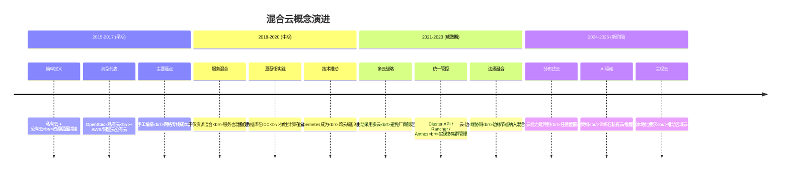
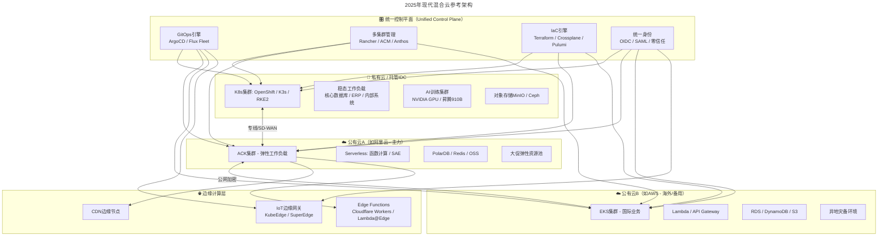
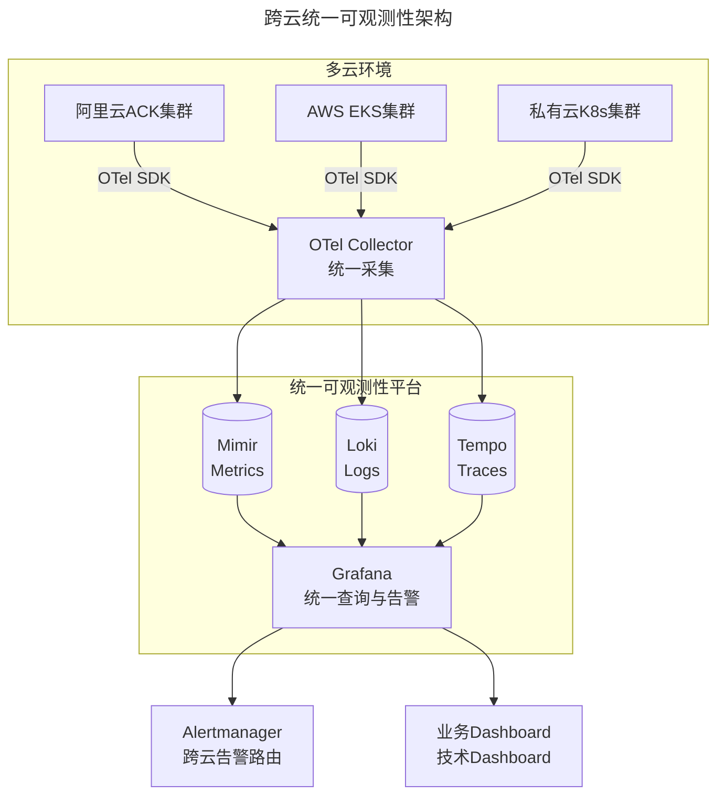

> 📅 **原文发布**：2018-2019 | **本次更新**：2025-06 | **更新等级**：🔴全面重写增强
> 📌 **v2 结构化升级**：2026-08 | **升级范围**：补齐 6 节标准骨架、Mermaid 图加标题、术语英文对照、参考资料融入进阶延展

# 33 | 为什么混合云是未来云计算的主流形态？—— 从手工编排到Kubernetes跨云统一管理

## 一、导言

爆竹声声辞旧岁，今天是大年初一，在此，祝读者新春吉祥，阖家幸福！

前文介绍了蘑菇街之所以选择上云，是基于怎样的全面考量。本文将探讨对于蘑菇街这样有着一定规模体量的产品，在不同时期和不同阶段，对云的使用方式是怎样的。

"混合云"是当下主流但定义宽泛的概念。随着技术趋势的发展，这个概念的内涵和外延也在不断发生着变化。本文将从概念演进、驱动力分析、现代架构参考、跨云管理技术栈等维度，全面梳理2025年的混合云全景。

---

## 二、核心方法论

### 1. 混合云定义的演变



从字面上理解，"混合云"即私有云和公有云的混合搭配，这也是最开始对混合云最简单直接的解释。**但在2025年，混合云的内涵已经远远超出了这个范畴：**

| 维度 | 2018年的理解 | 2025年的理解 |
|------|------------|------------|
| **组成** | 私有云 + 公有云 | 公有云 + 私有云 + 边缘云 + 主权云 + 分布式云 |
| **驱动力** | 被动过渡（存量系统迁移） | 主动策略（合规、成本、弹性、创新） |
| **技术基础** | OpenStack + VPN/专线 | Kubernetes + Service Mesh + GitOps |
| **管理模式** | 各自独立，人工协调 | 统一控制平面（Control Plane） |
| **数据流动** | 单向（私有→公有备份） | 双向实时同步 + 数据网格 |
| **安全模型** | 网络边界隔离 | 零信任 + 身份为中心 |

### 2. 为什么混合云仍是主流？—— 五大核心驱动力

根据Flexera 2025年云状态报告，**87%的企业采用多云策略，71%采用混合云策略**。背后的核心驱动力包括：

#### 驱动力1：合规与数据主权（Compliance & Data Sovereignty）

这是最不可妥协的驱动力：

| 法规/政策 | 要求 | 对混合云的影响 |
|----------|------|---------------|
| **中国《数据安全法》** | 重要数据本地化存储 | 核心数据必须在境内私有云/专属云 |
| **中国《个人信息保护法》** | 境内收集个人信息原则上不得出境 | 用户PII数据必须本地处理 |
| **GDPR（欧盟）** | 数据主体权利、跨境传输限制 | 欧盟用户数据需在欧洲区域处理 |
| **行业监管（金融/医疗/电信）** | 关键基础设施本地化 | 金融核心系统不能上公有云 |
| **等保2.0 三级以上** | 物理安全、网络安全、主机安全 | 需要可控的物理环境 |

> **主权云（Sovereign Cloud）的兴起：** AWS推出了European Sovereign Cloud及GovCloud系列（如AWS EU Sovereign Cloud），Azure有Azure China/Azure Government，Google Cloud有Sovereign Solutions for Europe。这些云区域满足特定国家/地区的数据驻留和访问控制要求。

#### 驱动力2：成本优化（Cost Optimization）

不是所有工作负载都适合公有云：

| 工作负载类型 | 推荐部署位置 | 成本考量 |
|-------------|-------------|---------|
| **稳态业务（Base Load）** | 私有云/托管裸金属 | CapEx模式更经济 |
| **弹性峰值（Burst）** | 公有云按需实例 | OpEx模式，用多少付多少 |
| **开发测试环境** | 公有云Spot实例 | 成本极低（On-Demand的10-20%）|
| **AI训练任务** | 私有GPU集群或云端RI | 大规模训练私有化更划算 |
| **AI推理服务** | 边缘云/Serverless | 按调用计费，就近部署 |

#### 驱动力3：避免厂商锁定（Avoid Vendor Lock-in）

单一云厂商的深度绑定风险：
- **迁移成本高昂**：专有服务（如Aurora、BigQuery）的替代成本巨大
- **议价能力丧失**：一旦深度绑定，续费谈判空间有限
- **创新能力受限**：被锁定在某厂商的技术路线图上
- **业务连续性风险**：云厂商区域性故障影响全部业务

> **多云策略的本质：** 保持"可迁移性（Portability）"，即使当前主要使用某一家云，但架构设计上保持切换的能力。

#### 驱动力4：最佳体验（Best-of-Breed）

没有一家云厂商在所有领域都是最好的：

| 能力领域 | 最强玩家 | 原因 |
|---------|---------|------|
| **IaaS成熟度/全球覆盖** | AWS | 先发优势，区域最多（30+）|
| **企业级集成/Microsoft生态** | Azure | Office 365/Teams/AD深度整合 |
| **数据分析/AI** | Google Cloud | BigQuery/Dataflow/TensorFlow |
| **中国市场/政企** | 阿里云/华为云 | 本土化支持、合规认证全 |
| **容器/K8s** | Google Cloud (GKE) | K8s母公司，GKE最强 |
| **Serverless** | AWS Lambda | 生态最丰富，触发器最多 |
| **边缘网络** | Cloudflare | 全球300+城市节点 |

#### 驱动力5：业务连续性与灾难恢复（BC/DR）

混合云天然适合构建跨区域灾备：
- 生产环境在自有数据中心
- 异地灾备在公有云（冷备/热备）
- 定期进行故障切换演练（Chaos Engineering）

---

## 三、关键流程

### 1. 我们所经历的几个基础设施建设阶段 → 现代混合云架构

#### 原始阶段回顾

**第一个阶段，完全托管IDC模式。** 选择与电信运营商或者第三方ISP合作，租赁其IDC机房中的机柜。而其他主机硬件和网络设备都是自行采购，然后放入机房中进行托管。这种模式在上篇文章中也介绍过，会随着业务规模体量不断增加而出现一系列问题。

**第二个阶段，资源短期租赁模式。** 前文中曾介绍过，因为电商大促的例行化，以及峰值流量的激增，导致短时资源需求量庞大。如果再靠一次性采购模式，付出的成本巨大，且后期成本闲置，造成严重的浪费。

> **笔者感悟**：解决问题，有时跳出纯技术思维模式，尝试通过外部合作和沟通的模式，一样可以有很好的解决方案，甚至可以解决在技术层面解决不了的问题。

**第三个阶段，同城混合云模式。** 近些年运营商和ISP服务商也在做自己的公有云体系……这种模式最大的优势就是可以与IDC网络专线拉通，大大降低网络时延，网络质量相对稳定，同时成本也相对较低。

**第四个阶段，公有云体系内混合云模式。** 从长远的角度考虑，为了能够更加全面和深入地利用好云计算的产品技术，整体搬迁到了腾讯云。

### 2. 2025年混合云参考架构

基于上述实践经验，结合当前技术栈，给出一个现代化的混合云参考架构：



### 3. Kubernetes跨云管理：核心技术栈

Kubernetes已经成为混合云的事实标准编排层。以下是2025年主流的多集群管理方案对比：

#### 多集群管理工具对比

| 工具 | 开发者/厂商 | 核心定位 | 适用场景 | 许可证 |
|------|-----------|---------|---------|--------|
| **Rancher** | SUSE | 全栈K8s管理平台 | 中小企业首选，上手快 | 商业（社区版免费）|
| **OpenShift ACM** | Red Hat (IBM) | 企业级多集群治理 | 大型企业、金融、政府 | 商业订阅 |
| **Anthos / GKE Multi-cluster** | Google Cloud | Google生态深度集成 | 已有GCP投资的企业 | 商业订阅 |
| **Cluster API** | CNCF (SIG Cluster-Lifecycle) | 声明式K8s集群管理 | 云原生原生、高度定制化 | Apache 2.0 |
| **Karmada** | CNCF（Karmada 社区） | 跨云多集群编排/故障迁移 | 多集群资源分发、跨云容灾 | Apache 2.0 |
| **VMware Tanzu** | VMware | vSphere深度集成 | 已有VMware投资的企业 | 商业订阅 |

#### Cluster API：声明式多集群管理的未来

**Cluster API（CAPI）** 是CNCF孵化项目，正在成为Kubernetes多集群管理的标准抽象层：

```yaml
# Cluster API示例：声明式创建一个跨云K8s集群
apiVersion: cluster.x-k8s.io/v1beta1
kind: Cluster
metadata:
  name: hybrid-workload-cluster
  namespace: default
spec:
  clusterNetwork:
    pods:
      cidrBlocks: ["192.168.0.0/16"]
  controlPlaneRef:
    kind: KubeadmControlPlane
    apiVersion: controlplane.cluster.x-k8s.io/v1beta1
    name: hybrid-cluster-control-plane
  infrastructureRef:
    kind: AWSCluster  # 可替换为 AzureCluster / VSphereCluster
    apiVersion: infrastructure.cluster.x-k8s.io/v1beta1
    name: hybrid-cluster-infrastructure
```

---

## 四、工具与实战

### 1. 多云统一控制平面技术栈

| 层次 | 推荐方案 | 备选方案 | 选型要点 |
|------|---------|---------|---------|
| **应用交付** | ArgoCD ApplicationSet | Flux Fleet | 多集群同步、多环境配置管理 |
| **基础设施编排** | Terraform + Crossplane | Pulumi / CDK | 多云资源声明式管理 |
| **多集群管理** | Rancher | OpenShift ACM / Anthos | 视规模和商业预算而定 |
| **统一身份** | OIDC + Keycloak | Okta / Auth0 | 跨云SSO、零信任接入 |
| **可观测性** | OpenTelemetry + Grafana | Datadog / NewRelic | 多集群指标、日志、链路统一 |
| **网络互联** | SD-WAN / 云厂商骨干网 | 专线/MPLS | 延迟、可靠性、成本平衡 |
| **安全合规** | OPA + Falco + CSPM | 商业方案 | Policy as Code统一策略 |

### 2. GitOps 多集群部署模式

```yaml
# ArgoCD ApplicationSet 示例：一次配置，多集群同步部署
apiVersion: argoproj.io/v1alpha1
kind: ApplicationSet
metadata:
  name: order-service-multi-cluster
spec:
  generators:
  - list:
      elements:
      - cluster: production-aliyun-hangzhou
        env: prod
        region: cn-hangzhou
      - cluster: production-aliyun-beijing
        env: prod
        region: cn-beijing
      - cluster: production-aws-singapore
        env: prod
        region: ap-southeast-1
  template:
    metadata:
      name: 'order-service-{{env}}-{{region}}'
    spec:
      project: default
      source:
        repoURL: https://github.com/org/app-config.git
        targetRevision: HEAD
        path: manifests/order-service/overlays/{{env}}
      destination:
        name: '{{cluster}}'
        namespace: order-service
      syncPolicy:
        automated:
          prune: true
          selfHeal: true
```

### 3. 跨云数据同步方案

| 数据类型 | 同步方案 | 延迟 | 一致性 | 工具 |
|---------|---------|------|--------|------|
| **对象存储** | 跨云异步复制 | 分钟级 | 最终一致 | AWS S3 Replication / 阿里云跨区域复制 |
| **数据库** | 主从复制 / 逻辑复制 | 秒级 | 强一致 | PostgreSQL流复制 / MySQL Group Replication |
| **缓存** | 跨云Redis Cluster | 毫秒级 | 最终一致 | Redis Cluster跨云部署 |
| **配置** | GitOps声明式同步 | 秒级 | 强一致 | ArgoCD / Flux |
| **事件流** | Kafka MirrorMaker2 | 秒级 | 顺序保证 | Kafka跨集群复制 |
| **文件系统** | Ceph RBD Mirror | 秒级 | 块级一致 | RBD镜像 |

### 4. 跨云可观测性统一



---

## 五、常见误区

### 误区1：认为混合云就是"私有云+公有云"的简单拼接

**真相**：现代混合云是统一控制平面下的多云/边缘/私有云协同体系，强调"统一管控"而非"各自为政"。

**对策**：从架构设计开始即引入统一控制平面（GitOps + IaC + 多集群管理），避免后续烟囱式建设。

### 误区2：把"多云"当作目标而非手段

**真相**：多云本身不创造价值，反而增加复杂度。盲目追求多云可能源于"避免单一供应商"的恐惧，而非业务需求。

**对策**：明确多云驱动力（合规、成本、最佳功能、BC/DR），有目的地设计多云架构。

### 误区3：忽视跨云网络延迟和带宽成本

**真相**：跨云数据传输的延迟和费用可能远超预期。AWS S3 → 阿里云OSS的出口费用可能占总成本20%+。

**对策**：评估数据驻留策略，将强相关数据放在同一云内；使用SD-WAN或云厂商骨干网优化互联；对延迟敏感服务就近部署。

### 误区4：技术栈未抽象导致深度锁定

**真相**：即使号称"多云"，但若每个云都用了深度专有服务（如AWS Lambda+DynamoDB、阿里云函数计算+TableStore），实际上仍是N个深度绑定。

**对策**：核心抽象层采用开源标准（K8s + OTel + Prometheus + Terraform），专有服务仅用于非核心场景。

### 误区5：跨云权限和安全策略不统一

**真相**：多云环境下，如果各云独立管理身份和策略，极易出现权限漂移和安全盲区。

**对策**：建立统一身份认证（OIDC/SAML），使用Policy as Code（OPA/Kyverno）定义统一策略，部署CSPM（云安全态势管理）持续监控。

---

## 六、进阶延展

### 混合云核心技术趋势

1. **分布式云（Distributed Cloud）**：云能力延伸到任意物理位置，包括边缘节点、私有数据中心、合作伙伴机房
2. **AI驱动的混合架构**：训练在私有GPU集群，推理在边缘云；跨云模型分发与版本管理
3. **主权云（Sovereign Cloud）**：数据本地化要求推动区域云部署，AWS/Azure/Google均推出主权云产品
4. **零信任网络访问**：替代传统VPN，基于身份和设备状态的动态访问控制
5. **GreenOps**：跨云碳足迹追踪，在低碳时段调度批处理任务

### 推荐学习资源

#### 混合云架构
- 📖 **资源**：Google Cloud Hybrid and Multi-cloud 架构指南（cloud.google.com/architecture）
- 📄 **白皮书**：CNCF多集群SIG白皮书
- 🛠️ **实践框架**：AWS Outposts、Azure Arc、Google Anthos

#### 多集群管理
- 📚 **官方文档**：Cluster API、Rancher、OpenShift ACM
- 🎓 **认证**：CKA（K8s管理员）、CKS（K8s安全专家）
- 🎥 **视频**：KubeCon Multi-cluster Track

#### GitOps 与声明式交付
- 📖 **书籍**：《GitOps and Kubernetes》- O'Reilly
- 🛠️ **工具**：ArgoCD、Flux、Argo Rollouts
- 📋 **规范**：GitOps Principles (opengitops.dev)

#### 跨云网络与互联
- 📖 **资源**：SD-WAN Architecture Guide
- 🛠️ **方案**：AWS Direct Connect、Azure ExpressRoute、阿里云高速通道
- 📄 **标准**：BGP EVPN、VXLAN

如果今天的内容对你有帮助，也欢迎你分享给身边的朋友。
