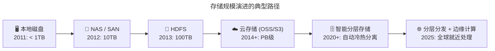
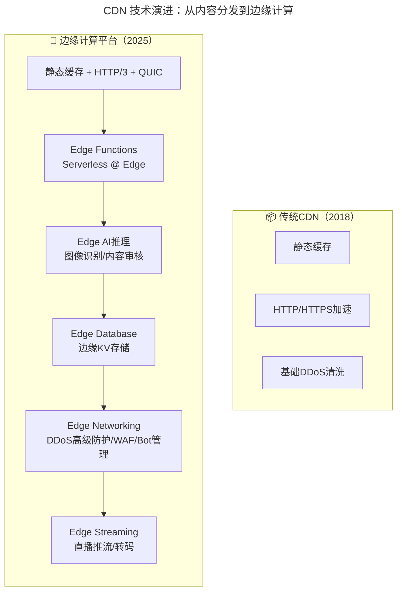
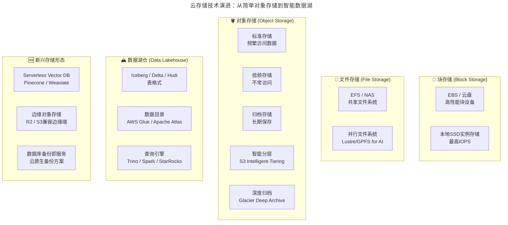

# 从CDN和云存储到边缘计算生态 - 云服务演进与成本优化实战

> **v2 升级摘要**：本文在保留原 frontmatter、所有 Mermaid 图、表格、Terraform 配置案例与术语英文对照的基础上，按 v2 标准的 6 节骨架（导言、核心方法论、关键流程、工具与实战、常见误区、进阶延展）重新组织内容；补充 2025 年边缘 AI 推理、WebAssembly 边缘运行时、Cloudflare R2 零出口费等新趋势，强化 FinOps 视角下的成本治理实践，并将原参考资料内容融入进阶延展一节。

## 一、导言

前文介绍了混合云模式，以及面向应用层的云架构解决方案的 Spring Cloud。接下来，以蘑菇街的两个具体案例，来分享一下基于混合云模式的具体实践。

本文先看一下最为熟悉的 CDN 和云存储建设，并重点探讨 **从传统 CDN 到边缘计算（Edge Computing）的技术演进**。

CDN 应该算是最早期、最典型的公有云服务，如果在业务上用到了 CDN 服务，其实就已经算是在实践混合云模式了。蘑菇街作为 ToC 的电商业务，自然会有大量的图片访问需求，其中尤以商品图片为最。为了保证用户体验，产品在 2011 年上线之初，就应用了 CDN 技术，当时合作的都是专业的 CDN 厂商。

当然，大量的图片访问需求会带来大量的图片存储需求，且随着业务高速发展，这个需求量必然会极速增长。图片的访问需求量往往会以几百万、几千万、几亿到几十亿、上百亿的增长态势呈现。而它所占用的存储空间也会从 G 扩展到 T，到几十 T、几百 T，再到后来的 P 级别。

## 二、核心方法论

### 2.1 存储规模演进的典型路径



起初在业务量不大的时候，还可以把图片存在自己的硬件设备上。再往后可以利用 HDFS 这样的分布式存储技术来实现，CDN 回源的请求全部回到自己的机房里。然而再往后，在这方面的专业性就不够了。

基于此，后来就选择了将海量的图片放到专业性更强的云存储之上。到这个阶段，图片访问和图片存储就近乎完全依赖外部第三方的服务，同时也形成了 CDN 回源访问云存储这样的云应用模式。

### 2.2 CDN 技术演进：从内容分发到边缘计算

**传统 CDN 架构**：

```
用户请求 → DNS解析 → CDN边缘节点(缓存命中?)
                    ├── 命中 → 直接返回
                    └── 未命中 → 回源站获取 → 缓存 → 返回
```

**传统 CDN 的核心能力**：
- 静态资源缓存（图片/JS/CSS/视频）
- 就近访问降低延迟
- 减轻源站压力
- 基础的 DDoS 防护

**2025 年的 CDN 已进化为边缘计算平台**：



**边缘计算的核心价值：将计算能力推向离用户最近的地方**

| 能力 | 传统 CDN | 边缘计算平台 | 业务价值 |
|------|---------|-------------|---------|
| **内容分发** | ✅ 静态文件 | ✅ 静态 + 动态内容 | - |
| **计算能力** | ❌ 无 | ✅ Serverless 函数/AI 推理 | 回源率降低 90%+ |
| **智能路由** | ✅ 基于 DNS | ✅ 基于实时性能/成本 | 优化用户体验 |
| **安全防护** | ⚠️ 基础 DDoS | ✅ WAF + Bot + API Security | 全方位防护 |
| **A/B 测试** | ❌ 不支持 | ✅ Edge 层面灰度 | 快速实验 |
| **个性化** | ❌ 不支持 | ✅ 用户维度动态响应 | 提升转化率 |
| **数据处理** | ❌ 不支持 | ✅ 实时数据转换/裁剪 | 减少源站负载 |

### 2.3 云生态的优势：从价格战到生态协同

再往后发展，随着国内两大公有云巨头腾讯云和阿里云相继杀入 CDN 市场，这对传统的 CDN 厂商和新兴的云存储业务造成了很大的冲击。然而究其主要原因，还是由于云生态的规模优势发挥了作用。

上面讲到，使用的 CDN 是专业的 CDN 厂商业务，但在当时它们并不提供云存储业务。同时，专业的云存储厂商固然在存储技术上更擅长，加上它们大多属于创业公司，也没有太多的财力和人力再杀入 CDN 市场。故，这两块紧耦合的业务实际是由两类不同的公司在独立发展。然而在阿里云和腾讯云这样的公有云巨头进入市场后，就极大地改变了这样一个格局。

#### 2025 年云生态的新维度

| 生态能力 | 2018 年 | 2025 年 |
|---------|--------|--------|
| **CDN+存储整合** | 基础的内网回源优化 | 智能分层 + 边缘计算 + Serverless 联动 |
| **全球覆盖** | 主要在大陆 | 全球 300+ 节点（含边缘） |
| **安全集成** | 基础 DDoS | WAAP + Bot 管理 + API 安全 + 零信任 |
| **AI 能力** | 无 | 边缘 AI 推理 + 内容理解 + 智能审核 |
| **开发体验** | 控制台操作 | IaC (Terraform/Pulumi) + GitOps + SDK 全覆盖 |
| **可观测性** | 基础日志 | OpenTelemetry 统一采集 + 实时 Dashboard |
| **绿色计算** | 未考虑 | 碳足迹报告 + 绿色区域选择 |
| **合规认证** | 基础 ISO | SOC2/等保 2.0/GDPR/PIPL 全覆盖 |

### 2.4 技术层面的生态优势

**1. 内网互联与传输优化**

CDN 模式下，图片上传云存储以及 CDN 回源云存储，基本都是走公网网络，在国内复杂的网络条件下，传输质量就很难保障。然而在以阿里云和腾讯云为代表的公有云模式下，这个问题就会迎刃而解。因为阿里和腾讯这两大巨头各自都有全球规模的业务体量，为了保证自身业务的访问体验，它们一定会在 CDN 和存储技术的优化、整合上下足工夫，因此更具备自我改进的动力。尤其是上面提到的上传和回源过程，在公有云模式下基本都有专线质量保障。即使没有专线，也会不断优化中间的线路质量。

**2025 年的新技术加持**：
- **QUIC/HTTP3 协议**：基于 UDP，减少 RTT，提升弱网环境传输效率 30%+
- **BBR 拥塞控制算法**：Google 开源，大幅提升带宽利用率
- **多路复用**：HTTP/2 和 HTTP/3 的原生能力，减少连接数
- **边缘压缩**：在边缘节点进行 Brotli/Zstd 压缩，进一步减少传输量

**2. 成本层面的综合优化**

主要包括以下几块费用：

| 费用项 | 2018 年 | 2025 年优化手段 |
|-------|--------|--------------|
| **CDN 带宽费用** | 固定单价 | 动态降价 + 流量包预留 + 预留带宽折扣 |
| **回源带宽费用** | 公网回源费用高 | 内网回源（近乎免费）+ 源站合并减少回源 |
| **存储空间费用** | 单一标准存储 | 智能分层（节省 40%+）+ 极速模式按需启用 |
| **新增：请求费用** | 忽略不计 | GET/PUT 请求单独计费，需关注 API 调用模式 |
| **新增：数据处理费** | 无 | 图片处理(AIM)/视频转码按需付费 |
| **新增：边缘计算费** | 无 | Edge Functions 按执行时间/请求数计费 |

> **FinOps 建议**：对于电商类高流量业务，CDN 相关成本通常占总云成本的 20-40%。建立专门的 CDN 成本监控仪表盘，关注命中率、回源率和单位带宽成本。

**3. 生态锁定与反锁定的博弈**

云生态的天然优势在于，云平台上聚集了海量的客户资源，只要进入到这个生态中，一般情况下客户都会首选生态内的产品，而不会再跳出去选择其它独立的产品服务。甚至即使之前用到了第三方的服务，客户也会逐渐转移回云平台这个生态体系中来。故，现在可以看到这样一种趋势：**很多独立的技术产品，正在向云生态靠拢，选择跟公有云合作，争取让产品进入到某个云生态中，并提供相应的云上解决方案和技术支持。**

**然而 2025 年也出现了反向趋势——多云和开源优先战略**：

| 趋势 | 表现 | 对企业的启示 |
|------|------|------------|
| **S3-compatible API 标准化** |几乎所有云存储都兼容 S3 API | 可以相对容易地在云间迁移 |
| **CDN Federation** | 多 CDN 调度（如 Cedexis，已并入 Citrix ADM） | 避免单点故障，优化成本 |
| **开源替代崛起** | MinIO (存储)、Traefik (边缘)、Traffic Control | 私有云部署选项增多 |
| **边缘中立性** | Cloudflare Workers 可在任意前端之后运行 | 不绑定特定云厂商 |

## 三、关键流程

### 3.1 云存储技术演进：从简单对象存储到智能数据湖



### 3.2 多层存储策略与成本优化

对于电商等数据量巨大的业务，合理的存储分层是成本控制的关键：

| 存储层级 | 访问频率 | 典型数据 | 可用性(SLA) | 价格参考（每 GB/月）|
|---------|---------|---------|------------|------------------|
| **Hot（热存储）** | 每日多次 | 当前商品图、用户 Session | 99.99% | $0.023 (S3 Standard) |
| **Warm（温存储）** | 每月数次 | 近期订单、30 天内日志 | 99.9% | $0.0125 (S3 IA) |
| **Cold（冷存储）** | 每年数次 | 历史订单、审计日志 | 99.0% | $0.004 (S3 Glacier) |
| **Frozen（冰冻）** | 极少（合规存档） | 7 年以上合规数据 | 按需取回 | $0.00099 (S3 Deep Archive) |

**智能分层的核心产品对比**：

| 产品 | 自动化程度 | 最小计费周期 | 支持的层级 | 监控可见性 |
|------|-----------|------------|-----------|-----------|
| **AWS S3 Intelligent-Tiering** | ✅ 全自动 | 30 天 | 4 个访问层（Frequent/IA/Archive/Deep Archive） | S3 Storage Lens |
| **Azure Blob Lifecycle** | 规则驱动 | 按规则设置 | Hot/Cool/Archive | Azure Monitor |
| **Google Cloud Object Lifecycle** | 规则驱动 | 按规则设置 | Standard/Nearline/Coldline/Archive | Cloud Monitoring |
| **阿里云 OSS 生命周期** | 规则驱动 | 按规则设置 | 标准/低频/归档/冷归档/深冷归档 | OSS 控制台 |
| **MinIO ILM** | 策略驱动 | 可自定义 | 自定义 Tier | MinIO Console |

> **成本优化实战案例**：某电商平台通过实施 S3 Intelligent-Tiering，将存储成本降低了 **40%**——系统自动将 30 天未访问的商品图片移至 IA 层，90 天未访问的移至 Glacier，完全无需人工干预。

### 3.3 数据生命周期管理的最佳实践

```yaml
# 示例：S3生命周期规则配置（Terraform）
resource "aws_s3_bucket_lifecycle_configuration" "ecommerce_images" {
  bucket = aws_s3_bucket.images.id

  rule {
    id     = "transition-to-ia"
    status = "Enabled"

    transition {
      days          = 30
      storage_class = "STANDARD_IA"  # 30天后→低频存储
    }

    transition {
      days          = 90
      storage_class = "GLACIER"      # 90天后→归档
    }

    transition {
      days          = 365
      storage_class = "DEEP_ARCHIVE" # 1年后→深度归档
    }
  }

  rule {
    id     = "delete-old-uploads"
    status = "Enabled"

    expiration {
      days = 2555  # 7年后删除（超过法定保留期限）
    }

    noncurrent_version_expiration {
      noncurrent_days = 30  # 非当前版本30天后删除
    }
  }
}
```

## 四、工具与实战

### 4.1 主流边缘计算平台对比

| 平台 | 开发模型 | 冷启动 | 语言支持 | 定价模式 | 特色功能 |
|------|---------|--------|---------|---------|---------|
| **Cloudflare Workers** | V8 Isolate | **0ms** | JS/TS/Rust/Python | 按请求数 | 全球 310+ 节点，免费额度慷慨 |
| **Vercel Edge Functions** | V8 Isolate | **0ms** | JS/TS/Go | 按执行时间 | 与 Next.js 深度集成 |
| **AWS Lambda@Edge** | Lambda | 50-200ms | JS/Python | 按调用+执行 | CloudFront 集成，企业级 |
| **Azure Edge Zones** | Functions | 100-300ms | JS/Python/.NET | 按执行 | 企业客户，合规友好 |
| **阿里云边缘函数（EdgeRoutine，现属 ESA）** | 自研 | <100ms | JS/Python/Java | 按调用+内存 | 国内覆盖最优 |
| **Fastly Compute@Edge** | V8 Isolate/Wasm | **0ms** | JS/Rust/C++/Wasm | 按请求数 | 强大的配置能力 |

> **关键技术：WebAssembly (Wasm) 在边缘的崛起**
>
> WebAssembly 正在成为边缘计算的通用运行时：
> - **接近原生性能**：比 JS 快 10-20 倍
> - **语言无关**：Rust/Go/C++/AssemblyScript 均可编译为 Wasm
> - **沙箱安全**：内存隔离，限制资源使用
> - **可移植性**：同一 Wasm 模块可在任何支持 Wasm 的 Edge 平台运行
> - 代表工具：**Fastly Compute**、**WasmEdge**、**Fermyon Spin**、**wasmCloud（CNCF）**

### 4.2 边缘 AI 推理：新趋势

这是 2025 年最具突破性的边缘计算应用场景：

| AI 任务 | 边缘推理方案 | 延迟 | 适用场景 |
|-------|------------|------|---------|
| **图像分类/标签** | TensorFlow Lite / ONNX Runtime | <50ms | 商品识别、内容审核 |
| **人脸检测** | MediaPipe / Ultralytics YOLO nano 系列 | <30ms | 身份验证、美颜滤镜 |
| **OCR 文字识别** | PaddleOCR / Tesseract.js | <100ms | 卡证识别、票据处理 |
| **自然语言处理** | DistilBERT / TinyLLM | <200ms | 智能客服、文本分析 |
| **推荐排序** | ONNX Runtime 轻量模型 | <50ms | 个性化推荐 |
| **语音识别** | Whisper Tiny / Speech-to-Text | <150ms | 语音搜索、实时字幕 |

> **业界公开实践（方向性参考）**：
> - **Shopify** 使用 Cloudflare（Magic Transit / Workers）防护其全球电商流量
> - **Netflix** 通过 Open Connect 设备在 ISP 侧就近分发视频（典型的边缘缓存分发）
> - **某头部电商** 在 CDN 边缘节点部署商品搜索 AI，将搜索延迟从 200ms 降至 30ms

### 4.3 主流云厂商 CDN+存储产品对比

| 能力 | AWS (CloudFront+S3) | Azure (FrontDoor+Blob) | 阿里云 (CDN+OSS) | 腾讯云 (ECDN+COS) | Cloudflare (CDN+R2) |
|------|-----|------|------|------|------|
| **全球节点数** | 400+ | 100+ | 2800+ (国内) | 2800+ (国内) | 310+ |
| **边缘计算** | Lambda@Edge / CloudFront Functions | Edge Zones (预览) | 边缘函数 ES | 边缘函数 | Workers (最强) |
| **对象存储** | S3 (行业标准) | Blob Storage | OSS (国内最强) | COS | R2 (零出口费!) |
| **智能分层** | ✅ Intelligent-Tiering | ✅ Lifecycle | ✅ 生命周期 | ✅ 生命周期 | ❌ |
| **图片处理** | ✅ Lambda/图像处理方案 | ⚠️ 需自建（AMS 已退役） | ✅ IMM 智能媒体管理 (极强) | ✅ 数据万象 | ✅ Images API |
| **视频处理** | ✅ Elemental MediaConvert | ⚠️ Media Services 已于 2024-06 退役 | ✅ MPS | ✅ MPS | Stream (受限) |
| **DDoS 防护** | Shield Advanced | DDoS Protection Pro | DDoS 防护 | 大禹 | 自带 (强) |
| **WAF** | WAF v2 + Shield | Azure WAF | Web 应用防火墙 | T-Sec WAF | WAF (强) |
| **价格竞争力** | 中等偏贵 | 中等 | 国内最优 | 国内优 | 国际优(R2 无出口费) |
| **特色** | 企业级最成熟 | Microsoft 生态整合 | 国内功能最全 | 游戏音视频优化 | 开发者友好+性能极致 |

> **特别推荐关注 Cloudflare R2**：2022 年推出的对象存储产品，**完全不收出口流量费（Egress Fee）**，这对 CDN 回源场景来说是颠覆性的——传统云厂商的出口费用可能占存储总成本的 60-80%，而 R2 彻底消除了这一痛点。

### 4.4 运维技能升级清单

- [ ] **边缘节点管理**：了解 CDN/Edge 平台的配置和调优
- [ ] **Serverless Edge 开发**：掌握至少一种 Edge Functions 框架
- [ ] **存储分层策略**：设计适合业务的 ILM（Information Lifecycle Management，信息生命周期管理）策略
- [ ] **多媒体处理管线**：图片/视频的自动化处理链路
- [ ] **边缘可观测性**：边缘节点的日志/指标/链路追踪
- [ ] **成本优化**：CDN 命中率优化、存储分层调优、预留容量规划
- [ ] **边缘安全**：Bot 管理、API 安全、边缘 WAF 配置

## 五、常见误区

### 5.1 误以为 CDN 只做静态加速

- **误区**：CDN 仅用于缓存图片、JS、CSS 等静态资源
- **现实**：2025 年的 CDN 平台已具备边缘计算、AI 推理、动态加速、安全防护等综合能力
- **建议**：重新评估 CDN 平台能力，将"可缓存+延迟敏感"的逻辑下沉到边缘

### 5.2 忽视存储分层导致成本失控

- **误区**：所有数据都放在标准存储层
- **现实**：电商类业务历史数据访问频率极低，全量热存储会造成 40%+ 的成本浪费
- **建议**：建立基于访问频率的智能分层策略，结合 S3 Intelligent-Tiering 或云厂商生命周期规则

### 5.3 忽略出口流量费这一隐性成本

- **误区**：只关注存储单价和带宽费用
- **现实**：传统云厂商的出口流量费可能占存储总成本的 60-80%
- **建议**：评估 Cloudflare R2 等零出口费方案，或将回源链路优化为内网回源

### 5.4 过度边缘化：所有业务都上 Edge

- **误区**：把所有业务逻辑都迁到边缘
- **现实**：边缘计算有冷启动、运行时限制、调试复杂等约束，不适合所有场景
- **建议**：优先评估"读多写少、可缓存、延迟敏感"的场景，ROI 最高的部分先行

## 六、进阶延展

### 6.1 战略建议

1. **评估边缘计算适用场景**：不是所有业务都需要 Edge，但对于"读多写少"、"可缓存"、"延迟敏感"的场景，Edge ROI 极高
2. **选择正确的边缘平台**：国内业务优先阿里云/腾讯云边缘函数；国际业务考虑 Cloudflare Workers 或 Lambda@Edge
3. **建立 CDN 成本治理机制**：将 CDN 成本纳入 FinOps 体系，定期 Review
4. **关注新兴协议**：HTTP/3 (QUIC) 正在快速普及，提前做好兼容性测试
5. **探索边缘 AI 的可能性**：即使是简单的图像格式转换/内容审核放在边缘，也能显著降低源站负载

### 6.2 总结：拥抱边缘计算时代

通过 CDN 和云存储这个案例，可以清晰地看到，随着公有云的深入发展，特别是公有云巨头的飞速进步，公有云已经形成了自有的、独特的生态体系。这不仅仅体现在技术和产品层面，而且可以预见其最终还会形成商业层面的体系闭环。

到了 2025 年，这个生态已经从简单的"CDN+存储"组合，进化为 **以边缘计算为核心的分布式云服务平台**。对于运维团队来说，需要掌握的新技能覆盖边缘节点管理、Serverless Edge 开发、存储分层策略、多媒体处理管线、边缘可观测性、成本优化与边缘安全等多个方向。

### 6.3 延伸阅读与参考资源

- **主流边缘平台文档**：Cloudflare Workers、Vercel Edge Functions、AWS Lambda@Edge、阿里云边缘函数服务、Fastly Compute@Edge 官方文档
- **WebAssembly 生态**：WasmEdge、Spin、wasmCloud 等项目主页与最佳实践
- **云存储产品矩阵**：AWS S3、Azure Blob、阿里云 OSS、腾讯云 COS、Cloudflare R2 官方文档
- **数据湖仓方案**：Apache Iceberg、Delta Lake、Apache Hudi 项目主页
- **FinOps 实践**：FinOps Foundation 官方资料与 OpenCost/Kubecost 成本治理方案
- **边缘 AI 推理**：TensorFlow Lite、ONNX Runtime、MediaPipe、Whisper 等轻量推理框架文档

以上分享的这些内容，是笔者在近两年的工作中真切经历过的案例和感受，结合 2025 年的行业最佳实践进行了全面更新。希望能在思路拓展上对你有所帮助。

如果今天的内容对你有帮助，也欢迎你分享给身边的朋友。