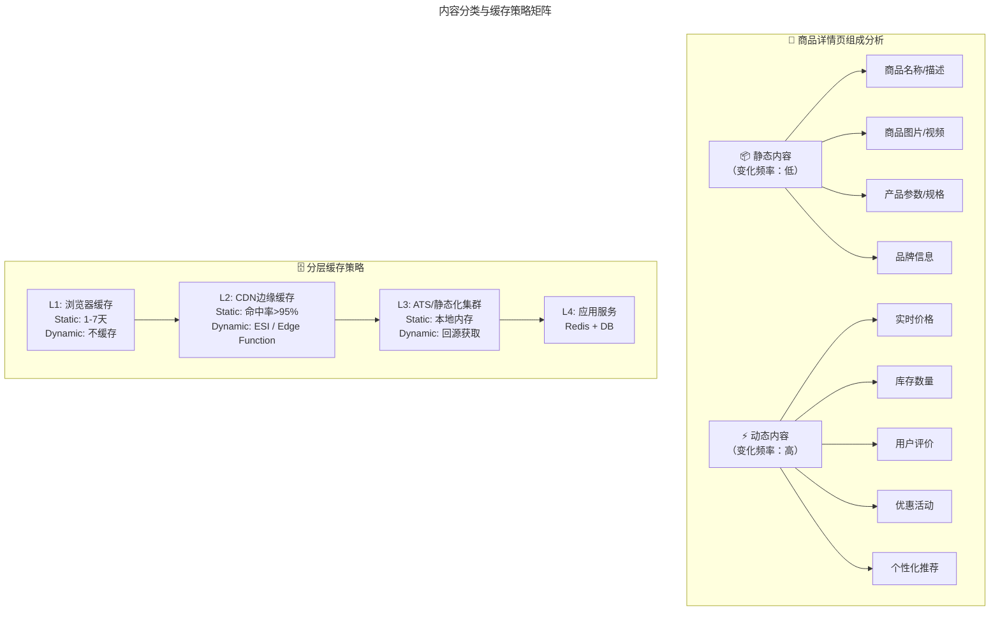
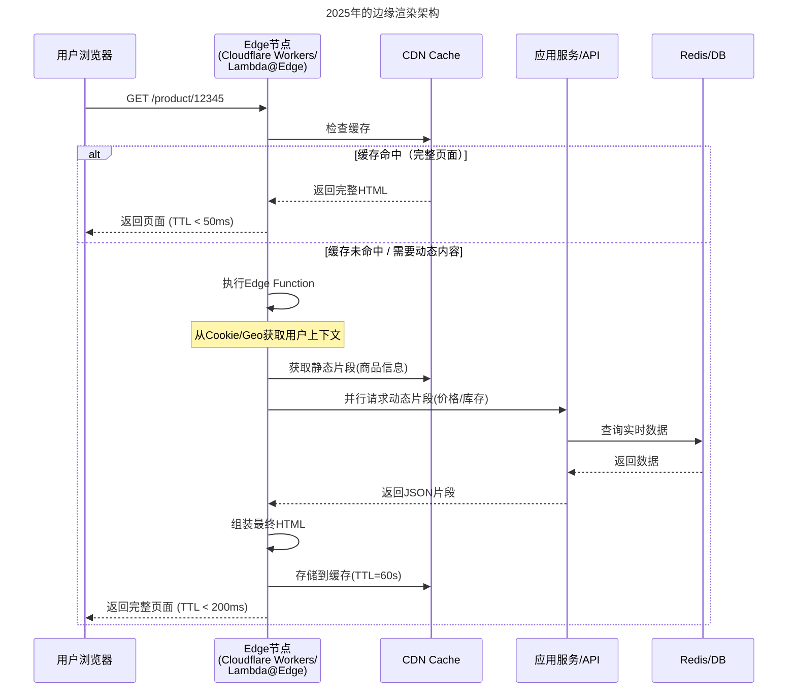
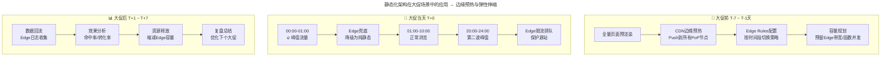
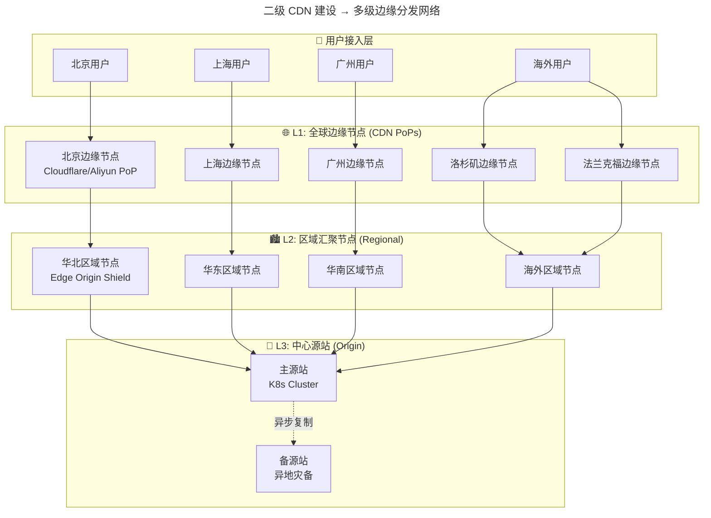
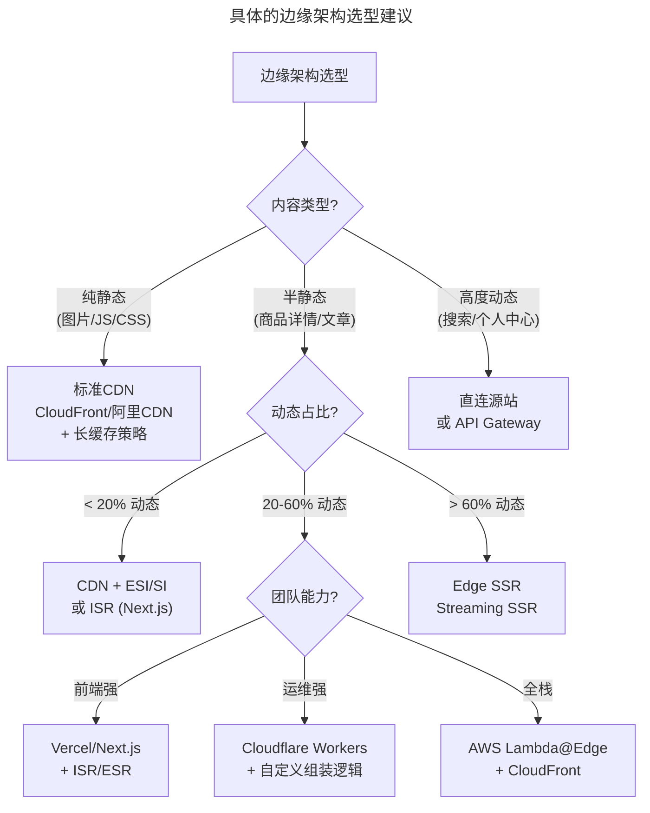

# 量体裁衣方得最优解 - 从页面静态化到边缘智能渲染架构

> **v2 升级摘要**：本文在保留原 frontmatter、所有 Mermaid 图、表格、案例与术语英文对照的基础上，按 v2 标准的 6 节骨架（导言、核心方法论、关键流程、工具与实战、常见误区、进阶延展）重新组织内容；补充 2025 年边缘渲染架构（Edge SSR/ISR/Streaming SSR）、边缘组装方案（HTMLRewriter 等）替代 ESI 的演进、多级边缘分发网络、Cloudflare R2 零出口费等新趋势，强化边缘 FinOps 视角下的成本治理实践，并将原参考资料内容融入进阶延展一节。

## 一、导言

前文中介绍了 CDN 和云存储的实践，以及云生态的崛起之路，本文继续聊一聊 CDN。

通常意义上讲的 CDN，更多的是针对静态资源类的内容分发网络，最典型的就是电商的各类图片，还有 JS 和 CSS 这样的样式文件。通过 CDN 能够让用户就近访问，提升用户体验。

然而这类文件只是以单纯的资源存在，与业务逻辑没有强关联。故在技术上，可以使用业界通用的 CDN 和云存储解决方案。

需要注意的是，本文中讲到的实践内容，同样是遵从 **静态内容，就近访问** 这个原则的。然而因为其中包含了大量的业务逻辑，这就要求在面对不同的场景时，要有跟业务逻辑相关的定制化的解决方案。

以下分析页面静态化架构和二级 CDN 建设，以及 **2025 年这些架构如何演进为边缘计算（Edge Computing）驱动的智能渲染体系**。

## 二、核心方法论

### 2.1 静态化架构建设的业务场景

仍然回到电商的业务场景中来。对于电商，访问量最大的无疑是商品的详情页，绝大多数用户都要通过浏览商品详情，来决定是否下单。故单就这一类页面，就占到全站 30%+ 的流量。

那么，商品详情一般由哪些部分组成呢？商品详情大致包括了商品名称、商品描述、产品参数描述、价格、SKU、库存、评价、优惠活动、优惠规则以及同款推荐等等信息。

这里仔细观察可以发现，其实对于商品描述类的信息，比如商品名称、商品描述、产品参数描述等等，一般在商品发布之后，就很少再变动，属于 **静态化的内容**。

而优惠活动、优惠规则、价格等等则是可以灵活调整的，库存和评价这类信息也是随时变化，处于不断的更新中——属于 **动态内容**。

说到这里，会想到，如果能够把静态化的内容提取出来单独存放，业务请求时直接返回，而不用再通过调用应用层接口的方式，去访问缓存或者查询数据库，那访问效率一定是会大幅提升的。

### 2.2 内容分类与缓存策略矩阵

| 内容类型 | 变更频率 | 缓存 TTL | 缓存层级 | 失效机制 |
|---------|---------|--------|---------|---------|
| **商品基础信息** | 发布后很少变 | 24h - 7 天 | CDN + ATS | 商品编辑时主动失效 |
| **商品图片** | 几乎不变 | 30 天+ (带版本号) | CDN | URL 版本化（天然失效）|
| **价格信息** | 活动期间固定 | 活动期间固定 | CDN/ATS | 活动配置变更时失效 |
| **库存信息** | 实时变化 | 不缓存（或极短）| 回源 | 实时查询 |
| **用户评价** | 频繁新增 | 5-15 分钟 | ATS | 定时刷新 |
| **个性化推荐** | 因人而异 | 不缓存 | 回源 | 实时计算 |

### 2.3 从页面静态化到边缘渲染的演进

**原始方案：基于 ATS 的静态化**

静态架构中，采用的技术方案是 ATS，也就是 Apache Traffic Server。ATS 是一个开源产品，本质上跟 Nginx、Squid 以及 Varnish 这样的 HTTP 反向代理是一样的。然而它能对动静态分离的场景提供很好的支持。

**关键技术点**：
- **动静态分离**：将页面上相对固定的静态信息和随时在变化的动态信息区分出来，静态信息直接在 ATS 集群获取，动态信息则回源到应用层。
- **动态数据获取**：直接采用 ATS 的 ESI（Edge Side Include）标签模式，用来标记那些动态的被请求的数据。
- **失效机制**：分为主动失效、被动失效和定时失效。通过 Purge Center 执行失效。

> **2025 年演进：ESI 的替代者——Edge 侧组装与 SSR**
>
> 传统 ESI（Edge Side Include）由 Akamai 提出，用于在 CDN 边缘进行页面组装。但 ESI 存在以下问题：
> - 仅支持简单的 XML 标签嵌套，无法处理复杂逻辑
> - 各家 CDN 实现不统一，锁定风险高
> - 无法执行 JavaScript 渲染
>
> **现代替代方案**：
>
> | 方案 | 原理 | 适用场景 |
> |------|------|---------|
> | **HTMLRewriter (Cloudflare Workers)** | 边缘流式 HTML 重写与片段注入 | 简单动静分离、个性化注入 |
> | **ISR (Incremental Static Regeneration)** | Next.js/Vercel 模式，按需重建 | 内容站点/电商 |
> | **ESR (Edge-Side Rendering)** | 在边缘执行 SSR | 动态内容多的页面 |
> | **Streaming SSR** | 流式 HTML 渲染 | 首屏性能极致优化 |
> | **Partial Hydration** | 静态骨架 + 岛屿式 hydration | 交互丰富的页面 |

## 三、关键流程

### 3.1 2025 年的边缘渲染架构

**对比传统方案的改进**：

| 维度 | 传统 ATS 静态化 | 边缘渲染架构 |
|------|-------------|-------------|
| **部署位置** | 中心机房 ATS 集群 | 全球 CDN 边缘节点 |
| **用户延迟** | 取决于到中心机房距离 | 通常 < 50ms（就近边缘）|
| **动态内容获取** | ESI 回源到中心机房 | Edge Function 并行调用 API |
| **扩展方式** | 增加中心机房节点 | 天然全球分布 |
| **个性化能力** | 弱（依赖 Cookie 传递） | 强（可执行 JS、调用 AI 模型）|
| **运维复杂度** | 高（自建 ATS 集群） | 低（托管 Serverless Edge）|
| **成本模型** | 服务器 + 带宽 | 按请求数/执行时间计费 |

### 3.2 静态化架构在大促场景中的应用 → 边缘预热与弹性伸缩

**原始实践回顾**：以"双 11"为例，参与大促的商家和商品，一般会在 11 月初完成全部报名。届时所有的商品信息都将确认完毕，且直到"双 11 活动"结束，基本不会再发生大的变化。

它跟平时的不同之处在于，商品在大促期间是相对固定的，所以就可以将商品的静态化信息提前预热到 ATS 集群中，大大提升静态化的命中率。

以详情页为例。在静态化方案全面铺开推广后，静态化内容在大促阶段的命中率为 95%，RT 时延从原来完全动态获取的 200ms，降低到 50ms。这大大提升了用户体验，同时也大幅提升了整体系统容量。

**2025 年大促边缘策略升级**：

**2025 年新增的大促技术手段**：

| 能力 | 实现方式 | 效果 |
|------|---------|------|
| **全局预热** | CDN API 批量预热 URL 列表 | 命中率从 95%→99%+ |
| **Edge Rate Limiting** | Edge Function 层面限流 | 保护源站不被打垮 |
| **渐进式加载（Skeleton）** | 先返回骨架屏，异步填充内容 | 感知速度提升 |
| **AB 测试 @Edge** | 不同用户群体看到不同版本 | 实时优化转化率 |
| **智能路由** | 根据源站健康度自动切换 | 单点故障快速恢复 |
| **Edge AI 推荐** | 在边缘运行轻量推荐模型 | 个性化体验 |

### 3.3 二级 CDN 建设 → 多级边缘分发网络

**原始方案回顾**：上面提到的静态化方案，仅仅是自己中心机房的建设方案，也就是说，所有的用户请求还是都要回到中心机房中。静态化方案提升的是后端的访问体验，然而用户到机房的这段距离的体验并没有改善。

从静态化的角度，这些内容完全可以分散到更多的地域节点上，让它们离用户更近，从而真正解决从用户起点到机房终点的距离问题。故，接下来的方案就是：选择公有云节点，进行静态化与公有云相结合的方案，也就是二级 CDN 方案。

引入了这样的二级 CDN 架构后，下面几个技术点需要多加关注：
- **回源线路**：公网回源转变为专线回源
- **弹性伸缩**：利用公有云节点进行动态扩缩容
- **高可用保障**：HttpDNS 实现快速故障切换

**2025 年多级边缘架构**：

## 四、工具与实战

### 4.1 二级 CDN 的关键技术演进

#### 1. 回源线路：从公网到 SD-WAN 到私有骨干网

| 方案 | 延迟 | 可靠性 | 成本 | 适用规模 |
|------|------|--------|------|---------|
| **公网回源** | 30-100ms | 85-95% | 低 | 小规模/非关键 |
| **专线/MPLS** | 5-20ms | 99.9%+ | 高 | 金融/核心链路 |
| **SD-WAN** | 10-30ms | 99.5% | 中 | 分支互联/混合云 |
| **云厂商骨干网** | 5-15ms | 99.99% | 中（含在服务费内）| 推荐方案 |

> **2025 年最佳实践：使用云厂商的 Origin Shield（源站 shielding）功能**
> - AWS: CloudFront Origin Shield（附加付费功能）
> - Azure: Origin Shielding via Front Door
> - Cloudflare: Tiered Cache（Smart Tiered Caching）
> - 阿里云: DCDN（动态加速网络）
>
> **原理**：L1 边缘节点不再直接回源到你的源站，而是先回源到 L2 区域汇聚点（通常在同一大区内），由 L2 统一回源到源站。这样可以将回源请求合并，大幅降低源站压力。

#### 2. 弹性伸缩：从手动扩容到 Serverless Auto-scaling

| 年代 | 扩容方式 | 响应时间 | 成本效率 |
|------|---------|---------|---------|
| **2018** | 提前申请机器，手工部署 | 天级 | 低（需预估过量）|
| **2020** | 云 API + 自动化脚本 | 小时级 | 中 |
| **2023** | K8s HPA + Cluster Autoscaler | 分钟级 | 高 |
| **2025** | Serverless Edge Functions（自动无限扩容） | **毫秒级（冷启动<5ms）** | **极高（按实际使用付费）**|

#### 3. 高可用保障：从 DNS 切换到智能流量管理

**2018 年的方案**：HttpDNS 切换 IP，当某个节点故障时全部切回中心节点。

**2025 年的演进**：

| 技术 | 原理 | 切换时间 | 特点 |
|------|------|---------|------|
| **Global Load Balancer** | 基于 RUM（Real User Monitoring）智能路由 | 秒级 | 自动检测+自动切换 |
| **Anycast IP** | 同一 IP 多个节点同时宣告 | 自动 | 天然就近+故障规避 |
| **Failover Routing** | DNS 级别主备切换 | 分钟级（受 TTL 限制）| 简单可靠 |
| **Circuit Breaker @ Edge** | Edge Function 层面的熔断 | 毫秒级 | 细粒度控制 |
| **Chaos Engineering** | 主动注入故障验证韧性 | N/A | 提前发现弱点 |

### 4.2 具体的边缘架构选型建议

根据不同的业务场景，选择合适的边缘架构：

### 4.3 边缘架构的 FinOps 成本治理

#### 边缘成本构成分析

| 成本项 | 计费方式 | 占比参考 | 优化空间 |
|-------|---------|---------|---------|
| **带宽费用** | GB/月（出向流量） | 40-60% | ⭐⭐⭐⭐⭐ 最大头 |
| **请求费用** | 万次/月（HTTP 请求） | 10-20% | ⭐⭐⭐⭐ 缓存命中率是关键 |
| **Edge Computing** | 按执行时间/请求数 | 5-15% | ⭐⭐⭐ 代码优化 |
| **存储费用** | GB/月 | 5-10% | ⭐⭐⭐ 智能分层 |
| **其他** | WAF/DDoS/证书等 | 5-10% | ⭐⭐ 按需开启 |

#### 成本优化 Top 5 措施

| # | 措施 | 预期节省 | 实施难度 |
|---|------|---------|---------|
| 1 | **提高缓存命中率**（目标>95%） | 带宽费用降低 30-50% | ⭐⭐ |
| 2 | **启用压缩**（Brotli > Gzip） | 带宽降低 20-30% | ⭐ |
| 3 | **图片优化**（WebP/AVIF + 响应式） | 带宽降低 40-60% | ⭐⭐ |
| 4 | **选择正确的边缘平台**（比较单价） | 总成本降低 20-40% | ⭐⭐⭐ |
| 5 | **预留容量**（Committed Use Discounts） | 30-70% 折扣 | ⭐⭐ |

> **特别提醒：出口流量费（Egress Fee）陷阱**
>
> 很多企业只关注存储单价，却忽略了 **出口流量费** 可能是总成本的数倍：
> - AWS S3 + CloudFront: 出口费用 $0.09/GB
> - Cloudflare R2: **零出口费**
> - 阿里云 OSS: 出口费用因区域而异
>
> 如果你的 CDN 回源量大，**选择零出口费的存储方案可能省下一大笔钱**

## 五、常见误区

### 5.1 静态化等于全量缓存

- **误区**：将整个页面缓存为静态内容，忽视库存、价格等实时性要求
- **现实**：电商业务对价格和库存的实时性要求极高，全量静态化会导致数据不一致
- **建议**：采用动静分离策略，动态片段通过 Edge Function 并行回源

### 5.2 忽视用户到机房这段距离

- **误区**：只优化中心机房的命中率，忽视用户到机房的物理距离
- **现实**：跨地域用户延迟主要来自物理距离，而非源站处理速度
- **建议**：引入二级 CDN / 多级边缘分发架构，将内容推到离用户最近的 PoP

### 5.3 过度追求边缘化而忽视成本

- **误区**：所有内容都通过 Edge Function 处理
- **现实**：Edge Computing 按执行时间/请求数计费，过度使用会导致成本失控
- **建议**：优先将"可缓存+延迟敏感"的逻辑下沉到边缘，其余保留在源站

### 5.4 大促前未做容量预热

- **误区**：大促当天才扩容和预热缓存
- **现实**：冷启动和缓存预热需要时间，大促峰值期间无法承受
- **建议**：T-7 天开始全量页面预渲染和 CDN 边缘预热

## 六、进阶延展

### 6.1 给运维团队的建议行动清单

- [ ] **评估当前 CDN 架构**：绘制现有缓存层次图，识别热点路径
- [ ] **测量真实用户体验**：使用 RUM（Real User Monitoring，真实用户监控）工具如 SpeedCurve/WebPageTest
- [ ] **计算缓存命中率**：目标是 > 95%（静态）、> 80%（半动态）
- [ ] **评估 Edge Computing 可行性**：至少在一个新功能上尝试 Edge Functions
- [ ] **建立边缘监控仪表盘**：各 PoP 节点的命中率、错误率、P50/P95/P99 延迟
- [ ] **制定大促预案**：包含预热计划、容量规划、降级策略、故障演练
- [ ] **实施边缘 FinOps**：将 CDN/Edge 成本纳入月度 Review

### 6.2 总结：从"量体裁衣"到"边缘智能"

今天分享的页面静态化架构方案和二级 CDN 方案，是笔者在实际工作中较早跟公有云方案相结合的实践之一，并且在日常和大促活动中，起到了非常好的效果。

到了 2025 年，这套架构已经演变为 **以边缘计算为核心的多级智能分发网络**。同时也可以看到，业务一旦与公有云相结合，云生态的各种优势就会马上体现出来。然而无论选择哪种方案，都要结合具体的业务场景，才能作出最优的方案选择。

**正所谓具体问题具体分析，找出问题，优化解决路径，量体裁衣，才能得到最适合的"定制方案"。** 正如之前提到的：只有挖掘出对业务有价值的东西，技术才会有创新，才会有生命力。

### 6.3 延伸阅读与参考资源

- **边缘渲染框架**：Next.js ISR/ESR、Cloudflare Workers、AWS Lambda@Edge、Vercel Edge Functions 官方文档
- **CDN 与边缘分发**：Cloudflare Tiered Cache、AWS CloudFront Origin Shield、阿里云 DCDN 官方文档
- **ESI 与现代替代方案**：Akamai ESI 规范、Cloudflare HTMLRewriter、Streaming SSR 相关技术文章
- **FinOps 实践**：FinOps Foundation 官方资料与 Cloudflare R2 零出口费方案
- **大促容量规划**：参考云厂商大促技术白皮书与最佳实践案例

如果在这方面有好的实践经验和想法，欢迎交流探讨。

如果今天的内容对你有帮助，也欢迎你分享给身边的朋友。