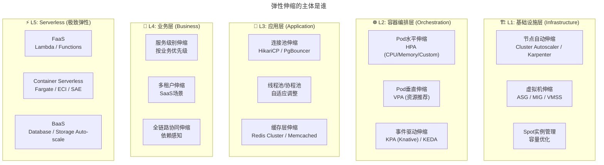
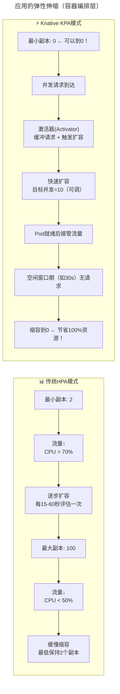
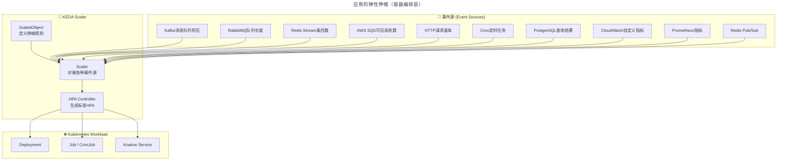
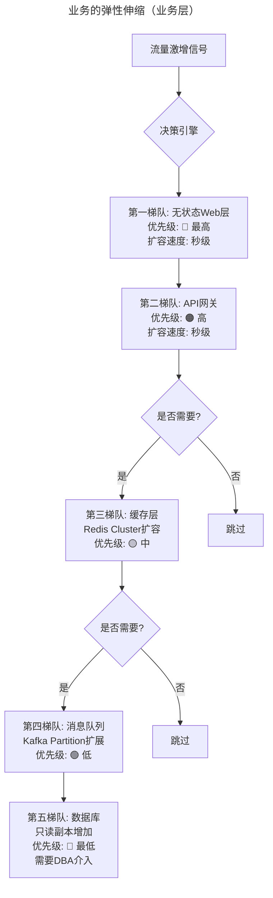
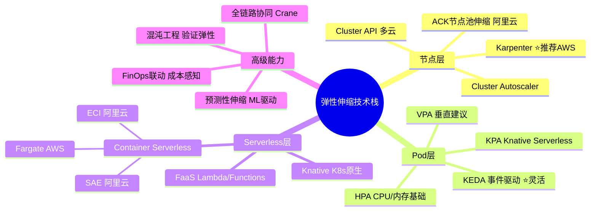

# 云计算时代，我们所说的弹性伸缩，弹的到底是什么？- 从HPA到KPA、Karpenter与事件驱动架构

> **v2 升级摘要**：本文在保留原 frontmatter、所有 Mermaid 图、表格、YAML 配置案例与术语英文对照的基础上，按 v2 标准的 6 节骨架（导言、核心方法论、关键流程、工具与实战、常见误区、进阶延展）重新组织内容；补充 2025 年 Karpenter 替代 Cluster Autoscaler、KEDA 事件驱动伸缩、KPA 缩容到零、全链路协同伸缩等新趋势，强化 FinOps 联动的成本感知实践，并将原参考资料内容融入进阶延展一节。

## 一、导言

现在，经常听到的一些高大上的词汇，比如弹性伸缩、水平扩展和自动化扩缩容等等，能否说一说，这些技术手段的主体是谁，也就是谁的水平扩展？弹性伸缩的是什么？同时，这些名词之间又有什么关系呢？

以下从弹性伸缩入手进行分析讨论。

弹性伸缩，一说到这个词，可能很自然地会联想到资源的弹性伸缩，服务器的弹性伸缩，容量的弹性伸缩，应用的弹性伸缩以及业务的弹性伸缩等等。笔者认为这些理解都没有错误，然而可以发现，当弹性伸缩这个动词前面增加了这么多不同的主语之后，一下子就不知道到底该做什么了。

其实有这样的困惑很正常。在讲标准化的时候就提到，**做运维和做架构的思路是相通的，碰到问题后，一定要找到问题的主体是什么，通过问题找主体，通过主体的特性制定问题的解决方案**。

**对于运维，一定要准确识别出日常运维过程中不同的运维对象，然后再进一步去分析这个对象所对应的运维场景是什么，进而才是针对运维场景的分解和开发。**

## 二、核心方法论

### 2.1 弹性伸缩的主体是谁

在云原生时代，弹性伸缩已经发展为一个多层次、多维度的复杂体系：



这里可以看到，弹性伸缩这个概念背后的含义是不一样的，所执行的动作以及制定的方案也是不一样的。

### 2.2 弹性伸缩的核心方法论

通过上面的分析过程，在日常思考和工作开展中应该注意以下两点。

**第一点：从实际问题出发，找到问题的主体**

要反复问自己和团队，解决的问题是什么？解决的是谁的问题？切记，一定不要拿着解决方案来找问题，甚至是制造问题。

比如弹性伸缩这个概念，它就是解决方案，而不是问题本身，**问题应该是：业务服务能力不足时，如何快速扩容？业务服务能力冗余时，如何释放资源，节省成本？** 按照这个思路来，自然就提炼出业务服务能力这个主体，面对的场景是快速的扩缩容，然后针对场景进一步细化和分解。

**第二点：找到最本质的主体**

如果问题处于初期，且是发散状态时，主体可能表现出很多个，这时一定要找到最本质的那一个，往往这个主体所涉及的运维场景就包括了其它主体的场景。

比如上面看到的业务的弹性伸缩，就包含了应用和服务器的弹性伸缩场景，它们只不过是子场景而已。

## 三、关键流程

### 3.1 服务器的弹性伸缩（基础设施层）

针对这个场景，假设业务是运行在私有云或公有云上，那只要能够通过云平台的 API 申请和释放资源，申请时初始化操作系统，释放时销毁资源就可以。

**2018 年方案**：手工 + 脚本 + 云厂商 Auto Scaling Group（ASG）

**2025 年方案对比**：

| 工具 | 类型 | 核心特点 | 适用场景 |
|------|------|---------|---------|
| **Cluster Autoscaler (CA)** | K8s 官方 | 基于 Pod Pending 状态扩缩节点 | 通用 K8s 集群 |
| **Karpenter** | Kubernetes SIG-Autonomy 项目（AWS 发起，2024 捐赠） | 基于 Pod 需求直接创建节点，无需 NodeGroup | AWS EKS（推荐）|
| **Cluster API (CAPA/CAPZ)** | CNCF | 声明式多云节点管理 | 多云环境 |
| **ACK 节点自动伸缩** | 阿里云 | cluster-autoscaler 的 alibaba-cloud provider + 节点池 | 阿里云 ACK |
| **Crane** | 腾讯开源（CNCF 沙盒） | 增强版 HPA（预测式弹性 EHPA）+ 成本优化 | 大规模生产 |

> **为什么 Karpenter 正在取代 Cluster Autoscaler？**
>
> | 维度 | Cluster Autoscaler | Karpenter |
> |------|-------------------|-----------|
> | **工作模式** | NodeGroup → 调整大小 | 直接按需创建 EC2 实例 |
> | **配置复杂度** | 高（预定义多种 Instance Type 组合）| 低（只需定义约束条件）|
> | **Spot 实例支持** | 手动配置混合策略 | **原生支持，自动优化成本** |
> | **扩容速度** | 分钟级（需等待 ASG 响应）| **秒级（直接 API 调用）** |
> | **资源利用率** | 较低（NodeGroup 粒度粗）| **极高（精确匹配 Pod 请求）** |
> | **成本节省** | 基线 | **额外节省 30-70%**（Spot 优化）|

```yaml
# Karpenter NodePool 示例：声明式节点供给策略（v1.0 GA 起，2024-08）
# 注：v1beta1 的 Provisioner API 已被移除，替换为 karpenter.sh/v1 的 NodePool
apiVersion: karpenter.sh/v1
kind: NodePool
metadata:
  name: default
spec:
  template:
    spec:
      requirements:
        - key: kubernetes.io/arch
          operator: In
          values: ["amd64"]
        - key: kubernetes.io/os
          operator: In
          values: ["linux"]
        - key: karpenter.sh/capacity-type
          operator: In
          values: ["spot", "on-demand"]  # 优先使用Spot实例
        - key: node.kubernetes.io/instance-type
          operator: In
          values: ["m5.xlarge", "m5.2xlarge", "c5.xlarge"]  # 灵活选择
  limits:
    cpu: "1000"  # 该NodePool最大CPU总量限制
  disruption:
    consolidationPolicy: WhenEmptyOrUnderutilized
    consolidateAfter: 30s  # 空闲/低利用率30秒后触发合并缩容
```

### 3.2 应用的弹性伸缩（容器编排层）

这个场景下其实是默认包含第一步的，就是首先必须要拿到应用运行的服务器资源才可以，这一步做到了，下面就是应用的部署、启动以及服务上线接入流量。

#### HPA（Horizontal Pod Autoscaler）：经典但不够用

传统的 K8s HPA 基于 CPU 和内存指标进行扩缩容：

```yaml
# 传统HPA示例
apiVersion: autoscaling/v2
kind: HorizontalPodAutoscaler
metadata:
  name: web-hpa
spec:
  scaleTargetRef:
    apiVersion: apps/v1
    kind: Deployment
    name: web-deployment
  minReplicas: 2
  maxReplicas: 100
  metrics:
    - type: Resource
      resource:
        name: cpu
        target:
          type: Utilization
          averageUtilization: 70  # CPU利用率超过70%时扩容
    - type: Resource
      resource:
        name: memory
        target:
          type: Utilization
          averageUtilization: 80
```

**HPA 的问题**：

| 问题 | 描述 | 影响 |
|------|------|------|
| **滞后性** | CPU 升高后才触发扩容，新 Pod 启动需要时间 | 流量尖刺期间服务降级 |
| **不适用于突发流量** | 无法预测性地提前扩容 | 错过流量高峰 |
| **不适用于空闲-爆发型** | 空闲时无法缩到 0 | 资源浪费 |
| **单一指标局限** | CPU/内存不能反映真实负载 | 可能误判 |
| **冷启动慢** | Pod 从 0 开始启动需要 10s-数分钟 | 影响用户体验 |

#### KPA（Knative Pod Autoscaler）：Serverless 级别的弹性

KPA 是 Knative 项目中的自动伸缩组件，专为 Serverless 工作负载设计：



**KPA vs HPA 核心差异**：

| 能力 | HPA | KPA |
|------|-----|-----|
| **最小副本** | ≥ 1 | **0（可以完全缩到零！）** |
| **扩缩指标** | CPU/内存/自定义 | **并发请求数（Concurrency）** / RPS |
| **扩容速度** | 较慢（依赖 Metrics Server 采集周期）| **极快（Activator 缓冲+并发度模型）** |
| **缩容到零** | ❌ 不支持 | ✅ **核心能力** |
| **冷启动处理** | 无 | Activator 缓冲 + Scale-to-Zero |
| **稳态窗口（Stable Window）** | stabilizationWindowSeconds | **可配置的空闲检测窗口** |
| **适用场景** | 长期运行的服务 | **Serverless / 事件驱动 / 突发流量** |

```yaml
# Knative Service 示例：自动伸缩配置
apiVersion: serving.knative.dev/v1
kind: Service
metadata:
  name: order-service
spec:
  template:
    metadata:
      annotations:
        # 自动伸缩配置
        autoscaling.knative.dev/class: kpa.autoscaling.knative.dev  # 使用KPA
        autoscaling.knative.dev/target: "10"         # 目标并发数=10
        autoscaling.knative.dev/minScale: "0"        # 最小0个副本（允许缩到0）
        autoscaling.knative.dev/maxScale: "100"      # 最大100个副本
        autoscaling.knative.dev/scaleDownDelay: "30s"# 空闲30秒后开始缩容
        autoscaling.knative.dev/window: "60s"        # 指标采集窗口
    spec:
      containers:
        - image: registry.cn-hangzhou.aliyuncs.com/order-service:v2.0
          resources:
            requests:
              cpu: "250m"
              memory: "256Mi"
            limits:
              cpu: "500m"
              memory: "512Mi"
```

#### KEDA：基于事件的弹性伸缩

KEDA（Kubernetes Event-driven Autoscaling）是一个 CNCF 项目，专门解决 **基于外部事件** 的弹性伸缩问题：



**KEDA 支持的 Scaler 类型（2025 年已达 60+ 种）**：

| 类别 | 代表 Scalers | 典型场景 |
|------|------------|---------|
| **消息队列** | Kafka, RabbitMQ, NATS JetStream, AWS SQS/SNS, Azure Service Bus, GCP Pub/Sub | 异步任务消费端伸缩 |
| **数据库** | PostgreSQL, MySQL, MongoDB, Redis, Cassandra | 数据库驱动的批处理 |
| **云服务** | AWS CloudWatch, Azure Monitor, GCP Stackdriver | 云指标驱动伸缩 |
| **外部 API** | Prometheus, Graphite, Datadog, New Relic | 自定义指标驱动 |
| **协议** | HTTP, gRPC, Cron, Redis Streams | 通用事件驱动 |
| **AI/ML** | GPU Utilization, Model Endpoint Requests | AI 推理服务伸缩 |

```yaml
# KEDA ScaledObject 示例：基于Kafka消费者组Lag进行伸缩
apiVersion: keda.sh/v1alpha1
kind: ScaledObject
metadata:
  name: kafka-consumer-scaler
spec:
  scaleTargetRef:
    name: order-processor-deployment
  pollingInterval: 15       # 每15秒检查一次
  cooldownPeriod: 30        # 缩容冷却期30秒
  minReplicaCount: 0        # 最小0个副本（允许缩到0）
  maxReplicaCount: 50       # 最大50个副本
  triggers:
    - type: kafka
      metadata:
        bootstrapServers: kafka-headless:9092
        consumerGroup: order-processor-group
        topic: orders
        lagThreshold: "10"  # 当Lag超过10时开始扩容
```

### 3.3 业务的弹性伸缩（业务层）

可以再进一步思考，通常一个业务可能会包括多个应用，所以为了保障整个业务容量充足，这个时候扩容单个的应用是没有意义的，所以这时要做的就是扩容多个应用，然而这里面就会有一个顺序问题，先扩哪个，后扩哪个，哪些又是可以同时扩容而不会影响业务正常运行的，再进一步，业务承载的服务能力提升了，那网络带宽、缓存、DB 等等这些基础设施需不需要也同时扩容呢？

#### 全链路协同伸缩



## 四、工具与实战

### 4.1 全链路协同伸缩工具

| 工具 | 能力 | 成熟度 |
|------|------|--------|
| **Crane（腾讯开源，CNCF 沙盒）** | 预测式弹性（EHPA）+ 成本洞察 | 生产验证 |
| **Goldilocks（Fairwinds 开源）** | 基于 VPA 的资源 Requests/Limits 推荐 | 社区活跃 |
| **Predictive Horizontal Pod Autoscaler** | 基于机器学习预测的 HPA | 实验阶段 |
| **商业方案** | Datadog Autoscaling / Spot.io Ocean | 企业级 |

### 4.2 伸缩策略选型矩阵

| 场景 | 推荐方案 | 关键配置 | 预期效果 |
|------|---------|---------|---------|
| **长期运行 Web 服务** | HPA + Cluster Autoscaler | CPU 70%, min=2-3, max=50-200 | 稳定、可控 |
| **事件驱动微服务** | KEDA + Karpenter | 基于 Queue Lag, min=0, max=100 | 成本最优 |
| **Serverless API** | Knative (KPA) | 并发度=10, minScale=0（默认支持缩零） | 极致弹性 |
| **突发流量（大促）** | Predictive HPA + 预热 | 基于历史数据预测，提前 5 分钟扩容 | 零延迟应对峰值 |
| **批处理 Job** | KEDA (Cron/Queue Trigger) | Job 级别伸缩 | 按需执行 |
| **AI 推理服务** | KEDA (GPU Utilization) + GPU 共享 | GPU 利用率驱动 | GPU 成本优化 |
| **数据库读扩展** | 只读副本 + ProxySQL | 读流量路由 | 读性能线性增长 |

### 4.3 成本优化的关键参数

| 参数 | 推荐值 | 说明 |
|------|--------|------|
| **minReplicas** | 生产≥2（高可用），开发测试=0 | 平衡可用性与成本 |
| **maxReplicas** | 基于峰值预估 × 1.2（留 20% 余量）| 设置上限防止失控 |
| **scaleDownDelay** | 300s（稳定服务）/ 30s（Serverless）| 防止抖动导致频繁伸缩 |
| **targetUtilization** | CPU 60-75%（预留 buffer）| 过高会导致响应延迟 |
| **Spot 实例比例** | 非关键负载可达 70-90% | 显著降低成本 |
| **consolidateAfter** | 30-300 秒（Karpenter v1）| 空闲/低利用率节点合并回收速度 |

### 4.4 2025 年弹性伸缩技术栈速查



## 五、常见误区

### 5.1 伸缩震荡（Flapping）

- **表现**：在阈值附近反复扩缩，导致副本数抖动
- **原因**：stabilizationWindowSeconds 配置不合理
- **解决**：设置合理的稳定窗口，避免敏感触发

### 5.2 冷启动雪崩

- **表现**：所有 Pod 同时冷启动导致超时
- **原因**：缺乏 Readiness Gate 和 PodTopologySpread
- **解决**：使用 Readiness Gate + PodTopologySpread 控制启动节奏

### 5.3 依赖链瓶颈

- **表现**：上游扩容了但下游成为瓶颈
- **原因**：缺乏全局视角监控
- **解决**：全局视角监控，识别短板，实施全链路协同伸缩

### 5.4 成本失控

- **表现**：maxReplicas 设置过高导致成本失控
- **原因**：缺乏 Budget 机制
- **解决**：配合 LimitRange/ResourceQuota 设置预算上限

### 5.5 指标误导

- **表现**：CPU 高但实际 QPS 不高
- **原因**：仅依赖 CPU/内存指标
- **解决**：使用业务指标（RPS/Latency）作为主要依据

### 5.6 Spot 中断

- **表现**：Spot 实例被回收导致服务中断
- **原因**：缺乏优雅驱逐机制
- **解决**：配合 PDB（PodDisruptionBudget）优雅驱逐

## 六、进阶延展

### 6.1 给运维团队的建议行动清单

- [ ] **盘点当前伸缩策略**：梳理所有 HPA/ASG 配置，建立资产清单
- [ ] **引入业务指标**：将 RPS/P99 Latency 纳入伸缩依据（不仅看 CPU）
- [ ] **评估 Karpenter/KEDA**：至少在一个非关键服务上试点
- [ ] **设置成本预算**：为每个伸缩策略设置 maxReplicas 上限和成本预警
- [ ] **实施混沌工程**：定期进行节点故障/Pod 故障演练，验证弹性
- [ ] **建立伸缩 Dashboard**：实时展示各服务的副本数、CPU 利用率、成本趋势
- [ ] **制定大促预案**：包含预热计划、手动干预流程、紧急降级策略

### 6.2 总结：独立思考的能力最重要

今天以弹性伸缩为例，讨论了如何思考问题和分析问题。讨论和分析归结到一点就是：**独立思考和分析的能力很重要，意识也很重要，切忌不可人云亦云随大流，反而迷失了工作的方向**。

现在业界各种技术上的 Buzzword（时髦词）层出不穷，让人目不暇接，然而仔细观察和思考，会发现它们背后常常隐藏着很多共性的特点，一定要抓住它们背后所要解决的问题和本质，这样也就不会乱花渐欲迷人眼了。

而且通过这样的分析，会更容易发现工作中还需完善的地方，从而引导聚焦到实际问题中来，而不是浮于表面，把一些高大上的词汇挂在嘴边，却不见效果。

### 6.3 延伸阅读与参考资源

- **Kubernetes 官方文档**：HPA、VPA、Cluster Autoscaler 使用指南
- **Karpenter 项目**：Kubernetes SIG-Autonomy 项目（kubernetes-sigs/karpenter，AWS 发起）
- **KEDA 项目**：CNCF 事件驱动伸缩框架，60+ Scaler 文档
- **Knative 文档**：KPA 自动伸缩组件与 Serverless 工作负载最佳实践
- **OpenKruise**：阿里开源的增强版工作负载管理项目
- **FinOps 联动实践**：FinOps Foundation 官方资料与 Spot 实例成本优化方案

关于今天讨论的主题，还有哪些想法和心得，欢迎交流探讨。

如果今天的内容对你有帮助，也欢迎你分享给身边的朋友。