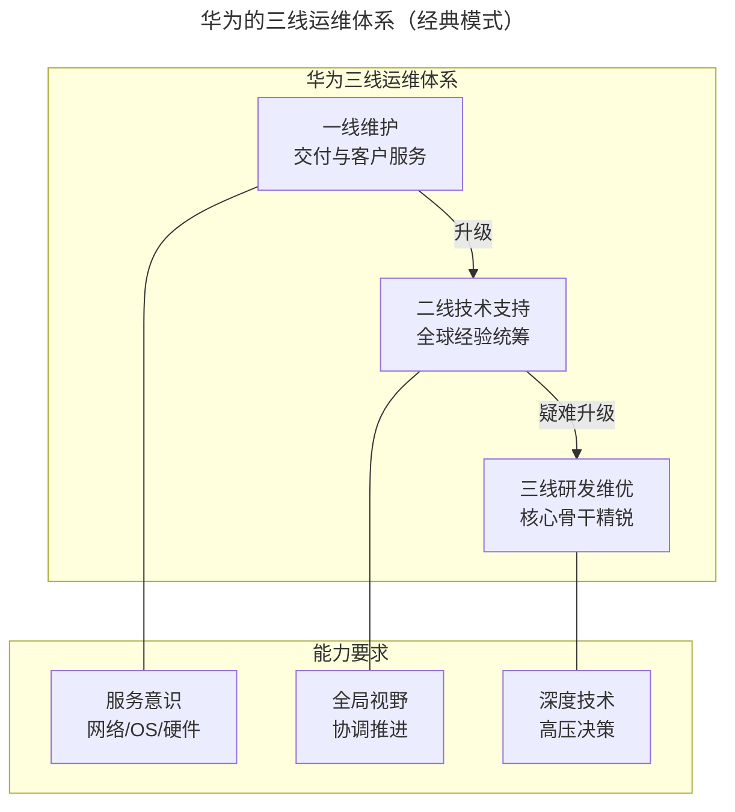
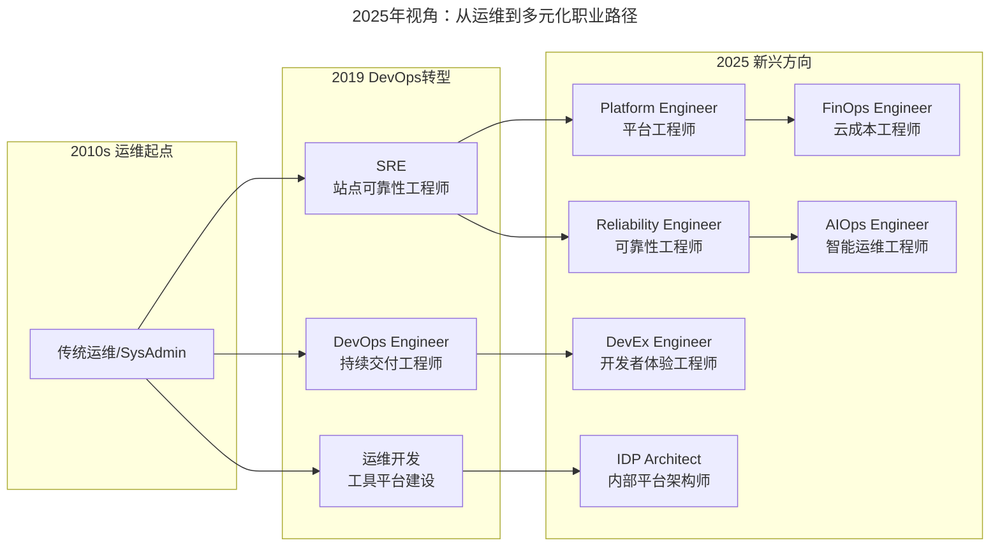
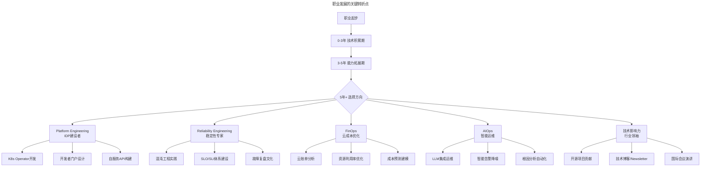

# 我是如何走上运维岗位的？

> **v2 升级摘要**：本文在保留原 frontmatter、所有 Mermaid 图、表格、案例与术语英文对照的基础上，按 v2 标准的 6 节骨架（导言、核心方法论、关键流程、工具与实战、常见误区、进阶延展）重新组织内容；补充 2025 年从运维到 Platform Engineering、DevEx Engineer、FinOps Engineer 等多元化职业路径的演进，更新能力模型对照表与行动清单，并将原参考资料内容融入进阶延展一节。

## 一、导言

在专栏介绍中，笔者简单分享了自己为什么会走上运维这个岗位，一是责任心使然，出现问题时总是会主动冲在前面解决，另一个是在这个过程中技能提升得很快，很有成就感。不过当时受篇幅所限，并没有完整说明，所以今天想再来聊一聊这个话题。

聊这个话题还有一个出发点，就是当下业界对运维的认知和定位还是存在很多问题的，有不少贬低运维的言论，所以想结合自己的经历谈谈对这个事情的看法，期望能够带给你一些启发。

**特别说明**：这篇文章最初写于 2019 年，当时正值 DevOps 转型的高潮期。如今到了 2025 年，技术环境发生了翻天覆地的变化——Platform Engineering 崛起、AI/LLM 深入工具链、远程办公常态化、新兴细分角色层出不穷。笔者会在保留原有个体经验的基础上，结合这些新变化，给你一个更加完整的职业发展图景。

## 二、核心方法论

### 2.1 我是怎么开始做运维工作的

我做运维是在加入华为 1 年后开始的。在华为内部，从来没有听说过任何贬低运维的说法，反倒是从华为出来，才开始听到一些言论，比如运维背锅、运维层次低等等，当时感觉还有点怪怪的。

我当时是在华为电信软件部门，大家熟知的短信、彩信、智能网、BOSS 计费系统以及运营商客服系统等都是这个部门的产品。到公司没多久就进入了一个新成立的项目组，为运营商开发一个阅读类互联网产品，因为是工作后参与的第一个正式项目，从需求讨论、方案选型、代码开发到上线这样一路跟来下，几乎倾注了所有的热情。

项目上线之后，基于运营商海量用户的积累，业务量很快就增长上来了，按照惯例，各种系统问题、故障宕机也随之而来了。当时团队规模不大，大家也都是齐心协力，出现问题总是一群人一起冲上去解决问题。之所以有这样的反应，主要是因为不忍心看到自己和团队一手打造出来的系统出问题。在华为，软件质量的荣誉感胜过一切。

因为我经验尚浅，所以一开始都是跟在后面看着主管和老员工解决，后来对于一些疑难问题，就会主动要求接过来研究一下，有时候一个问题要研究好几天才会有些眉目，不过也是在这样的一个过程中，随着解决的问题越来越多，经验也就越来越丰富，很快就成长了起来。

再加上我一直是出现问题后，第一个做出响应和冲到最前面的那个人，主管和团队也对我有了足够的信任和认可，也正是因为获得了这样的信任和认可，后来得到的成长机会就越来越多。

这里就分享一点：

- **要敢于承担责任，敢于表达自己的想法**。特别是对于职场新人，只有承担，且敢于承担更多更重要的责任，才能够快速成长起来。

当时，我们解决完问题，不仅仅是内部解决完就好了，还要给客户汇报。说实话，我当时认为这是非常浪费时间的事情，不过多年以后回过头来看，这个过程对于培养、提升自己的"软技能"是很有帮助的。

> **💡 2025 年补充：这些软技能在今天依然至关重要**
>
> 在 Platform Engineering 时代，虽然技术栈发生了巨大变化，但上述软技能的价值反而更高了：
> - **服务心态** → Platform Engineer 的核心就是为开发者提供自助服务平台，本质上是"内部开发者体验"
> - **表达能力** → 现在需要向 C-level 高管解释云成本优化（FinOps）的投资回报率，或者向产品团队说明可靠性工程如何保障业务连续性
> - **全面看问题** → AI/LLM 时代更需要系统性思维，因为 AI 工具能解决点状问题，但无法替代人的全局判断
> - **首问负责** → 在分布式团队和远程协作环境下，这种责任感更是稀缺品质

### 2.2 华为的三线运维体系（经典模式）

在华为内部，运维是非常受尊重而且非常关键的岗位。如果你在研发团队中一直写代码，没有做过运维工作，是很难晋升高级别岗位的。所以华为的架构师、技术经理甚至是更高级别的研发主管，按照不成文的规定，都默认要在运维团队轮岗过，然后再选拔出来。

华为的运维体系分为一、二、三线：

**1. 一线维护**：负责产品的交付服务和后续的客户服务工作，最重要的是必须要有非常强的服务意识。

**2. 二线技术支持**：面对某个产品全球的局点问题，在经验上更容易沉淀和积累，需要较强的推进协调能力。

**3. 三线研发维优**：从开发骨干精挑细选出来的维优团队，像军队中的突击队或尖刀连一样，总是冲在最前面，在高压状态下，解决最复杂、最棘手的问题。

上述这样一个非常严密的一、二、三线运维机制和协作体系，各条线各司其职，发挥各自优势作用，串联起了客户、产品和研发整个技术支持体系，基本上就支撑起了华为电信软件在全球局点的技术支持和服务工作。

这里我们不做过多发散，理解下来就是 **谁离客户最近，谁对客户负责，谁就能代表客户，谁就有最大的话语权，甚至是指挥权和决策权**。

## 三、关键流程

### 3.1 我为什么会把运维当作职业发展的方向

可能有些人觉得做运维是很低级的事情，让你做运维就是让你去填坑，其实对于这样的言论以及今天开头提到的什么运维背锅论，我是十分反对的。当然，更多的时候我也不是去解释，而是靠做事情来证明。

为什么会非常自豪，这就不得不提到华为内部，在当时来讲，就已经有非常完善和先进的运维体系和运作机制了。当时华为的三线研发维优，其实很像 Google 的 SRE 岗位，各方面能力要求很高，不仅仅是软件开发这么简单，所以当时让我去做运维，并且给到我足够的授权去组建和带团队，就相当于让我去做 SRE 这样高端的岗位，我自然会觉得非常自豪。

### 3.2 2025 年视角：从运维到多元化职业路径

如果我在 2025 年重新审视当年的选择，会发现运维这个起点给了我极其宽广的职业发展空间。

### 3.3 职业发展的关键转折点

回顾我的职业路径，有几个关键节点值得分享：

#### 第一阶段：技术积累期（0-3 年）
- **核心任务**：打好基础，建立全面的系统认知
- **关键行动**：深入掌握 Linux 操作系统原理和网络基础；学会至少一门 scripting 语言（Python/Go）；主动承担故障处理，积累实战经验；培养"首问负责"的服务意识

#### 第二阶段：能力拓展期（3-5 年）
- **核心任务**：从执行者变成设计者
- **关键行动**：参与或主导自动化工具/平台的建设；学习容器化和 Kubernetes；开始关注业务指标，而不只是技术指标；锻炼向上管理和对外沟通的能力

#### 第三阶段：价值跃迁期（5 年+）
- **核心任务**：找到差异化竞争优势
- **关键行动**（2025 年版）：
  - **方向 A - Platform Engineering 路线**：深入学习 IDP 建设，成为企业内部的"开发者赋能者"
  - **方向 B - Reliability Engineering 路线**：深耕混沌工程、SLO/SLI 体系，成为业务连续性守护者
  - **方向 C - FinOps 路线**：结合技术+财务双视角，成为稀缺的云成本优化专家
  - **方向 D - AIOps 路线**：将 LLM/AI 能力引入运维场景，成为智能化转型的推动者
  - **方向 E - 技术影响力路线**：通过开源、写作、演讲建立个人品牌，成为行业意见领袖

## 四、工具与实战

### 4.1 能力模型对照表：2019 vs 2025

| 维度 | 2019 年运维核心能力 | 2025 年新增/强化能力 |
|------|-------------------|-------------------|
| **基础设施** | Linux 管理、网络基础、虚拟化 | K8s 深度调优、多云管理、GitOps |
| **编程语言** | Shell/Python 脚本 | Go/Rust 系统编程、Python 全栈、TypeScript |
| **自动化工具** | Ansible/SaltStack/Puppet | Terraform/Pulumi/CDK、ArgoCD/Flux、GitHub Actions |
| **可观测性** | Zabbix/Nagios+Grafana | OpenTelemetry、Prometheus+Thanos、eBPF 观测 |
| **云原生** | Docker 基础、K8s 入门 | Service Mesh(Istio)、Operator 开发、CNCF 生态 |
| **AI/ML** | 基本概念了解 | Prompt Engineering、LLM 集成、AIOps 实践 |
| **产品思维** | 被动响应用户需求 | 内部开发者平台(IDP)设计、自服务产品设计 |
| **成本优化** | 基础资源管控 | FinOps 方法论、云成本分析、预留实例策略 |
| **安全合规** | 基础安全操作 | 零信任架构、合规自动化(SOC2/GDPR)、供应链安全 |
| **软技能** | 团队沟通、文档写作 | 技术演讲、开源贡献、跨时区协作、技术品牌建设 |

### 4.2 学习资源推荐（2025 年版）

#### Platform Engineering & IDP
- 📖 **书籍**：《Platform Engineering》(Manning, 2024, Camille Fournier & Ian Nowland)
- 🎓 **课程**：Humanitec 的 Platform Engineering Fundamentals
- 🛠️ **实践**：Backstage (Spotify 开源 IDP 框架)

#### Kubernetes & Cloud Native
- 📚 **认证**：CKA/CKAD/CKS (CNCF 官方认证，含金量高)
- 📖 **书籍**：《Kubernetes in Action》第 2 版、《Designing Distributed Systems》

#### Reliability Engineering
- 📖 **书籍**：《Site Reliability Engineering》(Google)、《Implementing Service Level Objectives》(O'Reilly, 2022)
- 🎯 **实践**：Chaos Engineering (Litmus/Chaos Monkey)

#### FinOps
- 📖 **书籍**：《Cloud FinOps》(O'Reilly, 2023)
- 🏢 **认证**：FinOps Foundation Certification

#### AI/LLM for Operations
- 🤖 **工具**：OpenAI API、Claude API、LangChain
- 📖 **资源**：Prompt Engineering Guide (DAIR.AI)

### 4.3 可操作的行动清单（本周就可以开始）

- [ ] **评估现状**：对照上面的能力模型表格，给自己打个分（1-5 分），找出差距最大的 3 项
- [ ] **选定方向**：根据兴趣和市场趋势，从 ABCDE 五个方向中选择 1 个作为未来 6-12 月的重点
- [ ] **制定计划**：为选定的方向制定 90 天学习计划，包含具体的里程碑和交付物
- [ ] **开始输出**：本周写一篇技术博客或在 GitHub 上创建一个小项目
- [ ] **加入社区**：找到 1-2 个相关的技术社区（Slack/Discord）并开始参与讨论
- [ ] **联系导师**：在 LinkedIn 或行业内找 1-2 位在你目标方向的资深从业者，尝试建立连接

## 五、常见误区

### 5.1 运维低级论

- **误区**：认为运维就是背锅、填坑、层次低
- **现实**：华为等头部企业的运维岗位非常受尊重，是高级别岗位的必经轮岗
- **建议**：不要被偏见左右，运维是离客户最近的岗位，价值自然最大

### 5.2 只提升技术技能，忽视软技能

- **误区**：只专注技术深度，忽视沟通、表达、服务意识
- **现实**：对个人职业发展帮助最大的，恰恰是良好的工作习惯和软技能
- **建议**：趁早养成良好的职业习惯，技术技能会过时，做事原则可迁移

### 5.3 拒绝承担挑战性工作

- **误区**：只做熟悉的事情，拒绝承担挑战
- **现实**：成长来自挑战，主管优先安排最稳妥的人去做重要事项
- **建议**：敢于承担责任，敢于表达想法，才能快速成长

### 5.4 在 2025 年仍把自己定义为"运维"

- **误区**：固守传统运维定位
- **现实**：Platform Engineering、DevEx、FinOps 等新方向才是高价值空间
- **建议**：将自己定义为"平台提供者"或"开发者赋能者"

## 六、进阶延展

### 6.1 给我们的一点启发

这样的一个发展过程并不是我刻意设计过的，机会也不是刻意争取到的，就是 **平时多做一点，做得认真一点，确保最终能够拿到结果，而且稍微努力一下，尽量拿到比预期好一些的结果**。在这个过程中，随着个人能力的提升和全面发展，后续各种机会也就随之而来了。

如果让我总结就是这么平淡无奇，如果让我给出个人发展建议，想要从普通做到优秀的话，就是上面几句话。

### 6.2 给 2025 年读者的具体建议

**1. 拥抱 Platform Engineering 思维**

不要把自己定义为"运维"，而要定义成"平台提供者"。你的价值不在于帮别人部署应用，而在于提供一个让任何人都能自助部署的平台。学习如何设计好的开发者体验（Developer Experience, DevEx），这将是未来 5-10 年的核心竞争力。

**2. 将 AI 作为杠杆，而非威胁**

2025 年，AI 已经深刻改变了运维的工作方式。但请记住：
- AI 擅长处理海量数据、模式识别、重复性任务
- AI 不擅长（短期内）的业务上下文理解、复杂决策、人际沟通
- **学会用 AI 放大你的能力，而不是担心被 AI 取代**

**3. 建立全球化视野**

2025 年，远程办公已经成为常态。你可以为海外公司工作，获得美元/欧元薪资；你的竞争对手不再只是本地同行，而是全球人才；英语能力和跨文化沟通变得前所未有的重要。

**4. 投资可迁移技能**

技术栈会过时，但这些能力永远不会：系统性思维和问题分解能力、清晰的书面和口头表达、同理心和换位思考、快速学习和适应变化、在不确定性中做出决策。

**5. 打造个人技术品牌**

在 2025 年，个人品牌的重要性远超 2019 年。具体做法：在 GitHub 上维护高质量的开源项目；定期撰写技术博客或 Newsletter；参与技术社区的讨论；尝试在 meetup 或会议上做技术分享；在 LinkedIn 上保持活跃的专业形象。

### 6.3 延伸阅读与参考资源

- **Platform Engineering**：《Platform Engineering》(Manning, 2024)、Backstage 官方文档、platformengineering.org 社区博客
- **Site Reliability Engineering**：Google SRE Books（免费在线阅读）、《Implementing Service Level Objectives》
- **FinOps**：《Cloud FinOps》(O'Reilly, 2023)、FinOps Foundation 官方认证资料
- **AI/LLM for Operations**：DeepLearning.AI 的"ChatGPT Prompt Engineering for Developers"、Learn Prompting 网站
- **个人品牌建设**：Substack、Hashnode、Dev.to 等写作平台与 GitHub Profile 最佳实践

岗位上，可能不会跟我一样去做运维，但却一样可以做到优秀的架构师、技术专家、项目经理或产品经理等等，只要你有心即可。