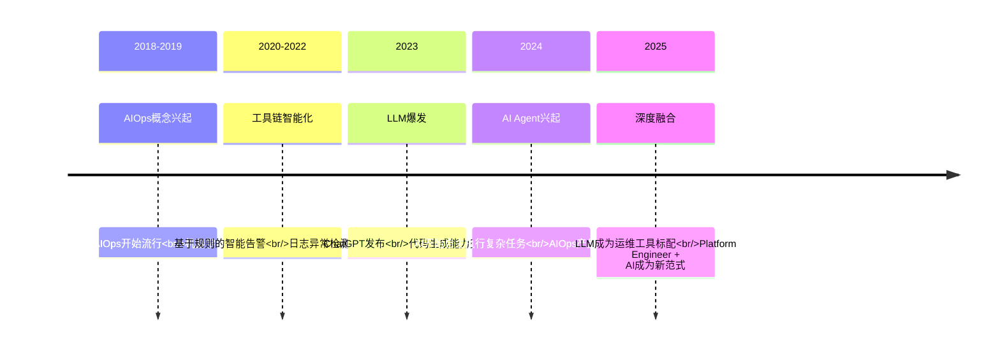
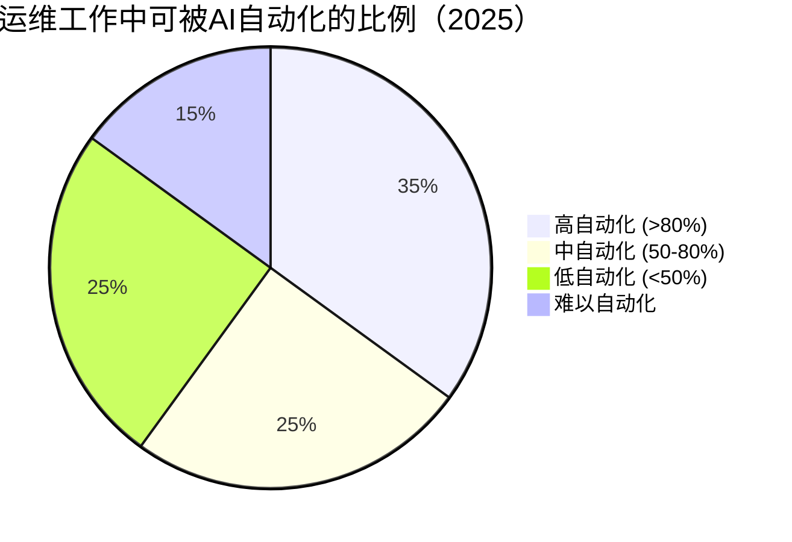
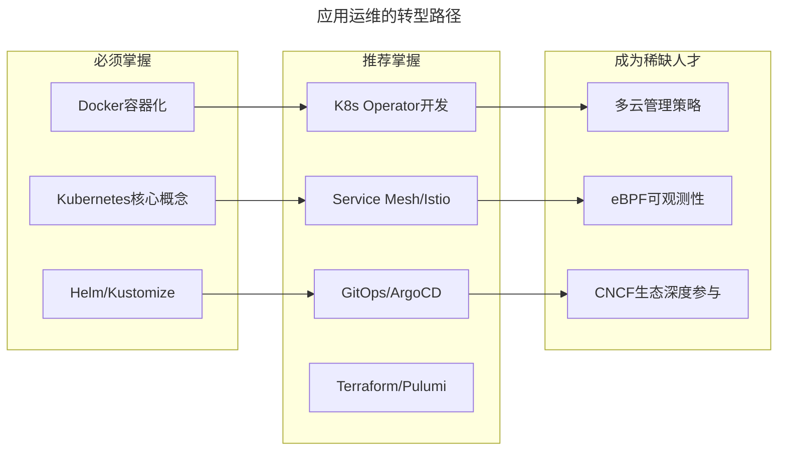
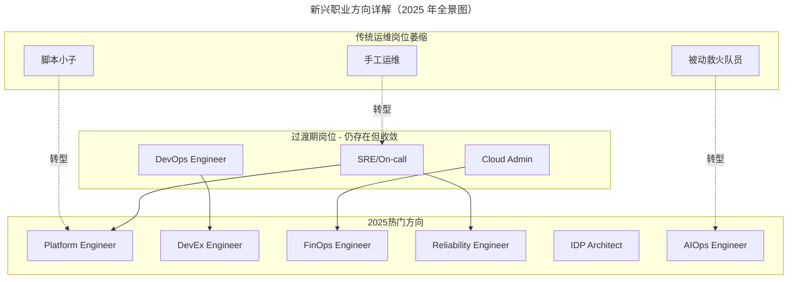

# 云计算和AI时代，运维应该如何做好转型？

> **v2 升级摘要**：本文在保留原 frontmatter、所有 Mermaid 图、表格、Prompt 模板与术语英文对照的基础上，按 v2 标准的 6 节骨架（导言、核心方法论、关键流程、工具与实战、常见误区、进阶延展）重新组织内容；补充 2025 年 LLM 实践期与 2019 年 AIOps 概念期的对比、Prompt Engineering for Operations 实操、新兴职业方向全景图，并将原参考资料内容融入进阶延展一节。

## 一、导言

> **⚠️ 重要说明**：本文是 2019 年原版的全面升级。原版讨论的是云计算萌芽期和 AIOps 概念期的运维转型；2025 版将深入探讨 **大语言模型（LLM）已经实际改变运维工作方式的当下**，以及每个从业者应该如何应对这场真正的技术革命。

今天来聊一聊，在云计算和 AI 时代，运维应该如何做好转型？今天的内容可以说是前面运维组织架构和协作模式转型的姊妹篇。

先来看业界的三个典型案例，一个来自国外，一个来自国内，最后一个是自己团队的案例，都非常具有代表性。

**先看国外 Netflix 的模式**：Netflix 内部的运维工作全部都由开发人员完成，平台也由开发自己完成，只保留极少的 Core SRE 角色专门响应和处理严重等级的故障。类似的还有亚马逊，无论是其电商业务，还是 AWS 公有云服务，全部都由开发搞定。

**再看国内阿里的模式**：阿里技术团队在 2016 年左右，也开始进行"去 PE"的组织架构调整，原来需要 PE 完成的运维工作，全部由开发承担。原来的 PE 要么转岗去做工具平台开发，要么作为运维专家做产品规划和设计。这种模式，与 Netflix 正好相反，也就是一开始技术能力无法满足要求的时候，能靠人就先靠人，然后过程中不断完善各类自动化平台。

**最后，说说笔者自己团队，发展过程中的模式**：从去年年初到目前，将近两年的时间里，自己的团队也没有招聘新的应用运维人员了。随着自动化逐步完善，效率不断提升，单个 PE 能够支持的业务变得越来越多；同时有意识地招聘具备开发能力的人员，他们入职后一方面参与各类平台的开发，另一方面还要定期轮岗做一些运维工作。

从上面的这几个案例来看，无论哪种情况，就运维来说，随着日常重复的人工操作被逐步自动化之后，如果还是固守原有的工作模式和思路，能做的事情、能够提供的价值，一定会越来越少。

## 二、核心方法论

### 2.1 2025 年的现实：AI 不是未来，而是现在

在进入具体的转型建议之前，想先分享一个关键认知：**2025 年的 AI 与 2019 年谈论的 AIOps 已经完全不同了**。

#### 2019 vs 2025：AI 在运维中的角色演变

| 维度 | 2019 年 AIOps 概念期 | 2025 年 LLM 实践期 |
|------|-------------------|-----------------|
| **核心技术** | 机器学习算法(ML) | 大语言模型(LLM)+多模态 AI |
| **主要应用场景** | 异常检测、告警降噪、容量预测 | 自然语言查询基础设施、自动生成 Runbook、智能故障诊断 |
| **成熟度** | 概念验证(PoC)阶段 | 生产环境广泛落地 |
| **使用门槛** | 需要数据科学家+大量标注数据 | 通过 API 调用即可使用，门槛大幅降低 |
| **典型工具** | 自研 ML 平台、开源 ML 库 | OpenAI/Claude/GPT API、GitHub Copilot、Cursor |
| **人机协作模式** | AI 辅助决策，人做最终判断 | AI 执行大部分常规任务，人处理复杂决策和例外情况 |
| **对岗位的冲击** | 理论讨论阶段 | 已经在实际替代部分重复性工作 |



### 2.2 "AI 会取代运维吗？"——理性分析

**AI 短期内不会完全取代的核心原因**：
1. **业务上下文的复杂性**：运维决策往往涉及复杂的业务权衡，AI 目前做不到
2. **责任归属问题**：当 AI 做出错误的决策导致生产事故时，法律和合规框架还在追赶技术的发展
3. **创新性问题的解决**：面对从未见过的问题类型，人类工程师的直觉、创造力和经验依然无可替代
4. **人际沟通与协调**：跨团队协作、向上管理、危机沟通——这些软技能 AI 短期内无法掌握

**AI 正在（并将继续）替代的部分**：

| 正在被替代的工作 | 替代程度 | 说明 |
|-----------------|---------|------|
| 重复性的脚本编写 | ★★★★★ (90%+) | LLM 代码生成已经非常成熟 |
| 日志 grep 和基础分析 | ★★★★☆ (80%+) | AI 可以快速理解大规模日志 |
| 文档撰写和维护 | ★★★★★ (95%+) | AI 写作能力已经超过大多数人 |
| 基础的 IaC 模板生成 | ★★★★☆ (85%) | 配合最佳实践，质量很高 |
| 常规告警研判 | ★★★☆☆ (60%) | 简单场景效果好，复杂场景仍需人 |
| 容量规划的初级分析 | ★★★☆☆ (65%) | 能做基础预测，复杂场景需调整 |
| 故障根因分析（简单） | ★★★☆☆ (55%) | 单一故障源效果好，复杂链路困难 |
| 复杂故障的决策 | ★★☆☆☆ (20%) | 仍高度依赖人的判断 |
| 跨部门协调沟通 | ★☆☆☆☆ (0%) | 无法替代 |
| 创新性架构设计 | ★★☆☆☆ (10%) | AI 只能辅助，不能主导 |



**笔者的结论**：

> **AI 不会取代运维工程师，但"会使用 AI 的运维工程师"会取代"不会使用 AI 的运维工程师"。**

这就像计算器没有让会计失业，但不会用 Excel 的会计早就被淘汰了一样。

## 三、关键流程

### 3.1 LLM 对运维各环节的实际影响（非概念炒作）

#### 1. 故障排查与诊断

**2025 年的方式（已落地的实践）**：
```
用户/系统提问："为什么订单服务的延迟突然升高了？"

AI助手响应（实际案例）：
1. 自动聚合过去1小时的相关指标（P99延迟、错误率、吞吐量）
2. 关联分析：发现延迟升高与数据库慢查询增加时间吻合
3. 根因定位：识别到某个新上线的SQL缺少索引
4. 给出建议：提供具体的DDL语句添加索引，并预估影响范围
5. 执行确认：询问是否要自动执行或人工审核后执行
```

**实际使用的工具**：Datadog Bits AI、PagerDuty AI（AIOps 套件）、Splunk AI、自建方案（OpenAI API + 内部知识库 + 监控数据 API）

#### 2. 运维文档与知识管理

**LLM 解决方案**：从工单历史、聊天记录、变更记录中自动生成 Runbook；基于企业内部知识库的自然语言问答系统；每次故障复盘后 AI 自动更新相关文档；一键翻译成团队成员熟悉的语言。

#### 3. 基础设施即代码（IaC）编写

```bash
# 用户输入（自然语言）：
"创建一个3节点的EKS集群，使用m5.large实例，
 启用集群自动伸缩，配置ALB Ingress，
 并部署一个11-Nginx基础概述示例应用"

# AI输出（完整可执行的Terraform/Helm配置）：
# [生成的完整IaC代码，包含最佳实践]
```

#### 4. 容量规划与成本优化

**AI 增强方式**：考虑业务季节性、促销活动、市场趋势的多因素预测；自动识别异常的资源使用模式；结合业务 SLA 要求和成本约束给出最优资源配置方案；自动生成成本优化报告和行动建议。

#### 5. 安全合规审计

**AI 的实际价值**：自动检测 IaC 中的安全漏洞；对照 SOC2/GDPR/等保要求自动审计；基于业务上下文（而非仅 CVSS 评分）评估风险；给出具体的修复代码。

### 3.2 应用运维的转型路径

如果只允许给一条建议的话，给出的建议依然是：**学会写代码**。

但在 2025 年，这条建议需要更精确的表述为四层能力升级：

#### 第一层：编程能力（必须具备）

| 语言 | 用途 | 学习优先级 | 投入时间 |
|------|------|-----------|---------|
| **Python** | 自动化脚本、AI/LLM 集成、数据处理 | ⭐⭐⭐⭐⭐ | 2-3 个月达到熟练 |
| **Go** | K8s Operator 开发、云原生工具、高性能服务 | ⭐⭐⭐⭐ | 3-4 个月达到熟练 |
| **TypeScript** | 前端 Portal 开发、IDP 界面、CLI 工具 | ⭐⭐⭐ | 2 个月入门 |
| **SQL** | 数据分析、容量规划、成本分析 | ⭐⭐⭐⭐⭐ | 1 个月精通 |

#### 第二层：云原生深度能力（差异化竞争力）



#### 第三层：AI/LLM 应用能力（2025 新增必修课）

**运维专用 Prompt 模板库**：

| 场景 | Prompt 要点 | 示例输出 |
|------|-----------|---------|
| 日志分析 | 附上日志片段+时间窗口+期望关注点 | 异常模式识别+根因假设 |
| 告警解读 | 告警内容+历史基线+业务上下文 | 严重程度+建议动作 |
| 变更审查 | 变更内容+影响范围+回滚方案 | 风险评估+改进建议 |
| 性能优化 | 当前指标+目标指标+约束条件 | 优化方案+预期收益 |
| 成本分析 | 账单数据+业务指标+优化目标 | 浪费识别+节省方案 |
| 文档生成 | 操作步骤+截图+注意事项 | 结构化 SOP+流程图 |

#### 第四层：产品意识和运营意识（价值放大器）

**提升产品意识**：将所做的事情整理汇总起来，做流程上的串联，再把流程中每个环节步骤的功能进行详细描述，将不合理、不规范的地方进行标准化约定，输出的内容就是平台开发所需要的需求分析和产品 PRD 的雏形。

**提升技术运营意识**：把承载了标准化和规范体系的工具平台真正落地应用起来，通过问题收集和数据分析，回到产品设计和需求实现流程中进行改进，形成良性闭环。

### 3.3 新兴职业方向详解（2025 年全景图）

#### 1. Platform Engineer（平台工程师）- 最热门方向

**核心价值**：为开发者构建自服务平台(IDP)，减少认知负载，提升研发效能
**典型职责**：设计和实现 Internal Developer Portal（如 Backstage）；构建 Golden Path；开发自助式基础设施服务 API
**薪资水平**：普遍高于同级别 SRE 20-40%

#### 2. DevEx Engineer（开发者体验工程师）- 2024 年后崛起的新角色

**核心价值**：系统性度量、分析和改善开发者体验
**典型职责**：建立 DevEx 度量体系（使用 SPACE 框架等）；进行开发者调研和反馈收集；优化 onboarding 流程和文档体验

#### 3. FinOps Engineer / 云成本工程师 - 高利润方向

**核心价值**：平衡性能、可靠性和成本，为企业省钱
**典型职责**：云账单分析和异常检测；资源利用率优化（Right-sizing）；预留实例/Spot 实例策略制定；成本分配和 showback/chargeback 机制建立

#### 4. Reliability Engineer（可靠性工程师）- SRE 深化方向

**核心价值**：专注于系统可靠性工程化，而非日常运维
**典型职责**：SLO/SLI/SLA 体系设计和运营；混沌工程实践和故障注入；可靠性预算管理；架构层面的可靠性评审

#### 5. IDP Architect（内部开发者平台架构师）- 战略级岗位

**核心价值**：从企业战略层面规划和实施内部平台
**汇报对象**：通常直接向 CTO/VP Engineering 汇报



## 四、工具与实战

### 4.1 Prompt Engineering for Operations 基础

**1. 结构化 Prompt 框架**
```
# 角色
你是一位资深SRE，拥有10年大规模分布式系统运维经验...

# 任务
请分析以下Prometheus查询结果，找出异常点...

# 上下文
这是一个电商平台的支付服务，当前正处于双11高峰期...
[附上具体数据和图表]

# 输出格式要求
1. 异常现象描述（1-2句话）
2. 可能的原因列表（按可能性排序）
3. 推荐的排查步骤（带具体命令）
4. 紧急程度评估和建议措施
```

**2. Chain-of-Thought（思维链）推理**
```
不要直接给我结论，请一步步思考：
第一步：先看CPU使用率是否异常？
第二步：如果是，是哪个进程导致的？
第三步：这个进程最近有变更吗？
第四步：结合部署历史，判断是否是回归问题？
最后：综合以上信息，给出你的结论。
```

**3. Few-Shot Learning（少样本学习）**
```
以下是一些成功的故障处理案例：
[案例1]
[案例2]
[案例3]

现在遇到类似情况：
[新问题描述]

请参考上述案例的处理思路，给出解决方案。
```

### 4.2 主流 AI 运维工具

- **Datadog Bits AI**：自然语言查询监控数据
- **PagerDuty AI**：智能事件关联和根因分析
- **Splunk AI**：日志智能分析和异常检测
- **GitHub Copilot（Agent Mode）/ Claude Code**：从描述直接生成 Terraform 模块
- **Amazon Q Developer**（原 AWS CodeWhisperer）：针对 AWS 资源的智能代码补全
- **自建方案**：OpenAI API + 内部知识库 + 监控数据 API

### 4.3 90 天 AI 时代转型行动计划

#### 第 1 个月：打好基础
- [ ] **Week 1-2**：深入学习一门编程语言（推荐 Python 或 Go），达到能独立写小型工具的水平
- [ ] **Week 3**：完成一个 K8s 实战项目（部署一个真实应用到 minikube/local 集群）
- [ ] **Week 4**：注册 OpenAI/Claude API 账号，完成官方 Tutorial

#### 第 2 个月：AI+运维实践
- [ ] **Week 5-6**：每天练习至少 5 个运维相关的 Prompt（日志分析、故障诊断、脚本生成等）
- [ ] **Week 7**：尝试用 AI 辅助完成一个实际的运维任务（如生成 Terraform 配置、编写 Runbook）
- [ ] **Week 8**：搭建一个简单的 AI 运维助手 Demo（可以是 Slack Bot 或 Web 界面）

#### 第 3 个月：方向聚焦与输出
- [ ] **Week 9-10**：选定一个新兴方向（Platform Eng/FinOps/Reliability/DevEx），深入学习
- [ ] **Week 11**：写一篇关于你学习心得的技术博客或在社区分享
- [ ] **Week 12**：回顾 90 天的成长，制定下一个季度的计划

## 五、常见误区

### 5.1 认为 AI 会完全取代运维

- **误区**：AI 时代运维岗位会消失
- **现实**：AI 替代的是重复性工作，但业务上下文理解、复杂决策、责任归属仍需人
- **建议**：把 AI 当作杠杆放大能力，而非威胁

### 5.2 固守传统运维定位

- **误区**：继续做手工运维、脚本小子、被动救火
- **现实**：传统运维岗位正在收敛，价值空间极为有限
- **建议**：向 Platform Engineering、DevEx、FinOps、AIOps 等高价值方向转型

### 5.3 认为"会写代码"就是护城河

- **误区**：学会了 Python/Go 就万事大吉
- **现实**：AI Coding Assistants 已大幅降低编程门槛，"会写代码"不再是足够的护城河
- **建议**：新的护城河是系统设计能力、业务理解力、架构决策力

### 5.4 忽视产品意识和运营意识

- **误区**：只做技术执行，不考虑价值呈现
- **现实**：能将运维操作转化为平台需求分析和产品 PRD 雏形的人才有更大价值
- **建议**：提升产品意识和技术运营意识，形成良性闭环

## 六、进阶延展

### 6.1 云计算和 AI 带给我们的挑战

机遇与挑战并存，上面我们更多地讲了机遇，但是与此同时我们也要看到挑战，甚至是危机。而最大的挑战和危机往往都不是来自内部，当我们还在纠结如何不被开发替代的时候，外面的技术环境已经发生了很大的变化，而这种变化带来的将是颠覆性的改变。

**2025 年的新挑战**：

- **挑战 1：Serverless 和 Managed Services 进一步压缩传统运维空间**：AWS Lambda/Fargate、Azure Functions、Google Cloud Run；Cloud RDS/ElastiCache/managed Kafka 等全托管服务；"运维"变成"配置选择"，而非"操作执行"
- **挑战 2：AI Coding Assistants 降低开发门槛**：GitHub Copilot、Cursor、Codeium 等工具让非专业程序员也能写出可用代码；"会写代码"不再是足够的护城河
- **挑战 3：全球远程劳动力竞争**：一位优秀的 Platform Engineer 可以为世界上任何公司工作
- **挑战 4：技术迭代速度加快**：K8s 每年 3-4 个大版本发布；CNCF 项目数量爆炸式增长；AI 工具几乎每月都在更新

### 6.2 总结

新时代下，机遇和挑战并存，确实面临着岗位和技能的转型。给出的建议（2025 增强版）：**学会写代码（特别是 Go/Python），培养产品意识，提升技术运营意识，并且——最重要的是——学会利用 AI 放大你的能力**。

**2025 年的新现实**：岗位在收敛，但在收敛后的岗位上，**单个从业者的价值和影响力反而更大了**。因为留下的都是真正创造价值的角色。

或许，**唯一的办法就是不断地学习和提升自己的技能，保持对技术发展趋势的敏锐性，及时做出调整和应对，才是根本的解决之道**。

**补充一句 2025 年的话**：在这个 AI 时代，**学习能力本身比任何具体的技术栈都更重要**。因为学到的东西可能会过时，但快速学习新东西的能力永远不会过时。

### 6.3 延伸阅读与参考资源

- **AI/LLM for Operations**：《Building LLM Powered Applications》(Packt, 2024)、DeepLearning.AI 的"ChatGPT Prompt Engineering for Developers"、Learn Prompting 网站、LangChain/LlamaIndex 框架
- **Platform Engineering**：《Platform Engineering》(Manning, 2024)、Backstage 官方文档、PlatformCon 大会演讲录像、platformengineering.org 社区博客
- **Kubernetes & Cloud Native**：CKA/CKAD/CKS 认证、《Kubernetes Patterns》、《Kubernetes Best Practices》
- **FinOps**：《Cloud FinOps》(O'Reilly)、FinOps Foundation Certification、Kubecost/OpenCost/Infracost 工具
- **Reliability Engineering**：《Site Reliability Workbook》、《Implementing SLOs》、Google SRE Books（免费在线阅读）
- **开发者体验（DevEx）**：《Team Topologies》、《Accelerate》、SPACE Framework
- **个人品牌与技术影响力**：Substack、Hashnode、Medium 写作平台与 GitHub 高质量开源贡献实践