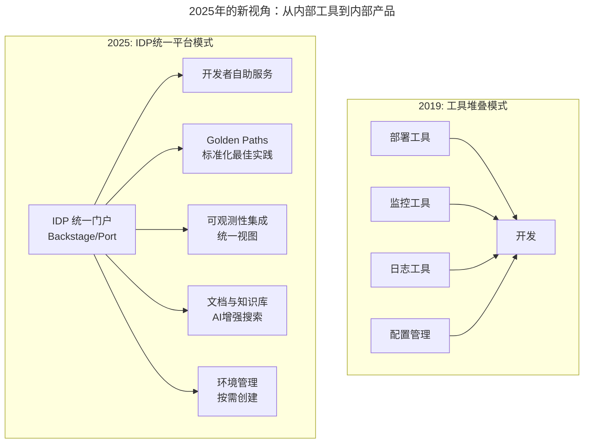
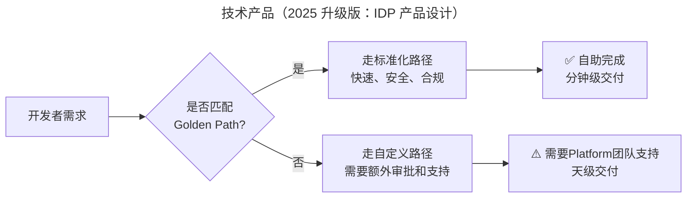
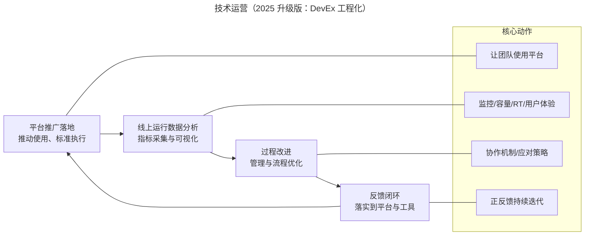
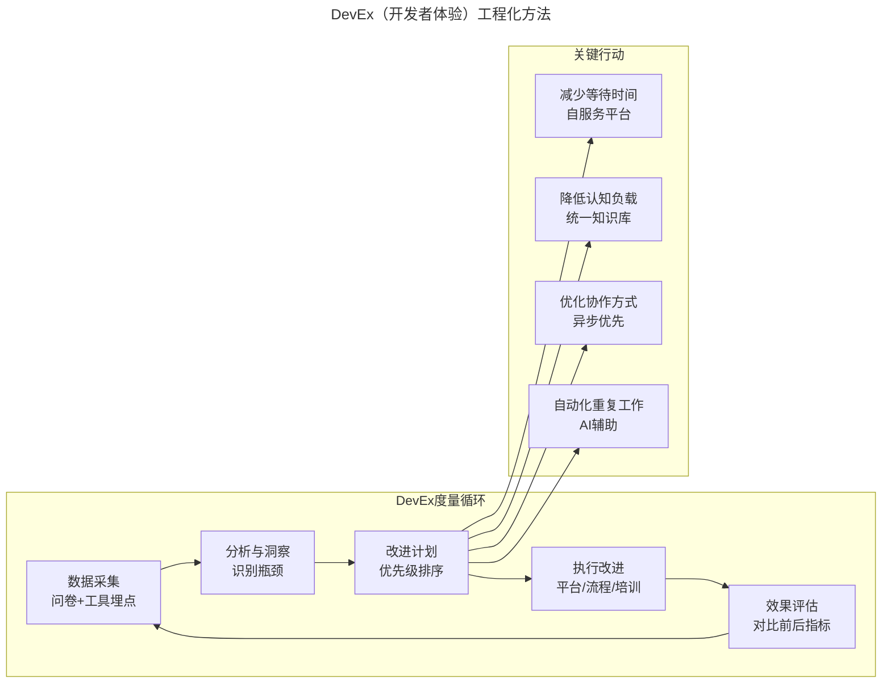

# 运维需要懂产品和运营吗？

> **v2 升级摘要**：本文在保留原 frontmatter、所有 Mermaid 图、表格与术语英文对照的基础上，按 v2 标准的 6 节骨架（导言、核心方法论、关键流程、工具与实战、常见误区、进阶延展）重新组织内容；补充 2025 年 Platform Engineering、DevEx Engineering、IDP 设计原则与 SPACE 度量框架，将原失效图片引用替换为 Mermaid 流程图，并将原参考资料内容融入进阶延展一节。

## 一、导言

在《云计算和 AI 时代，运维应该如何做好转型》这一期内容中，笔者提到两个转型建议：一个是技术产品，另一个就是技术运营。本文将更加聚焦地探讨这个观点。

**2025 年特别说明**：当年写这篇文章时，"技术产品"和"技术运营"还算是比较前瞻的理念。如今到了 2025 年，这些理念已经演变成了更成熟的学科和实践——**Platform Engineering（平台工程）**、**Developer Experience Engineering（开发者体验工程）** 和 **Internal Developer Platform（内部开发者平台，简称 IDP）**。笔者会在保留原有核心观点的基础上，分析这些理念如何在实际工作中落地。

运维接触更多的是软件生命周期中的运行维护阶段。这里想表达的是，应该敏锐地观察到，**研发团队对运维团队的诉求，以及运维呈现的价值已经发生了变化，更加需要能够帮助团队建设出高效运维体系的角色，而不是能够被动响应更多问题的角色**。

## 二、核心方法论

### 2.1 运维的角色转变和价值体现

打造一个运维体系，完全可以把它类比为一个产品业务体系。公司组织架构中，针对一个产品或业务，如果要对其进行技术上的实现，自然就离不开类似运营提需求，产品分析设计、业务架构师设计建模、开发实现以及测试保障这样一环套一环的配合，每个角色都发挥着独特的价值。

那么，对于一个运维体系，就相当于是面向研发团队内部的一套技术业务体系，只不过需求方和客户是开发人员，而不是业务人员。

对照一下可以发现，运维团队中技术环节的角色是不缺的，但是缺少的是业务环节的产品和运营角色。**然而做事情，不一定非要有岗位上的明确设置才能往下做，只要有能起到这个作用的人承担这样的职责就够了**。而这里，**最合适做这个事情的，一定是运维，因为运维是日常线上运维的执行者，只有运维最清楚这里面的细节、问题和痛点，换其他人可能很难能够讲清楚**。

当然了，也不能强制要求运维一定要完全具备产品经理和运营经理的专业素养，这样就本末倒置了。这里强调的是 **运维要有产品和运营意识**，总结起来最本质的就两点：**第一，能将需求讲清楚；第二，能将产品推广落地**。

### 2.2 2025 年的新视角：从"内部工具"到"内部产品"

在 2019 年，谈论的"技术产品"更多是指把运维工作流程化、平台化。但在 2025 年，这个概念有了质的飞跃：

| 维度 | 2019 年的理解 | 2025 年的理解 |
|------|-------------|-------------|
| **用户** | 运维团队自己 + 少数开发 | 全体开发者（甚至包括数据科学家、QA） |
| **定位** | 提效工具 | 开发者体验的核心载体 |
| **设计理念** | 功能导向 | 体验导向（像设计 C 端产品一样设计 B 端） |
| **成功指标** | 使用人数、覆盖率 | Developer Productivity Score (DPS)、Time-to-Market |
| **技术形态** | 烟囱式工具集 | 统一的 Internal Developer Portal (IDP) |
| **运营方式** | 推广使用、收集反馈 | 持续度量 DevEx、数据驱动改进 |

## 三、关键流程

### 3.1 技术产品（2025 升级版：IDP 产品设计）

关于技术产品，其实主要就是回答以下几个问题：

- 是不是能够把原本靠人工完成的很多工作转化成需求？
- 是不是能够把日常工作中运维和开发的痛点转化成需求？
- 是不是能够把当前系统存在的问题和隐患找出来，在解决的过程中，经过分析总结提炼成需求？

这个过程中，可以尝试把自己做的事情串一下，用流程图也好，时序图也好，把整个过程梳理一下。过程中每个环节具体要做的事情可以通过文字描述的方式写出来，尽量分条罗列，清晰有条理。这样可以一举两得，标准化制定能力、场景需求分析能力慢慢都提升上来了。

可以按照刚才讲的内容动手做一下，这样整理出来的一份文档或者内容，其实就是一个产品 PRD 的雏形。如果想要更进一步，有更加专业的输出，也可以参考了解一些产品设计方面的知识。

#### IDP 产品设计的核心原则

##### 原则 1：开发者优先（Developer-First）思维

不要从"我能提供什么功能"出发，而要从"开发者需要完成什么任务"出发。

**错误做法**：
- "我们有一个 K8s Dashboard，你们可以去用"
- "Terraform 模板在这里，自己看文档配置"

**正确做法**：
- "你想部署一个新服务？告诉我服务名，我来帮你搞定剩下的"
- "一键创建开发环境，预配置好所有依赖"

##### 原则 2：Golden Path（黄金路径）设计

不要给开发者无限自由（那会导致混乱），而是提供 **预定义好的、经过验证的最佳实践路径**。

**Golden Path 示例**：
- **微服务部署路径**：代码提交 → 自动 CI → 容器镜像构建 → K8s 部署 → 自动接入监控和日志
- **数据库申请路径**：填写表单 → 自动化审批 → 创建实例 → 配置备份和监控 → 提供连接信息
- **环境创建路径**：选择环境类型 → 自动创建完整环境 → 预置测试数据 → 提供访问入口

##### 原则 3：自服务（Self-Service）优先

目标是让 80% 的操作都能由开发者 **自助完成**，无需等待人工审批或干预。

**自服务能力矩阵**：

| 能力域 | 自服务成熟度 | 说明 |
|--------|------------|------|
| 环境创建 | ★★★★★ | 开发者可随时创建 dev/staging 环境 |
| 应用部署 | ★★★★☆ | 大部分应用可通过标准路径自动部署 |
| 数据访问 | ★★★☆☆ | 非敏感数据自助，敏感数据需审批 |
| 资源扩缩容 | ★★★★★ | 基于规则或 API 自动扩缩容 |
| 权限申请 | ★★★☆☆ | 标准权限自助，特殊权限需审批 |
| 故障排查 | ★★★☆☆ | AI 辅助+标准工具，复杂情况需 SRE |

##### 原则 4：可组合性和可扩展性

IDP 不应该是一个庞大的单体系统，而应该是 **可插拔组件的集合**。推荐架构模式：Plugin Architecture（类似 VS Code 的插件机制）；Micro-Frontend（不同团队负责不同的 IDP 模块）；API-First（所有能力通过 API 暴露，便于集成和自动化）。

### 3.2 技术运营（2025 升级版：DevEx 工程化）

通过上面技术产品的工作，可以做出一些有针对性的工具和平台来。然而，仅仅有工具和平台还远远不够，因为只有把这个平台真正落地，并产生了实际效果，才是有意义、有价值的。这个"真正落地"就是技术运营要做的事情。

技术运营的核心流程如下：

- **平台推广落地**：工具做出来了只是第一步，得要有人用，这就需要去推动落地，让大家都来使用，从而真正给团队带来规模上的效率提升。同时，技术产品也是各种标准和规范的载体，在这个落地过程中，也是标准落地和执行的过程。
- **线上运行数据分析**：通过平台和工具，对线上业务和应用运行时的指标进行数据分析。应用上线或者每次变更上线后，线上运行的情况是怎样的，容量有没有降，RT 有没有上涨，监控有没有异常，用户体验有没有下降。**在这一点上，应该要形成对整个业务和技术架构体系改进和完善的正反馈才行**。
- **过程改进**：平台更多的是一个执行工具，但是工具的使用是要配合大量的标准和流程一起来运作的。过程中需要改进和完善的内容，能够落实到平台和工具的，也要形成正反馈，来提升工具和平台的效率。

**面临的业务场景在不断发展和变化，这就决定了技术运营过程也必然是一个持续发展和完善的过程。故从这个角度讲，技术运营的生命力和竞争力将会是持久的**。

### 3.3 DevEx（开发者体验）工程化方法

如果说"技术运营"关注的是平台的 **使用率** 和 **效果**，那么"DevEx Engineering"关注的则是 **开发者在使用这些平台和工具过程中的感受和效率**。

#### 为什么 DevEx 如此重要？

研究表明（来自 GitHub、GitLab、DevEx 调研）：
- **良好的 DevEx 可以将开发者生产力提升 50% 以上**
- 开发者每天平均只有 **30%-40% 的时间** 在写真正的代码
- 其余时间花在：等待构建/部署、调试环境问题、查找信息、开会...
- **改善 DevEx = 直接提升业务交付速度**

#### SPACE 框架：如何度量 DevEx

SPACE 是目前业界最认可的 DevEx 度量框架，包含 5 个维度：

| 维度 | 英文全称 | 度量什么 | 示例指标 |
|------|---------|---------|---------|
| **S**atisfaction | 满意度 | 开发者的整体满意度和幸福感 | eNPS 评分、调研问卷 |
| **P**erformance | 绩效 | 开发者产出效率和成果 | 代码提交频率、PR 合并时间、部署频率 |
| **A**ctivity | 活动 | 开发者的行为和参与度 | 工具使用频率、文档贡献、代码评审参与 |
| **C**ommunication | 沟通 | 协作和沟通效果 | 会议时间占比、异步沟通比例、响应时间 |
| **E**fficiency | 效率 | 流程顺畅度和阻力点 | 流程等待时间、认知负载指数、上下文切换次数 |

**实施步骤**：
1. **基线测量**：通过问卷+工具数据建立当前 DevEx 基线
2. **识别痛点**：找出分数最低的维度和具体问题
3. **设定目标**：制定可量化的改进目标（如"将部署等待时间从 2 小时降到 15 分钟"）
4. **实施改进**：针对痛点进行具体的改进措施
5. **持续跟踪**：定期重新测量，形成 PDCA 闭环

## 四、工具与实战

### 4.1 IDP 技术选型参考（2025 年版）

| 组件类别 | 开源方案 | 商业方案 | 选择建议 |
|---------|---------|---------|---------|
| **Portal 框架** | Backstage (Spotify) | Port, Humanitec | Backstage 生态最活跃 |
| **Catalog 服务** | Backstage Catalog | Port Catalog | 取决于 Portal 选择 |
| **Template 引擎** | Backstage Scaffolder | Humanitec Templates | 支持自定义模板 |
| **K8s 集成** | Backstage Kubernetes 插件 / Crossplane | Rafay, Loft | 规模决定 |
| **可观测性** | Grafana/Prometheus | Datadog, New Relic | 已有栈决定 |
| **身份认证** | OAuth2/OIDC | Okta, Auth0 | 企业 SSO 要求 |
| **AI 助手** | 自建 LLM 集成 | Copilot, AWS Q Developer | 预算和需求 |

### 4.2 DevEx 改进的实际案例

**案例 1：减少环境等待时间**

*问题*：开发者平均等待 3 天才能获得一个新的测试环境

*解决方案*：
1. 引入环境自服务平台（基于 Terraform+K8s）
2. 设置自动化的资源配额和回收策略
3. 开发者可通过 IDP Portal 一键申请

*结果*：等待时间从 3 天降到 15 分钟（99% 的场景）；开发者满意度提升 40%；资源利用率提升 60%（自动回收空闲环境）

**案例 2：降低认知负载**

*问题*：新人 onboarding 平均需要 2 周才能独立上手

*解决方案*：
1. 在 IDP 中集成统一的文档中心
2. 为每个服务生成自动化的 Runbook
3. 引入 AI 驱动的智能搜索（基于 RAG 技术）
4. 建立"新人 Onboarding Checklist"

*结果*：Onboarding 时间缩短到 3 天；新人首月产出提升 35%；老员工被打扰的时间减少 50%

### 4.3 从技术运营到 Platform Engineer 的能力跃迁

#### 能力雷达图对照

| 能力维度 | 传统运维(2015) | 技术产品/运营(2019) | Platform/DevEx Engineer(2025) |
|---------|---------------|-------------------|------------------------------|
| **基础设施操作** | ★★★★★ | ★★★★☆ | ★★★☆☆ (委托给云/IaC) |
| **脚本编写能力** | ★★★☆☆ | ★★★★☆ | ★★★★★ (Go/Python/TS) |
| **产品思维** | ★☆☆☆☆ | ★★★☆☆ | ★★★★★ (以用户为中心) |
| **数据分析能力** | ★★☆☆☆ | ★★★☆☆ | ★★★★☆ (DevEx 度量) |
| **用户体验设计** | ☆☆☆☆☆ | ★★☆☆☆ | ★★★★☆ (DevEx 优化) |
| **沟通协调能力** | ★★★☆☆ | ★★★★☆ | ★★★★★ (跨团队影响力) |
| **AI/ML 应用** | ☆☆☆☆☆ | ☆☆☆☆☆ | ★★★☆☆ (AI 增强运营) |
| **业务理解力** | ★★☆☆☆ | ★★★☆☆ | ★★★★☆ (价值导向) |
| **开源社区参与** | ★☆☆☆☆ | ★★☆☆☆ | ★★★☆☆ (CNCF/Backstage) |
| **技术写作能力** | ★★☆☆☆ | ★★★☆☆ | ★★★★☆ (文档+博客) |

### 4.4 转型路线图

如果你现在是传统运维，想向 Platform/DevEx 方向转型：

**Phase 1（1-3 个月）：补齐技术短板**
- [ ] 深入学习一门编程语言（Python 或 Go）
- [ ] 掌握 Kubernetes 核心概念和基本操作
- [ ] 学习 Terraform 或类似的 IaC 工具
- [ ] 了解容器化和 CI/CD 的基本原理

**Phase 2（3-6 个月）：建立产品思维**
- [ ] 学习产品设计基础（推荐：《用户体验要素》）
- [ ] 尝试绘制用户旅程图（User Journey Map）
- [ ] 参与或主导一个小型工具的需求分析和设计
- [ ] 学习如何写 PRD（产品需求文档）

**Phase 3（6-12 个月）：深入 DevEx/Platform 领域**
- [ ] 深入研究 Backstage 或其他 IDP 框架
- [ ] 了解 SPACE 框架和 DevEx 度量方法
- [ ] 参与实际的平台建设项目
- [ ] 开始在团队内推广 DevEx 理念和度量

**Phase 4（12 个月+）：成为领域专家**
- [ ] 在公司内部建立 DevEx 度量体系
- [ ] 主导或深度参与 IDP 建设
- [ ] 通过博客/演讲分享你的实践经验
- [ ] 加入相关开源社区或行业组织

## 五、常见误区

### 5.1 运维不需要产品和运营意识

- **误区**：运维只做技术执行，产品运营是产品和运营经理的事
- **现实**：运维最清楚线上细节、问题和痛点，最适合承担技术产品和运营角色
- **建议**：运维要有产品和运营意识——能将需求讲清楚，能将产品推广落地

### 5.2 内部工具不需要产品思维

- **误区**：内部工具功能实现即可，不需要体验优化
- **现实**：良好的 DevEx 可以将开发者生产力提升 50% 以上
- **建议**：像设计 C 端产品一样设计内部平台，以用户（开发者）为中心

### 5.3 工具做出来就万事大吉

- **误区**：平台开发完成即项目结束
- **现实**：只有平台真正落地并产生实际效果才有价值
- **建议**：重视技术运营——推广落地、数据分析、过程改进形成正反馈

### 5.4 给开发者无限自由

- **误区**：平台提供全部能力，让开发者自由组合
- **现实**：无约束的自由会导致混乱和不一致
- **建议**：提供 Golden Path（预定义的最佳实践路径），80% 的操作走标准路径

## 六、进阶延展

### 6.1 总结

**运维虽然不是业务系统的实现者和代码的开发者，但是参与到了产品技术标准的制定、业务系统运维体系的建设以及后期的技术运营中，这个时候运维已然成了整个技术架构的设计者之一，而且是架构稳定和演进的看护者，这时所发挥的作用和呈现的价值已大不相同**。

**2025 年的补充总结**：

在 Platform Engineering 和 DevEx Engineering 的时代，运维人的角色已经从"**后台的支持者**"转变为"**开发者赋能的产品人**"。这不仅仅是名称的变化，更是思维方式和工作方法的根本转变：

1. **从"我怎么方便"到"开发者怎么方便"**
2. **从"功能实现"到"体验优化"**
3. **从"被动响应"到"主动设计"**
4. **从"工具堆砌"到"平台思维"**
5. **从"直觉判断"到"数据驱动"**

从技术产品和技术运营的角度再来思考一下运维，现在的运维还是之前那个运维吗？

### 6.2 延伸阅读与参考资源

#### Platform Engineering & IDP
- 📖 **必读**：《Platform Engineering》(Manning, 2024)
- 🛠️ **实战**：Backstage 官方文档 (backstage.io)
- 🎥 **视频**：PlatformCon 2024 演讲合集
- 💡 **案例**：Spotify、Shopify、Azure 的 IDP 实践分享

#### Developer Experience (DevEx)
- 📊 **框架**：SPACE Framework 论文 (ACM Digital Library)
- 📖 **书籍**：《Team Topologies》、《Accelerate》、《Measure What Matters》
- 🔬 **调研**：GitHub State of the Octoverse、GitLab Global DevSecOps Report

#### 产品设计与用户体验
- 📖 **入门**：《About Face 4: 交互设计精髓》、《Don't Make Me Think》
- 🎯 **方法论**：Design Thinking、Jobs To Be Done (JTBD)
- 🛠️ **工具**：Figma（原型设计）、Miro（协作白板）、Hotjar（用户行为分析）

#### 数据分析与可视化
- 📊 **工具**：Grafana、Metabase、Tableau
- 📖 **书籍**：《Storytelling with Data》、《Data Points》
- 🔗 **技能**：SQL 进阶、Python 数据分析(Pandas/Matplotlib)

> **💡 实践建议**
>
> 本周就可以开始的小行动：
> 1. 找一位开发者同事，采访他/她在日常工作中的最大痛点是什么
> 2. 画出你所在团队的"开发者旅程地图"，找出可以优化的环节
> 3. 如果你的公司已经有 IDP 或开发者平台，去实际使用一周，记录你的体验和改进建议
>
> 记住：**最好的产品思维训练，就是把自己当成用户**。

如果今天的内容对你有帮助，也欢迎你分享给身边的朋友。