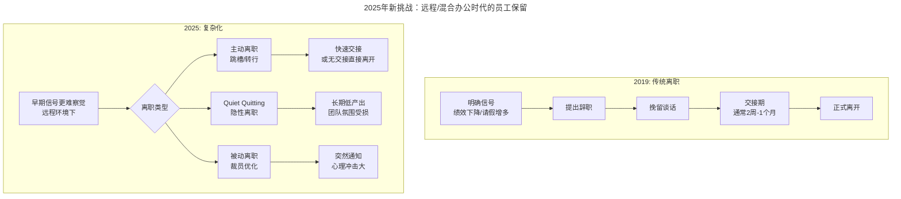
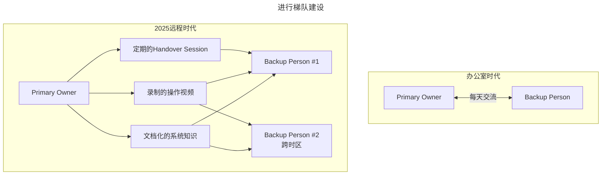
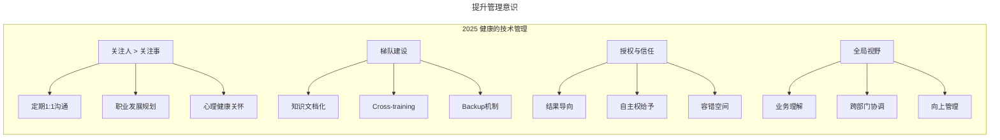

# 冷静下来想想，员工离职这事真能"防得住"吗？

> **v2 升级摘要**：本文在保留原 frontmatter、所有 Mermaid 图、表格、1:1 沟通模板与术语英文对照的基础上，按 v2 标准的 6 节骨架（导言、核心方法论、关键流程、工具与实战、常见误区、进阶延展）重新组织内容；补充 2025 年远程/混合办公时代的 Quiet Quitting、全球化人才竞争、分布式 Backup 机制、心理健康敏感度等新挑战，并将原参考资料内容融入进阶延展一节。

## 一、导言

> **时代背景更新**：2019 年写这篇文章时，远程办公还只是少数公司的尝试；到了 2025 年，混合办公已成为常态，全球化团队协作司空见惯。这给技术管理带来了全新的挑战和机遇——本文将在保留原有核心观点的基础上，融入这些新现实。

本周主要分享几个关于个人成长的话题。前文讨论了在新时期运维如何做好转型，运维是不是要懂产品和运营这两个内容，都是为了能够成长为技术骨干，最大限度地发挥出自己岗位的价值。

本文将探讨当从技术岗位转换到管理岗后，应该如何适应新的角色，做好技术管理。技术管理这个话题很大，不是一下子就能说透彻的。故，笔者将处理员工离职问题做为一个切入点，从这个角度说起。

年末年初，对于任何一家公司或者一个团队来说，最令人头疼的事情就是员工离职问题，特别是骨干员工的离职，对团队带来的影响和损失，以及团队氛围和信心上的影响是非常大的。

**Design For Failure 的软件架构设计理念，同样也适用于技术管理工作**。

### 2025 年新挑战：远程/混合办公时代的员工保留

**1. 远程办公带来的"隐形离职"**

传统离职是明确的：提辞职 → 交接 → 离开。但在远程办公环境下，出现了新的现象：
- **"Quiet Quitting"（安静离职）**：人还在岗位上，但只做最低限度的工作
- **"Remote Disengagement"（远程脱节）**：因为缺乏面对面交流，逐渐与团队疏离而不自知
- **"Zoom Fatigue Burnout"（视频疲劳倦怠）**：过度在线会议导致的心理耗竭

**2. 全球化人才竞争**

2025 年，你的团队成员可能收到来自世界各地的 Offer：硅谷公司提供 remote 职位，薪资是本地的 3-5 倍；欧洲公司提供更好的 work-life balance；新加坡/迪拜等地提供税收优惠。



## 二、核心方法论

### 2.1 关于员工离职的两个观点

先给出对于离职的 **第一个观点**：**对于离职这个事情，本质上就是员工个人发展和团队发展不匹配之间的矛盾**。

稍微解读一下就是，如果员工个人发展速度很快，而团队提供的空间或机会不足，员工就会调岗甚至离职，寻求更好的利于个人发展的机会；而如果公司和团队发展很快，员工跟不上组织发展的节奏，这种情况极有可能就会被团队淘汰。

反观其它的理由，主管因素、薪酬福利，或者因为世界太大想去看看等等，这些都只能算是表面上的直接因素，或者叫导火索因素。

#### 2025 年补充：不匹配的新形式

| 不匹配类型 | 2019 年常见表现 | 2025 年新增表现 |
|-----------|---------------|---------------|
| **技能不匹配** | 技术栈过时 | AI 工具使用能力差异巨大 |
| **工作方式** | 加班文化冲突 | 远程 vs 办公室偏好不同 |
| **价值观** | 公司文化不合 | 对 AI 伦理、ESG 等议题看法分歧 |
| **职业目标** | 想做管理/技术 | 想要全球化职业、数字游民生活 |
| **薪酬预期** | 跳槽涨薪 30% | Remote offer 带来 2-3 倍薪资 |
| **成长速度** | 个人快于组织 | 个人学习速度远超团队能提供的挑战 |

接着彼此间发展诉求的矛盾这个问题，再给出 **第二个观点**：**对于员工离职，从管理者角度，应该理解为必然结果，坦然接受，而不是避而不谈**。

每个人在不同阶段，总会有不同的成长和发展诉求，所以总会有一部分员工在一家公司待到一定年限之后，会为了寻求更加适合自己的机会而离开。上面这个观点来自于领英联合创始人里德·霍夫曼写的《联盟》这本书。

如果能意识到是必然结果，那要做的是 **Design For Failure**，**不要试图去完全避免和杜绝离职，而是要有措施能够有效规避离职带来的问题和风险**。也许 **最大的问题在于，道理都懂，但是能做到的不多**。

### 2.2 谈谈如何做好技术管理（2025 增强版）

#### 1. 帮助员工做好个人中长期发展目标规划

主管应该跟员工一起确认员工任期内的中长期成长和发展目标，让员工能够在任期内发挥最大的作用和价值。

**这里很重要的一点，做技术管理者，一定要从关注事情、管理事情转换到关注人的层面。要关注人的成长发展，关注成长发展中的问题和疑惑，关怀人的工作体验和心理感受，这个才是管理的核心。一定不要忽略人这个核心要素，人的事情搞不定，其它任何事情都无从谈起**。

这个事情要放到平时做，从团队人数还不多的时候就开始。笔者的团队 30 多人，基本每个月都和团队的每一个人做一次一对一沟通。如果实在忙不过来，那就针对核心骨干和有潜力的员工。

##### 2025 新增：在远程环境下的 1:1 实践

远程办公让 1:1 沟通变得更加重要，但也更具挑战性：

**最佳实践**：
- **固定频率**：每两周至少一次，30-45 分钟
- **视频优先**：能看到表情和肢体语言，避免纯文字/语音的误解
- **议程共享**：提前共享讨论要点，让双方都有所准备
- **双重视角**：既聊工作和目标，也关心个人状态和感受
- **记录跟进**：关键决定和行动项要有书面记录

**1:1 沟通模板参考**：
```
## 1:1 Meeting Agenda - [日期]

### Check-in (5分钟)
- 最近感觉怎么样？能量水平如何？
- 有什么让你感到兴奋或焦虑的事情吗？

### 目标回顾 (10分钟)
- 上次讨论的行动项进展如何？
- 当前OKR/KPI完成情况？
- 遇到什么障碍需要支持？

### 发展讨论 (15分钟)
- 近期学到了什么新技能/知识？
- 有什么想要尝试的新领域或项目？
- 职业发展上有什么想法或困惑？

### 反馈交换 (10分钟)
- 我有什么可以做得更好的？（下属给上级的反馈）
- 我观察到的一些亮点和建议（上级给下属的反馈）

### 开放话题 (5分钟)
- 还有什么想聊的？

### Action Items
- [ ] ...
```

## 三、关键流程

### 3.1 进行梯队建设

各层管理者和 HRBP，要有意识做好梯队建设，确保人才能够源源不断地输入。如有员工离职能够有人顶上来，至少是有 Backup，不至于因为一两个人离职团队就垮掉了。

**团队成员不一定都是水平很高、能力很强的人，关键是要合适，能形成合力**。所以团队中既要有经验丰富和技能突出的明星员工，又要有发展诉求强烈的骨干员工，还得要有对各种事情充满激情和新鲜感的小鲜肉。

#### 2025 新增：分布式团队的梯队建设

在远程/全球化环境下，梯队建设面临新的挑战：

**挑战 1：知识孤岛更容易形成**
- 解决方案：强制文档化（所有重要决策和流程必须文档化）；定期的 Knowledge Sharing sessions（录播供异步观看）；建立"Bus Factor"意识（每个关键系统至少 2 人熟悉）

**挑战 2：导师制难以落地**
- 解决方案：Virtual Mentorship Program（配对跨时区的 mentor-mentee）；Structured Onboarding Checklist（新人清单，不依赖人口口相传）；Async Feedback Culture（鼓励异步文字反馈，减少实时压力）

**挑战 3：Backup 机制的设计**



**关键原则**：
- **不要依赖单个 Backup**：至少 2 个，最好是跨时区的
- **知识必须显性化**：不能存在某人脑子里
- **定期轮换 On-call 职责**：让更多人接触生产系统
- **交叉培训计划**：每个季度安排跨角色的学习任务

### 3.2 提升管理意识

笔者也是从技术转技术管理，说实话栽了很多跟头，吃了很多亏，才慢慢有所转变，这个过程比较漫长。故，对于刚做技术管理者的员工，HR 团队一定要辅助做好"转身"的培训和赋能。

同时，在这个事情上，更高级主管层面也应该要有些耐心，甚至有些时候要容许一些管理上的失误，不至于一出问题就一竿子打死。

#### 2025 新增：技术管理的"软技能"升级

**1. 同理心（Empathy）**：理解远程员工的孤独感和归属感需求；认识到每个人的家庭和生活状况不同；在危机时刻（如裁员、重组）展现人文关怀

**2. 跨文化沟通能力**：尊重不同文化背景下的沟通风格差异；了解高语境 vs 低语境文化的区别；避免文化偏见影响评价和决策

**3. 信任建设**：从"监控结果"转向"信任赋能"；结果导向而非过程导向的管理；给予充分的自主权和决策空间

**4. 心理健康敏感度**：识别职业倦怠（Burnout）的早期信号；了解并推广 EAP（员工援助计划）资源；建立心理安全（Psychological Safety）的团队氛围



## 四、工具与实战

### 4.1 技术管理中引以为戒的反模式（2025 增强版）

#### 反模式 1：事必躬亲

最常见的情况就是所有事情都会参与、过问甚至是干涉，更甚者，因为自己做更快，就懒得指导员工，直接亲自上手做。这样下去，久而久之，就相当于剥夺了员工成长的机会，剥夺了员工独立思考的机会。

建议是，对于非紧急的事情，还是让员工自己动手完成。可以指导，可以给建议，但是不要代替员工执行和思考。

**2025 补充：Micromanagement 在远程环境下危害更大**

在远程环境中，过度管理（micromanagement）的表现形式：
- 要求员工开启摄像头全天候在线
- 每小时要求汇报进展
- 使用监控软件追踪员工活动
- 不信任异步工作成果

**后果**：员工感到不被信任，积极性急剧下降；创造力和主动性被扼杀；优秀人才加速流失（尤其是自我驱动型的人才）；团队氛围变得压抑和有毒。

#### 反模式 2：总认为自己才是最正确的

懂得授权和分配工作后，往往把自己的想法和经验强加于员工，因为总觉得自己的经验才是最好的。长久下去，员工的主观能动性就没有了。

建议跟上条相似，可以更多地给员工授权，多从边界条件和目标结果上提问，让员工主动思考。

#### 反模式 3：仅仅关注技术层面，忽略全局

因为技术管理者大多是从技术岗位上成长起来的，有时看问题难免会片面。典型的一个问题就是只关注技术层面，不看全局。建议，技术管理者一定要先关注全局，然后再看细节。对于管理者的要求，更多的是要"**做成事情**"，而不再是技术骨干阶段的"**做事情**"。

#### 反模式 4：忽视心理健康和工作边界

**表现**：认为远程员工"在家工作 = 随时待命"；在非工作时间频繁发消息/邮件；不尊重员工的"下班时间"和个人空间；将加班文化美化为"奋斗精神"。

**正确做法**：明确工作时间边界，带头遵守；推行"断联权"（Right to Disconnect）政策；关注员工的 workload 和 wellbeing；以身作则，自己先做到工作生活平衡。

#### 反模式 5：数字鸿沟中的不公平对待

**表现**：办公室的员工获得更多机会和曝光；远程员工被边缘化，重要决策不知情；晋升和奖励偏向于"看得见"的人；会议时间总是以总部时区为准。

**正确做法**：重要会议录制并异步分享；轮换会议时间照顾不同时区；晋升评估基于客观指标而非"可见度"；故意创造远程员工的曝光机会。

### 4.2 给技术管理者的行动清单

#### 本周就可以开始的事情
- [ ] 安排与每位直属下级的 1:1 沟通（如果超过一个月没做了）
- [ ] 审视团队的 Backup 覆盖情况，找出单点故障风险
- [ ] 检查是否有重要的知识只存在于某人的脑子里
- [ ] 反思自己是否存在 micromanagement 的倾向

#### 本月可以推进的事情
- [ ] 为每位成员建立或更新个人发展计划（IDP）
- [ ] 启动或优化团队的 Knowledge Documentation initiative
- [ ] 组织一次关于职业发展的团队讨论会
- [ ] 评估团队的心理健康状况（可以用匿名问卷）

#### 本季度可以规划的事情
- [ ] 建立或完善 Mentorship Program
- [ ] 设计 Cross-training 计划
- [ ] 制定团队的健康指标（Dashboard）并持续跟踪
- [ ] 引入 DevEx 度量（如果还没做的话）

## 五、常见误区

### 5.1 试图完全避免离职

- **误区**：把离职视为失败，谈之色变
- **现实**：员工个体上的离职是一个正常现象，也是必然结果
- **建议**：Design For Failure，有措施有效规避离职带来的问题和风险

### 5.2 关注事而非人

- **误区**：只关注任务指派，忽视人的成长发展
- **现实**：人的事情搞不定，其它任何事情都无从谈起
- **建议**：从关注事情、管理事情转换到关注人的层面

### 5.3 Micromanagement（过度管理）

- **误区**：所有事情都参与、过问、干涉，自己做更快就直接上手
- **现实**：剥夺了员工成长的机会和独立思考的机会
- **建议**：对于非紧急的事情，让员工自己动手完成

### 5.4 忽视远程环境下的心理健康

- **误区**：认为远程员工"在家工作 = 随时待命"
- **现实**：职业倦怠率飙升，健康问题增加，家庭关系紧张
- **建议**：明确工作时间边界，推行"断联权"政策，关注 workload 和 wellbeing

### 5.5 数字鸿沟中的不公平对待

- **误区**：晋升和奖励偏向于"看得见"的人
- **现实**：远程员工感到被歧视和不公平，优秀人才流向完全远程的公司
- **建议**：晋升评估基于客观指标而非"可见度"，故意创造远程员工的曝光机会

## 六、进阶延展

### 6.1 总结

对于离职想表达的两个观点：
- 员工离职反应了个人发展与团队发展之间的矛盾；
- 员工离职是个必然结果，坦然接受，做出应对，而不是谈之色变，或避而不谈。

对于技术管理，这其实是个很大的话题，今天提炼一个重点：

- 技术管理者，一定要重点关注人，而不仅仅是事情。这一点是做技术骨干和技术管理者之间的最大差别，也是转变思路的第一步。

**2025 年的补充总结**：

在远程办公和全球化的新时代，技术管理面临着前所未有的复杂性和挑战。但核心原则没有变：**人是第一位的**。

具体来说：
1. **Design For Failure** 的思维比以往任何时候都更重要——因为远程环境下人员流动可能更快、更突然
2. **1:1 沟通** 是最重要的管理工具——尤其是在无法通过日常互动感知团队氛围的情况下
3. **梯队建设和知识传承** 必须制度化、文档化——不能再依赖"老张知道"
4. **同理心和信任** 是远程管理的基石——没有物理办公室的约束，信任成为唯一的粘合剂
5. **关注心理健康** 不再是可选项——这是管理者的基本责任
6. **公平性** 需要刻意维护——远程/混合办公天然制造不公平，管理者必须主动补偿

### 6.2 延伸阅读与参考资源

#### 技术管理经典
- 📖 **《联盟》(The Alliance)** - Reid Hoffman / LinkedIn 创始人
- 📖 **《Radical Candor》** - Kim Scott / 坦诚沟通
- 📖 **《The Manager's Path》** - Camille Fournier / 技术管理路线图
- 📖 **《Team Topologies》** - Matthew Skelton & Manuel Pais / 团队组织设计

#### 远程/混合办公管理
- 📖 **《Remote Work Revolution》** - Tsedal Neeley
- 💡 **文章**：GitLab Handbook（公开的远程工作手册）

#### 心理健康与领导力
- 📖 **《The Fearless Organization》** - Amy Edmondson / 心理安全
- 📖 **《Burnout》** - Emily & Amelia Nagoski / 职业倦怠科学
- 🎧 **播客**：HBR IdeaCast (Harvard Business Review)

#### 一对一沟通技巧
- 📖 **《Powerful Conversations》** - Phil Harkins
- 🛠️ **工具**：1:1 Meeting Templates (Firstround.com 有免费模板)
- 🎥 **视频**：Andy Grove 的 1:1 方法论 (YouTube 上有讲解)