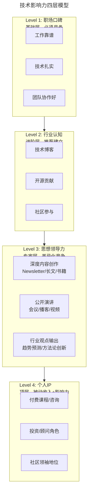

# 树立个人品牌意识：从背景调查谈谈职业口碑的重要性

> **v2 升级摘要**：本文在保留原 frontmatter、所有 Mermaid 图、表格、案例与术语英文对照的基础上，按 v2 标准的 6 节骨架（导言、核心方法论、关键流程、工具与实战、常见误区、进阶延展）重新组织内容；补充 2025 年"数字足迹审查(Digital Footprint Review)"、技术影响力(Technical Influence)四层模型、AI 时代差异化竞争与被动收入路径等新趋势，并将原参考资料内容融入进阶延展一节。

## 一、导言

> **时代变迁**：2019 年写这篇文章时，"个人品牌(Personal Brand)"对大多数技术人来说还是一个比较陌生的概念。到了 2025 年，**技术影响力(Technical Influence)** 已经成为职业发展的核心竞争力之一——它不仅能帮你获得更好的工作机会，还能让你在行业内拥有话语权，甚至创造被动收入。本文将深入探讨如何在 AI 和全球化时代打造你的技术个人品牌。

求职者的背景调查是去年频繁遇到的一个职场场景，经过仔细琢磨，有了一些感受和思考。同时，这也带来一些启发，对后续的职场表现有了新的认知和调整。

**背景调查对于关键岗位和高级别岗位，至少在互联网公司，已经成为了必须环节。而且越关键、越高端，背调审计就越严格。**

不管来自哪一方面的背调，最终被咨询一方的意见，都有可能影响到求职者的面试结果。第三方背调，一般都是在候选人经过层层选拔之后，在正式 Offer 发放前做的最后一项审核工作。而对于行业同行内的背调，一般会在面试前进行——面试过程就可能是这个初步印象的验证过程。

### 2025 年新现实：背景调查的进化

到了 2025 年，"背景调查"的概念已经远远超出了传统的 HR 流程：

| 维度 | 2019 年的背调 | 2025 年的"数字足迹审查" |
|------|-------------|---------------------|
| **范围** | 前雇主、学历、犯罪记录 | 全面的在线存在：GitHub/LinkedIn/Twitter/博客/演讲/开源贡献 |
| **执行者** | HR 或第三方背调公司 | 面试官自己（花 30 分钟搜索你的名字） |
| **不可控性** | 较低（你可以准备联系人） | 极高（你无法控制别人看到什么） |
| **影响时间** | 只在求职时 | 持续影响：猎头主动联系、演讲邀请、合作机会、咨询项目 |
| **正面价值** | 通过即可 | 强大的个人品牌可以让你获得溢价（薪资、机会、影响力） |

> **关键认知转变**：在 2025 年，你的**整个在线存在就是一份活的、持续更新的简历**。每一次 GitHub commit、每一篇博客文章、每一条 Twitter、每一次会议演讲——都在构建或损害你的个人品牌。

## 二、核心方法论

谈到"如何树立个人口碑"，读者的常见疑问是：既然背调环节完全不可控，又怎么能确保得到被咨询人正面客观的评价呢？

**笔者的答案是：背调过程不可控，但是自身的表现却从来都是可控的。**

换言之，应该把注意力放到日常工作的表现上来，因为所有的评价依据都来自于此。应该常常自问：在工作中是否能做到积极主动，具备主人翁意识(Ownership Mindset)，敢于承担更多更大的责任？在工作中是否能够不断取得成果，在团队中或跟团队一起作出较大的贡献，取得较大的业绩？

### 从"口碑"到"技术影响力"——2025 核心升级

如果说 2019 年我们谈论的是"不要让前同事说坏话"，那么 2025 年我们应该追求的是：**让整个行业都知道你是谁，以及你能做什么**。这就是**技术影响力 2.0**的核心。



**上述 Mermaid 图说明**：技术影响力是一个分四层的金字塔结构，从基础的"职场口碑"逐层向上构建，每上升一层都会带来明显的差异化竞争力和价值放大效应。Level 1 是地基，必须具备；Level 2 是进阶层，推荐建立；Level 3 进入"思想领导力(Thought Leadership)"阶段，实现差异化竞争；Level 4 是顶层"个人 IP(Intellectual Property)"，可带来被动收入(Passive Income)与行业影响力。

### 为什么技术影响力在 2025 年如此重要？

**1. 求职模式的改变**

传统模式：投简历 → 筛选 → 面试 → Offer
新模式：**被猎头/HR 主动发现 → 聊天 → 定向 Offer（往往薪资更高）**

真实案例：很多 Platform Engineer/SRE 岗位从未公开发布，而是通过 LinkedIn 和网络找到合适的候选人。

**2. 远程工作的全球化竞争**

- 你可以为世界任何地方的公司工作
- 但同时，你的竞争对手也是全球化的
- **个人品牌是你在全球市场中脱颖而出的方式**
- 英语能力 + 技术品牌 = 全球就业机会

**3. AI 时代的差异化**

当 AI 可以让每个人都写出不错的代码时，**什么让你不可替代？**
- 你的系统设计思维
- 你的业务理解深度
- 你解决复杂问题的经验记录
- **你的思想领导力和行业影响力**

**4. 被动收入的可能性**

- 付费 Newsletter（Substack）
- 在线课程（Udemy/极客时间）
- 技术咨询/顾问
- 开源项目的 Sponsorship
- 图书版税

## 三、关键流程

### 3.1 第一阶段：打好基础（0-6 个月）

**1. 完善你的线上身份**

| 平台 | 要做什么 | 为什么重要 |
|------|---------|-----------|
| **GitHub** | Profile README + 高质量开源项目 | 技术能力的最佳证明 |
| **LinkedIn** | 完整的职业经历 + 技能标签 | 猎头和 HR 的首选搜索平台 |
| **个人网站/博客** | 技术博客 + About 页面 + 项目展示 | 你的"数字总部" |
| **Twitter/X** | 技术讨论 + 分享见解 | 与全球技术社区连接 |
| **Email Newsletter** | 定期发送技术洞察 | 建立直接的受众关系 |

**GitHub Profile README 模板**：

```markdown
# Hi, I'm [你的名字] 👋

I'm a **Platform Engineer** passionate about building internal developer platforms and improving developer experience.

## 🚀 What I'm working on
- Building [项目名] - a [简短描述]
- Exploring [技术领域]

## 📝 Recent Writing
- [文章标题1](链接) - [一句话描述]
- [文章标题2](链接) - [一句话描述]

## 🛠️ Tech Stack
- Go, Python, TypeScript
- Kubernetes, Terraform, AWS
- [其他技能]

## 📬 Get in touch
- Twitter: [@你的handle](https://twitter.com/xxx)
- LinkedIn: [你的profile](https://linkedin.com/in/xxx)
- Blog: [你的博客地址](https://yourblog.com)
```

**2. 开始写作**

**为什么必须写作？**
- 写作是最好的学习方式（费曼技巧 / Feynman Technique）
- 写作让你的思考结构化、可复用
- 写作是你思想的永久记录
- 写作帮你建立专业形象

**写什么？**
- 你最近解决的问题及方案
- 你踩过的坑及教训总结
- 你对新技术的理解和实践
- 你对行业趋势的看法
- 书评/工具评测/教程

**在哪里写？**
- **中文**：微信公众号、知乎、掘金、InfoQ
- **英文**：Dev.to、Hashnode、Medium、Personal Blog
- **Newsletter**：Substack（强烈推荐，可积累订阅者）

**写作频率建议**：
- 开始阶段：每月 1-2 篇
- 稳定后：每两周 1 篇
- 目标：质量 > 数量

### 3.2 第二阶段：扩大影响（6-18 个月）

**3. 参与开源**

**为什么开源如此重要？**
- 公开的代码质量证明
- 与全球开发者协作的经验
- 建立技术信誉的最快方式
- 可能获得 Job Offers

**如何开始？**
- 从小做起：修复文档错误、修复小 bug
- 选择与你日常工作相关的项目（K8s 生态、Terraform provider 等）
- 持续贡献，而不是一次性 PR
- 尝试成为某个项目的 Maintainer 或 Committer

**4. 公开演讲**

**演讲的好处**：
- 强制你深入理解一个主题
- 提升口头表达和逻辑思维能力
- 扩大人脉网络
- 建立行业知名度

**从哪里开始**：
- 公司内部的技术分享（最安全的第一步）
- 本地的 Meetup（如 Cloud Native、K8s User Group）
- 区域性的技术大会（如 QCon、ArchSummit）
- 国际会议（如 KubeCon、SRECon）— 需要英语能力

**演讲选题建议**：
- "我们如何解决了 X 问题"（实战案例最有价值）
- "X 技术的踩坑指南"（经验分享类受欢迎）
- "X 技术在 Y 场景的应用"（结合业务场景）
- 避免：纯概念介绍、厂商宣传类内容

**5. 建立社交网络**

| 平台 | 用法 | 时间投入 |
|------|------|---------|
| **Twitter/X** | 每天发 1-2 条技术相关的内容，参与讨论 | 每天 15 分钟 |
| **LinkedIn** | 每周更新一次状态，发布长文章 | 每周 30 分钟 |
| **Discord/Slack** | 加入 2-3 个高质量的技术社区 | 每天 20 分钟 |
| **技术播客** | 做客或创办自己的播客 | 视情况而定 |

### 3.3 第三阶段：成为意见领袖（18 个月+）

**6. 深度内容创作**

- **系列文章/专栏**：深入探讨某个主题
- **电子书/白皮书**：系统性地总结你的方法论
- **在线课程**：将你的知识产品化
- **Newsletter**：建立定期与读者对话的渠道

**7. 行业参与**

- 成为某个开源项目的 Core Maintainer
- 加入技术标准的制定（如 CNCF SIG）
- 受邀担任会议的 Program Committee Member
- 接受媒体采访，发表行业观点

## 四、工具与实战

### 4.1 案例研究：一位 Oracle DBA 的口碑跃迁

以笔者之前公司团队的一位同事为例。

这位同事是 Oracle 数据库的 DBA（数据库管理员，Database Administrator），当时入职的时候刚毕业一年多，经验一般，但是到了岗位上很快就融入了，经常会给笔者提出一些在数据库层面的优化改进建议。并且在评审通过之后，他会主动去落地执行。

在整个过程中，他跟其他团队成员配合得很好。出结果后，还会主动跟笔者一起去客户那里作汇报。久而久之，笔者对于他的工作很放心。后来就放手让他自己去沟通，在他的协助下，笔者也减轻了一定的工作压力。

后来随着能力的成长，他基本承担起了 DB 的全部运维职责。他在岗的那两年左右，跟团队密切配合，在确保数据库没有出现过大故障的同时，还输出了很多提升性能和容量的优化案例。（要知道 Oracle 数据库的优化，能够带来的成本收益还是非常巨大的。）

后来他转投去别的公司工作。去年，突然接到一个电话，对方是一家第三方背调公司，代表国内顶级的某支付公司，对他申请 DBA 技术专家岗位进行背景调查。

这时脑海里涌现出的，都是他以往种种优秀的表现。故背调问的每一个问题，例如表现是否突出，工作态度和责任心如何等等，除了实事求是地回答之外，还会特别用到"非常突出""非常优秀"之类的赞扬之词。

**从实质来看，绝大多数情况下，只要能够做到尽职尽责，态度认真，把精力投入到工作上，就不用对背调过于担心。**

然而 **如果想要树立个人的好口碑，那就需要付出更多，要让团队和其他成员明确你独特的个人价值**，就像上面所讲的这位同事一样。

### 4.2 笔者做背调的实践原则

面对同行咨询时，笔者会尽量客观地给出评价标准，比如技术技能、沟通协作能力、态度表现，以及是否有比较突出的业绩贡献等等。之所以提供这些信息，是为了让对方来判断候选人的自述是否符合真实情况，以便对方做出决策。

两种情况下，笔者会比较旗帜鲜明地给出个人的建议：

**第一种，对于笔者认为特别优秀的，笔者会给出强烈推荐或者非常推荐的建议。**

**第二种，对于确实存在短板或较大自身问题的，笔者也会客观反馈，建议对方在候选人面试时或入职后，在管理上多加注意。**

笔者之所以这样做是因为，别人来咨询笔者，是对笔者的信任，笔者既要客观不能夸大，也不能藏着掖着掩盖事实。同时，笔者也要给出更加真实的一手信息。当然，笔者在向别人求助时，也期望别人能以同样的方式来反馈笔者。

## 五、常见误区

讲到这里，笔者也要举两个反例，这都是实际工作中遇到过的情况，请引以为戒。

### 5.1 误区一：诚信问题（高压线，触碰不得）

比如填写个人薪酬信息时，为了想获得更高的薪酬定价，故意捏造事实，肆意夸大之前的薪酬待遇。从实质来看，这些都是可以通过背调调查清楚的，如果存在造假，用人单位会直接拒绝。

笔者遇到的一个真实案例就是，候选人经过了终面，但当通知他最后一步背调完成，然后准备发放 Offer 时，他却反馈不准备接受 offer 了。当然感觉比较可惜，但通过推荐人了解情况后，才得知他因为虚报薪酬太多，自己感觉心虚而不敢来了。

同样，在工作岗位上千万不要故意制造假数据，或者泄露工作信息谋取个人利益，这类错误触犯的后果将会更加严重。

**2025 新增：数字时代的诚信问题**

- **伪造 GitHub 贡献**：购买 Stars、Fork，或提交无意义的 PR
- **抄袭他人内容**：复制粘贴他人的博客/文章而不注明出处
- **虚假认证**：购买或作弊获得的证书/徽章
- **刷量行为**：人为增加社交媒体粉丝、文章阅读量
- **过度包装**：将参与过的项目说成是自己主导的

> **记住：互联网是有记忆的。一旦被发现不诚信，代价是整个职业生涯。**

### 5.2 误区二：消极怠工问题（职业道德问题）

比如有的人在离职前的时间里，消极怠工，交接工作时不积极配合，经常迟到或早退，中途睡大觉或者跑出去不知所踪。

可能他认为反正要离职了，一切都无所谓了，也就不再重视个人行为是否妥帖，是否合乎公司规范，是否符合起码的职业道德和职业素养。

而这一行为恰恰会让团队其他人给他贴上"不负责任""不靠谱""职业素养欠缺"的负面标签。如此，他在将来背调时，可能就会因为这么简单的几个形容词，而被否定掉了，造成个人职业生涯莫大的遗憾。

当然，如果你因为意见和思路与团队或他人无法达成一致，而闹情绪，传播负能量，为团队协作制造障碍等等，这种消极表现也是不可取的。

**2025 新增：数字时代的消极表现**

- **Ghosting（玩消失）**：突然不回消息、不参加会议、不完成任务
- **公共场合抱怨前公司**：在社交媒体上负面评价前雇主/前同事
- **破坏性离职**：删除代码、破坏文档、恶意操作
- **带走不当资产**：拷贝代码库、客户数据等机密信息
- **Badmouth 同事**：在行业内散布关于前同事的不实言论

> **职业圈比你想象的要小。今天的同事可能是明天的面试官、合作伙伴、甚至下属。**

## 六、进阶延展

### 6.1 共勉：守住职场底线

在职场中，个人的职场信息和表现，就像整个求学经历一样，会被详细地记录、跟踪和完善，这就更要求必须要学会树立个人品牌，珍视自己的职场口碑。

而职场口碑的树立，关键还是来自于日常工作中一点一滴的表现，甚至是通过某些很细微的工作慢慢积累起来的，这是一个渐进的过程。

俗话说"千里之堤溃于蚁穴"，往往一不留神，因为一件负面的事情或行为，就会使个人职场口碑和个人品牌瞬间坍塌。因此，请守住职场底线。

### 6.2 2025 年的最后寄语

在这个人人都可以发声的时代：

**1. 你的沉默也是一种选择**
- 不建设个人品牌 = 放弃被看见的机会
- 在 AI 时代，"默默耕耘"可能导致真的被忽视

**2. 真诚是最长久的策略**
- 不要为了流量而哗众取宠
- 分享真实的经验和思考，哪怕不完美
- 承认错误比掩盖错误更能赢得尊重

**3. 持续性胜过爆发力**
- 每周写一篇短文 > 一年憋一篇"重磅"
- 每天在社区互动 > 偶尔刷屏式存在感
- 小步快跑，长期主义

**4. 给予比索取更重要**
- 帮助新人成长
- 无偿分享知识
- 为社区做贡献
- 这些都会以你意想不到的方式回馈给你

**5. 你的品牌就是你的人生**
- 你写的每一个字、说的每一句话、做的每一件事
- 都在定义"你是谁"
- 让这个定义是你自豪的样子

### 6.3 推荐资源（2025 版）

#### 个人品牌与方法论
- 📖 **《Show Your Work!》** - Austin Kleon / 公开创作的过程
- 📖 **《Deep Work》** - Cal Newport / 深度工作与专注
- 📖 **《Atomic Habits》** - James Clear / 微习惯与长期主义
- 💡 **方法**：1000 True Fans 理论（Kevin Kelly）

#### 技术写作与内容创作
- 📖 **《On Writing Well》** - William Zinsser / 非虚构写作经典
- 🛠️ **平台**：Substack（Newsletter）、Hashnode（开发者博客）、Mastodon（去中心化社交）
- 🎥 **视频**：YouTube "Build your Personal Brand as a Developer"

#### 开源贡献与社区
- 🔗 **指南**：First Contributions（GitHub 上手项目）
- 📖 **书籍**：《Working in Public》- Nadia Eghbal / 开源维护者视角
- 🌐 **社区**：CNCF Slack、Cloud Native Computing Foundation

#### 职业发展与全球化
- 📖 **《The Alliance》** - Reid Hoffman / LinkedIn 创始人谈联盟式雇佣
- 📖 **《The Software Engineer's Guidebook》** - Gergely Orosz / 系统化职业成长
- 💼 **平台**：LinkedIn Learning、Taro（工程师职业发展平台）

#### 心理健康与可持续性
- 📖 **《Burnout》** - Emily & Amelia Nagoski / 职业倦怠科学
- 📖 **《The Fearless Organization》** - Amy Edmondson / 心理安全
- 🧘 **实践**：定期自检、数字排毒、多元化身份认同

> **💡 实践建议**
>
> 本周就可以开始的小行动：
> 1. 优化你的 GitHub Profile README，让它真正代表你
> 2. 在 LinkedIn 上更新一次状态，分享你最近的一个技术学习
> 3. 找一个你欣赏的博主/工程师，研究他/她的内容策略
>
> 记住：**最好的开始时间是 5 年前，其次是现在**。