# 划重点-精华（一）

> **v2 升级摘要**：本文在保留原 frontmatter、所有 Mermaid 图、表格、术语英文对照的基础上，按 v2 标准的 6 节骨架（导言、核心方法论、关键流程、工具与实战、常见误区、进阶延展）重新组织内容；保留"应用运维体系（一）"与"效率与稳定性（二）"与"云计算时代 & 成长（三）"三大知识体系全景图，补充 2025 年 GitOps、Platform Engineering、eBPF、AIOps、GreenOps 等新趋势，并将原参考资料内容融入进阶延展一节。

## 一、导言

> **本篇定位**：本篇是《运维体系管理》专栏的精华汇总。运维体系建设的全景蓝图从标准化到平台化，从自动化到智能化，构建现代化运维体系的底层逻辑与实践路径。效率与稳定性是运维的双螺旋——效率让你跑得快，稳定性让你不摔跤。云计算重塑了运维的边界与价值，个人成长决定了你能走多远。

整个专栏 42 篇文章可以归纳为三大主题：

1. **应用运维体系（Application Operations System）**：从标准化、自动化、平台化到可观测性的体系化建设
2. **效率与稳定性（Efficiency & Stability）**：容量管理、故障治理、变更管理、应急响应、成本优化
3. **云计算时代 & 个人成长（Cloud Era & Career Growth）**：上云策略、Kubernetes 生态演进、eBPF、AI 辅助运维、运维人职业发展全景图

## 二、核心方法论

### 2.1 应用运维体系全景

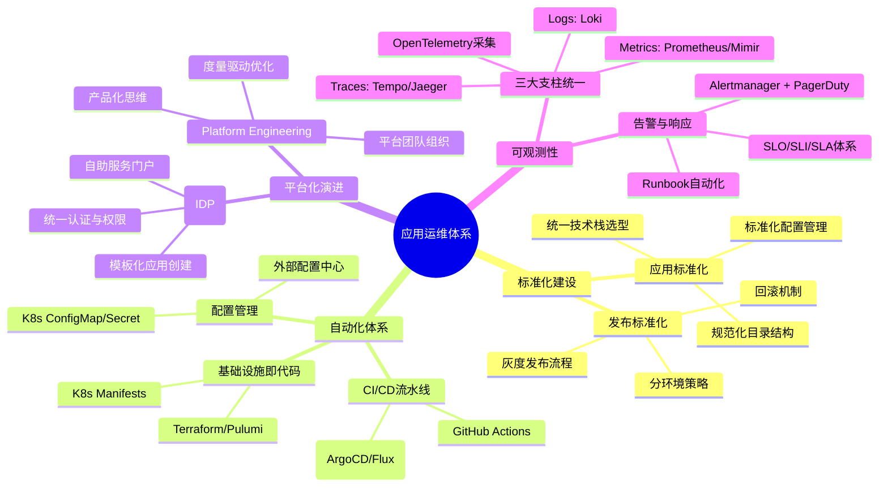

**上述 Mermaid 图说明**：应用运维体系以 mindmap 形式呈现，包含标准化建设、自动化体系、平台化演进、可观测性四大支柱。标准化是基础，自动化是骨架，平台化是演进方向，可观测性是质量保障。各支柱相互支撑，共同构成现代化运维体系的底层逻辑。

### 2.2 效率与稳定性全景

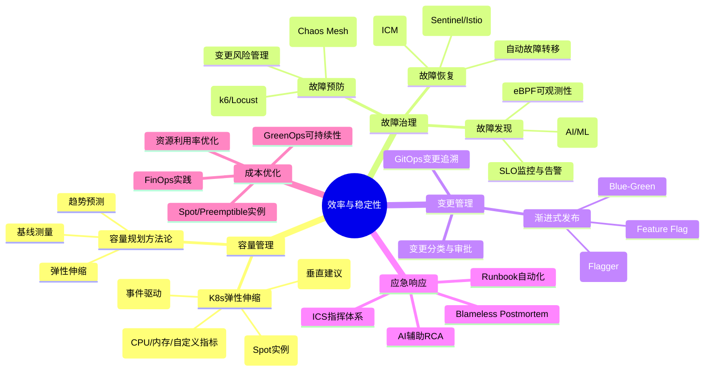

**上述 Mermaid 图说明**：效率与稳定性以 mindmap 形式展开五大模块——容量管理、故障治理、变更管理、应急响应、成本优化。每个模块都包含方法论与工具链，体现"从经验估算到数据驱动"的现代化运维思路，并将 GreenOps（可持续性运维）纳入决策维度。

### 2.3 云计算时代 & 成长全景

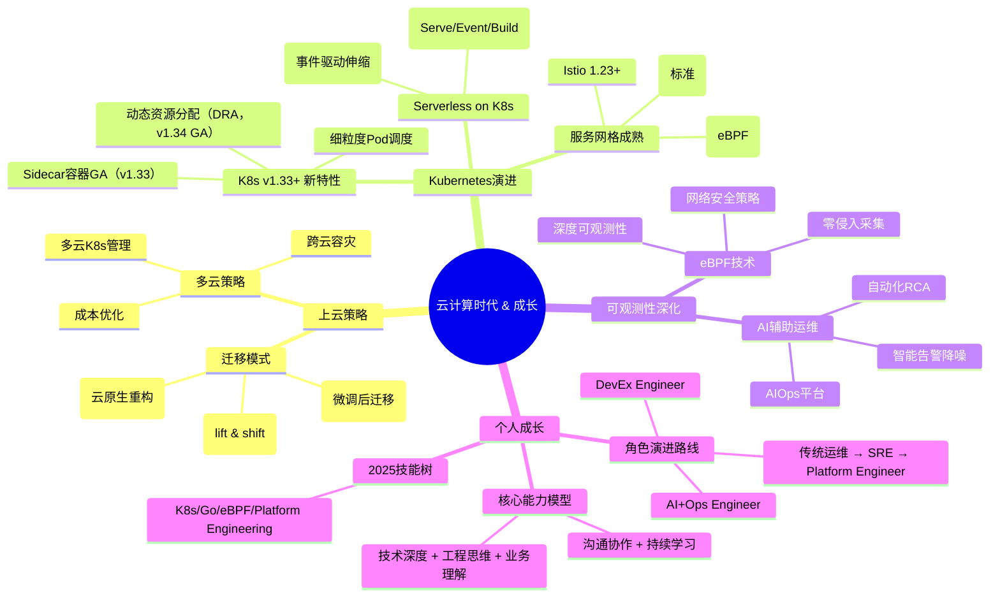

**上述 Mermaid 图说明**：云计算时代与个人成长以 mindmap 形式呈现四大方向——上云策略、Kubernetes 生态演进、可观测性深化（eBPF + AI）、个人成长路径。运维角色从"传统运维"演进为"SRE / Platform Engineer / DevEx Engineer / AI+Ops Engineer"多元化路径，能力模型要求"技术深度 + 工程思维 + 业务理解 + 沟通协作 + 持续学习"五位一体。

### 2.4 运维体系成熟度模型

| 等级 | 名称 | 特征 | 关键实践 |
|------|------|------|---------|
| **L0** | 混乱期 | 无标准，救火模式 | 识别痛点，建立基础规范 |
| **L1** | 标准化 | 有文档规范，部分自动化 | 统一技术栈，建立发布流程 |
| **L2** | 自动化 | CI/CD 流水线，IaC | GitOps，容器化部署 |
| **L3** | 平台化 | IDP，自助服务 | Platform Engineering，内部平台 |
| **L4** | 智能化 | AI 辅助决策，AIOps | 异常检测，智能根因分析，自愈 |
| **L5** | 自治系统 | 无需人工干预 | 全面自治，持续自优化 |

## 三、关键流程

### 3.1 标准化—— 运维体系的基石

> **核心观点**：没有标准化，一切自动化都是空中楼阁。标准化的本质是**降低系统的熵增**，让复杂系统变得可预测、可管理。

在 2025 年的技术语境下，标准化已经从"文档规范"演进为"代码强制执行"：

| 维度 | 传统做法 | 2025 年最佳实践 |
|------|---------|---------------|
| 技术栈选型 | 团队自由选择 | 组织级 Approved List + K8s 基线镜像 |
| 目录结构 | 文档约定 | Cookiecutter/Scaffolding 模板自动生成 |
| 配置管理 | 散落在各处 | K8s CRD + GitOps 单一事实来源 |
| 发布流程 | 脚本+人工 | 声明式 GitOps + Policy as Code |
| 环境一致性 | 尽力而为 | GitOps 多环境同步 + SealedSecrets |

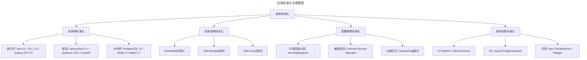

**上述 Mermaid 图说明**：应用标准化分解为技术栈、目录结构、配置管理、发布流程四个子领域，每个子领域都对应明确的 2025 年技术栈与工具链。运行时与框架版本需对齐 Long Term Support（长期支持版本），配置管理须区分环境变量分层与敏感信息保护，发布流程必须支持灰度与回滚。

### 3.2 从 Spring Cloud Netflix 到现代微服务治理

**历史背景**：Spring Cloud Netflix（Eureka, Hystrix, Zuul, Ribbon）已于 2020 年正式停维。2025 年的微服务生态已发生根本性变化：

| 能力 | 已停维组件 | 2025 年替代方案 |
|------|-----------|---------------|
| 服务注册发现 | Eureka | Consul / K8s Native Service + CoreDNS |
| 客户端负载均衡 | Ribbon | Spring Cloud LoadBalancer / Envoy Sidecar |
| 熔断降级 | Hystrix | Resilience4j / Sentinel / Istio Circuit Breaking |
| API 网关 | Zuul 1.x | Spring Cloud Gateway / Kong / APISIX |
| 配置中心 | Spring Cloud Config | Consul / Nacos / K8s ConfigMap |
| 链路追踪 | Sleuth + Zipkin | OpenTelemetry + Jaeger/Tempo |

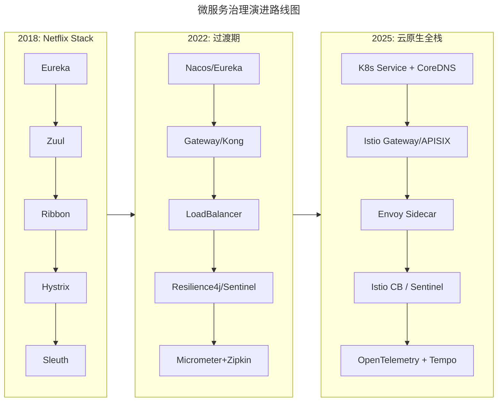

**上述 Mermaid 图说明**：微服务治理历经 2018 Netflix Stack、2022 过渡期、2025 云原生全栈三个阶段。最新阶段以 Kubernetes 原生能力 + Istio/Envoy Sidecar + OpenTelemetry 为核心特征，治理能力下沉至基础设施层，业务代码无侵入。

### 3.3 自动化—— 从脚本到 GitOps 的跃迁

**CI/CD 现代化的三重境界**：

| 层次 | 特征 | 工具链 | 适用场景 |
|------|------|--------|---------|
| **L1: 脚本自动化** | Shell/Ansible 脚本 | Jenkins + Groovy | 传统 VM 部署 |
| **L2: 容器化 CI/CD** | Docker + K8s YAML | GitLab CI + Helm | 单集群 K8s |
| **L3: GitOps 声明式** | Git 作为单一事实源 | GitHub Actions + ArgoCD | 多集群/多云 |

**基础设施即代码（IaC, Infrastructure as Code）工具对比**：

| 工具 | 语言 | 声明式/命令式 | 状态管理 | 云厂商支持 | 适合场景 |
|------|------|-------------|---------|-----------|---------|
| **Terraform** | HCL | 声明式 | Remote State | 全方位 | 多云基础设施 |
| **Pulumi** | TypeScript/Python/Go | 声明式 | Remote State | 全方位 | 开发者友好 IaC |
| **Crossplane** | YAML (K8s CRD) | 声明式 | K8s ETCD | 通过 Provider | K8s 原生体验 |
| **CDKTF** | TypeScript/Python/Go | 声明式 | Remote State | 全方位 | Terraform 的编程接口 |

**推荐组合（2025）**：
- **云资源层**: Terraform 或 Pulumi（VPC、RDS、S3 等）
- **K8s 集群内**: ArgoCD + Helm/Kustomize（应用部署）
- **跨层编排**: Crossplane（统一管理云资源和 K8s 资源）

### 3.4 平台化—— Platform Engineering 的崛起

> **关键洞察**：DevOps 解决了开发和运维的文化冲突，但并未解决**认知负荷（Cognitive Load）** 问题。Platform Engineering 的核心目标是构建内部开发者平台（IDP, Internal Developer Platform），让开发者自助服务（Self-service），而非等待运维。

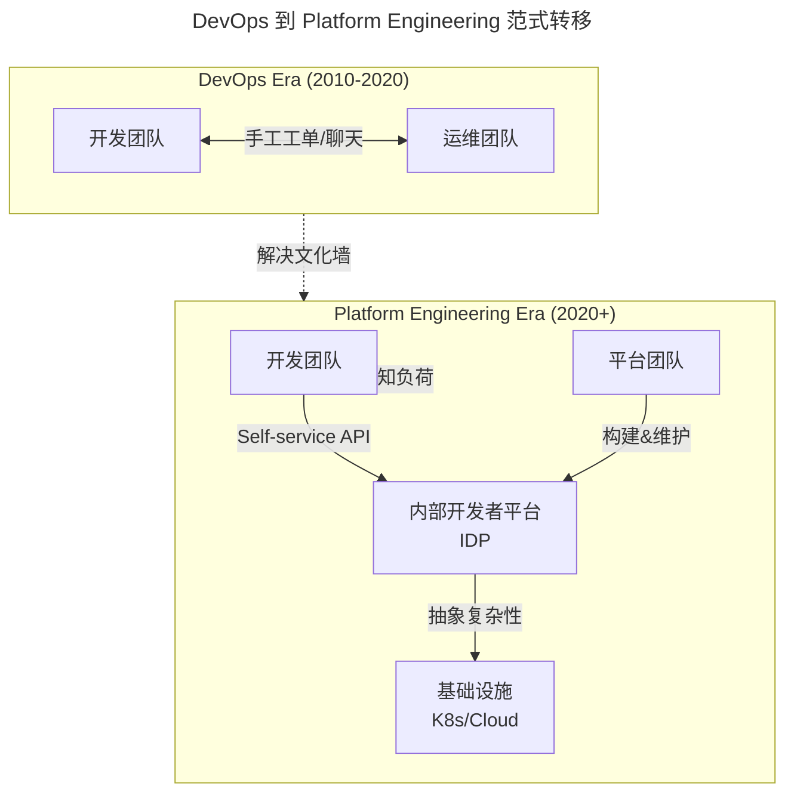

**上述 Mermaid 图说明**：DevOps 时代以工单/聊天作为开发与运维协作的桥梁；Platform Engineering 时代以 IDP 作为统一自助入口，平台团队产品化运营 IDP，抽象基础设施复杂性。范式转移解决两大问题：文化墙与认知负荷。

### 3.5 可观测性—— OTel 统一可观测性体系

> **核心区别**：Monitoring 告诉你系统**出了什么问题**，Observability 让你能理解**为什么出问题**。

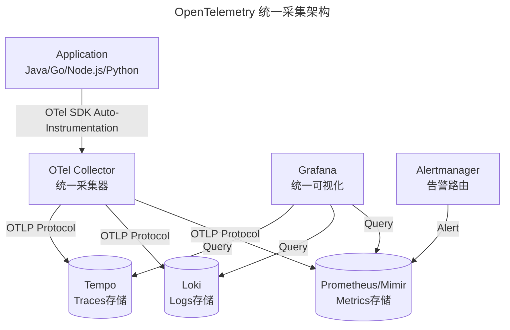

**上述 Mermaid 图说明**：OpenTelemetry 通过统一的 OTel Collector 采集应用三大支柱数据（Metrics/Logs/Traces），通过 OTLP 协议分别存入 Mimir、Loki、Tempo，再由 Grafana 统一可视化、Alertmanager 路由告警。这是 2025 年云原生可观测性栈的事实标准（LGTM Stack）。

**SLO 实践四步法**：

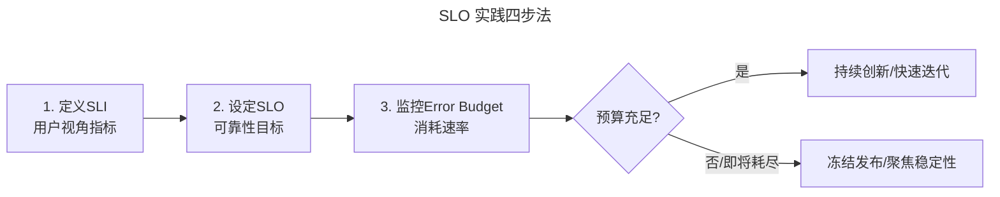

**上述 Mermaid 图说明**：SLO 实践四步法遵循"定义 SLI → 设定 SLO → 监控错误预算（Error Budget）→ 根据预算消耗情况决策发布节奏"的闭环。预算充足时鼓励快速迭代与创新，预算即将耗尽时冻结发布、聚焦稳定性。

### 3.6 容量管理—— 从经验估算到数据驱动

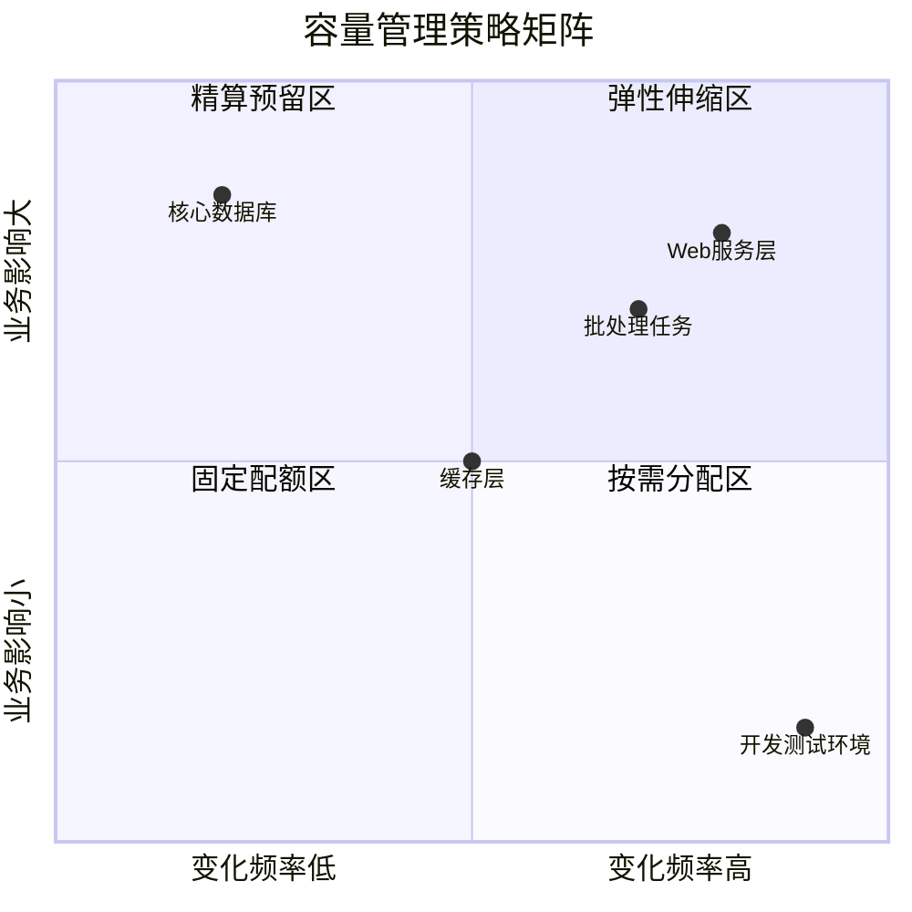

**上述 Mermaid 图说明**：容量管理策略矩阵按"变化频率 × 业务影响"两维度将系统分为四象限，对应不同策略：高变化高影响=弹性伸缩区，低变化高影响=精算预留区，高变化低影响=按需分配区，低变化低影响=固定配额区。

**Kubernetes 弹性伸缩全家桶**：

| 工具 | 缩写 | 维度 | 触发条件 | 适用场景 |
|------|------|------|---------|---------|
| **Horizontal Pod Autoscaler** | HPA | Pod 数量 | CPU/内存/自定义指标（Prometheus） | 常规 Web 服务 |
| **Vertical Pod Autoscaler** | VPA | Pod 资源（Request/Limit） | 历史使用量分析 | 资源配置优化 |
| **Cluster Autoscaler** | CA | 节点数量 | Pod Pending/ScheduleFail | 公有云节点池 |
| **Karpenter** | - | 节点数量（精细化） | Pod 调度需求+价格优化 | AWS/Azure Spot 实例 |
| **KEDA** | - | Pod 数量（事件驱动） | Kafka 队列长度/Cron/Redis 等 | Serverless 工作负载 |

### 3.7 故障治理—— 三道防线

| 防线 | 目标 | 核心能力 | 2025 年工具链 |
|------|------|---------|-------------|
| **第一道防线：预防** | 不让故障发生 | 混沌工程 / 压测 / Code Review / 变更管控 | Chaos Mesh / Litmus / k6 / Gremlin |
| **第二道防线：发现** | 尽早发现异常 | SLO 监控 / 异常检测 / 可观测性 | OTel / Datadog Watchdog / eBPF |
| **第三道防线：恢复** | 快速恢复服务 | 自动故障转移 / 限流降级 / 应急响应 | Istio / Sentinel / ICS 流程 / AI-RCA |

### 3.8 变更管理—— 渐进式发布策略

| 策略 | 原理 | 优点 | 缺点 | 推荐工具 |
|------|------|------|------|---------|
| **Rolling Update** | 逐个替换 Pod | 简单，零额外资源 | 无法快速回滚，版本共存期短 | K8s 原生 |
| **Blue-Green** | 两套完整环境切换 | 即时回滚，零停机 | 双倍资源成本，数据迁移复杂 | Argo Rollouts |
| **Canary** | 小流量验证后全量 | 风险可控，真实流量验证 | 需要流量分发和指标监控 | Flagger + Istio/Gateway API |
| **Feature Flag** | 代码级开关控制 | 粒度最细，即时生效 | 代码侵入，技术债务 | LaunchDarkly / Unleash / Flagsmith |
| **Progressive** | 自动化逐步增加流量 | 全自动化，基于指标决策 | 架构复杂度高 | Flagger + Prometheus |

### 3.9 应急响应—— ICS 指挥体系

| 角色 | 职责 | 关键技能 | 类比 |
|------|------|---------|------|
| **IC (Incident Commander)** | 总指挥，协调资源，做最终决策 | 沟通能力，全局视角 | 消防现场指挥官 |
| **TL (Technical Lead)** | 技术诊断，制定修复方案 | 深度技术能力 | 抢修工程师 |
| **CL (Communications Liaison)** | 对外沟通，状态同步 | 清晰表达，情绪管理 | 新闻发言人 |
| **SL (Scribe/Logger)** | 记录时间线，文档化过程 | 细致记录 | 现场记录员 |
| **Ops (Operations)** | 执行具体操作命令 | 执行力，听从指挥 | 一线操作员 |

**关键时间指标**：

| 指标 | 定义 | 优秀 | 合格 | 说明 |
|------|------|------|------|------|
| **MTTA** (Mean Time To Acknowledge) | 平均确认时间 | < 5 min | < 15 min | 从告警到人工介入 |
| **MTTI** (Mean Time To Identify) | 平均定位时间 | < 15 min | < 30 min | 从介入到根因定位 |
| **MTTR** (Mean Time To Resolve) | 平均恢复时间 | < 30 min | < 60 min | 从告警到服务恢复 |
| **MTTP** (Mean Time To Postmortem) | 平均复盘完成 | < 24h | < 72h | 从恢复到报告产出 |

### 3.10 上云策略—— 6R 迁移模型

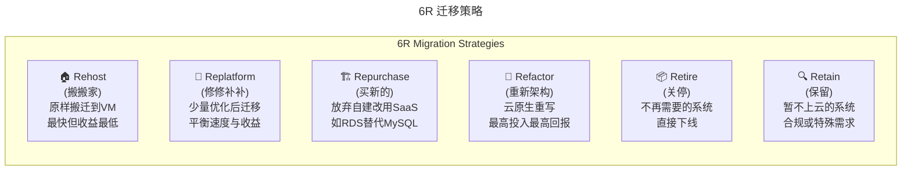

**上述 Mermaid 图说明**：6R 迁移策略分别为 Rehost（搬搬家）、Replatform（修修补补）、Repurchase（买新的）、Refactor（重新架构）、Retire（关停）、Retain（保留），各策略在时间、成本、风险、长期收益上有差异，需根据系统类型分而治之。

## 四、工具与实战

### 4.1 2025 年技术栈选型速查

| 领域 | 推荐方案 | 备选方案 | 避免使用 |
|------|---------|---------|---------|
| 容器编排 | Kubernetes v1.33+ | - | Docker Swarm |
| CI/CD | GitHub Actions + ArgoCD | GitLab CI + Flux | Jenkins (新项目) |
| 服务网格 | Istio 1.23+ / Cilium | Linkerd | 无（微服务必备） |
| 可观测性 | OTel + Grafana LGTM | Datadog/New Relic | ELK (新项目) |
| IaC | Terraform + Pulumi | Crossplane | 手动控制台操作 |
| 配置管理 | K8s CRD + Git | Consul/Nacos | 本地配置文件 |
| API 网关 | APISIX / Kong / Istio Gateway | Spring Cloud Gateway | Nginx 手动配置 |
| 混沌工程 | Chaos Mesh / Litmus | Gremlin | Chaos Monkey (过时) |
| 密钥管理 | HashiCorp Vault | AWS Secrets Manager / External Secrets | 明文/环境变量 |
| 成本治理 | OpenCost + FinOps | Kubecost | 无成本可视 |

### 4.2 eBPF 工具链

| 场景 | 推荐工具 | 说明 |
|------|---------|------|
| **K8s 可观测性** | **Pixie** | New Relic 旗下开源，零侵入，SQL 查询式交互 |
| **网络可观测+Service Mesh** | **Cilium + Hubble** | 一站式解决方案，替代 Istio+Envoy |
| **安全审计** | **Falco / Tetragon** | Falco（Sysdig 发起，CNCF 毕业项目）/ Tetragon（Isovalent 出品） |
| **持续 Profiling** | **Parca** | 连续性能剖析，替代间歇性 profiling |
| **Prometheus 指标** | **eBPF Exporter** | 零侵入导出内核指标 |
| **DNS 安全** | **Cilium DNS Security** | DNS 请求级别安全策略 |

### 4.3 限流降级熔断—— 服务韧性三件套

| 能力 | Hystrix (已停维) | Resilience4j | Alibaba Sentinel | Istio Service Mesh |
|------|-----------------|-------------|------------------|-------------------|
| **熔断（Circuit Breaker）** | ✅ | ✅ | ✅ | ✅ (Envoy) |
| **限流（Rate Limiting）** | ❌ (需 Semaphore) | ✅ (RateLimiter) | ✅ (QPS/线程) | ✅ (Local+Global) |
| **降级（Fallback）** | ✅ | ✅ | ✅ | ✅ (Retry+Timeout) |
| **舱壁隔离（Bulkhead）** | ✅ (ThreadPool) | ✅ (Semaphore) | ✅ (热点参数) | ✅ (Sidecar 隔离) |
| **实时监控面板** | Hystrix Dashboard | Micrometer+Grafana | Sentinel Dashboard | Kiali/Grafana |
| **语言支持** | Java | Java/Kotlin | Java/Go/C++ | 语言无关（K8s） |
| **推荐场景** | ❌ 避免使用 | Spring Boot 应用 | Java 微服务 | 云原生全栈（推荐） |

### 4.4 Kubernetes 成本优化实战

| 优化手段 | 预计节省 | 实施难度 | 工具推荐 | 风险等级 |
|---------|---------|---------|---------|---------|
| **Requests/Limits 调整** | 20-40% | 低 | VPA + Kubecost | 🟢 低 |
| **Spot/Preemptible 实例** | 60-80% | 中 | Karpenter / Cluster Autoscaler | 🟡 中（需容错设计） |
| **闲置资源回收** | 10-20% | 低 | Kube-bench / Polaris + 自动化脚本 | 🟢 低 |
| **镜像优化（Alpine/Distroless）** | 5-15% | 低 | Dive / Trivy | 🟢 低 |
| **自动扩缩容（HPA/KEDA）** | 30-50% | 中 | Prometheus Adapter | 🟡 中（需合理配置） |
| **节点池混合策略** | 40-60% | 高 | Karpenter / CAST AI | 🟠 较高 |
| **多集群调度优化** | 15-30% | 高 | Cluster API / vcluster | 🟠 较高 |

### 4.5 AIOps 已成熟落地场景

| 场景 | 技术方法 | 成熟度 | 代表产品 | ROI 评估 |
|------|---------|--------|---------|---------|
| **异常检测（Anomaly Detection）** | 统计/ML/时序预测 | ⭐⭐⭐⭐⭐ | Datadog Watchdog / Prometheus Anomaly Detector | 高（减少误报 80%+） |
| **告警降噪（Alert Correlation）** | 聚类/拓扑关联/因果推理 | ⭐⭐⭐⭐ | BigPanda / Moogsoft / StackState | 高（减少告警量 90%+） |
| **容量预测（Capacity Forecasting）** | 时序预测（Prophet/LSTM） | ⭐⭐⭐⭐ | Datadog Forecasts / Prophet | 中高（提前 2-4 周预判） |
| **智能根因分析（RCA）** | 知识图谱+LLM 推理 | ⭐⭐⭐ | PagerDuty AIOps / Atlassian Intelligence | 中（缩短 MTTI 30-50%） |
| **自动化修复（Auto-Remediation）** | Runbook 自动化+决策引擎 | ⭐⭐⭐ | Rundeck / StackStorm | 中（标准化场景效果显著） |
| **日志智能分析（Log Intelligence）** | NLP/LLM 语义理解 | ⭐⭐⭐⭐ | Datadog Logs / Loki + LLM | 高（搜索效率提升 5x+） |
| **自然语言交互（NLI）** | LLM 对话式运维 | ⭐⭐⭐ | ChatOps / Custom GPTs | 中（降低使用门槛） |

## 五、常见误区

### 5.1 误区一：标准化过度强调文档而非代码强制执行

标准化如果仅停留在文档规范层面，最终必然被违反。2025 年的最佳实践是通过 Policy as Code（OPA/Kyverno）+ GitOps 自动化校验，让标准成为代码强制执行的一部分。

### 5.2 误区二：盲目追新，忽视运维体系成熟度

L0 混乱期团队不要直接追求 L4 智能化。应按成熟度模型循序渐进：先把基础标准化做好，再补齐自动化，再走向平台化。技术选型需与团队当前成熟度匹配。

### 5.3 误区三：DevOps 等同于工具堆砌

DevOps 的本质是文化变革，工具只是载体。如果只引入工具而不改变组织协作方式，最终只是把"手工工单"变成了"电子工单"。

### 5.4 误区四：AIOps 被视为银弹

AI 在运维中是 Copilot（副驾驶）而非 Autopilot（自动驾驶）。AI 擅长异常检测、日志搜索、指标查询；不擅长复杂故障决策、跨部门协调。关键决策仍需人类判断。

### 5.5 误区五：成本优化只盯着云厂商账单

真正的成本优化应包含 FinOps 文化建设、资源利用率提升、Spot 实例策略、镜像优化、自动扩缩容等综合手段，而非单纯与云厂商议价。

### 5.6 误区六：可观测性 = 监控

Monitoring 告诉你出了什么问题，Observability 让你理解为什么出问题。只部署 Prometheus 并不等于具备可观测性——需要 Metrics + Logs + Traces 三支柱统一，并配合 SLO/SLI 体系。

## 六、进阶延展

### 6.1 GreenOps—— 可持续性运维

> **新兴关注点**：数据中心耗电量约占全球 1.5-2%，且快速增长。GreenOps 将碳足迹纳入运维决策，实现经济效益与环境责任的双赢。

**GreenOps 实践方向**：
- 🌱 **碳感知调度（Carbon-Aware Scheduling）**：在低碳时段运行批处理任务
- 🔄 **资源效率最大化**：提高利用率 = 减少硬件需求 = 降低碳排放
- ♻️ **硬件生命周期管理**：延长服务器使用寿命
- 📊 **碳排放度量与报告**：建立碳足迹基线和追踪机制

### 6.2 Kubernetes 演进时间线

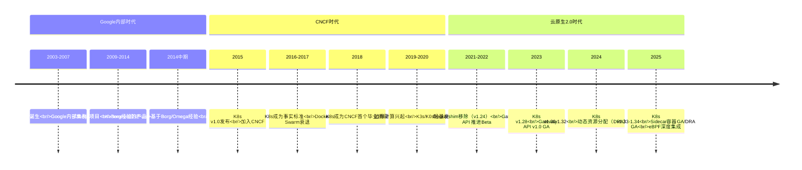

### 6.3 AIOps 成熟度曲线

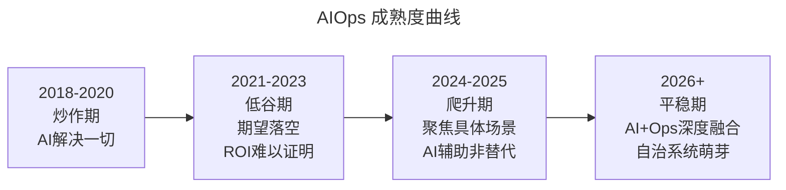

**上述 Mermaid 图说明**：AIOps 经历了 2018-2020 炒作期、2021-2023 低谷期、2024-2025 爬升期，将在 2026+ 进入平稳期。当前应聚焦具体场景，遵循"AI 辅助而非替代"的务实路径。

### 6.4 多云 K8s 管理工具对比

| 工具 | 类型 | 特点 | 适用规模 | 开源/商业 |
|------|------|------|---------|----------|
| **Rancher** | 统一管理平台 | 多集群 UI/CI 集成/Catalog | 中大型 | 开源+商业 |
| **Open Cluster Management (OCM)** | K8s 原生 | Red Hat 出品，CRD 驱动 | 大型企业 | 开源（CNCF） |
| **Kubefleet** | K8s 原生 | 微软出品，类似 OCM | Azure 生态 | 开源 |
| **Loft / vcluster** | 虚拟集群 | 每用户独立虚拟控制面 | 多租户平台 | 商业/开源 |
| **Crossplane** | 控制平面 | 统一管理多云资源 | 基础设施团队 | 开源（CNCF） |

### 6.5 推荐学习资源（2025 版）

#### Platform Engineering & IDP
- 📖 **必读**：《Platform Engineering》(Manning, 2024)
- 🛠️ **实战**：Backstage 官方文档 (backstage.io)
- 🎥 **视频**：PlatformCon 2024 演讲合集
- 💡 **案例**：Spotify、Shopify、Azure 的 IDP 实践分享

#### Developer Experience (DevEx)
- 📊 **框架**：SPACE Framework 论文 (ACM Digital Library)
- 📖 **书籍**：《Team Topologies》、《Accelerate》、《Measure What Matters》
- 🔬 **调研**：GitHub State of the Octoverse、GitLab Global DevSecOps Report

#### 可观测性 & SRE
- 📖 **经典**：《Site Reliability Engineering》(Google SRE Book)
- 📖 **进阶**：《Observability Engineering》(O'Reilly)
- 🛠️ **工具**：OpenTelemetry 官方文档、Grafana LGTM Stack

#### 云原生 & Kubernetes
- 📖 **基础**：《Kubernetes in Action》
- 📖 **进阶**：《Production Kubernetes》(O'Reilly, 2021)
- 🌐 **社区**：CNCF Landscape (landscape.cncf.io)

#### AI in Operations
- 📖 **趋势**：《AI Engineering》(O'Reilly, 2025, Chip Huyen)
- 🛠️ **工具**：Datadog AI 文档、PagerDuty AIOps 白皮书
- 🔬 **研究**：Google Cloud 博客"AI for SRE"系列文章与厂商 AIOps 白皮书

> **💡 实践建议**
>
> 1. 评估你所在团队的运维成熟度（对照 L0-L5 模型）
> 2. 选择一个核心痛点（CI/CD、可观测性、成本优化）作为突破口
> 3. 建立"先标准化、再自动化、最后智能化"的迭代路径
> 4. 持续度量 DevEx 与 SLO，用数据驱动改进