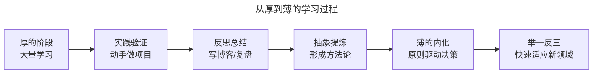
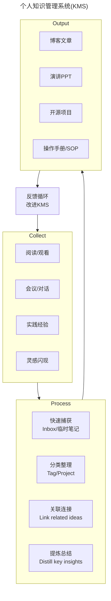
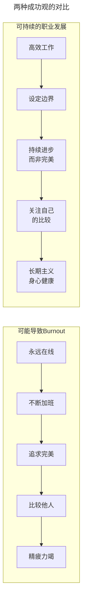

# 结束语-学习的过程，多些耐心和脚踏实地

> **v2 升级摘要**：本文在保留原 frontmatter、所有 Mermaid 图、术语英文对照的基础上，按 v2 标准的 6 节骨架（导言、核心方法论、关键流程、工具与实战、常见误区、进阶延展）重新组织内容；保留"从厚到薄"学习理念与专栏写作收获两大核心主题，补充 2025 年信息过载时代的专注策略、T 型学习、70-20-10 法则、JIT 学习、个人知识管理系统(KMS)、心理健康与职业韧性等新内容，并将原参考资料内容融入进阶延展一节。

## 一、导言

> **从 2019 到 2025**：这篇结束语最初写于专栏即将完结之时。如今 6 年过去了，世界发生了翻天覆地的变化——疫情改变了工作方式、AI 重塑了技术栈、Platform Engineering 重新定义了运维。但有些东西没有变，甚至变得更加重要：**学习的耐心、脚踏实地的态度、以及面对不确定性的韧性**。

本运维体系管理课专栏，已接近尾声，这是最后一篇，也是结束语。

笔者打算分两部分来写：一部分对这些内容的学习做个总结；另一部分谈谈专栏写作这件事情给笔者带来的改变，或者说笔者个人的一些收获。

## 二、核心方法论

### 2.1 学习是一个从厚到薄的过程

在学校的时候，曾经有一位历史老师讲过，历史书可以很厚，厚到将每一个历史事件和细节都记录下来，要用图书馆来保存这么多的文字内容；但是历史书也可以很薄，薄到用几句话，几段文字就可以描述，用人的脑子就可以记住，因为历史的发展规律总是相似的。

这条规律对于学习也同样适用，**学习也是一个从厚到薄的过程**。起初对一个领域或行业不熟悉，这个时候要学习大量的知识，不断向别人请教。但是在这个过程中，随着不断的实践和思考，逐步总结提炼出一条条原则和经验，甚至形成独有的方法论，然后再通过这些原则和经验举一反三，指导应对在这个领域中所遇到的各类问题。

这些内容中所分享的内容，就是厚的那一部分。希望这些内容可以给读者一个指引，告诉方向在哪里，应该从何做起，这样就不必在混沌中从头摸索；至于薄的那一部分，虽然在最后几篇文章中有一起复习，但是，更希望读者能够亲自实践和参与，形成自己的总结。

**这个过程，可以多一些耐心，多一些脚踏实地。**

### 2.2 软件架构的根本目的

对专栏的总结，我借用 Bob 大叔（Robert C·Martin）经典著作《简洁架构》（Clean Architecture）中的一句话，原文如下：

> The goal of software architecture is to minimize the human resources
>
> > required to build and maintain the required system.

翻译过来就是：

> 软件架构的目的，是将构建和维护所需的人力资源降到最低。

万变不离其宗，整个专栏的文章和内容，其实就是围绕着这句话展开的。从厚到薄的学习过程，用这句话来总结，再准确不过。

### 2.3 2025 年补充：技术人的"从厚到薄"

如果把这个理念放到 2025 年的技术环境中，可以进一步展开：

**"厚"的阶段——知识摄入期**

在这个阶段，你需要大量吸收：
- 云原生技术栈（K8s、Service Mesh、eBPF...）
- AI/LLM 应用能力（Prompt Engineering、RAG、Agent...）
- Platform Engineering 方法论（IDP 设计、DevEx 度量...）
- 新兴领域（FinOps、SLO 工程、混沌工程...）

**关键心态**：
- 接受"我不知道"是正常的
- 允许自己有困惑期
- 不要试图一次性学完所有东西
- 建立系统的学习路径而非碎片化浏览

**"薄"的阶段——内化与输出期**

当你积累了足够的"厚度"，开始进入提炼阶段：
- 识别哪些是核心原则（如"自动化一切可自动化的"、"以开发者体验为中心"）
- 形成自己的决策框架（如"选型评估矩阵"、"架构决策记录模板"）
- 建立可以复用的模式库（如"故障处理 SOP"、"Golden Path 模板"）
- 发展出独特的专业视角和观点



**上述 Mermaid 图说明**：从厚到薄的学习过程分为六步——大量学习、实践验证、反思总结、抽象提炼、薄的内化、举一反三。每一步都是迭代闭环，并非线性。其中"实践验证"与"反思总结"是最容易被忽视却最关键的环节，写作与复盘是最好的催化剂。

## 三、关键流程

### 3.1 专注带来效率提升

当发现有一件非常重要，且优先级非常高的事情摆在面前时，自然而然地就能意识到哪些事情是不重要的了，也不会再为要做哪些事情，不做哪些事情而反复纠结。

专栏写作对于笔者来说就是非常重要的事情。在一个相对较短的周期内，持续输出系统化的高质量文章，无论对时间，还是精力，都是极大的挑战。

因此，笔者索性将那些相对不重要的事情暂时放下，不让它们占用宝贵时间，消耗太多精力。比如，大大减少了使用手机的时间，准确来讲是减少了各类社交软件，以及各类资讯软件的使用频率，在工作时间基本不去碰这些软件，高效完成工作。写作过程中就更加坚决，除非电话打过来，否则手机也不碰。

再比如，大大减少不必要的活动和会议。笔者有一个很简单的原则，就是超过 30 分钟的会议，就拒绝，而是通过当面沟通的方式了解会议要讨论的内容，通常情况下，5~10 分钟就可以得出有效结论。故 **凡事事先充分准备，也成为这段时间提升效率的关键原则**。

**找到适合自己的节奏**。笔者的个人习惯是早起早睡，所以会将写作的时间安排在早上。晚上一般会思考和策划输出内容的框架，这样第二天一早就可以专注地把内容写出来，在头脑最清醒的时候写作最高效。同时，避免周末不必要的活动和外出，大部分文章都是在周末集中输出的。

总之，当全身心投入一件事情时，原来担心的精力不足，时间不够这些情况都没有发生，反而会觉得时间更加充足，对计划的掌控更加游刃有余。

### 3.2 2025 补充：在信息过载时代保持专注

到了 2025 年，保持专注比 2019 年更具挑战：

**新的干扰源**：
- AI 工具的无限可能性（每个都想试试）
- 技术热点快速切换（每周都有新框架/新工具）
- 社交媒体的信息流（Twitter/X、即刻、LinkedIn）
- 远程工作的边界模糊（家=办公室）

**笔者的 2025 版专注策略**：

| 策略 | 具体做法 |
|------|---------|
| **时间分块（Time Blocking）** | 深度工作时间（无通知）vs 浅层工作时间（处理消息） |
| **信息节食（Information Diet）** | 主动选择信息源，而不是被动接收推荐算法推送 |
| **单一任务（Single-tasking）** | 一次只做一件事，尤其是深度工作 |
| **定期数字排毒（Digital Detox）** | 每周有一天远离屏幕，每月有一个周末不碰社交媒体 |
| **AI 辅助而非主导** | 用 AI 提高效率，但不让 AI 决定你学什么 |

### 3.3 总结回顾是最好最快的提升方式

常常认为不断地学习新知识，一定要跟得上这个时代的所有新热点，才不至于掉队，才会不断提升。保持这种对新知识的敏感，从专业角度来看是没有问题的。但想表达的是，学习再多的新知识，如果不能学以致用，它们都只是停留在纸面上的内容而已。故单纯地学习，并不能提升技能，丰富经验。

相反，对于自己正在做的事情，或者已经完成的事情，能够不断总结和反思，就能帮助完整地、体系化地获得提升。讲到这里，分享下文章写作过程中的一个小细节，让笔者感受非常深刻，期望对读者也有启发。

起初在规划内容的时候，脑子里梳理出来的东西都是大的框架，比如持续交付部分，按照原计划写 4~5 篇文章。但是，当真正开始写的时候，非常详细地回顾了经历过的持续交付过程，把中间的建设过程，使用到的工具集，包括如何落地执行，以及如何与外部合作这些都仔仔细细地罗列出来，突然发现之前罗列的条条框框仍然是很粗的，所以就重新细化分解，最终用更多的篇幅完整细致地详述了整个持续交付体系。

同时，这个过程中，因为要讲清楚一些细节，以及为什么要这样做，会去翻阅和查询大量的资料，确保自己的理解是深刻和正确的。同时，还要把以前为什么这样选型也重新梳理一遍，提炼出很多方案选型方面的原则。这个过程再次加深了对一些原理和概念的理解，也让本来模糊或模棱两可的认知，有了更清晰的认识，对笔者来说也是更进一步。所谓教学相长，从实质来看应该就是这个道理。

整个过程下来，感觉就是，如果没有这样详细的总结回顾过程，很多细节和有价值的信息就随时间的漂移而遗落了，而这些信息一旦遗落，如果再经历类似的过程，可能还要重走弯路，也就谈不上什么进步了。

因此，在不断学习，接收新知识和新内容的同时，也 **不要忘了时常做一下总结和回顾**。而 **总结和回顾的最好方式就是写作**，希望读者也可以逐步养成记录日志和博客的习惯，真的会受益匪浅。

## 四、工具与实战

### 4.1 终身学习的方法论

在技术迭代如此之快的时代，"学会学习"本身成了最重要的技能。以下是笔者这些年总结的一套方法：

#### 方法 1：T 型学习策略

```
        深度 (T的一竖)
           │
           │  你的核心专业领域
           │  （如：K8s / SRE / Platform Eng）
           │
───────────┼─────────── 广度 (T的一横)
           │
   相关领域的基础了解
   （如：安全、数据库、网络、前端基础、产品思维...）
```

**为什么 T 型有效？**
- 深度让你成为专家，具有不可替代性
- 广度让你能与其他角色协作，理解全貌
- 在 AI 时代，广度帮助你判断什么值得深入学习

#### 方法 2：70-20-10 学习法则

| 占比 | 学习方式 | 说明 |
|------|---------|------|
| **70%** | 实践中学 | 做项目、解决实际问题、在工作中尝试新技术 |
| **20%** | 向他人学习 | Mentorship、代码评审、参加社区讨论、听播客 |
| **10%** | 正式学习 | 课程、读书、认证考试、参加会议 |

**应用建议**：
- 不要把所有时间花在上课/看书上
- 主动寻找能应用新知识的项目机会
- 找一个在你目标方向的 Mentor
- 参加线下/线上 meetup 和 conference

#### 方法 3：Just-In-Time Learning（及时学习）

**传统方式**：提前学完所有可能用到的东西 → 大部分忘记 → 需要用时再学一遍
**JIT 方式**：建立足够广泛的知识地图 → 需要时快速深入 → 学完立即应用 → 记忆牢固

**实施要点**：
- 保持对新技术的"知晓"（知道它存在、解决什么问题）
- 不需要每个技术都精通
- 当项目需要时，有能力在 1-2 周内达到可用水平
- 建立个人的"速查笔记系统"（Notion/Obsidian）

#### 方法 4：输出倒逼输入

这是笔者最推崇的学习方式：

**为什么有效？**
- 为了教别人，你必须真正理解（费曼技巧 / Feynman Technique）
- 写作强制你组织思路，发现逻辑漏洞
- 公开承诺增加你的责任感
- 输出物成为你知识资产的积累

**具体做法**：
- 每学完一个主题，写一篇总结博客
- 在团队内部做技术分享
- 在 GitHub 上创建示例项目
- 回答社区中的问题（Stack Overflow/论坛）

#### 方法 5：建立个人知识管理系统（KMS, Knowledge Management System）



**上述 Mermaid 图说明**：KMS 是一个收集 → 处理 → 输出 → 反馈的闭环系统。收集阶段从阅读、对话、实践、灵感四个来源摄入信息；处理阶段经过快速捕获、分类整理、关联连接、提炼总结四步转化为知识资产；输出阶段以博客、演讲、开源项目、SOP 四种形式产出价值；反馈循环持续改进 KMS 本身。

**工具推荐**：
- **Obsidian** + Zettelkasten 方法（双向链接笔记）
- **Notion**（结构化知识库）
- **Readwise Reader**（阅读笔记同步）
- **GitHub**（代码和技术文档）

### 4.2 笔者在专栏写作中的收获

再来谈谈专栏写作给笔者带来的一些改变，或者说笔者从中的收获，期望对读者也有帮助。

**核心收获**：
1. **专注带来效率提升**：找到适合的节奏，把手机、社交软件、不必要的会议放下
2. **总结回顾是最好最快的提升方式**：写作强制你深入理解，让模糊的认知变清晰
3. **教学相长**：为了讲清楚，会去翻阅大量资料，提炼原则，过程本身即是最大收益
4. **形成体系化资产**：写作让零散经验变成可复用的方法论

## 五、常见误区

### 5.1 误区一：盲目追热点，忽视基础

技术热点切换极快，但底层原理变化很慢。过度追新会导致基础不牢，遇到复杂问题时缺乏判断力。建议遵循 70-20-10 法则——70% 时间用于实践当前技术栈，20% 用于向他人学习，10% 才是探索新热点。

### 5.2 误区二：只输入不输出

只读书、只看视频、只听课，而不动手做项目、不写作、不分享，知识会很快遗忘。输出倒逼输入是最有效的学习方式——公开承诺会让你真正去理解，而不是停留在"我大概知道"的幻觉中。

### 5.3 误区三：试图一次性学完所有东西

云原生、AI/LLM、Platform Engineering、FinOps、SLO、混沌工程……每个领域都很大。试图一次性学完所有，结果往往是每个都浅尝辄止。应遵循 JIT 学习——建立广泛的知识地图，需要时再深入。

### 5.4 误区四：忽视心理健康

技术行业的高速迭代、On-call 压力、AI 焦虑，使开发者成为 Burnout（职业倦怠）高发群体。不重视身心健康的"奋斗"是不可持续的。请把身心健康视为一切的基础。

### 5.5 误区五：与他人比较而焦虑

社交媒体放大了"别人都很厉害"的错觉。每个人的起点、资源、节奏都不同，比较只会带来焦虑。请关注自己的成长曲线——今天比昨天进步一点点，就足够了。

## 六、进阶延展

### 6.1 心理健康与职业韧性

在结束之前，想聊聊一个在 2019 年很少被提及、但在 2025 年极其重要的话题：**技术人的心理健康和职业韧性（Career Resilience）**。

#### 为什么这个话题如此重要？

**数据说话**：
- 多份行业调研显示，超过半数的开发者报告经历过不同程度的 Burnout（职业倦怠）
- 运维/SRE 岗位因为 On-call 压力，Burnout 率更高
- 后疫情时代，远程办公带来的孤独感和边界模糊加剧了心理问题
- AI 焦虑："我会不会被取代？"成为普遍担忧

#### Burnout 的早期信号

| 类别 | 表现 |
|------|------|
| **身体层面** | 慢性疲劳、失眠、头痛、免疫力下降 |
| **情绪层面** | 易怒、冷漠、无助感、成就感丧失 |
| **认知层面** | 注意力难集中、记忆力下降、决策困难 |
| **行为层面** | 社交退缩、工作效率下降、拖延加重 |

#### 预防和应对策略

**1. 设定健康的工作边界**
- 明确的"下班时间"并遵守
- On-call 轮换制度（避免长期单人 on-call）
- 休假权利的使用（不要积攒假期）
- "断联权"（Right to Disconnect）的权利

**2. 培养工作之外的身份认同**
- 你不只是"XX 公司的 SRE/工程师"
- 发展爱好、运动、家庭、社交
- 多元化的身份让职业挫折不会击垮你的全部自我价值

**3. 建立支持系统**
- Mentor（职业发展导师）
- Peer Group（同行互助小组）
- 家人朋友（情感支持）
- 专业帮助（心理咨询不是羞耻的事）

**4. 正念和压力管理**
- 冥想/Mindfulness apps（Headspace, Calm）
- 规律运动（哪怕每天 15 分钟）
- 兴趣爱好作为"精神充电站"
- 学会说"不"（保护自己的时间和精力）

**5. 重新定义成功**



**上述 Mermaid 图说明**：传统成功观以"永远在线、不断加班、追求完美、与他人比较"为路径，终点是精疲力竭；健康成功观以"高效工作、设定边界、持续进步而非完美、关注自己的比较、长期主义"为路径，终点是身心健康的可持续发展。

#### 给你的建议

如果你正在经历或接近 Burnout：
1. **承认它**：这不是软弱，是对身体的正常反应
2. **寻求帮助**：跟主管、HR、或者专业人士谈
3. **休息**：真正的休息，不是"换个地方工作"
4. **评估**：当前的工作环境是否适合你长期发展？
5. **规划**：制定恢复计划，必要时考虑换环境

如果你想预防 Burnout：
1. **现在就开始**建立健康习惯（不要等"有空了"）
2. **定期自检**：每月问自己"我现在状态怎么样？"
3. **投资关系**：家人、朋友、同事——人是最好的抗压资源
4. **找到意义**：明确你工作的意义和价值，而不只是 KPI

### 6.2 写给 2025 及未来的你

感谢读者的阅读和反馈。一路相伴，共同成长。

**回望 2019 年**，当刚开始这段旅程时：
- Kubernetes 还在早期普及阶段
- DevOps 是热门词汇但实践参差不齐
- SRE 还是少数大厂的专属岗位
- AI 在运维中的应用还停留在概念阶段
- 远程办公是少数公司的福利

**站在 2025 年**，可以看到：
- Platform Engineering 已成为主流范式
- IDP（Internal Developer Portal）正在改变开发者的日常工作
- AI/LLM 已经深入工具链的每一个环节
- 全球远程协作成为常态
- 运维人拥有了前所未有的多元化职业路径

**展望未来**，唯一确定的是：**变化会继续加速**。

但有些东西不会变：
- **扎实的基本功**永远是立身之本
- **良好的工作习惯**会让在任何环境下脱颖而出
- **真诚的人际关系**是最宝贵的资产
- **持续学习的能力**是最可靠的依靠
- **健康的身心**是一切的前提

### 6.3 推荐资源（2025 版）

#### 学习方法与认知科学
- 📖 **《Make It Stick》** - 认知科学视角的高效学习法
- 📖 **《Atomic Habits》** - James Clear / 微习惯与长期主义
- 📖 **《Deep Work》** - Cal Newport / 深度工作
- 📖 **《Peak》** - Anders Ericsson / 刻意练习

#### 技术写作与影响力
- 📖 **《Show Your Work!》** - Austin Kleon / 公开创作
- 📖 **《On Writing Well》** - William Zinsser / 非虚构写作
- 📖 **《Working in Public》** - Nadia Eghbal / 开源维护者视角

#### 心理健康与职业韧性
- 📖 **《Burnout》** - Emily & Amelia Nagoski / 职业倦怠科学
- 📖 **《The Fearless Organization》** - Amy Edmondson / 心理安全
- 📖 **《Option B》** - Sheryl Sandberg / 韧性建设

#### 职业发展与全球化
- 📖 **《The Alliance》** - Reid Hoffman / 联盟式雇佣
- 📖 **《The Software Engineer's Guidebook》** - Gergely Orosz
- 💼 **平台**：LinkedIn Learning、Taro（工程师职业发展平台）

#### 知识管理工具
- 🛠️ **Obsidian** + Zettelkasten 方法
- 🛠️ **Notion**（结构化知识库）
- 🛠️ **Readwise Reader**（阅读笔记同步）
- 🛠️ **GitHub**（代码与技术文档）

### 6.4 最后的话

希望读者能够通过专栏的学习，更进一步！

**更重要的是，希望读者在未来的职业道路上：**

- 🌱 **保持好奇心** —— 对新技术、新方法保持开放
- 📖 **坚持学习** —— 但要有策略，不要盲目追热点
- ✍️ **勤于输出** —— 写作是最好的学习和影响力建设方式
- 🤝 **珍视关系** —— 同事、导师、社区伙伴都是财富
- ❤️ **照顾好自己** —— 身心健康是一切的基础
- 🎯 **找到意义** —— 知道你为什么要做这件事
- 🧘 **保持耐心** —— 成长需要时间，允许自己慢慢来
- 👣 **脚踏实地** —— 想法再多，不如先迈出第一步

> **"The journey of a thousand miles begins with a single step."**
>
> **千里之行，始于足下。**

不管现在处于职业生涯的哪个阶段，不管外部环境如何变化，请记住：

**不需要一夜之间变成专家。**
**不需要掌握所有的最新技术。**
**不需要跟任何人比较。**

**需要做的只是：**
**今天比昨天进步一点点，**
**本周比上周多学一个小技能，**
**今年比去年更清楚地知道自己想要什么。**

**这就够了。**