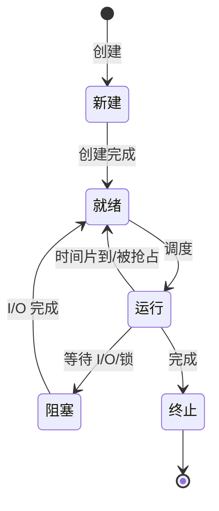
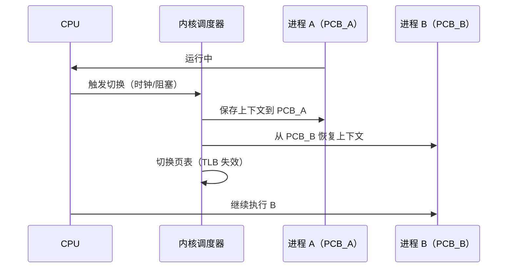

# 进程生命周期与上下文切换

进程是操作系统资源分配的基本单位。本文从 Linux 视角整理进程的创建（fork/exec）、状态机、PCB 结构，以及进程/线程上下文切换的机制与开销。

## 一、进程的状态机

进程生命周期经历多个状态，核心状态如下：



- **新建（New）**：正在创建。
- **就绪（Ready）**：已就绪，等待 CPU。
- **运行（Running）**：占用 CPU 执行。
- **阻塞（Blocked/Wait）**：等待某事件（I/O、锁），让出 CPU。
- **终止（Terminated）**：已结束，等待回收资源。

状态迁移由调度器与事件驱动：就绪→运行（调度）、运行→就绪（时间片到/被抢占）、运行→阻塞（等待 I/O）、阻塞→就绪（I/O 完成）。

## 二、进程的创建：fork 与 exec

Linux 创建进程用两个系统调用组合：

### fork

```c
pid_t pid = fork();
if (pid == 0) {
    // 子进程
} else {
    // 父进程，pid 为子进程 pid
}
```

- `fork` 创建一个**几乎完全复制父进程**的子进程：复制 PCB、页表、文件描述符等。
- 返回两次：父进程返回子进程 pid，子进程返回 0。
- 现代 Linux 用 **Copy-on-Write（COW）** 优化：fork 不真正复制物理内存，父子共享只读页，直到一方写入才复制，大幅降低 fork 开销。

### exec

```c
execve("/bin/ls", argv, envp);
```

- `exec` 用新程序**替换**当前进程的映像（代码、数据、堆栈），PID 不变。
- 常见组合 `fork + exec`：父进程 fork 出子进程，子进程 exec 加载新程序。

### 进程树与孤儿/僵尸

- 进程有父子关系，`init`/`systemd` 是所有进程的祖先。
- **僵尸进程（Zombie）**：进程已终止但父进程未 `wait` 回收其 PCB，残留一条 PCB。
- **孤儿进程**：父进程先退出，子进程被 `init` 收养。

## 三、进程控制块（PCB）

每个进程在内核中有一个 **PCB（Process Control Block，Linux 中为 task_struct）**，记录：

- **进程标识**：PID、PPID、用户/组。
- **进程状态**：当前处于状态机的哪个状态。
- **程序计数器（PC）与寄存器现场**：用于恢复执行。
- **调度信息**：优先级、时间片、调度队列。
- **内存管理信息**：页表指针、代码/数据段边界。
- **I/O 状态**：打开的文件描述符表。
- **记账信息**：CPU 使用时间。

PCB 是内核管理进程的"档案"，所有进程的 PCB 由内核统一管理（Linux 的 task list）。

## 四、上下文切换（Context Switch）

当调度器决定从进程 A 切换到进程 B 时，发生**上下文切换**：

1. 保存 A 的上下文（PC、寄存器、栈指针、内核状态）到 A 的 PCB。
2. 从 B 的 PCB 恢复其上下文。
3. 更新内存映射（切页表）、恢复 PC，继续执行 B。

上下文切换的过程：



**开销**：
- 保存/恢复寄存器与内核状态；
- 切换页表导致 TLB 失效；
- **缓存（Cache）失效**：新进程数据不在缓存中，冷启动缓存，后续访问慢；
- 系统调用/调度的内核态切换。

上下文切换是"昂贵"的操作，因此现代系统倾向**减少切换频率**或用**线程**（线程切换共享地址空间，无需切页表，开销小于进程切换）。

## 五、线程与进程切换的差异

| 维度 | 进程切换 | 线程切换 |
| --- | --- | --- |
| 地址空间 | 需切换页表，TLB 失效 | 同进程内共享，不切页表 |
| 资源 | 文件、信号等独立 | 共享 |
| 开销 | 大 | 较小 |
| 触发 | 进程级调度 | 线程级调度 |

同一进程内的线程切换因无需切换地址空间而更快；跨进程的线程切换开销则与进程切换相当。

## 六、Linux 调度与运行队列

调度器维护就绪队列，按优先级与虚拟运行时间选择下一个运行实体。长期以来的 CFS 调度器以红黑树组织就绪任务；自内核 6.6 起，CFS 已被同样基于虚拟时间的 EEVDF 调度器取代（截至 2026-09 的主流内核）。进程/线程在 Linux 中统称为 **task**，调度单位是 task_struct。

## 小结

- 进程经新建→就绪→运行→阻塞→终止的状态机，由调度与事件驱动迁移。
- Linux 用 fork（COW 优化）+ exec 创建进程，PCB（task_struct）记录进程全部状态。
- 上下文切换保存/恢复现场并换页表，代价较高；同进程线程切换更轻量。
