# CPU篇-进程与中断

## 导言：从顺序执行到并发世界

在上一篇 [04-CPU篇-指令集](../02-计算机组成原理/04-CPU篇-指令集.md) 中，我们了解了指令集如何驱动 CPU 执行计算。然而，仅仅让 CPU 逐条执行指令，远远无法构建现代计算机系统。一个根本性的问题浮现出来：**单颗 CPU 如何同时服务于多个程序？**

这个问题的答案涉及两个核心机制——**进程**与**中断**。进程是操作系统对执行实体的抽象，中断则是 CPU 响应外部事件的硬件机制。二者协同工作，构成了多任务系统的基石。没有中断，CPU 就是一座与世隔绝的计算孤岛；没有进程，多任务就失去了调度的基本单位。理解进程与中断的交互原理，是理解整个操作系统架构的关键入口。

---

## 一、核心概念与原理

### 1.1 中断：CPU 与外部世界的桥梁

**中断（Interrupt）** 是 CPU 响应内外部异步事件的一种硬件机制。当某个事件发生时，CPU 暂停当前执行流，保存现场，转而执行对应的中断处理程序，完成后再恢复现场继续执行。

中断的本质是**控制流的强制转移**。它打破了 CPU 顺序执行指令的固有模式，使 CPU 具备了对异步事件的响应能力。许式伟在课程中强调：中断机制是计算机从"计算器"迈向"计算机系统"的关键转折点——没有中断，CPU 就无法感知 I/O 设备的状态变化，也无法实现分时复用。

#### 中断的分类体系

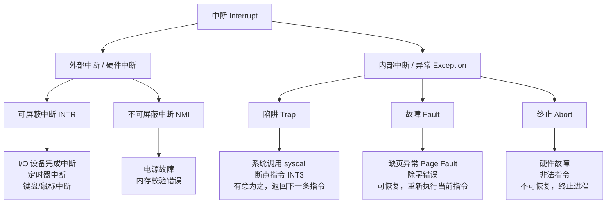

**关键区分**：

| 维度 | 外部中断（硬件中断） | 内部中断（异常） |
|------|----------------------|------------------|
| 触发源 | CPU 外部设备信号 | CPU 执行指令过程中产生 |
| 异步性 | 完全异步，与指令流无关 | 同步，与当前指令相关 |
| 可屏蔽性 | INTR 可通过 IF 标志位屏蔽 | 不可屏蔽 |
| 典型场景 | 磁盘 I/O 完成、定时器到时 | 缺页、系统调用、除零 |
| 返回行为 | 返回被中断的下一条指令 | 依类型不同（见上图） |

### 1.2 进程：操作系统对执行的核心抽象

**进程（Process）** 是操作系统对正在运行的程序的抽象。它是资源分配的基本单位，包含代码段、数据段、堆栈、文件描述符、地址空间等一系列运行时上下文。

进程的本质是**一个执行中的程序实例加上其完整的运行环境**。许式伟指出，进程的设计体现了操作系统最核心的抽象能力：将物理 CPU 虚拟化为多个逻辑 CPU，使每个进程都以为自己在独占一台计算机。

#### 进程的组成结构


#### 进程状态转换

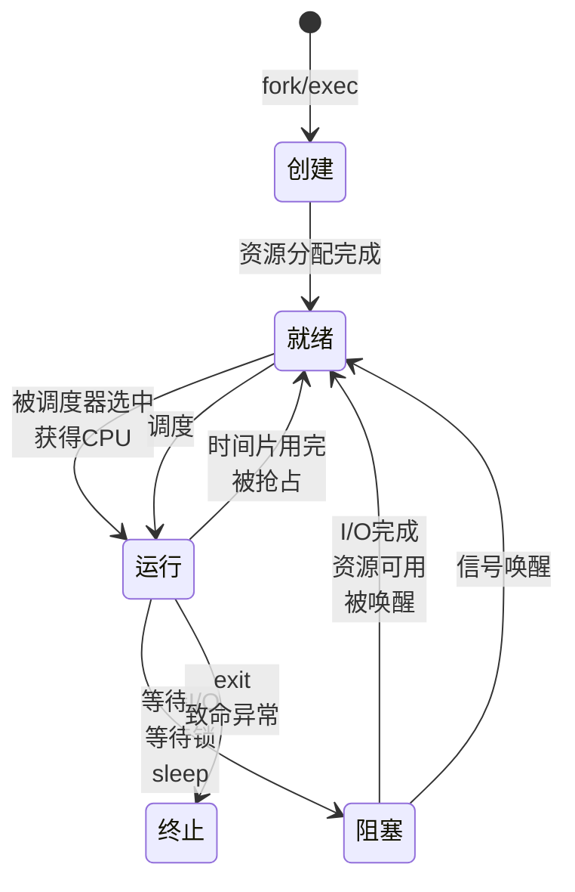

**状态转换要点**：

- **就绪到运行**：唯一路径是被调度器选中，不存在从阻塞直接到运行的转换——这是初学者常见的误区
- **运行到阻塞**：是进程的**主动行为**（如发起 I/O 请求），而非被动
- **运行到就绪**：是**被动行为**（时间片耗尽或更高优先级进程抢占），体现了分时系统的核心机制

### 1.3 进程与中断的协同：多任务的实现机制

进程和中断的关系并非简单并列，而是深度耦合：**中断是进程切换的触发器和实现基础**。没有中断机制，进程调度就无从谈起。

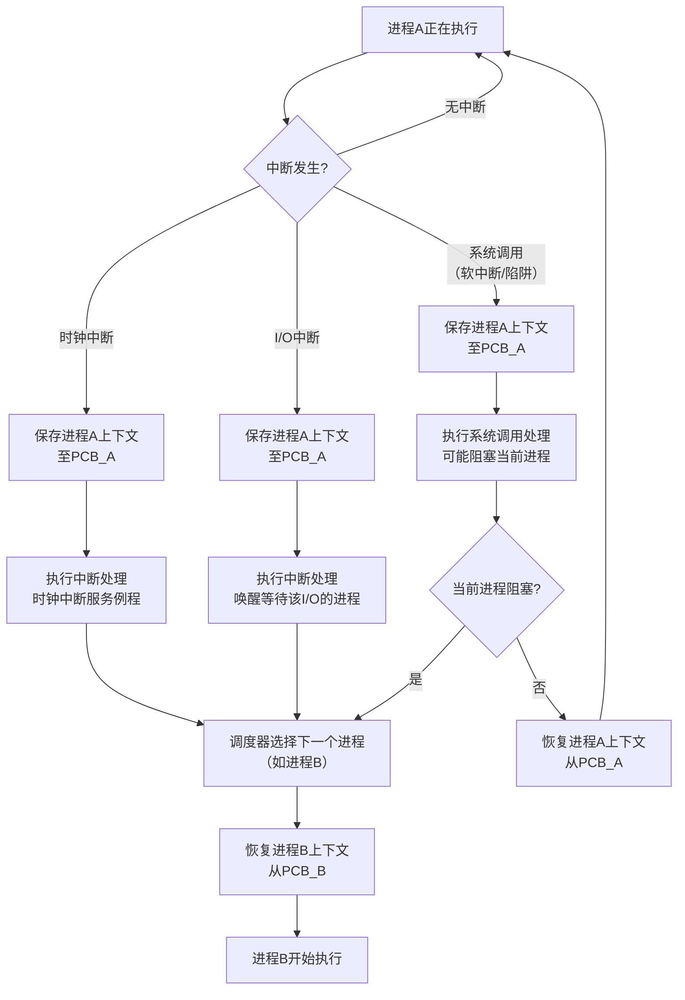

---

## 二、中断处理流程详解

### 2.1 中断处理的完整生命周期

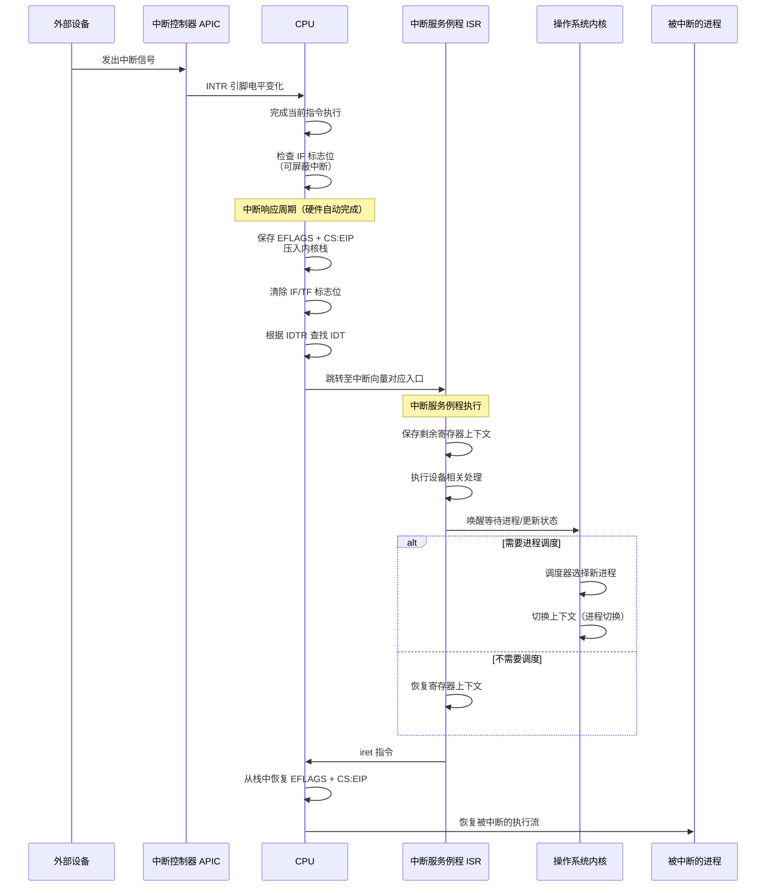

### 2.2 中断描述符表（IDT）与中断向量

x86 架构中，中断处理的关键数据结构是**中断描述符表（Interrupt Descriptor Table, IDT）**。IDT 是一个由 256 个表项组成的数组，每个表项是一个 8 字节（32 位模式）或 16 字节（64 位模式）的描述符，包含：

- 中断处理程序的段选择子和偏移地址
- 特权级（DPL）和存在位
- 门类型（中断门 / 陷阱门 / 任务门）

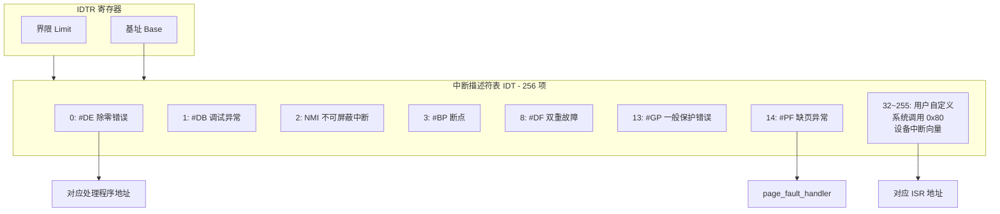

**中断门与陷阱门的区别**：中断门在进入处理程序时自动清除 IF 标志位（屏蔽后续可屏蔽中断），而陷阱门不会。这就是为什么系统调用（如 int 0x80）使用陷阱门——允许在内核态响应中断，避免因长时间屏蔽中断导致系统响应延迟（现代 64 位程序常用的 syscall 指令则不经 IDT，由专用寄存器入口直接进入内核）。

### 2.3 中断上下文与进程上下文的本质区别

| 维度 | 中断上下文 | 进程上下文 |
|------|-----------|-----------|
| 执行实体 | 无对应进程，是内核的一部分 | 绑定到具体进程的 PCB |
| 可睡眠性 | **不可睡眠**，不可调用可能阻塞的函数 | 可以睡眠、阻塞 |
| 调度 | 不参与调度，执行完即返回 | 可被调度器换出 |
| 栈 | 使用当前进程的内核栈（或专用中断栈） | 有独立的用户栈和内核栈 |
| 抢占性 | 通常中断处理不可被进程抢占 | 可被中断抢占 |
| 时间约束 | 必须快速完成（微秒级） | 无严格时间约束 |

这一区别具有深远的工程意义：**中断处理程序中绝不能调用可能睡眠的函数**（如 `kmalloc(GFP_KERNEL)`、`mutex_lock`、`wait_event`），否则会导致系统死锁或崩溃。这是内核开发中最常见的陷阱之一。

---

## 三、上下文切换：进程与中断的交汇点

### 3.1 上下文切换的完整序列

上下文切换（Context Switch）是操作系统中最核心也最昂贵的操作之一。它涉及两方面的切换：**地址空间切换**和**处理器状态切换**。

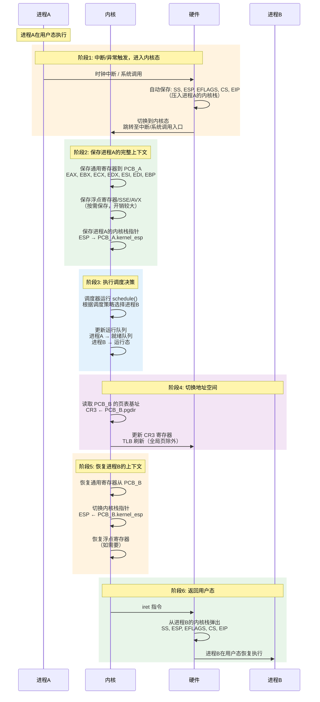

### 3.2 上下文切换的性能代价

上下文切换是操作系统中最昂贵的操作之一，其开销来源包括：

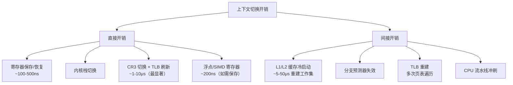

**关键性能洞察**：

- **直接开销**中，TLB 刷新通常最为显著。切换 CR3 导致全部非全局 TLB 表项失效，此后进程的每次内存访问都需要重新遍历页表
- **间接开销**远大于直接开销，缓存冷启动的代价可达微秒级别，远超寄存器保存的百纳秒级开销
- **FPU 延迟切换（Lazy FPU Switch）**：由于浮点寄存器保存开销较大，内核采用延迟策略——只在进程首次使用 FPU 时才触发保存/恢复，通过 CR0.TS 位实现（此为历史策略；Linux 4.6 起 x86-64 已默认改为切换时即时保存/恢复的 eager 模式，依靠优化的 XSAVE 指令控制开销）

---

## 四、中断处理的分层架构：上半部与下半部

### 4.1 为什么需要中断分层？

中断处理的核心矛盾在于：**中断需要尽快处理以恢复系统响应能力，但某些处理逻辑又需要较长的执行时间**。如果在中断上下文中执行耗时操作，会阻塞后续中断，导致系统响应延迟甚至丢中断。

Linux 内核的解决方案是将中断处理分为两层：

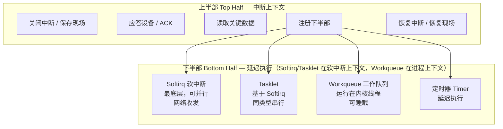

### 4.2 上半部与下半部的对比分析

| 维度 | 上半部 Top Half | 下半部 Bottom Half |
|------|----------------|-------------------|
| 执行上下文 | 中断上下文 | 进程上下文（Softirq/Tasklet 在软中断上下文） |
| 可睡眠 | 不可 | Workqueue 可以；Softirq/Tasklet 不可以 |
| 中断状态 | 可屏蔽同类中断 | 中断完全开启 |
| 时间约束 | 极短，微秒级 | 相对宽松，毫秒级 |
| 典型任务 | 应答设备、拷贝数据 | 协议解析、数据包处理 |
| 调度 | 不参与 | Workqueue 可参与调度 |

**Softirq vs Tasklet vs Workqueue 的选型原则**：

- **Softirq**：仅用于极高性能场景（网络收发、块设备），在中断退出时立即执行，同一类型可在多 CPU 并行，需要严格考虑并发安全
- **Tasklet**：基于 Softirq 实现的简化接口，保证同类型 Tasklet 不会在多 CPU 上并行执行，降低了并发复杂度，但性能略低
- **Workqueue**：运行在内核线程上下文，可以使用所有内核 API（包括可能睡眠的函数），是最灵活但开销最大的方案

---

## 五、设计原则与权衡（Trade-off 分析）

### 5.1 中断响应速度 vs 处理完整性

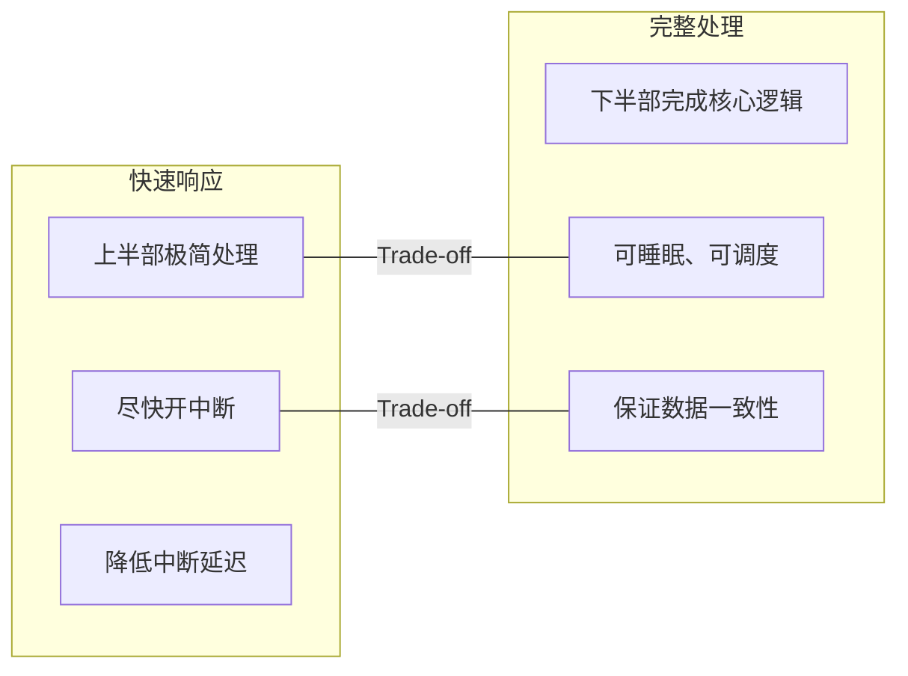

**核心权衡**：上半部处理越少，系统对后续中断的响应越快；但下半部延迟越大，事件处理的整体延迟也越大。这是一个**延迟 vs 响应性**的经典权衡。对于实时系统，这个权衡尤为关键——硬实时系统往往不允许任何中断延迟，因此可能需要完全不同的中断模型。

### 5.2 进程粒度 vs 上下文切换开销

| 进程粒度 | 优势 | 劣势 | 典型场景 |
|----------|------|------|---------|
| 粗粒度（少量长生命周期进程） | 上下文切换少，缓存命中率高 | 并发度低，资源利用率低 | 批处理系统 |
| 细粒度（大量短生命周期进程） | 并发度高，响应性好 | 切换开销大，缓存失效频繁 | 交互式系统 |
| 线程级并发 | 共享地址空间，切换开销小 | 同步复杂，安全性差 | 高并发服务 |
| 协程级并发 | 用户态切换，开销极小 | 无法利用多核，需协作式调度 | I/O 密集型服务 |

这正是 [13-多任务-进程、线程与协程](13-多任务-进程、线程与协程.md) 中深入讨论的核心问题——从进程到线程再到协程，本质是在**隔离性与切换开销之间寻找最佳平衡点**。

### 5.3 中断屏蔽与系统安全

中断屏蔽是一把双刃剑：

- **必要性**：内核在操作关键数据结构时必须屏蔽中断，防止中断处理程序看到不一致的状态
- **危险性**：屏蔽中断时间过长会导致系统失去对外部事件的响应能力，甚至丢失中断

**设计原则**：中断屏蔽区域（临界区）必须尽可能短，只保护真正需要原子操作的代码段。在可抢占内核中，这一问题更为复杂——还需要结合自旋锁（spinlock）来防止其他 CPU 同时访问共享数据。

### 5.4 硬件中断 vs 轮询

| 维度 | 中断驱动 | 轮询 Polling |
|------|---------|-------------|
| CPU 利用率 | 空闲时 CPU 完全释放 | 空闲时 CPU 忙等待 |
| 响应延迟 | 取决于中断延迟（低） | 取决于轮询周期（可控但较高） |
| 高负载表现 | 中断风暴可能压垮 CPU | 轮询开销固定，高吞吐下更稳定 |
| 适用场景 | 低频、不规律的事件 | 高频、规律的事件（如高速网络） |

**现代趋势**：高速网络（10Gbps+）场景下，中断驱动模型面临"中断风暴"问题——每秒数百万个数据包产生同等数量的中断，导致 CPU 花费大量时间在中断处理上。解决方案是 **NAPI（New API）** 模型：混合中断与轮询，首次数据包到达时触发中断，之后切换到轮询模式批量处理，当队列为空时再切回中断模式。

---

## 六、实践案例与反模式

### 6.1 案例一：Linux 的 O(1) 调度器与 CFS

Linux 内核调度器的演进是理解进程与中断交互的绝佳案例：

- **O(1) 调度器（2.4-2.6 早期）**：维护活跃和过期两个优先级数组，时间片耗尽的进程从活跃数组移到过期数组，调度器在 O(1) 时间内选出最高优先级进程。问题在于交互性判断依赖启发式公式，复杂且不准确
- **CFS（完全公平调度器，2.6.23 起）**：摒弃固定时间片概念，基于红黑树维护进程的虚拟运行时间（vruntime），每次选择 vruntime 最小的进程运行。时钟中断触发时更新当前进程的 vruntime，自然实现公平性。内核 6.6 起，CFS 已被同样基于虚拟时间的 EEVDF 调度器取代（截至 2026-09 的主流内核）

时钟中断在调度器中扮演的角色：**它是调度决策的触发时机**。每次时钟中断，内核更新当前进程的时间统计，检查是否需要抢占，实现了从"运行态"到"就绪态"的状态转换。

### 6.2 案例二：缺页异常——中断驱动的惰性分配

缺页异常（Page Fault）是中断驱动惰性分配的经典实现，也是 [12-内存管理-堆与栈](12-内存管理-堆与栈.md) 中内存管理的关键机制：

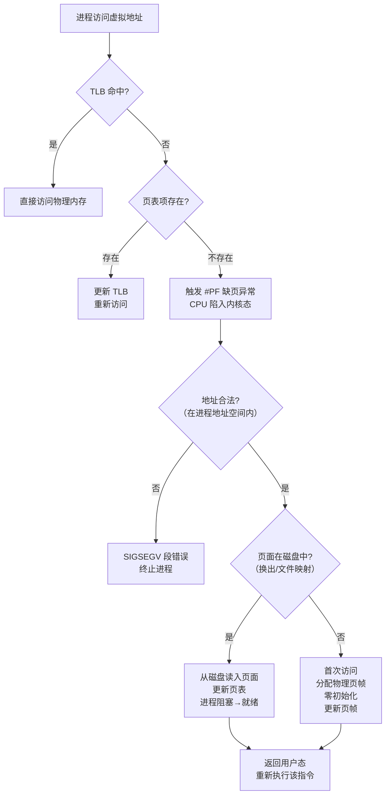

这个案例完美展示了**异常（Fault 类）如何与进程状态转换配合**：磁盘 I/O 期间进程从运行态转为阻塞态，I/O 完成后由中断唤醒转为就绪态，最终被调度器选中恢复执行。

### 6.3 反模式一：中断处理程序中调用睡眠函数

```c
// 错误！在中断上下文中调用可能睡眠的函数
irqreturn_t my_interrupt_handler(int irq, void *dev_id)
{
    // BUG: kmalloc(GFP_KERNEL) 可能睡眠
    void *buf = kmalloc(PAGE_SIZE, GFP_KERNEL);

    // BUG: mutex_lock 可能睡眠
    mutex_lock(&my_mutex);

    // BUG: copy_from_user 可能睡眠（缺页时）
    copy_from_user(buf, user_ptr, size);

    // 正确做法：在中断上下文中用 kmalloc(PAGE_SIZE, GFP_ATOMIC)，
    // 或注册 workqueue/tasklet 在下半部处理
}
```

**后果**：系统死锁、内核 panic、不可预测的行为。因为中断没有对应的进程上下文，调度器无法将其挂起并重新调度。

### 6.4 反模式二：中断风暴

当设备产生中断的速度超过 CPU 处理中断的速度时，系统将陷入"中断风暴"——CPU 将所有时间花在中断处理上，无法推进任何进程的执行。典型场景：

- 网卡每秒收到数百万个小包，每个包触发一次中断
- 故障设备持续产生虚假中断
- 中断处理程序中执行了过于复杂的逻辑

**防御策略**：中断节流（Interrupt Throttling）、NAPI 混合模式、中断合并（Interrupt Coalescing）。

---

## 七、从 CPU 视角看进程与中断的整体架构

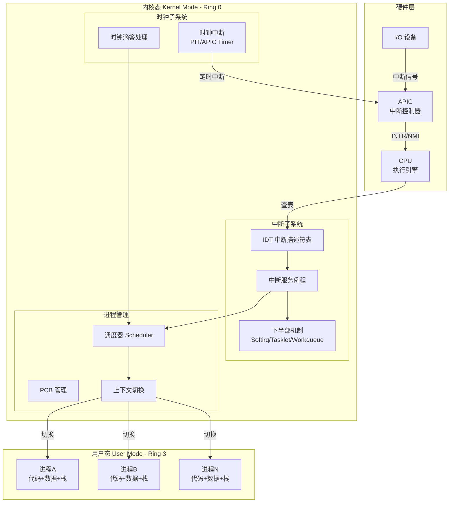

这张图揭示了现代操作系统的核心架构分层：

1. **硬件层**产生中断信号，经中断控制器传递给 CPU
2. **CPU** 响应中断，通过 IDT 路由到对应的处理程序
3. **内核态**的中断处理可能触发调度决策
4. **调度器**通过上下文切换在用户态的各进程间分配 CPU 时间

---

## 关键要点

1. **中断是多任务的硬件基础**：没有中断机制，CPU 就无法实现分时复用。时钟中断是进程调度的触发器，I/O 中断是进程状态转换的驱动器。理解操作系统的运行机制，必须从理解中断开始。

2. **进程是资源隔离与调度的核心抽象**：进程通过虚拟地址空间实现了内存隔离，通过 PCB 封装了完整的运行上下文，通过状态机模型实现了多任务的有序调度。进程切换的代价（尤其是 TLB 刷新和缓存失效）是影响系统性能的关键因素。

3. **中断处理必须分层**：上半部在中断上下文中快速响应设备，下半部在进程上下文中完成核心逻辑。违反这一原则——在中断上下文中执行耗时或可睡眠的操作——是内核开发中最常见也最致命的错误之一。

4. **上下文切换是进程与中断的交汇点**：切换过程涉及硬件自动保存（EFLAGS/CS/EIP）、软件保存（通用寄存器/FPU）、地址空间切换（CR3/TLB）和调度决策四个阶段。其中间接开销（缓存失效）远大于直接开销（寄存器保存），这是性能优化的关键认知。

5. **中断驱动与轮询的混合是高性能系统的必然选择**：纯中断驱动在低负载下高效，但在高负载下面临中断风暴；纯轮询在低负载下浪费 CPU，但在高负载下吞吐稳定。NAPI 等混合模型代表了这一 Trade-off 的工程最优解，也体现了架构设计中"没有银弹"的核心思想。

---

> **延伸阅读**：
> - [04-CPU篇-指令集](../02-计算机组成原理/04-CPU篇-指令集.md) — 理解指令集是理解中断机制的硬件基础
> - [12-内存管理-堆与栈](12-内存管理-堆与栈.md) — 缺页异常与内存管理的深度关联
> - [13-多任务-进程、线程与协程](13-多任务-进程、线程与协程.md) — 进程粒度的权衡与线程/协程的演进
> - [11-进程间通信：进程间通信都有哪些方法](11-进程间通信：进程间通信都有哪些方法.md) — 进程间通信与同步机制
