# CPU篇-进程与线程

## 章节导言

在前面几讲中，我们依次介绍了操作系统的存储管理（内存与外存）和输入输出设备管理。至此，冯·诺依曼体系结构的三大核心要素——CPU、存储、I/O——中，仅剩 CPU 的多任务调度尚未深入展开。

多任务的需求无处不在：边工作边听音乐、后台运行监控程序、网络服务器同时处理成千上万并发请求……这些场景都指向同一个核心问题：**如何让有限的 CPU 资源服务于多个执行流？**

本节将从物理层面的多任务实现出发，逐步深入到操作系统提供的三类执行体——进程、线程、协程——的设计动机、本质差异与架构权衡，并批判性地审视 UNIX fork 等历史设计决策。

---

## 核心概念与原理

### 多任务的物理基础

多任务的实现首先取决于硬件层面的能力。从物理维度看，存在两条路径：

```mermaid
flowchart TD
    A[物理层面的多任务] --> B[多颗 CPU<br/>SMP 架构]
    A --> C[单颗 CPU 多核心<br/>多核技术]
    B --> D[服务器领域主流<br/>追求计算力密度]
    C --> E[桌面端主流<br/>追求体积最小化]
    C --> F[单核分时系统<br/>时间片轮转]
    F --> G[软件视角：<br/>多个任务"同时"运行]
```

**多颗 CPU** 与 **单颗 CPU 多核心** 是物理并行的两种形态。桌面端（PC、手机、手表）受限于体积约束，主要采用多核方案；服务器领域则两者并用，以最大化单机计算力密度。

但物理并行并非多任务的必要条件。**单核 CPU 同样可以实现多任务**——其核心机制是分时系统（Time-Sharing System）：将 CPU 时间切分为极小的时间片，每个时间片只运行一个软件，通过快速轮转制造"同时运行"的幻觉。

### 执行体：多任务的统一抽象

分时系统的实现依赖三个关键问题的解答：

1. **任务是什么**——如何抽象"任务"这一概念？
2. **任务的状态包含什么**——如何保存与恢复？
3. **何时发生任务切换**——调度的时机？

许式伟引入了 **"执行体"** 这一统一术语来统称进程、线程和协程。所谓执行体，是指 **可被 CPU 赋予执行权的对象**，它至少包含：

- **下一个执行位置**（获得执行权后的起始指令地址）
- **其他运行状态**（寄存器值、栈指针等）

### 执行体的上下文：寄存器即一切

从 CPU 的视角，执行程序依赖的内置存储只有两类：**寄存器** 和 **内存（RAM）**。它们共同构成执行体的上下文。

**寄存器层面**：寄存器数量少且可枚举，通过寄存器名直接存取。任务切换时，需将当前执行体用到的所有寄存器值保存，并恢复目标执行体上一次的寄存器值，然后移交执行权。这样，每个执行体都"感觉"自己独占了 CPU。

**内存层面**：CPU 在实模式和保护模式下的内存访问机制截然不同：

| 模式 | 内存访问方式 | 多执行体隔离 |
|------|-------------|-------------|
| 实模式 | 直接通过物理地址访问 | 所有执行体共享同一地址空间，无隔离 |
| 保护模式 | 通过地址映射表（页表）将虚拟地址转为物理地址 | 不同任务可有独立地址空间，通过切换页表基址寄存器实现 |

因此，**执行体的上下文本质上就是一堆寄存器的值**。切换执行体，只需保存和恢复寄存器值——无论进程、线程还是协程，概莫能外。

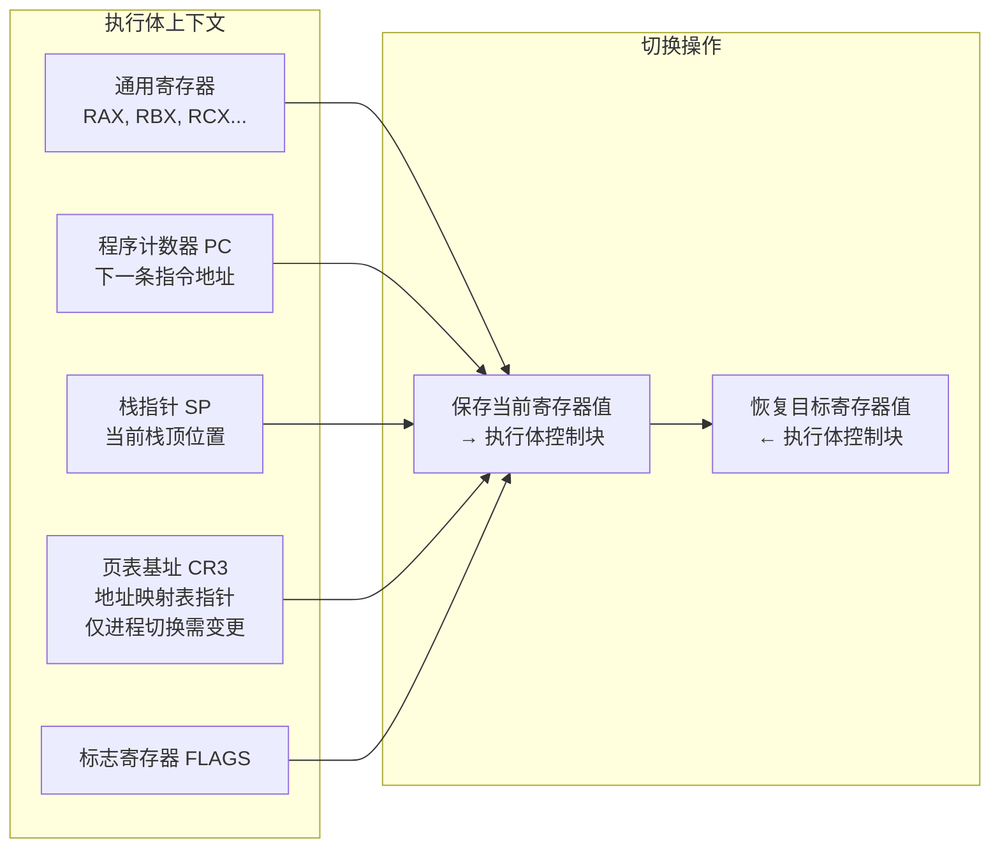

---

## 进程、线程与协程的层次体系

### 三类执行体的层次关系

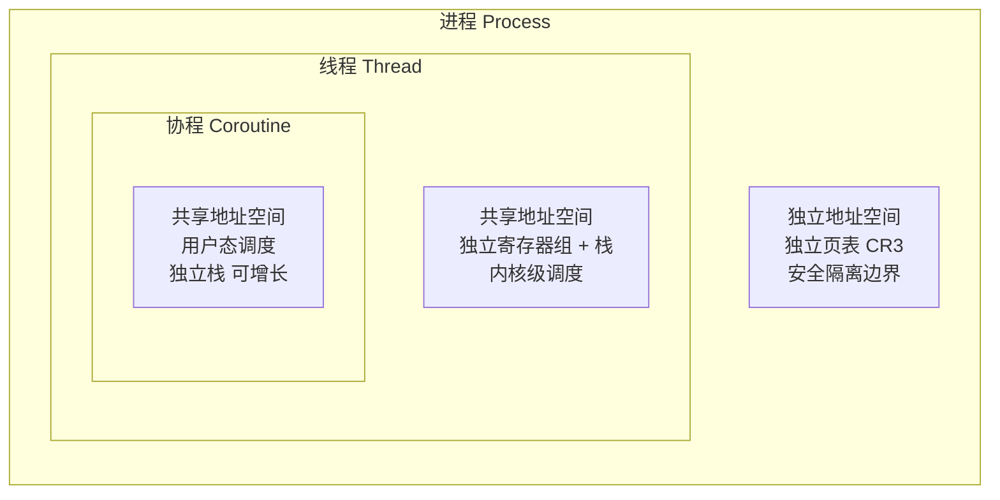

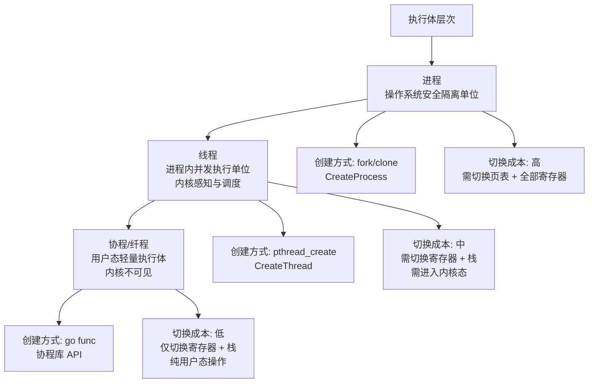

### 进程：安全隔离的边界

进程是操作系统从 **安全角度** 设定的隔离单位，不同进程之间遵循 **最低授权原则**（Principle of Least Privilege）。每个进程拥有独立的虚拟地址空间，通过各自的页表实现内存隔离。

进程创建方式上，UNIX 系与 Windows 系存在根本性的设计分歧：

| 维度 | UNIX (fork) | Windows (CreateProcess) |
|------|-------------|------------------------|
| 语义 | 先 clone 再分支，父子进程各干各的 | 显式创建，参数明确 |
| 上下文继承 | 糊里糊涂全部继承（文件句柄等） | 逐一明确指定哪些句柄需要继承 |
| API 简洁性 | 极简，无需传递大量参数 | 复杂，参数众多 |
| 架构合理性 | **糟糕**——隔离单元不应藕断丝连 | **清晰**——隔离边界干净 |

许式伟对 UNIX fork 的批判极为尖锐：**进程是操作系统最基本的隔离单元，我们怕的就是摘不清楚，但 fork 偏偏要藕断丝连。** 这本质上是设计事故——fork 传递进程上下文的方式是彻头彻尾的过度设计。工程实践表明，除了接管子进程的标准输入输出，几乎从不通过向子进程传递文件句柄来通讯。

fork 的历史合理性在于：早期操作系统没有线程概念，进程同时承担了"需要父进程环境"这一线程级需求。但这不构成其设计合理性的辩护。

### 线程：进程内的并发

线程的出现源于同一软件内部的多任务需求——这些任务处于 **相同的地址空间**，彼此之间 **相互信任**，无需进程级的安全隔离。

线程的关键特征：
- 共享所属进程的地址空间（代码段、数据段、堆）
- 拥有独立的寄存器组和栈
- 由操作系统内核调度，切换需进入内核态
- 线程间通讯无需系统调用，直接通过共享内存

### 协程：用户态的轻量执行体

协程并非操作系统内核提供，而是在 **用户态** 实现的执行体，因此也被称为用户态线程。它的出现源于高性能网络服务器对线程模型的成本不满。

---

## 调度算法与成本分析

### 网络服务器的 IO 模型

理解协程的动机，必须先理解网络服务器的 IO 特征：

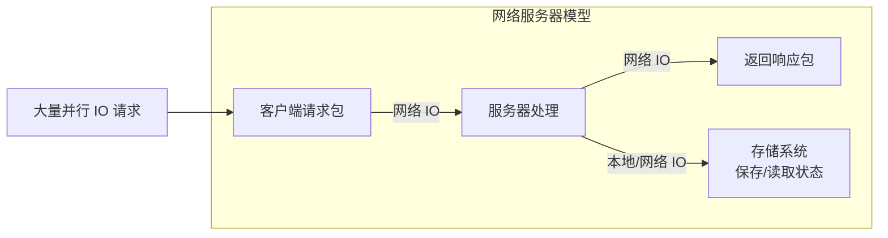

网络服务器充斥着大量并行 IO 请求。操作系统标准网络 IO 的成本构成如下：

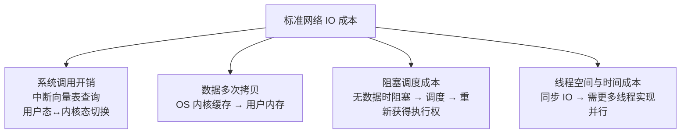

**一个关键澄清**：系统调用本身并不慢。系统调用虽然比函数调用多做了一点事情（查询中断向量表、切换 CPU 执行权限等级），但 **并没有发生调度行为**，归根结底仍是一次函数调用的成本。从内核视角看，它更像一个多线程程序——每个系统调用是来自某个线程的函数调用。

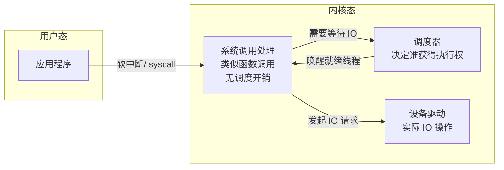

### IO 多路复用：epoll 与 IOCP

为改进网络服务器吞吐能力，主流方案采用 epoll（Linux）或 IOCP（Windows）机制：

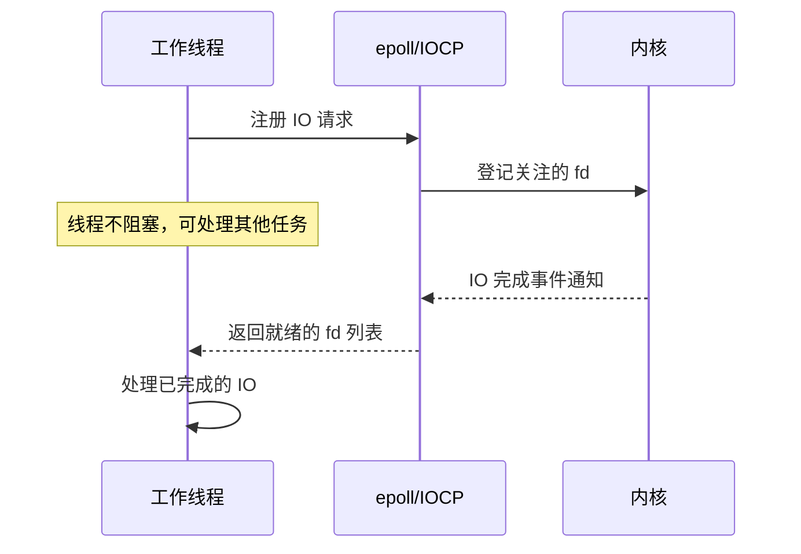

epoll/IOCP 从系统调用次数和内存拷贝角度并未减少，**真正有意义的是减少了线程数量**。线程数量减少意味着调度开销、同步互斥开销和空间开销的全面降低。

### 线程的成本剖析

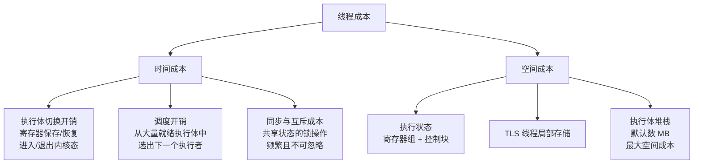

**空间成本是第一根稻草**：Linux 线程默认栈大小在数 MB 级别，1000 个线程即消耗 GB 级内存。虽然栈大小可配置，但出于执行安全性考虑，不能设得太小。

**调度与同步成本是第二根稻草**：单位成本看似可接受，但 IO 密集型场景下调度次数极多，网络服务器的共享状态必然伴随大量同步互斥操作，累积成本不可忽略。

### 调度算法对比

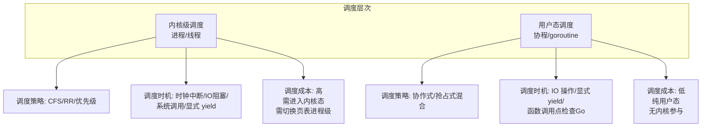

| 调度维度 | 进程调度 | 线程调度 | 协程调度 |
|---------|---------|---------|---------|
| 调度执行者 | 内核 | 内核 | 用户态运行时 |
| 调度策略 | CFS/优先级/RR | 同进程调度 | 协作式为主，Go 辅以抢占 |
| 切换需进入内核 | 是 | 是 | 否 |
| 页表切换 | 是 | 否（同进程线程） | 否 |
| 寄存器保存/恢复 | 全部 | 全部 | 部分 callee-saved |
| 栈切换 | 是 | 是 | 是 |
| 典型切换耗时 | 微秒级 | 微秒级 | 纳秒级 |
| 调度时机 | 时钟中断/阻塞/显式 | 同进程 | IO 阻塞/显式 yield |

---

## 协程与 goroutine：从半吊子到完备方案

### 协程的设计动机

协程为两个核心目标而来：

1. **回归同步 IO 的编程模式**——异步 IO 的回调地狱让程序逻辑碎片化，可读性与可维护性急剧下降
2. **降低执行体的空间成本和时间成本**——线程太重，无法支撑高并发

### 半吊子协程库的通病

大部分协程（纤程）库只实现了协程的创建和执行权切换，缺失大量关键能力：

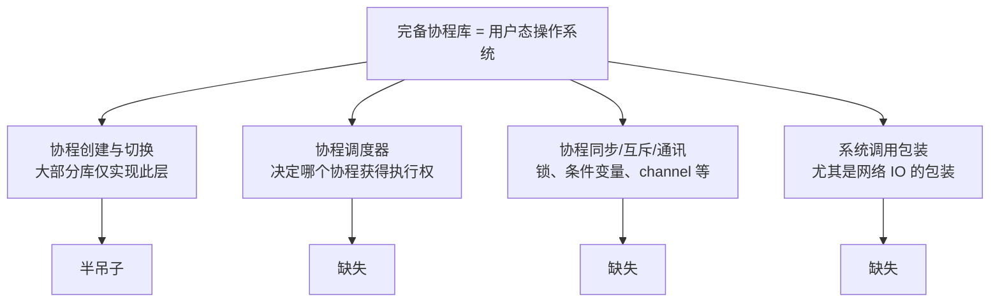

**堆栈问题是协程实现的核心难题**：堆栈太小则可能不够用（栈溢出），太大则空间成本过高（影响并发数）。理想情况下，堆栈大小需要 **按需自动增长**。

因此，一个完备的协程库本质上就是 **用户态的操作系统**，而协程就是其中的"进程"。

### Go 语言的 goroutine：完备协程的典范

世界上完备的协程实现有两个代表：**Erlang**（基于虚拟机）和 **Go 语言**（goroutine）。goroutine 的关键设计决策：

| 设计决策 | 具体实现 | 架构意义 |
|---------|---------|---------|
| 堆栈初始 2K，按需自动增长 | 分段栈/连续栈复制 | 解决栈大小两难问题，极大降低空间成本 |
| 干掉 TLS（线程局部存储） | 不支持协程级局部存储 | 执行体更精简，避免隐式状态依赖 |
| 提供完整的同步/互斥/通讯原语 | Mutex、WaitGroup、Channel 等 | 不依赖操作系统线程级原语 |
| 包装几乎所有重要系统调用 | net 包、os 包等 | IO 操作自动触发协程调度，回归同步编程模型 |

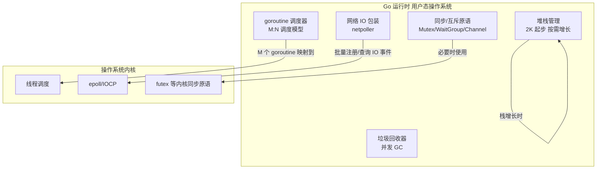

### 并发模型对比

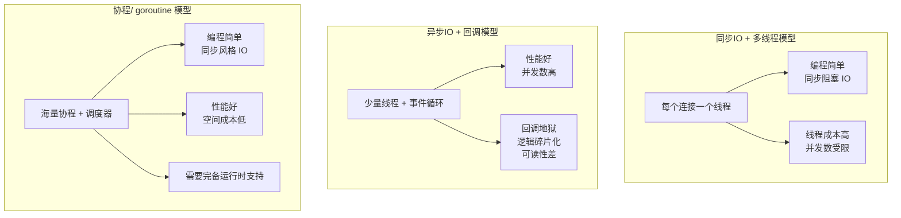

| 并发模型 | 编程复杂度 | 性能上限 | 并发规模 | 代表技术 |
|---------|-----------|---------|---------|---------|
| 同步 IO + 多线程 | 低 | 受线程数限制 | 千级 | 传统 Java/Python 服务器 |
| 异步 IO + 回调 | 高（回调地狱） | 高 | 万级 | Node.js、libevent |
| 异步 IO + async/await | 中 | 高 | 万级 | Python asyncio、Rust tokio |
| 协程/goroutine | 低 | 高 | 百万级 | Go、Erlang |

---

## 设计原则与权衡（Trade-off 分析）

### 隔离性 vs 共享性

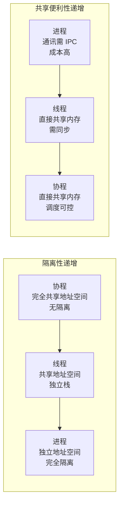

- **进程**：强隔离带来安全性，但进程间通讯（IPC）成本高，需系统调用介入
- **线程**：共享地址空间降低通讯成本，但引入竞态条件，需同步原语保护
- **协程**：共享一切且调度可控，通讯成本最低，但无隔离保护，一个协程崩溃可影响整个进程

### 切换成本 vs 功能完整性

| 执行体 | 切换成本 | 功能完整性 | 适用场景 |
|-------|---------|-----------|---------|
| 进程 | 最高（页表 + 寄存器 + 内核态切换） | 完整（隔离、资源管理、安全） | 需要安全隔离的独立程序 |
| 线程 | 中等（寄存器 + 内核态切换） | 较完整（内核调度、同步原语） | 桌面应用、通用并发 |
| 协程 | 最低（寄存器 + 纯用户态） | 依赖运行时实现 | 高并发网络服务器 |

### 编程模型 vs 性能

异步 IO 回调模型虽然性能优异，但 **反人类的编程体验** 严重制约了其工程实践价值。goroutine 的成功证明了一个关键原则：**编程模型的人体工学（ergonomics）与运行时性能并非不可兼得**，关键在于运行时层的抽象设计。

### fork 的设计失误：便利性 vs 正确性

UNIX fork 的设计体现了"便利性优先于正确性"的决策失误。进程作为隔离单元，其创建接口应当 **显式且精确** 地定义父子进程间的资源继承关系，而非默认全量继承后再逐一关闭。Windows 的 CreateProcess 虽然参数繁多，但在架构合理性上远优于 fork。

这一教训具有普遍意义：**隔离边界的接口设计，宁可繁琐也要精确，不可为便利而模糊边界。**

---

## 实践案例与反模式

### 反模式 1：用线程模型构建高并发网络服务器

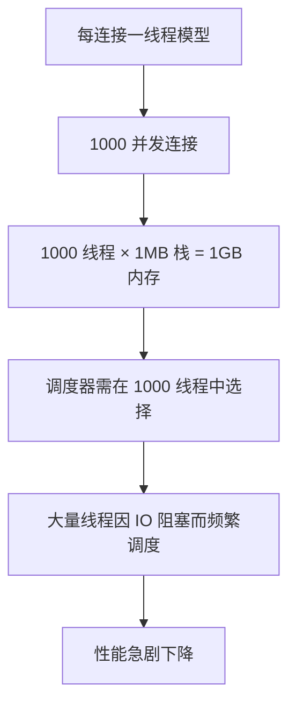

这是 C10K 问题的经典根源。当并发连接数达到万级时，线程模型的资源消耗和调度开销成为瓶颈。

### 反模式 2：半吊子协程库的陷阱

许多项目引入协程库只为了"轻量级线程"的噱头，却忽略了：

- 协程内执行阻塞式系统调用（如同步 read/write）会 **阻塞底层线程**，导致同一线程上的所有协程无法运行
- 缺少 IO 多路复用包装，协程退化为协作式线程，无法自动让出执行权
- 缺少同步原语，开发者被迫混用线程级锁，导致死锁或性能退化

**正确做法**：要么使用完备的协程运行时（如 Go），要么老老实实用异步 IO + 回调/async-await。

### 实践案例：goroutine 的 M:N 调度模型

Go 运行时采用 M:N 调度模型——M 个 goroutine 映射到 N 个操作系统线程。其核心优势：

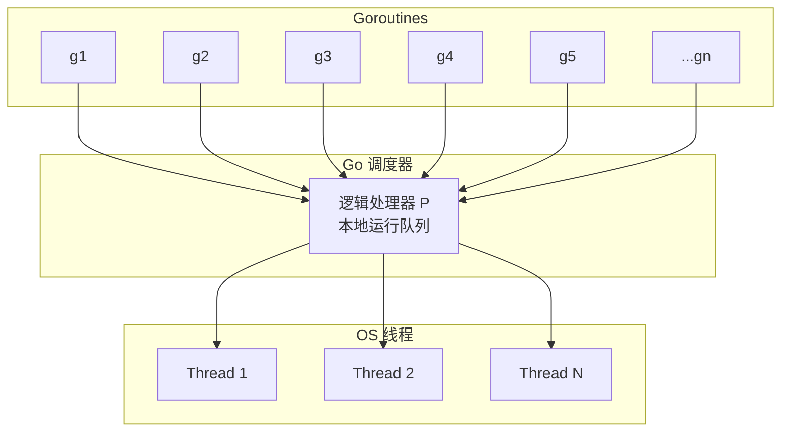

- goroutine 因网络 IO 阻塞时，不阻塞底层线程，而是将该 goroutine 挂起，线程继续运行其他 goroutine
- 当 IO 完成时，netpoller 通知调度器唤醒对应 goroutine
- 开发者使用同步风格的代码，运行时自动实现异步 IO 的效果

### 反模式 3：fork 后不清理继承的文件句柄

```c
// 反模式：fork 后未关闭不需要的文件描述符
pid_t pid = fork();
if (pid == 0) {
    // 子进程继承了父进程所有 fd
    // 但子进程只需要 stdin/stdout
    // 其他 fd（如监听 socket、日志文件）成为资源泄漏
    // 更危险的是：可能导致文件锁无法释放、端口无法复用
    do_child_work();
}
```

正确做法是 fork 后立即关闭所有不需要的 fd，或使用 `close-on-exec` 标记。但这恰恰证明了 fork 默认继承的设计是错误的——它把本应由创建者显式指定的责任，推给了子进程的开发者去"清理"。

---

## 小结与关键要点

### 关键要点

1. **执行体的上下文本质是寄存器值的集合**。无论进程、线程还是协程，切换执行体的核心操作都是保存和恢复寄存器值。进程切换额外需要切换页表基址寄存器（CR3），这是其成本高于线程切换的根本原因。

2. **进程、线程、协程构成隔离性递减、轻量性递增的层次体系**。进程是安全隔离边界，线程是进程内并发单位，协程是用户态轻量执行体。选择哪一层执行体，取决于对隔离性、并发规模和编程模型的权衡。

3. **UNIX fork 是架构设计失误的典型案例**。进程作为隔离单元，其创建接口应当精确定义资源继承关系，而非默认全量继承。这一教训具有普遍意义：隔离边界的接口设计，便利性不能凌驾于正确性之上。

4. **协程的完备性决定了其实用价值**。半吊子协程库只实现了创建和切换，缺少调度、同步、IO 包装等关键能力。Go 语言的 goroutine 之所以成功，在于它构建了一个完备的"用户态操作系统"——2K 起步可增长栈、无 TLS、完整同步原语、全量系统调用包装。

5. **编程模型的人体工学与运行时性能可以兼得**。goroutine 证明了同步编程风格 + 高性能异步 IO 并非矛盾，关键在于运行时层的抽象——M:N 调度模型与 netpoller 的结合，让开发者以同步风格编写代码，运行时自动实现异步 IO 的效果。

---

> **交叉参考**：
> - [04-内存管理](04-内存管理.md)：保护模式下进程的独立地址空间与页表机制，是理解进程切换成本的基础
> - [02-操作系统内核与态切换](02-操作系统内核与态切换.md)：系统调用的实现机理（软中断、Ring 0/3 切换），是理解线程切换为何需进入内核态的前提
> - [11-进程间通信：进程间通信都有哪些方法](11-进程间通信：进程间通信都有哪些方法.md)：进程间通讯机制（IPC）与执行体间同步原语（锁、条件变量、channel）的详细讨论
