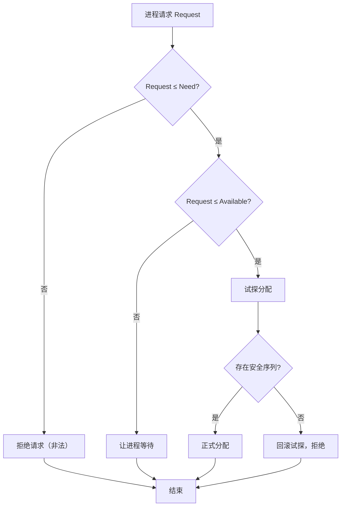

# 死锁：必要条件、检测与避免

多进程并发访问共享资源时可能陷入**死锁（Deadlock）**——彼此等待对方占有的资源而无法推进。本文整理死锁的四个必要条件、资源分配图、检测恢复，以及银行家算法等避免策略。

## 一、什么是死锁

死锁指一组进程**各自持有一部分资源，同时又在等待对方占有的资源**，导致谁都无法继续执行。死锁不是进程"卡死"，而是资源分配形成的循环等待。

## 二、死锁的四个必要条件

死锁发生必须同时满足四个条件（缺一不可）：

1. **互斥（Mutual Exclusion）**：资源一次只能被一个进程占用。
2. **占有并等待（Hold and Wait）**：进程已占有一些资源，又等待其他资源。
3. **不可剥夺（No Preemption）**：资源不能被强行抢占，只能由持有者主动释放。
4. **循环等待（Circular Wait）**：存在进程集合 \(P_0,P_1,\dots,P_n\)，\(P_0\) 等 \(P_1\) 的资源，\(P_1\) 等 \(P_2\) 的资源，…，\(P_n\) 等 \(P_0\) 的资源。

只要破坏其中一个条件，就能防止死锁。操作系统篇（并发控制）中的哲学家就餐问题即循环等待的典型案例。

## 三、资源分配图与死锁检测

**资源分配图（Resource Allocation Graph）** 用有向图建模资源与进程的申请/占有关系：

- 圆节点 = 进程，方节点 = 资源类型（小点表示资源实例）。
- **申请边**：进程 → 资源（进程在等该资源）。
- **分配边**：资源 → 进程（资源已分给该进程）。

**死锁判定**：
- 图中**存在环** → 若每种资源只有单个实例，环即死锁；
- 若资源有多个实例，有环不一定死锁，需进一步分析。

**死锁检测**：周期性地构造资源分配图并检测环，检测到后执行恢复。

## 四、死锁的恢复

检测到死锁后：

- **进程终止**：终止一个或多个死锁进程，释放资源。
  - 可终止所有死锁进程（彻底但损失大），或逐个终止直到环解除。
- **资源抢占**：从死锁进程强占资源分给其他进程，需回滚进程到安全点。

## 五、死锁的预防（破坏必要条件）

- **破坏互斥**：一般无法破坏（资源本质互斥，如打印机）。
- **破坏占有并等待**：进程一次性申请所需全部资源；缺点是资源利用率低、可能长期阻塞。
- **破坏不可剥夺**：进程申请不到时释放已占资源；实现复杂、易活锁。
- **破坏循环等待**：**给资源编号，进程按编号递增顺序申请**。只能申请比已持编号更大的资源，消除循环等待。

## 六、死锁的避免：银行家算法

**避免**不同于预防——不是限制申请方式，而是在每次分配前**判断是否处于安全状态**，不安全则不分配。

### 安全状态与安全序列

- **安全状态**：存在一个执行顺序（安全序列），使每个进程都能在有限时间内获得所需资源并完成。
- 若分配后仍存在安全序列，则为安全分配；否则拒绝分配，让进程等待。

### 银行家算法（Banker's Algorithm）

类比银行贷款：银行不能让所有借款同时透支。数据结构：

- `Available`：每种资源可用数。
- `Max`：每个进程最大需求。
- `Allocation`：每个进程已分配。
- `Need = Max - Allocation`：每个进程还缺多少。

**资源分配检查**：
1. 进程请求 `Request`，若 `Request <= Need` 且 `Request <= Available` 则继续；
2. **试探分配**：`Available -= Request`，`Allocation += Request`，`Need -= Request`；
3. 执行**安全性检查**：模拟分配后的系统是否仍存在安全序列；
4. 安全则正式分配，不安全则回滚试探、拒绝请求。

银行家算法决策流程：

### 银行家算法的局限

- 需事先知道每个进程的 `Max`（实际难以精确预知）；
- 计算开销大；
- 不适用于互斥量等动态资源。
因此银行家算法多用于教材与教学，工程中常通过锁顺序、超时等策略缓解。

## 七、工程实践中的死锁处理

实际系统（如数据库、分布式系统、编程语言）常用：

- **锁顺序**：所有线程按同一全局顺序加锁，避免循环等待。
- **超时**：获取锁设置超时，超时则回退释放，破坏"占有并等待"。
- **锁粒度最小化**：减少持锁时间，降低死锁概率。
- **可重入/读写锁**：合理设计锁模型。
- 数据库：检测死锁并自动回滚一个事务（对应"恢复"策略）。

## 小结

- 死锁需同时满足互斥、占有并等待、不可剥夺、循环等待四条件。
- 预防靠破坏条件，避免靠分配前判断安全状态（银行家算法）。
- 检测 + 恢复（终止进程/资源抢占）用于无法预防的场景。
- 工程中常用锁顺序、超时、最小化锁粒度来规避死锁。
