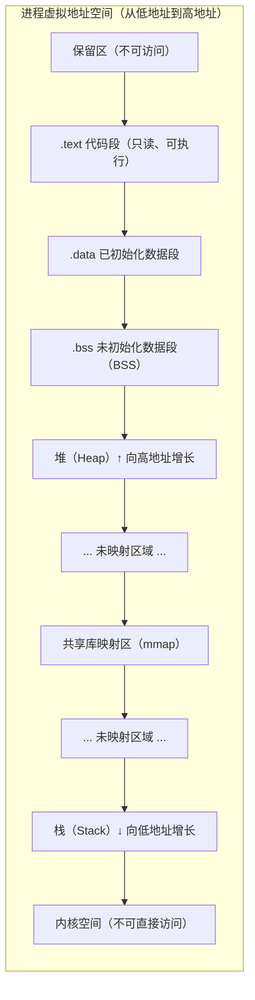
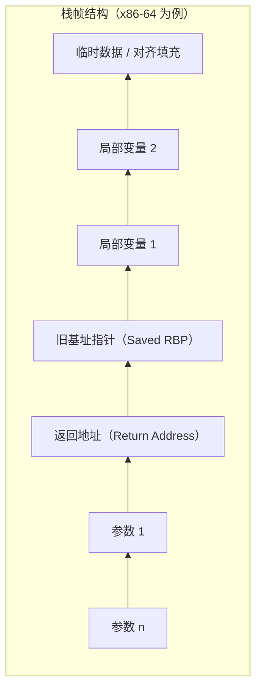
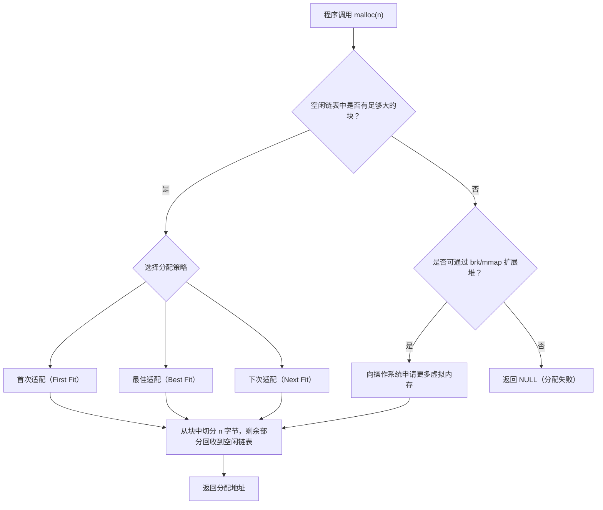
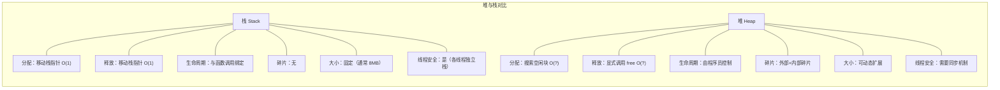
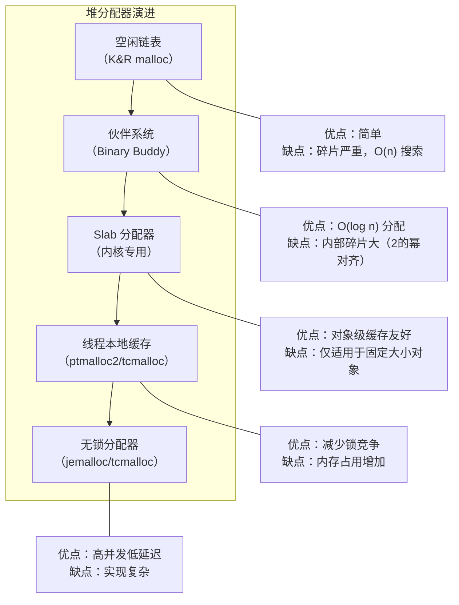
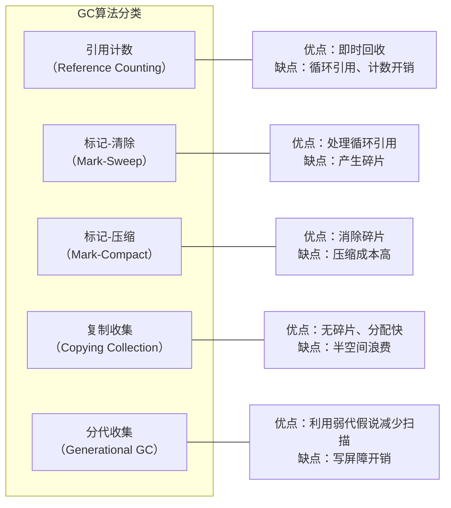
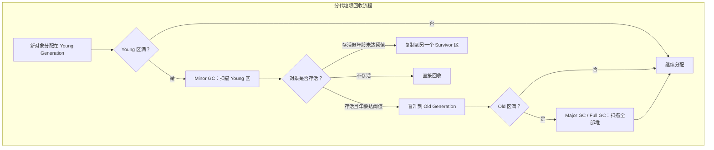
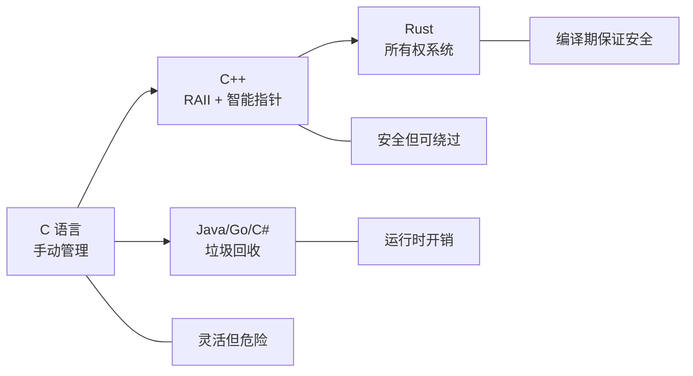

# 内存管理-堆与栈

## 章节导言

内存是 CPU 唯一可以直接访问且与程序员直接打交道的基础资源。在 [04-内存管理](04-内存管理.md) 与 [07-CPU篇-进程与线程](07-CPU篇-进程与线程.md) 中，我们已从操作系统的视角讨论了实模式与保护模式下的内存管理机制，包括虚拟内存、分页与缺页中断等核心概念。本节则聚焦于内存管理的另一个维度：**从程序运行时的视角，内存如何被组织为堆与栈两种根本不同的分配模型，以及各自的工程权衡。**

理解堆与栈的本质差异，不仅关乎写出正确的程序，更关乎理解操作系统、编程语言运行时与硬件之间的协作边界。

## 核心概念与原理

### 进程地址空间布局

在保护模式下，每个进程拥有独立的虚拟地址空间。操作系统在加载进程时，将虚拟地址空间划分为若干功能区域，形成经典的进程内存布局：



该布局的关键特征：

- **代码段**（.text）：存放编译后的机器指令，通常标记为只读可执行
- **数据段**（.data/.bss）：存放全局变量和静态变量，.data 含初始值，.bss 仅为零值预留空间
- **堆**（Heap）：动态分配区域，从低地址向高地址增长（brk/sbrk 或 mmap 扩展）
- **mmap 区域**：内存映射文件与共享库的加载区域
- **栈**（Stack）：函数调用栈，从高地址向低地址增长
- **内核空间**：所有进程共享，用户态不可直接访问（参见 [05-CPU篇-进程与中断](05-CPU篇-进程与中断.md)）

### 栈：函数调用的基础设施

栈的本质是一种**后进先出（LIFO）**的数据结构，服务于函数调用机制。每一次函数调用，在栈上分配一个**栈帧（Stack Frame）**，用于保存该次调用的上下文信息。



栈帧的核心组成：

| 组成部分 | 说明 |
|---------|------|
| 函数参数 | 调用者压入的实参（x86-64 前六个参数通过寄存器传递） |
| 返回地址 | `call` 指令自动压入，`ret` 指令弹出跳转 |
| 旧基址指针 | 保存调用者的 RBP，用于栈帧回溯（调试器、异常处理依赖此机制） |
| 局部变量 | 被调函数内声明的自动变量 |
| 临时数据 | 编译器生成的中间结果 |

**栈的关键特性：**

1. **分配与释放零开销**：移动栈指针（RSP）即可完成分配/释放，无需搜索空闲块
2. **严格的 LIFO 语义**：后调用的函数必须先返回，保证了内存访问的确定性
3. **缓存友好**：栈内存连续分配，对 CPU 缓存行极度友好
4. **大小受限**：Linux 默认线程栈大小约 8MB，超出触发栈溢出（Stack Overflow）

### 堆：动态分配的灵活性

堆是用于满足**运行时才确定大小和生命周期的内存分配需求**的区域。与栈的确定性分配不同，堆上的分配必须解决一个经典问题：**如何在任意顺序的分配与释放中，高效管理空闲内存？**



**堆分配的核心挑战：**

1. **外部碎片**（External Fragmentation）：空闲内存总量足够，但无法满足一个连续分配请求
2. **内部碎片**（Internal Fragmentation）：分配的块大于请求的大小，造成浪费
3. **分配延迟**：需要搜索空闲链表或伙伴系统，时间复杂度不确定
4. **并发安全**：多线程环境下，堆分配器需要加锁或使用线程本地缓存

### 堆与栈的本质对比



| 维度 | 栈 | 堆 |
|------|-----|-----|
| 分配速度 | O(1)，移动指针 | O(n) 最坏，实际取决于分配器 |
| 释放速度 | O(1)，函数返回自动释放 | 显式调用 free/delete |
| 生命周期 | 确定性（随函数调用） | 不确定性（由程序员或 GC 决定） |
| 碎片问题 | 无 | 内部碎片 + 外部碎片 |
| 大小限制 | 固定（编译时或线程创建时确定） | 动态（受虚拟地址空间限制） |
| 缓存性能 | 极佳（连续访问） | 较差（分散访问） |
| 安全性 | 栈溢出风险 | 悬垂指针、双重释放、内存泄漏 |

## Mermaid 可视化

### 堆分配器的演进

从简单的空闲链表到现代的高性能分配器，堆管理的演进反映了工程权衡的变迁：



### 垃圾回收算法对比

对于托管语言（Java、Go、C# 等），堆内存的释放由垃圾回收器（GC）自动完成。主流 GC 算法各有优劣：





**Go 语言的 GC 演进**（与 [13-多任务-进程、线程与协程](13-多任务-进程、线程与协程.md) 中 goroutine 的设计理念一脉相承）：

- Go 1.0：Stop-The-World 标记-清除，延迟不可接受
- Go 1.5：并发三色标记清除，大幅降低 STW 时间
- Go 1.8+：混合写屏障，STW 时间降至亚毫秒级

## 设计原则与权衡

### 原则一：栈优先，堆兜底

**核心原则：能用栈就不用堆。** 栈分配的零开销和缓存友好性使其成为首选。只有以下情况才应使用堆分配：

- 对象大小在编译时无法确定（如变长数组、动态容器）
- 对象生命周期超出函数调用范围
- 对象需要在线程间共享

### 原则二：所有权与生命周期的显式化

C 语言通过程序员自律管理堆内存，代价是悬垂指针和内存泄漏。C++ 引入 RAII（Resource Acquisition Is Initialization）和智能指针，将生命周期与对象作用域绑定。Rust 则进一步通过所有权系统在编译期静态检查生命周期，从根本上消除了数据竞争和悬垂指针。



### 原则三：分配器的线程扩展性

在多线程环境下，传统 malloc 的全局锁成为瓶颈。现代分配器通过以下策略提升并发性能：

| 分配器 | 策略 | 适用场景 |
|--------|------|---------|
| ptmalloc2 (glibc) | 多 arena + 空闲链表 | 通用 |
| tcmalloc | 线程本地缓存 + 中央堆 | 高并发短生命周期分配 |
| jemalloc | 多 arena + 分大小类管理 | 高并发、大内存 |
| hoard | 超额分配减少锁竞争 | 学术验证充分 |

### Trade-off 分析：GC vs 手动管理

| 维度 | 手动管理 | 垃圾回收 |
|------|---------|---------|
| 吞吐量 | 更高（无 GC 暂停） | 受 GC 暂停影响 |
| 延迟确定性 | 可控 | 不可控（STW） |
| 开发效率 | 低（需手动管理） | 高（自动管理） |
| 内存占用 | 精确 | 通常高出 2-5 倍（分代 GC 需要额外空间） |
| 安全性 | 悬垂指针/泄漏风险 | 无悬垂指针，但可能有内存泄漏（逻辑层面） |

## 实践案例与反模式

### 反模式一：栈上分配大数组

```c
// 危险：默认栈大小仅 8MB，大数组极易栈溢出
void dangerous() {
    int big_array[1000000];  // 4MB，接近栈限制
    // ...
}
```

正确做法：使用堆分配或 `static` 修饰符将数据移至数据段。

### 反模式二：堆内存泄漏

```c
// 每次循环分配内存，但只释放最后一个
for (int i = 0; i < 1000; i++) {
    char *buf = malloc(1024);
    // ... 使用 buf ...
    if (i == 999) free(buf);  // 其余 999 次分配全部泄漏
}
```

### 反模式三：在热路径中使用堆分配

```c
// 频繁调用的函数中使用 malloc/free
void hot_path() {
    char *temp = malloc(64);  // 每次调用都要搜索空闲块 + 可能触发系统调用
    // ... 使用 temp ...
    free(temp);
}
```

优化策略：使用栈分配、对象池（Object Pool）或线程本地缓存。

### 实践案例：goroutine 的栈管理

Go 语言为 goroutine 设计了可动态增长的栈，初始仅 2KB（Go 1.4 起），按需扩展。其核心实现采用**分段栈（Segmented Stack，早期）**到**连续栈（Contiguous Stack，Go 1.3+）**的演进：

- **连续栈**：当栈空间不足时，分配一块两倍大小的新栈，将旧栈数据复制过去，并更新所有指向旧栈的指针
- **栈收缩**：当栈使用率低于 1/4 时，分配一块一半大小的新栈并复制

这一设计直接支持了 Go 语言创建百万级 goroutine 的能力，参见 [13-多任务-进程、线程与协程](13-多任务-进程、线程与协程.md)。

## 小结与关键要点

1. **栈是函数调用的基础设施，堆是动态分配的灵活性保障**。两者服务于截然不同的内存需求模式，理解其差异是编写高性能、高可靠程序的前提。

2. **栈分配 O(1) 且缓存友好，但大小受限；堆分配灵活但引入碎片、延迟与并发挑战**。工程实践中应遵循"栈优先"原则。

3. **垃圾回收消除了手动管理的常见错误，但引入了运行时开销和延迟不确定性**。分代 GC 利用"弱代假说"（大多数对象朝生夕死）优化扫描效率，是现代托管语言的标配。

4. **分配器的选择直接影响多线程程序的性能**。从 ptmalloc2 到 tcmalloc/jemalloc，演进方向是减少锁竞争、提升线程扩展性。

5. **内存管理的终极权衡是安全性 vs 性能 vs 开发效率**。从 C 的手动管理，到 C++ 的 RAII，到 Rust 的所有权，到 Go/Java 的 GC，每种方案都在这个三维空间中选择了不同的位置。
