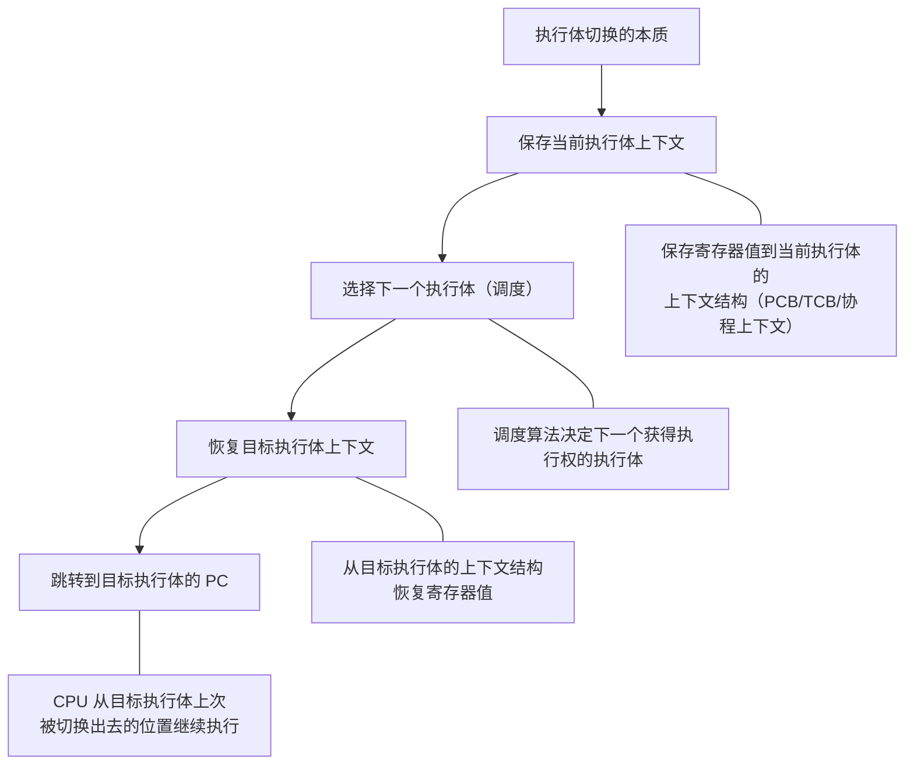
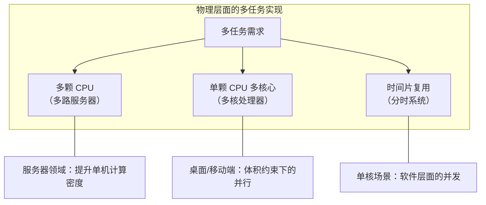
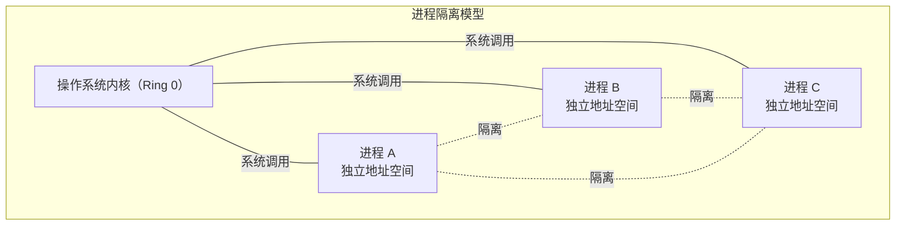
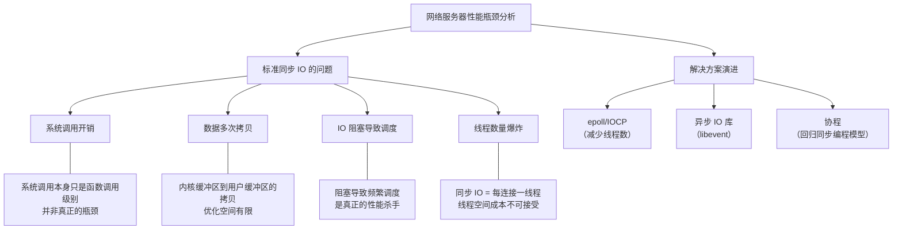
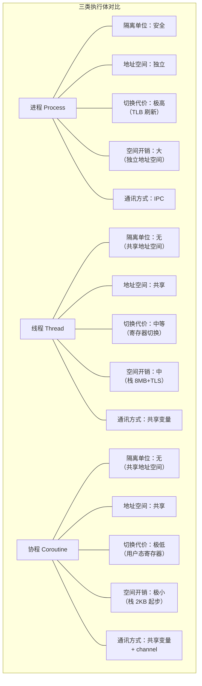
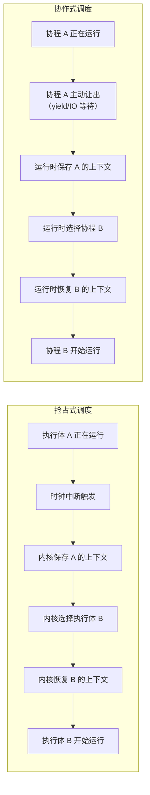
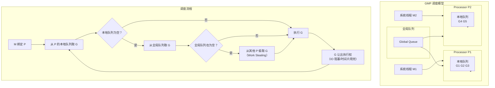
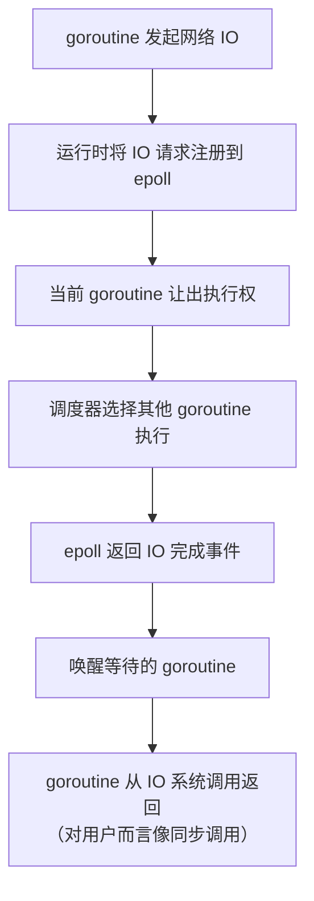
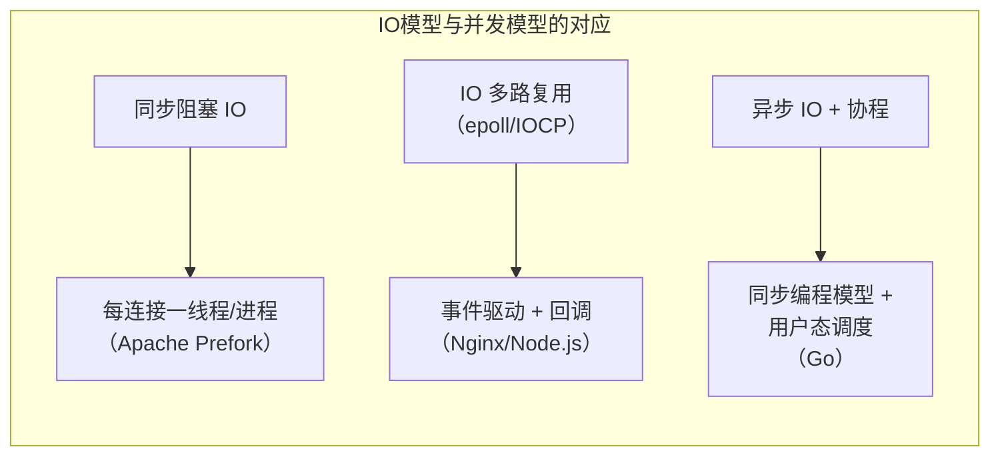

# 多任务-进程、线程与协程

## 章节导言

CPU + 存储 + 输入输出，构成了软件运行的基础硬件设施。在 [12-内存管理-堆与栈](12-内存管理-堆与栈.md) 和 [16-文件系统-对象与索引](16-文件系统-对象与索引.md) 中，我们讨论了存储管理；在 [12-内存管理-堆与栈](12-内存管理-堆与栈.md) 中，我们分析了内存的运行时组织。现在，我们转向计算资源的调度问题：**当多个软件需要共享同一颗 CPU 时，如何实现多任务？**

本节将深入分析进程、线程与协程三类执行体的设计动机、实现机制与工程权衡，并重点讨论 Go 语言的 goroutine 为何选择在用户态重新实现执行体与 IO 子系统。

## 核心概念与原理

### 执行体：统一的抽象

进程、线程与协程，本质上都是"可被 CPU 赋予执行权的对象"——我们统称为**执行体**。执行体的核心状态包括：

- **下一个执行位置**（程序计数器 PC）：获得执行权后从何处继续执行
- **运行状态**（寄存器集合）：所有通用寄存器、浮点寄存器、状态寄存器的值
- **地址空间映射**（页表基址寄存器）：决定该执行体可见的内存范围
- **栈指针**：指向当前执行体的调用栈

**关键洞察：执行体的上下文，就是一堆寄存器的值。要切换执行体，只需要保存和恢复一堆寄存器的值即可。**无论是进程、线程还是协程，切换的本质完全相同——区别仅在于保存哪些寄存器、切换哪些映射。



### 物理层面的多任务

在讨论软件层面的执行体之前，先理解硬件层面的并行能力：



- **多颗 CPU**：服务器领域常用，追求单机计算密度最大化
- **多核处理器**：桌面和移动端的主流方案，在体积约束下提供并行能力
- **分时系统**：单核场景下，通过时间片轮转实现逻辑上的并发

### 进程：安全隔离的执行体

进程是操作系统从**安全角度**定义的隔离单位。不同进程之间遵循最低授权原则（Principle of Least Privilege），通过独立的虚拟地址空间实现内存隔离。



**进程的代价：**

| 维度 | 开销 |
|------|------|
| 创建 | fork 拷贝页表（COW 优化后仍需复制页表结构） |
| 切换 | 切换地址空间（刷新 TLB，代价极高） |
| 通讯 | 必须通过 IPC 机制（管道、共享内存、套接字等） |
| 空间 | 每个进程独立的地址空间，内存占用大 |

**fork 的设计批判：** UNIX 的 fork 语义（先 clone 再分支）是架构设计中的反面教材。进程作为最基本的隔离单元，理应明确子进程需要继承哪些资源，而非糊里糊涂地继承父进程的全部上下文。Windows 的 CreateProcess 在这一点上远为清晰——逐一声明子进程需要的文件句柄。许式伟认为：**fork 是 UNIX 操作系统设计中最糟糕的 API，没有之一。** 它是彻头彻尾的过度设计，甚至可以说是设计事故。

### 线程：共享地址空间的执行体

线程的出现源于同一进程内的多任务需求。同一进程内的多个线程共享地址空间，彼此之间可以信任，因此无需隔离开销。


**线程的代价分析：**

时间成本：
- 执行体切换：寄存器保存/恢复，优化空间极小
- 调度开销：在大量就绪线程中选出下一个执行者
- 同步互斥：共享状态的锁竞争

空间成本：
- 执行状态（TCB）
- TLS（线程局部存储）
- **栈**（最大项，Linux 默认约 8MB）

**核心问题：** 如果一个线程 1MB（栈占大头），1000 个线程就已经达到 GB 级别。对于需要处理海量并发连接的网络服务器，线程模型的空间成本不可接受。

### 协程：用户态的轻量执行体

协程（Coroutine，也叫纤程 Fiber）是运行在用户态的执行体，不由操作系统内核管理。其出现动机直指网络服务器的性能瓶颈。



**epoll/IOCP 的局限：** 虽然减少了线程数量，但引入了异步回调编程模型，使程序逻辑碎片化，极大增加了编程复杂度。

**协程的双重目标：**
1. 回归同步 IO 的编程模型（可读性、可维护性）
2. 降低执行体的空间成本和时间成本（可扩展性）

## Mermaid 可视化

### 三类执行体对比



| 维度 | 进程 | 线程 | 协程 |
|------|------|------|------|
| 切换位置 | 内核态 | 内核态 | 用户态 |
| 地址空间 | 独立 | 共享 | 共享 |
| 切换代价 | 高（TLB flush） | 中（寄存器保存） | 低（用户态寄存器） |
| 栈大小 | 独立完整地址空间 | ~8MB | ~2KB（可增长） |
| 调度方式 | 抢占式 | 抢占式 | 协作式/抢占式 |
| 创建数量 | 百级 | 千级 | 百万级 |
| 通讯成本 | 高（IPC） | 低（共享内存） | 极低（共享/channel） |

### 调度模型：抢占式 vs 协作式



**抢占式调度**的核心问题：需要硬件时钟中断的支持，切换必须进入内核态。

**协作式调度**的核心问题：一个不协作的协程（如死循环）会阻塞整个线程。Go 语言从 1.14 开始引入基于信号的抢占式调度作为补充。

### goroutine 的调度流程

Go 语言的 GMP 模型是协程调度的典范实现：



GMP 模型的关键设计：

- **G（Goroutine）**：用户态执行体，初始栈 2KB（Go 1.4 起），可按需增长
- **M（Machine）**：操作系统线程，真正执行计算的载体
- **P（Processor）**：逻辑处理器，数量通常等于 CPU 核心数，持有本地运行队列
- **Work Stealing**：当某个 P 的本地队列空闲时，从其他 P 的队列尾部偷取 G，实现负载均衡

### goroutine 的核心设计决策

Go 语言的 goroutine 之所以能称为"完备的协程"，在于它不仅仅实现了协程的创建和切换，而是构建了一套完整的用户态操作系统：

1. **栈的可增长性**：初始 2KB（Go 1.4 起），按需自动增长（连续栈机制），解决了协程栈太小不够用、太大浪费空间的困境
2. **去除 TLS**：坚决不支持线程局部存储，让执行体更加精简，也避免了 TLS 带来的隐式状态耦合
3. **完备的同步原语**：Mutex、RWMutex、WaitGroup、Cond、Once 等，覆盖所有同步互斥场景（参见 [16-文件系统-对象与索引](16-文件系统-对象与索引.md)）
4. **Channel 通讯**：基于 CSP 模型的类型安全管道，是"不要通过共享内存来通信，而要通过通信来共享内存"理念的载体
5. **IO 子系统包装**：几乎所有系统调用（尤其是网络 IO）都被包装为非阻塞版本，在 goroutine 层面呈现同步语义



## 设计原则与权衡

### 原则一：隔离粒度决定执行体选择

| 隔离需求 | 推荐执行体 | 理由 |
|----------|-----------|------|
| 安全隔离（不可信代码） | 进程 | 独立地址空间提供硬隔离 |
| 并发加速（可信代码） | 线程/协程 | 共享地址空间避免 IPC 开销 |
| 海量并发（IO 密集型） | 协程 | 空间成本极低，可创建百万级 |

### 原则二：IO 模型决定并发模型



### Trade-off 分析：半吊子协程 vs 完备协程

许多语言和库提供了协程支持（Python 的 generator、C++20 的协程、Kotlin 的协程），但大多数只是"半吊子"——只实现了协程的创建和切换，缺失了：

| 缺失项 | 后果 |
|--------|------|
| 协程调度 | 无法公平分配 CPU 时间，可能饥饿 |
| 同步互斥原语 | 无法安全地共享状态 |
| IO 系统调用包装 | 阻塞 IO 仍会阻塞整个线程 |
| 可增长栈 | 栈溢出或空间浪费 |

**一个完备的协程库，本质上就是用户态的操作系统。** Erlang 和 Go 是仅有的两个实现了完备协程的语言运行时。

### Trade-off 分析：fork vs CreateProcess vs URL Scheme

| 机制 | 优点 | 缺点 | 评价 |
|------|------|------|------|
| UNIX fork | 使用简洁 | 隐式继承全部上下文，藕断丝连 | 过度设计 |
| Windows CreateProcess | 显式声明继承资源 | 参数多，使用复杂 | 架构清晰 |
| iOS URL Scheme | 极度简化，进程间能力调用 | 灵活性受限 | 做了正确的减法 |

许式伟的观点：进程至少应是子系统级别的边界，进程间协同应该基于规格（接口），而非实现框架。iOS 大刀阔斧砍掉大部分 IPC 机制，恰是对架构本质的回归。

## 实践案例与反模式

### 反模式一：用线程数衡量并发能力

错误地认为"线程越多，并发能力越强"。实际上，线程数超过 CPU 核心数后，过多的线程反而因调度开销和缓存失效导致性能下降。

### 反模式二：协程中调用阻塞 IO

```go
// 错误：在 goroutine 中调用 C 语言的阻塞 IO
// 这会阻塞底层的 M 线程，导致 P 无法调度其他 G
go func() {
    C.blocking_read(fd)  // 阻塞 M，影响同 P 上的所有 G
}()
```

正确做法：使用 Go 运行时包装过的 net 包，而非直接调用 C 的阻塞 IO。

### 反模式三：在协程间共享可变状态而不加同步

```python
# Python asyncio 中错误地共享可变状态
counter = 0
async def increment():
    global counter
    counter += 1  # 虽然单线程，但 await 点之间可能被打断
```

即使是协程（单线程），也必须在 await/yield 点考虑数据一致性。

### 实践案例：从 Apache 到 Nginx 到 Go 的演进

| 服务器 | 并发模型 | C10K 能力 | 编程复杂度 |
|--------|---------|----------|-----------|
| Apache (Prefork) | 每连接一进程 | 差（进程开销大） | 低 |
| Apache (Worker) | 每连接一线程 | 中（线程开销中等） | 低 |
| Nginx | epoll + 事件驱动 | 优 | 高（异步回调） |
| Go Server | goroutine + 同步 IO | 优 | 低（同步编程模型） |

Go 的方案同时获得了 Nginx 的性能和 Apache 的编程简洁性，这正是 goroutine 设计的精髓所在。

## 小结与关键要点

1. **执行体的切换本质是寄存器的保存与恢复**。进程、线程、协程的区别不在于切换机制本身，而在于切换哪些寄存器、是否涉及地址空间切换、由谁（内核/用户态）负责调度。

2. **进程是安全隔离单位，线程是并发执行单位，协程是轻量并发单位**。三者满足不同的需求层次，选择取决于隔离需求、并发规模和 IO 模式。

3. **goroutine 是完备协程的典范**：可增长栈、去除 TLS、完备同步原语、IO 子系统包装、channel 通讯。它本质上是一个用户态操作系统，使开发者可以用同步编程模型获得异步 IO 的性能。

4. **fork 是架构设计的反面教材**。进程作为最基本的隔离单元，应明确声明继承关系，而非隐式继承全部上下文。iOS 的 URL Scheme 和 Windows 的 CreateProcess 是更好的设计。

5. **多任务设计的演进方向是"做减法"**。从五花八门的 IPC 机制到 iOS 的极简模型，从复杂的异步回调到 Go 的同步语义，架构的成熟表现为去除不必要的设计，回归本质需求。
