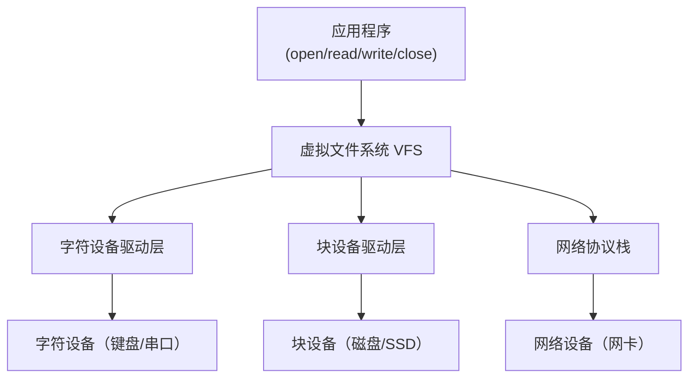

# 设备管理与驱动模型

设备是操作系统需要管理的另一类资源。本文整理设备分类、操作系统的设备抽象（文件系统统一视角）、设备驱动的作用，以及 Linux 设备管理模型（字符/块设备、设备号、I/O 调度）。

## 一、设备分类

按数据传输方式与速度：

- **字符设备（Character Device）**：按字节流读写，如键盘、鼠标、串口、终端。
- **块设备（Block Device）**：按块读写、可随机访问，如磁盘、SSD。
- **网络设备**：以数据包为单位，如网卡（有独立协议栈，Linux 中 net_device 独立管理）。

按共享方式：
- **独占设备**：一次只能一个进程使用（打印机）。
- **共享设备**：可被多进程分时共享（磁盘）。

## 二、设备的抽象：一切皆文件

操作系统的强大抽象是 **"一切皆文件"（Unix 哲学）**：设备也通过文件系统接口访问。

- 每个设备在 `/dev` 下有一个设备文件。
- 应用用普通的 `open/read/write/close` 操作设备。
- 统一接口屏蔽了设备差异：写 `stdout`、读串口、写磁盘，对用户程序而言都是"读/写一个文件"。

设备文件分两类：
- **字符设备文件**：如 `/dev/tty`。
- **块设备文件**：如 `/dev/sda`。

设备的抽象层次：

## 三、设备驱动（Device Driver）

**驱动程序**是内核中与具体硬件打交道的软件，负责：

- 将文件系统的抽象操作（read/write）翻译为硬件控制命令；
- 处理设备中断，把硬件事件转成内核可处理的事件；
- 管理设备寄存器（通过 MMIO/端口 I/O，见 I/O 控制方式篇）。

**分层设计**：上层（VFS 虚拟文件系统、设备独立层）与下层（具体驱动）分离，使新增设备只需实现一个驱动，上层代码无需改动。

## 四、Linux 设备模型

### 设备号与设备文件

- **主设备号（Major）**：标识设备类型，对应某类驱动。
- **次设备号（Minor）**：标识同类中的具体设备。
- `/dev` 下的设备文件通过主/次设备号与内核中的驱动关联。

### VFS 与文件系统接口

Linux 通过**虚拟文件系统（VFS）**统一抽象文件、目录、设备。设备驱动实现 VFS 定义的操作集（`file_operations`）：`open`、`read`、`write`、`ioctl`、`release` 等。用户 `read(fd,...)` 时，VFS 调用对应驱动的 `read` 回调。

### I/O 调度

对于块设备，内核通过 **I/O 调度器**（Linux 中即块层）对请求排序与合并，优化磁盘吞吐：

- **电梯/SCAN 算法**：按扇区顺序移动磁头，减少寻道。
- **完全公平排队（CFQ）**：各进程公平分时（Linux 5.0 起已移除，由 BFQ、mq-deadline、kyber 等多队列调度器取代）。
- 现代 SSD 无寻道开销，多用 **none（多队列直提）/mq-deadline** 调度，顺序性不再重要。

## 五、设备中断与异常处理

设备完成 I/O 后通过**中断**通知内核（见中断与 I/O 控制方式篇）。内核的中断处理分**上半部（硬中断）**与**下半部（软中断/tasklet/工作队列）**：

- 上半部：快速响应，关中断保存必要信息，将耗时操作推迟到下半部。
- 下半部：执行实际数据处理，可被新中断打断。

这种拆分保证了中断响应及时性，又不长时间阻塞其他中断。

## 六、实际设备的操作系统接口

- **磁盘**：块设备，经块层 + I/O 调度 + 驱动访问，支持 DMA 高速传输。
- **网卡**：网络设备，经协议栈（IP/TCP）收发数据包，用 DMA 与中断处理收发。
- **USB/PCIe**：通过总线枚举设备、分配资源，驱动按标准协议交互。

## 小结

- 设备分字符/块/网络三类，操作系统用"一切皆文件"统一抽象。
- 设备驱动是内核与硬件交互的桥梁，通过 VFS 操作集向应用提供统一接口。
- Linux 用主/次设备号管理设备，块层 I/O 调度优化吞吐，中断分上下半部保障实时性。
